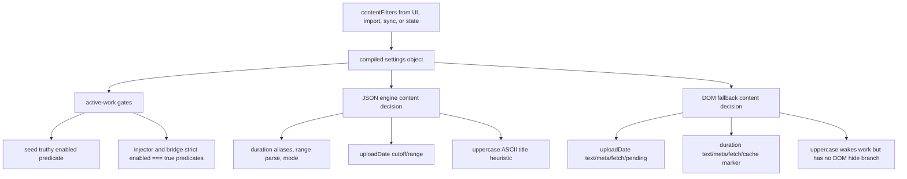
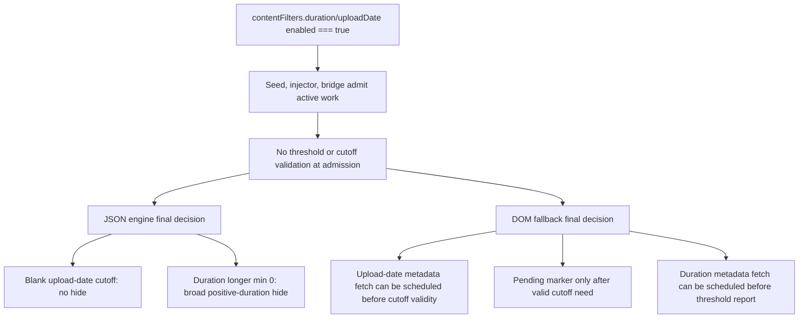

# FilterTube JSON-First Video Meta Content Parity - Current Behavior - 2026-05-22

Status: audit-only current-behavior register. Runtime behavior is unchanged.
This is not an implementation patch, optimization patch, content-filter patch,
DOM patch, network patch, storage patch, or permission to change JSON filtering
behavior.

## Purpose

This register records the current duration and upload-date decision paths after
video metadata is available through `videoMetaMap`. It extends the category
parity and metadata fetch policy proofs by pinning the exact current split
between JSON engine content decisions and DOM fallback content decisions.

The current boundary is:

```text
The JSON engine can read duration and date metadata from videoMetaMap during
content-filter decisions, but it returns only a hide/no-hide decision. DOM
fallback can also read the same metadata, write duration cache markers, schedule
metadata fetches for missing DOM-visible data, and mark cards as pending upload
date metadata before a later recheck.
```

## Source Scope

| Source | Lines | Bytes | SHA-256 |
| --- | ---: | ---: | --- |
| `js/filter_logic.js` | 3652 | 172174 | `953ef0f14970e6cfbc11215fe9eaa078ced34f001908e1c6d5903a8fd2d9a1f5` |
| `js/content/dom_fallback.js` | 5,030 | 235,555 | `fdc4391aed06849c1ba0a9afbb5b05e5e115b0929639e7014738d1462bf13ec5` |
| `js/content_bridge.js` | 13,623 | 603,362 | `c651b34aad0ded2668a5cde55bfd4f499fab098f2f04e9ee0f50c5ede5d47b0c` |

Related proof layers:

- `docs/audit/FILTERTUBE_JSON_FIRST_VIDEO_META_CATEGORY_PARITY_CURRENT_BEHAVIOR_2026-05-22.md`
- `docs/audit/FILTERTUBE_JSON_FIRST_VIDEO_META_FETCH_POLICY_CURRENT_BEHAVIOR_2026-05-22.md`
- `docs/audit/FILTERTUBE_JSON_FIRST_VIDEO_META_DOM_RERUN_CURRENT_BEHAVIOR_2026-05-22.md`
- `docs/audit/FILTERTUBE_CONTENT_CATEGORY_PREDICATE_AUTHORITY_AUDIT_2026-05-18.md`
- `docs/audit/FILTERTUBE_P0_CONTENT_CATEGORY_CURRENT_BEHAVIOR_2026-05-19.md`

## Current Counts

```text
video-meta content parity source files: 3
filter_logic extract duration block lines: 234
filter_logic extract duration block bytes: 11823
filter_logic extract duration videoMetaMap tokens: 4
filter_logic extract duration lengthSeconds tokens: 7
filter_logic extract published time block lines: 126
filter_logic extract published time block bytes: 6495
filter_logic extract published time videoMetaMap tokens: 3
filter_logic extract published time uploadDate tokens: 2
filter_logic extract published time publishDate tokens: 2
filter_logic check content filters block lines: 155
filter_logic check content filters block bytes: 7739
filter_logic content renderer allowlist entries: 19
filter_logic content call block lines: 10
DOM fallback upload-date block lines: 170
DOM fallback upload-date block bytes: 9701
DOM fallback upload-date videoMetaMap tokens: 3
DOM fallback upload-date scheduleVideoMetaFetch tokens: 2
DOM fallback upload-date parseDateMs tokens: 11
DOM fallback duration block lines: 71
DOM fallback duration block bytes: 4480
DOM fallback duration videoMetaMap tokens: 4
DOM fallback duration scheduleVideoMetaFetch tokens: 4
DOM fallback duration cache marker setAttribute callsites: 1
DOM fallback pending metadata block lines: 75
DOM fallback pending metadata block bytes: 4091
DOM fallback pending upload-date attribute tokens: 6
DOM fallback pending metadata setTimeout callsites: 2
content_bridge scheduleVideoMetaFetch body lines: 76
content_bridge scheduleVideoMetaFetch body bytes: 2960
content_bridge scheduleVideoMetaFetch needDuration tokens: 8
content_bridge scheduleVideoMetaFetch needDates tokens: 8
content_bridge scheduleVideoMetaFetch needCategory tokens: 8
runtime video-meta content parity fixtures: 5
runtime behavior changed: no
not completion proof for JSON-first video metadata content authority
```

## Current Decision Matrix

| Consumer | Current input | Missing metadata behavior | Present metadata behavior | Risk boundary |
| --- | --- | --- | --- | --- |
| JSON engine duration path | Renderer item, rules, `settings.videoMetaMap`, duration condition, min/max, mode | Returns no hide decision when duration cannot be extracted from JSON fields, renderer overlays, wrappers, nested videos, or `videoMetaMap`. It does not schedule duration fetch work directly. | In block mode, longer/shorter matches hide. In allow mode for longer/shorter, non-matches hide. For between, outside-range hides regardless of mode. | Duration semantics are local to `_checkContentFilters()` and not reported as a structured decision. |
| JSON engine upload-date path | Renderer item, rules, `settings.videoMetaMap`, date condition, cutoff/range | Returns no hide decision when publish/upload timestamp cannot be extracted from JSON fields, relative-time text, wrappers, nested videos, or `videoMetaMap`. It does not mark pending state. | `newer` and `older` both hide timestamps older than the selected cutoff; `between` hides outside the normalized range. Blank/invalid cutoffs no-op. | The JSON engine has no pending-date marker or fetch report for cold metadata. |
| DOM fallback upload-date path | DOM card, `effectiveSettings.videoMetaMap`, metadata text selectors, aria label, cutoff/range, route | Schedules `scheduleVideoMetaFetch(videoId, { needDuration: false, needDates: true })` when no timestamp exists. It marks pending upload-date metadata only after the selected condition has valid cutoff fields. | Uses the same older-than-cutoff and outside-range semantics as the JSON engine when a timestamp exists. Watch playlist rows without timestamps can hide non-selected rows. | Fetch scheduling happens before the later cutoff-validity check. |
| DOM fallback duration path | DOM card, `extractVideoDuration()`, `effectiveSettings.videoMetaMap`, duration condition, min/max, route/card shape | If visible and cached duration are missing, Kids cards/hosts can request explicit duration fetch and mix-like cards can request default duration fetch. | Cached `lengthSeconds` can be written to `data-filtertube-duration`; longer/shorter/between decisions mirror the JSON engine's block-style duration decision, with no allow-mode branch. | DOM duration ignores the JSON engine duration `mode` field and owns a marker write side effect. |
| DOM pending upload-date marker | `pendingUploadDateMeta`, `shouldHide`, `targetToHide`, `Date.now()` | When pending upload-date metadata is the only reason, writes `data-filtertube-pending-upload-date`, stamps a timestamp, and schedules one recheck at `8000 + 120` ms. | Removes pending upload-date markers when not pending-only or when the prior timestamp is expired. | This marker/timer policy is local to DOM fallback and shared with category pending state. |

## Runtime Fixture Summary

The JSON duration fixture proves that `videoMetaMap.lengthSeconds` can hide in
block mode, allow a matching allow-mode item, and hide a nonmatching allow-mode
item.

The JSON upload-date fixture proves that `videoMetaMap.uploadDate` can hide
older-than-cutoff items, keep newer items visible, and no-op when cutoff fields
are blank.

The DOM upload-date fixture proves DOM fallback uses video metadata when
available, schedules date metadata fetch when missing, and marks pending
upload-date metadata only when the active condition has valid cutoff fields.

The DOM duration fixture proves DOM fallback writes cached duration metadata to
`data-filtertube-duration`, uses it for duration decisions, and schedules
explicit Kids duration fetch or default mix-like duration fetch when metadata is
missing.

The pending upload-date marker fixture proves pending upload-date-only state
writes `data-filtertube-pending-upload-date`, writes a timestamp, schedules a
recheck at 8120 ms, and clears stale markers.

## Risks Identified

- Reliability: JSON content decisions, DOM duration/date decisions, metadata
  fetch scheduling, pending markers, and DOM reruns do not share one content
  decision report.
- False-hide/leak: JSON missing upload-date metadata fails open, while DOM
  fallback can hold pending upload-date markers and hide watch playlist rows
  without timestamps.
- Performance: DOM upload-date scheduling can happen before proving a valid
  cutoff exists, and duration fetches can be requested for Kids even though the
  watch fetcher later returns early on Kids hosts.
- Code burden: duration/date behavior is split across JSON extraction helpers,
  content decision logic, DOM fallback metadata reads, DOM cache markers,
  pending marker timers, and shared watch metadata fetch scheduling.

## Missing Authority Symbols

The following symbols are intentionally absent from current product runtime
source and remain future-work gates:

```text
jsonFirstVideoMetaContentParityContract
jsonFirstVideoMetaDurationDecisionReport
jsonFirstVideoMetaUploadDateDecisionReport
jsonFirstVideoMetaJsonDomContentDecisionReport
jsonFirstVideoMetaUploadDatePendingPolicy
jsonFirstVideoMetaDurationCachePolicy
jsonFirstVideoMetaContentNoWorkBudget
jsonFirstVideoMetaContentFixtureProvenance
jsonFirstVideoMetaContentMetricArtifact
jsonFirstVideoMetaContentRevisionPolicy
```

## Verification

Current proof command:

```bash
node --test tests/runtime/json-first-video-meta-content-parity-current-behavior.test.mjs --test-reporter=spec
```

This register is not a completion claim. It narrows one open JSON-first video
metadata gap into the current JSON engine duration/date decisions, DOM fallback
duration/date decisions, pending upload-date marker behavior, and remaining
content metadata authority gaps only.

## Method Semantic Proof Gap Boundary

`docs/audit/FILTERTUBE_METHOD_SEMANTIC_PROOF_GAP_INDEX_CURRENT_BEHAVIOR_2026-05-25.md`
is a required source input before this video metadata JSON-first boundary can
support runtime optimization or JSON-first promotion. Current proof pins:

```text
method semantic proof gap files covered: 69
method semantic proof gap lexical callables covered: 5701
files with complete per-callable semantic proof: 0
lexical callables requiring semantic proof before behavior changes: 5701
affected callable semantic proof: NO-GO
runtime behavior changed: no
```

These counts are audit-only blockers. They do not approve runtime
optimization, JSON-first behavior, video metadata fetch changes, cache
freshness changes, no-work changes, DOM rerun changes, or whitelist behavior
changes.

## Content Filter Field Semantics Addendum - 2026-05-27

Status: audit-only current-behavior continuation. Runtime behavior is
unchanged. This addendum documents field semantics only; it is not a settings
schema patch, JSON-first promotion patch, DOM fallback patch, no-work patch,
or release approval.

This addendum answers the JSON-first promotion question for duration,
upload-date, and uppercase content filters. The current runtime can already
make JSON content-filter decisions, but the field semantics are not owned by
one first-class contract. JSON, DOM fallback, seed/injector/bridge admission,
and settings ingress each carry a slightly different view of the same
`contentFilters` object.

```text
settings/import/sync/state
        |
        v
compiled contentFilters object
        |
        +--> seed active-work gate: truthy enabled values wake JSON work
        |
        +--> injector/bridge gates: only enabled === true wakes replay/admission
        |
        +--> JSON engine decisions:
        |       duration aliases, value range parsing, allow/block mode
        |       uploadDate absolute cutoff/range checks
        |       uppercase ASCII title heuristic
        |
        +--> DOM fallback decisions:
                uploadDate DOM text, videoMetaMap, fetch scheduling, pending marker
                duration visible text, videoMetaMap, fetch scheduling, cache marker
                uppercase active predicate only; no DOM uppercase hide branch
```



## Content Filter Field Semantics Matrix

```text
content-filter field semantics rows: 8
runtime behavior changed by this addendum: no
content-filter field semantics contract approval: NO-GO
JSON-first first-class content-filter promotion approval: NO-GO
DOM fallback content-filter deletion approval: NO-GO
release/public-claim use approval: NO-GO
```

| Boundary | Current source owner | Current field semantics | JSON-first promotion risk |
| --- | --- | --- | --- |
| Duration JSON decision | `js/filter_logic.js` `_checkContentFilters()` | Truthy `cf.duration.enabled`; aliases `minMinutes`, `minutes`, `valueMinutes`, `minutesMin`, `value`, `maxMinutes`, `minutesMax`, `valueMinutesMax`; parses string ranges like `5-10`; swaps inverted min/max; honors `mode` for `longer` and `shorter`; `between` blocks outside range. | This is richer than DOM fallback, so promoting JSON-first without a shared contract can change allow/block behavior. |
| Duration DOM decision | `js/content/dom_fallback.js` duration block | Truthy `durationSettings.enabled`; reads visible duration first, then `videoMetaMap.lengthSeconds`; writes `data-filtertube-duration`; schedules Kids and Mix-like metadata fetches; supports fewer aliases and no string range parsing, min/max swap, or allow-mode branch. | DOM and JSON can disagree for alias, range, and allow-mode inputs. |
| Upload-date JSON decision | `js/filter_logic.js` `_checkContentFilters()` plus `_extractPublishedTime()` | Strict field names `fromDate` and `toDate`; `newer` and `older` both block older-than-cutoff; `between` blocks outside normalized range; missing/invalid cutoffs no-op. | JSON returns only hide/no-hide and has no pending metadata or fetch side-effect report. |
| Upload-date DOM decision | `js/content/dom_fallback.js` upload-date block | Reads `videoMetaMap`, metadata text selectors, aria labels, relative time text, and absolute dates; schedules `scheduleVideoMetaFetch(videoId, { needDuration: false, needDates: true })`; marks pending only when a valid cutoff/range requires a timestamp; watch playlist non-selected rows can hide when timestamp is missing. | DOM carries fetch, pending, and playlist-row side effects that JSON does not express. |
| Uppercase JSON decision | `js/filter_logic.js` `_checkUppercaseTitle()` | Truthy `cf.uppercase.enabled`; modes `single_word`, `all_caps`, and `both`; `minWordLength || 2`; ASCII-only letter extraction; video/content renderer allowlist only. | This can be first-class only after renderer scope, alphabet policy, and invalid-threshold policy are explicit. |
| Uppercase DOM decision | `js/content/dom_fallback.js` active predicates | DOM active-work checks count uppercase enabled, but `shouldHideContent()` has no uppercase branch and no `_checkUppercaseTitle()` equivalent. | Uppercase can wake DOM work without DOM enforcement, creating performance cost and JSON/DOM leak asymmetry. |
| Active JSON admission | `js/seed.js`, `js/injector.js`, `js/content_bridge.js` | Seed, injector, and bridge now require content-filter enabled values to be exactly `true`; all three only gate work and do not normalize field semantics. | A shared first-class filter contract must still decide schema ownership before using active-work gates as optimization authority. |
| Settings ingress | `settings_shared.js`, `background.js`, `filter_logic.js`, import/sync/state paths | Current compiled settings and external ingress pass nested content-filter objects through without deep `enabled` coercion or field validation. | Runtime can preserve caller-shaped values; JSON-first optimization cannot assume normalized booleans or canonical field names yet. |

## Remaining Field Authority Symbols

The following symbols are intentionally absent from product runtime source and
remain future-work gates before content filters can be treated as a first-class
JSON authority:

```text
jsonFirstContentFilterFieldSemanticsContract
jsonFirstContentFilterJsonDomParityReport
jsonFirstContentFilterActiveGateStrictnessPolicy
jsonFirstContentFilterDurationAliasPolicy
jsonFirstContentFilterUploadDatePendingReport
jsonFirstContentFilterUppercaseDomParityPolicy
jsonFirstContentFilterSettingsIngressNormalizer
jsonFirstContentFilterPromotionMetricArtifact
```

## Content Filter Validity Gate Addendum - 2026-05-28

Status: audit-only current-behavior continuation. Runtime behavior is
unchanged. This addendum records the remaining validity gap after the active
work predicates were tightened to strict `enabled === true` checks. It is not a
settings schema change, content-filter behavior change, metadata-fetch change,
or JSON-first promotion approval.

```text
compiled contentFilters
        |
        +--> seed / injector / bridge active-work gates
        |       enabled === true is enough to admit work
        |       duration thresholds are not validated here
        |       upload-date cutoffs are not validated here
        |
        +--> JSON final decision
        |       blank upload-date cutoffs no-op
        |       duration longer + min 0 hides any parsed positive duration
        |
        +--> DOM final decision
                blank upload-date cutoffs do not mark pending metadata
                but date metadata fetch can still be scheduled first
                duration fetches can be scheduled for Kids or Mix-like rows
```



## Content Filter Validity Matrix

```text
content-filter validity rows: 6
active-work value validation owner: absent
duration zero-threshold decision report: absent
upload-date cutoff admission report: absent
DOM metadata fetch validity report: absent
runtime behavior changed by this addendum: no
```

| Boundary | Current behavior | Risk before optimization |
| --- | --- | --- |
| Seed active gate | `hasEnabledContentFilters()` admits duration, upload-date, or uppercase when the nested `enabled` field is exactly `true`; it does not inspect `minMinutes`, `maxMinutes`, `fromDate`, or `toDate`. | Endpoint pass-through cannot treat strict `enabled` as a complete no-work decision. |
| Injector active gate | The queued initial-data replay gate uses the same strict `enabled === true` shape without threshold or cutoff validation. | Seed and injector can be syntactically aligned while still lacking semantic validity. |
| Bridge active gate | MAIN-world runtime admission uses the same strict `enabled === true` shape without threshold or cutoff validation. | MAIN-world injection can remain active for blank/zero content-filter predicates. |
| JSON duration final decision | `longer` with min `0` or blank-min fallback can hide any positive-duration renderer; `between` is guarded by `max > 0`. | Zero threshold needs explicit product policy before optimizing or changing behavior. |
| JSON upload-date final decision | Blank/invalid cutoff dates no-op after timestamp extraction. | Final no-op does not prove earlier parse/admission work was necessary. |
| DOM upload-date fetch/pending path | Missing timestamp can schedule `scheduleVideoMetaFetch(videoId, { needDates: true })` before the later `needsTimestamp` cutoff-validity check; pending marker is stricter than fetch scheduling. | Fetch budget must be tied to a valid cutoff/range reason before no-work claims. |

## Additional Validity Authority Symbols

The following symbols are intentionally absent from product runtime source and
remain future-work gates:

```text
jsonFirstContentFilterValidityGate
jsonFirstContentFilterDurationThresholdPolicy
jsonFirstContentFilterUploadDateCutoffPolicy
jsonFirstContentFilterMetadataFetchValidityReport
jsonFirstContentFilterZeroThresholdDecisionReport
jsonFirstContentFilterAdmissionDecisionReport
```
