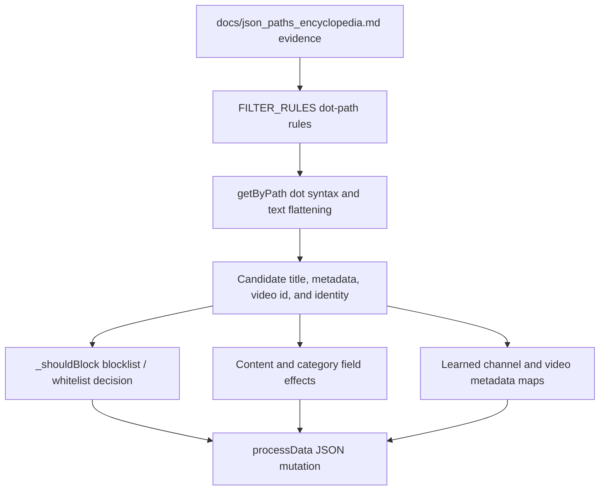
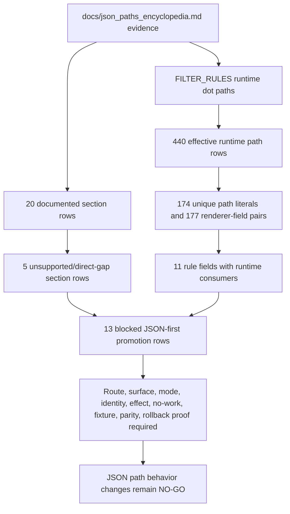

# FilterTube JSON Path Authority - Current Behavior - 2026-05-19

Status: current-behavior proof only. Runtime behavior is unchanged and the
implementation gate remains closed.

This slice exists because `docs/json_paths_encyclopedia.md` is a valuable
discovery map, but it is not the runtime authority. The runtime authority for
JSON filtering is hand-authored inside `FILTER_RULES` in `js/filter_logic.js`,
plus helper extraction code. Drift between those two surfaces can create leaks,
false confidence, and risky fixes.

## Current Finding

There is no central `jsonPathAuthority`, `rulePathManifest`, or
`jsonPathProvenance` record tying a runtime path to:

```text
renderer key
  -> runtime FILTER_RULES field
  -> exact path syntax accepted by getByPath()
  -> source capture / fixture id
  -> blocklist expectation
  -> whitelist expectation
  -> negative false-hide expectation
  -> route/surface
```

The docs and runtime also use different path notation:

- docs often use human trace syntax such as `listItems[0].listItemViewModel`
  and `runs[0].text`;
- runtime `getByPath()` splits on `.` and expects dot-index syntax such as
  `listItems.0.listItemViewModel` and `runs.0.text`.

That means a path copied from the encyclopedia is not automatically executable
by runtime code unless it is normalized or rewritten.

## Proof Surfaces

| Surface | Current behavior | Risk |
| --- | --- | --- |
| `docs/json_paths_encyclopedia.md` | Contains raw traces, human notes, bracket-index paths, DOM snippets, and post-hoc analysis. | It is evidence, not a generated manifest. |
| `getByPath()` | Uses `path.split('.')` and direct key lookup. | Bracket-index paths from docs are not runtime paths. |
| `FILTER_RULES` | Hand-authored renderer/path rules with no per-path provenance field. | A rule can drift from evidence without a fixture failing. |
| High-risk documented renderers | `compactPlaylistRenderer`, `searchRefinementCardRenderer`, `compactChannelRenderer`, `postRenderer`, `sharedPostRenderer`, and direct watch-card renderers are documented but not direct runtime rules. | Documentation can overstate coverage unless a fixture proves runtime behavior. |
| Collaborator roster paths | The encyclopedia documents `showSheetCommand...sheetViewModel`, while `filter_logic.js` direct collaborator scan is still `showDialogCommand...dialogViewModel`. | Show-sheet rosters can leak or fail-closed depending on list mode. |

## Current Boundary

This slice does not say the encyclopedia is bad. It says the encyclopedia is an
input to fixture design, not the authority that proves filtering. Any future
renderer/path promotion should have:

1. an extracted minimal raw fixture,
2. a runtime path written in `getByPath()` syntax,
3. blocklist and whitelist fixtures,
4. a negative sibling/false-hide fixture where the renderer is a container,
5. a provenance row from docs/capture to runtime rule.

## JSON Path Instance Boundary

The complete-codebase objective says "every JSON path". That cannot be proven
by counting renderer headings or by checking a few representative `FILTER_RULES`
entries. For this audit, one JSON path instance is not considered semantically
covered until a later artifact records:

```text
documented path text
  -> normalized runtime path syntax
  -> renderer key and endpoint/route family
  -> source capture or fixture id
  -> extraction owner: harvest, direct rule, metadata-only, DOM join, or fallback resolver
  -> list-mode behavior: blocklist, whitelist, disabled, and empty-list states
  -> identity confidence: UC id, handle, custom URL, display name, video id join, or unknown
  -> mutation effect: remove renderer, preserve renderer, metadata harvest only, map write, or fetch
  -> negative sibling-visible / false-hide fixture when the path is inside a container
```

Until that unit exists, a documented path remains evidence for fixture design,
not proof that the runtime enforces it correctly or cheaply. This distinction is
especially important for Shorts, watch, playlist, post, collaboration, Kids, and
YTM surfaces where a JSON response can provide only a video id at one point in
the flow and the channel identity must be joined from a later player, next,
map, DOM, or resolver source.

## Executable JSON Path Owner Flow Addendum - 2026-05-27

This addendum turns the "docs are evidence, runtime paths are authority"
boundary into a source-pinned owner flow. It is audit-only. It does not approve
new renderer promotion, JSON-first behavior, DOM fallback deletion, no-work
optimization, or whitelist behavior changes.

```text
documented JSON path evidence
        |
        v
hand-authored FILTER_RULES runtime dot paths
        |
        v
getByPath / flattenText extraction
        |
        +--> candidate text and identity fields
        +--> content/category metadata fields and fetch requests
        +--> learned channel/video metadata map writes
        |
        v
_shouldBlock list-mode decision and processData mutation
```



| Owner row | Source pins | Current contract | Missing proof before JSON-first promotion |
| --- | --- | --- | --- |
| `json_path_syntax_owner` | `js/filter_logic.js:163-177`; `js/filter_logic.js:221-233` | Runtime accepts dot notation or array keys through `getByPath()`, then flattens text with `getTextFromPaths()`; bracket-index encyclopedia paths are not normalized here. | Generated normalized path manifest with source docs/capture path, runtime dot path, and syntax-failure fixture. |
| `json_direct_rule_owner` | `js/filter_logic.js:435-529` | `FILTER_RULES` begins as hand-authored renderer-field path declarations, including BASE_VIDEO_RULE aliases and direct object rules. | Per-renderer provenance, duplicate override policy, route/surface scope, and unsupported-renderer decision. |
| `json_candidate_field_owner` | `js/filter_logic.js:1647-1692`; `js/filter_logic.js:1721-1798` | Runtime paths feed candidate title, description, metadata text, duration, published time, view count, tags, video id, playlist id, channel/collaborator identity, and structural flags. | Field-effect manifest proving which extracted field can hide, allow, fetch, map, or remain metadata-only. |
| `json_decision_effect_owner` | `js/filter_logic.js:1957-2249` | `_shouldBlock()` unwraps renderers, rejects unsupported renderers, applies list-mode semantics, sends collaborator cache messages, and performs JSON blocklist/whitelist/comment/content decisions. | One decision report with profile, list mode, renderer, matched path, allowed effect, forbidden effect, sibling-visible proof, and comment exception proof. |
| `json_content_category_owner` | `js/filter_logic.js:2263-2309`; `js/filter_logic.js:2838-2992` | Category and content filters consume extracted video id, duration, publish time, and title; missing category metadata can request `scheduleVideoMetaFetch()`. | Network/fetch budget proving when JSON filtering may ask for metadata instead of staying mutation-only. |
| `json_learned_map_owner` | `js/filter_logic.js:58-88`; `js/filter_logic.js:91-149`; `js/filter_logic.js:1256-1283`; `js/filter_logic.js:1290-1324` | Filter logic can queue learned `videoId -> channelId` and video metadata updates, and harvest playlist/tree channel mappings before/around filtering. | Map-write provenance, stale/eviction policy, disabled/no-rule harvest policy, and negative spoof/stale fixture. |
| `json_collaboration_identity_owner` | `js/filter_logic.js:3033-3285` | Collaboration identity has special scans for avatar stacks, showDialogCommand rosters, rule-based channel fields, and lockup logo paths; show-sheet paths remain separate documented evidence. | Collaboration roster parity across dialog, sheet, avatar stack, DOM, whitelist, blocklist, Topic byline, and negative single-channel fixtures. |
| `json_process_export_owner` | `js/filter_logic.js:3588-3633` | `processData()` harvests first, skips mutation when disabled, filters when active, and exports `FilterTubeEngine.processData` as the page-world JSON mutation entrypoint. | Parse/harvest/filter/mutation counters per endpoint and mode, plus rollback evidence for no-work pass-through. |

Current executable path owner-flow status:

```text
executable JSON path owner rows: 8
ASCII executable JSON path flow diagram: present
Mermaid executable JSON path flow diagram: present
JSON path source proof: PARTIAL
JSON-first promotion approval from path owner flow: NO-GO
runtime behavior changed by this addendum: no
```

## Filter Logic Direct Renderer Rule Addendum

`docs/audit/FILTERTUBE_FILTER_LOGIC_DIRECT_RENDERER_RULE_SEMANTIC_REGISTER_2026-05-21.md`
and
`tests/runtime/filter-logic-direct-renderer-rule-semantic-register-current-behavior.test.mjs`
promote the current `js/filter_logic.js` `FILTER_RULES` object from
representative-rule evidence to a source-derived direct renderer rule
declaration inventory. The addendum pins 45 source declarations, 44 unique renderer keys, duplicate `gridVideoRenderer` declarations at lines 431 and
604, 7 `BASE_VIDEO_RULES` aliases, 38 object literal rules, and 11 semantic rule groups. This still does not prove every JSON path: direct renderer keys
remain separate from field path manifests, documented section coverage,
list-mode behavior, mutation effects, and sibling-visible fixtures. It records
that no `filterLogicDirectRuleAuthority`, `filterLogicRendererRuleReport`,
`rendererRuleDuplicatePolicy`, `rendererRuleFieldPathManifest`,
`rendererRuleEffectDecision`, or `rendererRuleFixtureProvenance` exists in
runtime source yet.

## Filter Logic Rule Path Addendum

`docs/audit/FILTERTUBE_FILTER_LOGIC_RULE_PATH_SEMANTIC_REGISTER_2026-05-21.md`
and
`tests/runtime/filter-logic-rule-path-semantic-register-current-behavior.test.mjs`
promote `js/filter_logic.js` from direct renderer-rule coverage to
source-derived runtime rule-path coverage. The addendum pins 9 `BASE_VIDEO_RULES` field rows, 27 `BASE_VIDEO_RULES` authored path rows,
45 `FILTER_RULES` source declarations, 467 `FILTER_RULES` source path rows before duplicate override, 494 source-authored path rows including
`BASE_VIDEO_RULES`, 44 effective runtime renderer keys after duplicate override,
6 effective `BASE_VIDEO_RULES` aliases, 38 effective object literal rules,
440 effective runtime path rows, 174 effective unique path literals, and
177 effective renderer-field pairs. It also records that 157 effective path rows use dot numeric indexes, 0 use bracket numeric indexes, 283 use no numeric indexes, and 0 use template path literals. This still does not prove every JSON
path: the register covers current executable `FILTER_RULES` path strings, not documented-only encyclopedia paths, capture-only paths, DOM fallback selectors,
route/list-mode effects, or fixture-proven JSON-first readiness. It records that
no `filterLogicRulePathAuthority`, `filterLogicRulePathManifest`,
`filterLogicRulePathSyntaxContract`,
`filterLogicEffectiveRendererPathReport`,
`filterLogicDuplicatePathOverridePolicy`, `filterLogicJsonDomParityReport`,
`filterLogicPathFixtureProvenance`, `filterLogicJsonFirstReadinessGate`,
`filterLogicPathEffectDecision`, or `filterLogicPathNoRuleBudget` exists in
runtime source yet.

## Filter Logic Rule Field Effect Addendum

`docs/audit/FILTERTUBE_FILTER_LOGIC_RULE_FIELD_EFFECT_SEMANTIC_REGISTER_2026-05-21.md`
and
`tests/runtime/filter-logic-rule-field-effect-semantic-register-current-behavior.test.mjs`
split current executable path availability from field-effect permission. The
addendum pins 11 rule fields with runtime consumers, 9 consumer methods with
`rules.<field>` references, 20 method-field consumer pairs, 63 `rules.<field>`
token references, 440 inherited effective runtime path rows, 174 inherited
unique path literals, and 177 inherited renderer-field pairs. It records that
`viewCount` has no current view-count threshold predicate, `videoId` is a join
key rather than channel identity, `_checkCategoryFilters()` can schedule
`scheduleVideoMetaFetch()` when category metadata is missing, and `processData()`
harvests channel mappings before the disabled-filtering skip. This still does
not prove JSON-first readiness: field availability is not effect authority, and
route/surface effects, list-mode behavior, identity confidence, fixture
provenance, DOM fallback parity, native runtime parity, no-rule budgets, and
category fetch budgets remain missing. No `filterLogicRuleFieldEffectAuthority`,
`filterLogicRuleFieldEffectManifest`, `filterLogicJsonPathEffectDecision`,
`filterLogicFieldConsumerReport`, `filterLogicViewCountPredicateAuthority`,
`filterLogicCategoryFetchBudget`, `filterLogicWhitelistFieldEffectReport`,
`filterLogicRuleFieldFixtureProvenance`, `filterLogicRuleFieldNoWorkBudget`, or
`filterLogicJsonFirstEffectGate` exists in runtime source yet.

## JSON-First Readiness Gate Addendum

`docs/audit/FILTERTUBE_JSON_FIRST_FILTER_READINESS_GATE_CURRENT_BEHAVIOR_2026-05-21.md`
and
`tests/runtime/json-first-filter-readiness-gate-current-behavior.test.mjs`
promote the path and field-effect boundary into an explicit first-class JSON
filter gate. The addendum keeps all 13 promotion rows blocked: normalized path syntax, renderer ownership, field-effect authority, route/surface scope,
list-mode semantics, identity confidence, mutation effect, category/network
budget, no-rule/no-work budget, fixture provenance, DOM fallback parity, native parity, and optimization budget. It records that a JSON field needs
`rendererKey`, `runtimePath`, `documentedPath`, `endpoint`, `route`, `surface`,
`profileType`, `listMode`, `ruleState`, `fieldEffect`, `identityConfidence`,
`allowedEffects`, `forbiddenEffects`, `networkBudget`, `noWorkBudget`,
`positiveFixture`, `negativeSiblingFixture`, `domParity`, `nativeParity`, and
`rollbackOrRestoreProof` before it can become first-class filter behavior. No
`jsonFirstFilterReadinessGate`, `jsonFirstPathSyntaxManifest`,
`jsonFirstRendererCoverageDecision`, `jsonFirstFieldEffectDecision`,
`jsonFirstRouteSurfaceReport`, `jsonFirstListModeMatrix`,
`jsonFirstIdentityConfidenceReport`, `jsonFirstMutationEffectReport`,
`jsonFirstCategoryFetchBudget`, `jsonFirstNoWorkBudget`,
`jsonFirstFixtureProvenance`, `jsonFirstDomParityReport`,
`jsonFirstNativeParityReport`, or `jsonFirstOptimizationBudget` exists in
runtime source yet.

## JSON Path Convergence Boundary - 2026-05-30

This addendum joins the JSON path authority split, runtime coverage gap,
section coverage index, executable owner flow, filter-logic rule/path/effect
registers, JSON-first readiness gate, and method semantic blocker into one
audit-only convergence boundary. It changes no runtime behavior and does not
approve renderer promotion, JSON-first behavior, DOM fallback deletion, no-work
optimization, whitelist/cache optimization, method changes, release claims, or
public performance claims.

Source inputs:

| Source input | Boundary contribution |
| --- | --- |
| `docs/json_paths_encyclopedia.md` | Discovery map for documented YouTube JSON paths and human path notation. |
| `docs/audit/FILTERTUBE_JSON_PATH_AUTHORITY_CURRENT_BEHAVIOR_2026-05-19.md` | Current authority split between documentation, runtime dot paths, and source owner rows. |
| `docs/audit/FILTERTUBE_JSON_RUNTIME_COVERAGE_GAP_REGISTER_2026-05-20.md` | Runtime coverage classes and documented-but-unconsumed field gaps. |
| `docs/audit/FILTERTUBE_JSON_SECTION_COVERAGE_INDEX_2026-05-20.md` | Section-level coverage classes for 20 documented JSON section rows. |
| `docs/audit/FILTERTUBE_FILTER_LOGIC_DIRECT_RENDERER_RULE_SEMANTIC_REGISTER_2026-05-21.md` | Direct `FILTER_RULES` renderer declaration inventory. |
| `docs/audit/FILTERTUBE_FILTER_LOGIC_RULE_PATH_SEMANTIC_REGISTER_2026-05-21.md` | Effective runtime path string inventory. |
| `docs/audit/FILTERTUBE_FILTER_LOGIC_RULE_FIELD_EFFECT_SEMANTIC_REGISTER_2026-05-21.md` | Rule-field consumer and effect gap inventory. |
| `docs/audit/FILTERTUBE_JSON_FIRST_FILTER_READINESS_GATE_CURRENT_BEHAVIOR_2026-05-21.md` | Blocked first-class JSON promotion rows and required field packet shape. |
| `docs/audit/FILTERTUBE_METHOD_SEMANTIC_PROOF_GAP_INDEX_CURRENT_BEHAVIOR_2026-05-25.md` | Method-level blocker for any parser, mutation, cache, hide, restore, or fetch behavior change. |
| `tests/runtime/json-path-authority-current-behavior.test.mjs` | Executable parity for current JSON path authority split and missing runtime symbols. |

| Convergence row | Current source-backed finding | Risk if treated as implementation-ready now |
| --- | --- | --- |
| `json_path_convergence_docs_not_runtime_authority` | `docs/json_paths_encyclopedia.md` is a discovery map, not a loaded runtime manifest. | A documented path can be claimed as blocked/allowed even when runtime never consumes it. |
| `json_path_convergence_syntax_boundary` | Runtime `getByPath()` uses dot syntax; documentation often uses bracket-index human syntax. | Copying documented paths directly can create silent no-op rules or false confidence. |
| `json_path_convergence_owner_flow` | 8 executable JSON path owner rows connect `FILTER_RULES`, `getByPath()`, candidate fields, decisions, content/category effects, learned maps, collaboration identity, and `processData()`. | Source owners are visible but still lack route, mode, fixture, no-work, and side-effect authority. |
| `json_path_convergence_runtime_coverage_classes` | Runtime coverage uses 5 classes: `direct-rule`, `harvest-only`, `joined-by-video-id`, `documented-gap`, and `unsupported/direct-gap`. | Harvest-only or joined identity can be mistaken for direct hide/allow authority. |
| `json_path_convergence_section_index` | 20 documented JSON section rows are classified; 5 remain `unsupported/direct-gap`. | Direct-rule partial rows and unsupported rows can leak or false-hide when generalized. |
| `json_path_convergence_executable_rule_paths` | Current `FILTER_RULES` resolves to 440 effective runtime path rows, 174 effective unique path literals, 177 renderer-field pairs, and 0 bracket-index path rows. | Runtime path inventory can be mistaken for every documented JSON path. |
| `json_path_convergence_field_effect_gap` | 11 rule fields, 9 consumer methods, 20 method-field consumer pairs, and 63 `rules.<field>` references are known, but field availability is not effect authority. | Fields such as `videoId`, `viewCount`, category, or collaborator identity can trigger the wrong effect class. |
| `json_path_convergence_json_first_promotion_gate` | The JSON-first readiness gate keeps 13 promotion rows blocked across syntax, renderer ownership, field effects, route/surface, list mode, identity, mutation, network/no-work, fixtures, parity, native, and optimization budget. | JSON can become first-class before route/mode/side-effect/no-work parity is proved. |
| `json_path_convergence_method_dependency` | 69 tracked JS/JSX/MJS files and 5,827 lexical callables still have 0 complete per-callable semantic proof files. | A JSON path fix can alter unproved parser, mutation, cache, hide, restore, fetch, or teardown behavior. |
| `json_path_convergence_authority_absence` | `jsonPathAuthority`, `rulePathManifest`, `jsonPathProvenance`, `jsonRuntimeCoverageAuthority`, `rendererFieldCoverageClass`, `jsonFieldEffectAuthority`, `jsonSectionCoverageDecision`, `documentedJsonSectionAuthority`, `jsonFirstFilterReadinessGate`, `jsonFirstPathSyntaxManifest`, and `jsonFirstOptimizationBudget` are absent from product runtime source. | Product source has no shared authority that can certify JSON path coverage or first-class promotion. |

```text
docs/json_paths_encyclopedia.md
        |
        +--> documented JSON evidence and human/bracket path notation
        |
        v
FILTER_RULES + getByPath dot syntax
        |
        +--> 440 effective runtime path rows
        +--> 174 effective unique path literals
        +--> 177 renderer-field pairs
        |
        v
coverage and effect classification
        |
        +--> 20 documented section rows
        +--> 5 unsupported/direct-gap section rows
        +--> 11 rule fields with runtime consumers
        |
        v
13 blocked JSON-first promotion rows
        |
        v
NO-GO until route/surface, list-mode, identity-confidence, side-effect,
no-work, fixture, DOM/native parity, rollback, method-semantic, and
release/public-claim boundaries are proved.
```



Current convergence status:

```text
JSON path convergence rows: 10
implementation-ready JSON path convergence rows: 0
executable JSON path owner rows: 8
JSON runtime coverage classes: 5
JSON section coverage rows: 20
unsupported/direct-gap JSON section rows: 5
effective runtime path rows: 440
effective unique path literals: 174
effective renderer-field pairs: 177
JSON-first promotion rows blocked: 13
method semantic complete proof files: 0
jsonPathAuthority product source symbol: absent
rulePathManifest product source symbol: absent
jsonPathProvenance product source symbol: absent
jsonRuntimeCoverageAuthority product source symbol: absent
rendererFieldCoverageClass product source symbol: absent
jsonFieldEffectAuthority product source symbol: absent
jsonSectionCoverageDecision product source symbol: absent
documentedJsonSectionAuthority product source symbol: absent
jsonFirstFilterReadinessGate product source symbol: absent
jsonFirstPathSyntaxManifest product source symbol: absent
jsonFirstOptimizationBudget product source symbol: absent
runtime behavior changed by this addendum: no
renderer promotion approval: NO-GO
JSON-first behavior approval: NO-GO
DOM fallback deletion approval: NO-GO
no-work optimization approval: NO-GO
whitelist/cache optimization approval: NO-GO
release/public-claim use: NO-GO
```

## Runnable Proof

```bash
node --test tests/runtime/json-path-authority-current-behavior.test.mjs --test-reporter=spec
```

The test file pins these facts:

- product source has no central JSON path authority today,
- `getByPath()` does not normalize bracket-index path notation,
- runtime/build code does not load `docs/json_paths_encyclopedia.md`,
- `FILTER_RULES` has no per-path provenance fields,
- documented high-risk renderer paths remain direct-rule gaps,
- show-sheet collaborator paths are documented but not the primary runtime scan,
- existing JSON inventory tests keep docs separate from executable runtime proof.
- path-level semantic coverage requires normalized syntax, route, fixture,
  extraction owner, list-mode behavior, identity confidence, mutation effect,
  and negative false-hide proof.
- the source-derived rule-path addendum separates current executable
  `FILTER_RULES` path strings from documented-only JSON paths.

## Method Semantic Proof Gap Boundary

`docs/audit/FILTERTUBE_METHOD_SEMANTIC_PROOF_GAP_INDEX_CURRENT_BEHAVIOR_2026-05-25.md`
is a required source input before this JSON path authority can support runtime
optimization or JSON-first promotion. Current proof pins:

```text
method semantic proof gap files covered: 69
method semantic proof gap lexical callables covered: 5827
files with complete per-callable semantic proof: 0
lexical callables requiring semantic proof before behavior changes: 5827
affected callable semantic proof: NO-GO
runtime behavior changed: no
```

These counts are audit-only blockers. They do not approve runtime
optimization, JSON-first behavior, method deletion, method merging, lifecycle
cleanup, no-work changes, or whitelist behavior changes.
