# FilterTube Lifecycle Instance Register - 2026-05-18

Status: source-derived audit register. This is not an implementation patch.

Completion is not proven. This register moves the audit closer to the
objective phrase `every runtime observer/listener/timer` by pinning every
current tracked lifecycle instance through a source-derived test. It does not
prove that cleanup or optimization is safe yet.

## Register Boundary

The register covers tracked `*.js`, `*.jsx`, and `*.mjs` files returned by:

```bash
git ls-files '*.js' '*.jsx' '*.mjs'
```

It excludes ignored root HTML/JSON/TXT captures, `dist/`, dependency caches,
and local website build output. Those files can be evidence or generated
output, but they are not lifecycle source authority.

The runnable register is generated by
`tests/runtime/lifecycle-instance-register-current-behavior.test.mjs`. Keeping
the instance list source-derived avoids a stale hand-maintained table while
still proving that each current instance has a file, line number, primitive
family, source family, and owner class.

## Covered Primitive Families

| Primitive family | Current count | Why it matters |
| --- | ---: | --- |
| `addEventListener` | 292 | Listener install surface. |
| `removeEventListener` | 13 | Explicit listener teardown surface. |
| `MutationObserver` | 16 | DOM mutation observation surface. |
| `IntersectionObserver` | 4 | Visibility/identity observation surface. |
| `setInterval` | 3 | Repeating work surface. |
| `clearInterval` | 4 | Repeating work teardown surface. |
| `setTimeout` | 123 | Delayed/debounced/retry work surface. |
| `clearTimeout` | 34 | Delayed work teardown surface. |
| `requestAnimationFrame` | 31 | Paint-frame scheduling surface. |
| `cancelAnimationFrame` | 4 | Paint-frame teardown surface. |
| **Total lifecycle instances** | **524** | Observer/listener/timer/frame lifecycle surface. |

This register intentionally does not include direct `fetch`, message,
display/class, click, or dispatch side effects. Those remain covered by the
repo primitive coverage, message side-effect, network, hide/restore, and DOM
side-effect audits.

## Source Family Totals

| Source family | Lifecycle instances | Current interpretation |
| --- | ---: | --- |
| `extension-ui-background-js` | 271 | Dashboard, popup, background, StateManager, UI components, and import/export/Nanah lifecycle work. |
| `content-runtime-js` | 218 | YouTube page-runtime work: seed, bridge, quick/menu, DOM fallback, injector, prompts, and helper listeners. |
| `website-components` | 23 | Website client lifecycle, including theme/scene controls plus hero/footer decorative motion. |
| `vendor-bundles` | 8 | Packaged vendor transport listeners, especially Nanah. |
| `generated-ui-output` | 4 | Generated shell output; should be freshness-checked, not hand edited. |
| `build-release-sync-scripts` | 0 | No observer/listener/timer/frame lifecycle instances in this scan. |
| `generated-ui-source` | 0 | Source templates do not own these lifecycle primitives directly today. |
| `quarantined-legacy-js` | 0 | `js/layout.js` has visual side effects, but no covered lifecycle primitive by this register. |
| `website-app-routes` | 0 | Route files are mostly static/server-side for this lifecycle scan. |
| `website-config` | 0 | Config only. |

## Hottest Instance Files

| File | Lifecycle instances | Audit meaning |
| --- | ---: | --- |
| `js/tab-view.js` | 180 | Largest UI listener/timer surface; affects profiles, filters, import/export, Nanah, app cards, and settings mutation. |
| `js/content_bridge.js` | 91 | Page-runtime bridge, whitelist pending, fallback menu, prefetch/hydration, page messages, and route listeners. |
| `js/content/block_channel.js` | 71 | Quick-block, normal 3-dot, Kids passive listener, dropdown observers, resize/orientation work. |
| `js/popup.js` | 33 | Popup filter/profile/list-mode mutation controls. |
| `js/ui_components.js` | 26 | Shared UI component listener surface. |
| `js/background.js` | 14 | Background timers, flushers, backup scheduling, and message/broadcast timing. |
| `js/content/dom_fallback.js` | 13 | DOM fallback delayed passes, playlist guard work, and synthetic playlist navigation timing. |
| `js/injector.js` | 12 | Page-world message/import/readiness lifecycle. |
| `js/content/bridge_settings.js` | 10 | Runtime settings bridge lifecycle. |
| `js/render_engine.js` | 9 | Dashboard/rendering UI event lifecycle. |

## Current Findings

| Finding | Evidence | Risk |
| --- | --- | --- |
| Lifecycle installs greatly exceed explicit teardown. | 292 listener installs vs 13 listener removals; 123 timeouts vs 34 clears. | Cleanup or route changes cannot rely on teardown being already represented everywhere. |
| UI/background lifecycle is larger than page runtime. | `extension-ui-background-js` has 271 lifecycle instances, while `content-runtime-js` has 218. | YouTube lag fixes still need settings/profile/import/Nanah lifecycle proof because UI can create stale state and broadcasts. |
| Page runtime has several independent owners. | `js/content_bridge.js`, `js/content/block_channel.js`, `js/content/dom_fallback.js`, `js/injector.js`, prompts, and helpers all own lifecycle instances. | Empty-install, fullscreen, native overlay, and route changes can wake unrelated owners unless one lifecycle budget exists. |
| Vendor and generated lifecycle instances are packaged but not product source. | `vendor-bundles` has 8; `generated-ui-output` has 4. | These need source/freshness/hash proof, not manual edits. |
| No shared registry exists today. | Current tracked source still lacks `lifecycleRegistry`, `registerLifecycle`, `observerRegistry`, `timerRegistry`, `disposeAll`, or `teardownAll`. | A cleanup can remove one visible symptom while another owner keeps equivalent work alive. |

## Install/Teardown Imbalance Addendum - 2026-05-27

This addendum classifies the 524 lifecycle instances by whether they install or
schedule work versus explicitly tear down a primitive covered by this register.
It is source-derived proof only; it does not approve lifecycle cleanup, route
teardown, listener removal, observer disconnect changes, or timer rewrites.

| Lifecycle role | Primitive families | Instances | Current interpretation |
| --- | --- | ---: | --- |
| `install-or-schedule` | `addEventListener`, `MutationObserver`, `IntersectionObserver`, `setInterval`, `setTimeout`, `requestAnimationFrame` | 469 | Work can be installed, observed, repeated, delayed, or framed. |
| `explicit-teardown` | `removeEventListener`, `clearInterval`, `clearTimeout`, `cancelAnimationFrame` | 55 | Only the teardown/clear/cancel primitives counted by this register; observer `disconnect()` and owner-specific cleanup still need semantic proof. |

Source-family imbalance:

| Source family | Install/schedule instances | Explicit teardown instances | Total lifecycle instances | Current risk |
| --- | ---: | ---: | ---: | --- |
| `extension-ui-background-js` | 257 | 14 | 271 | Dashboard/popup/background/state lifecycle has the largest unmatched install surface. |
| `content-runtime-js` | 189 | 29 | 218 | YouTube page runtime still has many page-lifetime listeners, observers, timers, and frame callbacks. |
| `vendor-bundles` | 8 | 0 | 8 | Vendor lifecycle requires source/hash/freshness proof rather than local edits. |
| `website-components` | 13 | 10 | 23 | Website client lifecycle grew from hero/footer motion work; it remains outside YouTube page-runtime filtering but still needs website unmount proof. |
| `generated-ui-output` | 2 | 2 | 4 | Generated shell output needs freshness proof before hand edits. |

```text
install-or-schedule lifecycle instances: 469
explicit-teardown lifecycle instances: 55
install-to-teardown ratio: 8.5:1
shared lifecycle registry in product source: absent
lifecycle cleanup approval from imbalance addendum: NO-GO
runtime behavior changed by this addendum: no
```

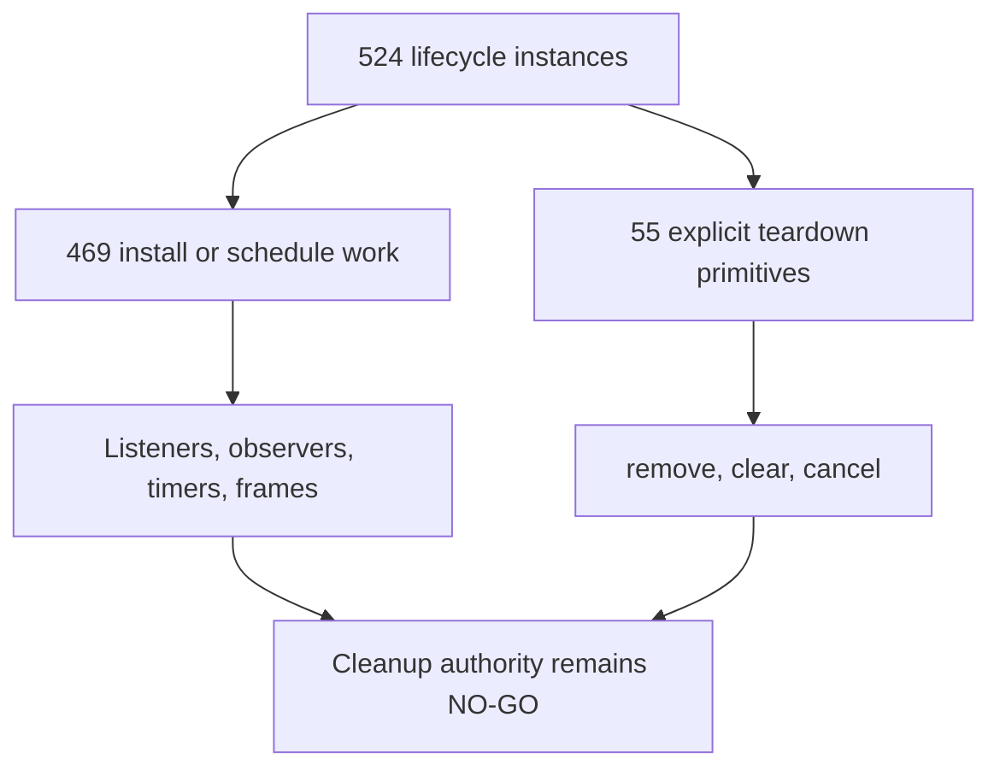

## Event Listener Option Shape Addendum - 2026-05-28

This addendum classifies the third-argument option shape for every current
`addEventListener` install counted by this register. It is source-derived
proof only; it does not approve listener rewrites, passive-option changes,
capture/bubble changes, `once` changes, teardown changes, or menu/scroll
optimization.

| Listener option shape | Instances | Current risk meaning |
| --- | ---: | --- |
| No third argument | 236 | Browser defaults decide capture/passive/once behavior. These are not automatically safe to remove or merge because owner intent is implicit. |
| Boolean `true` capture | 23 | Capture-phase ordering is explicit and can affect native YouTube menu, Kids, playlist, and document-level action behavior. |
| Object `{ passive: true }` | 16 | Passive scroll/touch/input behavior is explicit and can affect perceived lag, but it is not teardown proof. |
| Object `{ passive: true, capture: true }` | 6 | Both ordering and passive behavior are explicit; cleanup needs route/action proof. |
| Object `{ once: true }` | 7 | One-shot listeners reduce lifetime but still need trigger and missed-event proof. |
| Object `{ capture: true }` | 1 | Capture ordering is explicit without passive behavior. |
| Boolean `false` bubble | 1 | Explicit bubble-phase default exists and should not be collapsed blindly with omitted options. |
| Expression or identifier | 2 | Generated shell output owns non-literal option expressions; freshness proof is required before hand edits. |

Source-family listener option split:

| Source family | Total listeners | Dominant current shape | Explicit option shapes |
| --- | ---: | --- | --- |
| `extension-ui-background-js` | 201 | 199 no-third-argument UI/background listeners | 2 boolean capture listeners |
| `content-runtime-js` | 74 | Mixed page-runtime listener policy | 21 boolean capture, 16 passive, 6 passive+capture, 5 once, 1 capture object, 1 explicit bubble, 24 no-third-argument |
| `vendor-bundles` | 8 | Vendor transport defaults | 2 once, 6 no-third-argument |
| `generated-ui-output` | 2 | Generated expression/identifier options | 2 non-literal option rows |
| `website-components` | 7 | Website UI defaults | 7 no-third-argument |

ASCII listener option flow diagram: present

```text
292 addEventListener installs
        |
        +--> 236 omitted options
        +--> 23 boolean capture
        +--> 30 object options
        |       +--> passive / capture / once policy
        +--> 1 explicit bubble false
        +--> 2 generated expression/identifier options
        |
        v
listener cleanup or optimization authority: NO-GO until each option shape has
owner, event type, route/surface, active predicate, ordering impact, passive
impact, teardown reason, and positive/negative fixtures.
```

Mermaid listener option flow diagram: present

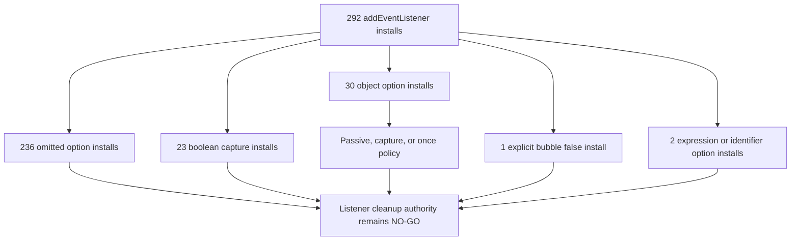

```text
addEventListener option rows: 292
no-third-argument listener installs: 236
boolean true capture listener installs: 23
object passive true listener installs: 16
object passive true plus capture true listener installs: 6
object once true listener installs: 7
object capture true listener installs: 1
boolean false bubble listener installs: 1
expression or identifier listener option installs: 2
listener option cleanup approval: NO-GO
runtime behavior changed by this addendum: no
```

## Event Listener Event-Type Addendum - 2026-05-28

This addendum classifies the first-argument event name for every current
`addEventListener` install counted by this register. The proof harness is
source-derived and comment-aware so listener handlers with comments, regex
literals, and multi-line bodies do not collapse event or option extraction.
It does not approve listener rewrites, event delegation changes, native menu
interception changes, teardown changes, or route-scoped cleanup.

| Listener event type | Instances | Current risk meaning |
| --- | ---: | --- |
| `click` | 114 | Dominant UI/menu/action event; delegation or capture changes can alter native YouTube and dashboard behavior. |
| `change` | 57 | Settings, form controls, and website media UI; needs storage/profile/list-mode mutation proof. |
| `input` | 20 | Live form input; needs debounce, validation, and no-rule UI proof. |
| `keydown` | 14 | Keyboard shortcuts and command handling; needs focus/native overlay proof. |
| `DOMContentLoaded` | 8 | Bootstraps page/app state; duplicate or missed boot handling is not proven by the count. |
| `keypress` | 7 | Legacy key input handling; needs accessibility and browser-parity proof. |
| `message` | 6 | Main-world, isolated-world, and vendor transport messages; needs sender/source/payload proof. |
| `scroll` | 6 | Route/viewport work; needs passive behavior, throttle, and no-work budgets. |
| `focusin` / `focusout` / `focus` / `blur` | 12 | Focus lifecycle can affect quick-block, dashboard, menu, and accessibility behavior. |
| Pointer/mouse hover events | 17 | Quick-block hover/sticky behavior; needs viewport and native overlay proof. |
| Navigation/route events | 7 | `yt-navigate-finish`, `hashchange`, and `popstate`; needs SPA route ownership proof. |
| Vendor transport events | 6 | `open`, `error`, and `close`; needs vendor freshness and teardown proof. |
| `visibilitychange` / `storage` / `resize` / `orientationchange` | 10 | Page/app environment changes; needs shared pause/resume and storage-fanout proof. |
| `ended` | 1 | Playlist/media coupling; needs engagement side-effect and autoplay proof. |
| `filterTubeSeedReady` / `toggle` / `pointermove` / `pointerover` | 4 | Local lifecycle edges; needs owner-specific fixture proof. |
| Non-literal event source | 4 | Runtime expressions (`pointerdown`/`mousedown`, generated shell, website sync event) need expression resolution proof. |
| Missing event argument | 0 | No current tracked source call is missing its first event argument. |

Source-family listener event split:

| Source family | Total listeners | Dominant current events | Non-literal event rows |
| --- | ---: | --- | ---: |
| `extension-ui-background-js` | 201 | `click` 98, `change` 54, `input` 19, `keydown` 10 | 0 |
| `content-runtime-js` | 74 | `click` 16, `DOMContentLoaded` 6, `focusin` 5, `mouseleave` 5, `yt-navigate-finish` 5 | 1 |
| `vendor-bundles` | 8 | `open` 2, `error` 2, `message` 2, `close` 2 | 0 |
| `generated-ui-output` | 2 | Generated `l2` event dispatch | 2 |
| `website-components` | 7 | `visibilitychange`, `change`, `storage`, and theme sync | 1 |

ASCII listener event flow diagram: present

```text
292 addEventListener installs
        |
        +--> 114 click listeners
        +--> 57 change listeners
        +--> 20 input listeners
        +--> 14 keydown listeners
        +--> 8 DOMContentLoaded listeners
        +--> 74 other literal event listeners
        +--> 1 ended media listener
        +--> 4 nonliteral event expressions
        +--> 0 missing event arguments
        |
        v
listener cleanup or optimization authority: NO-GO until each event has owner,
target, route/surface, settings/list-mode predicate, native/menu ordering impact,
engagement side-effect status, teardown reason, and positive/negative fixtures.
```

Mermaid listener event flow diagram: present

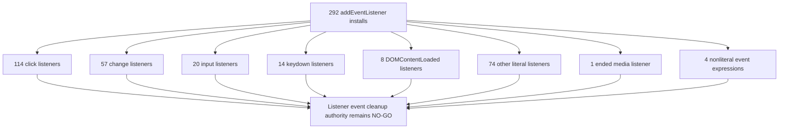

```text
addEventListener event rows: 292
click listener installs: 114
change listener installs: 57
input listener installs: 20
keydown listener installs: 14
DOMContentLoaded listener installs: 8
ended listener installs: 1
nonliteral event listener installs: 4
missing event listener installs: 0
listener event cleanup approval: NO-GO
runtime behavior changed by this addendum: no
```

## Event Listener Target Addendum - 2026-05-28

This addendum classifies the receiver/target expression for every current
`addEventListener` install counted by this register. It is source-derived proof
only; it does not approve listener delegation, target rewrites, document/window
listener cleanup, local element listener cleanup, vendor transport changes, or
generated shell edits.

| Listener target class | Instances | Current risk meaning |
| --- | ---: | --- |
| Local element reference | 205 | Dashboard, popup, quick-block, menu, rendered card, and website media listeners dominate the target surface; each still needs owner and teardown proof. |
| Optional local element reference | 17 | Conditional UI listeners are skipped when elements are absent, but absence tolerance is not lifecycle cleanup proof. |
| `document` | 41 | Page/global capture and bubble listeners can affect native YouTube menus, SPA route work, and page-level controls. |
| `window` | 19 | Page/app lifecycle, message, resize, scroll, and visibility listeners need cross-context and pause/resume proof. |
| Vendor transport reference | 8 | Vendor session lifecycle listeners require source/hash freshness and close/remove proof before edits. |
| Generated shell node | 2 | Generated UI shell output owns synthetic node listener dispatch; hand edits need generated-source parity proof. |

Source-family listener target split:

| Source family | Total listeners | Document/window targets | Local/generated/vendor targets |
| --- | ---: | ---: | --- |
| `extension-ui-background-js` | 201 | 13 | 171 local element, 17 optional local element |
| `content-runtime-js` | 74 | 42 | 32 local element |
| `vendor-bundles` | 8 | 0 | 8 vendor transport |
| `website-components` | 7 | 5 | 2 local element |
| `generated-ui-output` | 2 | 0 | 2 generated shell node |

ASCII listener target flow diagram: present

```text
292 addEventListener installs
        |
        +--> 205 local element targets
        +--> 17 optional local element targets
        +--> 41 document targets
        +--> 19 window targets
        +--> 8 vendor transport targets
        +--> 2 generated shell targets
        |
        v
listener cleanup or optimization authority: NO-GO until each target has owner,
route/surface, event, option policy, native/menu impact, settings/list-mode
predicate, teardown reason, and positive/negative fixtures.
```

Mermaid listener target flow diagram: present

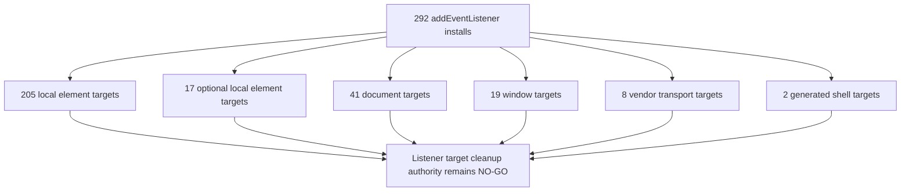

```text
addEventListener target rows: 292
local element listener targets: 205
optional local element listener targets: 17
document listener targets: 41
window listener targets: 19
vendor transport listener targets: 8
generated shell listener targets: 2
listener target cleanup approval: NO-GO
runtime behavior changed by this addendum: no
```

## Event Listener Event-Target Matrix Addendum - 2026-05-28

This addendum joins the first-argument event type with the receiver/target
expression for every current `addEventListener` install counted by this
register. It is source-derived proof only; it does not approve listener
delegation, document/window listener deletion, native menu interception
changes, SPA route cleanup, storage/visibility fanout changes, vendor
generated edits, or teardown changes.

| Event-target pair class | Instances | Current risk meaning |
| --- | ---: | --- |
| Document `click` | 10 | Global click handlers can affect native YouTube menus, outside-click close behavior, quick-block/menu actions, and dashboard popup close behavior. |
| Document `DOMContentLoaded` | 7 | Boot listeners can double-run or miss startup if moved without source owner proof. |
| Document `keydown` | 3 | Global keyboard handling can conflict with search, comments, native menus, and accessibility expectations. |
| Document pointer/mouse/nonliteral | 4 | Hover/pointer discovery and nonliteral down-event handling are menu/quick-block sensitive and need ordering proof. |
| Window `message` | 4 | Main-world/isolated-world transport needs sender/source/payload proof before consolidation. |
| Window route events | 2 | `hashchange`/`popstate` app route listeners need page/view ownership proof. |
| Window scroll/resize/orientation | 9 | Layout, quick-block, and fallback/menu positioning work can add perceived lag. |
| Window storage/visibility | 1 | Cross-tab/theme sync needs storage-key and no-op proof. |
| Local element `click` | 104 | Local UI action listeners dominate the count; cleanup requires owner and rendered-node lifecycle proof. |
| Local element `change`/`input`/`keydown` | 70 | Settings/list-mode/profile/media mutation events need storage and validation proof before delegation or pruning. |
| Optional local `click` | 0 | Optional local targets currently carry no click listeners; optionality is mostly settings/input control work. |
| Vendor transport lifecycle | 8 | Vendor open/error/message/close listeners require vendor freshness and session teardown proof. |
| Generated shell nonliteral | 2 | Generated UI shell listener expressions require source-generation parity before hand edits. |

Source-family global event-target split:

| Source/target class | Total pairs | Event mix |
| --- | ---: | --- |
| `content-runtime-js:document` | 32 | `click` 7, `yt-navigate-finish` 5, `DOMContentLoaded` 5, `keydown` 2, `scroll` 2, `visibilitychange` 1, `ended` 1, pointer/mouse/nonliteral 5, focus/input 4. |
| `content-runtime-js:window` | 10 | `message` 4, `scroll` 2, `resize` 1, `orientationchange` 1, `DOMContentLoaded` 1, `filterTubeSeedReady` 1. |
| `extension-ui-background-js:document` | 6 | `click` 3, `DOMContentLoaded` 2, `keydown` 1. |
| `extension-ui-background-js:window` | 7 | `resize` 3, `scroll` 2, `hashchange` 1, `popstate` 1. |
| `website-components:document` | 3 | `visibilitychange` 3. |
| `website-components:window` | 2 | `storage` 1, nonliteral theme sync 1. |

ASCII listener event-target flow diagram: present

```text
292 addEventListener event-target rows
        |
        +--> document globals
        |       +--> 10 click
        |       +--> 7 DOMContentLoaded
        |       +--> 3 keydown
        |       +--> 4 pointer/mouse/nonliteral
        +--> window globals
        |       +--> 4 message
        |       +--> 2 route
        |       +--> 9 scroll/resize/orientation
        |       +--> 1 storage/visibility
        +--> local rendered nodes
        |       +--> 104 click
        |       +--> 70 change/input/keydown
        +--> vendor/generated
                +--> 8 vendor lifecycle
                +--> 2 generated nonliteral

listener event-target cleanup authority: NO-GO until each pair has owner,
route/surface, settings/list-mode predicate, native/menu ordering impact,
storage/message/DOM side-effect proof, teardown or page-lifetime reason,
and positive/negative fixtures.
```

Mermaid listener event-target flow diagram: present

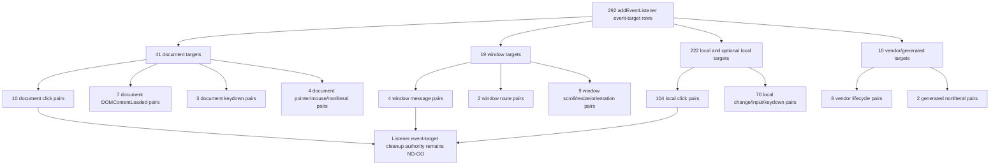

```text
addEventListener event-target matrix rows: 292
document click listener pairs: 10
document DOMContentLoaded listener pairs: 7
document keydown listener pairs: 3
document pointer or mouse listener pairs: 4
window message listener pairs: 4
window route listener pairs: 2
window scroll resize orientation listener pairs: 9
window storage visibility listener pairs: 1
local element click listener pairs: 104
local element change input keydown listener pairs: 70
optional local click listener pairs: 0
vendor transport lifecycle listener pairs: 8
generated shell nonliteral listener pairs: 2
content runtime document listener pairs: 32
content runtime window listener pairs: 10
extension UI background document listener pairs: 6
extension UI background window listener pairs: 7
listener event-target cleanup approval: NO-GO
runtime behavior changed by this addendum: no
```

## Event Listener Callback Identity Addendum - 2026-05-28

This addendum classifies the second-argument callback shape for every current
`addEventListener` install counted by this register. It is source-derived proof
only; it does not approve listener delegation, callback coalescing, duplicate
install pruning, generated-shell edits, vendor edits, or listener teardown.

| Listener callback class | Instances | Current risk meaning |
| --- | ---: | --- |
| Inline arrow callback | 252 | Most listeners are anonymous installs; removal or deduping needs owner, closure-capture, and side-effect proof. |
| Identifier callback reference | 37 | Named references are easier to match to teardown, but still need target, option, route, and active-state proof. |
| Member callback reference | 1 | One callback is a member expression; binding/receiver assumptions need explicit owner proof before refactor. |
| Generated expression callback | 2 | Generated shell output owns two non-local callback expressions; hand edits require source-generation parity proof. |

Source-family listener callback split:

| Source family | Total listener callbacks | Callback shape summary |
| --- | ---: | --- |
| `extension-ui-background-js` | 201 | 189 inline arrow callbacks, 12 identifier callbacks. |
| `content-runtime-js` | 74 | 55 inline arrow callbacks, 18 identifier callbacks, 1 member reference callback. |
| `vendor-bundles` | 8 | 8 inline arrow callbacks in packaged vendor transport code. |
| `website-components` | 7 | 7 identifier callbacks. |
| `generated-ui-output` | 2 | 2 generated expression callbacks. |

ASCII listener callback flow diagram: present

```text
292 addEventListener installs
        |
        +--> 252 inline arrow callbacks
        +--> 37 identifier callback references
        +--> 1 member callback reference
        +--> 2 generated expression callbacks
        +--> 0 missing callback arguments
        |
        v
listener callback cleanup authority: NO-GO until each callback has target,
event, option, owner, closure capture, settings/list-mode predicate,
native/menu impact, teardown or page-lifetime reason, duplicate-install proof,
and positive/negative fixtures.
```

Mermaid listener callback flow diagram: present

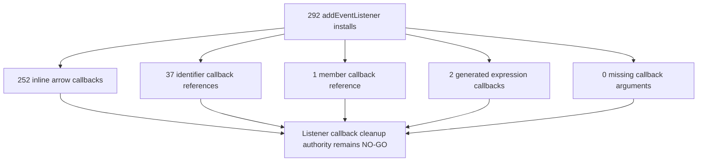

```text
addEventListener callback rows: 292
inline arrow listener callbacks: 252
identifier listener callbacks: 37
member reference listener callbacks: 1
other generated expression listener callbacks: 2
missing listener callback arguments: 0
content runtime listener callbacks: 74
extension UI background listener callbacks: 201
generated output listener callbacks: 2
vendor bundle listener callbacks: 8
website component listener callbacks: 7
listener callback cleanup approval: NO-GO
runtime behavior changed by this addendum: no
```

## Event Listener Add/Remove Parity Addendum - 2026-05-28

This addendum joins every current `addEventListener` install row with every
current `removeEventListener` teardown row by target, event, callback, and
capture semantics. It is source-derived proof only; it does not approve listener
delegation, page-lifetime listener retention, generated-shell edits, vendor
edits, inline callback refactors, or route teardown changes.

| Listener add/remove measurement | Instances | Current risk meaning |
| --- | ---: | --- |
| `addEventListener` install rows for parity | 292 | Listener install surface remains broad and mostly page-lifetime unless each owner proves teardown or a page-lifetime reason. |
| `removeEventListener` teardown rows for parity | 13 | Only a small subset has explicit lexical teardown rows. |
| Install-minus-remove delta | 279 | This is not automatically a leak count, but it is the current unproven listener cleanup burden. |
| Capture-equivalent remove pairs | 13 | Every current remove row has a target/event/callback/capture-compatible add row. |
| Exact option-shape remove pairs | 12 | One pair is capture-equivalent but not source-identical on the option object. |
| Capture-equivalent option-shape mismatch pairs | 1 | Quick-block pointermove recovery installs with `passive: true, capture: true` and removes with `capture: true`; capture semantics match, option shape does not. |
| Remove rows without capture-equivalent add pair | 0 | No current remove row is orphaned by source-derived capture matching. |
| Page-global installs without explicit remove | 51 | `document` and `window` listener installs still need route/page lifetime proof before optimization changes. |
| Inline listener installs without remove handle | 252 | Inline callbacks cannot be individually removed without refactoring callback ownership. |

Source-family add/remove parity:

| Source family | Adds | Removes | Delta |
| --- | ---: | ---: | ---: |
| `extension-ui-background-js` | 201 | 0 | 201 |
| `content-runtime-js` | 74 | 4 | 70 |
| `vendor-bundles` | 8 | 0 | 8 |
| `website-components` | 7 | 7 | 0 |
| `generated-ui-output` | 2 | 2 | 0 |

Remove-row target split:

| Remove target class | Instances |
| --- | ---: |
| `document` | 7 |
| `local-element-reference` | 2 |
| `window` | 2 |
| `generated-shell-node` | 2 |

Remove-row event split:

| Remove event class | Instances |
| --- | ---: |
| `nonliteral-event` | 3 |
| `click` | 2 |
| `keydown` | 1 |
| `pointermove` | 1 |
| `storage` | 1 |
| `visibilitychange` | 3 |
| `change` | 2 |

Remove-row callback split:

| Remove callback class | Instances |
| --- | ---: |
| Identifier callback reference | 10 |
| Member callback reference | 1 |
| Other/generated callback expression | 2 |

ASCII listener add/remove parity flow diagram: present

```text
292 listener installs
        |
        +--> 13 removeEventListener rows
        |       |
        |       +--> 13 capture-equivalent add/remove pairs
        |       +--> 12 exact option-shape pairs
        |       +--> 1 capture-equivalent option-shape mismatch
        |       +--> 0 orphan remove rows
        |
        +--> 279 install-minus-remove delta
        +--> 51 page-global installs without explicit remove
        +--> 252 inline callback installs without a removable handle
        |
        v
listener add/remove cleanup authority: NO-GO until each listener has owner,
route/page lifetime, target/event/callback/options, duplicate-install behavior,
native menu impact, and fixtures.
```

Mermaid listener add/remove parity flow diagram: present

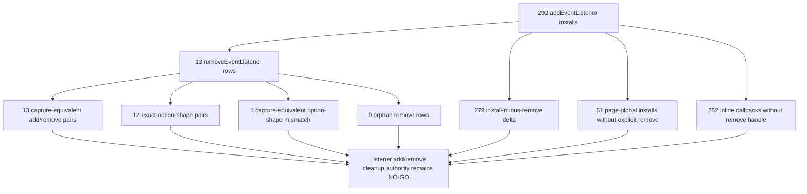

```text
addEventListener install rows for parity: 292
removeEventListener teardown rows for parity: 13
listener install-minus-remove delta: 279
capture-equivalent listener remove pairs: 13
exact option-shape listener remove pairs: 12
capture-equivalent option-shape mismatch listener pairs: 1
listener remove rows without capture-equivalent add pair: 0
page-global listener installs without explicit remove: 51
inline listener installs without remove handle: 252
content runtime listener add/remove delta: 70
extension UI background listener add/remove delta: 201
generated UI output listener add/remove delta: 0
vendor bundle listener add/remove delta: 8
website component listener add/remove delta: 0
document listener removes: 7
local element listener removes: 2
window listener removes: 2
generated shell listener removes: 2
listener add/remove cleanup approval: NO-GO
runtime behavior changed by this addendum: no
```

## Content Runtime Page-Global Listener Boundary Addendum - 2026-05-28

This addendum isolates the current content-runtime `document` and `window`
listener rows from the broader listener inventory. It is source-derived proof
only; it does not approve listener removal, delegation rewrites, route teardown,
quick-block/menu lifecycle pruning, injector/page-message rewrites, or fallback
menu behavior changes.

| Content-runtime page-global listener domain | Rows | Document | Window | Current risk meaning |
| --- | ---: | ---: | ---: | --- |
| Quick-block global lifecycle | 12 | 9 | 3 | Focus, input, click, scroll, resize, orientation, pointer, navigation, and boot listeners can keep quick-block refresh logic hot across SPA routes. |
| Native menu global lifecycle | 3 | 3 | 0 | Menu button click, outside pointer/mousedown, and keyboard listeners affect YouTube native menu timing and comment menu reuse. |
| Kids passive menu lifecycle | 1 | 1 | 0 | Kids native block sync listens globally and must stay separated from desktop menu cleanup decisions. |
| Content bridge prefetch/whitelist lifecycle | 5 | 5 | 0 | Visibility, scroll, and navigation listeners drive prefetch and whitelist observer work. |
| Content bridge DOM fallback lifecycle | 1 | 1 | 0 | DOM fallback observer boot listener can schedule fallback work when body is late. |
| Content bridge fallback menu lifecycle | 7 | 6 | 1 | Fallback menu boot, route, hover/focus/click, scroll, and popover close listeners carry menu work outside native dropdown paths. |
| Content bridge main-world message lifecycle | 1 | 0 | 1 | Main-world message dispatch remains a separate page-message trust and payload boundary. |
| Settings bridge page-message lifecycle | 2 | 0 | 2 | Settings and seed-ready relays can refresh runtime state from window-level messages. |
| Collaborator dialog page-trigger lifecycle | 3 | 3 | 0 | Capture-phase click/keydown and DOMContentLoaded listeners trigger collaborator dialogs. |
| DOM fallback page lifecycle | 3 | 2 | 1 | Scroll, click, and media-ended listeners can affect fallback hiding and playback-adjacent behavior. |
| Prompt page boot lifecycle | 2 | 2 | 0 | Prompt overlays boot from DOMContentLoaded only, but still need duplicate-overlay and route proof. |
| Injector main-world message lifecycle | 2 | 0 | 2 | Main-world subscription/import and lookup message listeners remain page-global. |

Source-file split:

| Source file | Page-global listener rows |
| --- | ---: |
| `js/content/block_channel.js` | 16 |
| `js/content_bridge.js` | 14 |
| `js/content/dom_fallback.js` | 3 |
| `js/content/collab_dialog.js` | 3 |
| `js/content/bridge_settings.js` | 2 |
| `js/injector.js` | 2 |
| `js/content/first_run_prompt.js` | 1 |
| `js/content/release_notes_prompt.js` | 1 |

Event split:

| Event class | Rows |
| --- | ---: |
| `click` | 7 |
| `DOMContentLoaded` | 6 |
| `yt-navigate-finish` | 5 |
| `message` | 4 |
| `scroll` | 4 |
| focus/pointer/mouse lifecycle | 7 |
| form/keyboard lifecycle | 3 |
| viewport/environment lifecycle | 3 |
| `filterTubeSeedReady` | 1 |
| `ended` | 1 |
| non-literal pointer/mouse fallback | 1 |

ASCII content runtime page-global listener flow diagram: present

```text
42 content-runtime page-global listener rows
        |
        +--> 32 document listener rows
        +--> 10 window listener rows
        |
        +--> quick-block/menu/Kids owners: 16
        +--> content bridge owners: 14
        +--> settings/injector page-message owners: 4
        +--> DOM fallback/collab/prompt owners: 8
        |
        v
content runtime page-global listener cleanup: NO-GO until each row has owner,
route, surface, mode/list predicate, duplicate-install behavior, native menu
impact, page-message trust impact, no-work budget, and fixtures.
```

Mermaid content runtime page-global listener flow diagram: present

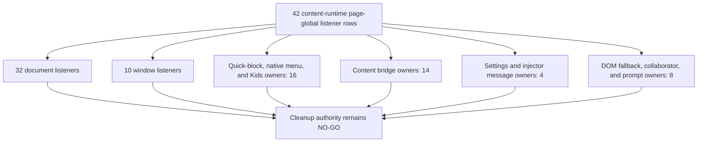

```text
content runtime page-global listener rows: 42
content runtime document listener rows: 32
content runtime window listener rows: 10
content runtime page-global source files: 8
quick-block global listener rows: 12
native menu global listener rows: 3
kids passive menu listener rows: 1
content bridge prefetch whitelist listener rows: 5
content bridge fallback menu listener rows: 7
content bridge main-world message listener rows: 1
injector main-world message listener rows: 2
page-global click listener rows: 7
page-global DOMContentLoaded listener rows: 6
page-global yt-navigate-finish listener rows: 5
page-global message listener rows: 4
page-global scroll listener rows: 4
content runtime page-global listener cleanup approval: NO-GO
runtime behavior changed by this addendum: no
```

## Content Runtime Page-Global Listener Row Context Addendum - 2026-05-28

This addendum adds source-derived row context for the same 42 content-runtime
`document`/`window` listener rows. It records the current owner/route/surface
predicate and duplicate-install boundary that must be preserved before any
listener cleanup, delegation rewrite, route teardown, or no-work optimization.
It is proof only; runtime behavior is unchanged.

| Row context | Rows | Route scope | Surface scope | Active predicate class | Duplicate-install boundary |
| --- | ---: | --- | --- | --- | --- |
| Quick-block card affordance listeners | 12 | Main YouTube all SPA routes | Quick-block card affordance | `quick-block-enabled-gated` | `quick-block-module-flag` |
| Native dropdown menu listeners | 3 | Main YouTube native menu routes | Native dropdown menu | `native-menu-listener-gated` | `native-menu-script-load-singleton` |
| Kids native menu listener | 1 | YouTube Kids native menu routes | Kids native menu | `kids-native-menu-listener-gated` | `kids-passive-script-load-singleton` |
| Identity prefetch visibility listener | 1 | Main YouTube prefetch visibility route | Identity prefetch visibility | `identity-prefetch-work-gated` | `prefetch-observer-singleton` |
| Playlist-panel prefetch listeners | 2 | Main YouTube watch playlist-panel routes | Playlist panel prefetch | `identity-prefetch-work-gated` | `playlist-prefetch-hook-flag` |
| Whitelist right-rail listeners | 2 | Main YouTube whitelist non-watch SPA routes | Whitelist right rail | `whitelist-mode-non-watch-gated` | `right-rail-whitelist-observer-flag` |
| DOM fallback body listener | 1 | Main YouTube DOM fallback body route | DOM fallback body observer | `fallback-lifecycle-work-gated` | `fallback-mutation-observer-active-flag` |
| Fallback card menu listeners | 6 | Main YouTube fallback menu routes | Fallback menu cards | `fallback-menu-eager-or-hover-gated` | `fallback-menu-installed-flag` |
| Playlist fallback popover listener | 1 | Main YouTube playlist fallback popover route | Playlist fallback popover | `playlist-popover-open-gated` | `playlist-popover-replace-remove` |
| Content bridge main-world message listener | 1 | Main YouTube content bridge message route | Content bridge page message | `main-world-message-source-gated` | `content-bridge-script-load-singleton` |
| Bridge settings window message listener | 1 | Main YouTube bridge settings message route | Bridge settings page message | `main-world-message-source-gated` | `bridge-settings-window-message-flag` |
| Bridge settings seed-ready listener | 1 | Main YouTube bridge settings message route | Bridge settings page message | `seed-ready-pending-settings-gated` | `bridge-settings-seed-listener-flag` |
| Collaborator trigger listeners | 2 | Main YouTube collaborator dialog routes | Collaborator dialog trigger | `collab-runtime-enabled-gated` | `collab-listener-module-flag` |
| Collaborator boot listener | 1 | Main YouTube collaborator dialog routes | Collaborator dialog trigger | `collab-runtime-enabled-gated` | `collab-domcontentloaded-boot` |
| DOM fallback scroll listener | 1 | Main YouTube DOM fallback scroll route | DOM fallback scroll state | `dom-fallback-scroll-state-gated` | `dom-fallback-scroll-window-flag` |
| DOM fallback playlist navigation listener | 1 | Main YouTube watch playlist guard route | Watch playlist playback guard | `dom-fallback-playlist-guard-gated` | `dom-fallback-playlist-nav-guard-flag` |
| DOM fallback autoplay listener | 1 | Main YouTube watch playlist guard route | Watch playlist playback guard | `dom-fallback-playlist-guard-gated` | `dom-fallback-autoplay-guard-flag` |
| Prompt overlay boot listeners | 2 | Extension prompt overlay route | Prompt overlay boot | `prompt-needed-check-gated` | `prompt-domcontentloaded-once` |
| Injector subscription import listener | 1 | Main YouTube injector message route | Injector page message | `main-world-message-source-gated` | `injector-window-message-flag` |
| Injector runtime lookup listener | 1 | Main YouTube injector message route | Injector page message | `main-world-message-source-gated` | `injector-script-load-singleton` |

Predicate class split:

| Predicate class | Rows |
| --- | ---: |
| `quick-block-enabled-gated` | 12 |
| `fallback-menu-eager-or-hover-gated` | 6 |
| `main-world-message-source-gated` | 4 |
| `collab-runtime-enabled-gated` | 3 |
| `identity-prefetch-work-gated` | 3 |
| `native-menu-listener-gated` | 3 |
| `dom-fallback-playlist-guard-gated` | 2 |
| `prompt-needed-check-gated` | 2 |
| `whitelist-mode-non-watch-gated` | 2 |
| `dom-fallback-scroll-state-gated` | 1 |
| `fallback-lifecycle-work-gated` | 1 |
| `kids-native-menu-listener-gated` | 1 |
| `playlist-popover-open-gated` | 1 |
| `seed-ready-pending-settings-gated` | 1 |

ASCII content runtime page-global row-context flow diagram: present

```text
42 content-runtime page-global listener rows
        |
        +--> 16 route scopes
        +--> 16 surface scopes
        +--> 14 active predicate classes
        +--> 20 duplicate-install boundary classes
        |
        v
row-context cleanup: NO-GO until native menu impact, page-message trust impact,
no-work budget, positive fixtures, negative sibling fixtures, and teardown or
page-lifetime justification are proven per row.
```

Mermaid content runtime page-global row-context flow diagram: present

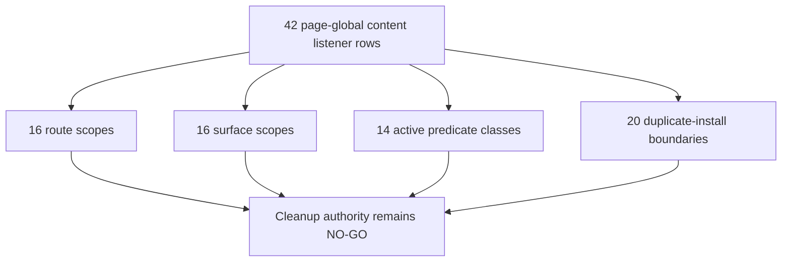

```text
content runtime page-global row-context rows: 42
content runtime page-global route scopes: 16
content runtime page-global surface scopes: 16
content runtime page-global predicate classes: 14
content runtime page-global duplicate guard classes: 20
page-global quick-block enabled-gated rows: 12
page-global fallback menu eager-or-hover gated rows: 6
page-global main-world message source-gated rows: 4
page-global identity prefetch-work gated rows: 3
page-global whitelist non-watch gated rows: 2
content runtime page-global row-context cleanup approval: NO-GO
runtime behavior changed by this addendum: no
```

## Content Runtime Page-Global Listener Impact And Fixture Addendum - 2026-05-28

This addendum extends the same 42 current content-runtime `document`/`window`
listener rows with impact, trust, no-work budget, fixture, and page-lifetime
classification. It is source-derived proof only; it does not approve listener
cleanup, native menu rewrites, page-message trust changes, no-work pruning, or
fixture-backed release claims.

| Proof class | Classes | Key row counts | Current risk meaning |
| --- | ---: | --- | --- |
| Native/menu impact | 10 | 12 quick-block affordance, 7 custom fallback menu, 5 page-message, 3 YouTube native menu, 1 YouTube Kids native menu | Menu, quick-block, and page-message work can affect YouTube native/dropdown timing and must keep comment/menu reuse safe. |
| Page-message trust impact | 6 | 37 no page-message trust impact, 5 page-message trust rows | Main-world bridge and injector messages require source/type guards before any listener or trust-boundary rewrite. |
| No-work budget | 14 | 12 quick-block enabled, 6 fallback menu hover/eager, 4 page-message, 3 identity prefetch, 2 whitelist non-watch | Empty-list, disabled-mode, off-route, and SPA repeat-navigation paths still need explicit no-work evidence. |
| Positive fixtures | 13 | Card affordance refresh, native menu open/close, page-message relay, playlist playback guard, whitelist SPA refresh | Cleanup cannot proceed until intended behavior is proven for each listener owner. |
| Negative fixtures | 12 | Disabled quick-block, native menu no-poison, inactive prefetch, no fallback menu, reject untrusted page message | False-hide, leak, menu poisoning, and inactive-rule regressions need sibling negative coverage. |
| Page-lifetime justification | 6 | 30 module singleton page-lifetime, 5 one-shot boot, 4 page-world message singleton, 1 seed-ready singleton, 1 pointermove remove, 1 popover remove | Rows without explicit removal need page-lifetime or transient-remove proof before cleanup authority can be granted. |

ASCII content runtime page-global impact fixture flow diagram: present

```text
42 content-runtime page-global listener rows
        |
        +--> 10 native/menu impact classes
        +--> 6 page-message trust classes
        +--> 14 no-work budget classes
        +--> 13 positive fixture classes
        +--> 12 negative fixture classes
        +--> 6 page-lifetime classes
        |
        v
impact/fixture cleanup: NO-GO until current behavior has fixture artifacts and
metric/no-work proof for each class and each high-risk native/menu/message row.
```

Mermaid content runtime page-global impact fixture flow diagram: present

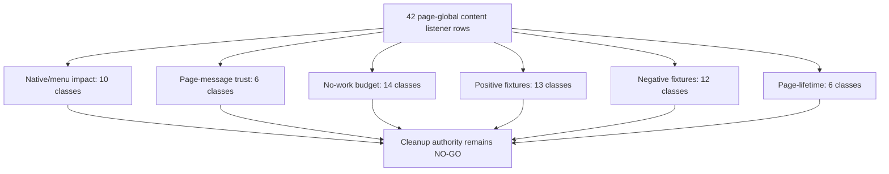

```text
content runtime page-global impact rows: 42
content runtime page-global native/menu impact classes: 10
content runtime page-global page-message trust classes: 6
content runtime page-global no-work budget classes: 14
content runtime page-global positive fixture classes: 13
content runtime page-global negative fixture classes: 12
content runtime page-global page-lifetime classes: 6
page-global quick-block affordance impact rows: 12
page-global custom fallback menu impact rows: 7
page-global page-message impact rows: 5
page-global no page-message trust impact rows: 37
page-global module singleton page-lifetime rows: 30
content runtime page-global impact/fixture cleanup approval: NO-GO
runtime behavior changed by this addendum: no
```

## Observer Observe Target Addendum - 2026-05-28

This addendum classifies the target expression for every current tracked
`.observe(...)` activation call. It covers observer activation targets, not just
`new MutationObserver(...)` or `new IntersectionObserver(...)` constructor
counts. It is source-derived proof only; it does not approve observer rewrites,
target widening/narrowing, disconnect changes, route teardown, whitelist
observer changes, quick-block observer changes, or menu observer changes.

| Observer observe target class | Instances | Current risk meaning |
| --- | ---: | --- |
| Card or row element | 4 | Per-card/per-row observation is bounded by rendered nodes, but recycled-node and detach behavior still needs owner proof. |
| `document.body` | 3 | Body subtree observation can wake on large SPA mutations and needs strict route/mode/no-work budgets before pruning or broadening. |
| Dropdown element | 4 | Native menu/dropdown observation can affect YouTube menu timing, outside-click behavior, and comment/menu reuse. |
| Generic target element | 3 | `document.body || document.documentElement` style targets need active predicate and fallback-target proof. |
| Panel or rail element | 2 | Watch playlist/right-rail observation can interact with whitelist pending-hide and identity prefetch work. |
| Select element | 1 | UI component observer watches local disabled-state changes; it is outside YouTube page runtime but still lifecycle-owned. |

Source-family observer observe target split:

| Source family | Total observe calls | Target split |
| --- | ---: | --- |
| `content-runtime-js` | 16 | 4 card/row, 3 `document.body`, 4 dropdown, 3 generic target, 2 panel/rail |
| `extension-ui-background-js` | 1 | 1 select element |
| `website-components` | 4 | 4 other observe targets |

ASCII observer observe target flow diagram: present

```text
21 observer observe calls
        |
        +--> 4 card or row targets
        +--> 3 document.body targets
        +--> 4 dropdown targets
        +--> 3 generic target expressions
        +--> 2 panel or rail targets
        +--> 1 select target
        +--> 4 other website targets
        |
        v
observer target cleanup or optimization authority: NO-GO until each target has
owner, observer type, install trigger, route/surface, settings/list-mode
predicate, no-work budget, disconnect reason, mutation/visibility side effect,
and positive/negative fixtures.
```

Mermaid observer observe target flow diagram: present

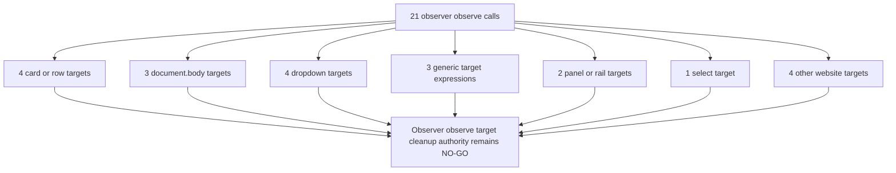

```text
observer observe rows: 21
document body observe targets: 3
dropdown observe targets: 4
generic target observe targets: 3
card or row observe targets: 4
panel or rail observe targets: 2
select observe targets: 1
other observe targets: 4
observer observe target cleanup approval: NO-GO
runtime behavior changed by this addendum: no
```

## Observer Observe Option Shape Addendum - 2026-05-28

This addendum classifies the options object, or lack of one, for every current
tracked `.observe(...)` activation call. It is source-derived proof only; it
does not approve observer option rewrites, subtree narrowing, attribute-filter
changes, target changes, disconnect changes, route teardown, quick-block
observer changes, whitelist/prefetch observer changes, menu/dropdown observer
changes, collaborator observer changes, or UI component observer changes.

| Observer observe option class | Instances | Current risk meaning |
| --- | ---: | --- |
| Observe option rows | 21 | Every current observer activation is classified by option shape. |
| `childList + subtree` | 9 | Broad subtree mutation observation can wake on large YouTube SPA changes and needs strict active-work proof. |
| `childList` only | 1 | Parent-child observation is narrower, but still needs recycled-node and detach proof. |
| No options | 5 | Current no-option rows are visibility/website observer activations; they still need target/release proof before cleanup. |
| Attribute filters total | 5 | Attribute-only observation is narrower than subtree mutation observation, but native menu and data-marker effects remain sensitive. |
| Other attribute option | 1 | Website hero/footer observation includes one nonstandard attribute option shape that remains outside extension runtime filtering. |
| Style/hidden attribute filters | 2 | Native dropdown/menu visibility tracking can affect 3-dot menu reliability and outside-click timing. |
| `aria-hidden` attribute filter | 1 | Dropdown close detection is native-menu sensitive. |
| `disabled` attribute filter | 1 | Extension UI select-state observation is outside YouTube page runtime but still lifecycle-owned. |
| Collaborator identity attribute filter | 1 | Playlist fallback popover refresh depends on FilterTube data markers and can affect collaborator identity state. |
| Content runtime option rows | 16 | YouTube page runtime owns almost all observer option wakeup surfaces. |
| Extension UI/background option rows | 1 | One UI component observer tracks a local disabled-state attribute. |
| Website component option rows | 4 | Website component observer rows are public-site lifecycle, not YouTube page-runtime filtering. |

Source-family observer observe option split:

| Source family | Total option rows | Option split |
| --- | ---: | --- |
| `content-runtime-js` | 16 | 9 childList+subtree, 1 childList-only, 2 no-options, 2 style/hidden filters, 1 aria-hidden filter, 1 collaborator identity filter |
| `extension-ui-background-js` | 1 | 1 disabled attribute filter |
| `website-components` | 4 | 3 no-options, 1 other attribute option |

ASCII observer observe option-shape flow diagram: present

```text
21 observer observe option rows
        |
        +--> 9 childList + subtree observers
        +--> 1 childList-only observer
        +--> 5 no-option visibility/website observers
        +--> 5 attribute-filter observers
              |
              +--> 2 style/hidden filters
              +--> 1 aria-hidden filter
              +--> 1 disabled filter
              +--> 1 collaborator identity filter
        |
        v
observer observe option-shape cleanup authority: NO-GO until each option shape
has owner, observer type, target, route/surface, settings/list-mode predicate,
callback side effects, wake-frequency evidence, no-work budget, release reason,
and positive/negative fixtures.
```

Mermaid observer observe option-shape flow diagram: present

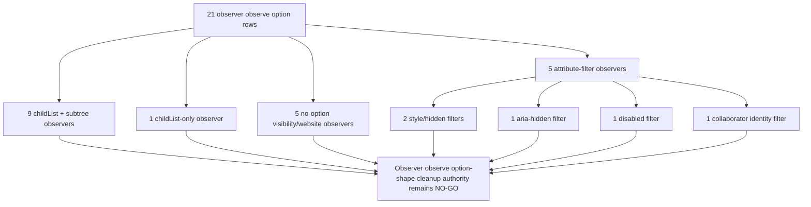

```text
observer observe option rows: 21
observer observe childList subtree option rows: 9
observer observe childList only option rows: 1
observer observe no-options rows: 5
observer observe attribute filter rows: 5
observer observe style hidden attribute filter rows: 2
observer observe aria-hidden attribute filter rows: 1
observer observe disabled attribute filter rows: 1
observer observe collaborator identity attribute filter rows: 1
content runtime observer observe option rows: 16
extension UI background observer observe option rows: 1
website component observer observe option rows: 4
observer observe option-shape cleanup approval: NO-GO
runtime behavior changed by this addendum: no
```

## Observer Disconnect Addendum - 2026-05-28

This addendum classifies every current tracked observer `.disconnect()` or
optional-chain `.disconnect?.()` invocation. It is source-derived proof only; it
does not approve observer teardown rewrites, route lifecycle cleanup, page-wide
observer deletion, dropdown/menu cleanup changes, collaborator dialog changes,
playlist fallback popover cleanup changes, or prefetch/whitelist observer
changes.

| Observer disconnect receiver class | Instances | Current risk meaning |
| --- | ---: | --- |
| Local `observer` variable | 6 | Local observer teardown appears in several owners; the receiver name alone does not prove route scope or which observed target is being released. |
| Dropdown close observer | 2 | Menu close/population observers are tied to native dropdown timing and can affect 3-dot menu reliability. |
| Dropdown discovery observer | 1 | The discovery observer has an explicit stop path, but still needs activation, timeout, and page-lifetime proof. |
| Collaborator dialog observer | 1 | Collaborator dialog teardown exists behind runtime refresh, but broad listener/dialog lifecycle proof remains open. |
| Playlist fallback row observer state | 1 | Row observer cleanup is state-owned by the open fallback popover and needs stale-row/recycled-node proof. |
| Other observer disconnect receiver | 3 | Website hero/footer observer cleanup uses local receiver shapes outside the extension runtime. |

Source-family observer disconnect split:

| Source family | Total disconnect calls | File split |
| --- | ---: | --- |
| `content-runtime-js` | 10 | 3 in `js/content/block_channel.js`, 1 in `js/content/collab_dialog.js`, 6 in `js/content_bridge.js` |
| `website-components` | 4 | 3 in `website/components/footer-signal-art.js`, 1 in `website/components/hero-video.js` |

ASCII observer disconnect flow diagram: present

```text
14 observer disconnect calls
        |
        +--> 6 local observer variable disconnects
        +--> 2 dropdown close observer disconnects
        +--> 1 dropdown discovery observer disconnect
        +--> 1 collaborator dialog observer disconnect
        +--> 1 playlist fallback row observer state disconnect
        +--> 3 other website observer disconnects
        |
        v
observer teardown authority: NO-GO until each disconnect call has its matching
observe target, install trigger, route/surface, settings/list-mode predicate,
native/menu impact, page-lifetime reason, no-work budget, and positive/negative
fixtures.
```

Mermaid observer disconnect flow diagram: present

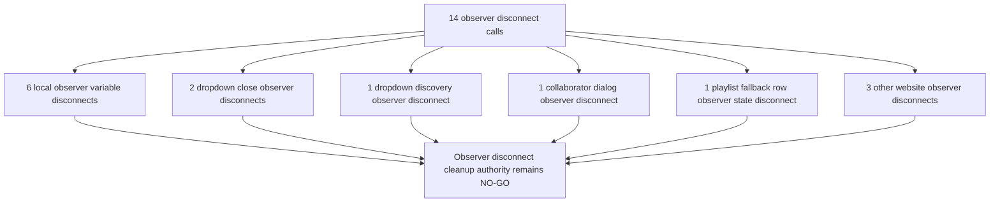

```text
observer disconnect rows: 14
local observer variable disconnect calls: 6
dropdown close observer disconnect calls: 2
dropdown discovery observer disconnect calls: 1
collab dialog observer disconnect calls: 1
popover row observer state disconnect calls: 1
other observer disconnect receiver calls: 3
observer disconnect cleanup approval: NO-GO
runtime behavior changed by this addendum: no
```

## Observer Observe/Release Parity Addendum - 2026-05-28

This addendum joins current observer activation rows to current observer release
rows at the row-count and receiver-class level. Release rows include
`.disconnect(...)`, optional-chain `.disconnect?.(...)`, and `.unobserve(...)`.
It is source-derived proof only; it does not approve observer pruning,
disconnect insertion, unobserve insertion, target widening/narrowing, menu
observer changes, quick-block observer changes, collaborator observer changes,
prefetch observer changes, whitelist observer changes, or UI component observer
changes.

| Observer observe/release parity class | Instances | Current risk meaning |
| --- | ---: | --- |
| Observe activation rows | 21 | Current runtime/UI code has 21 tracked observer target activations. |
| Release rows | 15 | Current code has 14 disconnect-style releases and 1 unobserve-style release. |
| Observe-minus-release delta | 6 | Row-count gap proves that observer cleanup cannot be assumed from constructor counts alone. |
| Local `observer` observe rows | 11 | Generic local variable names require lexical owner proof before a disconnect can be matched safely. |
| Local `obs` observe rows | 2 | Short local aliases currently have no direct release receiver row. |
| Exact named observe rows | 8 | Named handles are easier to audit, but still require route/surface/mode proof before cleanup changes. |
| Exact named observe rows with release | 7 | Named dropdown, collaborator, and website observer receivers have direct release rows. |
| Exact named observe rows without release | 1 | `prefetchObserver.observe(card)` has no direct `prefetchObserver.disconnect()` or `prefetchObserver.unobserve(...)` row today. |
| Content runtime observe/release delta | 5 | YouTube page runtime still owns the meaningful observer cleanup gap. |
| Extension UI/background observe/release delta | 1 | One dashboard/UI component observer activation lacks a release row. |
| Website component observe/release delta | 0 | Website observer rows are balanced by release count, but still require hydration/unmount proof. |

Source-family observer observe/release parity split:

| Source family | Observe rows | Release rows | Delta |
| --- | ---: | ---: | ---: |
| `content-runtime-js` | 16 | 11 | 5 |
| `extension-ui-background-js` | 1 | 0 | 1 |
| `website-components` | 4 | 4 | 0 |

ASCII observer observe/release parity flow diagram: present

```text
21 observer observe rows
        |
        +--> 11 local observer-variable observe rows
        +--> 2 local obs-variable observe rows
        +--> 8 exact named observe rows
                 |
                 +--> 7 exact named observe rows with release
                 +--> 1 prefetch observer observe row without release
        |
        +--> 14 disconnect release rows
        +--> 1 unobserve release row
        |
        v
observer observe/release cleanup authority: NO-GO until each activation has
owner, observer type, target, route/surface, settings/list-mode predicate,
release reason, no-work budget, mutation/visibility side effect, and
positive/negative fixtures.
```

Mermaid observer observe/release parity flow diagram: present

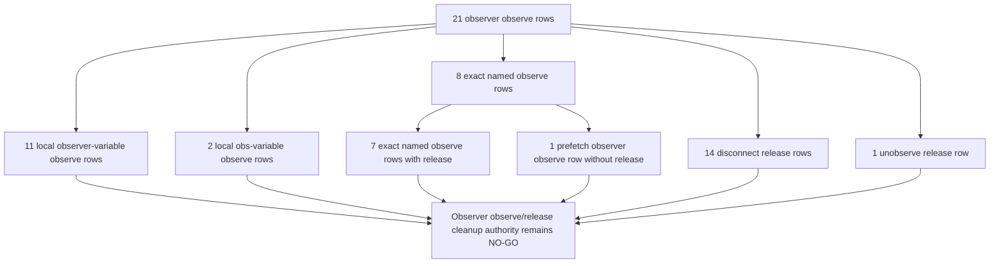

```text
observer observe rows for release parity: 21
observer release rows for parity: 15
observer disconnect release rows: 14
observer unobserve release rows: 1
observer observe-minus-release delta: 6
local observer variable observe rows: 11
local obs variable observe rows: 2
exact named observer observe rows: 8
exact named observer observe rows with release: 7
exact named observer observe rows without release: 1
prefetch observer observe rows without release: 1
content runtime observer observe/release delta: 5
extension UI background observer observe/release delta: 1
website component observer observe/release delta: 0
observer observe/release cleanup approval: NO-GO
runtime behavior changed by this addendum: no
```

## Observer Constructor/Observe Type Parity Addendum - 2026-05-28

This addendum compares current observer constructor rows to current
`.observe(...)` activation rows by observer type and source family. It is
source-derived proof only; it does not approve constructor pruning, observer
target changes, release changes, menu/dropdown observer changes, quick-block
observer changes, whitelist/prefetch observer changes, or UI component
observer changes.

| Observer constructor/observe type parity class | Instances | Current risk meaning |
| --- | ---: | --- |
| Observer constructor rows | 20 | `new MutationObserver(...)` and `new IntersectionObserver(...)` constructor count. |
| `MutationObserver` constructor rows | 16 | Mutation callbacks dominate the observer surface and can wake during large YouTube SPA DOM churn. |
| `IntersectionObserver` constructor rows | 4 | Visibility observers are fewer but still own card/identity, quick-block viewport work, and website animation state. |
| Observer observe rows | 21 | `.observe(...)` activation rows now outnumber constructors because website component observe calls include locally shaped observer activation. |
| Mutation observer observe rows | 19 | Current observe target evidence maps most non-visibility targets and website observe rows to mutation observation by source shape. |
| Intersection observer observe rows | 2 | Current observe target evidence maps to quick-block host visibility and prefetch card visibility. |
| Constructor-minus-observe delta | -1 | Count parity no longer exists repo-wide; source-family proof is required before any observer cleanup. |
| Content runtime constructor/observe delta | 0 | YouTube page runtime has count parity across 16 constructor and 16 observe rows. |
| Extension UI/background constructor/observe delta | 0 | Extension UI/background has count parity across 1 constructor and 1 observe row. |
| Website component constructor/observe delta | -1 | Website observer constructor/observe shapes are balanced by release count but not constructor-count parity. |

Source-family observer constructor/observe type parity split:

| Source family | Constructor rows | Observe rows | Delta | Type split |
| --- | ---: | ---: | ---: | --- |
| `content-runtime-js` | 16 | 16 | 0 | 14 mutation, 2 intersection |
| `extension-ui-background-js` | 1 | 1 | 0 | 1 mutation |
| `website-components` | 3 | 4 | -1 | 1 mutation, 2 intersection constructors; 4 mutation-shaped observe rows |

ASCII observer constructor/observe type parity flow diagram: present

```text
20 observer constructor rows
        |
        +--> 16 MutationObserver constructors
        +--> 4 IntersectionObserver constructors
        |
        v
21 observer observe rows
        |
        +--> 19 mutation observer observe rows
        +--> 2 intersection observer observe rows
        |
        v
constructor/observe count parity is source-family specific, and cleanup authority remains NO-GO
until each constructor is tied to owner, callback side effect, observe target,
route/surface, settings/list-mode predicate, release reason, no-work budget,
and positive/negative fixtures.
```

Mermaid observer constructor/observe type parity flow diagram: present

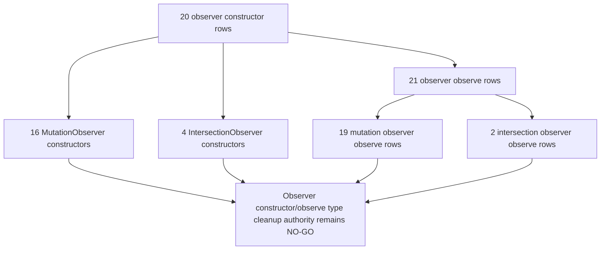

```text
observer constructor rows for type parity: 20
MutationObserver constructor rows for type parity: 16
IntersectionObserver constructor rows for type parity: 4
observer observe rows for type parity: 21
mutation observer observe rows for type parity: 19
intersection observer observe rows for type parity: 2
observer constructor-minus-observe delta: -1
mutation observer constructor-minus-observe delta: -3
intersection observer constructor-minus-observe delta: 2
content runtime observer constructor/observe delta: 0
extension UI background observer constructor/observe delta: 0
website component observer constructor/observe delta: -1
observer constructor/observe type cleanup approval: NO-GO
runtime behavior changed by this addendum: no
```

## Observer Constructor Callback Identity Addendum - 2026-05-28

This addendum classifies the callback argument passed to every current
`new MutationObserver(...)` and `new IntersectionObserver(...)` constructor.
It is source-derived proof only; it does not approve observer callback
rewrites, observer pruning, callback debouncing, route teardown, menu/dropdown
timing changes, quick-block visibility changes, prefetch/whitelist observer
changes, or UI component observer changes.

| Observer constructor callback class | Instances | Current risk meaning |
| --- | ---: | --- |
| Observer constructor callback rows | 20 | Every current observer constructor has a callback argument. |
| Inline arrow callbacks | 20 | All observer work is closure-owned today; callback identity alone does not provide a reusable teardown or profiling handle. |
| Identifier callbacks | 0 | No observer constructor currently uses a named callback reference. |
| Missing callbacks | 0 | There are no syntactically missing callback arguments in tracked JS/JSX/MJS sources. |
| `mutations` parameter callbacks | 9 | Mutation-list callbacks can scale with YouTube SPA DOM churn and require owner/effect proof before optimization. |
| `entries` parameter callbacks | 2 | Visibility entry callbacks own quick-block and prefetch behavior and need target/effect proof. |
| No-parameter callbacks | 7 | These observers react only to change occurrence, not mutation details, and need wake-frequency proof before cleanup decisions. |
| Other callback-parameter shape | 2 | Website component callback shapes need local component proof rather than extension runtime assumptions. |
| Content runtime callbacks | 16 | YouTube page runtime owns nearly all observer callback wakeups. |
| Extension UI/background callbacks | 1 | One dashboard/UI component observer callback is outside YouTube page runtime but still lifecycle-owned. |
| Website component callbacks | 3 | Public-site component observers are outside YouTube filtering but still part of package lifecycle. |

Source-family observer constructor callback split:

| Source family | Total callbacks | Callback split |
| --- | ---: | --- |
| `content-runtime-js` | 16 | 16 inline arrow callbacks |
| `extension-ui-background-js` | 1 | 1 inline arrow callback |
| `website-components` | 3 | 3 inline arrow callbacks |

ASCII observer constructor callback flow diagram: present

```text
20 observer constructor callbacks
        |
        +--> 20 inline arrow callbacks
        +--> 0 identifier callbacks
        +--> 0 missing callbacks
        |
        +--> 9 mutations-parameter callbacks
        +--> 2 entries-parameter callbacks
        +--> 7 no-parameter callbacks
        +--> 2 other callback-parameter shapes
        |
        v
observer constructor callback cleanup authority: NO-GO until each callback has
owner, observed target, route/surface, settings/list-mode predicate, callback
side effects, no-work budget, wake-frequency evidence, release reason, and
positive/negative fixtures.
```

Mermaid observer constructor callback flow diagram: present

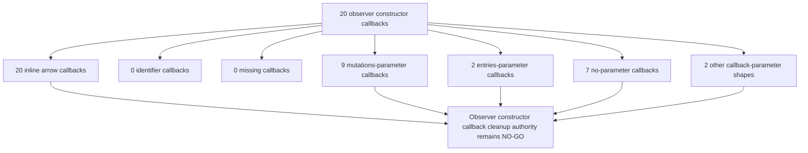

```text
observer constructor callback rows: 20
inline arrow observer constructor callbacks: 20
identifier observer constructor callbacks: 0
missing observer constructor callbacks: 0
observer callbacks with mutations parameter: 9
observer callbacks with entries parameter: 2
observer callbacks with no parameter: 7
content runtime observer constructor callbacks: 16
extension UI background observer constructor callbacks: 1
website component observer constructor callbacks: 3
observer constructor callback cleanup approval: NO-GO
runtime behavior changed by this addendum: no
```

## Timer Delay Shape Addendum - 2026-05-28

This addendum classifies the second delay argument for every current tracked
`setTimeout(...)` and `setInterval(...)` schedule. It is source-derived proof
only; it does not approve timer pruning, debounce changes, SPA refresh cadence
changes, menu/quick-block timing changes, JSON replay timing changes,
background flush timing changes, or no-rule timer cleanup.

| Timer delay class | Instances | Current risk meaning |
| --- | ---: | --- |
| Numeric zero | 16 | Immediate async work can still batch behind the event loop and wake during route/menu churn. |
| Numeric 1-99ms | 16 | Near-immediate timers are hot-path candidates for YouTube SPA lag and native menu contention. |
| Numeric 100-199ms | 18 | Short debounce and recovery windows need proof that they are active only when feature work is required. |
| Numeric 200-999ms | 17 | Mid-window retries and delayed scans can pile up across page transitions if not route/version gated. |
| Numeric 1000-4999ms | 13 | Longer retries and watchdogs need explicit ownership and stale-route cancellation proof. |
| Numeric 5000ms plus | 4 | Long timers are less hot but can leak stale state or replay work after a navigation. |
| Named or expression delay | 37 | Indirect delays need semantic owner proof before any cleanup or budget claim. |
| `Math.max(...)` expression | 5 | Dynamic lower-bound timers need caller/pending-state proof before they are treated as cheap. |
| Missing delay argument | 0 | Every tracked timer has an explicit second argument today. |

Timer family split:

| Timer family | Delay rows |
| --- | ---: |
| `setTimeout` | 123 |
| `setInterval` | 3 |

Source-family timer delay split:

| Source family | Total delay rows | Delay shape summary |
| --- | ---: | --- |
| `content-runtime-js` | 86 | 10 zero, 12 in 1-99ms, 14 in 100-199ms, 10 in 200-999ms, 10 in 1000-4999ms, 4 in 5000ms plus, 21 named/expression, 5 `Math.max(...)`. |
| `extension-ui-background-js` | 39 | 6 zero, 4 in 1-99ms, 4 in 100-199ms, 7 in 200-999ms, 3 in 1000-4999ms, 15 named/expression. |
| `website-components` | 1 | 1 named/expression delay. |

ASCII timer delay flow diagram: present

```text
126 timer delay rows
        |
        +--> 123 setTimeout schedules
        +-->   3 setInterval schedules
        |
        +--> 16 numeric zero delays
        +--> 16 numeric 1-99ms delays
        +--> 18 numeric 100-199ms delays
        +--> 17 numeric 200-999ms delays
        +--> 13 numeric 1000-4999ms delays
        +-->  4 numeric 5000ms plus delays
        +--> 37 named or expression delays
        +-->  5 Math.max expression delays
        +-->  0 missing delay arguments
        |
        v
timer cleanup authority: NO-GO until each timer has owner, route/surface,
settings/list-mode predicate, no-rule budget, stale-route cancellation,
scheduled side effect, native/menu impact, and positive/negative fixtures.
```

Mermaid timer delay flow diagram: present

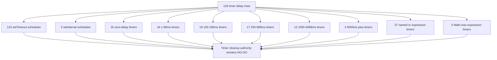

```text
timer delay rows: 126
setTimeout delay rows: 123
setInterval delay rows: 3
numeric zero timer delays: 16
numeric 1-99ms timer delays: 16
numeric 100-199ms timer delays: 18
numeric 200-999ms timer delays: 17
numeric 1000-4999ms timer delays: 13
numeric 5000ms plus timer delays: 4
named or expression timer delays: 37
math max expression timer delays: 5
missing timer delay arguments: 0
timer delay cleanup approval: NO-GO
runtime behavior changed by this addendum: no
```

## Timer Callback Identity Addendum - 2026-05-28

This addendum classifies the first callback argument for every current tracked
`setTimeout(...)` and `setInterval(...)` schedule. It is source-derived proof
only; it does not approve timer pruning, callback coalescing, debounce rewrites,
SPA refresh cadence changes, menu/quick-block timing changes, JSON replay
timing changes, background flush timing changes, or no-rule timer cleanup.

| Timer callback class | Instances | Current risk meaning |
| --- | ---: | --- |
| Inline arrow callback | 107 | Most timer work is anonymous closure-capturing work; pruning needs owner, captured-state, and side-effect proof. |
| Identifier callback reference | 19 | Named callbacks are easier to trace, but still need route, delay, handle, cancellation, and no-work proof. |
| Inline function callback | 0 | No tracked timer currently uses a classic inline `function` callback. |
| Member callback reference | 0 | No tracked timer currently schedules a member callback directly. |
| Missing callback argument | 0 | Every tracked timer has an explicit callback argument today. |

Timer callback family split:

| Timer family | Callback rows |
| --- | ---: |
| `setTimeout` | 123 |
| `setInterval` | 3 |

Source-family timer callback split:

| Source family | Total callback rows | Callback shape summary |
| --- | ---: | --- |
| `content-runtime-js` | 86 | 73 inline arrow callbacks, 13 identifier callbacks. |
| `extension-ui-background-js` | 39 | 33 inline arrow callbacks, 6 identifier callbacks. |
| `website-components` | 1 | 1 inline arrow callback. |

ASCII timer callback flow diagram: present

```text
126 timer callback rows
        |
        +--> 123 setTimeout callback rows
        +-->   3 setInterval callback rows
        |
        +--> 107 inline arrow callbacks
        +-->  19 identifier callback references
        +-->   0 inline function callbacks
        +-->   0 member callback references
        +-->   0 missing callback arguments
        |
        v
timer callback cleanup authority: NO-GO until each timer callback has owner,
route/surface, delay, handle/cancel policy, captured-state proof,
settings/list-mode predicate, scheduled DOM/message/storage/network side
effect, stale-route cancellation, no-rule budget, and positive/negative
fixtures.
```

Mermaid timer callback flow diagram: present

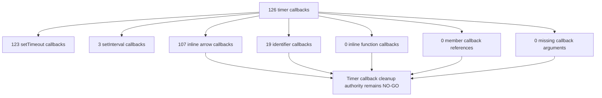

```text
timer callback rows: 126
setTimeout callback rows: 123
setInterval callback rows: 3
inline arrow timer callbacks: 107
identifier timer callbacks: 19
inline function timer callbacks: 0
member reference timer callbacks: 0
missing timer callback arguments: 0
content runtime timer callbacks: 86
extension UI background timer callbacks: 39
website component timer callbacks: 1
timer callback cleanup approval: NO-GO
runtime behavior changed by this addendum: no
```

## Timer Schedule/Clear Parity Addendum - 2026-05-28

This addendum joins every current `setTimeout(...)` and `setInterval(...)`
schedule row with every current `clearTimeout(...)` and `clearInterval(...)`
row by direct lexical handle where one exists. It is source-derived proof only;
it does not approve timer pruning, callback coalescing, debounce rewrites,
route teardown, no-rule timer cleanup, generated-shell edits, or public
performance claims.

| Timer schedule/clear measurement | Instances | Current risk meaning |
| --- | ---: | --- |
| `setTimeout` schedule rows for parity | 123 | Timeout scheduling remains broad and needs owner, route, setting, delay, and side-effect proof before pruning. |
| `clearTimeout` rows for parity | 34 | A subset of timeout work has explicit clear rows. |
| `setInterval` schedule rows for parity | 3 | Interval work is small but page-lifetime and stale-route behavior still need owner proof. |
| `clearInterval` rows for parity | 4 | All scheduled interval handles are cleared somewhere; `engineCheckInterval` has two clear rows. |
| `setTimeout` schedule-minus-clear delta | 89 | This is not a leak count, but it is the current unproven timeout cleanup burden. |
| `setInterval` schedule-minus-clear delta | -1 | Clear rows outnumber interval schedules because one interval handle has multiple clear sites. |
| `clearTimeout` rows with direct schedule handle | 32 | Most timeout clear rows match a directly scheduled handle by source-derived handle name. |
| `clearTimeout` rows without direct schedule handle | 2 | Two clear rows use alias/returned-handle patterns outside the direct lexical match. |
| Handled timeout schedule rows with clear handle | 26 | Only part of the handled timeout schedule surface has a matching clear handle. |
| Handled timeout schedule rows without clear handle | 19 | Assigned timeout handles still need page/route lifetime proof before cleanup changes. |
| Distinct scheduled timeout handles without clear | 18 | Distinct timeout state variables remain unpaired by direct clear rows. |
| `clearInterval` rows with direct schedule handle | 4 | Every interval clear row matches a directly scheduled interval handle. |
| `clearInterval` rows without direct schedule handle | 0 | No current interval clear row is orphaned by direct handle matching. |
| Handled interval schedule rows with clear handle | 3 | Every scheduled interval handle has a matching clear handle. |
| Handled interval schedule rows without clear handle | 0 | No scheduled interval handle is missing a direct clear handle today. |

Timeout schedule handle split:

| Timeout schedule handle class | Instances |
| --- | ---: |
| Assigned local id handle | 11 |
| Assigned named state handle | 24 |
| Assigned property-held handle | 10 |
| Fire-and-forget schedule | 63 |
| Promise sleep or timeout | 14 |
| Returned timer handle | 1 |

Interval schedule handle split:

| Interval schedule handle class | Instances |
| --- | ---: |
| Assigned named state handle | 3 |

Source-family timer schedule/clear parity:

| Source family | Schedules | Clears | Delta |
| --- | ---: | ---: | ---: |
| `content-runtime-js` | 86 | 25 | 61 |
| `extension-ui-background-js` | 39 | 11 | 28 |
| `website-components` | 1 | 2 | -1 |

ASCII timer schedule/clear parity flow diagram: present

```text
126 timer schedules
        |
        +--> 123 setTimeout schedules
        |       +--> 34 clearTimeout rows
        |       +--> 32 clear rows with direct schedule handle
        |       +-->  2 clear rows without direct schedule handle
        |       +--> 26 handled schedule rows with clear handle
        |       +--> 19 handled schedule rows without clear handle
        |       +--> 18 distinct scheduled handles without clear
        |
        +-->   3 setInterval schedules
                +--> 4 clearInterval rows
                +--> 4 clear rows with direct schedule handle
                +--> 0 clear rows without direct schedule handle
                +--> 3 handled schedule rows with clear handle
                +--> 0 handled schedule rows without clear handle

timer schedule/clear cleanup authority: NO-GO until each timer has owner,
route/surface, settings/list-mode predicate, no-rule budget, stale-route
cancellation, scheduled side effect, native/menu impact, and fixtures.
```

Mermaid timer schedule/clear parity flow diagram: present

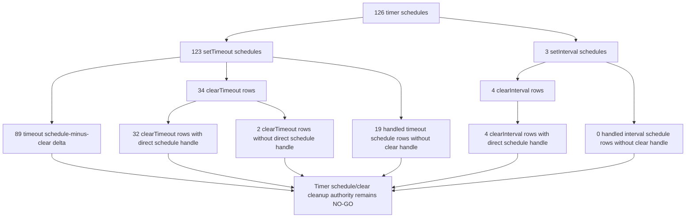

```text
setTimeout schedule rows for parity: 123
clearTimeout rows for parity: 34
setInterval schedule rows for parity: 3
clearInterval rows for parity: 4
setTimeout schedule-minus-clear delta: 89
setInterval schedule-minus-clear delta: -1
timeout schedules with assigned local id handle: 11
timeout schedules with assigned named state handle: 24
timeout schedules with assigned property-held handle: 10
timeout fire-and-forget schedules: 63
timeout promise sleep or timeout schedules: 14
timeout returned handle schedules: 1
interval schedules with assigned named state handle: 3
clearTimeout rows with direct schedule handle: 32
clearTimeout rows without direct schedule handle: 2
handled timeout schedule rows with clear handle: 26
handled timeout schedule rows without clear handle: 19
distinct scheduled timeout handles without clear: 18
clearInterval rows with direct schedule handle: 4
clearInterval rows without direct schedule handle: 0
handled interval schedule rows with clear handle: 3
handled interval schedule rows without clear handle: 0
distinct scheduled interval handles without clear: 0
content runtime timer schedule/clear delta: 61
extension UI background timer schedule/clear delta: 28
website component timer schedule/clear delta: -1
timer schedule/clear cleanup approval: NO-GO
runtime behavior changed by this addendum: no
```

## Timer Owner Domain Context Addendum - 2026-05-30

This addendum classifies every current `setTimeout(...)` and
`setInterval(...)` schedule row by source-derived owner domain. It does not
approve cleanup, debounce rewrites, route teardown, settings-mode pruning, or
timer consolidation. It exists to prevent future lag fixes from treating all
timers as one class: a quick-block/menu timer, whitelist-pending timer,
background map flush debounce, page-world readiness timer, and dashboard UI
timer have different correctness and false-hide/leak risks.

Owner-domain timer schedule split:

| Owner domain | Timer schedules | `setTimeout` | `setInterval` | Current risk meaning |
| --- | ---: | ---: | ---: | --- |
| `content-bridge-owner` | 37 | 36 | 1 | Whitelist pending, fallback menu, prefetch, bridge, and route work can affect YouTube SPA lag and false-hide/leak behavior. |
| `quick-and-menu-owner` | 16 | 16 | 0 | Quick-cross, native menu, dropdown discovery, and pointer/menu timing can affect the exact UI responsiveness reports. |
| `dashboard-ui-owner` | 15 | 14 | 1 | Dashboard/profile/filter UI timers can alter settings propagation and perceived extension state. |
| `background-authority-owner` | 10 | 10 | 0 | Background flush, backup, enrichment, and fetch-timeout timers can affect storage pressure and learned identity freshness. |
| `dom-fallback-owner` | 10 | 10 | 0 | DOM fallback timers can wake broad rendered-card scans or delayed playlist/watch behavior. |
| `state-import-owner` | 8 | 8 | 0 | Import/export/state timers can affect bulk list mutation and settings fanout. |
| `injector-page-world-owner` | 6 | 5 | 1 | Main-world readiness and queue timers can affect JSON-first replay and page-world handoff timing. |
| `extension-ui-background-owner` | 6 | 6 | 0 | Shared UI/background helper timers still require owner-specific teardown proof. |
| `content-helper-owner` | 12 | 12 | 0 | Content helper timers remain page-runtime work even when owned outside the central bridge. |
| `collaborator-dialog-owner` | 2 | 2 | 0 | Dialog timers can affect collaborator UI timing and cleanup. |
| `popup-ui-owner` | 2 | 2 | 0 | Popup timers can affect settings/list-mode mutation timing. |
| `seed-network-owner` | 1 | 1 | 0 | Seed network timer work remains tied to MAIN-world readiness and transport no-work budgets. |
| `website-client-owner` | 1 | 1 | 0 | Website timer work is separate from YouTube runtime but still part of tracked lifecycle proof. |

Source-family owner context:

| Source family | Timer schedules | Current interpretation |
| --- | ---: | --- |
| `content-runtime-js` | 86 | Most timer schedules that can directly affect YouTube page lag, menus, whitelist pending, JSON transport, or fallback scans. |
| `extension-ui-background-js` | 39 | UI/background schedules that can alter settings, cache, import/export, profile, and sync state feeding page runtime. |
| `website-components` | 1 | Website-only client timer; not a YouTube runtime no-work proof. |

ASCII timer owner-domain flow diagram: present

```text
126 timer schedules
  |
  +--> 86 content-runtime-js
  |     +--> 37 content bridge owner
  |     +--> 16 quick/menu owner
  |     +--> 12 content helper owner
  |     +--> 10 DOM fallback owner
  |     +-->  6 injector page-world owner
  |     +-->  2 collaborator dialog owner
  |     +-->  1 seed network owner
  |
  +--> 39 extension-ui-background-js
  |     +--> 15 dashboard UI owner
  |     +--> 10 background authority owner
  |     +-->  8 state/import owner
  |     +-->  6 extension UI/background helper owner
  |     +-->  2 popup UI owner
  |
  +-->  1 website component owner
```

Mermaid timer owner-domain flow diagram: present

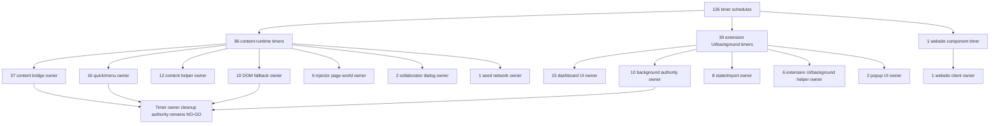

Current semantic status after this addendum:

```text
timer owner-context rows: 126
timer owner domains: 13
content-runtime timer owner-context rows: 86
extension UI/background timer owner-context rows: 39
website component timer owner-context rows: 1
content bridge timer owner-context rows: 37
quick/menu timer owner-context rows: 16
dashboard timer owner-context rows: 15
background timer owner-context rows: 10
dom fallback timer owner-context rows: 10
timer owner-context cleanup approval: NO-GO
runtime behavior changed by this addendum: no
```

## Timer Owner Delay Budget Addendum - 2026-05-30

This addendum collapses every current `setTimeout(...)` and
`setInterval(...)` delay argument into owner-domain delay budgets. It is
source-derived proof only; it does not approve timer cleanup, debounce
rewrites, whitelist/cache optimization, JSON-first promotion, route teardown,
or timer consolidation. It exists to keep performance work honest: zero-delay
and sub-200ms page-runtime timers are a different risk class from long retry
timers, named-expression timers, background flush timers, and UI-only timers.

Timer delay-budget split:

| Delay budget | Timer rows | Current risk meaning |
| --- | ---: | --- |
| `named-or-expression` | 37 | Named constants and variable delays need owner-specific budget proof before any simplification or coalescing. |
| `short-under-200ms` | 34 | Short page-runtime retries/debounces are the most likely to affect YouTube SPA responsiveness when repeated across navigation. |
| `medium-200-999ms` | 17 | Medium timers can still stack across route changes, especially when tied to bridge, dashboard, background, or helper owners. |
| `long-1000ms-plus` | 17 | Long retries and cleanup timers need stale-route and no-work proof before removal or delay changes. |
| `immediate-zero` | 16 | Zero-delay deferrals can repeatedly enqueue DOM/menu/refresh work and need no-rule and route proof. |
| `bounded-expression` | 5 | `Math.max(...)` delays are dynamic budgets and need separate argument-level proof before rewrites. |

Owner-domain delay-budget matrix:

| Owner domain | Timer rows | Zero | Short | Medium | Long | Bounded | Named/expression |
| --- | ---: | ---: | ---: | ---: | ---: | ---: | ---: |
| `content-bridge-owner` | 37 | 3 | 10 | 3 | 8 | 2 | 11 |
| `quick-and-menu-owner` | 16 | 4 | 5 | 0 | 3 | 0 | 4 |
| `dashboard-ui-owner` | 15 | 1 | 4 | 5 | 3 | 0 | 2 |
| `content-helper-owner` | 12 | 0 | 5 | 2 | 0 | 3 | 2 |
| `background-authority-owner` | 10 | 0 | 2 | 1 | 0 | 0 | 7 |
| `dom-fallback-owner` | 10 | 3 | 3 | 1 | 1 | 0 | 2 |
| `state-import-owner` | 8 | 3 | 1 | 0 | 0 | 0 | 4 |
| `extension-ui-background-owner` | 6 | 1 | 2 | 1 | 0 | 0 | 2 |
| `injector-page-world-owner` | 6 | 0 | 1 | 2 | 1 | 0 | 2 |
| `collaborator-dialog-owner` | 2 | 0 | 0 | 1 | 1 | 0 | 0 |
| `popup-ui-owner` | 2 | 1 | 1 | 0 | 0 | 0 | 0 |
| `seed-network-owner` | 1 | 0 | 0 | 1 | 0 | 0 | 0 |
| `website-client-owner` | 1 | 0 | 0 | 0 | 0 | 0 | 1 |

High-frequency owner risk notes:

| Owner/domain note | Rows | Current risk meaning |
| --- | ---: | --- |
| Immediate plus short timer rows across all owners | 50 | These are the rows most likely to amplify route-change, menu, and pending-refresh work. |
| Content bridge immediate plus short timer rows | 13 | Whitelist pending, fallback menu, metadata, and bridge work need route/mode no-work proof before timer pruning. |
| Quick/menu immediate plus short timer rows | 9 | Quick-cross and native dropdown behavior remain directly tied to reported menu responsiveness. |
| DOM fallback immediate plus short timer rows | 6 | Fallback scans and pending reruns still need false-hide/leak and no-rule proof. |
| Dashboard immediate plus short timer rows | 5 | UI state timers can affect settings propagation and perceived mode/list state. |
| State/import immediate plus short timer rows | 4 | Import/export and state mutation timers can affect cross-context refresh fanout. |

ASCII timer owner delay-budget flow diagram: present

```text
126 timer schedules
  |
  +--> 50 immediate/short rows
  |     +--> 13 content bridge rows
  |     +-->  9 quick/menu rows
  |     +-->  6 DOM fallback rows
  |     +-->  5 dashboard rows
  |     +-->  4 state/import rows
  |
  +--> 34 medium/long rows
  +--> 37 named/expression rows
  +-->  5 bounded-expression rows
  |
  v
delay-budget cleanup authority: NO-GO until each owner has route, surface,
settings/list-mode predicate, no-rule budget, stale-route cancellation,
native/menu impact, false-hide/leak proof, and positive/negative fixtures.
```

Mermaid timer owner delay-budget flow diagram: present

```mermaid
flowchart TD
  A["126 timer schedules"] --> B["50 immediate or short rows"]
  B --> C["13 content bridge rows"]
  B --> D["9 quick/menu rows"]
  B --> E["6 DOM fallback rows"]
  B --> F["5 dashboard rows"]
  B --> G["4 state/import rows"]
  A --> H["34 medium or long rows"]
  A --> I["37 named/expression rows"]
  A --> J["5 bounded-expression rows"]
  C --> K["Timer owner delay-budget cleanup remains NO-GO"]
  D --> K
  E --> K
  H --> K
  I --> K
  J --> K
```

Current semantic status after this addendum:

```text
timer owner delay-budget rows: 126
timer owner immediate-zero budget rows: 16
timer owner short-under-200ms budget rows: 34
timer owner medium-200-999ms budget rows: 17
timer owner long-1000ms-plus budget rows: 17
timer owner bounded-expression budget rows: 5
timer owner named-or-expression budget rows: 37
content bridge immediate-or-short timer budget rows: 13
quick/menu immediate-or-short timer budget rows: 9
dom fallback immediate-or-short timer budget rows: 6
dashboard immediate-or-short timer budget rows: 5
timer owner delay-budget cleanup approval: NO-GO
runtime behavior changed by this addendum: no
```

## Timer Immediate/Short Row Context Addendum - 2026-05-30

This addendum classifies the 50 current timer rows whose delay budget is either
zero or under 200ms. It is source-derived proof only; it does not approve timer
cleanup, timer delay changes, route teardown, whitelist/cache optimization,
JSON-first promotion, native/dropdown menu rewrites, or DOM fallback pruning.
The point is to separate high-frequency rows by the current side effect they
schedule before any performance fix treats them as interchangeable.

Immediate/short owner split:

| Owner domain | Hot timer rows | Current risk meaning |
| --- | ---: | --- |
| `content-bridge-owner` | 13 | Whitelist refresh, collaborator reruns, fallback menu scans, native menu focus release, dropdown close, playlist fallback press, startup, and stamp-triggered fallback reruns. |
| `quick-and-menu-owner` | 9 | Quick-block sweep/runtime refresh and native dropdown injection/body readiness timers can affect the exact YouTube menu responsiveness reports. |
| `dom-fallback-owner` | 6 | Cooperative yield, playlist navigation, and pending rerun timers can affect false-hide/leak and playback-adjacent behavior. |
| `content-helper-owner` | 5 | Script injection sequencing, post-injection settings refresh, and prompt animation timers are page-runtime work but not card filtering decisions. |
| `dashboard-ui-owner` | 5 | Dashboard focus and listener-bind timers are UI-only but can affect perceived settings state. |
| `state-import-owner` | 4 | Channel enrichment and external reload timers can fan out settings/list changes. |
| `extension-ui-background-owner` | 3 | Filter-logic map flush and idle-polyfill timers bridge page-world/runtime work. |
| `background-authority-owner` | 2 | Learned map flush timers can affect storage pressure and identity freshness. |
| `popup-ui-owner` | 2 | Popup focus and listener-bind timers are UI-only settings mutation support. |
| `injector-page-world-owner` | 1 | Engine readiness polling gates main-world JSON processing startup. |

Immediate/short side-effect classes:

| Side-effect class | Rows | Source rows |
| --- | ---: | --- |
| `dom-fallback-playlist-navigation` | 4 | `js/content/dom_fallback.js:873`, `js/content/dom_fallback.js:915`, `js/content/dom_fallback.js:2432`, `js/content/dom_fallback.js:3816` |
| `content-bridge-fallback-menu-scan` | 3 | `js/content_bridge.js:7071`, `js/content_bridge.js:7083`, `js/content_bridge.js:7190` |
| `content-helper-prompt-dismiss-animation` | 3 | `js/content/first_run_prompt.js:122`, `js/content/first_run_prompt.js:143`, `js/content/release_notes_prompt.js:62` |
| `dashboard-quick-action-focus` | 3 | `js/tab-view.js:11456`, `js/tab-view.js:11466`, `js/tab-view.js:11477` |
| `quick-menu-native-dropdown-injection` | 3 | `js/content/block_channel.js:2368`, `js/content/block_channel.js:2439`, `js/content/block_channel.js:2444` |
| `background-map-flush` | 2 | `js/background.js:1634`, `js/background.js:1642` |
| `content-bridge-collaborator-rerun` | 2 | `js/content_bridge.js:3591`, `js/content_bridge.js:3696` |
| `content-bridge-single-channel-menu-close` | 2 | `js/content_bridge.js:12552`, `js/content_bridge.js:13305` |
| `content-bridge-whitelist-refresh` | 2 | `js/content_bridge.js:1242`, `js/content_bridge.js:1244` |
| `extension-ui-background-filter-logic-map-flush` | 2 | `js/filter_logic.js:65`, `js/filter_logic.js:126` |
| `quick-menu-runtime-state-refresh` | 2 | `js/content/block_channel.js:1995`, `js/content/block_channel.js:2004` |
| `state-import-channel-enrichment` | 2 | `js/state_manager.js:500`, `js/state_manager.js:650` |
| `state-import-external-reload` | 2 | `js/state_manager.js:2344`, `js/state_manager.js:2350` |
| `content-bridge-native-menu-focus-release` | 1 | `js/content_bridge.js:569` |
| `content-bridge-playlist-fallback-press` | 1 | `js/content_bridge.js:7647` |
| `content-bridge-stamp-fallback-rerun` | 1 | `js/content_bridge.js:1503` |
| `content-bridge-startup-initialize` | 1 | `js/content_bridge.js:13533` |
| `content-helper-main-world-script-chain` | 1 | `js/content/bridge_injection.js:64` |
| `content-helper-post-injection-settings-refresh` | 1 | `js/content/bridge_injection.js:96` |
| `dashboard-content-filter-listener-bind` | 1 | `js/tab-view.js:1204` |
| `dashboard-dialog-focus` | 1 | `js/tab-view.js:5223` |
| `dom-fallback-cooperative-yield` | 1 | `js/content/dom_fallback.js:2056` |
| `dom-fallback-pending-rerun` | 1 | `js/content/dom_fallback.js:4530` |
| `extension-ui-background-render-engine-idle-polyfill` | 1 | `js/render_engine.js:22` |
| `injector-engine-readiness-poll` | 1 | `js/injector.js:3560` |
| `popup-content-filter-listener-bind` | 1 | `js/popup.js:505` |
| `popup-dialog-focus` | 1 | `js/popup.js:1216` |
| `quick-menu-kids-passive-body-readiness` | 1 | `js/content/block_channel.js:2616` |
| `quick-menu-native-menu-body-readiness` | 1 | `js/content/block_channel.js:2581` |
| `quick-menu-quick-block-fallback-rerun` | 1 | `js/content/block_channel.js:1762` |
| `quick-menu-quick-block-sweep` | 1 | `js/content/block_channel.js:1962` |

ASCII immediate/short timer row-context flow diagram: present

```text
50 immediate/short timer rows
  |
  +--> 13 content bridge rows
  |     +--> whitelist refresh, collaborator rerun, fallback menu scan,
  |          native menu focus release, dropdown close, startup, stamp rerun
  |
  +-->  9 quick/menu rows
  |     +--> quick-block sweep/runtime refresh, dropdown injection, body readiness
  |
  +-->  6 DOM fallback rows
  |     +--> playlist navigation, cooperative yield, pending rerun
  |
  +--> 22 UI/background/helper/state rows
        +--> focus/listener bind, prompt animation, map flush, enrichment,
             external reload, engine readiness
```

Mermaid immediate/short timer row-context flow diagram: present

```mermaid
flowchart TD
  A["50 immediate/short timer rows"] --> B["13 content bridge rows"]
  A --> C["9 quick/menu rows"]
  A --> D["6 DOM fallback rows"]
  A --> E["22 UI/background/helper/state rows"]
  B --> F["Whitelist, collaborator, fallback menu, dropdown close, startup"]
  C --> G["Quick-block sweep/runtime refresh, dropdown injection, body readiness"]
  D --> H["Playlist navigation, cooperative yield, pending rerun"]
  F --> I["Immediate/short timer cleanup remains NO-GO"]
  G --> I
  H --> I
  E --> I
```

Current semantic status after this addendum:

```text
timer immediate-short context rows: 50
timer immediate-short owner domains: 10
timer immediate-short side-effect classes: 31
content bridge immediate-short context rows: 13
quick/menu immediate-short context rows: 9
dom fallback immediate-short context rows: 6
content helper immediate-short context rows: 5
dashboard immediate-short context rows: 5
state/import immediate-short context rows: 4
native dropdown injection immediate-short timer rows: 3
DOM fallback playlist navigation immediate-short timer rows: 4
content bridge whitelist refresh immediate-short timer rows: 2
timer immediate-short context cleanup approval: NO-GO
runtime behavior changed by this addendum: no
```

## Timer Immediate/Short Admission Gate Addendum - 2026-05-30

This addendum classifies the same 50 zero-delay and sub-200ms timer rows by
the current admission trigger that schedules them. It is source-derived proof
only; it does not approve timer cleanup, timer delay changes, route teardown,
native/dropdown menu rewrites, whitelist/cache optimization, JSON-first
promotion, or DOM fallback pruning. The purpose is to keep future optimization
work from treating boot/readiness timers, user-menu timers, DOM rerun timers,
and storage/cache timers as one interchangeable bucket.

Immediate/short admission family split:

| Admission family | Rows | Current risk meaning |
| --- | ---: | --- |
| `user-menu-or-navigation` | 22 | User-near timers for menu close, dropdown injection, quick-block refresh, prompt/dialog focus, and playlist navigation must preserve click/menu responsiveness before any delay or cleanup change. |
| `dom-rerun-or-scan` | 11 | DOM fallback, whitelist non-watch observer, collaborator/stamp reruns, fallback menu scans, and quick-block eager sweeps can directly affect false-hide/leak behavior and SPA work. |
| `bootstrap-readiness` | 9 | Startup, injection, listener bind, body readiness, idle polyfill, and engine readiness timers are not per-card rule decisions but can still tax first-page load. |
| `storage-cache-refresh` | 8 | Background/filter map flush, channel enrichment, and external reload timers can affect storage pressure and cross-context freshness. |

Immediate/short admission trigger classes:

| Admission trigger class | Family | Rows | Source rows |
| --- | --- | ---: | --- |
| `watch-playlist-navigation-action` | `user-menu-or-navigation` | 4 | `js/content/dom_fallback.js:873`, `js/content/dom_fallback.js:915`, `js/content/dom_fallback.js:2432`, `js/content/dom_fallback.js:3816` |
| `content-prompt-dismiss-click` | `user-menu-or-navigation` | 3 | `js/content/first_run_prompt.js:122`, `js/content/first_run_prompt.js:143`, `js/content/release_notes_prompt.js:62` |
| `dashboard-quick-action-click-focus` | `user-menu-or-navigation` | 3 | `js/tab-view.js:11456`, `js/tab-view.js:11466`, `js/tab-view.js:11477` |
| `fallback-menu-scan-trigger` | `dom-rerun-or-scan` | 3 | `js/content_bridge.js:7071`, `js/content_bridge.js:7083`, `js/content_bridge.js:7190` |
| `native-dropdown-injection-trigger` | `user-menu-or-navigation` | 3 | `js/content/block_channel.js:2368`, `js/content/block_channel.js:2439`, `js/content/block_channel.js:2444` |
| `background-cache-write-debounce` | `storage-cache-refresh` | 2 | `js/background.js:1634`, `js/background.js:1642` |
| `block-action-menu-close` | `user-menu-or-navigation` | 2 | `js/content_bridge.js:12552`, `js/content_bridge.js:13305` |
| `collaborator-resolution-dom-rerun` | `dom-rerun-or-scan` | 2 | `js/content_bridge.js:3591`, `js/content_bridge.js:3696` |
| `extension-ui-dialog-focus` | `user-menu-or-navigation` | 2 | `js/tab-view.js:5223`, `js/popup.js:1216` |
| `extension-ui-listener-bootstrap` | `bootstrap-readiness` | 2 | `js/tab-view.js:1204`, `js/popup.js:505` |
| `page-world-map-message-debounce` | `storage-cache-refresh` | 2 | `js/filter_logic.js:65`, `js/filter_logic.js:126` |
| `quick-block-global-input-refresh` | `user-menu-or-navigation` | 2 | `js/content/block_channel.js:1995`, `js/content/block_channel.js:2004` |
| `storage-channel-enrichment` | `storage-cache-refresh` | 2 | `js/state_manager.js:500`, `js/state_manager.js:650` |
| `storage-external-reload` | `storage-cache-refresh` | 2 | `js/state_manager.js:2344`, `js/state_manager.js:2350` |
| `whitelist-mode-non-watch-observer` | `dom-rerun-or-scan` | 2 | `js/content_bridge.js:1242`, `js/content_bridge.js:1244` |
| `content-bridge-startup-bootstrap` | `bootstrap-readiness` | 1 | `js/content_bridge.js:13533` |
| `dom-fallback-active-run-yield` | `dom-rerun-or-scan` | 1 | `js/content/dom_fallback.js:2056` |
| `dom-fallback-pending-coalesced-rerun` | `dom-rerun-or-scan` | 1 | `js/content/dom_fallback.js:4530` |
| `fallback-menu-row-click-feedback` | `user-menu-or-navigation` | 1 | `js/content_bridge.js:7647` |
| `identity-stamp-dom-rerun` | `dom-rerun-or-scan` | 1 | `js/content_bridge.js:1503` |
| `idle-polyfill-fallback` | `bootstrap-readiness` | 1 | `js/render_engine.js:22` |
| `kids-body-readiness-bootstrap` | `bootstrap-readiness` | 1 | `js/content/block_channel.js:2616` |
| `main-world-engine-readiness-poll` | `bootstrap-readiness` | 1 | `js/injector.js:3560` |
| `main-world-injection-chain` | `bootstrap-readiness` | 1 | `js/content/bridge_injection.js:64` |
| `native-menu-body-readiness-bootstrap` | `bootstrap-readiness` | 1 | `js/content/block_channel.js:2581` |
| `native-menu-close-focus-release` | `user-menu-or-navigation` | 1 | `js/content_bridge.js:569` |
| `post-injection-settings-refresh` | `bootstrap-readiness` | 1 | `js/content/bridge_injection.js:96` |
| `quick-block-eager-sweep` | `dom-rerun-or-scan` | 1 | `js/content/block_channel.js:1962` |
| `quick-block-fallback-action-rerun` | `user-menu-or-navigation` | 1 | `js/content/block_channel.js:1762` |

ASCII immediate/short timer admission flow diagram: present

```text
50 immediate/short timer admission rows
  |
  +--> 22 user/menu/navigation rows
  |     +--> dropdown injection, menu close, quick-block refresh,
  |          prompt/dialog focus, playlist navigation
  |
  +--> 11 DOM rerun/scan rows
  |     +--> whitelist non-watch observer, collaborator/stamp rerun,
  |          fallback menu scan, DOM fallback pending/yield
  |
  +-->  9 bootstrap/readiness rows
  |     +--> script injection, startup initialize, body readiness,
  |          listener bind, idle polyfill, engine poll
  |
  +-->  8 storage/cache rows
        +--> learned map flush, page-world map message debounce,
             channel enrichment, external reload
```

Mermaid immediate/short timer admission flow diagram: present

```mermaid
flowchart TD
  A["50 immediate/short timer admission rows"] --> B["22 user/menu/navigation rows"]
  A --> C["11 DOM rerun/scan rows"]
  A --> D["9 bootstrap/readiness rows"]
  A --> E["8 storage/cache rows"]
  B --> F["Menu, dropdown, quick-block, prompt, playlist timing"]
  C --> G["Whitelist observer, DOM fallback, collaborator/stamp reruns"]
  D --> H["Startup, injection, listener bind, body readiness"]
  E --> I["Map flush, enrichment, external reload"]
  F --> J["Timer admission cleanup remains NO-GO"]
  G --> J
  H --> J
  I --> J
```

Current semantic status after this addendum:

```text
timer immediate-short admission rows: 50
timer immediate-short admission families: 4
timer immediate-short admission trigger classes: 29
bootstrap/readiness immediate-short admission rows: 9
DOM rerun/scan immediate-short admission rows: 11
storage/cache immediate-short admission rows: 8
user/menu/navigation immediate-short admission rows: 22
whitelist non-watch observer immediate-short admission rows: 2
native dropdown injection trigger immediate-short admission rows: 3
watch playlist navigation immediate-short admission rows: 4
timer immediate-short admission cleanup approval: NO-GO
runtime behavior changed by this addendum: no
```

## Timer Immediate/Short No-Work Predicate Addendum - 2026-05-30

This addendum classifies the same 50 zero-delay and sub-200ms timer rows by
the active predicate that currently admits the work. It is source-derived proof
only; it does not approve timer cleanup, timer delay changes, route teardown,
native/dropdown menu rewrites, whitelist/cache optimization, JSON-first
promotion, or DOM fallback pruning. This narrows the YouTube lag audit from
"hot timers exist" to "which gate currently makes each hot timer possible."

Immediate/short no-work predicate split:

| Active predicate class | Rows | Current risk meaning |
| --- | ---: | --- |
| `direct-user-action-gated` | 20 | Menu close, dropdown injection, prompt/dialog focus, dashboard quick actions, playlist navigation, and fallback row feedback are user-action timers; changing them risks UI correctness more than idle page cost. |
| `bootstrap-readiness-gated` | 9 | Startup, injection, body readiness, listener binding, idle fallback, and engine readiness timers still run as setup work and need separate first-load/no-rule proof. |
| `storage-dirty-state-gated` | 8 | Background map flush, page-world map debounce, enrichment, and external reload timers depend on dirty cache/state work and need freshness/revision proof before pruning. |
| `dom-fallback-run-inherited` | 5 | DOM fallback yield, pending rerun, collaborator rerun, and identity stamp rerun inherit cost from their caller; pruning requires caller-level false-hide/leak proof. |
| `eager-surface-gated` | 4 | Fallback menu scans and quick-block eager sweeps are mobile/coarse or eager-surface gated, not global desktop idle work. |
| `explicit-list-mode-route-gated` | 2 | Whitelist refresh timers require whitelist mode and non-watch route checks. |
| `page-global-user-input-gated` | 2 | Quick-block runtime refresh timers are scheduled from page-global focus/click input after quick-block setup. |

No-work predicate evidence:

| Predicate class | Rows | Source evidence |
| --- | ---: | --- |
| `direct-user-action-gated` | 20 | `js/content_bridge.js:569`, `js/content_bridge.js:7647`, `js/content_bridge.js:12552`, `js/content_bridge.js:13305`, `js/content/block_channel.js:1762`, `js/content/block_channel.js:2368`, `js/content/block_channel.js:2439`, `js/content/block_channel.js:2444`, `js/content/dom_fallback.js:873`, `js/content/dom_fallback.js:915`, `js/content/dom_fallback.js:2432`, `js/content/dom_fallback.js:3816`, `js/content/first_run_prompt.js:122`, `js/content/first_run_prompt.js:143`, `js/content/release_notes_prompt.js:62`, `js/tab-view.js:5223`, `js/tab-view.js:11456`, `js/tab-view.js:11466`, `js/tab-view.js:11477`, `js/popup.js:1216` |
| `bootstrap-readiness-gated` | 9 | `js/content_bridge.js:13533`, `js/content/block_channel.js:2581`, `js/content/block_channel.js:2616`, `js/content/bridge_injection.js:64`, `js/content/bridge_injection.js:96`, `js/injector.js:3560`, `js/render_engine.js:22`, `js/tab-view.js:1204`, `js/popup.js:505` |
| `storage-dirty-state-gated` | 8 | `js/background.js:1634`, `js/background.js:1642`, `js/filter_logic.js:65`, `js/filter_logic.js:126`, `js/state_manager.js:500`, `js/state_manager.js:650`, `js/state_manager.js:2344`, `js/state_manager.js:2350` |
| `dom-fallback-run-inherited` | 5 | `js/content_bridge.js:1503`, `js/content_bridge.js:3591`, `js/content_bridge.js:3696`, `js/content/dom_fallback.js:2056`, `js/content/dom_fallback.js:4530` |
| `eager-surface-gated` | 4 | `js/content_bridge.js:7071`, `js/content_bridge.js:7083`, `js/content_bridge.js:7190`, `js/content/block_channel.js:1962` |
| `explicit-list-mode-route-gated` | 2 | `js/content_bridge.js:1242`, `js/content_bridge.js:1244` |
| `page-global-user-input-gated` | 2 | `js/content/block_channel.js:1995`, `js/content/block_channel.js:2004` |

ASCII immediate/short timer no-work predicate flow diagram: present

```text
50 immediate/short timer rows
  |
  +--> 20 direct user-action gated rows
  |     +--> preserve menu, dropdown, dialog, prompt, and playlist behavior
  |
  +-->  9 bootstrap/readiness gated rows
  |     +--> first-load and no-rule setup proof still required
  |
  +-->  8 storage dirty-state gated rows
  |     +--> freshness, revision, and dirty-key proof still required
  |
  +-->  5 DOM fallback inherited rows
  |     +--> caller-level false-hide/leak proof required
  |
  +-->  4 eager surface-gated rows
  |     +--> mobile/coarse/eager surface proof required
  |
  +-->  2 explicit list-mode route-gated rows
  |     +--> whitelist + non-watch route proof required
  |
  +-->  2 page-global user-input gated rows
        +--> quick-block setup and global input proof required
```

Mermaid immediate/short timer no-work predicate flow diagram: present

```mermaid
flowchart TD
  A["50 immediate/short timer rows"] --> B["20 direct user-action gated"]
  A --> C["9 bootstrap/readiness gated"]
  A --> D["8 storage dirty-state gated"]
  A --> E["5 DOM fallback inherited"]
  A --> F["4 eager surface-gated"]
  A --> G["2 explicit list-mode route-gated"]
  A --> H["2 page-global user-input gated"]
  B --> I["Timer no-work predicate cleanup remains NO-GO"]
  C --> I
  D --> I
  E --> I
  F --> I
  G --> I
  H --> I
```

Current semantic status after this addendum:

```text
timer immediate-short no-work predicate rows: 50
timer immediate-short no-work predicate classes: 7
direct user-action gated immediate-short timer rows: 20
page-global user-input gated immediate-short timer rows: 2
explicit list-mode route-gated immediate-short timer rows: 2
eager surface-gated immediate-short timer rows: 4
DOM fallback inherited immediate-short timer rows: 5
bootstrap/readiness gated immediate-short timer rows: 9
storage dirty-state gated immediate-short timer rows: 8
timer immediate-short no-work predicate cleanup approval: NO-GO
runtime behavior changed by this addendum: no
```

## Timer Immediate/Short Surface Ownership Addendum - 2026-05-30

This addendum classifies the same 50 zero-delay and sub-200ms timer rows by
the route or surface that owns the work. It is source-derived proof only; it
does not approve timer cleanup, timer delay changes, route teardown,
native/dropdown menu rewrites, whitelist/cache optimization, JSON-first
promotion, or DOM fallback pruning. This narrows the YouTube lag audit from
"hot timers exist" to "which hot timers can actually run on YouTube SPA
content surfaces."

Immediate/short surface ownership split:

| Surface ownership class | Rows | Current risk meaning |
| --- | ---: | --- |
| `youtube-spa-content-runtime` | 33 | Content bridge, DOM fallback, quick/menu, page-world filter logic, injector, and bridge injection timers can affect YouTube SPA responsiveness and content hiding correctness. |
| `extension-dashboard-ui` | 5 | Dashboard focus/listener timers are extension UI work and should not be counted as YouTube tab lag unless the dashboard is open. |
| `state-import-runtime` | 4 | Import/enrichment/reload timers are settings/state freshness work, not direct YouTube DOM scan work. |
| `content-prompt-overlay` | 3 | First-run and release-note prompt dismissal timers are content overlays, not steady-state filtering work. |
| `background-storage-runtime` | 2 | Background video/channel/meta map flush timers are cache persistence work behind runtime messages. |
| `extension-popup-ui` | 2 | Popup focus/listener timers are extension popup UI work and do not run as YouTube SPA scanning. |
| `extension-ui-render-engine` | 1 | Render engine idle fallback belongs to extension UI rendering, not YouTube page mutation work. |

Surface ownership evidence:

| Surface class | Rows | Source evidence |
| --- | ---: | --- |
| `youtube-spa-content-runtime` | 33 | `js/content_bridge.js` 13 rows, `js/content/dom_fallback.js` 6 rows, `js/content/block_channel.js` 9 rows, `js/content/bridge_injection.js` 2 rows, `js/filter_logic.js` 2 rows, `js/injector.js` 1 row |
| `extension-dashboard-ui` | 5 | `js/tab-view.js` 5 rows |
| `state-import-runtime` | 4 | `js/state_manager.js` 4 rows |
| `content-prompt-overlay` | 3 | `js/content/first_run_prompt.js` 2 rows, `js/content/release_notes_prompt.js` 1 row |
| `background-storage-runtime` | 2 | `js/background.js` 2 rows |
| `extension-popup-ui` | 2 | `js/popup.js` 2 rows |
| `extension-ui-render-engine` | 1 | `js/render_engine.js` 1 row |

ASCII immediate/short timer surface ownership flow diagram: present

```text
50 immediate/short timer rows
  |
  +--> 33 YouTube SPA content runtime rows
  |     +--> lag-sensitive content bridge, DOM fallback, menu, injector, and JSON/page-world work
  |
  +-->  5 extension dashboard UI rows
  |     +--> dashboard-only listener and focus behavior
  |
  +-->  4 state/import runtime rows
  |     +--> settings import, enrichment, and external reload behavior
  |
  +-->  3 content prompt overlay rows
  |     +--> first-run and release-note prompt dismissal behavior
  |
  +-->  2 background storage runtime rows
  |     +--> video/channel/meta map persistence debounce behavior
  |
  +-->  2 extension popup UI rows
  |     +--> popup-only listener and focus behavior
  |
  +-->  1 extension UI render-engine row
        +--> extension list rendering idle fallback behavior
```

Mermaid immediate/short timer surface ownership flow diagram: present

```mermaid
flowchart TD
  A["50 immediate/short timer rows"] --> B["33 YouTube SPA content runtime"]
  A --> C["5 extension dashboard UI"]
  A --> D["4 state/import runtime"]
  A --> E["3 content prompt overlay"]
  A --> F["2 background storage runtime"]
  A --> G["2 extension popup UI"]
  A --> H["1 extension UI render-engine"]
  B --> I["Timer surface cleanup remains NO-GO"]
  C --> I
  D --> I
  E --> I
  F --> I
  G --> I
  H --> I
```

Current semantic status after this addendum:

```text
timer immediate-short surface rows: 50
timer immediate-short surface classes: 7
YouTube SPA content immediate-short timer rows: 33
extension dashboard immediate-short timer rows: 5
extension popup immediate-short timer rows: 2
content prompt overlay immediate-short timer rows: 3
background storage immediate-short timer rows: 2
state/import immediate-short timer rows: 4
extension UI render-engine immediate-short timer rows: 1
timer immediate-short surface cleanup approval: NO-GO
runtime behavior changed by this addendum: no
```

## YouTube SPA Immediate/Short Predicate Crosswalk Addendum - 2026-05-30

This addendum narrows the surface-owned timer set to the 33 zero-delay and
sub-200ms rows that can run on YouTube SPA content surfaces, then classifies
those rows by the no-work predicate already derived above. It is source-derived
proof only; it does not approve timer cleanup, timer delay changes, route
teardown, native/dropdown menu rewrites, whitelist/cache optimization,
JSON-first promotion, or DOM fallback pruning.

YouTube SPA immediate/short predicate crosswalk:

| Active predicate class on YouTube SPA content surface | Rows | Release-risk meaning |
| --- | ---: | --- |
| `direct-user-action-gated` | 12 | Menu close, native dropdown injection, fallback row feedback, quick-block fallback, and watch playlist navigation timers are user-action correctness paths, not idle scanning proof. |
| `bootstrap-readiness-gated` | 6 | Content bridge startup, native menu body readiness, Kids passive body readiness, bridge injection, post-injection settings refresh, and injector engine readiness are setup work. |
| `dom-fallback-run-inherited` | 5 | Stamp fallback, collaborator rerun, DOM fallback yield, and DOM fallback pending rerun inherit their cost from caller-level DOM fallback admission. |
| `eager-surface-gated` | 4 | Fallback menu scans and quick-block sweeps are the main eager-surface hot timer rows still relevant to SPA lag review. |
| `explicit-list-mode-route-gated` | 2 | Whitelist refresh timers require whitelist mode plus non-watch route checks. |
| `page-global-user-input-gated` | 2 | Quick-block runtime refresh timers are scheduled from page-global input after quick-block setup. |
| `storage-dirty-state-gated` | 2 | Page-world video/channel/meta map message debounces depend on dirty map updates. |

Admission-family cross-check for those 33 YouTube SPA rows:

| Admission family | Rows | Source meaning |
| --- | ---: | --- |
| `user-menu-or-navigation` | 14 | 12 direct user-action rows plus 2 page-global quick-block refresh rows. |
| `dom-rerun-or-scan` | 11 | 5 inherited fallback reruns, 4 eager-surface rows, and 2 whitelist route-gated rows. |
| `bootstrap-readiness` | 6 | Startup/injection/body/readiness rows. |
| `storage-cache-refresh` | 2 | Page-world map message debounce rows. |

ASCII YouTube SPA immediate/short predicate crosswalk flow diagram: present

```text
33 YouTube SPA immediate/short timer rows
  |
  +--> 12 direct user-action gated rows
  |     +--> preserve menu, dropdown, quick-block, and playlist correctness
  |
  +-->  6 bootstrap/readiness gated rows
  |     +--> first-load setup and readiness proof required
  |
  +-->  5 DOM fallback inherited rows
  |     +--> caller-level fallback admission proof required
  |
  +-->  4 eager surface-gated rows
  |     +--> strongest SPA lag cleanup candidates, still NO-GO
  |
  +-->  2 explicit list-mode route-gated rows
  |     +--> whitelist mode and route proof required
  |
  +-->  2 page-global user-input gated rows
  |     +--> quick-block setup and input proof required
  |
  +-->  2 storage dirty-state gated rows
        +--> cache freshness and dirty-map proof required
```

Mermaid YouTube SPA immediate/short predicate crosswalk flow diagram: present

```mermaid
flowchart TD
  A["33 YouTube SPA immediate/short timer rows"] --> B["12 direct user-action gated"]
  A --> C["6 bootstrap/readiness gated"]
  A --> D["5 DOM fallback inherited"]
  A --> E["4 eager surface-gated"]
  A --> F["2 explicit list-mode route-gated"]
  A --> G["2 page-global user-input gated"]
  A --> H["2 storage dirty-state gated"]
  B --> I["YouTube SPA hot-timer cleanup remains NO-GO"]
  C --> I
  D --> I
  E --> I
  F --> I
  G --> I
  H --> I
```

Current semantic status after this addendum:

```text
YouTube SPA immediate-short predicate crosswalk rows: 33
YouTube SPA immediate-short predicate crosswalk classes: 7
YouTube SPA direct user-action gated hot timer rows: 12
YouTube SPA bootstrap/readiness gated hot timer rows: 6
YouTube SPA DOM fallback inherited hot timer rows: 5
YouTube SPA eager surface-gated hot timer rows: 4
YouTube SPA explicit list-mode route-gated hot timer rows: 2
YouTube SPA page-global user-input gated hot timer rows: 2
YouTube SPA storage dirty-state gated hot timer rows: 2
YouTube SPA immediate-short predicate crosswalk cleanup approval: NO-GO
runtime behavior changed by this addendum: no
```

## YouTube SPA Eager Hot Timer Candidate Addendum - 2026-05-30

This addendum narrows the YouTube SPA immediate/short predicate crosswalk to
the 4 rows whose active predicate is `eager-surface-gated`. It is
source-derived proof only; it does not approve timer cleanup, timer delay
changes, route teardown, native/dropdown menu rewrites, quick-block affordance
changes, whitelist/cache optimization, JSON-first promotion, or DOM fallback
pruning. The value of this slice is scope control: these 4 rows are the
strongest lifecycle-timer candidates for the user-reported no-rule SPA lag,
while the other 29 YouTube SPA hot timers are user-action, setup, storage,
whitelist-route, page-input, or inherited fallback paths.

Eager hot timer candidate split:

| Candidate class | Rows | Source anchors | Current admission predicate |
| --- | ---: | --- | --- |
| Fallback menu scan timer | 3 | `js/content_bridge.js:7071`, `js/content_bridge.js:7083`, `js/content_bridge.js:7190` | `shouldEagerFallbackMenuScan()` admits `m.youtube.com` or coarse/no-hover pointer surfaces. |
| Quick-block eager sweep timer | 1 | `js/content/block_channel.js:1962` | `shouldEagerQuickBlockSweep()` admits mobile YouTube surfaces after `isQuickBlockEnabled()` permits quick-block UI. |

Candidate behavior notes:

| Source row | Timer delay | Caller/effect | No-rule implication |
| --- | ---: | --- | --- |
| `js/content_bridge.js:7071` | 120ms | `scheduleScan(root)` pairs `requestAnimationFrame(runScan)` with a timeout fallback, then runs `scan(root)` for fallback menu buttons. | Does not require keyword/channel rules; it is fallback-menu affordance work admitted by mobile/coarse surface gates. |
| `js/content_bridge.js:7083` | 160ms | `scheduleVisibleScan()` pairs `requestAnimationFrame(runScan)` with a timeout fallback, then runs `scanVisible()` for near-viewport fallback menu buttons. | Does not require keyword/channel rules; install, navigation, scroll, and warmup paths can schedule it on admitted surfaces. |
| `js/content_bridge.js:7190` | 180ms | Scroll debounce clears/reschedules `pendingScrollRescanTimer`, then calls `scheduleVisibleScan()`. | Does not require keyword/channel rules; it is surface-gated fallback-menu scroll work. |
| `js/content/block_channel.js:1962` | 80ms | `scheduleQuickBlockSweep(root)` coalesces roots, then runs `sweepQuickBlockButtons(...)`. | Does not require an existing blocklist; quick-block is an affordance for creating the first channel rule when enabled outside whitelist mode. |

Current cleanup risk:

| Risk axis | Current finding |
| --- | --- |
| Performance | These 4 rows are the strongest timer candidates for SPA lag because their no-work predicate is surface/UI affordance admission, not active rule presence. |
| False-hide/leak | Direct removal could hide quick-block/fallback menu controls on mobile/coarse surfaces and break user rule creation or native-menu substitutes. |
| Cross-feature | Fallback menus intersect playlist/watch/comment menu substitutes; quick-block intersects channel rule creation and blocklist-only affordances. |
| Code burden | The candidates cross two owners (`content_bridge` and `block_channel`) and need shared route/surface/no-rule budgets before cleanup. |

ASCII YouTube SPA eager hot timer candidate flow diagram: present

```text
4 YouTube SPA eager hot timer rows
  |
  +--> 3 fallback-menu scan rows
  |     +--> 120ms scan fallback
  |     +--> 160ms visible scan fallback
  |     +--> 180ms scroll debounce to visible scan
  |
  +--> 1 quick-block eager sweep row
        +--> 80ms root sweep debounce for quick-block buttons

cleanup status: NO-GO until route, surface, affordance, and no-rule budgets are proven
```

Mermaid YouTube SPA eager hot timer candidate flow diagram: present

```mermaid
flowchart TD
  A["4 YouTube SPA eager hot timer rows"] --> B["3 fallback-menu scan rows"]
  A --> C["1 quick-block eager sweep row"]
  B --> D["Surface-gated fallback menu affordance work"]
  C --> E["Mobile quick-block affordance work"]
  D --> F["Eager hot timer cleanup remains NO-GO"]
  E --> F
```

Current semantic status after this addendum:

```text
YouTube SPA eager hot timer rows: 4
YouTube SPA eager hot timer classes: 2
fallback menu eager hot timer rows: 3
quick-block eager sweep hot timer rows: 1
rule-list independent YouTube SPA eager hot timer rows: 4
YouTube SPA eager hot timer cleanup approval: NO-GO
runtime behavior changed by this addendum: no
```

## YouTube SPA Eager Hot Timer Route Admission Addendum - 2026-05-30

This addendum classifies the route and surface admission for the 4 YouTube SPA
eager hot timer candidates. It is source-derived proof only; it does not
approve timer cleanup, timer delay changes, route teardown, native/dropdown
menu rewrites, quick-block affordance changes, whitelist/cache optimization,
JSON-first promotion, or DOM fallback pruning. This slice matters because the
user-reported lag was observed on desktop YouTube: current source admits these
4 eager timer rows through mobile/coarse gates, not through a desktop
hover/fine gate, unless the browser reports `(hover: none), (pointer: coarse)`.

Route and surface admission split:

| Admission owner | Rows | Source pins | Current route/surface gate |
| --- | ---: | --- | --- |
| Fallback menu eager timers | 3 | `js/content_bridge.js:6473-6487`, `js/content_bridge.js:7071`, `js/content_bridge.js:7083`, `js/content_bridge.js:7190` | `shouldEagerFallbackMenuScan()` returns true for `m.youtube.com` or `window.matchMedia('(hover: none), (pointer: coarse)').matches`. |
| Quick-block eager timer | 1 | `js/content/block_channel.js:121-141`, `js/content/block_channel.js:1291-1293`, `js/content/block_channel.js:1962`, `js/content/block_channel.js:1979-1989` | `setupQuickBlockObserver()` first requires `isQuickBlockEnabled()`, then `shouldEagerQuickBlockSweep()` returns true only through `isMobileYouTubeSurface()`. |

Desktop implication:

| Surface condition | Source-derived eager hot timer admission | Meaning for the release lag audit |
| --- | ---: | --- |
| Desktop hover/fine pointer, `youtube.com` | 0 rows | These 4 eager timer candidates should not be the direct source-derived desktop idle path on a normal hover/fine desktop surface. |
| `m.youtube.com` or coarse/no-hover pointer | 4 rows | The fallback menu and quick-block eager candidates remain relevant for mobile, tablet, emulated mobile, and any desktop/browser condition that reports coarse/no-hover. |
| Empty blocklist in blocklist mode | 4 rows can still be admitted on mobile/coarse | These are affordance timers, not rule-match timers; they do not require an existing keyword/channel list. |
| Whitelist mode | quick-block eager row blocked by `isQuickBlockEnabled()`; fallback-menu rows remain surface-gated | Whitelist behavior still needs separate route/list-mode proof before cleanup. |

Route admission risk:

| Risk axis | Current finding |
| --- | --- |
| Performance | If a desktop environment reports coarse/no-hover, these 4 rows become plausible no-rule SPA lag candidates. Otherwise, desktop lag investigation should keep looking at setup, listener, observer, page-global input, storage, and DOM fallback inherited paths. |
| False-hide/leak | Removing these rows without mobile/coarse fixtures can break first-rule creation or fallback menu access on mobile/tablet surfaces. |
| Cross-feature | The fallback gate is duplicated in `content_bridge`; quick-block uses a separate `isMobileYouTubeSurface()` classifier in `block_channel`; there is no shared eager surface classifier. |
| Code burden | Cleanup needs a shared surface authority or route-budget proof before changing either owner. |

ASCII YouTube SPA eager hot timer route admission flow diagram: present

```text
4 YouTube SPA eager hot timer rows
  |
  +--> 3 fallback-menu rows
  |     +--> m.youtube.com OR (hover: none), (pointer: coarse)
  |
  +--> 1 quick-block row
        +--> isQuickBlockEnabled()
        +--> isMobileYouTubeSurface()
        +--> m.youtube.com OR (hover: none), (pointer: coarse)

desktop hover/fine source admission: 0 eager rows
shared eager surface classifier: no
cleanup status: NO-GO
```

Mermaid YouTube SPA eager hot timer route admission flow diagram: present

```mermaid
flowchart TD
  A["4 YouTube SPA eager hot timer rows"] --> B["3 fallback-menu rows"]
  A --> C["1 quick-block row"]
  B --> D["m.youtube.com or coarse/no-hover"]
  C --> E["isQuickBlockEnabled and mobile YouTube surface"]
  E --> D
  D --> F["Mobile/coarse admitted"]
  A --> G["Desktop hover/fine admitted rows: 0"]
  F --> H["Route admission cleanup remains NO-GO"]
  G --> H
```

Current semantic status after this addendum:

```text
YouTube SPA eager hot timer route admission rows: 4
fallback menu mobile/coarse route-admitted hot timer rows: 3
quick-block mobile/coarse route-admitted hot timer rows: 1
source-admitted desktop hover/fine eager hot timer rows: 0
rule-list independent YouTube SPA eager hot timer rows: 4
shared eager surface classifier exists: no
YouTube SPA eager hot timer route admission cleanup approval: NO-GO
runtime behavior changed by this addendum: no
```

## YouTube SPA Desktop Hover/Fine Residual Hot Timer Addendum - 2026-05-30

This addendum classifies the residual YouTube SPA immediate/short timer rows
after excluding the 4 eager-surface rows that current source admits only
through mobile/coarse gates. It is source-derived proof only; it does not
approve timer cleanup, timer delay changes, route teardown, native/dropdown
menu rewrites, quick-block affordance changes, whitelist/cache optimization,
JSON-first promotion, or DOM fallback pruning. This slice keeps the desktop
lag audit honest: normal desktop hover/fine surfaces still have 29 hot timer
rows to explain, but they are not the mobile/coarse eager affordance rows.

Desktop hover/fine residual predicate split:

| Predicate class | Rows | Current desktop-lag meaning |
| --- | ---: | --- |
| `direct-user-action-gated` | 12 | Menu close, dropdown injection, quick-block fallback, fallback row feedback, and watch playlist navigation timers require user action and are not idle page work. |
| `bootstrap-readiness-gated` | 6 | Content bridge startup, native menu/Kids body readiness, bridge injection, post-injection settings refresh, and injector readiness can run during startup/setup. |
| `dom-fallback-run-inherited` | 5 | Stamp fallback, collaborator rerun, DOM fallback yield, and DOM fallback pending rerun inherit caller-level DOM fallback admission. |
| `explicit-list-mode-route-gated` | 2 | Whitelist refresh timers require whitelist mode and non-watch route checks. |
| `page-global-user-input-gated` | 2 | Quick-block runtime refresh timers are scheduled from page-global focus/click/input after quick-block setup. |
| `storage-dirty-state-gated` | 2 | Page-world video/channel/meta map message debounces require dirty map update work. |
| `eager-surface-gated` | 0 | The eager fallback/quick-block rows are excluded because current source admits them through mobile/coarse gates. |

Desktop hover/fine residual admission-family cross-check:

| Admission family | Rows | Current meaning |
| --- | ---: | --- |
| `user-menu-or-navigation` | 14 | 12 direct user-action rows plus 2 page-global quick-block refresh rows. |
| `dom-rerun-or-scan` | 7 | 5 inherited fallback rows plus 2 whitelist route-gated rows. |
| `bootstrap-readiness` | 6 | Startup/injection/body/readiness rows. |
| `storage-cache-refresh` | 2 | Page-world map message debounce rows. |

Desktop residual risk:

| Risk axis | Current finding |
| --- | --- |
| Performance | For a normal desktop hover/fine YouTube surface, the remaining immediate/short timer audit should focus on startup/readiness, inherited DOM fallback, storage dirty-state, and page-global user-input work, not the 4 mobile/coarse eager rows. |
| False-hide/leak | Removing residual rows directly can break menu action completion, playlist navigation, fallback reruns, whitelist pending hide, or map freshness. |
| Cross-feature | The residual rows still cross native menus, quick-block, whitelist, DOM fallback, injector/main-world readiness, and page-world map messaging. |
| Code burden | Cleanup needs per-predicate route/no-rule proof; one global immediate/short timer cleanup would conflate unrelated owners. |

ASCII YouTube SPA desktop residual hot timer flow diagram: present

```text
33 YouTube SPA immediate/short timer rows
  |
  +--> 4 mobile/coarse eager rows
  |     +--> excluded from normal desktop hover/fine residual
  |
  +--> 29 desktop hover/fine residual rows
        +--> 12 direct user-action gated
        +-->  6 bootstrap/readiness gated
        +-->  5 DOM fallback inherited
        +-->  2 explicit list-mode route-gated
        +-->  2 page-global user-input gated
        +-->  2 storage dirty-state gated

desktop residual cleanup status: NO-GO
```

Mermaid YouTube SPA desktop residual hot timer flow diagram: present

```mermaid
flowchart TD
  A["33 YouTube SPA immediate/short timer rows"] --> B["4 mobile/coarse eager rows"]
  A --> C["29 desktop hover/fine residual rows"]
  C --> D["12 direct user-action gated"]
  C --> E["6 bootstrap/readiness gated"]
  C --> F["5 DOM fallback inherited"]
  C --> G["2 explicit list-mode route-gated"]
  C --> H["2 page-global user-input gated"]
  C --> I["2 storage dirty-state gated"]
  B --> J["Excluded from normal desktop residual"]
  D --> K["Desktop residual cleanup remains NO-GO"]
  E --> K
  F --> K
  G --> K
  H --> K
  I --> K
```

Current semantic status after this addendum:

```text
YouTube SPA desktop hover/fine residual hot timer rows: 29
YouTube SPA desktop hover/fine residual predicate classes: 6
desktop residual direct user-action gated hot timer rows: 12
desktop residual bootstrap/readiness gated hot timer rows: 6
desktop residual DOM fallback inherited hot timer rows: 5
desktop residual explicit list-mode route-gated hot timer rows: 2
desktop residual page-global user-input gated hot timer rows: 2
desktop residual storage dirty-state gated hot timer rows: 2
desktop residual eager-surface gated hot timer rows: 0
YouTube SPA desktop hover/fine residual cleanup approval: NO-GO
runtime behavior changed by this addendum: no
```

## YouTube SPA Desktop Direct User-Action Hot Timer Addendum - 2026-05-30

This addendum narrows the 29 desktop hover/fine residual hot timer rows to the
12 rows whose active predicate is `direct-user-action-gated`. It is
source-derived proof only; it does not approve native-menu timing rewrites,
timer delay changes, menu close rewrites, playlist navigation rewrites,
quick-block fallback rewrites, route teardown, whitelist/cache optimization,
JSON-first promotion, or release/public-claim use. This slice matters for the
desktop lag and 3-dot menu audit because these rows fire from explicit user
interaction paths, not idle page scanning.

Desktop direct user-action timer split:

| Direct user-action owner | Rows | Primitive | Source pins | Current behavior |
| --- | ---: | --- | --- | --- |
| Native menu focus release | 1 | `setTimeout` | `js/content_bridge.js:569` | `forceCloseDropdown()` waits 50ms, then dispatches a click on `ytd-app` unless the miniplayer is visible. |
| Playlist fallback row press feedback | 1 | `setTimeout` | `js/content_bridge.js:7647` | The fallback playlist menu row adds `is-pressed`, waits 85ms, then removes it. |
| Block-action menu close | 2 | `setTimeout` | `js/content_bridge.js:12552`, `js/content_bridge.js:13305` | Successful menu actions close native or fallback dropdowns after 50ms/90ms. |
| Native dropdown injection | 3 | `setTimeout` | `js/content/block_channel.js:2368`, `js/content/block_channel.js:2439`, `js/content/block_channel.js:2444` | A 3-dot click schedules visible-dropdown injection after 150ms; discovered dropdowns schedule immediate injection through `requestAnimationFrame` or a 0ms fallback. |
| Quick-block fallback rerun | 1 | `setTimeout` | `js/content/block_channel.js:1762` | Successful quick-block fallback schedules a DOM fallback pass after 120ms. |
| Watch playlist navigation | 4 | `setTimeout` | `js/content/dom_fallback.js:873`, `js/content/dom_fallback.js:915`, `js/content/dom_fallback.js:2432`, `js/content/dom_fallback.js:3816` | Playlist/watch hiding paths defer next-link or next-button clicks by 0ms, 60ms, or 80ms to avoid racing YouTube UI transitions. |

Runtime gate cross-check:

| Gate | Current behavior | Source pins |
| --- | --- | --- |
| Native close path | Runs only after a FilterTube/native dropdown action calls `forceCloseDropdown()`, with miniplayer visibility as a click-release guard. | `js/content_bridge.js:497-574` |
| Fallback row press | Runs only after a fallback menu item click that is not the row toggle target. | `js/content_bridge.js:7643-7657` |
| Block-action close | Runs only after the block action has already resolved through the action handler. | `js/content_bridge.js:12541-12556`, `js/content_bridge.js:13296-13309` |
| Native dropdown injection | Requires a clicked menu button, visible dropdown, and duplicate-schedule guards before calling `handleDropdownAppeared()`. | `js/content/block_channel.js:2355-2444` |
| Quick-block fallback rerun | Requires quick-block fallback success before scheduling `applyDOMFallback()`. | `js/content/block_channel.js:1739-1764` |
| Watch playlist navigation | Requires a blocked/current playlist state and next allowed link or next button before clicking. | `js/content/dom_fallback.js:871-920`, `js/content/dom_fallback.js:2424-2437`, `js/content/dom_fallback.js:3810-3822` |

Desktop direct user-action risk:

| Risk axis | Current finding |
| --- | --- |
| Performance | These rows are not idle scans, but they can affect perceived input latency because they sit directly behind 3-dot menus, fallback menus, quick-block actions, and playlist navigation. |
| False-hide/leak | Removing or merging them can leave menus open, skip playlist rows too early/late, miss quick-block fallback reruns, or fail to inject FilterTube actions into YouTube dropdowns. |
| Cross-feature | The rows cross native menu close, fallback playlist controls, quick-block, DOM fallback, watch playlist auto-skip, miniplayer handling, and block action persistence. |
| Code burden | Cleanup needs positive open/close fixtures, no-menu-poison negative fixtures, playlist navigation fixtures, and quick-block fallback fixtures before any timing change. |

ASCII YouTube SPA desktop direct user-action hot timer flow diagram: present

```text
29 desktop hover/fine residual hot timer rows
  |
  +--> 12 direct user-action gated rows
        +--> 4 content_bridge rows
        |     +--> native focus release / fallback press / block-action close
        |
        +--> 4 block_channel rows
        |     +--> native dropdown injection / quick-block fallback rerun
        |
        +--> 4 dom_fallback rows
              +--> watch playlist next-link and next-button navigation

direct user-action cleanup status: NO-GO
```

Mermaid YouTube SPA desktop direct user-action hot timer flow diagram: present

```mermaid
flowchart TD
  A["29 desktop hover/fine residual hot timer rows"] --> B["12 direct user-action gated rows"]
  B --> C["4 content_bridge rows"]
  B --> D["4 block_channel rows"]
  B --> E["4 dom_fallback rows"]
  C --> F["Native focus release / fallback press / menu close"]
  D --> G["Dropdown injection / quick-block fallback rerun"]
  E --> H["Watch playlist navigation"]
  F --> I["Direct user-action cleanup remains NO-GO"]
  G --> I
  H --> I
```

Current semantic status after this addendum:

```text
YouTube SPA desktop direct user-action hot timer rows: 12
desktop direct user-action setTimeout rows: 12
desktop direct user-action content_bridge rows: 4
desktop direct user-action block_channel rows: 4
desktop direct user-action dom_fallback rows: 4
desktop direct user-action native dropdown injection rows: 3
desktop direct user-action block-action menu close rows: 2
desktop direct user-action watch playlist navigation rows: 4
desktop direct user-action quick-block fallback rerun rows: 1
desktop direct user-action fallback row feedback rows: 1
desktop direct user-action native focus release rows: 1
desktop direct user-action cleanup approval: NO-GO
runtime behavior changed by this addendum: no
```

## YouTube SPA Desktop Startup/Readiness Hot Timer Addendum - 2026-05-30

This addendum narrows the 29 desktop hover/fine residual hot timer rows to the
6 rows whose active predicate is `bootstrap-readiness-gated`. It is
source-derived proof only; it does not approve startup cleanup, timer delay
changes, route teardown, native/dropdown menu rewrites, bridge injection
changes, whitelist/cache optimization, JSON-first promotion, or DOM fallback
pruning. This slice matters because these rows can run during content-runtime
startup/setup on a normal desktop YouTube surface even when they are not
per-card rule-match work.

Desktop startup/readiness timer split:

| Startup/readiness owner | Rows | Primitive | Source pins | Current behavior |
| --- | ---: | --- | --- | --- |
| Content bridge startup initialize | 1 | `setTimeout` | `js/content_bridge.js:13533` | Defers `initialize()` by 50ms after `handleMainWorldMessages` is bound. |
| Bridge injection chain | 1 | `setTimeout` | `js/content/bridge_injection.js:64` | Fallback script injection waits 50ms between injected scripts after `script.onload`. |
| Post-injection settings refresh | 1 | `setTimeout` | `js/content/bridge_injection.js:96` | Requests settings 100ms after main-world scripts are marked injected. |
| Native menu body readiness | 1 | `setTimeout` | `js/content/block_channel.js:2581` | Recurses every 100ms until `document.body` exists, then starts native menu observer readiness. |
| Kids passive body readiness | 1 | `setTimeout` | `js/content/block_channel.js:2616` | Recurses every 100ms until `document.body` exists, then observes Kids toast fallback mutations. |
| Injector engine readiness poll | 1 | `setInterval` | `js/injector.js:3560` | Polls every 100ms until `window.FilterTubeEngine.processData` exists, then clears interval and posts readiness. |

Startup/readiness risk:

| Risk axis | Current finding |
| --- | --- |
| Performance | The 6 rows are setup/readiness costs, not card matching costs; desktop lag attribution should measure startup/injection/body readiness separately from DOM card scans and JSON filtering. |
| False-hide/leak | Removing or delaying these rows can break bridge readiness, settings delivery, native menu/Kids passive observers, or queued JSON processing. |
| Cross-feature | The rows cross content bridge startup, bridge injection, page-world injector readiness, native menu controls, and Kids passive native-block sync. |
| Code burden | Cleanup needs per-owner readiness replacement proof; one shared "short timer cleanup" would conflate startup sequencing with user-facing menu and JSON readiness. |

ASCII YouTube SPA desktop startup/readiness hot timer flow diagram: present

```text
29 desktop hover/fine residual hot timer rows
  |
  +--> 6 bootstrap/readiness gated rows
        +--> 5 setTimeout rows
        |     +--> content bridge initialize(50ms)
        |     +--> bridge injection next script(50ms)
        |     +--> post-injection settings refresh(100ms)
        |     +--> native menu body readiness(100ms retry)
        |     +--> Kids passive body readiness(100ms retry)
        |
        +--> 1 setInterval row
              +--> injector engine readiness poll(100ms)

startup/readiness cleanup status: NO-GO
```

Mermaid YouTube SPA desktop startup/readiness hot timer flow diagram: present

```mermaid
flowchart TD
  A["29 desktop hover/fine residual hot timer rows"] --> B["6 bootstrap/readiness gated rows"]
  B --> C["5 setTimeout rows"]
  B --> D["1 setInterval row"]
  C --> E["Content bridge startup"]
  C --> F["Bridge injection and settings refresh"]
  C --> G["Native menu and Kids body readiness"]
  D --> H["Injector engine readiness poll"]
  E --> I["Startup/readiness cleanup remains NO-GO"]
  F --> I
  G --> I
  H --> I
```

Current semantic status after this addendum:

```text
YouTube SPA desktop startup/readiness hot timer rows: 6
desktop startup/readiness setTimeout rows: 5
desktop startup/readiness setInterval rows: 1
desktop startup/readiness content bridge startup rows: 1
desktop startup/readiness bridge injection rows: 2
desktop startup/readiness quick/menu body readiness rows: 2
desktop startup/readiness injector readiness poll rows: 1
desktop startup/readiness cleanup approval: NO-GO
runtime behavior changed by this addendum: no
```

## YouTube SPA Desktop DOM-Fallback Inherited Hot Timer Addendum - 2026-05-30

This addendum narrows the 29 desktop hover/fine residual hot timer rows to the
5 rows whose active predicate is `dom-fallback-run-inherited`. It is
source-derived proof only; it does not approve DOM fallback cleanup, timer
delay changes, route teardown, collaborator rewrites, identity-stamp rewrites,
whitelist/cache optimization, JSON-first promotion, or DOM fallback pruning.
This slice matters because these rows can recur during SPA navigation after
startup: they do not represent mobile/coarse eager affordance work, but they
can schedule DOM fallback reruns from identity stamping, collaborator
resolution, cooperative yielding, or pending rerun coalescing.

Desktop DOM-fallback inherited timer split:

| DOM-fallback inherited owner | Rows | Primitive | Source pins | Current behavior |
| --- | ---: | --- | --- | --- |
| Content bridge collaborator rerun | 2 | `setTimeout` | `js/content_bridge.js:3591`, `js/content_bridge.js:3696` | After collaborator data is applied, schedules `applyDOMFallback(null, { preserveScroll: true, forceReprocess: true })` on a 0ms timer. |
| Content bridge identity stamp rerun | 1 | `setTimeout` | `js/content_bridge.js:1503` | When card identity metadata is stamped and fallback is allowed, schedules a 120ms `applyDOMFallback(null)` rerun through `__filtertubeStampFallbackState`. |
| DOM fallback active-run yield | 1 | `setTimeout` | `js/content/dom_fallback.js:2056` | Defines `yieldToMain()` as a 0ms timeout promise while a DOM fallback pass is running. |
| DOM fallback pending coalesced rerun | 1 | `setTimeout` | `js/content/dom_fallback.js:4530` | If a fallback pass was requested while another was running, schedules a 0ms rerun with the latest settings/options after the active pass finishes. |

Desktop DOM-fallback inherited risk:

| Risk axis | Current finding |
| --- | --- |
| Performance | These 5 rows are plausible SPA drag contributors because they can rerun visual DOM fallback work after identity/collaborator updates or while coalescing active fallback passes. |
| False-hide/leak | Removing them directly can leave collaborator-aware cards, stamped identity metadata, pending fallback requests, or preserve-scroll reprocessing stale. |
| Cross-feature | The rows cross collaborator menus, identity stamping, DOM fallback hiding, whitelist/blocklist reprocessing, and scroll-preserving card refresh. |
| Code burden | Cleanup needs caller-level proof of when fallback reruns are redundant; a timer-only deletion would hide the source of the inherited DOM work. |

ASCII YouTube SPA desktop DOM-fallback inherited hot timer flow diagram: present

```text
29 desktop hover/fine residual hot timer rows
  |
  +--> 5 DOM-fallback inherited rows
        +--> 3 content_bridge rows
        |     +--> 2 collaborator reruns(0ms, forceReprocess)
        |     +--> 1 identity stamp fallback rerun(120ms)
        |
        +--> 2 dom_fallback rows
              +--> 1 active-run cooperative yield(0ms)
              +--> 1 pending coalesced rerun(0ms)

DOM-fallback inherited cleanup status: NO-GO
```

Mermaid YouTube SPA desktop DOM-fallback inherited hot timer flow diagram: present

```mermaid
flowchart TD
  A["29 desktop hover/fine residual hot timer rows"] --> B["5 DOM-fallback inherited rows"]
  B --> C["3 content_bridge rows"]
  B --> D["2 dom_fallback rows"]
  C --> E["2 collaborator force-reprocess reruns"]
  C --> F["1 identity stamp fallback rerun"]
  D --> G["1 active-run yield"]
  D --> H["1 pending coalesced rerun"]
  E --> I["DOM-fallback inherited cleanup remains NO-GO"]
  F --> I
  G --> I
  H --> I
```

Current semantic status after this addendum:

```text
YouTube SPA desktop DOM-fallback inherited hot timer rows: 5
desktop DOM-fallback inherited setTimeout rows: 5
desktop DOM-fallback content-bridge rows: 3
desktop DOM-fallback dom_fallback rows: 2
desktop DOM-fallback collaborator rerun rows: 2
desktop DOM-fallback identity stamp rerun rows: 1
desktop DOM-fallback active yield rows: 1
desktop DOM-fallback pending rerun rows: 1
desktop DOM-fallback inherited cleanup approval: NO-GO
runtime behavior changed by this addendum: no
```

## YouTube SPA Desktop Storage Dirty-State Hot Timer Addendum - 2026-05-30

This addendum narrows the 29 desktop hover/fine residual hot timer rows to the
2 rows whose active predicate is `storage-dirty-state-gated`. It is
source-derived proof only; it does not approve storage debounce cleanup, timer
delay changes, route teardown, map freshness rewrites, bridge message rewrites,
whitelist/cache optimization, JSON-first promotion, or DOM fallback pruning.
This slice matters for the user-reported cache/SPA slowdown: these rows are
not DOM card scans, but they batch page-world learned video metadata and feed
that metadata into the bridge/background freshness path.

Desktop storage dirty-state timer split:

| Storage dirty-state owner | Rows | Primitive | Source pins | Current behavior |
| --- | ---: | --- | --- | --- |
| Video channel map flush | 1 | `setTimeout` | `js/filter_logic.js:65` | After `_registerVideoChannelMapping(...)` mutates `settings.videoChannelMap`, a 50ms debounce posts `FilterTube_UpdateVideoChannelMap` with the pending batch. |
| Video meta map flush | 1 | `setTimeout` | `js/filter_logic.js:126` | After `_registerVideoMetaMapping(...)` mutates `settings.videoMetaMap`, a 75ms debounce posts `FilterTube_UpdateVideoMetaMap` with the pending batch. |

Bridge consumer cross-check:

| Bridge message | Current consumer effect | Source pins |
| --- | --- | --- |
| `FilterTube_UpdateVideoChannelMap` | Persists video to channel mappings, stamps matching DOM cards without scheduling stamp fallback, then triggers a fallback pass when persistence or stamping changed state. | `js/content_bridge.js:5851-5898` |
| `FilterTube_UpdateVideoMetaMap` | Persists video metadata, touches matching DOM cards for duration/category re-evaluation, then schedules a targeted video-meta DOM rerun when DOM was touched. | `js/content_bridge.js:5900-5924` |

Desktop storage dirty-state risk:

| Risk axis | Current finding |
| --- | --- |
| Performance | These 2 rows are plausible cache/SPA drag contributors because repeated JSON harvests can feed map batches into bridge persistence and targeted DOM refresh work. |
| False-hide/leak | Removing them can lose learned video-channel identity and video metadata, which can break channel blocking, Shorts/Kids identity fallback, duration/category filters, and stale-card reprocessing. |
| Cross-feature | The rows cross page-world JSON harvesting, `videoChannelMap`, `videoMetaMap`, content bridge persistence, background compiled settings, DOM card stamping, and targeted meta reruns. |
| Code burden | Cleanup needs a map freshness authority and max-per-navigation/message budget; a timer-only change would trade performance for stale identity/meta data. |

ASCII YouTube SPA desktop storage dirty-state hot timer flow diagram: present

```text
29 desktop hover/fine residual hot timer rows
  |
  +--> 2 storage dirty-state rows
        +--> js/filter_logic.js
              +--> 1 videoChannelMap flush(50ms)
              |     +--> FilterTube_UpdateVideoChannelMap
              |     +--> persist + stamp + fallback pass
              |
              +--> 1 videoMetaMap flush(75ms)
                    +--> FilterTube_UpdateVideoMetaMap
                    +--> persist + touch DOM + targeted rerun

storage dirty-state cleanup status: NO-GO
```

Mermaid YouTube SPA desktop storage dirty-state hot timer flow diagram: present

```mermaid
flowchart TD
  A["29 desktop hover/fine residual hot timer rows"] --> B["2 storage dirty-state rows"]
  B --> C["videoChannelMap flush 50ms"]
  B --> D["videoMetaMap flush 75ms"]
  C --> E["FilterTube_UpdateVideoChannelMap"]
  D --> F["FilterTube_UpdateVideoMetaMap"]
  E --> G["Persist, stamp, fallback pass"]
  F --> H["Persist, touch DOM, targeted rerun"]
  G --> I["Storage dirty-state cleanup remains NO-GO"]
  H --> I
```

Current semantic status after this addendum:

```text
YouTube SPA desktop storage dirty-state hot timer rows: 2
desktop storage dirty-state setTimeout rows: 2
desktop storage dirty-state filter_logic rows: 2
desktop storage dirty-state videoChannelMap flush rows: 1
desktop storage dirty-state videoMetaMap flush rows: 1
desktop storage dirty-state bridge message consumers: 2
desktop storage dirty-state cleanup approval: NO-GO
runtime behavior changed by this addendum: no
```

## YouTube SPA Desktop Page-Global Quick-Block Refresh Hot Timer Addendum - 2026-05-30

This addendum narrows the 29 desktop hover/fine residual hot timer rows to the
2 rows whose active predicate is `page-global-user-input-gated`. It is
source-derived proof only; it does not approve page-global listener cleanup,
timer delay changes, quick-block refresh rewrites, route teardown, native/menu
timing rewrites, whitelist/cache optimization, JSON-first promotion, or DOM
fallback pruning. This slice matters for the desktop lag audit because these
rows are broad page-level quick-block refresh timers: they are not card-match
timers, but they can be scheduled by ordinary YouTube focus/click activity
after quick-block observation is installed.

Desktop page-global quick-block refresh timer split:

| Page-global quick-block owner | Rows | Primitive | Source pins | Current behavior |
| --- | ---: | --- | --- | --- |
| Focusout quick-block refresh | 1 | `setTimeout` | `js/content/block_channel.js:1995` | `setupQuickBlockObserver()` listens to document `focusout`, then schedules `refreshQuickBlockRuntimeState({ force: true })` on a 0ms timer. |
| Click quick-block refresh | 1 | `setTimeout` | `js/content/block_channel.js:2004` | `setupQuickBlockObserver()` listens to document `click`, invalidates quick-block surface state cache, then schedules `refreshQuickBlockRuntimeState({ force: true })` on a 0ms timer. |

Runtime gate cross-check:

| Gate | Current behavior | Source pins |
| --- | --- | --- |
| `isQuickBlockEnabled()` | Blocks the refresh path when quick-block affordances are not enabled for the current mode/surface. | `js/content/block_channel.js:359-361` |
| `quickBlockObserverStarted` | Bootstraps the observer before runtime refresh can proceed. | `js/content/block_channel.js:361-364` |
| `shouldRefreshQuickBlockRuntimeState()` | Requires mobile/coarse eager admission or at least one tracked quick-block viewport host. | `js/content/block_channel.js:352-356` |
| `syncQuickBlockSurfaceState()` + `scheduleQuickBlockViewportRefresh()` | Performs quick-block state sync and schedules viewport refresh only after the gates pass. | `js/content/block_channel.js:365-367` |

Desktop page-global quick-block risk:

| Risk axis | Current finding |
| --- | --- |
| Performance | These 2 rows are plausible interaction-lag contributors because they are attached to document-level `focusout` and `click` events and can run during ordinary YouTube UI use. |
| False-hide/leak | Removing them directly can leave quick-block buttons stale after focus/click state changes, overlay changes, or cache invalidation. |
| Cross-feature | The rows cross quick-block affordances, native menu timing, viewport host tracking, mobile/coarse eager admission, and blocklist-only quick-rule creation. |
| Code burden | Cleanup needs page-level event budget proof and quick-block stale-state fixtures; a timer-only deletion would not prove quick-block controls remain correct. |

ASCII YouTube SPA desktop page-global quick-block refresh flow diagram: present

```text
29 desktop hover/fine residual hot timer rows
  |
  +--> 2 page-global quick-block refresh rows
        +--> document focusout
        |     +--> 0ms refreshQuickBlockRuntimeState({ force: true })
        |
        +--> document click
              +--> invalidate surface-state cache
              +--> 0ms refreshQuickBlockRuntimeState({ force: true })

refresh gates:
  isQuickBlockEnabled()
  quickBlockObserverStarted
  shouldRefreshQuickBlockRuntimeState()
  syncQuickBlockSurfaceState()
  scheduleQuickBlockViewportRefresh()

page-global quick-block cleanup status: NO-GO
```

Mermaid YouTube SPA desktop page-global quick-block refresh flow diagram: present

```mermaid
flowchart TD
  A["29 desktop hover/fine residual hot timer rows"] --> B["2 page-global quick-block refresh rows"]
  B --> C["document focusout 0ms timer"]
  B --> D["document click 0ms timer"]
  D --> E["Invalidate quick-block surface cache"]
  C --> F["refreshQuickBlockRuntimeState(force)"]
  E --> F
  F --> G["isQuickBlockEnabled"]
  G --> H["shouldRefreshQuickBlockRuntimeState"]
  H --> I["sync surface and schedule viewport refresh"]
  I --> J["Page-global quick-block cleanup remains NO-GO"]
```

Current semantic status after this addendum:

```text
YouTube SPA desktop page-global quick-block refresh hot timer rows: 2
desktop page-global quick-block setTimeout rows: 2
desktop page-global quick-block focusout refresh rows: 1
desktop page-global quick-block click refresh rows: 1
desktop page-global quick-block runtime refresh rows: 2
desktop page-global quick-block cleanup approval: NO-GO
runtime behavior changed by this addendum: no
```

## YouTube SPA Desktop Explicit List-Mode Route Hot Timer Addendum - 2026-05-30

This addendum narrows the 29 desktop hover/fine residual hot timer rows to the
2 rows whose active predicate is `explicit-list-mode-route-gated`. It is
source-derived proof only; it does not approve timer delay changes, whitelist
refresh rewrites, route teardown, DOM fallback pruning, whitelist/cache
optimization, JSON-first promotion, native/menu timing changes, or
release/public-claim use. This slice matters for the desktop lag audit because
both rows can force a DOM fallback reprocess in whitelist mode after
right-rail/secondary mutations on non-watch routes.

Desktop explicit list-mode route timer split:

| List-mode route owner | Rows | Primitive | Source pins | Current behavior |
| --- | ---: | --- | --- | --- |
| Immediate whitelist refresh | 1 | `setTimeout` | `js/content_bridge.js:1242` | `scheduleWhitelistRefresh()` schedules a 0ms `runWhitelistRefreshPass()` when whitelist mode is active, the current route is not `/watch`, and `applyDOMFallback` exists. |
| Follow-up whitelist refresh | 1 | `setTimeout` | `js/content_bridge.js:1244` | `scheduleWhitelistRefresh()` schedules a 120ms follow-up `runWhitelistRefreshPass()` under the same whitelist/non-watch/function gates. |

Runtime gate cross-check:

| Gate | Current behavior | Source pins |
| --- | --- | --- |
| `installRightRailWhitelistObserver()` entry | Returns unless `currentSettings.listMode === 'whitelist'` and the observer has not already been installed. | `js/content_bridge.js:1218-1221` |
| `runWhitelistRefreshPass()` route gate | Returns unless whitelist mode is still active, then skips paths whose pathname starts with `/watch`. | `js/content_bridge.js:1226-1228` |
| `scheduleWhitelistRefresh()` admission gate | Returns unless whitelist mode is still active, the route is not `/watch`, and `applyDOMFallback` is callable. | `js/content_bridge.js:1235-1239` |
| DOM fallback side effect | Calls `applyDOMFallback(null, { preserveScroll: true, forceReprocess: true })`. | `js/content_bridge.js:1229` |
| Observer/navigation trigger | Schedules refresh from watched rail mutations and from `yt-navigate-finish` listeners. | `js/content_bridge.js:1248-1274` |

Desktop explicit list-mode route risk:

| Risk axis | Current finding |
| --- | --- |
| Performance | These 2 rows are plausible whitelist-mode SPA lag contributors because a non-watch route mutation can schedule a 0ms forced DOM fallback reprocess and a 120ms follow-up. |
| False-hide/leak | Deleting the rows directly can leave previously hidden or whitelist-pending nodes stale after SPA swaps. |
| Cross-feature | The rows cross whitelist mode, route detection, right-rail/secondary mutation observation, DOM fallback force reprocess, scroll preservation, and watch-route exclusion. |
| Code burden | Cleanup needs route-specific whitelist fixtures and proof that JSON-first or targeted DOM work covers the stale pending-node cases before broad refresh timing changes. |

ASCII YouTube SPA desktop explicit list-mode route hot timer flow diagram: present

```text
29 desktop hover/fine residual hot timer rows
  |
  +--> 2 explicit list-mode route-gated rows
        +--> whitelist mode active
        +--> route is not /watch
        +--> applyDOMFallback exists
        +--> rail mutation or yt-navigate-finish
              +--> 0ms runWhitelistRefreshPass()
              +--> 120ms runWhitelistRefreshPass()

runWhitelistRefreshPass()
  +--> re-check whitelist mode
  +--> re-check non-watch route
  +--> applyDOMFallback(null, { preserveScroll: true, forceReprocess: true })

explicit list-mode route cleanup status: NO-GO
```

Mermaid YouTube SPA desktop explicit list-mode route hot timer flow diagram: present

```mermaid
flowchart TD
  A["29 desktop hover/fine residual hot timer rows"] --> B["2 explicit list-mode route-gated rows"]
  B --> C["Whitelist mode active"]
  C --> D["Non-watch route"]
  D --> E["Rail mutation or yt-navigate-finish"]
  E --> F["0ms whitelist refresh timer"]
  E --> G["120ms whitelist refresh timer"]
  F --> H["runWhitelistRefreshPass"]
  G --> H
  H --> I["applyDOMFallback forceReprocess"]
  I --> J["Explicit list-mode route cleanup remains NO-GO"]
```

Current semantic status after this addendum:

```text
YouTube SPA desktop explicit list-mode route hot timer rows: 2
desktop explicit list-mode route setTimeout rows: 2
desktop explicit list-mode route immediate refresh rows: 1
desktop explicit list-mode route follow-up refresh rows: 1
desktop explicit list-mode route content_bridge rows: 2
desktop explicit list-mode route force reprocess rows: 2
desktop explicit list-mode route cleanup approval: NO-GO
runtime behavior changed by this addendum: no
```

## YouTube SPA Desktop Residual Hot Timer Class-Closure Addendum - 2026-05-30

This addendum closes the classification loop for the 29 desktop hover/fine
residual hot timer rows by joining the six predicate-specific addenda above.
It is source-derived proof only; it does not approve timer cleanup, timer delay
changes, owner merges, route teardown, native/menu timing rewrites,
whitelist/cache optimization, JSON-first promotion, or release/public-claim
use.

Desktop residual class closure:

| Predicate-specific addendum | Predicate class | Rows | Source files represented |
| --- | --- | ---: | --- |
| Direct user-action | `direct-user-action-gated` | 12 | `js/content_bridge.js`, `js/content/block_channel.js`, `js/content/dom_fallback.js` |
| Startup/readiness | `bootstrap-readiness-gated` | 6 | `js/content_bridge.js`, `js/content/block_channel.js`, `js/content/bridge_injection.js`, `js/injector.js` |
| DOM-fallback inherited | `dom-fallback-run-inherited` | 5 | `js/content_bridge.js`, `js/content/dom_fallback.js` |
| Storage dirty-state | `storage-dirty-state-gated` | 2 | `js/filter_logic.js` |
| Page-global quick-block refresh | `page-global-user-input-gated` | 2 | `js/content/block_channel.js` |
| Explicit list-mode route | `explicit-list-mode-route-gated` | 2 | `js/content_bridge.js` |
| Closure total | all six classes | 29 | 6 source files |

Desktop residual source-file closure:

| Source file | Residual rows | Current owner surface |
| --- | ---: | --- |
| `js/content_bridge.js` | 10 | Content bridge startup, menu close, whitelist refresh, collaborator/identity reruns. |
| `js/content/block_channel.js` | 8 | Native dropdown injection, quick-block fallback/runtime refresh, native/Kids body readiness. |
| `js/content/dom_fallback.js` | 6 | Watch playlist navigation plus inherited DOM fallback yield/rerun. |
| `js/content/bridge_injection.js` | 2 | Main-world script chain and post-injection settings refresh. |
| `js/filter_logic.js` | 2 | Page-world video/channel/meta map dirty-state debounce. |
| `js/injector.js` | 1 | Main-world engine readiness poll. |
| Closure total | 29 | 6 source files. |

Closure risk:

| Risk axis | Current finding |
| --- | --- |
| Performance | The full desktop residual hot-timer surface is now classed, but each class has different admission gates and side effects; a single cleanup strategy would overfit the wrong owner. |
| False-hide/leak | Cross-class deletion can break unrelated guarantees: native menu injection, playlist navigation, whitelist refresh, metadata freshness, startup readiness, or DOM fallback coalescing. |
| Cross-feature | The closure crosses quick-block, native menus, DOM fallback, whitelist mode, page-world JSON metadata, bridge injection, and main-world injector readiness. |
| Code burden | Optimization must be proposed per predicate class with metric evidence; this closure is not permission to merge, delete, or delay timers. |

ASCII YouTube SPA desktop residual hot timer class-closure flow diagram: present

```text
29 desktop hover/fine residual hot timer rows
  |
  +--> 12 direct user-action rows
  +-->  6 startup/readiness rows
  +-->  5 DOM-fallback inherited rows
  +-->  2 storage dirty-state rows
  +-->  2 page-global quick-block refresh rows
  +-->  2 explicit list-mode route rows
        ----
        29 classified residual rows

class-closure cleanup status: NO-GO
```

Mermaid YouTube SPA desktop residual hot timer class-closure flow diagram: present

```mermaid
flowchart TD
  A["29 desktop hover/fine residual hot timer rows"] --> B["12 direct user-action"]
  A --> C["6 startup/readiness"]
  A --> D["5 DOM-fallback inherited"]
  A --> E["2 storage dirty-state"]
  A --> F["2 page-global quick-block"]
  A --> G["2 explicit list-mode route"]
  B --> H["29 classified residual rows"]
  C --> H
  D --> H
  E --> H
  F --> H
  G --> H
  H --> I["Class-closure cleanup remains NO-GO"]
```

Current semantic status after this addendum:

```text
YouTube SPA desktop residual class-closure hot timer rows: 29
desktop residual class-closure predicate classes: 6
desktop residual class-closure source files: 6
desktop residual class-closure direct user-action rows: 12
desktop residual class-closure startup/readiness rows: 6
desktop residual class-closure DOM-fallback inherited rows: 5
desktop residual class-closure storage dirty-state rows: 2
desktop residual class-closure page-global quick-block rows: 2
desktop residual class-closure explicit list-mode route rows: 2
desktop residual class-closure content_bridge rows: 10
desktop residual class-closure block_channel rows: 8
desktop residual class-closure dom_fallback rows: 6
desktop residual class-closure bridge_injection rows: 2
desktop residual class-closure filter_logic rows: 2
desktop residual class-closure injector rows: 1
desktop residual class-closure cleanup approval: NO-GO
runtime behavior changed by this addendum: no
```

## Explicit Teardown Handle Addendum - 2026-05-28

This addendum classifies the handle or target expression for every current
tracked `removeEventListener(...)`, `clearTimeout(...)`, `clearInterval(...)`,
and `cancelAnimationFrame(...)` row. It is source-derived proof only; it does
not approve lifecycle cleanup, route teardown, listener removal changes,
timer clear rewrites, frame cancellation rewrites, generated shell edits, or
no-rule teardown claims.

| Explicit teardown handle class | Instances | Current risk meaning |
| --- | ---: | --- |
| Listener document target | 7 | Document-level removal exists, but event/callback/option parity still needs source-pair proof. |
| Listener window target | 2 | Website/client window listeners have local cleanup but still need route/unmount proof. |
| Listener other target | 2 | Website media listeners remove via local element refs and need component unmount proof. |
| Listener generated shell target | 2 | Generated shell remove calls need source freshness proof, not hand edits. |
| Timeout local id handle | 12 | Local ids can be cheap, but ownership is block-scoped and needs stale-callback proof. |
| Timeout named state handle | 14 | Module or closure state handles can survive route/profile changes if ownership is unclear. |
| Timeout property-held handle | 8 | Handles stored on pending objects/cards require stale-object and recycled-node proof. |
| Interval engine-check handle | 2 | Injector readiness polling has explicit clear sites, but readiness/session lifetime still needs proof. |
| Interval warmup handle | 1 | Watch/lockup warmup clears after scan count, but route and no-work budgets remain open. |
| Interval dashboard rotation handle | 1 | Dashboard UI rotation cleanup is separate from YouTube runtime lag risk. |
| Frame profile dropdown handle | 2 | Profile dropdown positioning cancels frames, but UI lifecycle proof remains local to dashboard state. |
| Frame position handle | 1 | Shared UI positioning cancels one frame handle; portal ownership still needs proof. |
| Frame other handle | 1 | Website decorative animation owns one frame cancel outside extension runtime filtering. |

Primitive-family explicit teardown split:

| Primitive family | Teardown rows |
| --- | ---: |
| `removeEventListener` | 13 |
| `clearTimeout` | 34 |
| `clearInterval` | 4 |
| `cancelAnimationFrame` | 4 |

Source-family explicit teardown split:

| Source family | Total teardown rows | Handle summary |
| --- | ---: | --- |
| `content-runtime-js` | 29 | 4 document listener removals, 5 local timeout ids, 9 named timeout handles, 8 property-held timeout handles, 2 engine-check interval clears, 1 warmup interval clear. |
| `extension-ui-background-js` | 14 | 5 local timeout ids, 5 named timeout handles, 1 dashboard interval clear, 2 profile dropdown frame cancels, 1 generic position frame cancel. |
| `website-components` | 10 | 3 document listener removals, 2 window listener removals, 2 local listener removals, 2 local timeout clears, 1 frame cancel. |
| `generated-ui-output` | 2 | 2 generated shell listener removals. |

ASCII explicit teardown flow diagram: present

```text
55 explicit teardown handle rows
        |
        +--> 13 removeEventListener rows
        |       +--> 7 document targets
        |       +--> 2 window targets
        |       +--> 2 generated shell targets
        |       +--> 2 other targets
        +--> 34 clearTimeout rows
        |       +--> 12 local id handles
        |       +--> 14 named state handles
        |       +-->  8 property-held handles
        +-->  4 clearInterval rows
        |       +--> 2 engine-check handles
        |       +--> 1 warmup handle
        |       +--> 1 dashboard rotation handle
        +-->  4 cancelAnimationFrame rows
                +--> 2 profile dropdown handles
                +--> 1 position handle
                +--> 1 other handle
        |
        v
explicit teardown cleanup authority: NO-GO until every clear/remove/cancel
has its matching install/schedule row, owner, route/surface, settings/list-mode
predicate, callback identity proof, stale-route policy, and positive/negative
fixtures.
```

Mermaid explicit teardown flow diagram: present

```mermaid
flowchart TD
  A["55 explicit teardown handle rows"] --> B["13 removeEventListener rows"]
  A --> C["34 clearTimeout rows"]
  A --> D["4 clearInterval rows"]
  A --> E["4 cancelAnimationFrame rows"]
  B --> F["7 document targets"]
  B --> G["2 window targets"]
  B --> H["2 generated shell targets"]
  B --> Z["2 other targets"]
  C --> I["12 local id handles"]
  C --> J["14 named state handles"]
  C --> K["8 property-held handles"]
  D --> L["2 engine-check handles"]
  D --> M["1 warmup handle"]
  D --> N["1 dashboard rotation handle"]
  E --> O["2 profile dropdown handles"]
  E --> P["1 position handle"]
  E --> Y["1 other frame handle"]
  F --> Q["Explicit teardown cleanup authority remains NO-GO"]
  G --> Q
  H --> Q
  I --> Q
  J --> Q
  K --> Q
  L --> Q
  M --> Q
  N --> Q
  O --> Q
  P --> Q
  Z --> Q
  Y --> Q
```

```text
explicit teardown handle rows: 55
removeEventListener teardown rows: 13
clearTimeout teardown rows: 34
clearInterval teardown rows: 4
cancelAnimationFrame teardown rows: 4
listener document teardown targets: 7
listener window teardown targets: 2
listener generated shell teardown targets: 2
listener other teardown targets: 2
timeout local id teardown handles: 12
timeout named state teardown handles: 14
timeout property held teardown handles: 8
interval engine check teardown handles: 2
interval warmup teardown handles: 1
interval dashboard rotation teardown handles: 1
frame profile dropdown teardown handles: 2
frame position teardown handles: 1
frame other teardown handles: 1
explicit teardown cleanup approval: NO-GO
runtime behavior changed by this addendum: no
```

## Animation Frame Schedule Addendum - 2026-05-28

This addendum classifies every current tracked `requestAnimationFrame(...)`
schedule row by callback/handle shape. It is source-derived proof only; it
does not approve frame scheduling rewrites, scroll timing changes, profile
dropdown positioning changes, fallback scan cadence changes, quick-block/menu
timing changes, or no-rule frame cleanup.

| Animation frame schedule class | Instances | Current risk meaning |
| --- | ---: | --- |
| Assigned positioning frame handle | 2 | A cancelable frame handle exists, but only for positioning flows and only where matching cancel proof is local. |
| Inline anonymous frame callback | 15 | Anonymous frame callbacks cannot be removed or coalesced without owner, route, and side-effect proof. |
| Identifier callback frame | 7 | Named callbacks are easier to pair with owners, but still need stale-route and no-work proof. |
| Inline `scrollIntoView` frame | 5 | Dashboard navigation scroll frames are UI-only, but they can still affect perceived app responsiveness. |
| Inline timeout-hop frame | 2 | Two frames intentionally hand work to `setTimeout`, so both frame and timer budgets matter. |

Source-family animation frame schedule split:

| Source family | Total frame schedules | Schedule shape summary |
| --- | ---: | --- |
| `content-runtime-js` | 13 | 4 identifier callbacks, 7 inline anonymous callbacks, 2 timeout-hop callbacks. |
| `extension-ui-background-js` | 16 | 2 assigned positioning handles, 1 identifier callback, 8 inline anonymous callbacks, 5 scroll-into-view callbacks. |
| `website-components` | 2 | 2 identifier callback frames for public-site decorative motion. |

Assigned frame handles:

| Assigned handle | Schedules |
| --- | ---: |
| `positionRaf` | 1 |
| `profileDropdownPositionRaf` | 1 |

ASCII animation frame schedule flow diagram: present

```text
31 requestAnimationFrame schedule rows
        |
        +-->  2 assigned positioning frame handles
        |       +--> 1 positionRaf
        |       +--> 1 profileDropdownPositionRaf
        +--> 15 inline anonymous frame callbacks
        +-->  7 identifier callback frames
        +-->  5 inline scrollIntoView frames
        +-->  2 inline timeout-hop frames
        |
        +--> 13 content-runtime frame schedules
        +--> 16 extension UI/background frame schedules
        +-->  2 website component frame schedules
        |
        v
animation frame schedule cleanup authority: NO-GO until every frame schedule
has owner, route/surface, settings/list-mode predicate, scheduled DOM/message/
timer side effect, stale-route cancellation policy, matching cancel proof when
a handle is stored, and positive/negative no-work fixtures.
```

Mermaid animation frame schedule flow diagram: present

```mermaid
flowchart TD
  A["31 requestAnimationFrame schedules"] --> B["2 assigned positioning frame handles"]
  A --> C["15 inline anonymous callbacks"]
  A --> D["7 identifier callbacks"]
  A --> E["5 scrollIntoView callbacks"]
  A --> F["2 timeout-hop callbacks"]
  B --> G["1 positionRaf"]
  B --> H["1 profileDropdownPositionRaf"]
  A --> I["13 content-runtime schedules"]
  A --> J["16 extension UI/background schedules"]
  A --> Z["2 website component schedules"]
  C --> K["Animation frame schedule cleanup authority remains NO-GO"]
  D --> K
  E --> K
  F --> K
  G --> K
  H --> K
  I --> K
  J --> K
  Z --> K
```

```text
requestAnimationFrame schedule rows: 31
assigned positioning frame handle schedules: 2
inline anonymous frame schedules: 15
identifier callback frame schedules: 7
inline scrollIntoView frame schedules: 5
inline timeout hop frame schedules: 2
content runtime frame schedules: 13
extension UI background frame schedules: 16
website component frame schedules: 2
positionRaf assigned frame schedules: 1
profileDropdownPositionRaf assigned frame schedules: 1
animation frame schedule cleanup approval: NO-GO
runtime behavior changed by this addendum: no
```

## Animation Frame Schedule/Cancel Parity Addendum - 2026-05-28

This addendum joins every current tracked `requestAnimationFrame(...)`
schedule row to every current tracked `cancelAnimationFrame(...)` row by
direct lexical handle where one exists. It is source-derived proof only; it
does not approve frame scheduling rewrites, frame coalescing, scroll timing
changes, profile dropdown positioning changes, fallback scan cadence changes,
quick-block/menu timing changes, or no-rule frame cleanup.

| Animation frame schedule/cancel fact | Instances | Current risk meaning |
| --- | ---: | --- |
| `requestAnimationFrame` schedule rows | 31 | Paint-frame work is still a meaningful lifecycle surface. |
| `cancelAnimationFrame` rows | 4 | Only stored frame handles can be cancelled explicitly. |
| Schedule-minus-cancel delta | 27 | Counts the schedule rows without matching cancel rows; not every one is necessarily a leak, but every one needs owner proof before pruning. |
| Schedules without assigned handle | 29 | Inline or identifier callbacks cannot be cancelled later because no handle is retained. |
| Schedules with assigned handle | 2 | Only `positionRaf` and `profileDropdownPositionRaf` retain frame handles. |
| Cancel rows with direct schedule handle | 3 | Every cancel row points at a currently scheduled handle name. |
| Cancel rows without direct schedule handle | 1 | One website frame cancel is locally valid but outside the direct lexical schedule-handle match used by this generic proof. |
| Handled schedule rows with cancel handle | 2 | Both retained frame handles have at least one cancel path. |
| Handled schedule rows without cancel handle | 0 | No retained frame handle is missing a cancel path. |
| Distinct scheduled frame handles without cancel | 0 | The risk is mostly unretained one-shot frame work, not orphaned retained frame handles. |

Source-family schedule/cancel split:

| Source family | Frame schedules | Frame cancels | Delta | Schedules without retained handle |
| --- | ---: | ---: | ---: | ---: |
| `content-runtime-js` | 13 | 0 | 13 | 13 |
| `extension-ui-background-js` | 16 | 3 | 13 | 14 |
| `website-components` | 2 | 1 | 1 | 2 |

Cancel handle split:

| Cancel handle | Cancel rows |
| --- | ---: |
| `positionRaf` | 1 |
| `profileDropdownPositionRaf` | 2 |
| `frameId` | 1 |

ASCII animation frame schedule/cancel parity flow diagram: present

```text
31 requestAnimationFrame schedule rows
        |
        +--> 29 schedules without assigned handle
        |       +--> cannot be cancelled by later cancelAnimationFrame
        +-->  2 schedules with assigned handle
        |       +--> 1 positionRaf schedule
        |       +--> 1 profileDropdownPositionRaf schedule
        |
        +-->  4 cancelAnimationFrame rows
                +--> 1 positionRaf cancel row
                +--> 2 profileDropdownPositionRaf cancel rows
                +--> 1 frameId cancel row
        |
        v
animation frame schedule/cancel cleanup authority: NO-GO until every frame has
owner, route/surface, settings/list-mode predicate, frame side effect,
stale-route policy, no-work budget, native/menu impact, and positive/negative
fixtures.
```

Mermaid animation frame schedule/cancel parity flow diagram: present

```mermaid
flowchart TD
  A["31 requestAnimationFrame schedules"] --> B["29 schedules without retained handle"]
  A --> C["2 schedules with retained handle"]
  C --> D["1 positionRaf schedule"]
  C --> E["1 profileDropdownPositionRaf schedule"]
  F["4 cancelAnimationFrame rows"] --> G["1 positionRaf cancel"]
  F --> H["2 profileDropdownPositionRaf cancels"]
  F --> Z["1 frameId cancel"]
  B --> I["Frame schedule/cancel cleanup authority remains NO-GO"]
  D --> I
  E --> I
  G --> I
  H --> I
  Z --> I
```

```text
requestAnimationFrame schedule rows for parity: 31
cancelAnimationFrame rows for parity: 4
animation frame schedule-minus-cancel delta: 27
frame schedules without assigned handle: 29
frame schedules with assigned handle: 2
cancelAnimationFrame rows with direct schedule handle: 3
cancelAnimationFrame rows without direct schedule handle: 1
handled frame schedule rows with cancel handle: 2
handled frame schedule rows without cancel handle: 0
distinct scheduled frame handles without cancel: 0
content runtime frame schedule/cancel delta: 13
extension UI background frame schedule/cancel delta: 13
website component frame schedule/cancel delta: 1
frameId cancel rows: 1
positionRaf cancel rows: 1
profileDropdownPositionRaf cancel rows: 2
animation frame schedule/cancel cleanup approval: NO-GO
runtime behavior changed by this addendum: no
```

## Background Timer Owner/Reason Addendum - 2026-05-28

This addendum classifies the 14 current tracked timer lifecycle rows in
`js/background.js` by owner domain and reason. It is source-derived proof
only; it does not approve timer pruning, debounce changes, auto-backup
scheduling changes, learned identity cache flush changes, identity fetch
timeout changes, or revision-policy rewrites.

| Background timer domain | Rows | Schedules | Clears | Current reason |
| --- | ---: | ---: | ---: | --- |
| Backup/download lifecycle | 3 | 2 | 1 | Blob URL revocation and latest-wins auto-backup debounce. |
| Post-block enrichment lifecycle | 2 | 2 | 0 | Wait cap before auto-backup and randomized post-block enrichment delay. |
| Identity map flush lifecycle | 3 | 3 | 0 | Coalesces channel map, video-channel map, and video-meta map storage writes. |
| Identity fetch network timeout | 6 | 3 | 3 | Aborts Shorts, Kids watch, and watch-page identity fetches and clears each timeout in `finally`. |

Background timer reason split:

| Background timer reason | Rows | Current risk meaning |
| --- | ---: | --- |
| Auto-backup debounce schedule | 1 | Delays backup creation so the latest trigger/options win. |
| Auto-backup debounce clear | 1 | Cancels an older backup timer before replacing it. |
| Blob URL revoke delay | 1 | Delays object URL cleanup after background download handoff. |
| Post-block enrichment wait cap | 1 | Caps backup waiting on post-block enrichment promises. |
| Post-block enrichment jitter | 1 | Spaces channel enrichment after a block action. |
| Channel map flush debounce | 1 | Batches channel-id/handle map writes. |
| Video channel map flush debounce | 1 | Batches video-id to channel-id map writes. |
| Video meta map flush debounce | 1 | Batches video metadata map writes. |
| Shorts fetch abort schedule/clear | 2 | Bounds and clears Shorts identity HTML fetches. |
| Kids watch fetch abort schedule/clear | 2 | Bounds and clears YouTube Kids watch identity HTML fetches. |
| Watch fetch abort schedule/clear | 2 | Bounds and clears desktop watch identity HTML fetches. |

ASCII background timer owner/reason flow diagram: present

```text
14 background timer rows
  +--> 3 backup/download lifecycle rows
  |     +--> blob URL cleanup + auto-backup latest-wins debounce
  +--> 2 post-block enrichment rows
  |     +--> backup wait cap + enrichment jitter
  +--> 3 identity map flush rows
  |     +--> channelMap + videoChannelMap + videoMetaMap storage writes
  +--> 6 identity fetch timeout rows
        +--> Shorts + Kids watch + watch AbortController schedules/clears
```

Background timer cleanup authority remains `NO-GO` until every background
timer has owner, trigger, storage/network side effect, handle ownership,
profile/list-mode relation, revision or stale-state policy, no-work budget,
and positive/negative fixtures. The current source-derived pass finds no
explicit revision-token authority on these timer rows; it records owner/reason
only.

Mermaid background timer owner/reason flow diagram: present

```mermaid
flowchart TD
  A["14 background timer rows"] --> B["3 backup/download rows"]
  A --> C["2 post-block enrichment rows"]
  A --> D["3 identity map flush rows"]
  A --> E["6 identity fetch timeout rows"]
  B --> F["Blob URL cleanup and auto-backup debounce"]
  C --> G["Backup wait cap and enrichment jitter"]
  D --> H["Batched channel/video/meta storage writes"]
  E --> I["Shorts, Kids watch, and watch fetch abort schedules/clears"]
  F --> J["Background timer owner/reason cleanup authority remains NO-GO"]
  G --> J
  H --> J
  I --> J
```

```text
background timer lifecycle rows: 14
background setTimeout schedule rows: 10
background clearTimeout rows: 4
backup/download background timer rows: 3
post-block enrichment background timer rows: 2
identity map flush background timer rows: 3
identity fetch network timeout rows: 6
auto-backup debounce schedule rows: 1
auto-backup debounce clear rows: 1
background blob URL revoke delay rows: 1
post-block enrichment wait-cap rows: 1
post-block enrichment jitter rows: 1
channel map flush debounce rows: 1
video channel map flush debounce rows: 1
video meta map flush debounce rows: 1
shorts fetch abort timeout schedule rows: 1
kids watch fetch abort timeout schedule rows: 1
watch fetch abort timeout schedule rows: 1
fetch abort timeout clear rows: 3
background timer explicit revision-token rows: 0
background timer owner/reason cleanup approval: NO-GO
runtime behavior changed by this addendum: no
```

## Generated/Vendor Lifecycle Freshness Addendum - 2026-05-28

This addendum classifies the lifecycle rows owned by generated shell output and
vendor bundles. It is source-derived proof only; it does not approve generated
shell edits, vendor bundle edits, release packaging, source/output freshness
claims, UI-shell rebuild behavior, or lifecycle cleanup.

| Freshness class | Rows | `addEventListener` | `removeEventListener` | Current risk meaning |
| --- | ---: | ---: | ---: | --- |
| Vendor bundle lifecycle | 8 | 8 | 0 | Nanah transport lifecycle listeners are bundled code and need provenance/hash proof rather than line edits. |
| Generated shell output lifecycle | 4 | 2 | 2 | Preact shell output owns DOM listener add/remove plumbing, but freshness must be tied to source and build inputs. |

Generated/vendor lifecycle file split:

| File family | Files | Lifecycle rows | Current proof status |
| --- | ---: | ---: | --- |
| Generated shell source | 3 | 0 | `src/extension-shell/popup.jsx`, `src/extension-shell/tab-view-decor.jsx`, and shared runtime are source inputs, not lifecycle output rows. |
| Generated shell output | 2 | 4 | `js/ui-shell/popup-shell.js` and `js/ui-shell/tab-view-decor.js` contain generated listener plumbing. |
| Generated UI build script | 1 | 0 | `scripts/build-extension-ui.mjs` builds shell output but writes no committed freshness manifest. |
| Vendor bundles | 2 | 8 | `js/vendor/nanah.bundle.js` owns current vendor lifecycle rows; `qrcode.bundle.js` has a global surface but no tracked lifecycle row. |
| Committed generated freshness manifests | 0 | 0 | `generated-artifacts.json`, `release-artifacts/manifest.json`, and `js/ui-shell/generated-manifest.json` are absent today. |

ASCII generated/vendor lifecycle freshness flow diagram: present

```text
12 generated/vendor lifecycle rows
  +--> 8 vendor bundle lifecycle rows
  |     +--> Nanah transport addEventListener rows
  |     +--> requires vendor provenance/hash/freshness proof
  +--> 4 generated shell output lifecycle rows
        +--> Preact shell add/remove listener plumbing
        +--> requires source/output/build freshness manifest
```

Generated/vendor lifecycle freshness cleanup authority remains `NO-GO` until
each generated or vendor lifecycle row has source provenance, package hash,
build command or upstream version, manifest/reference owner, release package
status, teardown/page-lifetime reason, and positive/negative freshness
fixtures. Current source/output marker parity is not a committed freshness
manifest.

Mermaid generated/vendor lifecycle freshness flow diagram: present

```mermaid
flowchart TD
  A["12 generated/vendor lifecycle rows"] --> B["8 vendor bundle rows"]
  A --> C["4 generated shell output rows"]
  B --> D["Nanah transport listener lifecycle"]
  C --> E["Preact shell add/remove listener plumbing"]
  D --> F["Needs vendor provenance/hash proof"]
  E --> G["Needs source/output freshness manifest"]
  F --> H["Generated/vendor lifecycle freshness cleanup authority remains NO-GO"]
  G --> H
```

```text
generated/vendor lifecycle rows: 12
vendor bundle lifecycle rows: 8
generated shell output lifecycle rows: 4
vendor lifecycle addEventListener rows: 8
vendor lifecycle removeEventListener rows: 0
generated shell lifecycle addEventListener rows: 2
generated shell lifecycle removeEventListener rows: 2
generated shell lifecycle files: 2
vendor lifecycle files: 1
generated shell source files: 3
generated shell output files: 2
generated UI build script files: 1
vendor bundle files: 2
committed generated freshness manifest files: 0
generated/vendor lifecycle freshness cleanup approval: NO-GO
runtime behavior changed by this addendum: no
```

## Website Component Lifecycle Boundary Addendum - 2026-05-28

This addendum classifies the website client component lifecycle rows counted
by this register. It is source-derived proof only; it does not approve website
runtime changes, public-site release claims, deploy freshness, route cleanup,
theme storage changes, scene scheduling changes, or lifecycle pruning.

| Website lifecycle domain | Rows | Install/schedule | Explicit teardown | Current risk meaning |
| --- | ---: | ---: | ---: | --- |
| Website other lifecycle | 14 | 9 | 5 | Hero/footer decorative motion adds balanced listeners, observers, and frame cleanup outside extension runtime filtering. |
| Scene scheduler lifecycle | 5 | 2 | 3 | `SceneController` schedules scene updates and visibility refresh, then clears the timeout from both visibility and unmount paths. |
| Theme sync lifecycle | 4 | 2 | 2 | `ThemeToggle` listens for cross-tab storage and same-tab custom theme sync, with paired unmount removals. |

Website component lifecycle primitive split:

| Primitive family | Rows | Current proof status |
| --- | ---: | --- |
| `addEventListener` | 7 | Website listeners are local to public-site component effects, not extension runtime filtering. |
| `removeEventListener` | 7 | Listener removals are paired locally but still need route hydration and unmount fixture proof. |
| `MutationObserver` | 1 | Website observer work is public-site animation/supporting UI only. |
| `IntersectionObserver` | 2 | Website visibility observers support public-site animation only. |
| `setTimeout` | 1 | Scene scheduling is one website timer, separate from YouTube runtime no-work budgets. |
| `clearTimeout` | 2 | Scene timeout can be cleared from visibility refresh and unmount cleanup. |
| `requestAnimationFrame` | 2 | Website frame scheduling is outside YouTube page-runtime filtering. |
| `cancelAnimationFrame` | 1 | Website frame cancellation remains component-local proof, not extension lifecycle authority. |

Website component lifecycle file split:

| File | Rows | Current role |
| --- | ---: | --- |
| `website/components/footer-signal-art.js` | 9 | Footer animation and observer cleanup. |
| `website/components/hero-video.js` | 5 | Hero media/visibility lifecycle. |
| `website/components/scene-controller.js` | 5 | Scene data-attribute scheduler and visibility lifecycle. |
| `website/components/theme-toggle.js` | 4 | LocalStorage-backed theme sync listener lifecycle. |

ASCII website component lifecycle boundary flow diagram: present

```text
23 website component lifecycle rows
  +--> 14 website other lifecycle rows
  |     +--> hero/footer media, observer, frame, and listener cleanup
  +--> 5 scene scheduler lifecycle rows
  |     +--> 1 setTimeout + 2 clearTimeout + visibility listener add/remove
  +--> 4 theme sync lifecycle rows
        +--> storage listener add/remove + custom theme-sync listener add/remove
```

Website component lifecycle cleanup authority remains `NO-GO` until every
website lifecycle row has route, hydration phase, unmount proof, storage/theme
side-effect proof, timer budget, visibility/background behavior, deploy
artifact evidence, browser fixture evidence, and public-claim impact proof.
Current local add/remove or set/clear pairing is not release/public-site
behavior authority.

Mermaid website component lifecycle boundary flow diagram: present

```mermaid
flowchart TD
  A["23 website component lifecycle rows"] --> B["5 scene scheduler rows"]
  A --> C["4 theme sync rows"]
  A --> Z["14 website other rows"]
  B --> D["Scene timeout plus visibility add/remove"]
  C --> E["Storage and custom theme-sync add/remove"]
  Z --> Y["Hero/footer media, observer, frame, and listener cleanup"]
  D --> F["Needs hydration, unmount, timer, and deploy proof"]
  E --> G["Needs storage, cross-tab, same-tab, and route proof"]
  F --> H["Website lifecycle cleanup authority remains NO-GO"]
  G --> H
  Y --> H
```

```text
website component lifecycle rows: 23
website component install-or-schedule rows: 13
website component explicit-teardown rows: 10
website component addEventListener rows: 7
website component removeEventListener rows: 7
website component setTimeout rows: 1
website component clearTimeout rows: 2
website component lifecycle source files: 4
website other lifecycle rows: 14
website scene scheduler lifecycle rows: 5
website theme sync lifecycle rows: 4
website scene scheduler install-or-schedule rows: 2
website scene scheduler explicit-teardown rows: 3
website theme sync install-or-schedule rows: 2
website theme sync explicit-teardown rows: 2
website component lifecycle cleanup approval: NO-GO
runtime behavior changed by this addendum: no
```

## Required Instance Contract

Before changing lifecycle behavior, every instance needs an explicit contract:

```text
instance id: file:line:family
owner class
feature/surface/route
active-state gate
pause rule for fullscreen/native overlay/hidden tab when relevant
teardown or documented page-lifetime reason
side-effect reason if the instance schedules DOM, network, message, or storage work
no-rule and feature-hidden budget fixture
```

## Lifecycle Instance Semantic Boundary

This register is a source-derived count. It is not semantic proof that an
observer, listener, timer, animation frame, or page-global patch is safe,
cheap, route-correct, or disposable.

A lifecycle instance is not considered behavior-covered until the audit records
all of the following for that exact instance or an explicitly bounded owner
group:

```text
file and exact owner function/module
primitive type (observer, listener, timeout, interval, frame, message, patch)
install trigger and caller class
route/surface scope
feature/settings/profile/list-mode active predicate
disabled/no-rule/empty-list budget
pause/resume behavior for native overlays, fullscreen, hidden tabs, and player transitions
teardown/disconnect/remove/clear/restore proof, or a documented page-lifetime reason
side effects scheduled by the instance (DOM scan/write, fetch, storage, message, stats, media/player action)
positive fixture and negative route-inactive/no-rule fixture
```

This distinction matters for Main YouTube lag and false-hide work. A lifecycle
instance can have a line number and owner class while still waking during an
empty install, during fullscreen orientation churn, under a native overlay, or
on a route where its feature has no active rules. Any optimization that deletes
or gates lifecycle work must therefore prove both the positive behavior it keeps
and the negative/no-work behavior it removes.

## Content Bridge Lifecycle Callback Addendum

`docs/audit/FILTERTUBE_CONTENT_BRIDGE_LIFECYCLE_CALLBACK_SEMANTIC_REGISTER_2026-05-21.md`
and
`tests/runtime/content-bridge-lifecycle-callback-semantic-register-current-behavior.test.mjs`
promote the `js/content_bridge.js` 91-instance hot-file row from source-count
proof to source-derived callback/effect groups. The addendum pins 25 addEventListener, 1 removeEventListener, 7 MutationObserver, 1
IntersectionObserver, 1 setInterval, 1 clearInterval, 36 setTimeout, 10
clearTimeout, and 9 requestAnimationFrame instances across 13 semantic callback groups spanning dropdown cleanup/frame waits, prefetch observer and route hooks,
prefetch map writes and metadata reruns, collaboration retry/selection state,
main-world request/response bridges, DOM fallback startup and pending whitelist
timers, fallback menu button lifecycle, playlist fallback popovers, post-action
Shorts/playlist enrichment, menu injection wait/lookup, menu item action
handlers, block-click hide/mutation followups, and global bootstrap. It records
that no `contentBridgeLifecycleCallbackAuthority`,
`contentBridgeLifecycleEffectReport`, `contentBridgeCallbackOwnerContract`,
`contentBridgeNoRuleLifecycleBudget`, or
`contentBridgeCallbackTeardownRegistry` exists in runtime source yet.

## DOM Fallback Lifecycle Callback Addendum

`docs/audit/FILTERTUBE_DOM_FALLBACK_LIFECYCLE_CALLBACK_SEMANTIC_REGISTER_2026-05-21.md`
and
`tests/runtime/dom-fallback-lifecycle-callback-semantic-register-current-behavior.test.mjs`
promote the `js/content/dom_fallback.js` 13-instance hot-file row from
source-count proof to source-derived callback/effect groups. The addendum pins
3 addEventListener and 10 setTimeout instances across 7 semantic callback
groups spanning current-watch owner retry/navigation timers, the main pipeline
yield timer, page-lifetime scroll state, playlist click/ended guards, deferred
playlist autoplay clicks, pending metadata and selected-row timers, and
serialized pending reruns. It records that no
`domFallbackLifecycleCallbackAuthority`,
`domFallbackLifecycleEffectReport`, `domFallbackCallbackOwnerContract`,
`domFallbackNoRuleLifecycleBudget`, `domFallbackCallbackTeardownRegistry`,
`domFallbackPlaylistGuardPolicy`, `domFallbackPendingRunBudget`, or
`domFallbackSyntheticNavigationBudget` exists in runtime source yet.

## Release Hot-Path Lifecycle Addendum - 2026-05-27

This addendum records semantic lifecycle ownership for the lag/menu/blocklist
release path. It does not change the 524-instance source count and does not
claim lifecycle cleanup is generally safe. It narrows the highest-risk
observer/listener/timer instances that were involved in the empty-install lag,
quick-cross availability, comment-menu close, whitelist pending-hide, and
settings refresh regressions.

| Lifecycle row | Instance | Owner / trigger / active gate | Side-effect and teardown status |
| --- | --- | --- | --- |
| `release_lifecycle_storage_refresh_debounce` | `js/content/bridge_settings.js:575:setTimeout` | Storage-change debounce after relevant local-storage changes. `forceReprocess` is upgraded before an existing timer is reused. | Re-fetches settings and applies DOM fallback once per debounce window; timer clears itself. |
| `release_lifecycle_quick_hover_intent_timer` | `js/content/block_channel.js:423:setTimeout` | Quick-block hover/focus intent. Active only while quick-block is enabled and a candidate card remains targeted. | Creates delayed quick-cross affordance; cleared by `cancelQuickBlockHoverIntent()` when disabled or retargeted. |
| `release_lifecycle_quick_viewport_observer` | `js/content/block_channel.js:944:IntersectionObserver` | Quick-block visible-card tracking. Active after lazy quick-block setup. | Tracks bounded viewport hosts; no broad periodic sweep authority. |
| `release_lifecycle_quick_sweep_timer` | `js/content/block_channel.js:1962:setTimeout` | Coalesced quick-block scan for queued roots. Gated by quick-block enabled/eager or visible-card state. | Runs once after 80ms and clears queued roots; old periodic timer remains absent. |
| `release_lifecycle_quick_global_listeners` | `js/content/block_channel.js:1991-2022:addEventListener` | Quick-block focus/input/click/scroll/resize/orientation/pointerenter listeners installed by lazy setup. | Refreshes runtime state or schedules viewport work; page-lifetime listeners still lack a shared teardown registry. |
| `release_lifecycle_quick_mutation_observer` | `js/content/block_channel.js:2218:MutationObserver` | Quick-block mutation observer after setup. | Schedules bounded root scans; still page-lifetime once started. |
| `release_lifecycle_menu_button_click_listener` | `js/content/block_channel.js:2356:addEventListener` | Capture click listener for YouTube 3-dot buttons. | Arms short dropdown discovery and schedules one immediate visible-dropdown injection check. |
| `release_lifecycle_dropdown_visibility_observer` | `js/content/block_channel.js:2376:MutationObserver` | Per-dropdown visibility attribute observer. | Injects only when visible; removes injected bookkeeping when hidden. |
| `release_lifecycle_menu_outside_pointer_listener` | `js/content/block_channel.js:2509:addEventListener` | Capture pointer/mouse fallback for FilterTube-enriched native dropdowns. | Closes only visible dropdowns containing `.filtertube-block-channel-item`; leaves plain native dropdowns alone. |
| `release_lifecycle_dropdown_discovery_observer` | `js/content/block_channel.js:2535:MutationObserver` | Short-lived dropdown discovery after menu activation. | Observes body only while armed and uses the stop timer below. |
| `release_lifecycle_dropdown_discovery_stop_timer` | `js/content/block_channel.js:2565:setTimeout` | Dropdown discovery lifetime cap. | Disconnects discovery after 2500ms; refreshed on menu activation. |
| `release_lifecycle_whitelist_pending_recheck_timer` | `js/content_bridge.js:6158:setTimeout` | Whitelist pending-card recheck. Active only outside native overlay quiet mode. | Runs one pending whitelist DOM fallback pass and clears itself. |
| `release_lifecycle_whitelist_pending_hide_timer` | `js/content_bridge.js:6208:setTimeout` | Whitelist pending-hide admission after mutations. Active only in whitelist mode, excluded routes rejected before selector traversal. | Applies pending hide to queued candidates and drains the queue. |
| `release_lifecycle_fallback_menu_mutation_observer` | `js/content_bridge.js:7094:MutationObserver` | Fallback menu button observer. Active only when `shouldEagerFallbackMenuScan()` is true and native overlay quiet mode is false. | Schedules root-scoped scans; not an always-on empty-install body scan when eager scan is false. |
| `release_lifecycle_fallback_menu_hover_click_listeners` | `js/content_bridge.js:7151-7153:addEventListener` | Hover/focus/click fallback-menu discovery. | Schedules scans from user-near surfaces; still page-lifetime listeners once installed. |
| `release_lifecycle_fallback_menu_warmup_interval` | `js/content_bridge.js:7198:setInterval` | Startup warmup scans for fallback menu buttons. Active only when eager fallback menu scan is true. | Clears itself after 8 scans; remains a lifecycle risk if eager scan is enabled without real menu need. |
| `release_lifecycle_video_identity_flush_timers` | `js/background.js:1634,1642:setTimeout` | Background video-channel/video-meta map flush debounce. | Batches storage writes after learned identity/meta updates; timers clear before flush. |

Current semantic status after this addendum:

```text
release hot-path lifecycle semantic rows: 17
shared lifecycle registry in product source: absent
runtime lifecycle cleanup approval from this addendum: NO-GO
runtime behavior changed by this addendum: no
```

## Mode-Split Observer Budget Addendum - 2026-05-27

This addendum records why the empty desktop idle proof is not the same thing as
complete observer/listener/timer authority. It is audit-only. It does not
change quick-block, fallback menu, whitelist, DOM fallback, seed transport,
Kids, YouTube Music, or watch behavior.

```text
empty desktop blocklist
        |
        +--> focused idle observer proof: partial
        |
        v
active desktop blocklist
        +--> quick-block page listeners, hover intent, viewport observer
mobile/coarse surfaces
        +--> eager quick-block sweep and fallback menu warmup/body observation
whitelist mode
        +--> identity prefetch, right-rail observer, pending-hide timers
watch / YTM / Kids surfaces
        +--> route-specific JSON, DOM fallback, menu, playlist, and passive owners
        |
        v
one observer budget authority still absent
```

```mermaid
flowchart TD
  A["Settings, profile, route, surface"] --> B{"Empty desktop blocklist?"}
  B -->|"yes"| C["Focused idle proof: partial"]
  B -->|"no"| D{"Active blocklist, mobile/coarse, whitelist, watch, YTM, or Kids?"}
  D -->|"active blocklist"| E["Quick-block page lifecycle"]
  D -->|"mobile/coarse"| F["Eager quick/fallback menu lifecycle"]
  D -->|"whitelist"| G["Prefetch, right-rail, pending-hide lifecycle"]
  D -->|"watch/YTM/Kids"| H["Route-specific JSON, DOM, menu, playlist, passive owners"]
  C --> I["Broad observer budget remains NO-GO"]
  E --> I
  F --> I
  G --> I
  H --> I
```

| Mode / surface | Source pins | Current observer budget meaning | Remaining proof |
| --- | --- | --- | --- |
| Empty desktop blocklist | `docs/audit/FILTERTUBE_EMPTY_INSTALL_IDLE_OBSERVER_BUDGET_CURRENT_BEHAVIOR_2026-05-26.md:81-145` | Focused proof now covers no startup body observer, no pointermove listener, no dropdown scan, lazy collaborator dialog, DOM/prefetch gates, and seed pass-through. | Still not a live Chrome trace and not proof for active-rule or non-desktop surfaces. |
| Active desktop blocklist | `js/content/block_channel.js:353-365`, `js/content/block_channel.js:1979-2028` | Once quick-block is enabled or hosts are tracked, page listeners can refresh runtime state and schedule hover/viewport work. | Needs per-action listener, hover, fallback hide, post-action DOM rerun, and teardown budget. |
| Mobile/coarse YouTube | `js/content/block_channel.js:1291-1293`, `js/content_bridge.js:6473-6487`, `js/content_bridge.js:7139-7149` | Mobile/coarse surfaces intentionally keep eager quick-block and fallback-menu discovery paths so touch users can still create rules. | Needs device/surface-specific scan, warmup, body-observer, and no-rule budget. |
| Whitelist mode | `js/content_bridge.js:1006-1015`, `js/content_bridge.js:1211-1226`, `js/content_bridge.js:1286-1301` | Whitelist wakes identity prefetch and right-rail observer gates, but the current right-rail runner skips `/watch`. | Needs watch/right-rail JSON-vs-DOM owner, identity-pending, forced-reprocess, false-hide, and leak fixtures. |
| DOM fallback active work | `js/content_bridge.js:6356-6446` | The fallback mutation observer disconnects when no DOM fallback work is active, but reconnects when active rule work exists. | Needs route, rule-family, whitelist, native-overlay, and teardown proof for each active fallback owner. |
| Collaborator dialog | `js/content/collab_dialog.js:29-31`, `js/content/collab_dialog.js:370-378` | Dialog capture listeners and observer are now pending-card gated. | Needs active collaborator-card lifecycle budget, installed-runtime provenance, and false-collab negative fixtures across renderer families. |
| Seed JSON idle transport | `js/seed.js:97-134`, `js/seed.js:684-698` | No active JSON work can pass through before response hooks and avoid replay. | Needs live endpoint timing, startup settings-not-loaded, and active-rule parse/mutation budget proof. |

Current mode-split observer status:

```text
empty desktop observer budget proof: PARTIAL
active blocklist observer budget authority: NO-GO
mobile/coarse observer budget authority: NO-GO
whitelist observer budget authority: NO-GO
watch/YTM/Kids observer budget authority: NO-GO
runtime behavior changed by this addendum: no
```

## Mobile/Coarse Observer Budget Addendum - 2026-05-27

This addendum records the current mobile/coarse-pointer observer budget after
the desktop SPA-drag and fallback-menu repairs. It is audit-only. It does not
approve mobile behavior changes, fallback menu removal, quick-cross removal,
real-device release claims, or JSON-first promotion.

```text
mobile/coarse YouTube surface
        |
        +--> quick-block treats m.youtube.com or coarse pointer as mobile
        |       +--> quick-cross is visible without hover
        |       +--> route/navigation can schedule eager scans
        |       +--> body MutationObserver exists only on eager mobile/coarse path
        |
        +--> fallback menu treats m.youtube.com or coarse pointer as eager
                +--> visible-card scans, scroll debounce, and 8 warmup passes
                +--> native overlay/fullscreen quiet mode pauses scans

Current issue:
  mobile/coarse work is bounded and intentional, but quick-block and fallback
  menu still do not share one action/lifecycle authority.
```

```mermaid
flowchart TD
  A["m.youtube.com or coarse pointer"] --> B["Quick-block mobile surface"]
  A --> C["Fallback menu eager surface"]
  B --> D["Force-visible quick-cross"]
  B --> E["Eager scan on boot/navigation"]
  B --> F["Body MutationObserver for card additions"]
  C --> G["Visible-card fallback scans"]
  C --> H["Scroll debounce and warmup interval"]
  I["Native overlay or fullscreen quiet mode"] --> J["Pause fallback scans"]
  D --> K["Mobile/coarse observer budget: PARTIAL"]
  E --> K
  F --> K
  G --> K
  H --> K
  J --> K
```

| Budget slice | Source pins | Current mobile/coarse behavior | Remaining risk |
| --- | --- | --- | --- |
| Surface classifier | `js/content/block_channel.js:121-141`, `js/content_bridge.js:6473-6483` | Both quick-block and fallback menu classify `m.youtube.com` or `(hover: none), (pointer: coarse)` as eager mobile/coarse surfaces. | Classifiers are duplicated and not one shared surface authority. |
| Quick-block mobile style/admission | `js/content/block_channel.js:1291-1300`, `js/content/block_channel.js:1369-1403`, `js/content/block_channel.js:1774-1800` | Mobile/coarse quick-cross controls are force-visible, hide under search/native overlay attributes, and mark mobile watch-next hosts. | First-rule affordance, overlay pause, and route policy still need real touch-surface fixtures. |
| Quick-block mobile observer | `js/content/block_channel.js:1979-1989`, `js/content/block_channel.js:2212-2275`, `js/content/block_channel.js:2277-2289` | Boot/navigation schedules eager quick-block scans on mobile/coarse, and the body MutationObserver is installed only inside `shouldEagerQuickBlockSweep()`. | No teardown/disconnect report exists after the page-lifetime observer starts. |
| Fallback eager admission | `js/content_bridge.js:6473-6487`, `js/content_bridge.js:6489-6498` | Fallback menu installation and repeated rescans run eagerly only on mobile/coarse surfaces, while native overlay quiet mode suppresses rescans. | Fallback path does not share the primary `showBlockMenuItem`/list-mode action gate. |
| Fallback visible scan budget | `js/content_bridge.js:6917-6946`, `js/content_bridge.js:7051-7084` | Visible scans skip offscreen cards and coalesce through requestAnimationFrame plus timeout fallback. | Scan breadth still depends on broad fallback card selectors and lacks per-surface fixture parity. |
| Fallback observer/listener/warmup budget | `js/content_bridge.js:7094-7139`, `js/content_bridge.js:7151-7206` | Mobile/coarse fallback scanning observes body mutations, schedules visible scans on navigation/scroll, and clears the warmup interval after 8 passes. | Page-lifetime hover/focus/click/scroll listeners remain installed once fallback menu buttons are ensured. |
| Native overlay quiet gate | `js/content_bridge.js:16-25`, `js/content_bridge.js:7051-7084`, `js/content_bridge.js:7094-7206` | Fallback scan, visible scan, rescan, observer, click retry, scroll debounce, and warmup paths all check native overlay/fullscreen quiet mode. | Quick-block and fallback quiet gates are related but still separate implementations. |

```text
mobile/coarse observer budget proof slices: 7
mobile/coarse source proof: PARTIAL
mobile/coarse live device trace authority: NO-GO
mobile fallback/quick shared action gate authority: NO-GO
mobile/coarse teardown authority: NO-GO
runtime behavior changed by this addendum: no
```

## Watch/YTM/Kids Observer Budget Addendum - 2026-05-27

This addendum records the current watch-page, YouTube Music, and YouTube Kids
observer/listener/timer budget boundary. It is audit-only. It does not approve
watch-player behavior changes, playlist-panel cleanup, YTM quick-block/menu
changes, Kids passive block changes, JSON-first promotion, or release claims.

```text
watch / YTM / Kids surfaces
        |
        +--> watch playlist panel identity prefetch hook
        +--> DOM playlist click/autoplay guards
        +--> YTM and watch card quick-block selector admission
        +--> YTM fallback menu host/scan lifecycle
        +--> whitelist right-rail refresh skips /watch
        +--> Kids passive native block listener and toast observer

Current issue:
  source ownership is now pinned, but JSON, DOM fallback, quick-block, fallback
  menu, playlist/player controls, and Kids passive mutation still do not share
  one route/surface lifecycle authority.
```

```mermaid
flowchart TD
  A["Watch / YTM / Kids route"] --> B["Playlist panel prefetch hook"]
  A --> C["DOM playlist click and ended guards"]
  A --> D["Quick-block selectors include watch, YTM, Kids rows"]
  A --> E["Fallback menu scans YTM/watch-like rows"]
  A --> F["Kids passive native-block listener"]
  B --> G["Observer budget: PARTIAL"]
  C --> G
  D --> G
  E --> G
  F --> G
  H["Whitelist right-rail refresh"] --> I["Skips /watch"]
  I --> G
```

| Budget slice | Source pins | Current watch/YTM/Kids behavior | Remaining risk |
| --- | --- | --- | --- |
| Watch playlist prefetch hook | `js/content_bridge.js:1162-1209` | When identity prefetch work is active, the watch playlist panel installs a scroll listener, panel MutationObserver, navigate-finish reattach path, and scan scheduling. | No shared route/surface owner decides whether JSON identity, DOM prefetch, and playlist guard work are all needed. |
| Whitelist watch right-rail skip | `js/content_bridge.js:1211-1223` | The right-rail whitelist refresh observer exits on `/watch`, so watch-page whitelist behavior is not the same as non-watch right-rail refresh behavior. | Watch whitelist ownership is still split between JSON decisions, DOM fallback selected-row handling, and pending identity paths. |
| DOM playlist click/autoplay guards | `js/content/dom_fallback.js:2337-2440` | DOM fallback installs page-lifetime click and `ended` listeners that can pause/click through hidden playlist rows outside whitelist mode. | Player side effects need route, selected-row, media-state, and teardown proof before optimization. |
| YTM/watch/Kids quick-block selectors | `js/content/block_channel.js:1089-1133`, `js/content/block_channel.js:1979-2028` | Quick-block admits watch-card, playlist-panel, YTM, and Kids renderer families once quick-block setup is active. | Selector admission is broader than a per-route decision report and still lacks per-surface false-control proof. |
| YTM fallback menu host and scan lifecycle | `js/content_bridge.js:6601-6609`, `js/content_bridge.js:6657-6716`, `js/content_bridge.js:6945-7149` | Fallback menus can target YTM menu hosts, YTM playlist/compact/Shorts rows, visible scans, mutation observation, navigation, scroll, and warmup paths. | Fallback menu does not share one action gate with primary menu or one YTM route budget. |
| Kids passive menu listener | `js/content/block_channel.js:2304-2307`, `js/content/block_channel.js:2595-2639`, `js/content/block_channel.js:2764-2859` | Kids skips custom menu injection and installs passive native-click/toast observation, throttling, 10s dedupe timers, and `FilterTube_KidsBlockChannel` messages. | Kids passive writes need independent false-hide/leak, duplicate-action, teardown, and profile-target proof. |
| Existing fixture/document proof | `docs/audit/FILTERTUBE_YTM_WATCH_PLAYER_OBSERVER_TIMER_BUDGET_CURRENT_BEHAVIOR_2026-05-23.md:24-53`, `docs/audit/FILTERTUBE_MENU_OBSERVER_KIDS_PASSIVE_LIFECYCLE_BOUNDARY_CURRENT_BEHAVIOR_2026-05-23.md:102-121` | Existing YTM and Kids slices already pin fixtures, source blocks, page-lifetime listeners, observers, and timers. | Those slices are not live end-to-end traces and do not create a shared observer authority. |

```text
watch/YTM/Kids observer budget proof slices: 7
watch/YTM/Kids source proof: PARTIAL
watch/YTM/Kids live trace authority: NO-GO
watch JSON/DOM/player/menu owner authority: NO-GO
Kids passive mutation authority: NO-GO
runtime behavior changed by this addendum: no
```

## Hot YouTube SPA Lifecycle Owner Matrix Addendum - 2026-05-29

This addendum pins the current high-risk YouTube SPA lifecycle owners before
cleanup, pruning, JSON-first promotion, or whitelist optimization. It is
audit-only. It does not approve deleting, moving, merging, or retuning any
listener, observer, timer, interval, animation frame, or page-global patch.

```text
settings/profile/list-mode/route/surface
        |
        +--> local owner gate
        |       +--> installs listener/observer/timer/frame work
        |       +--> may scan DOM, replay JSON, fetch identity, write hidden state,
        |           update dropdowns, or trigger playlist/player side effects
        |
        +--> missing shared lifecycle registry
                +--> route teardown, no-rule budget, pause/resume, metric artifact,
                    and side-effect authority remain NO-GO
```

```mermaid
flowchart TD
  A["Settings, profile, list-mode, route, surface"] --> B["Local owner predicate"]
  B --> C["Listener, observer, timer, frame, or page patch"]
  C --> D["DOM scan/write, JSON replay, identity fetch, menu update, or player side effect"]
  D --> E["Missing shared lifecycle registry"]
  E --> F["Cleanup/pruning approval: NO-GO"]
  E --> G["Route/surface no-work budget authority: NO-GO"]
```

| Row id | Owner source pins | Current lifecycle work | Current gate | Why cleanup remains NO-GO |
| --- | --- | --- | --- | --- |
| `hot_lifecycle_quick_block_setup_owner` | `js/content/block_channel.js:1979-2289` | Quick-block page setup installs focus, pointer, navigation, mobile body observation, and sweep scheduling. | `isQuickBlockEnabled()`, eager mobile/coarse state, and tracked viewport hosts. | No shared route teardown, disabled-mode zero-work counter, or quick/menu lifecycle registry owns all installed work. |
| `hot_lifecycle_quick_block_hover_pointer_owner` | `js/content/block_channel.js:402-425`, `js/content/block_channel.js:2201` | Hover intent timer and pointermove recovery can re-arm card refresh work around hover/sticky state. | Hover-capable desktop and active quick-block state. | Hover recovery lacks one route/surface pause budget and cannot be pruned without preserving quick-cross affordance behavior. |
| `hot_lifecycle_native_menu_setup_owner` | `js/content/block_channel.js:2304-2589` | Native menu setup installs capture click, keydown arming, outside pointer, and dropdown repair/discovery paths. | Non-Kids YouTube menu runtime with block-menu availability and whitelist cleanup gates. | Native dropdown/comment menu behavior still needs route, reusable-node, and outside-click fixture authority. |
| `hot_lifecycle_dropdown_discovery_owner` | `js/content/block_channel.js:2515-2566` | Dropdown discovery body `MutationObserver` is bounded by a 2500 ms stop timer. | Menu button click/keyboard activation that can reveal a native dropdown. | Bounded discovery is proven locally, but shared dropdown lifecycle and route teardown authority are absent. |
| `hot_lifecycle_dropdown_visibility_owner` | `js/content/block_channel.js:2374-2402` | Per-dropdown attribute observer tracks hidden/style/aria state to clean injected menu entries. | Candidate dropdown with injected FilterTube rows. | Visibility cleanup depends on YouTube reusable dropdown nodes and lacks one shell-variant restore report. |
| `hot_lifecycle_identity_prefetch_owner` | `js/content_bridge.js:1093-1160` | Identity prefetch schedules requestAnimationFrame work, starts an `IntersectionObserver`, and listens for visibility changes. | `needsIdentityPrefetchWork(settings)`. | Identity prefetch route/device budget and no-rule metric artifacts are incomplete. |
| `hot_lifecycle_playlist_prefetch_hook_owner` | `js/content_bridge.js:1172-1206` | Watch playlist panel hook installs scroll listener, panel `MutationObserver`, and navigation reattach work. | Active identity prefetch work on watch playlist surfaces. | Watch playlist identity, DOM fallback, and player guard ownership remain split. |
| `hot_lifecycle_whitelist_right_rail_owner` | `js/content_bridge.js:1217-1276` | Whitelist right-rail observer schedules immediate/follow-up rail refresh and navigation reattach work. | Whitelist list mode, with current `/watch` skip. | Watch/right-rail whitelist authority and JSON-vs-DOM owner proof remain incomplete. |
| `hot_lifecycle_dom_fallback_observer_owner` | `js/content_bridge.js:6356-6466` | DOM fallback mutation observer connects or disconnects based on active fallback work. | `hasActiveDOMFallbackWork(currentSettings)`. | It is locally gated, but no shared lifecycle registry proves route/surface teardown or side-effect budget. |
| `hot_lifecycle_fallback_menu_owner` | `js/content_bridge.js:6473-7206` | Fallback menu scan lifecycle installs visible-card scans, body observation, pointer/focus/click/scroll/navigation listeners, and warmup interval. | Mobile/coarse eager scan or user-near fallback-card surfaces, plus native-overlay quiet mode. | Fallback menu action gate, quick-block gate, native menu gate, and route budget are still separate owners. |
| `hot_lifecycle_video_meta_rerun_owner` | `js/content_bridge.js:1714-1726` | Learned video metadata schedules a debounced DOM rerun. | Video metadata update that can affect already-rendered cards. | Revision/max-rerun budget and JSON/DOM parity proof are incomplete. |
| `hot_lifecycle_dom_fallback_pending_rerun_owner` | `js/content/dom_fallback.js:2035-2056`, `js/content/dom_fallback.js:4530` | DOM fallback serializes overlapping runs and schedules zero-delay pending reruns. | Existing DOM fallback run in progress with newer settings/options pending. | Settings revision, route cancellation, and maximum rerun budget are not first-class. |
| `hot_lifecycle_dom_pending_meta_owner` | `js/content/dom_fallback.js:3726-3750` | Pending category/upload-date metadata schedules delayed rechecks for unresolved cards. | Pending metadata requirement on a candidate DOM card. | Metadata fetch/recheck side effects lack route/list-mode/negative fixture authority. |
| `hot_lifecycle_seed_replay_transport_owner` | `js/seed.js:97-134` | Seed transport queues and replays network/page JSON snapshots through a replay timer. | Seed settings and active JSON work admission. | Page-global patch teardown, active-rule parse budget, and no-work metric artifacts remain incomplete. |
| `hot_lifecycle_injector_startup_owner` | `js/injector.js:3560-3585` | Injector polls for engine readiness with an interval and clears it on readiness or timeout. | Page-world injector startup and engine availability. | Startup duplicate/load authority and first settings handoff proof remain incomplete. |
| `hot_lifecycle_bridge_settings_refresh_debounce_owner` | `js/content/bridge_settings.js:575-600` | Storage refresh debounce coalesces settings changes while preserving forced reprocess. | Relevant storage keys changed in `local` area. | Refresh budget, revision authority, and sender/apply-settings parity remain incomplete. |

Current hot lifecycle owner status:

```text
hot YouTube SPA lifecycle owner rows: 16
hot lifecycle source-locus proof: PARTIAL
shared hot lifecycle registry authority: NO-GO
lifecycle cleanup/pruning approval: NO-GO
route/surface no-work budget authority: NO-GO
runtime behavior changed by this addendum: no
```

## Runtime Lifecycle Convergence Boundary - 2026-05-30

This addendum joins the currently separate observer, listener, timer, frame,
teardown, mode-surface, and hot-SPA lifecycle slices into one audit-only
convergence boundary. It does not approve deleting, delaying, merging, or
retuning any runtime observer/listener/timer/frame/page-global patch. It also
does not approve JSON-first promotion or whitelist/cache optimization.

Source inputs:

- `docs/audit/FILTERTUBE_REPO_LIFECYCLE_PRIMITIVE_COVERAGE_2026-05-18.md`
- `docs/audit/FILTERTUBE_PAGE_RUNTIME_LIFECYCLE_AUTHORITY_AUDIT_2026-05-18.md`
- `docs/audit/FILTERTUBE_LIFECYCLE_EFFECT_BUDGET_CURRENT_BEHAVIOR_2026-05-20.md`
- `docs/audit/FILTERTUBE_LIFECYCLE_TEARDOWN_DECISION_REGISTER_2026-05-20.md`
- `docs/audit/FILTERTUBE_METHOD_SEMANTIC_PROOF_GAP_INDEX_CURRENT_BEHAVIOR_2026-05-25.md`
- `docs/audit/FILTERTUBE_JSON_PATH_AUTHORITY_CURRENT_BEHAVIOR_2026-05-19.md`
- `tests/runtime/lifecycle-instance-register-current-behavior.test.mjs`

```text
524 tracked lifecycle primitive instances
        |
        +--> 469 install-or-schedule rows
        |       +--> listeners, observers, timers, intervals, frames
        |
        +--> 55 explicit teardown rows
        |       +--> remove, clear, cancel primitives
        |
        +--> local owner gates and partial disconnects
                |
                v
missing shared lifecycle effect/teardown authority
        |
        +--> cleanup/pruning: NO-GO
        +--> JSON-first promotion: NO-GO
        +--> whitelist/cache optimization: NO-GO
```

```mermaid
flowchart TD
  A["524 tracked lifecycle primitive instances"] --> B["469 install-or-schedule rows"]
  A --> C["55 explicit teardown rows"]
  B --> D["Listeners, observers, timers, intervals, frames"]
  C --> E["Remove, clear, cancel primitives"]
  D --> F["Local owner gates and partial disconnects"]
  E --> F
  F --> G["Missing shared lifecycle effect and teardown authority"]
  G --> H["Cleanup/pruning approval: NO-GO"]
  G --> I["JSON-first promotion: NO-GO"]
  G --> J["Whitelist/cache optimization: NO-GO"]
```

| Row id | Joined proof surface | Current source-backed state | Why implementation remains NO-GO |
| --- | --- | --- | --- |
| `lifecycle_convergence_primitive_census` | Repo-wide primitive census | 524 lifecycle primitive instances are tracked: 469 install-or-schedule rows and 55 explicit teardown rows. | A count proves breadth, not owner, trigger, side-effect, route, or teardown safety. |
| `lifecycle_convergence_listener_surface` | Listener installs, targets, callbacks, and add/remove parity | 292 `addEventListener` rows, 13 `removeEventListener` rows, a 279 install-minus-remove delta, 51 page-global listener installs without explicit remove, and 42 content-runtime document/window listener rows are pinned. | Listener cleanup can change native menu timing, route work, page-message trust, quick-block affordances, and UI mutation behavior. |
| `lifecycle_convergence_observer_surface` | Observer constructors, observe targets/options, disconnects, and observe/release parity | 20 observer constructor rows, 21 observe activation rows, 15 release rows, 14 disconnect rows, and a 6 observe-minus-release delta are pinned. | Observer cleanup remains split across dropdowns, quick-block, fallback menu, prefetch, DOM fallback, collaborator dialog, and website component owners. |
| `lifecycle_convergence_timer_frame_surface` | Timer, interval, and animation-frame schedules | 123 lexical `setTimeout` rows, 3 `setInterval` rows, 31 `requestAnimationFrame` rows, 33 YouTube SPA immediate/short hot timer rows, 29 desktop residual rows, and 4 mobile/coarse eager rows are pinned. | Delay or cancellation changes require per-owner no-work, max-rerun, stale-route, and side-effect evidence. |
| `lifecycle_convergence_hot_spa_owners` | High-risk YouTube SPA lifecycle owners | 16 hot YouTube SPA owner rows cover quick-block, native menu, dropdown discovery/visibility, identity prefetch, playlist prefetch, whitelist right rail, DOM fallback, fallback menu, metadata reruns, seed replay, injector readiness, and settings refresh debounce. | Hot owners are locally gated, but no shared lifecycle registry proves route/surface teardown or disabled-mode zero work. |
| `lifecycle_convergence_mode_surface_budget` | Empty, active, mobile/coarse, whitelist, watch, YTM, and Kids surfaces | Empty desktop observer proof is partial; active blocklist, mobile/coarse, whitelist, watch/YTM/Kids, and DOM fallback active work all remain separate budget classes. | One successful empty-desktop slice cannot authorize active-rule, mobile, whitelist, watch, YTM, or Kids lifecycle pruning. |
| `lifecycle_convergence_teardown_effect_budget` | Lifecycle effect budget and teardown decision register | Existing docs identify missing shared runtime authority before observers, listeners, timers, frames, and page-global patches can be reduced. | Local gates and local cleanup are not equivalent to a route-scoped lifecycle teardown authority. |
| `lifecycle_convergence_menu_overlay_timing` | Native menu, fallback menu, quick-block, fullscreen, and native-overlay timing | Native dropdown repair, outside-pointer close, fallback-menu scans, quick-block viewport work, and fullscreen/native-overlay quiet gates remain separate implementations. | The comment 3-dot/menu regressions prove menu-node reuse and overlay state can break if lifecycle cleanup is too broad. |
| `lifecycle_convergence_method_json_dependency` | Method semantic and JSON path dependencies | Method proof still has 69 tracked JS/JSX/MJS files, 5,681 lexical callables, 0 complete per-callable proof files, and JSON path proof still blocks JSON-first promotion. | Lifecycle pruning can hide or leak content unless callable effects and JSON/DOM parity are proven for affected owners. |
| `lifecycle_convergence_authority_absence` | Missing runtime authority symbols | Product source still lacks one lifecycle effect/owner/teardown authority for listeners, observers, timers, route pause, native overlay pause, and no-rule counters. | Authority absence keeps lifecycle cleanup, runtime optimization, release claims, and goal completion at NO-GO. |

Current lifecycle convergence status:

```text
runtime lifecycle convergence rows: 10
implementation-ready runtime lifecycle convergence rows: 0
tracked lifecycle primitive instances: 524
install-or-schedule lifecycle rows: 469
explicit teardown lifecycle rows: 55
hot YouTube SPA lifecycle owner rows: 16
YouTube SPA immediate/short hot timer rows: 33
files with complete per-callable semantic proof: 0
lifecycleEffectBudget product source symbol: absent
lifecycleOwnerDecision product source symbol: absent
routeSurfaceLifecycleScope product source symbol: absent
fullscreenPauseAuthority product source symbol: absent
nativeOverlayPauseAuthority product source symbol: absent
noRuleLifecycleCounter product source symbol: absent
lifecycleTeardownAuthority product source symbol: absent
listenerLifecycleAuthority product source symbol: absent
observerLifecycleAuthority product source symbol: absent
timerLifecycleAuthority product source symbol: absent
routeTeardownAuthority product source symbol: absent
runtime lifecycle cleanup approval: NO-GO
runtime behavior changed by this addendum: no
```

## Future Fixture Gates

```text
lifecycle_instance_register_every_instance_has_owner_family
lifecycle_instance_disabled_mode_zero_active_instances
lifecycle_instance_empty_blocklist_zero_dom_scan_instances
lifecycle_instance_quick_block_disabled_has_zero_page_lifecycle
lifecycle_instance_fallback_menu_disabled_has_zero_page_lifecycle
lifecycle_instance_whitelist_mode_suppresses_block_affordance_lifecycle
lifecycle_instance_fullscreen_native_overlay_pauses_non_player_instances
lifecycle_instance_route_change_tears_down_route_owned_instances
lifecycle_instance_ui_listener_idempotence_dashboard_popup
lifecycle_instance_background_timers_have_owner_and_revision_reason
lifecycle_instance_vendor_generated_have_hash_and_freshness_proof
lifecycle_instance_no_raw_capture_file_is_lifecycle_source
```

## Current Verdict

```text
Completion is not proven.
The lifecycle instance register is proof-started, not complete.
The area remains not-ready-for-behavior-change.
```

Related artifacts:

- `docs/audit/FILTERTUBE_REPO_LIFECYCLE_PRIMITIVE_COVERAGE_2026-05-18.md`
- `docs/audit/FILTERTUBE_LIFECYCLE_OWNER_MATRIX_2026-05-18.md`
- `docs/audit/FILTERTUBE_PAGE_RUNTIME_LIFECYCLE_AUTHORITY_AUDIT_2026-05-18.md`
- `docs/audit/FILTERTUBE_EMPTY_INSTALL_PERFORMANCE_AUDIT_2026-05-18.md`
- `docs/audit/FILTERTUBE_MESSAGE_SIDE_EFFECT_REGISTER_2026-05-18.md`
- `docs/audit/FILTERTUBE_IMPLEMENTATION_READINESS_GATE_2026-05-18.md`
- `docs/audit/FILTERTUBE_OBJECTIVE_COVERAGE_LEDGER_2026-05-18.md`

## Method Semantic Proof Gap Boundary

`docs/audit/FILTERTUBE_METHOD_SEMANTIC_PROOF_GAP_INDEX_CURRENT_BEHAVIOR_2026-05-25.md`
is a required source input before this lifecycle instance register can support
runtime optimization or JSON-first promotion. Current proof pins:

```text
method semantic proof gap files covered: 69
method semantic proof gap lexical callables covered: 5681
files with complete per-callable semantic proof: 0
lexical callables requiring semantic proof before behavior changes: 5681
affected callable semantic proof: NO-GO
runtime behavior changed: no
```

These counts are audit-only blockers. They do not approve runtime
optimization, JSON-first behavior, method deletion, method merging, lifecycle
cleanup, no-work changes, or whitelist behavior changes.
