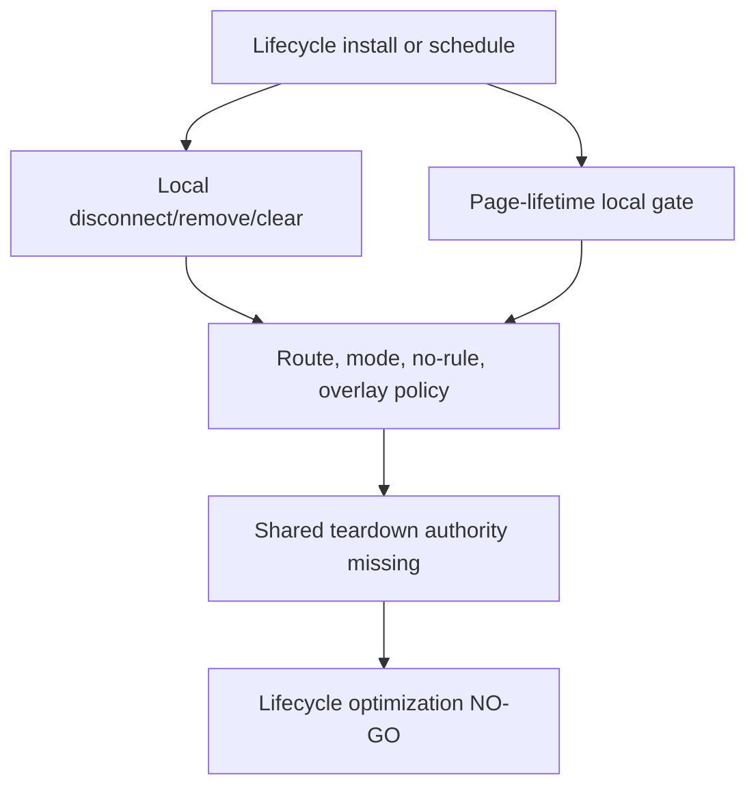

# FilterTube Lifecycle Teardown Decision Register - 2026-05-20

Status: audit-only proof. Runtime behavior is unchanged. This is not an
implementation patch.

This register narrows the lifecycle audit from instance counts and owner
effects into the teardown question:

```text
lifecycle owner installs work
        |
        v
does this owner have an explicit disconnect/remove/clear/restore path,
or is it intentionally page-lifetime?
        |
        v
do not optimize until the owner has route, mode, no-rule, fullscreen,
native-overlay, and teardown proof
```

The current code has useful local cleanup in some places, but it does not have
one shared teardown decision report for YouTube page-runtime owners.

## Teardown Classes

| Class | Meaning | Current behavior boundary |
| --- | --- | --- |
| `explicit-teardown` | The owner has a local `disconnect`, `removeEventListener`, `clearTimeout`, `clearInterval`, or `cancelAnimationFrame` path. | Local cleanup can be correct for one owner while equivalent work remains alive elsewhere. |
| `bounded-warmup` | The owner schedules repeated work that stops by counter/time. | It reduces long-lived work but does not prove no work in disabled/no-rule states. |
| `navigation-scoped` | The owner disconnects or refreshes on YouTube SPA navigation. | This is not the same as route-inactive, fullscreen, native-overlay, or feature-disabled teardown. |
| `page-lifetime-local-gate` | The owner stays installed for the page lifetime and uses local checks before effects. | A future optimization must preserve positive behavior and prove zero negative work with counters. |
| `missing-shared-authority` | No central owner registry decides install, pause, resume, or teardown. | This is the current global state for page-runtime lifecycle work. |

## Owner Teardown Map

| Owner | Teardown class | Current proof | Audit risk |
| --- | --- | --- | --- |
| Seed page transport | `page-lifetime-local-gate` plus partial XHR listener wrapping | `js/seed.js` stores original XHR `addEventListener` and `removeEventListener`, but the fetch/XHR/page-global patches are page-lifetime once installed. | Endpoint patch timing cannot be optimized until startup/no-rule/route policy proves when hooks may be absent or inert. |
| Injector readiness polling | `explicit-teardown` and `bounded-warmup` | `engineCheckInterval` is cleared when ready and again after timeout. | Readiness polling has local cleanup, but seed/bridge readiness retries still need one startup owner report. |
| Content bridge prefetch / playlist hydration | `navigation-scoped` and `page-lifetime-local-gate` | Prefetch observer exists, visibility/scroll/navigation listeners are page-lifetime, and playlist/right-rail observers disconnect on `yt-navigate-finish`. | Some observers are route-scoped locally, but no no-rule/fullscreen/native-overlay teardown decision exists for the whole hydration owner. |
| Whitelist pending refresh | `explicit-teardown` for timers, `page-lifetime-local-gate` for owner | Pending refresh timers are cleared/replaced before new delayed runs. | Timer cleanup does not prove whitelist fail-closed pending hides are cheap or correct in no-rule and route-inactive states. |
| Fallback menu lifecycle | `bounded-warmup`, `explicit-teardown` for popover, and page-lifetime scan listeners | Warmup interval clears after attempts; playlist popover document click and row observer are removed/disconnected; body observer and click/scroll/navigation listeners remain page-lifetime. | A menu cleanup must not assume clearing one popover/interval tears down fallback-menu scanning. |
| Quick block lifecycle | `page-lifetime-local-gate` with partial per-card timers | Per-card hover timers clear locally, and the old periodic interval is gone, but document/window resize, orientation, pointer, mutation observer, and scheduled sweep work still have no shared teardown path. | Fullscreen/orientation and mobile overlay work can wake quick-block lifecycle until a shared pause authority exists. |
| Normal menu / Kids passive menu | mixed `explicit-teardown` and `page-lifetime-local-gate` | Some dropdown observers disconnect after use; global click listeners and Kids passive body observers remain page-lifetime. | Native/menu action safety is not equivalent to lifecycle teardown. |
| DOM fallback core | `page-lifetime-local-gate` with local delayed rerun timers | `applyDOMFallback()` can yield, schedule reruns, and clear some pending timers, while click/ended/scroll listeners remain page-lifetime. | Local active checks are not enough to prove zero scans, zero media actions, or route-inactive teardown. |
| Playlist/player guards | `page-lifetime-local-gate` | Click and ended listeners use route/list checks before side effects. | Watch/player side effects remain installed even when not centrally registered as watch-owned lifecycle. |
| Collaborator dialog | `page-lifetime-local-gate` | Capture listeners and document mutation observer are installed as page-level recovery work. | Dialog recovery can remain awake without a compiled collaborator-needed state. |
| Extension UI surfaces | mostly document-lifetime UI listeners plus local modal/dropdown cleanup | Popup/tab-view listeners are bound to short-lived extension pages; profile dropdown and modal frame/timer cleanup exists locally. | UI lifecycle is not a YouTube page lag path, but it can mutate settings, maps, imports, Nanah state, and broadcasts that wake page runtime. |
| Website components | `explicit-teardown` | React effects remove theme/visibility listeners and clear scene timers. | Website lifecycle is outside YouTube filtering, but public claim/performance work still needs website-specific proof. |

## Current Source Proof

- `js/seed.js:710-841` wraps XHR listener methods and keeps original methods.
- `js/injector.js:3503-3528` creates and clears `engineCheckInterval`.
- `js/content_bridge.js:1012-1140` owns prefetch, visibility, scroll,
  playlist/right-rail observers, and navigation disconnect paths.
- `js/content_bridge.js:5576-5837` clears and replaces pending whitelist timers.
- `js/content_bridge.js:6563-6622` owns fallback-menu observer, navigation,
  click, scroll, and warmup interval work.
- `js/content_bridge.js:6675-6681` disconnects/removes playlist popover local
  observer and document click handling.
- `js/content/block_channel.js:1961-2289` owns quick-block lifecycle, including
  resize/orientation listeners, body mutation observer, and scheduled sweeps.
- `js/content/block_channel.js:2293-2322` shows local observer disconnects
  around dropdown/menu injection.
- `js/content/dom_fallback.js:2105-2403` owns scroll, click, and ended
  listeners for DOM fallback and watch playlist guards.
- `website/components/theme-toggle.js:59-63` and
  `website/components/scene-controller.js:79-83` prove website components have
  explicit listener cleanup.

## Current Teardown Ownership Source-Flow Addendum - 2026-05-27

This addendum pins the current source locations where teardown, bounded cleanup,
or page-lifetime decisions are made. It is audit-only. It does not approve
removing listeners, merging observers, skipping route hooks, changing
fullscreen/native-overlay quiet gates, changing menu/quick-block behavior, or
promoting a shared lifecycle registry.

```text
runtime owner installs lifecycle work
        |
        v
local cleanup exists?
        |
        +--> yes: disconnect/remove/clear is still local to that owner
        |
        +--> no: page-lifetime local gate must remain cheap and source-proven
        |
        v
no shared route/mode/no-rule teardown authority exists yet
        |
        v
optimization remains NO-GO until positive and negative lifecycle fixtures exist
```



| Teardown owner-flow row | Source pins | Current teardown/effect boundary | Remaining risk |
| --- | --- | --- | --- |
| `teardown_seed_xhr_patch_owner` | `js/seed.js:757-921` | XHR interception installs page-lifetime prototype wrappers and preserves add/remove listener symmetry for wrapped callbacks. | No uninstall authority exists for fetch/XHR/page-global patches once installed. |
| `teardown_injector_readiness_interval_owner` | `js/injector.js:3560-3585` | Injector readiness polling clears its interval when the engine appears and again on timeout. | Local interval cleanup does not cover seed/bridge startup retries or page-global hooks. |
| `teardown_bridge_prefetch_observer_owner` | `js/content_bridge.js:1093-1165` | Identity prefetch starts only when needed, schedules RAF scans, installs an IntersectionObserver, and keeps a visibility listener. | Prefetch has local active gates but no shared teardown registry for visibility/listener state. |
| `teardown_bridge_playlist_prefetch_owner` | `js/content_bridge.js:1172-1213` | Playlist panel prefetch installs a scroll listener, observes the playlist panel, and disconnects/re-attaches the panel observer on navigation. | Navigation disconnect is local and not proof that playlist prefetch is inactive on every route/mode. |
| `teardown_bridge_right_rail_whitelist_owner` | `js/content_bridge.js:1217-1278` | Right-rail whitelist observation uses list-mode/watch route gates, two self-clearing timers, a MutationObserver, and navigation reattach. | Whitelist observer ownership is separate from JSON, DOM fallback, and pending-hide ownership. |
| `teardown_bridge_whitelist_pending_timer_owner` | `js/content_bridge.js:6148-6212` | Pending whitelist recheck/hide timers self-clear and reject native-overlay quiet mode, non-whitelist mode, excluded routes, and overflow candidates before DOM hide. | Timer cleanup does not prove false-hide safety or cheapness across all whitelist surfaces. |
| `teardown_bridge_dom_fallback_observer_owner` | `js/content_bridge.js:6356-6466` | DOM fallback observer disconnects when no active fallback work exists and exposes a refresh hook for reconnecting when active work returns. | Active fallback work is still a local predicate rather than a shared lifecycle decision. |
| `teardown_bridge_fallback_menu_scanner_owner` | `js/content_bridge.js:7094-7206` | Fallback menu scanning has a body MutationObserver, navigation/hover/focus/click/scroll listeners, scroll debounce, and warmup interval that clears after 8 scans. | Page-lifetime listeners remain after warmup and do not share normal-menu/quick-block teardown authority. |
| `teardown_bridge_playlist_popover_owner` | `js/content_bridge.js:7235-7265` | Playlist fallback popover close removes the popover, resets state, disconnects row observer, and removes the document click listener. | Popover cleanup is local and does not tear down fallback-menu scanning. |
| `teardown_quick_block_page_lifecycle_owner` | `js/content/block_channel.js:1961-2289` | Quick block owns a coalesced sweep timer, page listeners, pointermove recovery removal, optional body MutationObserver, and navigation refresh. | Once started, quick-block page listeners still lack one route/mode/fullscreen teardown report. |
| `teardown_dom_fallback_playlist_guard_owner` | `js/content/dom_fallback.js:2035-2418` | DOM fallback keeps run-state gates, a page scroll listener, and page-lifetime playlist click/ended guards with route/list-mode checks. | Player/playlist side effects remain installed locally and need positive plus negative media fixtures before optimization. |

Current teardown source-flow status:

```text
current teardown owner-flow rows: 11
ASCII teardown owner-flow diagram: present
Mermaid teardown owner-flow diagram: present
current teardown source proof: PARTIAL
shared lifecycle teardown authority: NO-GO
runtime behavior changed by this addendum: no
```

## Teardown Decision Required Before Optimization

```text
lifecycleTeardownDecision
  owner id
  primitive family
  install trigger
  route/surface scope
  profile/list mode and feature flag state
  disabled/no-rule/empty-list policy
  fullscreen/native-overlay/hidden-tab policy
  explicit teardown function or page-lifetime reason
  scheduled effects after wake
  positive fixture kept
  negative/no-work fixture removed
```

No runtime symbol exists yet for:

- `lifecycleTeardownDecision`
- `lifecycleTeardownRegistry`
- `lifecycleOwnerTeardownReport`
- `currentLifecycleTeardownOwnerFlow`
- `routeLifecyclePauseReport`
- `pageLifetimeListenerBudgetReport`
- `teardownNoWorkCounterArtifact`

This register is audit evidence only. It does not authorize deleting, merging,
or moving any observer, listener, timer, frame, page-global patch, menu scan,
quick-block sweep, playlist guard, prompt listener, or UI listener.

## Method Semantic Proof Gap Boundary

`docs/audit/FILTERTUBE_METHOD_SEMANTIC_PROOF_GAP_INDEX_CURRENT_BEHAVIOR_2026-05-25.md`
is a required source input before this lifecycle teardown decision register can
support runtime optimization or JSON-first promotion. Current proof pins:

```text
method semantic proof gap files covered: 69
method semantic proof gap lexical callables covered: 5701
files with complete per-callable semantic proof: 0
lexical callables requiring semantic proof before behavior changes: 5701
affected callable semantic proof: NO-GO
runtime behavior changed: no
```

These counts are audit-only blockers. They do not approve runtime
optimization, JSON-first behavior, method deletion, method merging, lifecycle
cleanup, no-work changes, or whitelist behavior changes.
