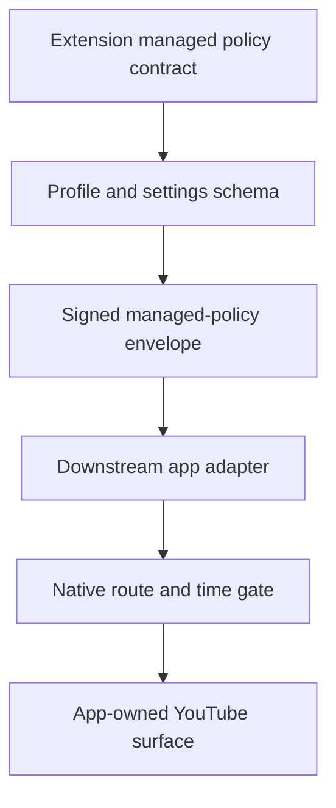

# Contract: Managed App Policy Parity

**Generated**: 2026-06-06
**Status**: Extension-owned app policy artifact plus managed Nanah helper
source copies are wired into the app runtime sync manifest. Android native
model and Activity runtime proof now persist managed profile state, action
history, and time-budget decisions, and gate managed web content at startup,
resume, heartbeat, and pause. The configured HTTPS mailbox helper and
configured local-network gateway helper are now part of the extension-owned
runtime contract, with downstream app manifest/runtime sync expected to copy
both as transport inputs. iOS parity remains pending.
**Runtime behavior changed**: extension no; Android app yes.
**Goal slice**: Implementation order item 12, "Sync shared policy contract to
apps", and item 13, "Add app viewing-space/time-limit parity tests".
**Primary inputs**:
`docs/audit/FILTERTUBE_LOCAL_NETWORK_MANAGED_PARENT_CONTROLS_PLAN_2026-06-03.md`,
`docs/audit/FILTERTUBE_RELEASE_PROFILE_NANAH_MANAGED_PARENT_AUTHORITY_INVENTORY_2026-06-03.md`,
`docs/audit/FILTERTUBE_MANAGED_VIEWING_SPACE_ROUTE_GATE_CONTRACT_2026-06-03.md`,
`docs/audit/FILTERTUBE_MANAGED_CHILD_TIME_LIMIT_SCHEMA_CONTRACT_2026-06-03.md`,
and
`docs/audit/FILTERTUBE_MANAGED_POLICY_SCHEMA_REVISION_CONTRACT_2026-06-03.md`.

## Purpose

The extension is the upstream policy owner for managed parent/caregiver
controls. Downstream mobile and tablet apps should consume the same policy
contract, but they must not copy extension background authority, Chrome APIs, or
YouTube DOM assumptions as native app authority.

This proof defines the shared profile, viewing-space, time-limit, managed
envelope, managed keyword/channel/video rule, and action-history contract that
apps must preserve when syncing from the extension. It does not claim full
Android settings-lock, rich timeout UI, or iOS enforcement is complete yet.

## Contract Snapshot JSON

```json
{
  "schema": "filtertube_managed_app_policy_contract",
  "version": 1,
  "generated": "2026-06-06",
  "owner": "extension_upstream_policy_contract",
  "runtimeBehaviorChanged": false,
  "appSyncStatus": "app_manifest_contract_helpers_and_android_time_entry_wiring_present_ios_pending",
  "artifact": {
    "sourcePath": "docs/audit/artifacts/managed-app-policy-contract-v1.json",
    "appDestination": "packages/managed-policy-contract/src/upstream/managed-app-policy-contract-v1.json",
    "manifestSyncMode": "copy"
  },
  "runtimeHelperSync": [
    {
      "sourcePath": "js/nanah_managed_live_policy.js",
      "appDestination": "packages/extension-source/upstream/js/nanah_managed_live_policy.js",
      "manifestSyncMode": "copy",
      "boundary": "managed live signed-send helper source parity; native UI and transport authority remain app-owned"
    },
    {
      "sourcePath": "js/nanah_managed_open_sync.js",
      "appDestination": "packages/extension-source/upstream/js/nanah_managed_open_sync.js",
      "manifestSyncMode": "copy",
      "boundary": "managed pull-on-open helper source parity; mailbox and configured local-network providers remain transport inputs, not policy authority"
    },
    {
      "sourcePath": "js/nanah_managed_mailbox_client.js",
      "appDestination": "packages/extension-source/upstream/js/nanah_managed_mailbox_client.js",
      "manifestSyncMode": "copy",
      "boundary": "configured HTTPS encrypted-mailbox helper source parity; provider endpoint and native UI remain app-owned, mailbox storage remains ciphertext-only transport"
    },
    {
      "sourcePath": "js/nanah_managed_local_network_client.js",
      "appDestination": "packages/extension-source/upstream/js/nanah_managed_local_network_client.js",
      "manifestSyncMode": "copy",
      "boundary": "configured local-network gateway helper source parity; LAN reachability and discovery are transport only, local trusted-link and signature validation remain authority"
    }
  ],
  "uiHelperMirror": [
    {
      "sourcePath": "js/managed_admin_authority.js",
      "appDestination": "packages/extension-source/upstream/js/managed_admin_authority.js",
      "manifestSyncMode": "extension_source_mirror",
      "boundary": "managed admin session and sensitive-action authority helper; native settings locks must preserve the contract without copying extension UI state as authority"
    },
    {
      "sourcePath": "js/managed_parent_command_center.js",
      "appDestination": "packages/extension-source/upstream/js/managed_parent_command_center.js",
      "manifestSyncMode": "extension_source_mirror",
      "boundary": "managed parent command-center summary/action-intent helper; native UI may mirror interaction shape but runtime policy authority remains signed envelope and profile gate owned"
    }
  ],
  "profileAuthority": {
    "stores": [
      "ftProfilesV4",
      "profile.settings",
      "profile.managedPolicyState",
      "profile.managedActionHistory"
    ],
    "managerProfileTypes": [
      "default",
      "account"
    ],
    "protectedProfileTypes": [
      "child",
      "account_when_managed_by_default"
    ],
    "requiredBoundaries": [
      "child_pin_is_not_admin_authority",
      "sibling_profiles_cannot_manage_each_other",
      "parent_account_must_be_bound_to_child_target",
      "default_master_may_manage_independent_protected_accounts",
      "admin_session_ttl_required_for_sensitive_actions"
    ]
  },
  "viewingSpaces": {
    "schema": "filtertube_managed_viewing_space_route_gate",
    "identity": "main_and_kids_are_viewing_spaces_not_profiles",
    "requiredFields": [
      "allowMainViewing",
      "allowKidsViewing",
      "defaultLaunchTarget",
      "allowYouTubeAccountSessionActions",
      "nativeOwnedMainSurface",
      "nativeOwnedKidsSurface"
    ],
    "requiredDecisions": [
      "main_allowed",
      "main_denied",
      "kids_allowed",
      "kids_denied",
      "external_route_no_work",
      "missing_policy_no_work",
      "invalid_policy_no_work"
    ]
  },
  "timeLimitPolicy": {
    "schema": "filtertube_managed_time_limit",
    "requiredFields": [
      "schema",
      "version",
      "enabled",
      "timezone",
      "dailyBudgetSeconds",
      "surfaceBudgets",
      "countingMode",
      "activeDeviceBudgetPolicy",
      "resetPolicy",
      "graceSeconds",
      "parentGrant",
      "policyRevision",
      "policyHash",
      "issuedAt",
      "validFrom",
      "validUntil"
    ],
    "requiredDecisions": [
      "disabled_policy_no_work",
      "zero_budget_immediate_timeout",
      "active_tab_no_double_count",
      "sleep_restart_revalidation",
      "timezone_drift_revalidation",
      "newer_reduced_budget_clamps_remaining_time",
      "stale_reduced_budget_rejected"
    ]
  },
  "managedEnvelope": {
    "type": "filtertube_managed_policy",
    "requiredFields": [
      "linkId",
      "scope",
      "targetProfileId",
      "sourceProfileId",
      "sourceDeviceId",
      "revision",
      "policyHash",
      "sourcePublicKeyId",
      "keyVersion",
      "issuedAt",
      "integrity",
      "payload"
    ],
    "scopes": [
      "main",
      "kids",
      "keywords",
      "channels",
      "videos",
      "viewing_space",
      "time_limits"
    ],
    "requiredRejects": [
      "stale_revision",
      "equal_revision_hash_conflict",
      "wrong_target_profile",
      "wrong_source_device",
      "wrong_public_key",
      "revoked_link",
      "missing_signature_verifier",
      "signature_invalid"
    ]
  },
  "managedRules": {
    "schema": "filtertube_managed_rule_policy",
    "requiredScopes": [
      "keywords",
      "channels",
      "videos"
    ],
    "requiredSurfaces": [
      "main",
      "kids"
    ],
    "requiredFields": [
      "scope",
      "surface",
      "targetProfileId",
      "revision",
      "policyHash",
      "payload"
    ],
    "requiredDecisions": [
      "keyword_rule_apply",
      "channel_rule_apply",
      "video_rule_apply",
      "same_validated_rule_paths_as_local_controls",
      "wrong_scope_rejected",
      "wrong_surface_rejected",
      "protected_user_cannot_mutate_rules"
    ],
    "runtimeBoundary": "remote managed rule updates are accepted only as validated policy payloads and must reuse local keyword channel and video mutation paths before app sync claims parity"
  },
  "managedChannelLists": {
    "schema": "filtertube_managed_channel_list_rule_source",
    "issue": 62,
    "identity": "channel lists are parent-approved rule sources, not transport authority or executable filter code",
    "acceptedInputFormats": [
      "plain_text_rows",
      "csv_like_text_rows",
      "simple_json_array",
      "simple_json_object_channels",
      "public_https_text_or_json_url"
    ],
    "materializedRowFields": [
      "managedListId",
      "managedListName",
      "managedListSourceLabel",
      "managedListSourceUrl",
      "managedListSourceTitle",
      "managedListSourceVersion",
      "managedListSourceUpdatedLabel",
      "managedListSourceHomepage",
      "managedListImportedAt",
      "managedListLastCheckedAt",
      "managedListContentHash",
      "managedListPaused"
    ],
    "requiredActions": [
      "import_pasted_or_file_list",
      "import_simple_json_list_after_preview",
      "import_public_https_url_after_preview",
      "view_saved_list_summary",
      "pause_saved_list_without_deleting_rows",
      "resume_saved_list",
      "check_url_backed_list_after_parent_reauth",
      "refresh_one_url_backed_list_after_parent_reauth",
      "refresh_stale_url_backed_lists_after_parent_reauth",
      "refresh_all_loaded_url_backed_lists_after_parent_reauth",
      "remove_list_derived_rows_without_deleting_manual_rules",
      "send_channel_policy_to_verified_devices"
    ],
    "requiredDecisions": [
      "list_url_is_data_source_only",
      "json_document_is_data_source_only",
      "parent_preview_before_write",
      "parent_reauth_before_protected_profile_write",
      "malformed_or_name_only_rows_skipped_for_safety",
      "manual_channel_rows_remain_distinguishable",
      "paused_list_rows_do_not_compile_into_channel_blocking",
      "paused_list_rows_do_not_compile_into_channel_filter_all_keywords",
      "source_version_metadata_is_display_only",
      "unchanged_source_hash_updates_checked_metadata_without_replacing_rows",
      "stale_status_is_parent_hint_not_background_authority",
      "failed_refresh_source_leaves_existing_rows_unchanged",
      "history_rows_are_redacted_and_not_policy_authority"
    ],
    "nativeParityRequirements": [
      "preserve_materialized_row_metadata_during_import_export_and_sync",
      "parse_supported_list_inputs_only_after_parent_preview",
      "skip_paused_list_rows_in_native_channel_enforcement",
      "show_list_status_without_exposing_raw_rule_contents_to_protected_users",
      "show_source_version_metadata_to_parent_when_available",
      "show_stale_url_backed_list_status_as_parent_hint_only",
      "keep_manual_channel_rules_separate_from_list_derived_rows",
      "do_not_treat_public_list_url_or_lan_provider_as_admin_authority"
    ]
  },
  "managedDelivery": {
    "transports": [
      "live_nanah",
      "encrypted_mailbox",
      "configured_local_network_gateway"
    ],
    "requiredBoundaries": [
      "transport_is_not_policy_authority",
      "local_network_reachability_is_not_authority",
      "mailbox_server_cannot_read_plaintext_policy",
      "configured_gateway_cannot_choose_target_profile_or_rules",
      "trusted_link_target_scope_revision_hash_signature_validation_required_before_apply"
    ],
    "configuredLocalNetworkProvider": {
      "sourcePath": "js/nanah_managed_local_network_client.js",
      "requiredMethods": [
        "publishManagedPolicyCandidates",
        "discoverManagedPolicyCandidates",
        "ackLocalNetworkCandidates"
      ],
      "allowedEndpointClasses": [
        "https",
        "private_or_local_http"
      ],
      "forbiddenAuthority": [
        "lan_reachability",
        "provider_selected_profile",
        "provider_selected_scope",
        "unsigned_candidate"
      ]
    }
  },
  "actionHistory": {
    "store": "profile.managedActionHistory",
    "requiredRows": [
      "local_managed_save_accepted",
      "remote_policy_rejected",
      "remote_policy_conflict",
      "remote_policy_accepted",
      "admin_session_failed_unlock",
      "history_clear_accepted_rows"
    ],
    "requiredBoundaries": [
      "history_is_evidence_not_policy_authority",
      "protected_user_cannot_clear_rejected_or_failed_auth_evidence",
      "rows_must_be_redacted_before_child_surface_display"
    ]
  },
  "appBoundary": {
    "appsMustConsume": [
      "profile_contract",
      "managed_policy_envelope_contract",
      "managed_rule_policy_contract",
      "managed_channel_list_contract",
      "viewing_space_policy_contract",
      "time_limit_policy_contract",
      "action_history_contract"
    ],
    "appsMustNotConsumeAsAuthority": [
      "extension_background_session_cache",
      "extension_content_script_dom_state",
      "youtube_dom_selectors",
      "page_message_sender_state"
    ],
    "nativeOwnedResponsibilities": [
      "app_open_lock",
      "native_main_surface_route_gate",
      "native_kids_surface_route_gate",
      "native_keyword_rule_apply",
      "native_channel_rule_apply",
      "native_managed_channel_list_metadata_preservation",
      "native_managed_channel_list_pause_enforcement",
      "native_video_rule_apply",
      "native_time_budget_gate_before_web_content",
      "native_settings_sync_lock"
    ],
    "forbiddenRuntimeTokens": [
      "chrome.",
      "browser.",
      "chrome.runtime",
      "browser.runtime",
      "chrome.tabs",
      "browser.tabs"
    ]
  }
}
```

## App Sync Boundary

ASCII:

```text
extension managed policy contract
  -> profile/settings schema
  -> signed managed-policy envelope
  -> downstream app adapter
  -> native route/time gate
  -> app-owned YouTube surface
```

Mermaid:



Apps can reuse extension policy data, but the app shell must own app open
locks, native Main/Kids routing, and native time gates before any managed web
content opens. A synced policy is data authority only after revision, hash,
device binding, and signature checks pass.

## Required Parity Decisions

| Area | Extension behavior | App parity requirement |
| --- | --- | --- |
| Parent authority | Default/account profiles can manage bound child profiles. | Native admin mode must map to the same parent/account authority. |
| Child PIN | Child unlock does not become admin authority. | Child app unlock must not open sync/settings/admin mutation paths. |
| Main/Kids | `allowMainViewing` and `allowKidsViewing` route-gate YouTube surfaces. | App shell must block disallowed Main/Kids spaces before web content opens. |
| Rules | Managed keyword/channel/video payloads reuse local validated mutation paths. | Apps must apply the same keyword, channel, and video rule scopes without turning remote payloads into native-only authority. |
| Time limits | Active child policy emits runtime budget gate and timeout overlay. | App shell must enforce daily budget at app/surface entry and while active. |
| Remote policy | Signed `filtertube_managed_policy` envelopes validate before apply. | Apps must reject stale, revoked, wrong-target, or unsigned policies. |
| History | Action rows are protected evidence, not policy authority. | Apps may display history only to admin authority and must redact child views. |
| No policy | Missing/disabled policy is a no-work state. | Apps must not add timers or sync churn when no managed policy is active. |

## Current Gap

The extension contract is now explicit and available as a JSON artifact at
`docs/audit/artifacts/managed-app-policy-contract-v1.json`. The app runtime
sync manifest declares the copy target
`packages/managed-policy-contract/src/upstream/managed-app-policy-contract-v1.json`.
The contract also now names `filtertube_managed_rule_policy` as a first-class
app parity surface. Keyword, channel, and video rule updates are still delivered
through signed managed-policy envelopes, but downstream apps must treat those
scopes as shared policy data and route them through the same validated mutation
paths used by local FilterTube controls before claiming installed app parity.
The contract also names managed channel lists as parent-approved rule sources:
plain text, CSV-like rows, simple JSON arrays/objects, and public HTTPS
text/JSON URLs are accepted inputs only after preview and parent approval, and
apps must preserve list metadata, pause state, and manual-rule separation.
The extension-owned handoff verifier
`scripts/verify-managed-app-policy-contract.mjs` checks that the Markdown
contract snapshot and JSON artifact are byte-equivalent as parsed data, all
declared extension helper sources exist, and, when the sibling app repo is
available, the app runtime sync manifest still copies the contract artifact and
managed Nanah helper sources to the expected destinations. The current
extension-owned contract also declares `js/nanah_managed_mailbox_client.js` so
apps can mirror the configured HTTPS encrypted-mailbox client, and
`js/nanah_managed_local_network_client.js` so apps can mirror the configured
local-network gateway client. This verifier is a pre-release guard; it does
not write into the app repo.
After this protected-account contract update, the sibling app repo must run the
native runtime sync before any app parity claim uses the copied artifact as
current. The same manifest also copies the extension-owned managed Nanah
signed-send, pull-on-open, configured mailbox, and configured local-network
helper sources into `packages/extension-source/upstream/js/` so the downstream
app repo can track the exact helper contracts without treating them as native
runtime authority. LAN reachability, provider discovery, and mailbox delivery
remain transport evidence only; trusted-link target, scope, revision, hash, and
signature validation remain the authority boundary.
The extension source mirror also carries the managed admin authority helper and
managed parent command-center helper. Those are contract inputs for native
settings locks and parent UI ergonomics, not standalone policy authority, and
they are mirrored through `tools/sync-runtime-from-extension.mjs` broad
`js/html/css` source mirroring rather than direct manifest copy rows. App parity
still cannot be claimed current until the sibling app sync output is committed
and platform smoke evidence is attached.

The contract now treats protected profiles as child profiles plus independent
account profiles when Default/Master is the managing authority. Downstream apps
must preserve that distinction: a parent account can manage its bound child
profiles, while Default/Master can manage independent protected accounts
without turning a child PIN or sibling account into admin authority.

Android now has a native model and Activity runtime proof that preserves
`managedPolicyState`, `managedActionHistory`, and `settings.timeLimitPolicy`
through the profile model, includes `timeLimitPolicy.policyFingerprint()` in
route policy versions, persists per-profile managed time-budget state, gates
managed web content before initial surface configuration, rechecks on resume
and heartbeat, records pause usage, clears disabled-policy state, blanks managed
web surfaces on timeout, and exits through `ViewingLaunchCoordinator`.

Android still needs richer timeout UI, installed-device smoke coverage for
Main/Kids surfaces, and native settings locks that consume this artifact without
forking extension authority semantics. iOS still needs the matching native
adapter proof.

Installed app smoke is now pinned as a separate release handoff at
`docs/audit/artifacts/managed-app-parity-smoke/template.json`, with verifier
`docs/audit/artifacts/managed-app-parity-smoke/verify-managed-app-parity-smoke-artifact.mjs`.
That artifact must pass before an installed Android or iOS app parity claim is
used as release evidence; one passing artifact proves only that one installed
platform.

## Edge Cases To Keep

- Parent updates multiple child profiles in one session; each target keeps its
  own revision and history.
- Parent reduces a child time budget while the child device is offline; the
  child device clamps remaining time after accepting the newer policy.
- A mailbox update arrives after link revocation; the app rejects it even if the
  ciphertext decrypts.
- Local-network discovery finds a peer with the same display name; discovery
  never grants policy authority.
- A child switches from Kids to Main through native navigation; native route
  gate checks the current policy before opening the surface.
- A profile has no managed policy; apps and extension preserve no-work behavior.

## Verification

Focused test:

```bash
node scripts/verify-managed-app-policy-contract.mjs
node --test tests/runtime/managed-app-policy-contract-parity-current-behavior.test.mjs
node --test tests/runtime/managed-app-parity-smoke-artifact-verifier-current-behavior.test.mjs
node --test tests/runtime/native-runtime-sync-authority-current-behavior.test.mjs \
  tests/runtime/native-runtime-sync-manifest-freshness-boundary-current-behavior.test.mjs
```

Android focused proof:

```bash
cd /Users/devanshvarshney/FilterTubeApp/apps/android
JAVA_HOME="/Applications/Android Studio.app/Contents/jbr/Contents/Home" \
  ./gradlew :app:testDebugUnitTest --tests com.filtertube.app.ProfilePolicyGateTest -x syncFilterTubeRuntime
```

Settings lane:

```bash
npm run test:settings
```
