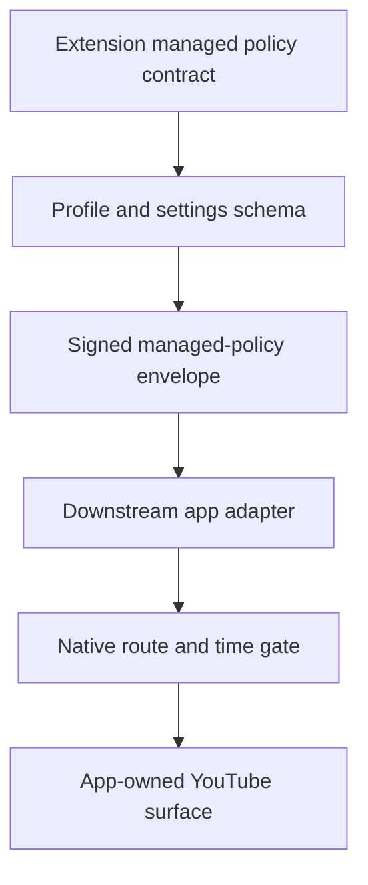

# Contract: Managed App Policy Parity

**Generated**: 2026-06-04
**Status**: Extension-owned app policy artifact plus managed Nanah helper
source copies are wired into the app runtime sync manifest. Android native
model and Activity runtime proof now persist managed profile state, action
history, and time-budget decisions, and gate managed web content at startup,
resume, heartbeat, and pause. iOS parity remains pending.
**Runtime behavior changed**: extension no; Android app yes.
**Goal slice**: Implementation order item 12, "Sync shared policy contract to
apps", and item 13, "Add app viewing-space/time-limit parity tests".
**Primary inputs**:
`docs/audit/FILTERTUBE_LOCAL_NETWORK_MANAGED_PARENT_CONTROLS_PLAN_2026-06-03.md`,
`docs/audit/FILTERTUBE_RELEASE_PROFILE_NANAH_MANAGED_PARENT_AUTHORITY_INVENTORY_2026-06-03.md`,
`docs/audit/FILTERTUBE_MANAGED_VIEWING_SPACE_ROUTE_GATE_CONTRACT_2026-06-03.md`,
`docs/audit/FILTERTUBE_MANAGED_CHILD_TIME_LIMIT_SCHEMA_CONTRACT_2026-06-03.md`,
and
`docs/audit/FILTERTUBE_MANAGED_POLICY_SCHEMA_REVISION_CONTRACT_2026-06-03.md`.

## Purpose

The extension is the upstream policy owner for managed parent/caregiver
controls. Downstream mobile and tablet apps should consume the same policy
contract, but they must not copy extension background authority, Chrome APIs, or
YouTube DOM assumptions as native app authority.

This proof defines the shared profile, viewing-space, time-limit, managed
envelope, and action-history contract that apps must preserve when syncing from
the extension. It does not claim full Android settings-lock, rich timeout UI,
or iOS enforcement is complete yet.

## Contract Snapshot JSON

```json
{
  "schema": "filtertube_managed_app_policy_contract",
  "version": 1,
  "generated": "2026-06-04",
  "owner": "extension_upstream_policy_contract",
  "runtimeBehaviorChanged": false,
  "appSyncStatus": "app_manifest_contract_helpers_and_android_time_entry_wiring_present_ios_pending",
  "artifact": {
    "sourcePath": "docs/audit/artifacts/managed-app-policy-contract-v1.json",
    "appDestination": "packages/managed-policy-contract/src/upstream/managed-app-policy-contract-v1.json",
    "manifestSyncMode": "copy"
  },
  "runtimeHelperSync": [
    {
      "sourcePath": "js/nanah_managed_live_policy.js",
      "appDestination": "packages/extension-source/upstream/js/nanah_managed_live_policy.js",
      "manifestSyncMode": "copy",
      "boundary": "managed live signed-send helper source parity; native UI and transport authority remain app-owned"
    },
    {
      "sourcePath": "js/nanah_managed_open_sync.js",
      "appDestination": "packages/extension-source/upstream/js/nanah_managed_open_sync.js",
      "manifestSyncMode": "copy",
      "boundary": "managed pull-on-open helper source parity; server mailbox and local-network runtime remain absent"
    }
  ],
  "profileAuthority": {
    "stores": [
      "ftProfilesV4",
      "profile.settings",
      "profile.managedPolicyState",
      "profile.managedActionHistory"
    ],
    "managerProfileTypes": [
      "default",
      "account"
    ],
    "protectedProfileTypes": [
      "child"
    ],
    "requiredBoundaries": [
      "child_pin_is_not_admin_authority",
      "sibling_profiles_cannot_manage_each_other",
      "parent_account_must_be_bound_to_target_child",
      "admin_session_ttl_required_for_sensitive_actions"
    ]
  },
  "viewingSpaces": {
    "schema": "filtertube_managed_viewing_space_route_gate",
    "identity": "main_and_kids_are_viewing_spaces_not_profiles",
    "requiredFields": [
      "allowMainViewing",
      "allowKidsViewing",
      "defaultLaunchTarget",
      "allowYouTubeAccountSessionActions",
      "nativeOwnedMainSurface",
      "nativeOwnedKidsSurface"
    ],
    "requiredDecisions": [
      "main_allowed",
      "main_denied",
      "kids_allowed",
      "kids_denied",
      "external_route_no_work",
      "missing_policy_no_work",
      "invalid_policy_no_work"
    ]
  },
  "timeLimitPolicy": {
    "schema": "filtertube_managed_time_limit",
    "requiredFields": [
      "schema",
      "version",
      "enabled",
      "timezone",
      "dailyBudgetSeconds",
      "surfaceBudgets",
      "countingMode",
      "activeDeviceBudgetPolicy",
      "resetPolicy",
      "graceSeconds",
      "parentGrant",
      "policyRevision",
      "policyHash",
      "issuedAt",
      "validFrom",
      "validUntil"
    ],
    "requiredDecisions": [
      "disabled_policy_no_work",
      "zero_budget_immediate_timeout",
      "active_tab_no_double_count",
      "sleep_restart_revalidation",
      "timezone_drift_revalidation",
      "newer_reduced_budget_clamps_remaining_time",
      "stale_reduced_budget_rejected"
    ]
  },
  "managedEnvelope": {
    "type": "filtertube_managed_policy",
    "requiredFields": [
      "linkId",
      "scope",
      "targetProfileId",
      "sourceProfileId",
      "sourceDeviceId",
      "revision",
      "policyHash",
      "sourcePublicKeyId",
      "keyVersion",
      "issuedAt",
      "integrity",
      "payload"
    ],
    "scopes": [
      "main",
      "kids",
      "keywords",
      "channels",
      "videos",
      "viewing_space",
      "time_limits"
    ],
    "requiredRejects": [
      "stale_revision",
      "equal_revision_hash_conflict",
      "wrong_target_profile",
      "wrong_source_device",
      "wrong_public_key",
      "revoked_link",
      "missing_signature_verifier",
      "signature_invalid"
    ]
  },
  "actionHistory": {
    "store": "profile.managedActionHistory",
    "requiredRows": [
      "local_managed_save_accepted",
      "remote_policy_rejected",
      "remote_policy_conflict",
      "remote_policy_accepted",
      "admin_session_failed_unlock",
      "history_clear_accepted_rows"
    ],
    "requiredBoundaries": [
      "history_is_evidence_not_policy_authority",
      "protected_user_cannot_clear_rejected_or_failed_auth_evidence",
      "rows_must_be_redacted_before_child_surface_display"
    ]
  },
  "appBoundary": {
    "appsMustConsume": [
      "profile_contract",
      "managed_policy_envelope_contract",
      "viewing_space_policy_contract",
      "time_limit_policy_contract",
      "action_history_contract"
    ],
    "appsMustNotConsumeAsAuthority": [
      "extension_background_session_cache",
      "extension_content_script_dom_state",
      "youtube_dom_selectors",
      "page_message_sender_state"
    ],
    "nativeOwnedResponsibilities": [
      "app_open_lock",
      "native_main_surface_route_gate",
      "native_kids_surface_route_gate",
      "native_time_budget_gate_before_web_content",
      "native_settings_sync_lock"
    ],
    "forbiddenRuntimeTokens": [
      "chrome.",
      "browser.",
      "chrome.runtime",
      "browser.runtime",
      "chrome.tabs",
      "browser.tabs"
    ]
  }
}
```

## App Sync Boundary

ASCII:

```text
extension managed policy contract
  -> profile/settings schema
  -> signed managed-policy envelope
  -> downstream app adapter
  -> native route/time gate
  -> app-owned YouTube surface
```

Mermaid:



Apps can reuse extension policy data, but the app shell must own app open
locks, native Main/Kids routing, and native time gates before any managed web
content opens. A synced policy is data authority only after revision, hash,
device binding, and signature checks pass.

## Required Parity Decisions

| Area | Extension behavior | App parity requirement |
| --- | --- | --- |
| Parent authority | Default/account profiles can manage bound child profiles. | Native admin mode must map to the same parent/account authority. |
| Child PIN | Child unlock does not become admin authority. | Child app unlock must not open sync/settings/admin mutation paths. |
| Main/Kids | `allowMainViewing` and `allowKidsViewing` route-gate YouTube surfaces. | App shell must block disallowed Main/Kids spaces before web content opens. |
| Time limits | Active child policy emits runtime budget gate and timeout overlay. | App shell must enforce daily budget at app/surface entry and while active. |
| Remote policy | Signed `filtertube_managed_policy` envelopes validate before apply. | Apps must reject stale, revoked, wrong-target, or unsigned policies. |
| History | Action rows are protected evidence, not policy authority. | Apps may display history only to admin authority and must redact child views. |
| No policy | Missing/disabled policy is a no-work state. | Apps must not add timers or sync churn when no managed policy is active. |

## Current Gap

The extension contract is now explicit, test-pinned, and available as a JSON
artifact at `docs/audit/artifacts/managed-app-policy-contract-v1.json`. The app
runtime sync manifest copies that artifact into
`packages/managed-policy-contract/src/upstream/managed-app-policy-contract-v1.json`.
The same manifest also copies the extension-owned managed Nanah signed-send and
pull-on-open helper sources into `packages/extension-source/upstream/js/` so the
downstream app repo can track the exact helper contracts without treating them
as native runtime authority.

Android now has a native model and Activity runtime proof that preserves
`managedPolicyState`, `managedActionHistory`, and `settings.timeLimitPolicy`
through the profile model, includes `timeLimitPolicy.policyFingerprint()` in
route policy versions, persists per-profile managed time-budget state, gates
managed web content before initial surface configuration, rechecks on resume
and heartbeat, records pause usage, clears disabled-policy state, blanks managed
web surfaces on timeout, and exits through `ViewingLaunchCoordinator`.

Android still needs richer timeout UI, installed-device smoke coverage for
Main/Kids surfaces, and native settings locks that consume this artifact without
forking extension authority semantics. iOS still needs the matching native
adapter proof.

Installed app smoke is now pinned as a separate release handoff at
`docs/audit/artifacts/managed-app-parity-smoke/template.json`, with verifier
`docs/audit/artifacts/managed-app-parity-smoke/verify-managed-app-parity-smoke-artifact.mjs`.
That artifact must pass before an installed Android or iOS app parity claim is
used as release evidence; one passing artifact proves only that one installed
platform.

## Edge Cases To Keep

- Parent updates multiple child profiles in one session; each target keeps its
  own revision and history.
- Parent reduces a child time budget while the child device is offline; the
  child device clamps remaining time after accepting the newer policy.
- A mailbox update arrives after link revocation; the app rejects it even if the
  ciphertext decrypts.
- Local-network discovery finds a peer with the same display name; discovery
  never grants policy authority.
- A child switches from Kids to Main through native navigation; native route
  gate checks the current policy before opening the surface.
- A profile has no managed policy; apps and extension preserve no-work behavior.

## Verification

Focused test:

```bash
node --test tests/runtime/managed-app-policy-contract-parity-current-behavior.test.mjs
node --test tests/runtime/managed-app-parity-smoke-artifact-verifier-current-behavior.test.mjs
node --test tests/runtime/native-runtime-sync-authority-current-behavior.test.mjs \
  tests/runtime/native-runtime-sync-manifest-freshness-boundary-current-behavior.test.mjs
```

Android focused proof:

```bash
cd /Users/devanshvarshney/FilterTubeApp/apps/android
JAVA_HOME="/Applications/Android Studio.app/Contents/jbr/Contents/Home" \
  ./gradlew :app:testDebugUnitTest --tests com.filtertube.app.ProfilePolicyGateTest -x syncFilterTubeRuntime
```

Settings lane:

```bash
npm run test:settings
```
