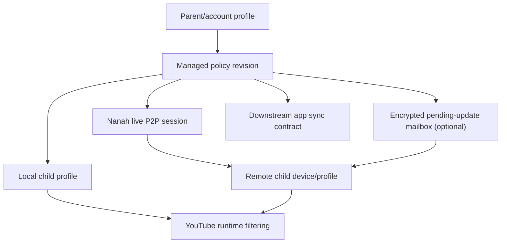

# Plan: Managed Child Sync And YouTube Time Limits

**Generated**: 2026-06-02  
**Estimated Complexity**: High  
**Status**: Planning/spec only. Runtime behavior is unchanged.  
**Owner repo**: `/Users/devanshvarshney/FilterTube`

## Overview

This plan turns the current FilterTube profile, PIN, and Nanah P2P foundation into an extension-first parent control system. The extension remains the upstream authority because the downstream Android, iOS, tablet, and TV apps sync runtime contracts from this repo.

The target model is:

- Parent/account profiles can manage one or more child profiles from the parent device.
- Child profiles keep independent Main and Kids rules, viewing-space policy, and optional child PINs.
- Parent-managed updates can apply locally on the same device or remotely to trusted child devices.
- Remote child devices keep the last known signed policy active while offline.
- When the child app/profile opens, it attempts to pull the latest parent-approved policy.
- Optional store-and-forward sync uses an encrypted pending-update mailbox where the relay sees only ciphertext and small revision metadata.
- YouTube time limits become profile policy in the extension first, then downstream apps enforce the same contract natively.

The plan does not replace existing Nanah trust semantics. Current docs say trusted links remember relationship, scope, target, and policy, but do not create hidden always-on background sync. This plan builds on that by adding explicit managed-policy revisions and a pull-on-open flow.

## Current Evidence

Relevant implemented foundation:

- `docs/NANAH_USER_GUIDE.md`
  - documents "Parent controls child", remote target profile, trust meaning, and child receive-only behavior.
- `docs/NANAH_P2P_PROJECT_PLAN.md`
  - states desktop integration already has managed source/replica links, trusted-link persistence, sender-side remote target profile selection, receiver-side fixed target profile binding, and encrypted trust recovery.
- `docs/PROFILES_PIN_MODEL.md`
  - defines account versus child profiles, UI-local unlock, parent-managed child editing, child receive-only Nanah, and `Allow trusted updates while locked`.
- `docs/MOBILE_APP_UI_SPEC.md`
  - says the extension profile model is the mobile/tablet upstream authority; default/account profiles are parent/admin-capable; child PIN is not an admin PIN.
- `docs/filtertube_mobile_runtime_adapter_plan.md`
  - says native shells should own authority, storage, PIN, sync, import/export, and supervision UX, while injected JS owns filtering.
- `js/tab-view.js`
  - has managed child edit state, `canActiveProfileManageProfile`, `startManagedChildEdit`, `saveManagedChildSurface`, Nanah role labels, managed link policy modal, fixed target profile, reconnect behavior, child protection level, and locked-child update mode.
- `js/nanah_sync_adapter.js`
  - has `buildScopedPortablePayload`, `applyScopedPortablePayload`, `buildSyncEnvelope`, `buildControlProposal`, and `applyIncomingEnvelope`.
- `js/io_manager.js`
  - has profile-targeted `importV3(..., { targetProfileId })` and V4 profile merge/replace behavior.
- `js/background.js`
  - verifies session PINs through `FilterTube_SessionPinAuth` from trusted UI senders, keeps PINs/session cache memory-only, and persists failed-attempt rate-limit state under the profile managed-policy state.
- `scripts/sync-native-runtime.mjs`
  - already defines the extension-to-native sync handoff script boundary.
- `docs/audit/TEST_LANE_MATRIX.md`
  - already maps settings/profile/storage/sync changes to `test:settings`, hot runtime work to `test:json`, `test:dom`, `test:performance`, `test:whitelist`, and release-facing docs/build work to `test:release`.

External API docs checked:

- Chrome alarms API: alarms can schedule future or periodic service-worker work, but alarms are not guaranteed across restarts and must be recreated when the service worker starts. Minimum alarm interval is 30 seconds in current Chrome.
- Chrome storage API: extension storage is asynchronous, JSON-serializable, available across extension contexts, persists after browsing history is cleared, and has storage quota/performance costs.
- Chrome tabs API: tab URL access depends on `tabs` or matching host permissions; `tabs.query` can find active/current YouTube tabs and `tabs.sendMessage` can signal content scripts.
- Chrome idle API: can report active, idle, or locked state using a configurable detection interval.

Downstream app evidence checked:

- `/Users/devanshvarshney/FilterTubeApp/docs/EXTENSION_SOURCE_OF_TRUTH_NOTES.md`
  - says `ftProfilesV4` remains the profile authority; Main Viewing and Kids Viewing are viewing spaces, not separate profiles; native shells own launch, PIN gate, sync, backups, route state, and parent overlays.
- `/Users/devanshvarshney/FilterTubeApp/app/src/main/java/com/filtertube/mobile/profiles/ProfileModels.kt`
  - already has per-profile `defaultLaunchTarget`, `allowMainViewing`, `allowKidsViewing`, `syncKidsToMain`, `nativeOwnedKidsSurface`, `nativeOwnedMainSurface`, and `allowYouTubeAccountSessionActions`.
- `/Users/devanshvarshney/FilterTubeApp/app/src/main/java/com/filtertube/mobile/profiles/ProfileViewingAccess.kt`
  - already models Main/Kids viewing access as allowed, profile-PIN-required, or parent-approval-required.
- `/Users/devanshvarshney/FilterTubeApp/app/src/main/java/com/filtertube/mobile/policy/ProfilePolicyGate.kt`
  - already fingerprints profile policy fields and applies native route blocks, but does not yet include time-limit policy fields.
- `/Users/devanshvarshney/FilterTubeApp/tools/sync-runtime-from-extension.mjs`
  - syncs curated upstream extension runtime files into native app assets, so the shared policy contract must live upstream here and not be forked app-only.

## Parent-First Protection Checklist

This is the product checklist to keep the feature honest. It is the parent model first, not a sync feature first.

### Content control

- Block channels, keywords, videos, Shorts, comments, search shelves, end screens, autoplay, related rails, mixes, and unsafe suggestions per profile.
- Support whitelist-only mode where a child only sees allowed channels/keywords.
- Keep Main YouTube and YouTube Kids policy separate unless the parent explicitly chooses a shared policy.
- Respect per-profile viewing-space access: Main-only, Kids-only, both, or temporarily parent-approved access.
- Preserve channel blocking, keyword blocking, whitelist, Shorts, end-screen, quick-block, and 3-dot menu behavior.
- Do not make hidden content look like engagement to YouTube when a no-click/no-navigation hide path is possible.
- Treat comments, live chat, search, subscriptions, playlists, mixes, Shorts, end screens, external redirects, downloads, account-session actions, and embedded YouTube as explicit policy surfaces, not incidental pages.

### Time control

- Parent can set a daily YouTube budget per child profile, for example 2 hours per day.
- Parent can optionally set session limits, school-hour blocks, bedtime blocks, cooldowns, and per-surface budgets.
- Child sees time remaining and a calm locked state when time expires.
- Parent PIN can grant a temporary extension without changing the baseline daily policy.
- Offline child devices enforce the last known policy.
- Multiple tabs must not double-count by default.
- Multiple devices need an explicit budget-sharing rule before shared cross-device budgets ship.
- Time windows must define timezone, travel, daylight-saving, sleep/resume, restart, and device-clock-tamper behavior.

### Authority control

- Parent/account PIN controls rule edits, profile policy, sync policy, backups, import/export, and time limits.
- Child PIN only protects switching into the child profile and receive-only Accounts & Sync when allowed.
- Parent can edit local child profiles in virtual child edit mode without switching into the child as an admin.
- Parent can apply one policy to multiple children, then override individually.
- Sibling profiles cannot mutate each other.
- Multiple parent/admin devices need deterministic conflict resolution.
- Trust revocation must stop future auto-apply, purge queued outbound updates, and invalidate any in-session child authority cache tied to that parent link.

### Privacy and safety

- PIN values never leave the device.
- Parent policies are signed or authenticated by the trusted parent link.
- The child device stores only the last accepted managed policy and revision state.
- The relay/signaling server does not see rule contents.
- A future mailbox stores only encrypted pending updates plus revision metadata.
- Removing trust must stop future auto-apply and require a new pairing.

### Parent-first missing checklist

These are gaps the plan must close before release, not nice-to-have later polish:

- A runtime authority gate must enforce `allowMainViewing`, `allowKidsViewing`, route policy, and time budget before content/profile access. UI-only gating is not sufficient.
- Remote apply must use a durable managed policy envelope with revision, target profile, source device, trust identity, and signature/authenticated integrity.
- Account switching, child profile switching, reopened stale tabs, old cached settings, and direct URL navigation must re-check the current policy revision.
- A child profile must never gain rule editing, sync-policy editing, import/export, backup restore, or parent-device management rights through child PIN unlock.
- Same-device multi-child editing must isolate each child profile. Bulk apply creates one target revision per child, then per-child overrides remain explicit.
- Co-parent or second parent devices need a deterministic precedence model before concurrent editing is allowed.
- Time limits must define offline expiry, reduced-budget application during an active session, timezone changes, clock drift, and reset boundaries.
- Managed Main/Kids access must include route-level negative tests for home, search, channel, watch, Shorts, playlists, mixes, comments, live chat, and embedded/link-out surfaces.
- Mailbox sync must be optional, encrypted, replay-safe, and separable from live P2P signaling.
- Rollout must start behind a feature flag with migration, rollback, and manual installed-extension smoke proof.

## App Viewing-Space Parity And Platform Split

The extension and apps should share policy shape, but not identical enforcement code.

Shared policy fields:

- profile identity and profile type
- Main/Kids allowed viewing spaces
- default launch target
- list mode and content rules for `main` and `kids`
- whether YouTube account-session actions are allowed
- whether native-owned Main/Kids surfaces are enabled
- time-limit policy and parent extension grants
- managed sync trust, target profile, revision, and acknowledgement state

Extension-specific enforcement:

- Enforce policy inside extension-controlled YouTube and YouTube Kids browser tabs.
- Use background tab/window/idle/storage state for coarse time accounting.
- Use content-script overlays to block expired YouTube pages.
- Cannot control other browsers, Chrome profiles, the native YouTube app, OS-level app launches, or network-level access unless another platform layer is added.

Native app enforcement:

- Native shell owns app open/access, Main/Kids target selection, route state, back stack, fullscreen/PiP, safe exit, parent overlays, account-session affordances, and local time counters.
- Injected filtering runtime stays focused on content filtering.
- Apps consume the shared policy schema from this repo, but app-specific modules enforce native access rules.
- App policy fingerprints must include time-limit fields once those fields exist; otherwise native route cache can remain stale after parent time-policy changes.

## Runtime Authority Must Be Enforced

Managed policy is not just settings data. Every protected access path should evaluate a canonical authority object before loading content or allowing edits.

```json
{
  "parentProfileId": "default",
  "childProfileId": "child1",
  "childProfileType": "child",
  "sourceDeviceId": "nanah-parent-device",
  "targetDeviceId": "nanah-child-device",
  "trustedLinkId": "nanah-link-id",
  "viewingSpace": "main",
  "allowMainViewing": true,
  "allowKidsViewing": false,
  "contentRulesRevision": 42,
  "timePolicyRevision": 17,
  "notBefore": 1780425000000,
  "notAfter": null,
  "trustState": "trusted",
  "signatureState": "verified"
}
```

Required checks:

- content and route access check the current active profile, viewing space, target URL, policy revision, and time state
- rule edits check parent/account authority, not child unlock state
- remote apply checks parent source role, replica target role, fixed target profile, allowed scopes, locked-child policy, monotonic revision, and authenticated integrity
- stale tabs and cached runtime state expire or revalidate when policy revision changes
- trust revocation invalidates cached authority and rejects queued or late envelopes

## Proposed Managed Policy Contract

Add a versioned policy layer above the existing profile payloads. This is the contract apps will sync from the extension.

```json
{
  "schema": "filtertube_managed_policy",
  "version": 1,
  "policyId": "uuid",
  "parentProfileId": "default",
  "targetProfileId": "child1",
  "targetDeviceId": "nanah-device-id",
  "revision": 42,
  "issuedAt": 1780425000000,
  "expiresAt": null,
  "scopes": ["main", "kids", "settings", "timeLimits"],
  "applyMode": "replace",
  "authority": {
    "linkType": "managed_link",
    "sourceRole": "source",
    "replicaRole": "replica",
    "trustedLinkId": "nanah-link-id",
    "parentDeviceId": "nanah-parent-device-id"
  },
  "profilePolicy": {
    "allowedViewingSpaces": ["main", "kids"],
    "allowMainViewing": true,
    "allowKidsViewing": true,
    "defaultLaunchTarget": "main",
    "allowYouTubeAccountSessionActions": false,
    "nativeOwnedMainSurface": true,
    "nativeOwnedKidsSurface": true,
    "childCanEditRules": false,
    "childCanChangeSyncPolicy": false
  },
  "timeLimits": {
    "enabled": true,
    "timezone": "Asia/Kolkata",
    "scope": "profile",
    "dailyBudgetSeconds": 7200,
    "surfaceBudgets": {
      "main": 7200,
      "kids": 7200
    },
    "sharedAcrossDevices": false,
    "activeDeviceBudgetPolicy": "count_active_focused_device_only",
    "countingMode": "active_youtube_tab",
    "resetPolicy": "local_midnight",
    "extensionGraceSeconds": 0,
    "parentGrant": {
      "enabled": false,
      "extraSeconds": 0,
      "expiresAt": null
    }
  },
  "payload": {
    "main": {},
    "kids": {},
    "settings": {}
  },
  "integrity": {
    "parentDevicePublicKey": "base64",
    "signature": "base64"
  }
}
```

### Non-negotiable policy rules

- `revision` must be monotonic per `(parentDeviceId, targetProfileId)`.
- Child devices reject older revisions unless parent explicitly sends a rollback policy with a new revision.
- Duplicate revisions from the same parent/device/target are idempotent only if the policy hash matches.
- Same revision with different payload is rejected and logged as a conflict.
- Signature/authenticated-integrity verification happens before any policy mutation.
- Remote writes must include trusted link identity, local target profile resolution, allowed scope check, and lock-policy check.
- `full` scope is not valid for locked child auto-apply.
- `timeLimits` can be applied without changing content rules if `scopes` includes only `timeLimits`.
- A child profile can receive `active`, `main`, `kids`, `settings`, and `timeLimits` only through a saved managed source link or a locally approved one-time receive.
- If trust is missing, stale, removed, or role-mismatched, apply path must fall back to preview/manual approval.
- If active account/profile binding mismatches the target child profile, the envelope is rejected even if the trusted link is known.
- Parent/device trust revocation invalidates queued updates, pending mailbox ciphertext, and cached authority for that source.

## Main/Kids Route Access Matrix

This matrix should become fixture-backed before enforcement ships.

| Surface | Main allowed, Kids denied | Kids allowed, Main denied | Both allowed | Both denied |
|---|---|---|---|---|
| Extension YouTube tab | allow YouTube Main; block YouTube Kids handoff unless parent grants | block YouTube Main; allow Kids surface | allow both | block both with parent message |
| Native app launch | open Main target | open Kids target | open default launch target and chooser | open lock/parent settings state |
| Search | allow Main search | allow Kids-safe search only | allow by active space | block |
| Channel page | allow Main channel policy | allow Kids channel policy | allow by active space | block |
| Watch page | allow if time/content policy passes | allow if Kids policy passes | allow by active space | block |
| Shorts | follow per-space Shorts policy | follow Kids Shorts policy or native Kids limitation | follow active space | block |
| Playlists/mixes | follow per-space playlist/mix policy | block unless Kids surface supports safe equivalent | follow active space | block |
| Comments/live chat | follow per-space controls | block by default for Kids unless parent explicitly enables | follow active space | block |
| External redirect/account action | require parent policy and app/extension support | require parent policy and app/extension support | require policy | block |

Negative tests must cover direct URL navigation, SPA route changes, stale open tabs, reloads, profile switching, account switching, and app deep links.

## Edge-Case Matrix

| Edge case | Expected behavior | Required proof |
|---|---|---|
| Child opens profile while parent offline | Use last accepted policy; show last-sync state; do not clear rules. | pull-on-open test |
| New parent policy arrives while child is active | Apply if valid and newer; refresh runtime; lock immediately if budget is exhausted or reduced below used time. | revision plus time test |
| Stale policy arrives after newer one | Reject; log conflict; never downgrade. | anti-rollback fixture |
| Same revision, different payload | Reject as integrity conflict. | duplicate revision fixture |
| Parent revokes trust | Reject future and queued envelopes from that source; invalidate active authority cache. | revocation fixture |
| Child switches profile while locked | Re-evaluate active profile and target profile; do not let child unlock become admin authority. | profile switch fixture |
| Old YouTube tab is reopened | Revalidate policy revision before content access; stale runtime cache cannot bypass lock. | stale tab fixture |
| Multiple child profiles on one device | Active child selection is required; no cross-child policy bleed. | multi-child isolation fixture |
| Two parent/admin devices edit same child | Resolve by explicit revision/source priority or require parent conflict review; never silently merge conflicting edits. | conflict fixture |
| Parent bulk-applies to three children | Create separate revision per target profile; preserve per-child override visibility. | bulk apply fixture |
| Child changes timezone or device clock | Apply documented skew policy; avoid granting extra time from untrusted backward clock movement. | fake-clock fixture |
| Browser sleeps or service worker stops | Bound drift; reconcile from persisted heartbeat/accounting state; recreate alarms on worker start. | sleep/restart fixture |
| Incognito, other browser, native YouTube app | Extension cannot enforce outside installed/allowed extension surface; native apps enforce their own shells; public copy must not overclaim. | release claim proof |
| Mailbox delayed past policy window | Keep last good policy; apply only if signature/revision/notBefore/notAfter are valid; otherwise show safe stale-policy state. | mailbox replay fixture |

## Sync Modes

### Mode A: Same-device virtual child management

This is already partly implemented and should be hardened first.

```text
Parent/account profile
  -> Accounts & Sync / Profiles
  -> Edit child profile
  -> mutate child Main/Kids/settings/time policy
  -> save ftProfilesV4 child profile
  -> trigger normal settings compile/refresh
```

Use this for local parent control, testing, and app parity.

### Mode B: Live P2P pull-on-open

This is the first remote MVP because it matches current Nanah trust.

```text
Child profile/app opens
  -> load last known managed policy
  -> if trusted parent link exists, start pull check
  -> parent/source reachable?
      yes -> request latest policy revision
      no  -> keep last known policy active
  -> if newer revision exists, preview/apply by saved policy
  -> compile settings and refresh runtime
```

This does not require hidden always-on sync. It gives parents practical control when the child opens the app/profile and devices are reachable.

### Mode C: Encrypted pending-update mailbox

This is the reliable later-sync option.

```text
Parent sends update while child offline
  -> encrypt policy to child device public key
  -> upload ciphertext + target device id hash + revision
  -> child opens app/profile later
  -> fetch pending ciphertext list
  -> decrypt locally
  -> verify parent signature and trusted link
  -> apply newest valid revision
  -> delete acknowledged ciphertext
```

Mailbox server must not store plaintext filters, PINs, channel lists, or profile names. The mailbox should be optional and clearly labelled as reliability storage, not cloud settings sync.

## Conflict, Revocation, And Trust Lifecycle

Remote parent control needs a stricter lifecycle than one-time profile sync.

### Multiple parent/admin devices

Recommended MVP:

- One primary parent source per child profile for automatic remote apply.
- Additional parent/admin devices can edit only after pairing as an approved co-parent source.
- If two parent sources edit the same child before seeing each other's revision, the child device rejects the lower or conflicting revision and the parent UI shows a conflict review.

Deterministic ordering if co-parent auto-apply is enabled later:

```text
higher revision wins
  -> if equal revision, matching policy hash is idempotent
  -> if equal revision and different hash, reject both-current conflict
  -> if parent assigns source priority, primary source wins only by issuing a higher revision
```

Do not rely on wall-clock timestamp alone. Device clocks can drift and children can change local time.

### Trust revocation

Revocation behavior:

- Remove the trusted link from parent and child trust records.
- Reject future live P2P envelopes from that source.
- Delete pending mailbox ciphertext for that source/target when the device can authenticate the deletion request.
- Invalidate cached authority for active child sessions tied to that source.
- Keep the last accepted policy active unless the parent sends a valid replacement source policy or local parent changes it.
- Require fresh pairing for future automatic apply.

### Policy history

Each child profile should keep a small local audit log:

- accepted revision
- rejected stale revision
- rejected signature mismatch
- rejected target-profile mismatch
- trust revoked
- parent extension grant
- time budget exhausted

This should be local-first. Parent-visible acknowledgement can be added when devices connect, but the relay must not receive plaintext policy contents.

## Remote Update Flow For Multiple Children

Parent bulk apply should not create one shared mutable blob. It should create one immutable policy revision per target child profile.

```text
Parent selects children A, B, C
  -> choose content/time/viewing-space fields
  -> preview diff per child
  -> create revision A:43
  -> create revision B:18
  -> create revision C:7
  -> send/apply each independently
```

This prevents Child A's override from leaking into Child B and gives the parent a clear per-child acknowledgement trail.

## YouTube Time-Limit Model

### Extension MVP enforcement

The extension can enforce YouTube time limits inside extension-controlled browser surfaces:

- Track active YouTube tabs through background tab events and content-script heartbeats.
- Count time only when a matching YouTube/YouTube Kids tab is active and visible.
- Pause counting when the tab is hidden, the browser/system is idle, or the profile is locked out.
- Persist counters in `chrome.storage.local` by profile id and local day.
- Use `chrome.alarms` only for coarse wake/check/reset work, not second-level metering.
- Use content-script overlays to lock YouTube pages when budget is exhausted.
- Recreate alarms on service-worker start because Chrome does not guarantee alarm persistence across restarts.

Recommended MVP counting mode:

```text
active_youtube_tab
  Count seconds only when:
    - active profile has timeLimits.enabled
    - current tab URL matches youtube.com or youtubekids.com
    - tab is active in the focused window
    - content script reports document.visibilityState === "visible"
    - browser idle state is not "idle" or "locked"
```

Do not begin with "video playback time" because it couples policy to YouTube player internals and may miss Shorts, search browsing, comments, and recommendation scrolling. Playback-time mode can be a later option.

### Time, travel, and offline rules

Recommended MVP defaults:

- Day reset is based on the child device's configured local timezone at the moment the day bucket is created.
- Backward clock movement does not grant extra time; the counter keeps the stricter of stored elapsed time and computed current-day elapsed time.
- Forward clock movement can advance reset only after a bounded sanity check or a parent-approved timezone change.
- Parent can choose "school hours" and "bedtime" windows later, but the first release should ship daily budget plus parent extension grants.
- Parent reducing a daily limit below already-used time locks the profile immediately, with a small configurable grace only if explicitly set.
- Offline child devices keep enforcing the last accepted policy and show stale-sync status rather than weakening rules.
- Shared cross-device budgets are not MVP. Per-device budgets are simpler and safer until the mailbox/ack protocol can reconcile usage.

### App enforcement

Downstream apps should enforce the same policy natively:

- Native shell owns budget counters and lock screens.
- Injected runtime receives read-only "time allowed" or "time expired" state.
- Native shell controls app open/access, not just web DOM overlay.
- Extension and apps share the policy schema, but each platform has its own counter implementation.
- App counters should include app open/access time for the active viewing space, not just embedded webview playback time.
- App route policy should include `timeLimits` in its policy fingerprint so time changes invalidate native cached route decisions.

## Bypass Defenses

No parental-control model is perfect at the extension layer, but the product must not create obvious holes.

Extension boundaries:

- It can enforce only where the extension is installed, enabled, and allowed to run.
- It cannot govern another Chrome profile, another browser, incognito without extension permission, the native YouTube app, OS-level app launches, or network access.
- Public release copy must state this boundary clearly.

Required in-surface defenses:

- Re-check policy on SPA navigation, hard reload, active profile change, active viewing-space change, and runtime settings refresh.
- Bind budget counters and lock state to profile id plus viewing space.
- Invalidate cached runtime decisions when `policyRevision` changes.
- Do not allow child UI to disable filtering, switch list mode, import/export, restore backups, manage Nanah trust, or grant more time.
- Require parent/account authority for YouTube account-session actions when policy disables them.
- Treat direct URLs, playlist links, watch links, Shorts links, channel links, and search URLs as route entries that need policy evaluation.

## How To Make It Better

Sequence matters. The safe path is:

1. First ship schema, policy history, local parent-managed child edits, and tests.
2. Then enforce extension time limits locally with no-policy/no-work performance guards.
3. Then add live P2P pull-on-open for managed child policies.
4. Then add encrypted mailbox reliability after the protocol is reviewed.
5. Then add co-parent conflict resolution, shared cross-device budgets, and child request flows.

Useful future product features:

- richer child "ask parent for more time" workflows, such as optional message
  choices or parent notification. The current extension timeout overlay already
  records a redacted extra-time request without exposing browsing contents, and
  the parent Family Controls panel can grant temporary extra time from that
  request.
- parent diff preview before each apply
- co-parent roles: owner, parent/admin, caregiver read-only
- safe fallback profile if managed policy is stale beyond a parent-defined maximum age
- per-child policy templates such as preschool Kids-only, teen Main+Kids, homework mode, weekend mode
- parent-visible acknowledgement: delivered, applied, rejected stale, rejected trust, offline

## UX Direction

Follow the existing mobile spec's calm "Signal Rail" direction. This should feel like a parent control center, not a punishment dashboard.

### Parent surfaces

- `Managed Profiles`
  - child cards with Main/Kids status, list mode, last sync, time used, time remaining, next reset, and target devices.
- `Bulk Apply`
  - select child profiles
  - choose content rules, viewing spaces, time limits, or all policy
  - preview diff before applying
  - apply creates one policy revision per child profile
- `Trusted Devices`
  - show role, remote profile, fixed target profile, child protection level, reconnect mode, locked-child mode, last seen, last applied revision.
- `Policy History`
  - show parent-applied revisions, child acknowledgements, rejected stale revisions, and failed trust checks.

### Child surfaces

- Time remaining indicator while a managed child/protected profile still has
  budget left.
- Calm locked page when daily budget is exhausted:
  - "YouTube time is finished for today"
  - next reset time
  - optional "Ask parent" action
- No rule editing from child surface.
- Receive-only sync state:
  - "Last parent update applied"
  - "Waiting for parent device"
  - "Using last saved settings"

## Architecture Diagram



## Dependency Graph

```text
T1 + T2 + T3
  -> T4
  -> T5 + T6
  -> T7 + T8
  -> T9
  -> T10 + T11
  -> T12
  -> T13 + T14
  -> T15
  -> T16
```

## Sprints And Atomic Tasks

### Sprint 0: Audit authority before implementation

**Goal**: Prove what the current repo already supports and where the authority gaps are.

**Demo/Validation**:

- `npm run test:settings`
- `npm run test:smoke`
- updated audit proof under `docs/audit/`

#### T1: Current authority inventory

- **depends_on**: []
- **location**:
  - `docs/audit/`
  - `docs/PROFILES_PIN_MODEL.md`
  - `docs/NANAH_USER_GUIDE.md`
  - `js/tab-view.js`
  - `js/nanah_sync_adapter.js`
  - `js/io_manager.js`
  - `js/background.js`
- **description**: Create a proof doc listing every current parent/child/Nanah mutation path, sender class, target-profile resolver, PIN gate, and auto-apply/locked-child branch.
- **acceptance criteria**:
  - Every child-profile mutation path has an owner and required authority listed.
  - Every Nanah apply path lists whether it can target a fixed profile.
  - Current loose edges are explicitly marked as blockers or later-risk.
- **validation**:
  - `npm run test:settings`
  - `npm run test:changed`
- **status**: Not Completed
- **log**:
- **files edited/created**:

#### T2: Time-limit platform feasibility audit

- **depends_on**: []
- **location**:
  - `docs/audit/`
  - `manifest.chrome.json`
  - `manifest.firefox.json`
  - `manifest.opera.json`
  - `js/background.js`
  - `js/content_bridge.js`
- **description**: Audit available extension APIs and browser differences for active-tab time counting, alarms, idle state, storage persistence, and content-script lock overlays.
- **acceptance criteria**:
  - Chrome, Firefox, and Opera support boundaries are listed separately.
  - Manifest permission impact is listed before any permission is added.
  - Counter drift cases are listed: sleep, restart, multiple tabs, incognito, idle, profile switch, timezone change.
- **validation**:
  - `npm run test:release`
  - `npm run test:settings`
- **status**: Not Completed
- **log**:
- **files edited/created**:

#### T3: Downstream app sync contract audit

- **depends_on**: []
- **location**:
  - `scripts/sync-native-runtime.mjs`
  - `docs/filtertube_mobile_runtime_adapter_plan.md`
  - `docs/MOBILE_APP_UI_SPEC.md`
  - `/Users/devanshvarshney/FilterTubeApp/tools/sync-runtime-from-extension.mjs`
- **description**: Confirm which extension files and schemas downstream apps currently consume and where the managed policy schema must live for automatic sync.
- **acceptance criteria**:
  - App-owned versus extension-owned policy fields are listed.
  - No app-only authority is introduced for shared policy.
  - Native-only enforcement differences are documented.
- **validation**:
  - `npm run test:release`
  - `npm run sync:native-runtime` when app repo is available and user wants cross-repo sync.
- **status**: Not Completed
- **log**:
- **files edited/created**:

### Sprint 1: Schema and revision foundation

**Goal**: Define the policy object, revision rules, and validation fixtures before any UI or runtime enforcement.

**Demo/Validation**:

- policy fixture roundtrip
- stale revision rejected
- full-scope locked child auto-apply rejected

#### T4: Add managed policy schema helpers

- **depends_on**: [T1, T2, T3]
- **location**:
  - `js/settings_shared.js`
  - `js/io_manager.js`
  - `js/nanah_sync_adapter.js`
  - `tests/runtime/managed-policy-schema-current-behavior.test.mjs`
  - `docs/audit/`
- **description**: Add normalization and validation helpers for `filtertube_managed_policy` v1 without changing existing profile filtering behavior.
- **acceptance criteria**:
  - Unknown policy fields are preserved only where forward-compatible.
  - Invalid scopes fail closed.
  - `timeLimits` validates independently of content payloads.
  - Managed policy helpers do not send or store PIN values.
- **validation**:
  - `npm run test:settings`
  - `npm run test:release`
- **status**: Not Completed
- **log**:
- **files edited/created**:

#### T5: Add policy revision store

- **depends_on**: [T4]
- **location**:
  - `js/io_manager.js`
  - `js/background.js`
  - `tests/runtime/managed-policy-revision-store-current-behavior.test.mjs`
- **description**: Store last accepted revision per parent device, trusted link, and target profile. Reject stale remote policies.
- **acceptance criteria**:
  - Same revision is idempotent.
  - Lower revision is rejected.
  - Higher revision applies only after scope/role/profile checks pass.
  - Rollback requires a new higher revision.
- **validation**:
  - `npm run test:settings`
- **status**: Not Completed
- **log**:
- **files edited/created**:

#### T6: Add time-limit schema tests

- **depends_on**: [T4]
- **location**:
  - `tests/runtime/managed-time-limit-policy-current-behavior.test.mjs`
  - `docs/audit/`
- **description**: Pin the MVP time-limit schema, reset behavior, timezone handling, and counting mode before adding enforcement.
- **acceptance criteria**:
  - `active_youtube_tab` is the default MVP counting mode.
  - Daily budget, reset policy, grace seconds, and parent extension fields are validated.
  - Invalid negative budgets fail closed.
- **validation**:
  - `npm run test:settings`
- **status**: Not Completed
- **log**:
- **files edited/created**:

### Sprint 2: Local parent control hardening

**Goal**: Make same-device parent-managed child profile control complete before remote sync.

**Demo/Validation**:

- parent edits three child profiles locally
- one bulk time limit applies to all selected children
- one child receives an individual override

#### T7: Harden virtual child edit authority

- **depends_on**: [T4, T5]
- **location**:
  - `js/tab-view.js`
  - `js/state_manager.js`
  - `tests/runtime/managed-child-local-authority-current-behavior.test.mjs`
- **description**: Ensure every managed child edit save goes through parent/account authority and never through child unlock state.
- **acceptance criteria**:
  - Parent can edit own child.
  - Child cannot edit own admin rules.
  - Sibling cannot edit another child.
  - Non-parent account cannot edit unrelated child.
  - Profile switch or locked parent ends unsafe edit state.
- **validation**:
  - `npm run test:settings`
  - manual Dashboard/Filters/Kids Mode child-edit smoke
- **status**: Partially Completed
- **log**:
- 2026-06-04: Same-device parent-managed child edits now re-check
  parent/account authority at save time, record local managed edit revision
  metadata, write redacted local action-history rows, and expose a parent-only
  child History action that preserves protected evidence on clear.
- **files edited/created**:
  - `js/tab-view.js`
  - `tests/runtime/managed-child-local-authority-current-behavior.test.mjs`
  - `tests/runtime/managed-policy-action-history-model-current-behavior.test.mjs`
  - `docs/audit/FILTERTUBE_MANAGED_CHILD_LOCAL_AUTHORITY_CONTRACT_2026-06-03.md`
  - `docs/audit/FILTERTUBE_MANAGED_POLICY_ACTION_HISTORY_MODEL_2026-06-03.md`

#### T8: Add local time-limit policy UI

- **depends_on**: [T4, T6]
- **location**:
  - `js/tab-view.js`
  - `html/tab-view.html`
  - `js/ui-shell/tab-view-decor.js`
  - `tests/runtime/managed-parent-ui-surface-current-behavior.test.mjs`
- **description**: Add parent-only controls for daily budget and extension grants on child profile cards.
- **acceptance criteria**:
  - UI is hidden/disabled for child surfaces.
  - Parent can set daily budget per child.
  - Parent can bulk apply the same budget to selected child profiles.
  - Individual child override remains visible after bulk apply.
- **validation**:
  - `npm run build:ui`
  - `npm run test:settings`
  - `npm run test:release`
- **status**: Completed
- **log**:
- 2026-06-04: Profile rows began exposing parent-only per-profile time-limit
  controls; parent extension-grant UX was still unresolved in that early slice.
- 2026-06-05: Command-center selected-profile bulk time-limit controls now
  apply one same-budget local policy to each selected protected child after
  parent/account re-auth, with one revision/history row per child.
- 2026-06-20: Parent extension-grant UX is present in Family Controls as
  per-profile `Add Time` / pending-request `Grant Time`, selected-profile
  `Add extra time` / `Grant time requests`, redacted request chips/counts, and
  the existing parent/account re-authenticated `time_limits` grant path. The
  older pending note is now resolved; native app parity remains a downstream
  app lane.
- **files edited/created**:
  - `js/tab-view.js`
  - `js/managed_parent_command_center.js`
  - `css/tab-view.css`
  - `tests/runtime/managed-child-time-limit-schema-current-behavior.test.mjs`
  - `tests/runtime/managed-parent-ui-surface-current-behavior.test.mjs`
  - `docs/audit/FILTERTUBE_MANAGED_CHILD_TIME_LIMIT_SCHEMA_CONTRACT_2026-06-03.md`
  - `docs/audit/FILTERTUBE_MANAGED_PARENT_UI_SURFACE_SPEC_2026-06-03.md`

### Sprint 3: Extension time-limit enforcement

**Goal**: Enforce time budgets on YouTube in the extension without disturbing filtering hot paths.

**Demo/Validation**:

- a child profile with a tiny budget locks YouTube after budget expires
- no budget means no extra runtime work
- repeated SPA navigation remains snappy

#### T9: Add time-budget background service

- **depends_on**: [T6, T8]
- **location**:
  - `js/background.js`
  - `js/content_bridge.js`
  - `manifest.chrome.json`
  - `manifest.firefox.json`
  - `manifest.opera.json`
  - `tests/runtime/time-budget-service-current-behavior.test.mjs`
- **description**: Implement coarse background accounting for active visible YouTube tabs, using storage, tab events, content-script heartbeats, idle state, and alarms.
- **acceptance criteria**:
  - No time-limit policy means no observer/timer hot-path work beyond existing runtime.
  - Counters are profile scoped.
  - Multiple YouTube tabs do not double-count unless explicitly chosen later.
  - Restart/sleep drift is bounded and documented.
  - Exhausted budget sends a lock message to YouTube tabs.
- **validation**:
  - `npm run test:performance`
  - `npm run test:settings`
  - `npm run test:release`
  - manual YouTube active-tab smoke
- **status**: Partially Completed
- **log**:
  - 2026-06-04: Extension background now compiles active child
    `settings.timeLimitPolicy` into `managedTimeLimitPolicy`, accepts
    content-script active/focused heartbeats, stores whole-profile daily usage
    in `ftManagedTimeUsageV1`, caps heartbeat deltas, avoids double-counting
    recently active tabs for the same profile/date, and returns exhausted
    budget state to the content bridge.
  - 2026-06-05: Background now treats content heartbeats as liveness signals
    and re-resolves the compiled active child profile policy before counting,
    so stale or mismatched content payloads cannot own the profile id,
    revision, hash, budget, or timeout decision.
  - 2026-06-18: Content bridge now renders a compact passive `YouTube time left`
    status only after the background confirms an enforced child/protected
    policy with positive remaining time. The status uses `pointer-events:none`
    and is removed for no-policy, external-route, error, and timed-out states.
- **files edited/created**:
  - `js/background.js`
  - `js/content/bridge_settings.js`
  - `tests/runtime/managed-time-budget-enforcement-current-behavior.test.mjs`
  - `docs/audit/FILTERTUBE_MANAGED_CHILD_TIME_LIMIT_SCHEMA_CONTRACT_2026-06-03.md`

#### T10: Add child timeout overlay

- **depends_on**: [T9]
- **location**:
  - `js/content/bridge_settings.js`
  - `tests/runtime/managed-time-budget-enforcement-current-behavior.test.mjs`
- **description**: Show a calm lock overlay on YouTube surfaces when budget expires. The overlay must not hide cards as if they matched content filters.
- **acceptance criteria**:
  - Overlay does not increment hidden-content stats.
  - Overlay does not click or navigate YouTube content.
  - Overlay remains after SPA navigation while budget is exhausted.
  - Parent extension unlock can temporarily dismiss it only after parent authority.
- **validation**:
  - `npm run test:dom`
  - `npm run test:performance`
  - `npm run test:settings`
  - manual YouTube smoke
- **status**: Completed for the extension runtime. Installed app parity and rich
  native timeout UI remain app-side release proof.
- **log**:
  - 2026-06-04: Content bridge now shows a managed timeout overlay only after
    background reports `timedOut: true`; the overlay covers the page, pauses
    visible videos, survives SPA revalidation through the heartbeat loop, and
    does not use content-filter hide markers or hidden-content stats.
  - 2026-06-06: Timeout decisions now include reset timezone/policy context from
    the background heartbeat, and the child/protected-user overlay shows daily
    limit, used time, and reset timing instead of redirecting away from YouTube.
  - 2026-06-18: Timeout overlay copy now uses plain parent/caregiver language,
    keeps the Open FilterTube route non-authoritative, states that requesting
    more time does not unlock YouTube by itself, and uses a responsive button
    grid so the lock screen stays readable on narrow surfaces.
- **files edited/created**:
  - `js/content/bridge_settings.js`
  - `tests/runtime/managed-time-budget-enforcement-current-behavior.test.mjs`
  - `docs/audit/FILTERTUBE_MANAGED_CHILD_TIME_LIMIT_SCHEMA_CONTRACT_2026-06-03.md`

### Sprint 4: Managed remote sync

**Goal**: Make remote parent updates deterministic with live P2P first, then optional mailbox.

**Demo/Validation**:

- parent updates child profile on a second device during a live session
- child profile opens later and pulls newest reachable parent revision
- stale remote revision is rejected

#### T11: Add managed policy Nanah envelopes

- **depends_on**: [T5, T7]
- **location**:
  - `js/nanah_sync_adapter.js`
  - `js/tab-view.js`
  - `tests/runtime/managed-policy-nanah-envelope-current-behavior.test.mjs`
- **description**: Extend Nanah envelope handling to carry managed policy revisions and target-profile metadata.
- **acceptance criteria**:
  - Parent/source can build managed policy proposal for selected child target.
  - Replica applies only if trusted link role, scope, target profile, and lock policy match.
  - Child locked auto-apply respects `lockedChildMode`.
  - `strict` child protection forces approval-needed reconnect and local unlock.
- **validation**:
  - `npm run test:settings`
  - `npm run test:release`
- **status**: Completed for extension runtime; installed two-device smoke remains.
- **log**:
  - 2026-06-04 through 2026-06-18: Nanah managed policy envelopes now use the
    `filtertube_managed_policy` type, bind source device/profile, target
    profile, scope, revision, policy hash, key id/version, and signature
    evidence, and reject stale, replayed, wrong-target, wrong-scope, revoked,
    stale-pairing, or unsigned payloads before profile mutation.
  - Receive-side dashboard handling routes signed managed envelopes through
    adapter validation and the validated apply wrapper, then records protected
    accepted/rejected history and live delivery acks.
  - Source-side live sends can build signed managed envelopes for Main, Kids,
    keyword, channel, video, viewing-space, time-limit, active/full bundles, and
    rules-bundle expansion for eligible fixed protected targets.
- **files edited/created**:
  - `js/nanah_sync_adapter.js`
  - `js/nanah_managed_live_policy.js`
  - `js/tab-view.js`
  - `tests/runtime/managed-nanah-live-signed-send-current-behavior.test.mjs`
  - `tests/runtime/managed-policy-action-history-model-current-behavior.test.mjs`
  - `tests/runtime/managed-locked-child-revision-gate-current-behavior.test.mjs`
  - `docs/audit/FILTERTUBE_RELEASE_PROFILE_NANAH_MANAGED_PARENT_AUTHORITY_INVENTORY_2026-06-03.md`

#### T12: Add pull-on-open check

- **depends_on**: [T11]
- **location**:
  - `js/tab-view.js`
  - `js/background.js`
  - `tests/runtime/managed-policy-pull-on-open-current-behavior.test.mjs`
- **description**: When a child profile or app surface opens, attempt a trusted parent revision check if a managed source link exists. Keep the last known policy active if parent is offline.
- **acceptance criteria**:
  - No trusted parent link means no network/P2P work.
  - Trusted parent unreachable does not clear child rules.
  - Newer valid policy applies and refreshes compiled settings.
  - Stale policy is logged/rejected.
  - Pull is rate-limited and never loops during SPA navigation.
- **validation**:
  - `npm run test:settings`
  - `npm run test:performance`
  - manual two-device Nanah smoke
- **status**: Completed for provider-gated extension hook; built-in server and
  installed two-device proof remain.
- **log**:
  - 2026-06-04: `js/nanah_managed_open_sync.js` added the dashboard/profile-open
    open-sync helper. It collects only opted-in replica -> source managed links
    for the active protected target profile, asks an optional provider for
    already-decrypted mailbox items, applies each item through the same managed
    mailbox validation path, and records redacted ack handoff rows.
  - 2026-06-04 through 2026-06-18: Dashboard open and profile switch call
    `runNanahManagedOpenSync(...)`; no provider, provider failure, wrong target,
    stale trust, revoked trust, or disabled `syncOnProfileOpen` leaves the last
    valid policy active and performs no YouTube hot-path work.
- **files edited/created**:
  - `js/nanah_managed_open_sync.js`
  - `js/nanah_managed_mailbox_client.js`
  - `js/tab-view.js`
  - `html/tab-view.html`
  - `tests/runtime/managed-nanah-open-sync-current-behavior.test.mjs`
  - `tests/runtime/managed-policy-sync-remote-delivery-readiness-gate-current-behavior.test.mjs`
  - `docs/audit/FILTERTUBE_NANAH_MANAGED_PULL_ON_OPEN_2026-06-04.md`

#### T13: Spec encrypted pending-update mailbox

- **depends_on**: [T11, T12]
- **location**:
  - `docs/audit/`
  - `js/nanah_sync_adapter.js`
  - future Nanah server repo
- **description**: Write the mailbox protocol before implementing it: ciphertext format, revision metadata, retention, delete-on-ack, abuse limits, and privacy copy.
- **acceptance criteria**:
  - Server never sees plaintext rules.
  - Parent update can be delivered after child opens later.
  - Replay/stale revision rejected.
  - Mailbox is optional and separable from pure P2P.
- **validation**:
  - doc review
  - no runtime implementation until protocol review is accepted
- **status**: Completed for protocol plus extension-side provider hooks;
  mailbox server deployment remains.
- **log**:
  - 2026-06-04: Encrypted mailbox protocol doc and fixtures define
    ciphertext-only server rows, local decryption, managed envelope validation,
    ack states, replay/stale/revoked rejection, and last-valid-policy behavior
    when the provider is offline.
  - 2026-06-04 through 2026-06-18: Adapter helpers can build server-safe mailbox
    storage items, seal/open mailbox payloads with WebCrypto, validate
    decrypted mailbox items, apply accepted managed mailbox items, upload
    provider-accepted mailbox batches from the source side, purge queued
    provider rows when trust is removed or keys rotate, and process provider
    pull/ack handoff from the protected side.
- **files edited/created**:
  - `js/nanah_sync_adapter.js`
  - `js/nanah_managed_live_policy.js`
  - `js/nanah_managed_mailbox_client.js`
  - `js/nanah_managed_open_sync.js`
  - `js/tab-view.js`
  - `tests/runtime/managed-policy-encrypted-mailbox-protocol-current-behavior.test.mjs`
  - `tests/runtime/managed-remote-transport-app-parity-gate-current-behavior.test.mjs`
  - `docs/audit/FILTERTUBE_MANAGED_POLICY_ENCRYPTED_MAILBOX_PROTOCOL_2026-06-04.md`

### Sprint 5: Downstream app parity

**Goal**: Sync the policy contract downstream without moving authority out of the extension.

**Demo/Validation**:

- extension schema syncs into native app repo
- native app can enforce same managed policy with native time lock
- app viewing-space rules match extension policy fields

#### T14: Export shared managed-policy contract to apps

- **depends_on**: [T4, T6, T11]
- **location**:
  - `scripts/sync-native-runtime.mjs`
  - `/Users/devanshvarshney/FilterTubeApp/tools/sync-runtime-from-extension.mjs`
  - `docs/filtertube_mobile_runtime_adapter_plan.md`
- **description**: Add managed policy schema and time-limit contract to the files downstream apps sync from the extension.
- **acceptance criteria**:
  - Apps consume policy schema, not extension background implementation.
  - Native shell remains the authority for app open/access time locks.
  - Extension-only Chrome API references do not leak into native runtime.
- **validation**:
  - `npm run sync:native-runtime`
  - app-side compile/test lane when available
- **status**: Partially Completed. Extension-owned contract and runtime sync are
  present; rich native enforcement parity remains app-side work.
- **log**:
  - 2026-06-04 through 2026-06-18: Extension sync manifest now includes the
    managed app policy contract and managed Nanah/helper runtime files needed by
    downstream apps.
  - App mirror commits recorded in the authority inventory include
    `cb8e1516`, `2994f91a`, `01b7e695`, `cc5d24f3`, `88a7a39d`, and
    `f13b03c7`, covering managed delivery runtime, list UI contract/status,
    timeout overlay runtime, optional delivery copy, and passive time-left
    runtime.
  - Native app proof still needs installed Android/iOS route gates, settings
    locks, and native lock-screen parity before release claims can say app
    parity is complete.
- **files edited/created**:
  - `data/native-runtime-sync-manifest.json`
  - `docs/audit/FILTERTUBE_MANAGED_APP_POLICY_CONTRACT_PARITY_2026-06-04.md`
  - `tests/runtime/managed-app-policy-contract-parity-current-behavior.test.mjs`
  - `/Users/devanshvarshney/FilterTubeApp/packages/extension-source/upstream/`
  - `/Users/devanshvarshney/FilterTubeApp/apps/android/app/src/main/assets/filtertube_runtime_full.js`
  - `/Users/devanshvarshney/FilterTubeApp/apps/ios/FilterTube/Resources/filtertube_runtime_full.js`

#### T15: Add app viewing-space and time-limit parity tests

- **depends_on**: [T9, T10, T12, T14]
- **location**:
  - `/Users/devanshvarshney/FilterTubeApp/app/src/main/java/com/filtertube/mobile/profiles/ProfileModels.kt`
  - `/Users/devanshvarshney/FilterTubeApp/app/src/main/java/com/filtertube/mobile/profiles/ProfileViewingAccess.kt`
  - `/Users/devanshvarshney/FilterTubeApp/app/src/main/java/com/filtertube/mobile/policy/ProfilePolicyGate.kt`
  - `/Users/devanshvarshney/FilterTubeApp/app/src/main/java/com/filtertube/mobile/runtime/AppLaunchRouter.kt`
  - `/Users/devanshvarshney/FilterTubeApp/tools/sync-runtime-from-extension.mjs`
  - extension-side managed policy fixtures under `tests/runtime/`
- **description**: Prove native app profile/viewing-space behavior consumes the extension policy contract without forking authority. Include Main-only, Kids-only, both, both-denied, time-expired, and parent-extension-grant cases.
- **acceptance criteria**:
  - App policy fingerprint includes time-limit fields.
  - Main/Kids are still viewing spaces, not separate profiles.
  - `allowMainViewing`, `allowKidsViewing`, `defaultLaunchTarget`, `allowYouTubeAccountSessionActions`, `nativeOwnedMainSurface`, and `nativeOwnedKidsSurface` are preserved through sync.
  - App route gate blocks disallowed viewing spaces before managed web content opens.
  - Child cannot use native app sync/settings surfaces to become admin.
- **validation**:
  - `npm run sync:native-runtime`
  - app-side compile/test lane when available
  - extension-side `npm run test:settings`
- **status**: Not Completed
- **log**:
- **files edited/created**:

#### T16: Add release and manual smoke documentation

- **depends_on**: [T9, T10, T12, T14, T15]
- **location**:
  - `docs/audit/TEST_LANE_MATRIX.md`
  - `docs/audit/artifacts/release-live-youtube-spa-smoke/template.json`
  - `README.md`
  - `data/release_notes.json`
- **description**: Extend release proof to cover managed child sync and time-limit behavior.
- **acceptance criteria**:
  - Test lane matrix has settings/sync/time-limit rows.
  - Live smoke template has child time-limit rows.
  - Public docs avoid overclaiming always-on background sync.
  - Release notes explain extension-first and app parity boundaries.
  - Release notes do not claim OS-level control where only extension-tab control exists.
- **validation**:
  - `npm run test:release`
  - `npm run test:smoke`
  - manual YouTube smoke artifact verification
- **status**: Partially Completed
- **log**:
  - 2026-06-05: Release live YouTube smoke schema v4 now carries
    `managedControlSmoke` rows for protected-profile preflight, Main/Kids route
    gate, active-tab time budget, exhausted-budget timeout overlay, protected
    history redaction, and no-policy/no-work behavior. The verifier requires
    those rows only when the logical change is managed-control related, so
    ordinary whitelist/performance live SPA smoke keeps its original six route
    rows.
- **files edited/created**:
  - `docs/audit/TEST_LANE_MATRIX.md`
  - `docs/audit/FILTERTUBE_RELEASE_LIVE_YOUTUBE_SPA_SMOKE_BOUNDARY_CURRENT_BEHAVIOR_2026-05-25.md`
  - `docs/audit/artifacts/release-live-youtube-spa-smoke/template.json`
  - `docs/audit/artifacts/release-live-youtube-spa-smoke/run-live-smoke.mjs`
  - `docs/audit/artifacts/release-live-youtube-spa-smoke/verify-live-smoke-artifact.mjs`
  - `tests/runtime/release-live-youtube-spa-smoke-artifact-verifier-current-behavior.test.mjs`
  - `tests/runtime/release-live-youtube-spa-smoke-boundary-current-behavior.test.mjs`

## Parallel Execution Groups

| Wave | Tasks | Can start when |
|---|---|---|
| 1 | T1, T2, T3 | Immediately |
| 2 | T4 | T1, T2, T3 complete |
| 3 | T5, T6 | T4 complete |
| 4 | T7, T8 | T5/T6 dependencies complete |
| 5 | T9 | T6, T8 complete |
| 6 | T10, T11 | T9 for T10; T5/T7 for T11 |
| 7 | T12 | T11 complete |
| 8 | T13, T14 | T11/T12 for T13; T4/T6/T11 for T14 |
| 9 | T15 | T9, T10, T12, T14 complete |
| 10 | T16 | T9, T10, T12, T14, T15 complete |

## Test Lane Plan

Add dedicated test files later, but keep them in existing lanes:

- Managed policy schema, revision store, Nanah envelope, pull-on-open, trust revocation, and stale/replay rejection:
  - `npm run test:settings`
  - `npm run test:release` when public/docs/build surfaces change
- Main/Kids viewing-space policy and route access:
  - `npm run test:settings`
  - `npm run test:dom` when content overlays/routes change
  - app-side launch/route tests when app repo is in scope
- Time-limit background service:
  - `npm run test:settings`
  - `npm run test:performance`
  - `npm run test:release` if manifests change
- Time-limit overlay:
  - `npm run test:dom`
  - `npm run test:performance`
  - `npm run test:settings`
- Any filtering interaction:
  - `npm run test:whitelist`
  - `npm run test:blocking`
  - `npm run test:json`
  - `npm run test:dom`
- Any menu/quick-block interaction:
  - `npm run test:menu`
- Broad release pass:
  - `npm run test:smoke`
  - manual YouTube smoke artifact

Proposed future npm aliases after tests exist:

```bash
npm run test:managed-sync
npm run test:time-limits
npm run test:managed-parental-controls
```

These should be aliases over lane-owned runtime tests, not a separate ungoverned test world.

Mandatory future fixture groups:

- managed-policy envelope validation
- monotonic revision and anti-rollback
- trust revocation and pending-update purge
- multi-child bulk apply isolation
- co-parent conflict rejection
- Main/Kids route matrix
- active-tab time accounting
- fake-clock/timezone drift
- stale YouTube tab and SPA revalidation
- mailbox ciphertext replay/stale expiry

## Risks And Mitigations

| Risk | Why it matters | Mitigation |
|---|---|---|
| Child/sibling mutation | Wrong profile could be changed remotely. | Every apply path validates parent profile, trusted link, role, target profile, scope, revision, and lock policy. |
| Overclaiming background sync | Current Nanah trust is not always-on. | Ship pull-on-open first; label mailbox as optional encrypted reliability storage. |
| Time accounting drift | Browser sleep/restart/service-worker shutdown can miss seconds. | Store coarse intervals, reconcile on heartbeat, recreate alarms on startup, document MVP accuracy limits. |
| Multiple YouTube tabs double-count | Child could burn budget too fast. | MVP counts active focused YouTube tab only. |
| Overlay breaks YouTube UX | A DOM overlay could interact poorly with menus/player. | Overlay has isolated owner, no content-hide stats, and DOM/performance tests. |
| Performance regression | Time tracking could reintroduce SPA lag. | No-policy no-work gate is mandatory. Time checks are coarse and profile-gated. |
| Privacy regression | Mailbox could become cloud settings. | Mailbox stores unreadable ciphertext only and is optional. |
| Cross-browser divergence | Chrome APIs differ from Firefox/Opera. | Audit permissions and fallback behavior before implementation. |
| Downstream app drift | Apps could fork policy shape. | Extension owns shared policy schema; apps sync contract from extension. |
| Viewing-space bypass | Main/Kids access could be advisory only. | Runtime route authority gate plus Main/Kids matrix fixtures. |
| Co-parent conflict | Two parent devices could race and silently overwrite. | Primary parent source for MVP; explicit conflict review before co-parent auto-apply. |
| Clock tampering | Child device time could grant extra budget. | Fake-clock tests and stricter-of-stored-versus-computed counter rule. |
| Trust revocation lag | Revoked source could still apply queued updates. | Purge queues, reject source, invalidate authority cache, and test revocation blast radius. |

## Open Decisions

These should be resolved before implementation, but they do not block the planning artifact:

1. Should the MVP time budget count active YouTube tab time only, or active tab plus audible playback?
2. Should parent extension grants be one-time, minutes-based, or "until next reset"?
3. Should encrypted mailbox be hosted in Nanah signaling infrastructure or a separate mailbox service?
4. Should teenagers have Main+Kids by default while younger children default to Kids-only?
5. Should policy history be local-only or optionally sync acknowledgements back to the parent?
6. Should cross-device child budgets be per-device for MVP or shared across all trusted devices?
7. Should co-parent editing be manual conflict-review only for MVP?
8. What safe fallback should apply if a mandatory managed policy is stale beyond the parent-defined window?

Recommended defaults:

- Count active visible YouTube tab time.
- Parent grants are minutes-based with an expiry timestamp.
- Mailbox is optional and separate from live signaling semantics.
- New child profiles default to Kids-only unless parent changes viewing access.
- Acknowledgements are local plus optional parent-visible sync status when devices connect.
- Budgets are per-device for MVP.
- Co-parent edits require conflict review for MVP.
- Stale mandatory policy falls back to restricted-safe mode, not unrestricted browsing.

## Rollback Plan

- Schema helpers must be additive and ignored by older code.
- Time-limit policy can be disabled per profile without deleting rules.
- If enforcement regresses YouTube performance, disable the time-budget service behind a stored feature flag while keeping policy data intact.
- If remote managed policy apply regresses sync, fall back to existing one-time Nanah profile sync and manual apply.
- If mailbox reliability or privacy is not ready, ship pure P2P pull-on-open only.

## Definition Of Done For Release

- Relevant audit docs remain under `docs/audit/`.
- Every logical implementation step is a separate commit.
- Every implementation commit has a matching focused runtime test or an explicit unchanged-behavior lane proof.
- `npm run test:changed` passes before commit.
- User-facing runtime changes get manual installed-extension YouTube smoke.
- No-rule/no-work YouTube remains snappy after repeated SPA navigation.
- Blocklist, whitelist, channel blocking, keyword blocking, Shorts, end-screen, quick-block, and native 3-dot menu behavior remain intact.
- Downstream app sync receives schema/contracts, not extension-only implementation details.
- Main/Kids viewing-space access is enforced at runtime, not only shown in settings UI.
- Remote child updates reject stale, replayed, mismatched, untrusted, or revoked policies.
- Time-limit behavior is fixture-backed for active tab, sleep/restart, timezone drift, reduced budget, and expired budget.
- Public docs clearly distinguish extension-tab control from app/OS-level control.
