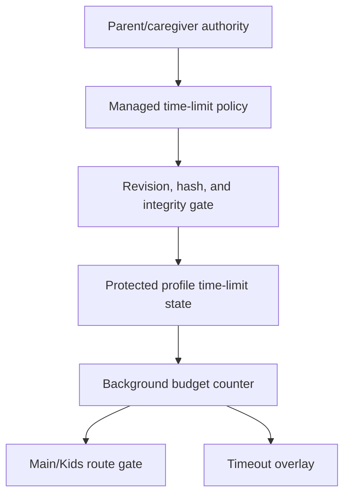

# Contract: Managed Child Time-Limit Schema

**Generated**: 2026-06-03
**Status**: Local profile UI/store and first extension runtime enforcement are
implemented for child/protected profiles.
**Goal slice**: Implementation order item 6, "Add local child/protected-profile
time-limit UI and schema".
**Primary inputs**:
`docs/audit/FILTERTUBE_LOCAL_NETWORK_MANAGED_PARENT_CONTROLS_PLAN_2026-06-03.md`,
`docs/audit/FILTERTUBE_MANAGED_POLICY_SCHEMA_REVISION_CONTRACT_2026-06-03.md`,
and
`docs/audit/FILTERTUBE_MANAGED_CHILD_LOCAL_AUTHORITY_CONTRACT_2026-06-03.md`.

## Purpose

This contract defines the first protected-profile YouTube time-limit policy
shape and the current local parent UI/store plus extension runtime boundary.
The schema must work for same-device parent edits, Nanah P2P updates,
local-network managed updates, and downstream mobile/tablet app parity.

The policy is profile-owned. It is not granted by a child/protected-user PIN,
LAN discovery, open YouTube tab state, or action-history row.

## Required Policy Shape

Every future protected-profile time-limit policy should be stored with this
minimum shape:

| Field | Meaning | Required behavior |
| --- | --- | --- |
| `schema` | Time-limit schema marker. | Must be `filtertube_managed_time_limit`. |
| `version` | Schema version. | Starts at `1`; migrations must be explicit. |
| `enabled` | Whether runtime enforcement is active. | `false` means no budget gate and no content-side overlay. |
| `timezone` | Parent-selected IANA-style reset timezone. | Required when enabled; device timezone drift cannot weaken policy. |
| `dailyBudgetSeconds` | Whole-profile daily YouTube budget. | Integer `>= 0`; zero is valid and means immediate timeout when enabled. |
| `surfaceBudgets` | Optional per-space limits. | `main` and `kids` must be integers `>= 0` when present. |
| `countingMode` | How time is counted. | First mode is `active_youtube_tab`. |
| `activeDeviceBudgetPolicy` | Multi-tab/device counting rule. | First extension mode is `single_active_tab_no_double_count`. |
| `resetPolicy` | Day-boundary behavior. | First mode is `policy_timezone_midnight`. |
| `graceSeconds` | Parent-approved grace after budget exhaustion. | Integer `>= 0`; default `0`. |
| `parentGrant` | Temporary parent/caregiver extension of time. | Optional; if enabled, requires non-negative extra seconds and expiry. |
| `policyRevision` | Managed revision for the time-limit scope. | Monotonic per target profile/link/scope. |
| `policyHash` | Canonical hash of the time-limit payload. | Required for idempotency and equal-revision conflict checks. |
| `issuedAt` | Parent/caregiver issue timestamp. | Diagnostic; revision still decides authority. |
| `validFrom` | Earliest accepted policy time. | Optional; future policies must not weaken current runtime until active. |
| `validUntil` | Optional expiry. | Expired policy cannot grant more access than last valid stricter policy. |

## Counting Decisions

Initial extension behavior should use these decisions:

| Fixture id | Case | Required decision |
| --- | --- | --- |
| `valid_two_hour_daily_budget` | Enabled policy, 7200 seconds, Main and Kids allowed. | Budget is enforceable after runtime implementation. |
| `valid_zero_budget_timeout` | Enabled policy with `dailyBudgetSeconds: 0`. | Immediate timeout when current day has no remaining grant. |
| `disabled_policy_no_work` | `enabled: false`. | No budget timer, no overlay, no YouTube route work. |
| `reject_negative_daily_budget` | Negative `dailyBudgetSeconds`. | Reject before policy write. |
| `reject_negative_surface_budget` | Negative `surfaceBudgets.main` or `.kids`. | Reject before policy write. |
| `reject_negative_grace_or_grant` | Negative grace or parent grant. | Reject before policy write. |
| `reject_invalid_timezone` | Missing, non-IANA, or unsupported timezone. | Reject before import, remote apply, runtime compile, or content heartbeat work. |
| `trusted_reduced_budget_newer_revision` | Parent lowers daily budget in a newer signed policy. | Accept and clamp remaining time immediately. |
| `stale_reduced_budget_rejected` | Lower budget arrives with stale revision. | Reject as replay/stale; keep current policy. |
| `equal_revision_different_hash_conflict` | Same revision, different policy hash. | Reject and log conflict. |
| `single_active_tab_no_double_count` | Multiple YouTube tabs exist but only one is active/focused. | Count one active tab, not all tabs. |
| `sleep_restart_revalidation_required` | Browser/device sleeps, restarts, or tab state is stale. | Revalidate before granting more time; do not silently reset. |
| `timezone_drift_revalidation_required` | Device timezone differs from policy timezone. | Use policy timezone for reset boundary and revalidate state. |

## Reset And Resume Rules

Reset authority belongs to the policy timezone, not the device's current
timezone. Device timezone changes should create a revalidation event, not a
larger budget.

Invalid timezone strings fail closed. Runtime compile, import sanitation,
content heartbeat arming, dashboard policy reads, and Nanah managed
time-limit apply all validate the timezone with `Intl.DateTimeFormat` before
the policy can count time or reset the daily budget.

Sleep and restart handling must be conservative:

- Closed-browser time is not counted as active YouTube time unless persisted
  active-tab evidence proves a YouTube tab was active.
- A resumed browser must re-read the current policy revision and consumed
  counter before granting access.
- If the parent/caregiver reduced the budget while the child device was
  offline, the newer accepted policy clamps remaining time on open.
- If persisted active-tab state is stale or contradictory, fail toward
  revalidation rather than invisible access.

## Parent Grant Rules

Temporary extra time is allowed only as parent/caregiver authority:

```text
parentGrant.enabled: true
parentGrant.extraSeconds: integer >= 0
parentGrant.expiresAt: timestamp
parentGrant.reason: optional redacted string
```

An expired parent grant contributes no time. A grant cannot reduce the
underlying policy revision requirements and cannot authorize profile, rule, or
viewing-space edits.

## Authority Flow

ASCII:

```text
parent/caregiver authority
  -> managed time-limit policy
  -> revision/hash/integrity gate
  -> profile time-limit state
  -> background budget counter
  -> route gate and timeout overlay
```

Mermaid:



## Current Local UI And Store Boundary

Current extension UI can now create or disable a profile-owned
`settings.timeLimitPolicy` from Accounts & Sync profile rows:

- Parents/account profiles can set a daily limit in whole minutes.
- `0` minutes is valid and stores an immediate-timeout policy for future
  runtime enforcement.
- Child/protected active profiles cannot set, change, or disable time limits.
- Writes use the same sensitive parent/account re-auth gate used for
  viewing-space edits: active child profiles are rejected, the active manager
  must be allowed to manage the target profile, and the manager profile must
  have a fresh sensitive admin session.
- Accepted parent/account set, change, and disable actions now append protected
  redacted `policy.time_limit.update` rows to the target profile's
  `managedActionHistory`.
- Command-center same-budget bulk apply can target selected protected profiles,
  but it still builds one policy revision, policy hash, and protected
  `policy.time_limit.update` history row per child profile after parent/account
  re-auth.
- Import/profile sanitation preserves only valid `filtertube_managed_time_limit`
  policies and drops malformed payloads.
- Disabling a limit writes a disabled policy revision; disabled policy remains a
  no-budget-work state for future runtime.

## Current Runtime Boundary

Current product source implements the local UI/store path and the first
extension runtime path:

```text
local managed time-limit profile store: present
local managed time-limit parent UI: present
local managed time-limit protected history row writer: present
runtime managed time-limit policy compiler: present
runtime managed active-tab budget counter: present
runtime managed heartbeat active-policy revalidation: present
runtime managed timeout overlay: present
runtime managed Main/Kids time gate: present
YouTube runtime behavior changed by this contract: yes, for child profiles with enabled time-limit policy
```

The first runtime path is intentionally lazy:

- Background compile emits `managedTimeLimitPolicy` only for active child
  profiles with a valid `settings.timeLimitPolicy`.
- Content bridge arms heartbeat listeners and a timer only when that policy is
  enabled on a YouTube-owned route.
- Background treats those heartbeats as liveness signals, then re-resolves the
  compiled active child profile policy before counting or timing out the route.
  Stale or mismatched content policy payloads do not own the profile id,
  revision, hash, budget, or timeout decision.
- The background owns the persisted `ftManagedTimeUsageV1` counter and clamps
  elapsed time by active/focused tab heartbeat, policy date, revision, and hash.
- The content overlay does not mark videos hidden, does not click YouTube, and
  only covers the route after background reports `timedOut: true`.
- Missing, disabled, malformed, non-child, or external-route policies remain
  no-work states.

The current budget is whole-profile daily time from `dailyBudgetSeconds`; the
schema still preserves `surfaceBudgets` for later per-space refinements, but the
first runtime path does not reset budget by switching between YouTube Main and
YouTube Kids.

## Verification

Focused test:

```bash
node --test tests/runtime/managed-child-time-limit-schema-current-behavior.test.mjs
```

Settings lane:

```bash
npm run test:settings
```
