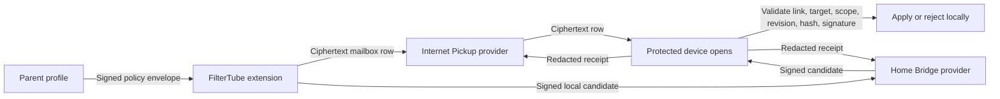

# FilterTube Managed Delivery Reference Provider

**Date**: 2026-06-20
**Scope**: Internet Pickup and Home Bridge provider proof for managed
parent/caregiver controls.

## Summary

FilterTube now has a dependency-free Node reference provider at:

```bash
npm run managed:provider
```

The provider is intentionally a transport proof, not policy authority. It keeps
an in-memory queue for:

- Internet Pickup ciphertext mailbox items.
- Internet Pickup redacted delivery receipts.
- Home Bridge signed local-network candidates.
- Home Bridge redacted delivery receipts.

It exists so the browser extension's configured provider hooks can be exercised
against a real endpoint shape before a hosted service or native app bridge is
owned.

## Authority Boundary

The provider never decides:

- which profile is managed
- which device is trusted
- whether a parent PIN/admin session is valid
- whether a policy revision is newer
- whether a signature or hash is valid
- whether a rule should be applied
- whether Main YouTube or YouTube Kids is allowed
- whether a time limit is exhausted

Those checks stay local in the extension/app runtime through trusted-link,
target-profile, scope, revision, policy-hash, signature, and local apply gates.

## Transport Shape



## Internet Pickup Endpoints

The reference provider accepts paths under any prefix, so
`/filtertube/managed-mailbox/upload` and `/managed-mailbox/upload` both work.

| Endpoint | Purpose | Stored data |
| --- | --- | --- |
| `POST */managed-mailbox/upload` | Store pending sealed updates. | Ciphertext item metadata only. |
| `POST */managed-mailbox/pull` | Protected device pulls matching pending rows. | Ciphertext rows. |
| `POST */managed-mailbox/ack` | Protected device posts delivery/apply result. | Redacted receipt metadata. |
| `POST */managed-mailbox/ack/pull` | Parent/source checks delivery status. | Redacted receipt metadata. |
| `POST */managed-mailbox/purge` | Delete pending rows after revocation or cleanup. | No plaintext. |

Mailbox upload rejects plaintext policy keys such as `payload`, `keywords`,
`channels`, `videoIds`, `policy`, `pin`, `password`, and private keys.

## Home Bridge Endpoints

| Endpoint | Purpose | Stored data |
| --- | --- | --- |
| `POST */managed-local-network/health` | Check an explicitly configured bridge. | Health metadata only. |
| `POST */managed-local-network/publish` | Store signed same-network candidates. | Signed managed envelope candidates. |
| `POST */managed-local-network/discover` | Protected device pulls matching candidates. | Signed candidates. |
| `POST */managed-local-network/ack` | Protected device posts delivery/apply result. | Redacted receipt metadata. |
| `POST */managed-local-network/ack/pull` | Parent/source checks delivery status. | Redacted receipt metadata. |

Home Bridge rejects private secrets and credentials. It may carry the signed
managed-policy envelope because this path is same-network signed delivery, not
ciphertext mailbox storage. The receiving protected device still validates the
signature/hash/target locally before applying anything.

## Non-Goals

- No automatic LAN peer discovery.
- No multicast, mDNS, WebRTC, or browser network scanning.
- No hosted FilterTube Internet Pickup deployment.
- No durable database.
- No native Android/iOS parity claim.
- No replacement for live Nanah pairing.

## Validation

Current focused proof:

```bash
node --check scripts/managed-delivery-provider.mjs
node --test \
  tests/runtime/managed-delivery-provider-reference-current-behavior.test.mjs \
  tests/runtime/managed-transport-provider-clients-current-behavior.test.mjs
```
