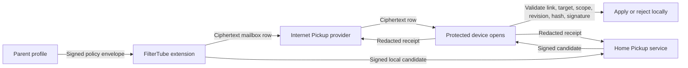

# FilterTube Managed Delivery Reference Provider

**Date**: 2026-06-20
**Scope**: Internet Pickup and Home Pickup service proof for managed
parent/caregiver controls.

## Summary

FilterTube now has a dependency-free Node reference provider at:

```bash
npm run managed:provider
```

The provider is intentionally a transport proof, not policy authority. By
default it keeps an in-memory queue for:

- Internet Pickup ciphertext mailbox items.
- Internet Pickup redacted delivery receipts.
- Home Pickup signed local-network candidates.
- Home Pickup redacted delivery receipts.
- Revocation cleanup for pending Internet Pickup and Home Pickup rows.

Pending rows and redacted receipts use the same default seven-day retention
window. A row can supply a shorter expiry, but the provider clamps longer
expiries back to the default maximum, and all row maps are capped by the
provider row limit. This keeps long-running local/home trials bounded even when
a parent does not manually clear old receipts.

When a protected device acknowledges a waiting Internet Pickup item or Home
Pickup candidate, the provider keeps the redacted receipt for the parent/source
but clears the acknowledged waiting row from the queue. This prevents replaying
the same already-handled update each time the protected profile opens.
The extension refreshes provider health after parent sends and protected-device
receives so queue counts shown in Accounts & Sync track those changes without
requiring a manual check.
When the parent/source later pulls delivery receipts, the provider returns
redacted receipt rows. The extension wraps those rows into the same managed ack
envelope used by live Nanah before recording them locally, then purges only the
successfully recorded receipt rows from the provider.
Purge requests honor `purgeStates`: revocation and signing-key cleanup can
delete both `pending` and `ack` rows, while source receipt cleanup sends
`ack` only so it cannot remove a pending update row by accident.

It exists so the browser extension's configured provider hooks can be exercised
against a real endpoint shape before a hosted service or native app provider is
owned.

For real local/home trials, the provider can optionally persist those same
sanitized rows to a local JSON store:

```bash
FILTERTUBE_PROVIDER_STORE=.filtertube/managed-delivery-store.json npm run managed:provider
```

On shared home/school networks, add a provider key and paste the same key into
the FilterTube Home Pickup or Internet Pickup key prompt:

```bash
FILTERTUBE_PROVIDER_TOKEN=<private-pickup-key> FILTERTUBE_PROVIDER_HOST=0.0.0.0 FILTERTUBE_PROVIDER_STORE=.filtertube/managed-delivery-store.json npm run managed:provider
```

The Accounts & Sync setup-copy action generates a local key for this purpose.
This key only gates provider transport access; it is not a parent PIN and it
does not grant policy authority.

For Internet Pickup trials, the same provider shape can be used only after it is
served through a trusted HTTPS address that the family/school controls:

```bash
FILTERTUBE_PROVIDER_HOST=0.0.0.0 FILTERTUBE_PROVIDER_STORE=.filtertube/managed-delivery-store.json npm run managed:provider
```

Then configure Internet Pickup with the HTTPS address you own:

```text
https://<your-trusted-domain>/filtertube
```

The extension setup modal can copy this command, but it does not create the
HTTPS endpoint, own a hosted service, or make provider reachability policy
authority.

For a same-network Home Pickup trial where another device needs to reach this
computer, bind the provider to the local network:

```bash
FILTERTUBE_PROVIDER_HOST=0.0.0.0 FILTERTUBE_PROVIDER_STORE=.filtertube/managed-delivery-store.json npm run managed:provider
```

The provider prints one or more concrete Home Pickup addresses when it starts.
Open one printed address from another device on the same network first. A normal
browser opens a safe FilterTube Pickup Provider status page; API callers that
request JSON receive the read-only status payload. Then configure Home Pickup
with that same printed address.

```text
http://<printed-home-pickup-address>:8787/filtertube
```

The status page and store are still transport-only. The page shows protocol,
provider-key, and storage-mode status only. The store contains ciphertext
mailbox rows, signed Home Pickup candidates, and redacted receipts. It does not
store PINs, plaintext rules, private keys, or policy authority. The protected
device still has to validate the saved parent link, target profile, scope,
revision, hash, and signature before anything applies.

## Authority Boundary

The provider never decides:

- which profile is managed
- which device is trusted
- whether a parent PIN/admin session is valid
- whether a policy revision is newer
- whether a signature or hash is valid
- whether a rule should be applied
- whether Main YouTube or YouTube Kids is allowed
- whether a time limit is exhausted

Those checks stay local in the extension/app runtime through trusted-link,
target-profile, scope, revision, policy-hash, signature, and local apply gates.

## Transport Shape


```mermaid
flowchart LR
  Parent["Parent profile"] -->|Signed policy envelope| Extension["FilterTube extension"]
  Extension -->|Ciphertext mailbox row| InternetPickup["Internet Pickup provider"]
  Extension -->|Signed local candidate| HomePickup["Home Pickup service"]
  InternetPickup -->|Ciphertext row| Child["Protected device opens"]
  HomePickup -->|Signed candidate| Child
  Child -->|Validate link, target, scope, revision, hash, signature| Apply["Apply or reject locally"]
  Child -->|Redacted receipt| InternetPickup
  Child -->|Redacted receipt| HomePickup
```

## Internet Pickup Endpoints

The reference provider accepts paths under any prefix, so
`/filtertube/managed-mailbox/upload` and `/managed-mailbox/upload` both work.

| Endpoint | Purpose | Stored data |
| --- | --- | --- |
| `POST */managed-mailbox/upload` | Store pending sealed updates. | Ciphertext item metadata only. |
| `POST */managed-mailbox/pull` | Protected device pulls matching pending rows. | Ciphertext rows. |
| `POST */managed-mailbox/ack` | Protected device posts delivery/apply result and clears the acknowledged waiting item. | Redacted receipt metadata. |
| `POST */managed-mailbox/ack/pull` | Parent/source checks delivery status. | Redacted receipt metadata. |
| `POST */managed-mailbox/purge` | Delete pending rows, redacted receipts, or both according to `purgeStates`. | No plaintext. |
| `POST */managed-mailbox/health` | Check whether the configured pickup is reachable and whether a local durable store is enabled. | Health metadata only. |

Mailbox upload rejects plaintext policy keys such as `payload`, `keywords`,
`channels`, `videoIds`, `policy`, `pin`, `password`, and private keys.

## Home Pickup Endpoints

| Endpoint | Purpose | Stored data |
| --- | --- | --- |
| `POST */managed-local-network/health` | Check an explicitly configured Home Pickup service and whether a local durable store is enabled. | Health metadata only. |
| `POST */managed-local-network/publish` | Store signed same-network candidates. | Signed managed envelope candidates. |
| `POST */managed-local-network/discover` | Protected device pulls matching candidates. | Signed candidates. |
| `POST */managed-local-network/ack` | Protected device posts delivery/apply result and clears the acknowledged waiting candidate. | Redacted receipt metadata. |
| `POST */managed-local-network/ack/pull` | Parent/source checks delivery status. | Redacted receipt metadata. |
| `POST */managed-local-network/purge` | Delete pending candidates, redacted receipts, or both according to `purgeStates`. | No plaintext rules or private secrets. |

Home Pickup rejects private secrets and credentials. It may carry the signed
managed-policy envelope because this path is same-network signed delivery, not
ciphertext mailbox storage. The receiving protected device still validates the
signature/hash/target locally before applying anything.

The purge endpoint is cleanup only. It is called by the extension when a managed
trusted link is removed or the parent/source signing key is rotated. The request
is scoped by link/profile/device/scope metadata and never grants authority to a
network service.

## Parent-Facing Durability Status

The health responses include `persistentStore: true` only when the provider was
started with `FILTERTUBE_PROVIDER_STORE`. The same health responses also include
redacted queue counts only:

- `pendingMailboxItemCount`
- `mailboxAckCount`
- `pendingLocalCandidateCount`
- `localAckCount`

The dashboard uses those values as parent-facing status, such as `No waiting
updates`, `2 waiting updates`, or `1 delivery receipt`, without exposing channel,
keyword, video, profile, PIN, or plaintext policy data.

The dashboard uses `persistentStore` as redacted durability feedback:

- saved store enabled: waiting updates can survive a provider process restart
- memory-only provider: waiting updates can be lost if the provider restarts

This is status only. It does not prove that a specific child device has picked up
an update, and it does not grant profile, PIN, trusted-device, rule, or time-limit
authority.

## Non-Goals

- No automatic LAN peer discovery.
- No multicast, mDNS, WebRTC, or browser network scanning.
- No hosted FilterTube Internet Pickup deployment.
- No built-in hosted durable database. Optional local JSON persistence is
  available for self-hosted trials through `FILTERTUBE_PROVIDER_STORE`.
- No native Android/iOS parity claim.
- No replacement for live Nanah pairing.

## Validation

Current focused proof:

```bash
node --check scripts/managed-delivery-provider.mjs
node --test \
  tests/runtime/managed-delivery-provider-reference-current-behavior.test.mjs \
  tests/runtime/managed-transport-provider-clients-current-behavior.test.mjs
```
