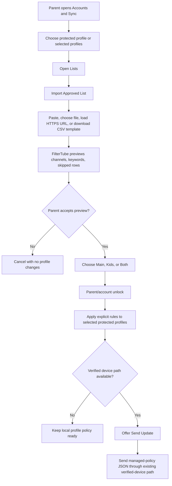
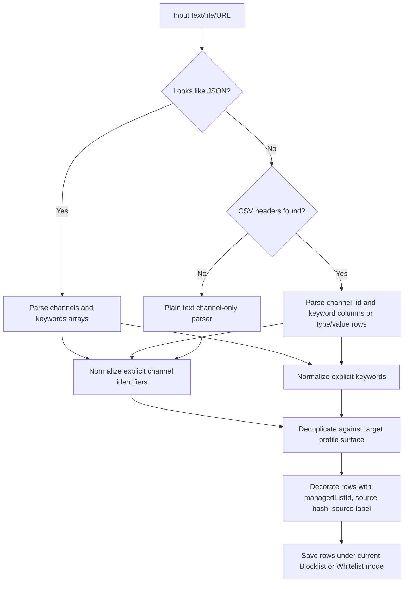
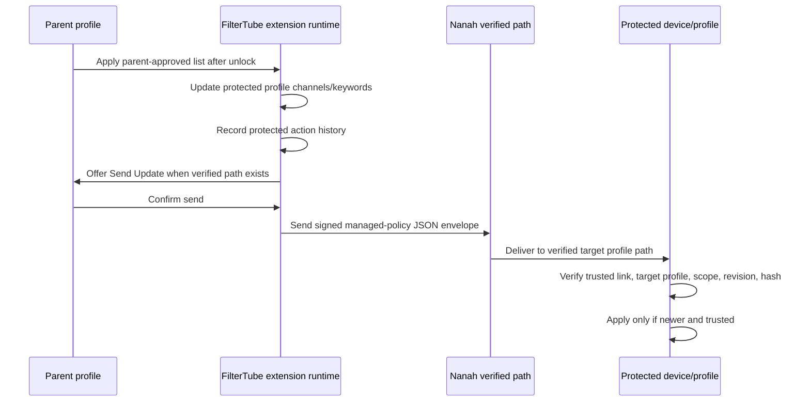

# FilterTube Managed Import List Format

Date: 2026-06-18
Scope: parent/caregiver-managed protected profiles, local profile rules, Nanah live sync handoff, and future app parity.

## Goal

Keep imports simple enough for parents and caregivers:

1. The file provides rule values.
2. FilterTube previews what it understood.
3. The parent chooses protected profiles.
4. The parent chooses Main YouTube, YouTube Kids, or both.
5. FilterTube applies the rules locally after parent/account unlock.
6. FilterTube can then send the changed profile policy to verified devices.

The file must not decide parent authority, target child profile, PIN behavior, sync delivery, list mode, or Main/Kids access. Those decisions stay in the UI.

## User-Facing Name

Use `Parent-approved lists` for the feature name and `Import Approved List`
for the primary action in the UI.

Avoid making parents choose between many importer types. The importer can accept:

- channel lists
- keyword lists
- mixed CSV rule lists
- URL-backed lists

The preview should explain the result in plain counts:

```text
48 channels
12 keywords
3 rows skipped
Applies to: Main + Kids
Profiles: Asha, Kabir
```

## Recommended CSV Format

CSV is for explicit channel identifiers and explicit keywords. It is not semantic inference.

Recommended header:

```csv
channel_id,keyword,notes
UCxxxxxxxxxxxxxxxxxxxxxx,,block this channel
@SomeChannel,,handle is accepted
https://www.youtube.com/@AnotherChannel,,URL is accepted
,spider,hide this topic keyword
,brainrot,hide this keyword
```

Rules:

- `channel_id` can contain:
  - `UC...` channel ID
  - `@handle`
  - `/channel/UC...`
  - `/c/name`
  - `/user/name`
  - YouTube channel URL
- `keyword` can contain a plain keyword or phrase.
- `notes` is ignored by runtime and exists only so list authors can explain rows.
- A row may contain a channel, a keyword, or both.
- Empty rows and comment rows are skipped.
- Name-only channel rows are skipped for safety.

Accepted channel column aliases:

```text
channel
channel_id
channelId
channel_url
youtube_url
url
handle
uc_id
```

Accepted keyword column aliases:

```text
keyword
keywords
term
terms
phrase
phrases
```

## Alternate CSV Format

For list maintainers who prefer one value column:

```csv
type,value,notes
channel,UCxxxxxxxxxxxxxxxxxxxxxx,channel id
channel,@SomeChannel,handle
keyword,spider,topic keyword
keyword,brainrot,topic keyword
```

This is readable, but the UI should still recommend `channel_id,keyword,notes` because it is easier for spreadsheet users.

## Plain Text Format

Plain text remains channel-first for safety.

```text
# title: Family channel block list
# version: 2026.06.18
UCxxxxxxxxxxxxxxxxxxxxxx
@SomeChannel
https://www.youtube.com/@AnotherChannel
```

Do not treat arbitrary plain text rows as keywords. A note like `bad thumbnails` should not silently become a keyword rule.

## JSON Format

JSON can support both channels and keywords.

```json
{
  "title": "Family safety starter list",
  "version": "2026.06.18",
  "homepage": "https://example.com/filtertube-list",
  "channels": [
    "UCxxxxxxxxxxxxxxxxxxxxxx",
    "@SomeChannel",
    "https://www.youtube.com/@AnotherChannel"
  ],
  "keywords": [
    "spider",
    "brainrot"
  ]
}
```

Simple arrays remain channel lists for backward compatibility:

```json
[
  "UCxxxxxxxxxxxxxxxxxxxxxx",
  "@SomeChannel"
]
```

## Not In The File

These must not be accepted from the import file:

- protected profile id
- parent profile id
- PIN or password
- Nanah trusted-device id
- sync destination
- list mode change
- Main/Kids access mode
- daily time limit
- allow/deny authority
- remote command

Reason: a downloaded list should never become authority. It is only a source of suggested rules.

## How It Applies

Parent UI owns the final choices:

```text
Import Approved List
  -> preview channels/keywords/skipped rows
  -> choose protected profiles
  -> choose Main / Kids / Both
  -> parent/account unlock
  -> apply rows to each target profile's current mode
  -> optionally send update to verified device
```

### Parent/Caregiver User Flow



### Rule Import Behavior Flow



### Verified-Device Sync Flow

Parent-approved list rows do not create a second sync protocol. After rules are
applied to a protected profile, FilterTube sends the changed policy through the
existing managed-policy JSON path when the parent chooses to send now.



Mode behavior:

- If the target surface is in blocklist mode, imported channels go to block channels and imported keywords go to block keywords.
- If the target surface is in whitelist mode, imported channels go to whitelist channels and imported keywords go to whitelist keywords.
- The import does not switch modes.

Pause/resume/remove behavior:

- Rows from the same imported list share `managedListId`.
- Pause disables list-derived channel and keyword rows without deleting manual rules.
- Resume re-enables them.
- Remove deletes only rows with that `managedListId`.
- URL refresh replaces only rows from that list.

## Semantic ML Boundary

This CSV format is deterministic. It does not infer related channels or related keywords.

Later semantic ML can build a separate `suggested rules` layer:

```text
seed term -> suggested keywords/channels -> parent review -> explicit rules
```

That future layer should still end at the same explicit rule model before it affects a child/protected profile.

## UI Simplification

Use one modal with four clear areas:

```text
1. List source
   Paste, choose file, or load public HTTPS URL.

2. Preview
   Channels found, keywords found, rows skipped.

3. Apply to
   Main, Kids, or Both.

4. Finish
   Apply locally, then optionally Send to verified devices.
```

Avoid showing mailbox/LAN/provider wording inside the import flow. Import is local first; delivery is the next optional step.

## 2026-06-18 UX Completion Note

The first parser slice was not complete from a user-flow standpoint because CSV import was only reachable through protected-profile list actions and Help text. A second pass briefly placed separate import affordances inside Main Filters and YouTube Kids channel management, but that split the mental model: Filters/Kids pages are rule-editing surfaces, while external files and backup/list imports belong in Settings.

Current completion rule:

- Product-facing name: Parent-approved lists. Parser/internal docs may still
  say rule-list formats because the accepted files are plain rule data.
- Primary entry point: Settings -> Import / Export -> Parent-approved list imports.
- Target choice: Main YouTube, YouTube Kids, or Both. This works for the active profile or the protected profile currently being edited by a parent/account profile.
- Main/Kids rule pages remain the place to review, edit, pause, resume, and remove the imported rows after import.
- The Settings card shows a sheet-like structure preview instead of dense prose: `type`, `value`, `notes`, plus supported CSV/JSON shapes.
- The modal says parent-approved list, shows supported formats, CSV template, file/URL/paste inputs, live preview counts, skipped row counts, a spreadsheet-like parsed-row preview, and the final Apply confirmation.
- Rule-list JSON is intentionally narrower than a full FilterTube backup JSON. It may add channels and keywords only; it does not change profile structure, PINs, trusted devices, viewing spaces, or sync targets.
- The Settings card and import modal expose both CSV and JSON rule-list templates. The CSV template is the spreadsheet path; the JSON template is the lightweight rule-list shape, not the full FilterTube backup/export structure.
- Import backup remains the full restore/migration lane for FilterTube backup JSON and legacy BlockTube export JSON.
- Help text should stay short and point to the UI path; this audit file owns the detailed format contract.

Supported source shapes in this slice:

- CSV: `channel_id,keyword,notes`, `channel,keyword,notes`, or typed rows such as `type,value,notes`.
- Text: bare rows are treated as channel IDs/handles/custom URLs/URLs. Explicit typed rows are also accepted: `channel: @SomeChannel`, `channel: UC...`, `channel: c/Name`, and `keyword: brainrot`.
- Simple JSON: `channels` and/or `keywords` arrays.
- BlockTube-style JSON: `filterData.channelId`, `filterData.channelName`, and `filterData.title` arrays are read as rule-list channels/keywords.
- Raw HTTPS source URL: public CSV, text, or JSON fetched into the same preview before apply.

Current modal shape:

- The format guide is a pill selector: CSV, TXT, JSON, BlockTube, and URL.
- Each pill shows one concrete import shape before the parent chooses a file.
- The editable area accepts paste, local file, raw HTTPS URL, CSV template, TXT template, or JSON template.
- The preview shows channel count, keyword count, skipped count, and a sheet-style row sample before apply.
- The apply step remains local profile mutation first; verified-device delivery is the next explicit action.

Current UI wording boundary:

- "Parent-approved list" means the parent/account profile reviewed parsed rows
  and chose to apply them.
- It does not mean the URL, file author, or JSON shape has authority.
- The list can add only channel and keyword rows to Main, Kids, or both.
- Sending those changes to another device still uses the verified-device
  managed-policy path, not the file/list parser.

Not shipped in this CSV PR:

- Built-in global/public list catalog.
- Automatic subscriptions to third-party lists.
- Parent/community moderation workflow for shared "good" or "bad" channel lists.
- Silent application across profiles or devices.

Those are compatible with this foundation, but they need a separate catalog and governance design: source URL, maintainer, scope, last checked, content hash, update policy, enable/disable state, user review, and per-profile Main/Kids target selection.
