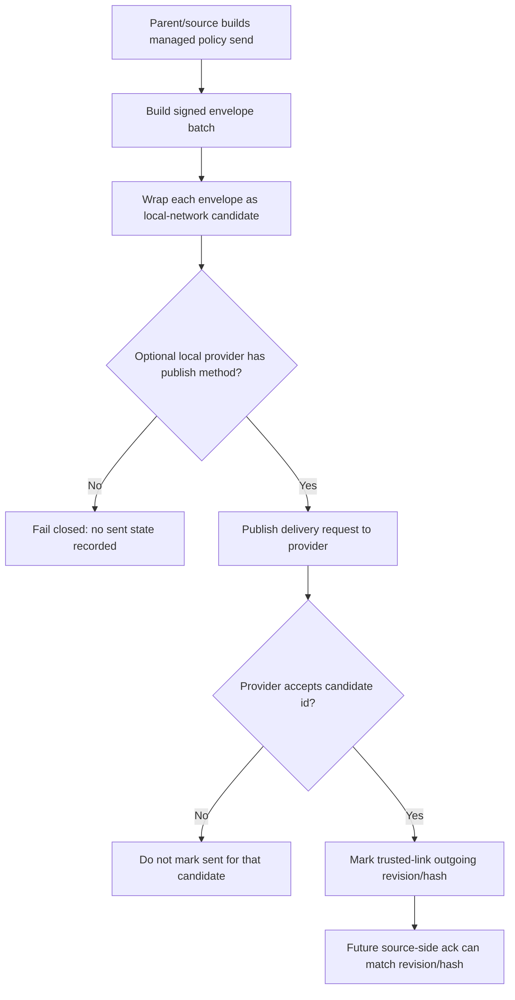

# Audit: Managed Local-Network Source Delivery Handoff

**Generated**: 2026-06-05
**Status**: Source-side local-network managed policy delivery handoff is
present as a provider-gated signed-candidate publisher. Built-in LAN peer
discovery, LAN transport, server mailbox upload/pull, and dashboard offline-send
UI remain absent.
**Related live-send proof**:
`docs/audit/FILTERTUBE_NANAH_MANAGED_LIVE_SIGNED_SEND_2026-06-04.md`
**Related receive hook**:
`docs/audit/FILTERTUBE_LOCAL_NETWORK_MANAGED_PROVIDER_HOOK_2026-06-05.md`
**Related source ack status**:
`docs/audit/FILTERTUBE_MANAGED_SOURCE_DELIVERY_ACK_STATUS_2026-06-05.md`

## Purpose

Issue 60 asks for local-network or peer-to-peer remote management where a
parent/caregiver can update a protected profile and later see feedback. Earlier
slices added signed managed-policy envelopes, replica-side local-network
candidate intake, protected apply/reject history, provider ack handoff, and
source-side delivery-ack status. This slice adds the missing source-side
handoff primitive: a parent/source runtime can package signed managed-policy
envelopes as `filtertube_managed_local_network_candidate` rows and publish them
to an optional local provider.

The provider is transport only. It does not create authority, choose scopes,
or mark policy accepted on the protected profile. The protected replica must
still validate trusted link, device binding, target profile, scope, revision,
policy hash, key identity, and signature before applying any candidate.

## Runtime Shape



## Optional Provider Shape

```js
window.FilterTubeManagedPolicyLocalNetwork = {
  async publishManagedPolicyCandidates(request) {
    return { ok: true, deliveredCandidateIds: ['candidate-id'] };
  }
};
```

The helper also accepts these equivalent method names:

```text
deliverManagedPolicyCandidates
publishLocalNetworkCandidates
putManagedPolicyCandidates
```

The request uses this schema:

```text
filtertube_managed_local_network_delivery_request
```

Request fields are:

```text
schema, version, transport, reason, requestedAt, candidateCount,
targetProfileIds[], scopes[], candidates[]
```

Each candidate uses:

```text
schema: filtertube_managed_local_network_candidate
candidateId, transport, linkId, sourceDeviceId, sourceProfileId,
targetProfileId, targetProfileName, scope, revision, policyHash,
sourcePublicKeyId, keyVersion, issuedAt, createdAt, expiresAt, envelope
```

The `envelope` is the already signed `filtertube_managed_policy` payload. It
can contain policy values needed by the protected replica, so the provider must
be a trusted local transport. This source-delivery handoff must not be reused as
a server mailbox upload path; the mailbox protocol remains ciphertext-only.

## Runtime Hooks Added

```text
js/nanah_managed_live_policy.js
  filtertube_managed_local_network_candidate
  filtertube_managed_local_network_delivery_request
  buildLocalNetworkCandidateFromEnvelope(...)
  buildLocalNetworkCandidateBatchForTrustedLinks(...)
  buildLocalNetworkDeliveryRequest(...)
  deliverLocalNetworkCandidates(...)
  deliverLocalNetworkPolicyBatch(...)
  outbound history delivery = local_network_provider
```

## Safety Boundary

```text
runtime source-side local-network candidate builder: present
runtime source-side local-network provider publish helper: present
runtime partial provider acceptance handling: present
runtime sent revision/hash marking only for provider-accepted candidates: present
runtime signed envelope authority unchanged: present
runtime provider authority: absent
runtime built-in LAN peer discovery: absent
runtime built-in LAN transport: absent
runtime server mailbox upload/pull client: absent
runtime dashboard offline-send UI: absent
runtime YouTube page hot-path work from this slice: absent
```

If the provider is unavailable, throws, or rejects a candidate, the helper does
not call `markSent(...)` for that candidate. This preserves source-side ack
matching: a later delivery ack can be recorded only when a trusted link already
has matching `outgoingManagedPolicies[scope].revision` and `policyHash`.

## Verification

Focused test:

```bash
node --test tests/runtime/managed-nanah-live-signed-send-current-behavior.test.mjs
```

Settings lane:

```bash
npm run test:settings
```
