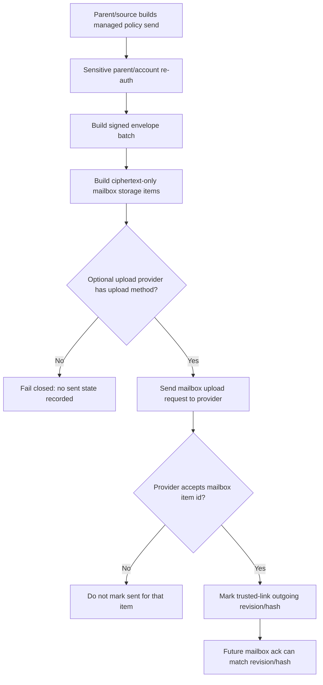

# Audit: Managed Mailbox Source Upload Handoff

**Generated**: 2026-06-05
**Status**: Source-side mailbox upload-provider handoff is present for
ciphertext-only managed mailbox items and requires sensitive parent/account
re-auth before provider upload. Built-in mailbox server upload client, built-in
mailbox server pull client, dashboard offline-send UI, and mailbox server
authority remain absent.
**Related live-send proof**:
`docs/audit/FILTERTUBE_NANAH_MANAGED_LIVE_SIGNED_SEND_2026-06-04.md`
**Related mailbox protocol**:
`docs/audit/FILTERTUBE_MANAGED_POLICY_ENCRYPTED_MAILBOX_PROTOCOL_2026-06-04.md`

## Purpose

Issue 60 asks for parent/caregiver remote management that can work locally or
later when the protected device opens. Earlier slices added signed managed
policy envelopes, WebCrypto mailbox seal/open helpers, server-safe
`filtertube_managed_mailbox_item` storage rows, provider-gated protected-side
mailbox pull, and provider ack handoff.

This slice adds the source-side handoff primitive for delayed delivery: a
parent/source runtime can build signed managed-policy envelopes, turn them into
ciphertext-only mailbox storage items through the Nanah adapter, and hand those
items to an optional upload provider after the active parent/account profile
passes the same sensitive-action unlock used by live managed sends.

The upload provider is transport only. It does not create authority, choose
scopes, decrypt payloads, or mark policy accepted on the protected profile. The
protected replica must still open the mailbox item, validate trusted link,
device binding, target profile, scope, revision, policy hash, key identity, and
signature before applying any policy.

## Runtime Shape



## Optional Provider Shape

```js
window.FilterTubeManagedPolicyMailbox = {
  async uploadManagedMailboxItems(request) {
    return { ok: true, uploadedMailboxItemIds: ['mailbox-item-id'] };
  }
};
```

The helper also accepts these equivalent provider method names:

```text
publishManagedMailboxItems
putManagedMailboxItems
enqueueManagedMailboxItems
```

The request uses this schema:

```text
filtertube_managed_mailbox_upload_request
```

Request fields are:

```text
schema, version, transport, reason, requestedAt, mailboxItemCount,
targetProfileIds[], scopes[], items[]
```

Each item uses the existing mailbox storage schema:

```text
schema: filtertube_managed_mailbox_item
mailboxItemId, linkId, targetProfileId, sourceDeviceId, sourceProfileId,
scope, revision, policyHash, sourcePublicKeyId, keyVersion, cipherSuite,
keyAgreementId, encryptedDek, nonce, ciphertext, ciphertextHash, createdAtMs,
expiresAtMs, ackState
```

The upload request must not include `payload`, `operations`, `envelope`,
`managedPolicyEnvelope`, `decryptedEnvelope`, private keys, keyword values,
channel names, video ids, PINs, or plaintext policy JSON.

The runtime rebuilds provider-facing `items[]` from that allowlist before
calling the upload provider. This keeps source-side sent-state marking able to
use the local mailbox item while preventing accidental adapter/provider
metadata fields from crossing the mailbox upload boundary.

## Runtime Hooks Added

```text
js/nanah_managed_live_policy.js
  filtertube_managed_mailbox_upload_request
  buildMailboxStorageItemFromEnvelope(...)
  buildMailboxStorageItemBatchForTrustedLinks(...)
  buildMailboxUploadRequest(...)
  uploadMailboxItems(...)
  uploadMailboxPolicyBatch(...)
  outbound history delivery = encrypted_mailbox_provider
```

## Safety Boundary

```text
runtime source-side mailbox storage item builder handoff: present
runtime source-side mailbox upload-provider helper: present
runtime source-side mailbox upload admin re-auth gate: present
runtime provider upload item allowlist sanitizer: present
runtime partial provider acceptance handling: present
runtime sent revision/hash marking only for provider-accepted items: present
runtime signed envelope authority unchanged: present
runtime mailbox plaintext policy upload: absent
runtime mailbox provider authority: absent
runtime built-in mailbox server upload client: absent
runtime built-in mailbox server pull client: absent
runtime dashboard offline-send UI: absent
runtime YouTube page hot-path work from this slice: absent
```

If sensitive parent/account re-auth fails, the helper does not sign a batch,
build upload items, call the provider, or mark sent state. If the provider is
unavailable, throws, or rejects an item after authorization, the helper does not
call `markSent(...)` for that item. This preserves source-side ack matching: a
later mailbox ack can be recorded only when a trusted link already has matching
`outgoingManagedPolicies[scope].revision` and `policyHash`.

## Verification

Focused test:

```bash
node --test tests/runtime/managed-nanah-live-signed-send-current-behavior.test.mjs
```

Settings lane:

```bash
npm run test:settings
```
