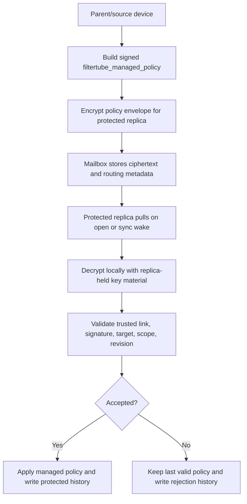

# Audit: Managed Policy Encrypted Mailbox Protocol

**Generated**: 2026-06-04  
**Status**: Protocol, proof fixture, source-side WebCrypto mailbox seal/open
helpers, source-side server-safe mailbox storage item builder, local decrypted
mailbox-item intake, source-side mailbox upload-provider handoff,
source-side mailbox purge-provider handoff,
provider-gated dashboard/profile-open pull hook, provider ack handoff,
protected target-profile ack-handoff evidence, revoked queued-delivery local
apply guard proof, and an explicitly configured browser HTTPS mailbox client are
present. Mailbox server deployment and mailbox server authority are not
implemented.
**Related plan**:
`docs/audit/FILTERTUBE_LOCAL_NETWORK_MANAGED_PARENT_CONTROLS_PLAN_2026-06-03.md`  
**Related inventory**:
`docs/audit/FILTERTUBE_RELEASE_PROFILE_NANAH_MANAGED_PARENT_AUTHORITY_INVENTORY_2026-06-03.md`

## Purpose

This protocol describes the optional later-delivery path for managed parent or
caregiver policies when the parent/source device and child/replica device are
not reachable at the same time.

The mailbox server is storage and relay only. It must never become policy
authority, and it must never receive plaintext rules, keywords, channel names,
video ids, viewing-space settings, time budgets, PIN values, or action-history
summaries.

The decrypted payload is still a normal `filtertube_managed_policy` envelope.
After local decryption, the protected replica runs the same managed-policy
validation and apply path used by live Nanah/P2P delivery:

- `validateManagedPolicyEnvelope(...)`
- trusted-link key and signature verification
- fixed target profile, source device, source profile, scope, revision, and
  policy-hash checks
- `validateManagedMailboxItem(...)` to bind mailbox metadata to the decrypted
  envelope
- `applyManagedMailboxItem(...)` only after accepted validation context

Mailbox delivery does not weaken local/P2P security. It only changes when the
child device can receive the ciphertext.

## End-To-End Shape



## Mailbox Item Shape

The server may store a row shaped like this. Fields are descriptive protocol
names, not a runtime implementation:

```json
{
  "schema": "filtertube_managed_mailbox_item",
  "version": 1,
  "mailboxItemId": "mbx_child-profile-1_keywords_7",
  "linkId": "link-parent-child-1",
  "targetProfileId": "child-profile-1",
  "sourceDeviceId": "parent-device-1",
  "sourceProfileId": "parent-profile-1",
  "scope": "keywords",
  "revision": 7,
  "policyHash": "sha256:policy-hash-7",
  "sourcePublicKeyId": "parent-key-3",
  "keyVersion": 3,
  "cipherSuite": "aes-kw+a256gcm",
  "keyAgreementId": "link-parent-child-1:child-profile-1:parent-key-3:3",
  "encryptedDek": "base64url(...)",
  "nonce": "base64url(...)",
  "ciphertext": "base64url(...)",
  "ciphertextHash": "sha256:ciphertext-hash",
  "createdAt": "2026-06-04T00:00:00.000Z",
  "expiresAt": "2026-06-11T00:00:00.000Z",
  "ackState": "pending"
}
```

Allowed `ackState` values:

```text
pending
delivered
rejected
expired
revoked
conflict
```

The server can route by `linkId`, `targetProfileId`, `revision`, and expiry. It
cannot inspect or alter the policy contents. Any plaintext rule-like field in
server state is a protocol violation.

## Required Delivery Decisions

| Case | Decision | Local result |
| --- | --- | --- |
| Newer revision, matching trusted link, valid decryption, valid signature | Accept | Apply policy and mark delivered. |
| Equal revision with same hash | Idempotent | Mark delivered without reapplying. |
| Equal revision with different hash | Reject conflict | Keep last valid policy and write conflict history. |
| Older revision | Reject stale | Keep last valid policy and write rejected history. |
| Link revoked before delivery | Reject revoked | Do not decrypt/apply; mark revoked. |
| Key revoked before delivery | Reject revoked | Do not apply; require new trusted key path. |
| Wrong target profile | Reject wrong target | Keep last valid policy. |
| Wrong source device/profile | Reject wrong source | Keep last valid policy. |
| Wrong link id | Reject wrong link | Keep last valid policy. |
| Scope not allowed by trusted link | Reject scope | Keep last valid policy. |
| Expired item | Expire | Do not apply. |
| Missing or undecryptable ciphertext | Reject corrupt | Keep last valid policy. |
| Duplicate delivery after accepted same hash | Idempotent | No second profile mutation. |
| Duplicate delivery with different hash | Reject conflict | Keep last valid policy. |

## Protected Offline Behavior

When the child/protected device is offline or the mailbox is unreachable, the
last valid accepted parent policy remains active. Offline state must not unlock
restricted editing controls, widen Main/Kids viewing-space access, reset time
budgets, or drop existing keyword/channel/video rules.

When the device opens the app/profile later, it may pull pending ciphertexts.
Every item is evaluated independently against current trust state before
decryption and before policy apply. Revoking a trusted link must cause queued
items from that link to fail closed.

## History And Privacy

Accepted, rejected, expired, revoked, idempotent, and conflict outcomes should
write protected local action-history rows. The row should include only redacted
summary data by default:

```text
actionType: remote_policy.mailbox.accept|reject|expire|revoke|conflict
ack handoff actionType: remote_policy.mailbox.ack
trustedLinkId
sourceDeviceId
targetProfileId
scope
revision
policyHash
result
reason
receivedOrder
receivedAt
```

The row must not contain plaintext blocked keywords, channel names, video ids,
or viewing history. Protected users cannot clear rejected, revoked, conflict,
or failed-delivery evidence. Ack-handoff rows record only redacted
link/profile/scope/revision/hash, mailbox item id metadata, ack state, and
provider ack counts after the protected device reports accepted/rejected
mailbox outcomes back to the provider.

## Non-Negotiables

- The mailbox server cannot manage, weaken, or interpret policy.
- Server metadata is not enough to apply policy.
- Decryption happens only on the protected replica device.
- Decrypted envelopes must still pass managed-policy validation.
- Replay, stale revision, wrong target, wrong link, wrong source, wrong key,
  expired item, and revoked trust all fail closed.
- Child PIN or protected-user unlock never authorizes mailbox policy changes.
- Mailbox delivery is optional; direct local/P2P delivery remains valid when
  both devices are reachable.
- No-policy/no-work YouTube runtime performance remains a release gate.

## Current Runtime Boundary

Runtime decrypted mailbox intake is present in this slice. The current extension
can validate a local/decrypted `filtertube_managed_mailbox_item`, bind its
metadata to the decrypted `filtertube_managed_policy` envelope, verify the
trusted managed signature context, apply through `applyManagedPolicyEnvelope(...)`,
and write protected redacted action-history evidence.

Source-side mailbox storage preparation is now present through
`buildManagedMailboxStorageItem(...)`. The helper accepts an already-signed
managed policy envelope plus already-encrypted payload fields and emits only
server-safe ciphertext metadata. It refuses missing crypto metadata, stale
expiry, and plaintext policy keys such as payload, operations, keyword/channel
lists, video ids, private keys, or decrypted envelopes. A storage item produced
by this helper is not directly applicable; after local decryption, a provider
must supply the decrypted envelope before `validateManagedMailboxItem(...)` can
accept it.

Source-side mailbox upload-provider handoff is now present through
`buildMailboxStorageItemBatchForTrustedLinks(...)`,
`buildMailboxUploadRequest(...)`, `uploadMailboxItems(...)`, and
`uploadMailboxPolicyBatch(...)` in `js/nanah_managed_live_policy.js`. The helper
hands optional providers only `filtertube_managed_mailbox_item` rows with
ciphertext metadata. It records source-side sent revision/hash state only for
mailbox item ids the provider reports as accepted.

Source-side mailbox purge-provider handoff is now present through
`buildMailboxPurgeRequestForTrustedLink(...)` and
`purgeMailboxItemsForTrustedLink(...)` in
`js/nanah_managed_live_policy.js`, with dashboard wiring through
`purgeNanahManagedMailboxQueueForTrustedLink(...)`. When a parent/source removes
a trusted child/replica link, the dashboard can ask an optional provider to
purge pending ciphertext rows for that link after sensitive parent/account
re-auth. The purge request includes only link, device, profile, scope, pending
state, and revocation metadata. It does not include mailbox items, plaintext
rules, decrypted envelopes, or private keys.

Local mailbox encryption/decryption helpers are now present through
`sealManagedMailboxEnvelope(...)` and `openManagedMailboxStorageItem(...)`.
The seal helper encrypts a signed managed-policy envelope with AES-GCM,
wraps the data-encryption key with an AES-KW mailbox wrapping key, binds the
metadata as AES-GCM authenticated data, writes a SHA-256 ciphertext hash, and
returns a storage item that contains no plaintext policy fields. The open
helper refuses unsupported cipher suites, missing ciphertext metadata,
ciphertext hash mismatch, authenticated-metadata tampering, wrong wrapping
keys, and decrypted envelope/metadata binding mismatches before it returns a
local/decrypted mailbox item.

The runtime now implements a dashboard-configured browser HTTPS mailbox client,
but it still does not implement mailbox server deployment, background polling,
or mailbox server authority. The mailbox server cannot become policy authority.
The first pull-on-open hook exists as a provider-gated or configured HTTPS
dashboard/profile-open bridge for encrypted mailbox items, and the same provider
or configured mailbox endpoint can receive redacted ack records after
extension-side validation/apply/reject. The target profile also records
redacted ack-handoff evidence after the provider ack attempt completes.
If that provider returns `ok: false` or throws while pulling, the open-sync hook
discards any returned mailbox items, does not apply or acknowledge them, and
keeps the last valid accepted policy active.

Revoked queued delivery now has an executable local apply guard: direct signed
managed envelopes and already-decrypted mailbox items both return
`link_revoked` before any profile save when the local trusted link has been
revoked. Mailbox apply reports `ackState: revoked` for that local decision. This
is not mailbox server authority; server queue deployment remains external.
Source-side trust removal can now hand an optional provider a redacted purge
request for pending ciphertext rows, but the extension still does not own a
server queue.

Current runtime status:

```text
runtime mailbox item schema intake: present for local/decrypted items
runtime mailbox seal/open encryption helper: present
runtime source-side server-safe mailbox storage item builder: present
runtime source-side mailbox upload-provider handoff: present
runtime source-side mailbox purge-provider handoff: present
runtime mailbox item metadata-to-envelope binding: present
runtime mailbox item signature gate reuse: present
runtime mailbox item managed-policy apply wrapper: present
runtime mailbox protected history rows: present
runtime provider-gated dashboard/profile-open pull hook: present
runtime provider-gated ack handoff: present
runtime protected mailbox ack-handoff history rows: present
runtime provider failure fail-closed apply guard: present
runtime revoked queued-delivery local apply guard: present
runtime mailbox encryption client: present for local seal helper and configured HTTPS mailbox upload
runtime browser HTTPS mailbox upload client: present behind explicit config
runtime browser HTTPS mailbox purge client: present behind explicit config
runtime browser HTTPS mailbox pull client: present behind explicit config
runtime mailbox decryption client: present for local open helper and configured HTTPS mailbox pull
runtime mailbox server deployment/authority: absent
runtime behavior changed by this slice: yes, for local mailbox seal/open helpers, source-side server-safe mailbox storage item building, source-side mailbox upload-provider handoff, source-side mailbox purge-provider handoff, local/decrypted mailbox item intake, provider-gated dashboard/profile-open pull status, provider ack handoff, and protected target-profile ack-handoff evidence only
```
