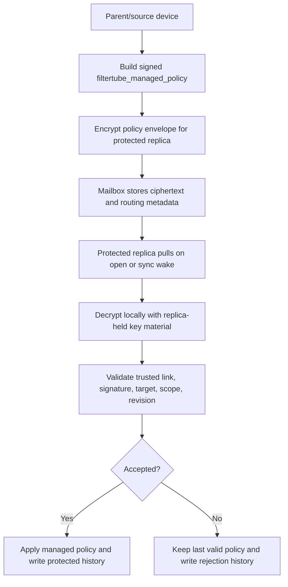

# Audit: Managed Policy Encrypted Mailbox Protocol

**Generated**: 2026-06-04  
**Status**: Protocol, proof fixture, local decrypted mailbox-item intake, and a
provider-gated dashboard/profile-open pull hook are present. Runtime server
mailbox pull is not implemented.
**Related plan**:
`docs/audit/FILTERTUBE_LOCAL_NETWORK_MANAGED_PARENT_CONTROLS_PLAN_2026-06-03.md`  
**Related inventory**:
`docs/audit/FILTERTUBE_RELEASE_PROFILE_NANAH_MANAGED_PARENT_AUTHORITY_INVENTORY_2026-06-03.md`

## Purpose

This protocol describes the optional later-delivery path for managed parent or
caregiver policies when the parent/source device and child/replica device are
not reachable at the same time.

The mailbox server is storage and relay only. It must never become policy
authority, and it must never receive plaintext rules, keywords, channel names,
video ids, viewing-space settings, time budgets, PIN values, or action-history
summaries.

The decrypted payload is still a normal `filtertube_managed_policy` envelope.
After local decryption, the protected replica runs the same managed-policy
validation and apply path used by live Nanah/P2P delivery:

- `validateManagedPolicyEnvelope(...)`
- trusted-link key and signature verification
- fixed target profile, source device, source profile, scope, revision, and
  policy-hash checks
- `validateManagedMailboxItem(...)` to bind mailbox metadata to the decrypted
  envelope
- `applyManagedMailboxItem(...)` only after accepted validation context

Mailbox delivery does not weaken local/P2P security. It only changes when the
child device can receive the ciphertext.

## End-To-End Shape



## Mailbox Item Shape

The server may store a row shaped like this. Fields are descriptive protocol
names, not a runtime implementation:

```json
{
  "schema": "filtertube_managed_mailbox_item",
  "version": 1,
  "mailboxItemId": "mbx_child-profile-1_keywords_7",
  "linkId": "link-parent-child-1",
  "targetProfileId": "child-profile-1",
  "sourceDeviceId": "parent-device-1",
  "sourceProfileId": "parent-profile-1",
  "scope": "keywords",
  "revision": 7,
  "policyHash": "sha256:policy-hash-7",
  "sourcePublicKeyId": "parent-key-3",
  "keyVersion": 3,
  "cipherSuite": "x25519-hkdf-chacha20poly1305",
  "keyAgreementId": "link-parent-child-1:key-3",
  "encryptedDek": "base64url(...)",
  "nonce": "base64url(...)",
  "ciphertext": "base64url(...)",
  "ciphertextHash": "sha256:ciphertext-hash",
  "createdAt": "2026-06-04T00:00:00.000Z",
  "expiresAt": "2026-06-11T00:00:00.000Z",
  "ackState": "pending"
}
```

Allowed `ackState` values:

```text
pending
delivered
rejected
expired
revoked
conflict
```

The server can route by `linkId`, `targetProfileId`, `revision`, and expiry. It
cannot inspect or alter the policy contents. Any plaintext rule-like field in
server state is a protocol violation.

## Required Delivery Decisions

| Case | Decision | Local result |
| --- | --- | --- |
| Newer revision, matching trusted link, valid decryption, valid signature | Accept | Apply policy and mark delivered. |
| Equal revision with same hash | Idempotent | Mark delivered without reapplying. |
| Equal revision with different hash | Reject conflict | Keep last valid policy and write conflict history. |
| Older revision | Reject stale | Keep last valid policy and write rejected history. |
| Link revoked before delivery | Reject revoked | Do not decrypt/apply; mark revoked. |
| Key revoked before delivery | Reject revoked | Do not apply; require new trusted key path. |
| Wrong target profile | Reject wrong target | Keep last valid policy. |
| Wrong source device/profile | Reject wrong source | Keep last valid policy. |
| Wrong link id | Reject wrong link | Keep last valid policy. |
| Scope not allowed by trusted link | Reject scope | Keep last valid policy. |
| Expired item | Expire | Do not apply. |
| Missing or undecryptable ciphertext | Reject corrupt | Keep last valid policy. |
| Duplicate delivery after accepted same hash | Idempotent | No second profile mutation. |
| Duplicate delivery with different hash | Reject conflict | Keep last valid policy. |

## Protected Offline Behavior

When the child/protected device is offline or the mailbox is unreachable, the
last valid accepted parent policy remains active. Offline state must not unlock
restricted editing controls, widen Main/Kids viewing-space access, reset time
budgets, or drop existing keyword/channel/video rules.

When the device opens the app/profile later, it may pull pending ciphertexts.
Every item is evaluated independently against current trust state before
decryption and before policy apply. Revoking a trusted link must cause queued
items from that link to fail closed.

## History And Privacy

Accepted, rejected, expired, revoked, idempotent, and conflict outcomes should
write protected local action-history rows. The row should include only redacted
summary data by default:

```text
actionType: remote_policy.mailbox.accept|reject|expire|revoke|conflict
trustedLinkId
sourceDeviceId
targetProfileId
scope
revision
policyHash
result
reason
receivedOrder
receivedAt
```

The row must not contain plaintext blocked keywords, channel names, video ids,
or viewing history. Protected users cannot clear rejected, revoked, conflict,
or failed-delivery evidence.

## Non-Negotiables

- The mailbox server cannot manage, weaken, or interpret policy.
- Server metadata is not enough to apply policy.
- Decryption happens only on the protected replica device.
- Decrypted envelopes must still pass managed-policy validation.
- Replay, stale revision, wrong target, wrong link, wrong source, wrong key,
  expired item, and revoked trust all fail closed.
- Child PIN or protected-user unlock never authorizes mailbox policy changes.
- Mailbox delivery is optional; direct local/P2P delivery remains valid when
  both devices are reachable.
- No-policy/no-work YouTube runtime performance remains a release gate.

## Current Runtime Boundary

Runtime decrypted mailbox intake is present in this slice. The current extension
can validate a local/decrypted `filtertube_managed_mailbox_item`, bind its
metadata to the decrypted `filtertube_managed_policy` envelope, verify the
trusted managed signature context, apply through `applyManagedPolicyEnvelope(...)`,
and write protected redacted action-history evidence.

The runtime still does not implement a server mailbox pull scheduler, mailbox
storage client, mailbox decryption client, or server ack writer. The mailbox
server cannot become policy authority. The first pull-on-open hook now exists
only as a provider-gated dashboard/profile-open bridge for local/decrypted
mailbox items.

Current runtime status:

```text
runtime mailbox item schema intake: present for local/decrypted items
runtime mailbox item metadata-to-envelope binding: present
runtime mailbox item signature gate reuse: present
runtime mailbox item managed-policy apply wrapper: present
runtime mailbox protected history rows: present
runtime provider-gated dashboard/profile-open pull hook: present
runtime mailbox server pull client: absent
runtime mailbox server ack writer: absent
runtime mailbox decryption client: absent
runtime behavior changed by this slice: yes, for local/decrypted mailbox item intake and provider-gated dashboard/profile-open pull status only
```
