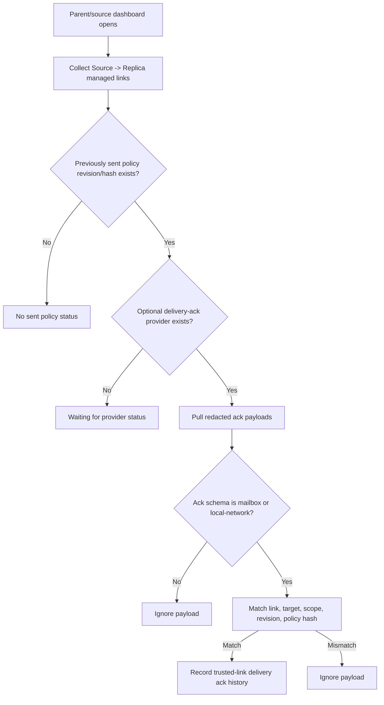

# Audit: Managed Source Delivery Ack Status

**Generated**: 2026-06-05
**Status**: Source-side mailbox/local-network delivery ack intake and dashboard
status are present through an optional local provider. The browser HTTPS mailbox
client can submit redacted mailbox acks when explicitly configured. LAN
discovery, LAN delivery, background polling, mailbox server authority, and
YouTube page hot-path work remain absent.
**Related provider hook**:
`docs/audit/FILTERTUBE_LOCAL_NETWORK_MANAGED_PROVIDER_HOOK_2026-06-05.md`
**Related mailbox protocol**:
`docs/audit/FILTERTUBE_MANAGED_POLICY_ENCRYPTED_MAILBOX_PROTOCOL_2026-06-04.md`
**Related action-history model**:
`docs/audit/FILTERTUBE_MANAGED_POLICY_ACTION_HISTORY_MODEL_2026-06-03.md`

## Purpose

Issue 60 asks for feedback, logs, or history so a parent/caregiver can see
whether remote management was accepted or rejected. Earlier slices wrote
protected child-side mailbox and local-network ack rows after the protected
device handed results back to a provider. This slice adds the matching
source-side status intake: a parent/source dashboard can ask an optional local
provider for redacted mailbox or local-network ack payloads and record them on
the matching trusted link.

The provider is transport only. A delivery ack is recorded only when it matches
a saved Source -> Replica managed link and the trusted link already has a sent
policy row for the same scope, revision, and policy hash.

## Runtime Shape



## Optional Provider Shape

```js
window.FilterTubeManagedPolicyDeliveryAcks = {
  async pullManagedDeliveryAcks(request) {
    return { ok: true, acks: [/* mailbox or local-network ack payloads */] };
  }
};
```

Providers may also expose `pullRemoteDeliveryAcks(request)` or
`getManagedDeliveryAcks(request)` with the same result shape. Returned payloads
must use one of:

```text
filtertube_nanah_managed_open_sync_ack
filtertube_managed_local_network_candidate_ack
```

The request is redacted metadata only:

```text
schema: filtertube_managed_source_delivery_ack_request
linkId, sourceDeviceId, sourceProfileId, targetProfileId
allowedScopes
sentPolicies[].scope, revision, policyHash, sentAt, lastAck*
```

It does not contain plaintext keywords, channel names, video titles, PINs,
private keys, child viewing history, or decrypted mailbox payloads.

## Runtime Hooks Added

```text
js/nanah_managed_live_policy.js
  recordRemoteDeliveryAckPayload(...)
  filtertube_managed_remote_delivery_ack_history
  remote_policy.mailbox.ack source-side trusted-link rows
  remote_policy.local_network.ack source-side trusted-link rows

js/tab-view.js
  NANAH_MANAGED_SOURCE_ACK_SYNC_STATE_KEY = ftNanahManagedSourceAckSyncState
  loadNanahManagedSourceAckSyncState()
  persistNanahManagedSourceAckSyncState(...)
  getNanahManagedSourceAckProvider()
  buildNanahManagedSourceAckRequest(...)
  pullNanahManagedSourceDeliveryAcks(...)
  runNanahManagedSourceAckSync(...)
  Remote delivery trusted-link status row
```

## Safety Boundary

```text
runtime source-side mailbox/local-network ack record helper: present
runtime source-side provider-gated ack pull: present
runtime source-side trusted-link status persistence: present
runtime parent-visible Remote delivery row: present
runtime browser HTTPS mailbox ack client: present behind explicit config
runtime provider authority: absent
runtime unmatched ack payload apply: absent
runtime plaintext rule storage in ack rows: absent
runtime mailbox server authority: absent
runtime built-in LAN peer discovery: absent
runtime built-in LAN delivery: absent
runtime YouTube page hot-path work from this slice: absent
```

## Verification

Focused tests:

```bash
node --test tests/runtime/managed-nanah-live-signed-send-current-behavior.test.mjs
node --test tests/runtime/managed-local-network-provider-current-behavior.test.mjs
```

Changed-lane gate:

```bash
npm run lanes:changed
```
