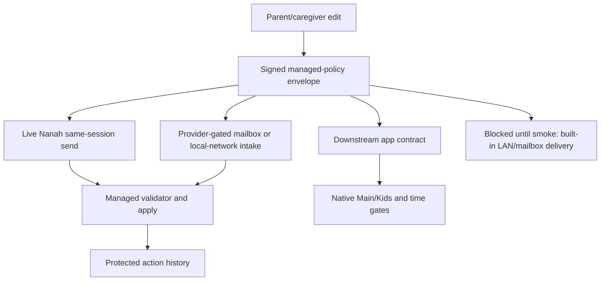

# Gate: Managed Transport And App Parity

**Generated**: 2026-06-05
**Status**: Extension policy authority and provider-gated intake hooks are
present. Complete remote management remains blocked until one transport has
installed two-device smoke and app parity proof.
**Runtime behavior changed**: no.
**Goal slice**: Managed parent/caregiver controls, local P2P/local-network
sync, and downstream app parity.
**Related proofs**:
`docs/audit/FILTERTUBE_NANAH_MANAGED_POLICY_REMOTE_DELIVERY_RELEASE_READINESS_GATE_2026-06-05.md`,
`docs/audit/FILTERTUBE_LOCAL_NETWORK_MANAGED_PROVIDER_HOOK_2026-06-05.md`,
`docs/audit/FILTERTUBE_NANAH_MANAGED_PULL_ON_OPEN_2026-06-04.md`,
`docs/audit/FILTERTUBE_MANAGED_APP_POLICY_CONTRACT_PARITY_2026-06-04.md`,
and
`docs/audit/FILTERTUBE_LOCAL_NETWORK_DISCOVERY_AUTHORITY_BOUNDARY_2026-06-03.md`.
**Manual app parity smoke handoff**:
`docs/audit/artifacts/managed-app-parity-smoke/template.json` and
`docs/audit/artifacts/managed-app-parity-smoke/verify-managed-app-parity-smoke-artifact.mjs`.

## Purpose

This gate separates policy authority from delivery capability and app parity.
The extension can validate and apply signed managed policies, but parents and
caregivers should not see a complete remote-management claim until the chosen
transport and downstream app shell both prove the same behavior.

## Current Boundary

```text
parent/caregiver edit
  -> signed managed-policy envelope
  -> live Nanah or provider-gated mailbox/local-network intake
  -> extension managed validation and apply
  -> protected redacted action history
  -> app contract sync for downstream native enforcement
```

Mermaid:



## Transport/App Parity Matrix

| Area | Extension status | App/native requirement | Release claim status |
| --- | --- | --- | --- |
| Live Nanah | Signed same-session sends exist for eligible fixed child targets. | App may reuse helper contract but must own native session and UI authority. | Partial. |
| Pull-on-open mailbox | Provider-gated hook accepts already-decrypted mailbox items and redacted ack handoff. | App or trusted provider must own mailbox pull and decryption before handing items to the validator. | Partial. |
| Local network | Provider-gated candidate intake exists; built-in LAN discovery and delivery are absent. | Native app/provider may own LAN discovery, but discovery must never grant authority. | Partial. |
| Policy apply | Saved link, target profile, scope, revision, policy hash, key id, and signature are required. | Apps must reject stale, revoked, wrong-target, or unsigned policies before native enforcement. | Present. |
| Main/Kids access | Extension route gate exists for active child profiles. | App shell must gate Main and Kids before opening web/native content. | Android partial, iOS pending. |
| Time limits | Extension active-tab budget and timeout overlay exist. | App shell must enforce startup, resume, heartbeat, pause, and reduced-budget behavior. | Android partial, iOS pending. |
| Managed rules | Extension can send/apply signed keyword, channel, and video policy scopes through validated managed paths. | Apps must preserve those rule scopes and apply them through the same local rule semantics as extension-owned keyword/channel/video controls. | Pending installed app smoke. |
| Action history | Protected redacted local, remote, mailbox, ack, and failure rows exist. | Apps may display history only to parent/account authority and must not expose plaintext values. | Partial. |

## Required Proof Before Claiming Complete Remote Management

```text
transport selected: required
permission boundary proof: required
identity and signature binding: required
replay/revocation fixtures: required
parent-facing accepted/rejected ack history: required
no-policy/no-provider no-work proof: required
installed two-device smoke: required
Android installed smoke: required
iOS parity proof: required
public release wording review: required
```

A valid managed app parity artifact proves one installed app platform smoke,
not complete cross-platform remote-management readiness. Android and iOS must
each provide platform-specific adapter proof, settings-lock proof, Main/Kids
route-gate proof, time-limit proof, managed keyword/channel/video rule proof,
protected history proof, and no-policy no-work proof before public release copy
can claim cross-platform managed parent/caregiver control.

## Allowed Wording

- Managed local child/protected-profile edits are supported.
- Signed managed-policy validation is revision and integrity gated.
- Live Nanah sends are available only for eligible connected sessions.
- Provider-gated pull-on-open and local-network intake hooks exist.
- Protected devices keep the last accepted policy when delivery is unavailable.
- Local-network discovery is not authority.

## Blocked Wording

- Complete remote local-network management.
- Guaranteed later delivery after the parent device goes offline.
- Always-on parent-to-child sync.
- Server mailbox delivery.
- Automatic LAN peer discovery.
- Cross-platform remote management without installed smoke on extension and
  apps.

## Verification

Focused proof:

```bash
node --test tests/runtime/managed-remote-transport-app-parity-gate-current-behavior.test.mjs
node --test tests/runtime/managed-app-parity-smoke-artifact-verifier-current-behavior.test.mjs
```

Settings lane:

```bash
npm run test:settings
```
