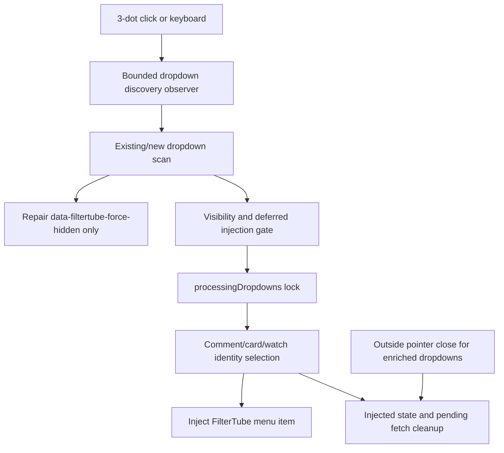
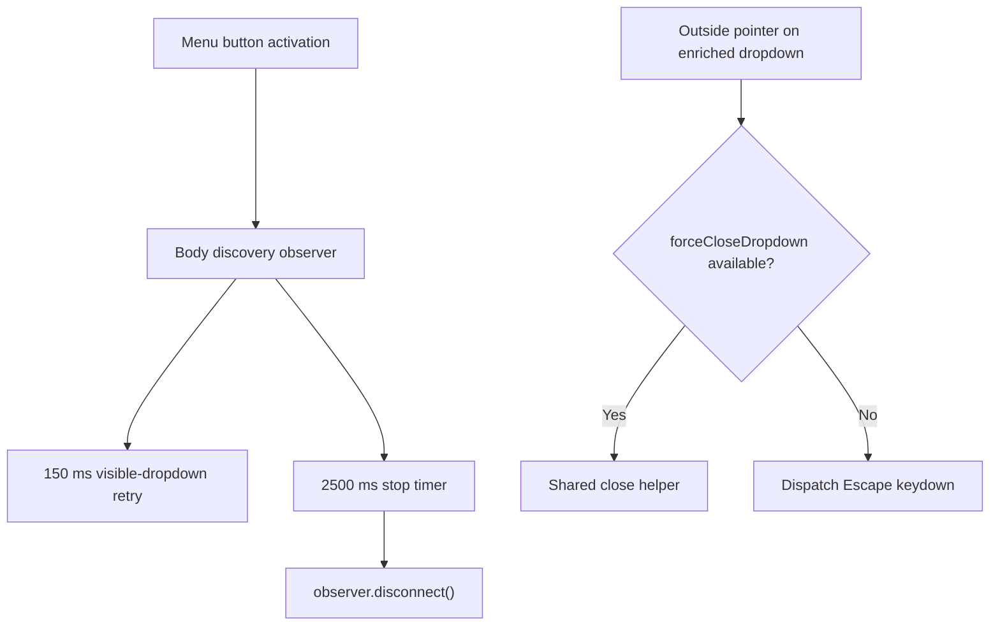
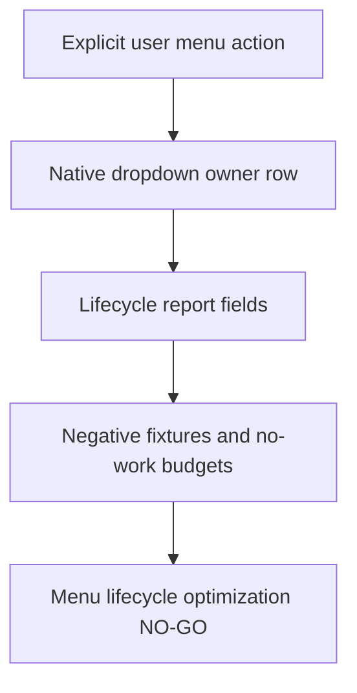

# FilterTube Menu Observer Kids Passive Lifecycle Boundary - Current Behavior

Status: current-behavior proof only.

This is not an implementation patch. It is not approval to change runtime filtering, JSON mutation, DOM mutation, storage, message, lifecycle, network, prompt, or settings semantics. This codebase inspection is finding optimization locations and first-class JSON filter blockers before product changes.

## Boundary

This slice pins the normal 3-dot menu observer and YouTube Kids passive native-block listener in `js/content/block_channel.js`: menu/Kids globals, injected dropdown state, pending dropdown fetch cancellation state, non-Kids click capture, dropdown visibility observers, body MutationObserver, Kids click/toast observers, Kids context capture, Kids native block dedupe, background message shape, dropdown appearance locking, dropdown identity routing, stale menu cleanup, and the startup timer that launches both menu and quick-block observers.

menu observer Kids passive lifecycle source files: 1

menu observer Kids passive lifecycle source/effect blocks: 10

## Source Fingerprint

| File | Lines | Bytes | SHA-256 |
| --- | ---: | ---: | --- |
| `js/content/block_channel.js` | 3175 | 127396 | `1b6fffa249a746c01686df0d6a05dc4b770a6f0c5ded08b78a7043c11e9cdd83` |

## Pinned Blocks

| Block | Start Line | Lines | Bytes | SHA-256 |
| --- | ---: | ---: | ---: | --- |
| `menuInjectionStateGlobals` | 1 | 52 | 1568 | `30b0bc360d1dc665932dfe0f023441c1a9a54e0aafb3c2964fb4f0070b694abc` |
| `dropdownPendingStateGlobals` | 56 | 25 | 762 | `02ed8c46d56a872e008bdf31d59b8951ca743e50f5640cd7c39610c6402ec7ed` |
| `normalMenuObserverSetup` | 2304 | 287 | 10680 | `a01a8b8f7e6a0b0e66f81b07abbae1072d18e597f5f0951591be2a3f8a8b46df` |
| `kidsPassiveBlockListener` | 2595 | 46 | 2558 | `884e53829c9c9d0cd6f6c9c320668fae939fc52fee2078499d86e7ae535943c8` |
| `kidsMenuContextCapture` | 2641 | 123 | 5460 | `0af71c6e8f0c358f41dfa7832ebe65d7d1e1da2e12954227aef87e3c3626d109` |
| `kidsNativeBlockHandler` | 2764 | 97 | 3790 | `7fe5918cc38d98701e8b70f45dde0ae729d862f49f092fe94f4615c49db1bcc7` |
| `tryVisibleDropdown` | 2864 | 27 | 1027 | `bd2e1fc88b50f431c6528a9317bd4c1aa8aa4bfc888da34cd03736fc60f540b2` |
| `dropdownAppearedLock` | 2894 | 16 | 526 | `71b0ffd34887d9e0e05d86f2b182bc7078934241e02814295d5f4940f40ce209` |
| `dropdownAppearedInternal` | 2913 | 258 | 12301 | `5464ca8f80e0e127fbbc7efb74e7b955d1ee44df5bf0a06be666f3313681bcd2` |
| `menuObserverStartupTimer` | 3171 | 5 | 127 | `eceb4cf282168121db45a952ea7ca860c1a577ab45a9592a8b2166f1e096befd` |

## Selected Token Counts

These counts are over the ten pinned blocks, not the whole product.

| Token | Count |
| --- | ---: |
| `lastClickedMenuButton` | 9 |
| `isKidsSite` | 2 |
| `lastKidsMenuContext` | 6 |
| `KIDS_MENU_CONTEXT_TTL_MS` | 2 |
| `lastKidsBlockActionTs` | 3 |
| `lastKidsBlockClickTs` | 3 |
| `handledKidsBlockActions` | 4 |
| `injectedDropdowns` | 13 |
| `isWhitelistModeActive` | 2 |
| `cleanupInjectedMenuItems` | 2 |
| `processingDropdowns` | 5 |
| `pendingDropdownFetches` | 2 |
| `dropdownVisibilityObservers` | 3 |
| `FT_DROPDOWN_SELECTORS` | 5 |
| `document.addEventListener` | 4 |
| `setTimeout` | 9 |
| `MutationObserver` | 5 |
| `observer.observe` | 2 |
| `obs.observe` | 1 |
| `disconnect` | 3 |
| `removeEventListener` | 0 |
| `clearTimeout` | 2 |
| `clearInterval` | 0 |
| `tryInjectIntoVisibleDropdown` | 2 |
| `ensureDropdownVisibilityObserver` | 2 |
| `handleDropdownAppeared` | 7 |
| `handleDropdownAppearedInternal` | 2 |
| `setupKidsPassiveBlockListener` | 2 |
| `captureKidsMenuContext` | 3 |
| `handleKidsNativeBlock` | 3 |
| `FilterTube_KidsBlockChannel` | 1 |
| `data-filtertube-video-id` | 3 |
| `data-filtertube-unique-id` | 2 |
| `filtertube-block-channel-item` | 4 |
| `data-filtertube-quick` | 0 |
| `aria-hidden` | 9 |
| `style.display = 'none'` | 0 |
| `querySelectorAll` | 8 |
| `querySelector` | 18 |
| `closest` | 11 |
| `startsWith('/watch')` | 3 |
| `startsWith('/shorts/')` | 1 |
| `startsWith('/channel/')` | 1 |
| `isWhitelistModeActive()` | 1 |
| `pendingDropdownFetches.get` | 1 |
| `fetchData.cancelled = true` | 1 |
| `injectedDropdowns.set` | 3 |
| `injectedDropdowns.delete` | 5 |
| `processingDropdowns.add` | 1 |
| `processingDropdowns.delete` | 1 |
| `lastKidsBlockActionTs < 1000` | 1 |
| `lastKidsBlockClickTs < 2000` | 1 |
| `handledKidsBlockActions.add` | 1 |
| `handledKidsBlockActions.delete` | 1 |
| `Date.now()` | 5 |
| `chrome.runtime?.sendMessage` | 1 |
| `injectFilterTubeMenuItem` | 2 |
| `setupMenuObserver();` | 1 |
| `setupQuickBlockObserver();` | 1 |

## Runtime Fixtures

The paired verifier is `tests/runtime/menu-observer-kids-passive-lifecycle-boundary-current-behavior.test.mjs`.

It pins current harness behavior:

- Non-Kids setup installs capture-phase document click, outside pointer, and keydown listeners; after a menu-button activation it lazily arms visible-dropdown retry, one bounded body `MutationObserver`, and per-dropdown attribute observers for `style`, `aria-hidden`, and `hidden`. The outside pointer fallback only closes dropdowns that already contain a `.filtertube-block-channel-item`, so it does not become a general YouTube menu owner.
- Visible dropdown retry calls `handleDropdownAppeared()` for the first visible dropdown and stops after that dropdown.
- YouTube Kids setup installs a capture-phase document click listener and a body MutationObserver; native menu clicks can call `handleKidsNativeBlock()` immediately, while matching toast additions are suppressed for 2000 ms after a handled click.
- Kids native block handling uses a 1000 ms action throttle, a 15000 ms menu-context TTL, a 10000 ms dedupe key timer, and sends `FilterTube_KidsBlockChannel` with channel identity hints when available.
- Dropdown appearance uses a synchronous WeakSet lock around `handleDropdownAppearedInternal()` and releases the lock in `finally`.
- Whitelist mode in `handleDropdownAppearedInternal()` cleans injected menu items and returns before menu injection.
- Source-derived dropdown internals still include parent-removal dropdown close, pending dropdown fetch cancellation on `aria-hidden`, stale `filtertube-block-channel-item` cleanup, current watch/shorts id stamping, and direct `injectFilterTubeMenuItem()` calls. Repair of hidden dropdown attributes is now limited to elements explicitly marked `data-filtertube-force-hidden="true"`, so normal YouTube outside-click menu close is not undone by the FilterTube observer.
- Bounded menu discovery now has executable proof that the body discovery observer disconnects at the 2500 ms stop timer, while the outside-pointer close path falls back to dispatching Escape when `forceCloseDropdown` is unavailable.
- The bounded body discovery observer disconnects at 2500 ms in the executable fixture.
- The bottom startup timer still delays 1000 ms before calling both `setupMenuObserver();` and `setupQuickBlockObserver();`.

## Native Dropdown Open-Close Owner Flow Addendum - 2026-05-27

This addendum pins the observer-side native YouTube menu lifecycle that controls
when FilterTube attaches injected actions and when it backs away. It is
audit-only. It does not approve menu rewrites, close-helper rewrites, quick
block behavior changes, whitelist behavior changes, or DOM fallback changes.

```text
3-dot menu button click/keyboard
        |
        v
arm bounded dropdown discovery
        |
        v
scan existing and newly-added dropdowns
        |
        v
repair only FilterTube-forced hidden state
        |
        v
visible dropdown scheduling gate
        |
        v
synchronous dropdown processing lock
        |
        v
identify comment/card/watch context
        |
        v
inject FilterTube menu action or clean stale item
        |
        v
outside pointer / card removal can close only FilterTube-enriched dropdowns
```



| Native dropdown owner row | Source pins | Current owner/effect | Release risk controlled |
| --- | --- | --- | --- |
| `native_menu_button_capture_owner` | `js/content/block_channel.js:2356-2372` | Capture-phase click handling records the last 3-dot button, arms bounded discovery, and schedules visible-dropdown retry. | Keeps injection tied to explicit menu activation instead of broad passive scans. |
| `native_dropdown_forced_hidden_repair_owner` | `js/content/block_channel.js:2325-2353` | Existing dropdown scan repairs only nodes marked `data-filtertube-force-hidden="true"` and leaves normal YouTube hidden state alone. | Prevents FilterTube from reopening or poisoning YouTube's reusable native menu nodes. |
| `native_dropdown_visibility_observer_owner` | `js/content/block_channel.js:2374-2402` | Per-dropdown attribute observer watches `style`, `aria-hidden`, and `hidden`, schedules injection when visible, and clears injected state when hidden. | Avoids stale injected state when YouTube reuses dropdown containers. |
| `native_dropdown_deferred_injection_owner` | `js/content/block_channel.js:2420-2445` | Deferred injection dedupes scheduled/processing dropdowns and waits for animation frame plus timeout before `handleDropdownAppeared()`. | Reduces duplicate menu work during SPA/menu animation churn. |
| `native_dropdown_existing_scan_owner` | `js/content/block_channel.js:2459-2467` | Discovery scans current dropdowns, repairs forced-hidden state, and hands visible candidates to the visibility gate. | Covers already-mounted dropdowns without turning every body mutation into injection work. |
| `native_dropdown_outside_pointer_owner` | `js/content/block_channel.js:2469-2513` | Outside pointer close ignores menu-button and inside-dropdown events, requires an injected FilterTube item, and closes only visible enriched dropdowns. | Preserves normal YouTube menus while letting FilterTube-enriched menus release instead of staying stuck open. |
| `native_dropdown_bounded_discovery_owner` | `js/content/block_channel.js:2515-2566` | Body discovery observer starts only after menu activation and stops after a 2500 ms timer. | Keeps dropdown discovery from becoming a page-lifetime broad mutation observer. |
| `native_menu_keyboard_discovery_owner` | `js/content/block_channel.js:2568-2576` | Enter/Space on a menu button arms the same bounded discovery path as pointer activation. | Keeps keyboard menu access aligned with pointer menu injection. |
| `native_dropdown_injection_lock_owner` | `js/content/block_channel.js:2864-2908` | Visible-dropdown retry handles only the first visible dropdown and `processingDropdowns` serializes each dropdown. | Prevents duplicate injection and race-prone menu state during repeated menu openings. |
| `native_dropdown_identity_injection_owner` | `js/content/block_channel.js:2913-3169` | Internal appearance handling cleans whitelist mode, prefers comment context, maps card/watch identity, tracks stale injected state, observes card removal, cancels pending fetches on close, injects the menu item, and removes stale items when identity is missing. | Controls false-hide/leak risk from wrong-card menus and stale blocked labels. |

Current native dropdown open-close status:

```text
native dropdown open-close owner rows: 10
ASCII native dropdown open-close flow diagram: present
Mermaid native dropdown open-close flow diagram: present
native dropdown open-close source proof: PARTIAL
menu lifecycle optimization approval from owner flow: NO-GO
runtime behavior changed by this addendum: no
```

## Bounded Discovery Executable Continuation - 2026-05-28

This continuation keeps runtime behavior unchanged and strengthens the executable
proof behind the native menu lifecycle. The same verifier now executes the
bounded discovery shutdown timer and the no-helper outside-pointer close branch.

```text
menu button activation
        |
        v
arm body discovery observer
        |
        +--> 150 ms visible-dropdown retry
        |
        +--> 2500 ms stop timer
                 |
                 v
          observer.disconnect()

outside pointer on enriched dropdown
        |
        +-- forceCloseDropdown exists --> shared close helper
        |
        +-- shared closer absent -> Escape fallback
```



```text
native dropdown discovery stop executable rows: 1
native dropdown escape fallback executable rows: 1
native dropdown executable continuation behavior changed: no
native dropdown executable continuation approval: NO-GO
```

## Menu Lifecycle Report Contract Continuation - 2026-05-29

This continuation turns the open-close owner flow into the minimum report a
future menu lifecycle optimization must provide. It is audit-only. It does not
approve changing menu injection, outside-click handling, comment menu handling,
Kids passive blocking, quick-block startup, observer teardown, timer cleanup, or
YouTube reusable dropdown state.

```text
explicit user menu action
        |
        v
native dropdown owner row
        |
        v
report route, surface, list mode, dropdown node, injected state, close reason
        |
        v
prove pending fetch, stale item, reusable-node, comment-menu, outside-click,
Kids dedupe, startup fanout, and no-work budgets
        |
        v
menu lifecycle optimization remains NO-GO until every report row is green
```



| Report contract row | Source owner rows | Required future proof before behavior changes |
| --- | --- | --- |
| `FT-MLR-00-scope` | `native_menu_button_capture_owner`; `native_menu_keyboard_discovery_owner` | Route, surface, profile, list mode, user action type, menu button selector, explicit activation proof, and keyboard/pointer parity. |
| `FT-MLR-01-forced-hidden-repair` | `native_dropdown_forced_hidden_repair_owner` | Dropdown node identity, hidden-state writer, `data-filtertube-force-hidden` provenance, reusable-node proof, and negative normal-YouTube-menu close proof. |
| `FT-MLR-02-visibility-observer` | `native_dropdown_visibility_observer_owner` | Per-dropdown observer target, attribute list, visibility transition, disconnect reason, injected-state clear, and no stale observer proof. |
| `FT-MLR-03-deferred-injection-lock` | `native_dropdown_deferred_injection_owner`; `native_dropdown_injection_lock_owner` | Scheduled delay, requestAnimationFrame/timeout ordering, processing lock, duplicate-open suppression, and no duplicate menu item proof. |
| `FT-MLR-04-bounded-discovery` | `native_dropdown_existing_scan_owner`; `native_dropdown_bounded_discovery_owner` | Body observer trigger, existing dropdown scan count, 2500 ms shutdown, retry timing, disconnect proof, and no page-lifetime broad observer regression. |
| `FT-MLR-05-outside-pointer-close` | `native_dropdown_outside_pointer_owner` | Close reason, event target/path, enriched-dropdown requirement, fallback Escape branch, comment-menu outside-click negative proof, and normal YouTube menu non-interference proof. |
| `FT-MLR-06-identity-injection` | `native_dropdown_identity_injection_owner` | Comment/card/watch identity source, video id, channel id/name, collaborator state, whitelist-mode clean return, injection outcome, false-hide/leak proof, and stale-card negative proof. |
| `FT-MLR-07-pending-fetch-stale-state` | `native_dropdown_identity_injection_owner` | Pending fetch id, cancellation on close, stale item removal, card-removal observer disconnect, injected WeakMap clear, and no dangling async write proof. |
| `FT-MLR-08-kids-context-dedupe` | `kidsPassiveBlockListener`; `kidsMenuContextCapture`; `kidsNativeBlockHandler` | Kids route proof, context TTL, click/toast source, 1000 ms action throttle, 10000 ms dedupe timer, background message identity, and duplicate block negative proof. |
| `FT-MLR-09-startup-fanout` | `menuObserverStartupTimer` | 1000 ms startup timer, menu observer startup, quick-block startup, startup order, disabled/no-rule policy, and page-lifetime listener budget. |
| `FT-MLR-10-cross-feature-boundary` | normal menu, Kids passive menu, quick-block, and DOM fallback lifecycle rows | Settings mode, whitelist/blocklist state, quick-block affordance state, fallback menu state, native overlay state, and cross-feature side-effect budget. |
| `FT-MLR-11-artifact-gate` | this report plus runtime fixture rows | Metric artifact path, positive fixture, negative fixture, reusable-node fixture, comment-menu fixture, outside-click fixture, no-work counter, rollback report, and release claim boundary. |

Required report fields before any menu lifecycle behavior change:

```text
route
surface
profile
listMode
menuOwner
userAction
menuButtonSelector
dropdownNode
visibilityState
injectedState
closeReason
pendingFetchEffect
staleItemEffect
kidsContext
dedupeTimer
noWorkBudget
negativeOutsideClickProof
negativeCommentMenuProof
reusableNodeProof
metricArtifact
```

Current menu lifecycle report contract status:

```text
menu lifecycle report contract rows: 12
required menu lifecycle report fields: 20
implementation-ready menu lifecycle report rows: 0
runtime menu lifecycle report approvals: 0
menu lifecycle optimization approval from report contract: NO-GO
runtime behavior changed by this continuation: no
```

## Risk Boundary

This runtime owner is page-lifetime menu work. It has capture listeners, body observers, per-dropdown attribute observers, per-card removal observers, dropdown-close observers, startup timers, pending fetch cancellation state, stale injected menu state, and Kids passive toast/click dedupe. It has local `disconnect()` calls for some dropdown/card observers but no owner-level `removeEventListener`, `clearTimeout`, or `clearInterval` path.

The normal menu and Kids passive path can perform cross-feature side effects: it can read route state, infer card identity from DOM, stamp `data-filtertube-video-id`, remove stale FilterTube menu items, inject menu actions, cancel pending dropdown fetches, close dropdowns when cards disappear, and send Kids block messages to background. These interactions are relevant to reliability, false-hide/leak, performance, no-work, whitelist-mode quietness, and code-burden rows.

## Missing Future Proof

No product runtime symbol exists yet for:

- `menuDropdownLifecycleContract`
- `menuDropdownLifecycleReport`
- `menuDropdownObserverOwnerReport`
- `menuDropdownPendingFetchCancellationPolicy`
- `menuDropdownInjectionStateReport`
- `kidsPassiveBlockLifecycleContract`
- `kidsNativeBlockDedupBudget`
- `kidsBlockMessageAuthority`
- `menuObserverTeardownRegistry`
- `menuDropdownLifecycleMetricArtifact`
- `nativeMenuOpenCloseLifecycleContract`
- `nativeMenuDropdownCloseDecisionReport`
- `nativeMenuOutsidePointerPolicy`
- `nativeMenuReusableNodeStatePolicy`
- `menuLifecycleReportContract`
- `menuLifecycleReportApproval`
- `menuLifecycleNoWorkBudgetReport`
- `menuLifecycleNegativeFixturePacket`
- `menuLifecycleReusableNodeProof`
- `menuLifecycleCommentMenuProof`
- `menuLifecycleMetricArtifact`

This slice does not close the audit rows for normal menu lifecycle ownership, Kids passive listener ownership, dropdown observer budgets, pending-fetch cancellation policy, injected menu state authority, stale item cleanup policy, Kids native block message authority, route/profile/list-mode negative fixtures, fixture provenance, metrics, or first-class menu observer lifecycle authority gates.

## Method Semantic Proof Gap Boundary

`docs/audit/FILTERTUBE_METHOD_SEMANTIC_PROOF_GAP_INDEX_CURRENT_BEHAVIOR_2026-05-25.md`
is a required source input before this menu/dialog/injector/quick-block
surface can support runtime optimization. Current proof pins:

```text
method semantic proof gap files covered: 69
method semantic proof gap lexical callables covered: 5681
files with complete per-callable semantic proof: 0
lexical callables requiring semantic proof before behavior changes: 5681
affected callable semantic proof: NO-GO
runtime behavior changed: no
```

These counts are audit-only blockers. They do not approve runtime
optimization, JSON-first behavior, menu action behavior, dialog lifecycle
behavior, injector behavior, quick-block behavior, whitelist behavior, metric
collectors, artifact creation, native sync, release package changes, or public
claims.
