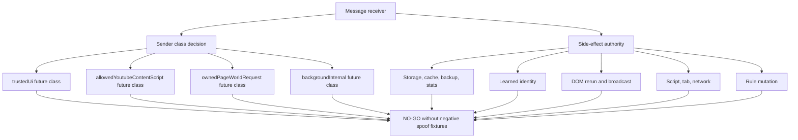

# FilterTube Message Side-Effect Register - 2026-05-18

Status: current-behavior audit artifact. This is not an implementation patch.

The message sender-class matrix lists receivers. This register lists the
side effects those receivers can trigger today. The goal is to prevent future
fixes from hardening one message while leaving a sibling message with the same
storage, network, script, tab, cache, DOM, stats, backup, or learned-identity
authority.

## Relationship To Raw Captures

The ignored root HTML/JSON/TXT capture files are evidence inputs only. They can
explain why a renderer, selector, or JSON path matters, but they are not message
senders, product source, trusted runtime inputs, or release files. Message-side
effect proof must come from tracked source plus minimal committed fixtures.

## Side-Effect Classes

| Side-effect class | Meaning | Current examples |
| --- | --- | --- |
| `tabOpen` | Opens a browser tab or window. | `FilterTube_OpenWhatsNew` opens `request.url || WHATS_NEW_PAGE_URL`. |
| `scriptInjection` | Executes extension JS into a tab/frame. | `injectScripts` maps caller names to `js/*.js`; `FilterTube_EnsureSubscriptionsImportBridge` injects fixed bridge files into caller `tabId`. |
| `networkFetch` | Starts extension-owned or credentialed network work. | `fetchChannelDetails` calls `fetchChannelInfo()`, which fetches YouTube channel HTML with credentials. |
| `storageWrite` | Writes browser local storage. | map updates, stats, list mutations, backup scheduling state, custom URL map writes. |
| `compiledCacheBroadcast` | Updates compiled runtime cache and pushes settings to tabs. | `FilterTube_ApplySettings` writes `compiledSettingsCache[targetProfile]` and broadcasts caller settings. |
| `domRerun` | Forces or schedules DOM fallback work. | `FilterTube_Refresh`, `FilterTube_UpdateVideoChannelMap`, `FilterTube_UpdateVideoMetaMap`, collaborator application paths. |
| `learnedIdentity` | Persists or applies channel/video/collaborator identity that can affect future filter decisions. | `updateChannelMap`, `updateVideoChannelMap`, `updateVideoMetaMap`, `FilterTube_UpdateCustomUrlMap`, collaborator messages. |
| `statsMutation` | Changes visible dashboard/time-saved metrics. | `recordTimeSaved` adds caller-provided seconds to legacy `stats.savedSeconds`. |
| `backupSchedule` | Triggers automatic backup work. | `FilterTube_ScheduleAutoBackup`, channel add paths, list mode changes, batch import. |
| `ruleMutation` | Changes blocklist, whitelist, Kids list, or per-channel Filter All state. | `FilterTube_KidsBlockChannel`, `addChannelPersistent`, `addFilteredChannel`, `toggleChannelFilterAll`. |

## Background Message Side Effects

| Message/action | Side-effect classes | Current gate | Current source proof | Required future gate |
| --- | --- | --- | --- | --- |
| `FilterTube_OpenWhatsNew` | `tabOpen` | Any runtime sender with message access. | `js/background.js` opens `request?.url || WHATS_NEW_PAGE_URL`. | `trustedUi` plus allowlisted release URL. |
| `injectScripts` | `scriptInjection` | Sender tab/frame shape and caller script names. | `js/background.js` maps caller names into `js/${name}.js` and executes in `world: 'MAIN'`. | `backgroundInternal` or fixed allowlisted caller flow with approved files and allowed route. |
| `FilterTube_EnsureSubscriptionsImportBridge` | `scriptInjection` | Caller numeric `tabId`. | `js/background.js` injects fixed bridge files into `request.tabId`. | `trustedUi` plus active subscription-import request and target URL proof. |
| `FilterTube_ApplySettings` | `compiledCacheBroadcast`, `domRerun` | Caller-provided `settings` object as an invalidation signal. | `js/background.js` clears `compiledSettingsCache[targetProfile]`, recompiles from storage, and broadcasts background-compiled `FilterTube_ApplySettings`. | Background-owned compiled revision, sender guard, and revision report; caller may request refresh but not become runtime truth. |
| `updateChannelMap` | `storageWrite`, `learnedIdentity` | Caller-provided mappings payload. | `js/background.js` calls `enqueueChannelMapMappings(request.mappings)`. | Source/provenance schema, cap, valid UC/handle shape, and allowed sender class. |
| `updateVideoChannelMap` | `storageWrite`, `learnedIdentity`, `compiledCacheBroadcast` | Caller-provided video/channel IDs. | `js/background.js` calls `enqueueVideoChannelMapUpdate()`; pending map updates merge into compiled settings before flush. | Valid video ID, valid UC ID, source renderer/card provenance, and route/surface reason. |
| `updateVideoMetaMap` | `storageWrite`, `learnedIdentity`, `compiledCacheBroadcast` | Caller-provided metadata. | `js/background.js` builds entries and calls `enqueueVideoMetaMapUpdate()`. | Metadata filters active or explicit harvest reason, schema validation, cap, and source provenance. |
| `recordTimeSaved` | `storageWrite`, `statsMutation` | Caller-provided seconds. | `js/background.js` adds `(request.seconds || 0)` to `stats.savedSeconds`. | Structured hide decision, trusted sender, finite/range clamp, and surface scope. |
| `fetchChannelDetails` | `networkFetch` | Caller-provided channel ID/handle. | `js/background.js` calls `fetchChannelInfo(request.channelIdOrHandle)`. | Explicit user action or active resolver need, sender class, input validation, and fetch budget. |
| `FilterTube_ScheduleAutoBackup` | `backupSchedule` | Caller trigger/delay/options. | `js/background.js` schedules background backup from message payload. | Trusted UI or background-internal actor, delay clamp, dedupe key, and mutation revision. |
| `FilterTube_KidsBlockChannel` | `ruleMutation`, `storageWrite`, `backupSchedule`, `domRerun` | Any runtime sender with action shape. | `js/background.js` calls `handleAddFilteredChannel()` with the Kids profile target and currently relies on the helper's default list behavior. | Same lock/sender/profile authority as Kids whitelist, or explicit allowed Kids content action. |
| `addChannelPersistent` | `ruleMutation`, `storageWrite`, `networkFetch`, `backupSchedule` | Any runtime sender with action shape. | `js/background.js` normalizes input, may fetch channel info, writes Main blocklist/profile state. | `trustedUi` or allowed YouTube content action with list target, route, and lock authority. |
| `addFilteredChannel` | `ruleMutation`, `storageWrite`, `backupSchedule`, `learnedIdentity` | Secondary `message.type` listener. | `js/background.js` now normalizes and forwards `message.listType` to `handleAddFilteredChannel()`. | Explicit sender class, profile/list target authority, lock state, and menu-action proof. |
| `toggleChannelFilterAll` | `ruleMutation`, `storageWrite`, `backupSchedule` | Secondary `message.type` listener. | `js/background.js` calls `handleToggleChannelFilterAll()`. | Explicit sender class, channel identity proof, row target, and lock state. |

## Page-World Message Side Effects

| Page message | Side-effect classes | Current gate | Current source proof | Required future gate |
| --- | --- | --- | --- | --- |
| `FilterTube_Refresh` | `domRerun` | Same `window`, `FilterTube_` prefix, not `source: 'content_bridge'`. | `js/content_bridge.js` requests settings and calls `applyDOMFallback(..., { forceReprocess: true })`. | Owned nonce/request ID or background refresh broadcast only. |
| `FilterTube_UpdateVideoChannelMap` | `storageWrite`, `learnedIdentity`, `domRerun` | Same-window page message. | `js/content_bridge.js` calls `persistVideoChannelMapping()` before DOM ownership proof and later schedules `applyDOMFallback(null)`. | Valid source renderer/card provenance before persistence, not just before DOM stamping. |
| `FilterTube_UpdateVideoMetaMap` | `storageWrite`, `learnedIdentity`, `domRerun` | Same-window page message. | `js/content_bridge.js` persists metadata, touches DOM processed flags, and schedules video-meta rerun. | Active metadata filter reason, valid video ID, bounded schema, and owned page-world request. |
| `FilterTube_UpdateCustomUrlMap` | `storageWrite`, `learnedIdentity` | Same-window page message. | `js/content_bridge.js` writes `channelMap` directly via storage instead of background map queue. | Route through background learned-identity authority with cache invalidation. |
| `FilterTube_CollaboratorInfoResponse` | `learnedIdentity`, `domRerun` | Same-window page message with optional pending request. | `js/content_bridge.js` resolves pending request if present, but also applies collaborators by `videoId`. | Pending request ownership or owned card/dialog key required before applying collaborators. |
| `FilterTube_CacheCollaboratorInfo` | `learnedIdentity`, `domRerun` | Same-window page message. | `js/content_bridge.js` stamps matching cards and calls `applyResolvedCollaborators()`. | Renderer provenance or pending request; no free-form cache application by page message. |
| `FilterTube_CollabDialogData` | `learnedIdentity`, `domRerun` | Same-window page message with partial collab-key check. | `js/content_bridge.js` applies by `collabKey` when present and also by `videoId` when provided. | Owned dialog key for both card and video-ID application. |

## Current Side-Effect Flow

```text
message receiver
  |
  +--> tabOpen
  +--> scriptInjection
  +--> networkFetch
  +--> storageWrite
  |       |
  |       +--> learnedIdentity
  |       +--> statsMutation
  |       +--> backupSchedule
  |
  +--> compiledCacheBroadcast
  +--> domRerun
  +--> ruleMutation
```

The same action can be in several classes. For example, `addFilteredChannel`
is a rule mutation, a storage write, a backup trigger, and sometimes learned
identity enrichment. `FilterTube_UpdateVideoChannelMap` is a learned identity
write that can also wake DOM fallback.

## Required Side-Effect Fixture Names

These are future negative/provenance gates. They should fail or remain marked
future until the implementation changes are intentionally made.

```text
message_side_effect_open_whats_new_uses_allowlisted_release_url
message_side_effect_inject_scripts_uses_static_allowlist
message_side_effect_subscriptions_bridge_requires_trusted_import_tab
message_side_effect_apply_settings_cannot_set_compiled_cache_from_caller
message_side_effect_channel_map_requires_valid_provenance
message_side_effect_video_channel_map_requires_card_or_renderer_provenance
message_side_effect_video_meta_map_requires_active_metadata_reason
message_side_effect_record_time_saved_requires_structured_hide_decision
message_side_effect_fetch_channel_details_requires_explicit_budget
message_side_effect_auto_backup_schedule_requires_internal_or_trusted_actor
message_side_effect_kids_block_matches_kids_whitelist_lock_policy
message_side_effect_add_filtered_channel_carries_list_type_and_sender_class
message_side_effect_toggle_filter_all_requires_channel_row_authority
message_side_effect_page_refresh_requires_owned_nonce_or_background_broadcast
message_side_effect_page_video_channel_map_cannot_persist_before_provenance
message_side_effect_page_video_meta_map_cannot_touch_dom_without_reason
message_side_effect_custom_url_map_routes_through_background_authority
message_side_effect_collaborator_response_requires_pending_request
message_side_effect_collaborator_cache_requires_owned_renderer_source
message_side_effect_collab_dialog_video_apply_requires_owned_key
```

## Implementation Boundary

Do not change message behavior one branch at a time. The next implementation
contract needs one table per receiver:

```text
receiver + message
  -> sender class
  -> route/origin/profile/list target
  -> side-effect classes
  -> storage keys touched
  -> network/script/tab authority
  -> compiled cache/broadcast authority
  -> DOM rerun authority
  -> backup/stat authority
  -> nonce/request/provenance requirement
  -> negative spoof fixture
```

Until that exists, message fixes should remain audit-only fixtures and
documentation. This protects filtering correctness because learned identity,
DOM reruns, and compiled settings broadcasts directly affect blocklist,
whitelist, Kids, watch, playlist, Shorts, and future simultaneous allow/block
behavior.

## Message Side-Effect Convergence Boundary - 2026-05-30

This addendum turns the message side-effect inventory into one convergence
boundary. It is audit-only. It does not change runtime behavior, approve
message hardening, approve rule mutation optimization, or approve JSON-first
promotion.

Source inputs:

| Source | Current proof used |
| --- | --- |
| `docs/audit/FILTERTUBE_MESSAGE_SENDER_CLASS_MATRIX_2026-05-18.md` | Background, page-world, and MAIN-world receiver inventories are current-behavior evidence, not sender authority. |
| `docs/audit/FILTERTUBE_MESSAGE_TRUST_HARDENING_GAP_2026-05-18.md` | Required future sender classes are named, but the current source still lacks one shared sender-class contract. |
| `docs/audit/FILTERTUBE_BACKGROUND_MESSAGE_ACTION_SEMANTIC_REGISTER_2026-05-21.md` | Background message actions are classified by side effect, gate shape, and missing proof. |
| `docs/audit/FILTERTUBE_PAGE_MESSAGE_TRUST_AUDIT_2026-05-18.md` | Same-window page messages can still carry state-changing work without nonce/origin ownership. |
| `docs/audit/FILTERTUBE_SETTINGS_REFRESH_FANOUT_CURRENT_BEHAVIOR_2026-05-19.md` | Settings refresh fanout proves cache and DOM rerun consequences, not a shared side-effect authority. |

Current convergence rows:

| Boundary row | Current source-backed finding | Implementation decision |
| --- | --- | --- |
| `message_side_effect_background_receiver_trust_split` | Some high-risk background actions use `isTrustedUiSender(sender)`, while tab opens, injection, learned map writes, stats writes, fetches, and some mutations remain split across local checks. | `NO-GO` until every background receiver has a sender class and negative spoof fixture. |
| `message_side_effect_apply_settings_cache_broadcast` | `FilterTube_ApplySettings` is a cache invalidation and tab broadcast path whose current source recompiles background settings, but the action is still admitted by caller payload shape. | `NO-GO` until a background-owned compiled revision and sender gate exist. |
| `message_side_effect_refreshnow_dom_rerun_broadcast` | Background broadcasts and content bridge runtime messages can force DOM fallback refresh or reprocess work. | `NO-GO` until refresh authority names sender, route, profile, list mode, and stale-node budget. |
| `message_side_effect_page_world_request_ownership` | Same-window `FilterTube_*` page messages rely on local shape/source checks, while state-changing messages still lack a unified owned request token. | `NO-GO` until `ownedPageWorldRequest` or equivalent nonce proof exists per state-changing row. |
| `message_side_effect_learned_identity_map_write` | Video/channel/meta/custom URL/collaborator messages can write or apply learned identity that later affects hide and whitelist decisions. | `NO-GO` until provenance, identity shape, TTL/cap, cache invalidation, and rollback proof exist. |
| `message_side_effect_rule_mutation_storage_backup_refresh` | Rule mutations can write storage, schedule backups, invalidate caches, and refresh tabs. | `NO-GO` until actor, profile/list target, lock state, backup revision, and refresh fanout are tied together. |
| `message_side_effect_stats_surface_storage` | `recordTimeSaved` and hide paths can mutate visible stats from caller-provided or hide-derived values. | `NO-GO` until trusted sender, finite/range clamp, surface scope, and restore/decrement proof exist. |
| `message_side_effect_script_tab_network_actions` | Message branches can open tabs, inject packaged scripts, and trigger credentialed fetches. | `NO-GO` until URL/script/route allowlists and network reason budgets are bound to sender class. |
| `message_side_effect_import_nanah_backup` | Subscription import, backup scheduling, and Nanah/apply surfaces share storage and trust consequences with ordinary settings mutations. | `NO-GO` until import/Nanah/backup actors carry target profile, lock, revision, and rollback proof. |
| `message_side_effect_negative_spoof_fixture_gap` | Future negative fixture names exist, but no shared executable fixture bundle proves all untrusted sender classes are rejected across side-effect families. | `NO-GO` until spoof-negative fixtures cover background, content-script, page-world, and extension UI actors. |

ASCII message side-effect convergence diagram: present

```text
message receiver
  |
  +--> sender class decision
  |     +--> trusted UI
  |     +--> allowed YouTube content script
  |     +--> owned page-world request
  |     +--> background internal work
  |
  +--> side-effect authority
        +--> storage/cache/backup/stats
        +--> learned identity
        +--> DOM rerun/broadcast
        +--> script/tab/network
        +--> rule mutation

Implementation gate:
  no message hardening or optimization until every receiver has sender,
  route, profile, list-mode, side-effect, provenance, and spoof-negative proof.
```

Mermaid message side-effect convergence diagram: present



Current implementation boundary after this addendum:

```text
message side-effect convergence rows: 10
implementation-ready message side-effect convergence rows: 0
messageSideEffectAuthority product source symbol: absent
trustedUi product source symbol: absent
ownedPageWorldRequest product source symbol: absent
backgroundInternal product source symbol: absent
runtime behavior changed by this addendum: no
message side-effect implementation approval: NO-GO
message trust hardening approval from this convergence: NO-GO
rule mutation optimization approval: NO-GO
storage/cache optimization approval: NO-GO
JSON-first promotion approval: NO-GO
release/public-claim use: NO-GO
```

## Method Semantic Proof Gap Boundary

`docs/audit/FILTERTUBE_METHOD_SEMANTIC_PROOF_GAP_INDEX_CURRENT_BEHAVIOR_2026-05-25.md`
is a required source input before this message side-effect register can support
runtime optimization or JSON-first promotion. Current proof pins:

```text
method semantic proof gap files covered: 69
method semantic proof gap lexical callables covered: 5744
files with complete per-callable semantic proof: 0
lexical callables requiring semantic proof before behavior changes: 5744
affected callable semantic proof: NO-GO
runtime behavior changed: no
```

These counts are audit-only blockers. They do not approve runtime
optimization, JSON-first behavior, method deletion, method merging, lifecycle
cleanup, no-work changes, or whitelist behavior changes.
