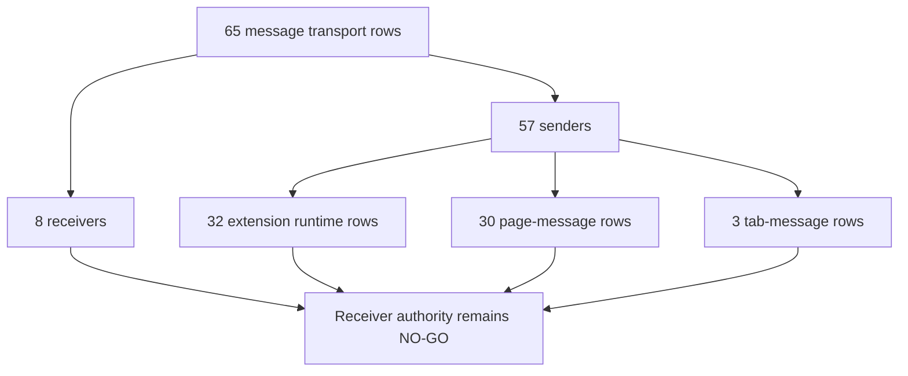

# FilterTube Message Transport Callsite Register - Current Behavior - 2026-05-22

Status: audit-only current-behavior register. Runtime behavior is unchanged.

This slice promotes message transport from action-only and P0 trust summaries
into a source-derived callsite register for current tracked product JavaScript.
It covers extension runtime message receivers, extension runtime senders, tab
broadcast senders, page-world `window.postMessage(...)` traffic, and
`window.addEventListener("message", ...)` receivers.

This is not completion proof for message sender authority, page-message
authenticity, pending request ownership, tab broadcast safety, listener
teardown, settings revision ownership, learned identity provenance, or no-work
optimization. It is a current-behavior boundary before message hardening,
sender-class changes, page bridge changes, tab broadcast changes, script
injection changes, map-write changes, stats/backup changes, or DOM rerun changes.

## Source Boundary

```text
tracked product JS/JSX/MJS files scanned: 68
tracked product files with message transport rows: 14
message transport rows: 65
runtime.onMessage.addListener rows: 4
runtime.sendMessage rows: 28
tabs.sendMessage rows: 3
window.addEventListener("message") rows: 4
window.postMessage rows: 26
runtime behavior changed: no
```

The scan excludes `tests/`, `docs/`, and `js/vendor/` because this register is
about product/runtime transport, not verifier or audit text.

`js/nanah_managed_live_policy.js` is included in the scanned product file count
after the managed-policy live-send slice, but it contributes zero message
transport rows; the dashboard send path still owns the Nanah client callsite.

## Source Fingerprints

| Source file | Lines | Bytes | SHA-256 |
| --- | ---: | ---: | --- |
| `js/background.js` | 6711 | 301840 | `b27206ec2b6927fc33f823c4832ff95ace7c97bd4284eb950fc5964baf666346` |
| `js/content/bridge_injection.js` | 127 | 4741 | `d1b84cf4c43ec5ff5cdc3bd607d8f3d3bf448c12829780b0d05fb9fc14fb5d3e` |
| `js/content/bridge_settings.js` | 1113 | 44087 | `f29e6fab216e80cfd3ae9735088f79b36240331429aadbe85db52467be921853` |
| `js/content/collab_dialog.js` | 393 | 14623 | `dc34bba556b310da8b7516d106e9d67addea59d8a707a02f21607ac97af1f72a` |
| `js/content/first_run_prompt.js` | 190 | 7453 | `5672d9060d29b08550ecfc3add54245212a5094ee5137f025b6f788f12e50409` |
| `js/content/handle_resolver.js` | 282 | 9785 | `67cc877a0a97e4c4c5aaf5a0d1c37c15000af5238f8f37d7c5dc6efee27e34ff` |
| `js/content/release_notes_prompt.js` | 250 | 9866 | `30b624cbbda1004f354f98dbf3b4513f8ebc298adecbceb4358782f248f80474` |
| `js/content_bridge.js` | 13636 | 604184 | `8d55d0c8995e5b68bb9142c41f95046a676f5af2b83f8545b00f91a6a5a3776d` |
| `js/filter_logic.js` | 3652 | 172174 | `953ef0f14970e6cfbc11215fe9eaa078ced34f001908e1c6d5903a8fd2d9a1f5` |
| `js/injector.js` | 3593 | 155830 | `634041581ec84db2edd4f07d46f4bfb9d3a7d97036a0fb83db7739856bdc3e04` |
| `js/popup.js` | 1841 | 75587 | `cb2b30a8d22b08cbd538fdce4ae195b006405d0ceb02a91d92ed53c877aa402a` |
| `js/seed.js` | 1136 | 50026 | `a9d86cd973b998ffbd58faf316ca679267ce7267af36969683f32b760f49054d` |
| `js/state_manager.js` | 2491 | 99780 | `509c559e35989c13cdded17c01eeaca8115addcd3848dbcda41514422e5bc7b6` |
| `js/tab-view.js` | 12795 | 585960 | `3e52cf1b3b189450bb9f7b3a6ae7adb833ddc29d90a8564164314f53ced79109` |

## File And Operation Counts

| File | Rows |
| --- | ---: |
| `js/background.js` | 3 |
| `js/content/bridge_injection.js` | 1 |
| `js/content/bridge_settings.js` | 7 |
| `js/content/collab_dialog.js` | 1 |
| `js/content/first_run_prompt.js` | 2 |
| `js/content/handle_resolver.js` | 4 |
| `js/content/release_notes_prompt.js` | 3 |
| `js/content_bridge.js` | 15 |
| `js/filter_logic.js` | 6 |
| `js/injector.js` | 12 |
| `js/popup.js` | 1 |
| `js/seed.js` | 1 |
| `js/state_manager.js` | 6 |
| `js/tab-view.js` | 3 |

| Operation | Rows |
| --- | ---: |
| `runtime.onMessage.addListener` | 4 |
| `runtime.sendMessage` | 28 |
| `tabs.sendMessage` | 3 |
| `window.addEventListener(message)` | 4 |
| `window.postMessage` | 26 |

## Message Transport Rows

```text
js/background.js:115:tabs.sendMessage:quietTabBroadcast
js/background.js:3556:runtime.onMessage.addListener:primaryBackgroundActionReceiver
js/background.js:5626:runtime.onMessage.addListener:secondaryBackgroundTypeReceiver
js/content/bridge_injection.js:38:runtime.sendMessage:backgroundScriptInjectionRequest
js/content/bridge_settings.js:130:window.postMessage:subscriptionImportRequestToMainWorld
js/content/bridge_settings.js:148:window.addEventListener(message):subscriptionImportResponseListener
js/content/bridge_settings.js:200:runtime.onMessage.addListener:contentRuntimeActionReceiver
js/content/bridge_settings.js:257:runtime.sendMessage:settingsFetchOrActionRuntimeRequest
js/content/bridge_settings.js:756:runtime.sendMessage:managedTimeLimitHeartbeatRuntimeRequest
js/content/bridge_settings.js:818:runtime.sendMessage:compiledSettingsRuntimeRequest
js/content/bridge_settings.js:966:window.postMessage:settingsRelayToMainWorld
js/content/collab_dialog.js:244:window.postMessage:collabDialogDataToIsolatedWorld
js/content/first_run_prompt.js:174:runtime.sendMessage:firstRunCompleteAck
js/content/first_run_prompt.js:178:runtime.sendMessage:firstRunCheckRequest
js/content/handle_resolver.js:28:runtime.sendMessage:channelMapBackgroundUpdate
js/content/handle_resolver.js:203:runtime.sendMessage:channelDetailsBackgroundFetch
js/content/handle_resolver.js:218:window.postMessage:channelMapPageMessageUpdate
js/content/handle_resolver.js:263:window.postMessage:channelMapPageMessageUpdate
js/content/release_notes_prompt.js:75:runtime.sendMessage:releaseNotesAck
js/content/release_notes_prompt.js:165:runtime.sendMessage:openWhatsNewRequest
js/content/release_notes_prompt.js:238:runtime.sendMessage:releaseNotesCheckRequest
js/content_bridge.js:1453:runtime.sendMessage:prefetchVideoChannelMapRuntimeMutation
js/content_bridge.js:1646:runtime.sendMessage:persistVideoChannelMapRuntimeMutation
js/content_bridge.js:1706:runtime.sendMessage:videoMetaMapRuntimeMutation
js/content_bridge.js:5531:window.postMessage:collaboratorInfoRequestToMainWorld
js/content_bridge.js:5581:window.postMessage:channelInfoRequestToMainWorld
js/content_bridge.js:5637:window.postMessage:subscriptionImportRequestToMainWorld
js/content_bridge.js:8471:runtime.sendMessage:shortsChannelMapRuntimeMutation
js/content_bridge.js:8536:runtime.sendMessage:watchIdentityRuntimeRequest
js/content_bridge.js:8729:runtime.sendMessage:shortsIdentityRuntimeRequest
js/content_bridge.js:11384:runtime.sendMessage:channelDetailsRuntimeRequest
js/content_bridge.js:12771:window.postMessage:collaboratorInfoRequestToMainWorld
js/content_bridge.js:13453:runtime.sendMessage:addChannelPersistentRuntimeMutation
js/content_bridge.js:13478:runtime.sendMessage:autoBackupScheduleRuntimeRequest
js/content_bridge.js:13544:runtime.sendMessage:filterAllToggleRuntimeMutation
js/content_bridge.js:13632:window.addEventListener(message):contentBridgeMainWorldMessageReceiver
js/filter_logic.js:30:window.postMessage:filterLogicChannelMapBatch
js/filter_logic.js:80:window.postMessage:filterLogicVideoChannelMapBatch
js/filter_logic.js:141:window.postMessage:filterLogicVideoMetaMapBatch
js/filter_logic.js:1511:window.postMessage:filterLogicVideoMetaMapBatch
js/filter_logic.js:1552:window.postMessage:filterLogicVideoMetaMapBatch
js/filter_logic.js:2030:window.postMessage:filterLogicCollaboratorCache
js/injector.js:12:window.postMessage:subscriptionImportProgressResponse
js/injector.js:53:window.postMessage:subscriptionImportFinalResponse
js/injector.js:72:window.addEventListener(message):subscriptionImportMainWorldReceiver
js/injector.js:84:window.postMessage:subscriptionImportProgressResponse
js/injector.js:88:window.postMessage:subscriptionImportFinalResponse
js/injector.js:116:window.postMessage:subscriptionImportFinalResponse
js/injector.js:1305:window.postMessage:subscriptionImportProgressResponse
js/injector.js:1916:window.addEventListener(message):mainWorldBridgeReceiver
js/injector.js:1997:window.postMessage:collaboratorInfoResponse
js/injector.js:2023:window.postMessage:channelInfoResponse
js/injector.js:2043:window.postMessage:collaboratorInfoResponse
js/injector.js:3575:window.postMessage:injectorReadySignal
js/popup.js:699:runtime.sendMessage:popupRuntimeRequest
js/seed.js:157:window.postMessage:seedVideoChannelMapUpdate
js/state_manager.js:31:runtime.sendMessage:autoBackupScheduleRuntimeRequest
js/state_manager.js:665:runtime.sendMessage:listModeRuntimeMutation
js/state_manager.js:914:runtime.sendMessage:kidsBlockChannelRuntimeMutation
js/state_manager.js:1297:tabs.sendMessage:subscriptionsImportContentRequest
js/state_manager.js:1636:runtime.sendMessage:kidsWhitelistRuntimeMutation
js/state_manager.js:1808:runtime.sendMessage:whitelistTransferRuntimeMutation
js/tab-view.js:3061:runtime.sendMessage:dashboardRuntimeRequest
js/tab-view.js:3342:tabs.sendMessage:dashboardTabRuntimeRequest
js/tab-view.js:12150:runtime.onMessage.addListener:dashboardRuntimeMessageReceiver
```

## Current Behavior Boundaries

- Background has two runtime receivers: the primary `request.action` /
  `request.type` router and a secondary `message.type` router.
- Content/dashboard code has two more runtime receivers:
  `js/content/bridge_settings.js:200` and `js/tab-view.js:12150`.
- Runtime sender rows cover settings fetches, prompt acknowledgements, list-mode
  mutations, whitelist/Kids mutations, identity fetches, learned-map writes,
  script injection, browser info, stats/backup scheduling, and popup/dashboard
  generic requests.
- Tab-message rows are broadcast/request surfaces, not storage or filter
  authority by themselves: background quiet broadcasts, subscription-import
  content requests, and dashboard tab requests.
- Page-message rows cross the isolated/content/main-world boundary and include
  settings relay, subscription import, collaborator requests/responses, channel
  info requests/responses, learned identity map writes, seed readiness, and
  injector ready signalling.
- Four `window.addEventListener("message", ...)` receivers are page-resident
  lifetime listeners without a shared teardown or nonce registry.

## Message Sender/Receiver and Owner Layer Addendum - 2026-05-27

This addendum classifies the same 65 message transport rows by direction,
transport boundary, and owner layer. It is source-derived proof only. It does
not approve sender hardening, receiver consolidation, nonce insertion, page
message rewrites, tab broadcast changes, listener teardown, or route/profile
policy changes.

Direction and boundary census:

| Class | Rows | Current interpretation |
| --- | ---: | --- |
| `sender` | 57 | Most transport rows initiate work or hand off payloads into another owner. |
| `receiver` | 8 | Few receiver rows fan into many action/message branches, so sender authority cannot be inferred from listener count. |
| `extension-runtime` | 32 | Runtime messages carry settings, list mutation, identity fetch, backup, prompt, popup, dashboard, and managed time heartbeat actions. |
| `page-message` | 30 | Page-world messages cross isolated/main-world boundaries for settings, learned maps, collaborator, channel, subscription, and seed traffic. |
| `tab-message` | 3 | Tab messages are broadcast/request surfaces and need route/frame proof before behavior changes. |

Owner layer census:

| Owner layer | Rows | Current risk |
| --- | ---: | --- |
| `isolated-content-runtime` | 33 | Content scripts own the largest transport surface, spanning runtime calls and page-world bridge traffic. |
| `main-world-page-runtime` | 19 | Injector, seed, and filter logic exchange page-world messages with wildcard target posts and page-lifetime listeners. |
| `extension-ui-state` | 10 | Popup, dashboard, and StateManager can request profile/list/security/import/backup behavior through runtime or tab messages. |
| `background` | 3 | Background has few transport rows but owns the broadest runtime receiver side effects. |

```text
message sender rows: 57
message receiver rows: 8
extension runtime transport rows: 32
page-message transport rows: 30
tab-message transport rows: 3
owner-layer rows: isolated-content-runtime 33, main-world-page-runtime 19, extension-ui-state 10, background 3
message sender/receiver authority: NO-GO
runtime behavior changed by this addendum: no
```



Current interpretation:

- The sender-to-receiver imbalance is the main audit risk: one receiver can
  accept many action branches with different storage, DOM, network, backup,
  settings, or identity side effects.
- Page-message and extension-runtime transport are nearly equal in size, so
  hardening only background runtime messages would leave the isolated/main-world
  bridge risk largely intact.
- `background` has only three transport rows in this register, but those rows
  include two broad runtime receivers. Receiver side-effect proof matters more
  than row count.
- This addendum strengthens message trust, cross-feature interaction,
  settings-mode, learned-identity, false-hide/leak, performance, and
  code-burden coverage without changing runtime behavior.

## Risk Notes

Reliability risk is concentrated in split transport ownership. The same
cross-feature effect can travel through runtime messages, tab messages, and page
messages, but there is no shared transport manifest tying each row to sender
class, target route, target profile, target list, storage keys, tab effect,
network effect, DOM effect, and rollback behavior.

False-hide/leak risk follows from learned-map and settings transport. Page-world
map updates, background identity fetches, caller-pushed settings, and DOM reruns
can alter later hide/allow outcomes unless each transport row gets provenance,
pending-request ownership, and negative spoof fixtures.

Performance risk follows from transport-triggered work: settings fetches,
identity fetches, DOM fallback reruns, subscription import, tab broadcasts, and
backup scheduling can start work even when no rule, route, or user action should
permit it. The transport plane still lacks no-work counters.

Code-burden risk follows from parallel bridges: background runtime actions,
content bridge page messages, injector page messages, StateManager runtime
requests, tab-view runtime requests, and prompt scripts each own their local
contracts. Consolidation or hardening requires row-level equivalence proof.

## Future Proof Fields

Each message transport row must eventually be backed by source line, sender,
receiver, target, side-effect, and negative-spoof evidence:

```text
messageTransportReference
sourceFile
sourceLine
operation
messageName
senderClass
receiverClass
transportArea
targetTabOrFrame
targetRoute
targetProfile
targetListMode
targetList
pendingRequestIdPolicy
noncePolicy
originPolicy
storageKeysTouched
networkEffect
scriptInjectionEffect
tabBroadcastEffect
domMutationEffect
learnedIdentityEffect
settingsRevisionPolicy
teardownPolicy
noWorkBudget
positiveFixture
negativeSenderFixture
negativePayloadFixture
```

## Missing Runtime Authority Symbols

No product source currently defines:

```text
messageTransportCallsiteAuthority
messageTransportEffectReport
runtimeMessageSenderContract
pageMessageNonceContract
messageTransportReceiverManifest
messageTransportTabBroadcastAuthority
messageTransportPendingRequestRegistry
messageTransportNoWorkBudget
messageTransportSpoofFixtureReport
messageTransportTeardownRegistry
```

## Completion Boundary

This register improves proof for message transport, runtime listeners,
cross-feature interactions, learned identity, settings modes, false-hide/leak,
performance, and code-burden coverage. It does not complete the active goal.
Before implementation changes, the message plane still needs sender-class
fixtures, pending-request proof, nonce/origin policy, tab-route proof,
settings-revision ownership, no-work budgets, teardown decisions, and
negative-spoof fixtures for each side-effect class.

## Method Semantic Proof Gap Boundary

`docs/audit/FILTERTUBE_METHOD_SEMANTIC_PROOF_GAP_INDEX_CURRENT_BEHAVIOR_2026-05-25.md`
is a required source input before this message transport callsite register can
support runtime optimization or JSON-first promotion. Current proof pins:

```text
method semantic proof gap files covered: 69
method semantic proof gap lexical callables covered: 5836
files with complete per-callable semantic proof: 0
lexical callables requiring semantic proof before behavior changes: 5836
affected callable semantic proof: NO-GO
runtime behavior changed: no
```

These counts are audit-only blockers. They do not approve runtime
optimization, JSON-first behavior, method deletion, method merging, lifecycle
cleanup, no-work changes, or whitelist behavior changes.
