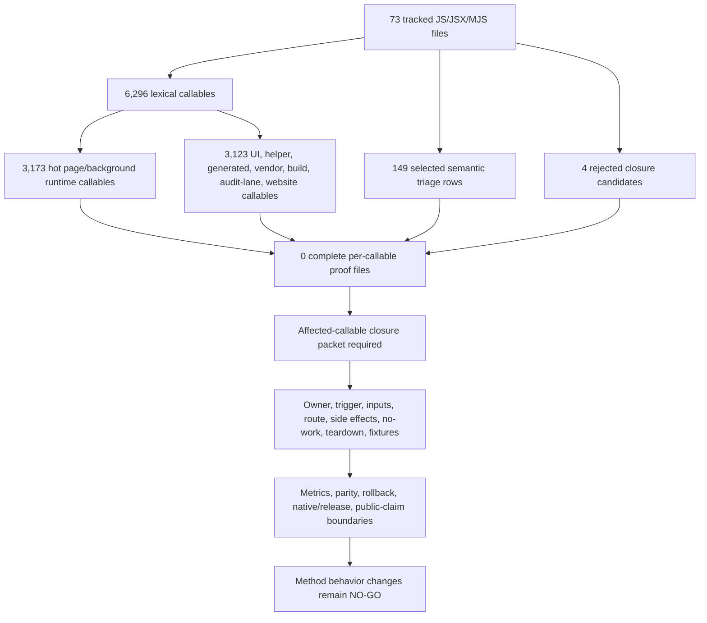
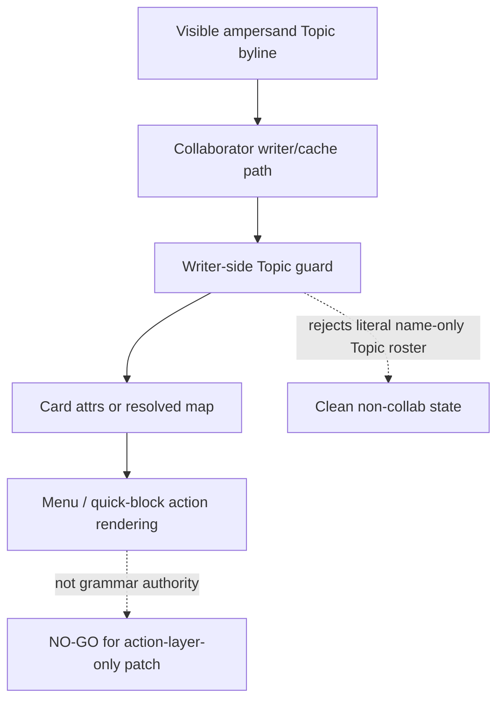

# FilterTube Method Semantic Proof Gap Index - Current Behavior - 2026-05-25

Status: audit-only current-behavior gap index. Runtime behavior is unchanged.
This is not an implementation patch, optimization patch, JSON-first behavior
patch, whitelist patch, selector patch, lifecycle patch, release patch, or
public claim patch.

## Purpose

This slice turns the broad "every method" audit objective into a repo-wide
gap index. The callable inventory already proves that every tracked
JS/JSX/MJS file is visible to the audit. The method semantic registers move
many high-risk files beyond raw counting. Neither layer yet proves that every
callable in the repo has complete behavior authority for optimization,
deletion, merging, or JSON-first promotion.

The practical result is simple: optimization work and a first-class JSON
filter model remain blocked until the affected callables have method-level
proof for owner, trigger, inputs, surface, side effects, no-work behavior,
teardown, and fixtures.

## Method Semantic Proof Gap Boundary

`docs/audit/FILTERTUBE_METHOD_SEMANTIC_PROOF_GAP_INDEX_CURRENT_BEHAVIOR_2026-05-25.md`
is the current source input before this audit slice can support runtime
optimization or JSON-first promotion. Current proof pins:

```text
method semantic proof gap files covered: 73
method semantic proof gap lexical callables covered: 6296
files with complete per-callable semantic proof: 0
lexical callables requiring semantic proof before behavior changes: 6296
affected callable semantic proof: NO-GO
runtime behavior changed: no
```

These counts are audit-only blockers. They do not approve runtime optimization,
JSON-first behavior, method deletion, method merging, lifecycle cleanup, no-work
changes, or whitelist behavior changes.

## Historical Compatibility Ledger

Older current-behavior slices intentionally pin the pre-managed-policy callable
snapshot until their own proof ledgers are refreshed. Those tests treat the
following values as a historical boundary, not as the current repo-wide
callable count:

```text
historical pre-managed-policy callable snapshot: 2026-05-25 through 2026-05-30
method semantic proof gap files covered: 69
tracked JS/JSX/MJS files: 69
method semantic proof gap lexical callables covered: 5836
repo-wide lexical callables: 5836
files with lexical accounting: 69
lexical callables requiring semantic proof before behavior changes: 5836
```

## Current Proof State

```text
tracked JS/JSX/MJS files: 73
repo-wide lexical callables: 6296
files with lexical accounting: 73
files with complete per-callable semantic proof: 0
lexical callables requiring semantic proof before behavior changes: 6296
required semantic proof fields: 8
selected release hot-path semantic triage rows: 13
selected visual-writer semantic triage rows: 8
selected collaborator-cache semantic triage rows: 7
selected collaborator writer-side semantic triage rows: 8
selected Topic menu renderer guard semantic triage rows: 1
selected native-dropdown lifecycle semantic triage rows: 12
selected JSON active-work semantic triage rows: 12
selected rule/settings mutation persistence semantic triage rows: 13
selected DOM fallback run/selector traversal semantic triage rows: 12
selected content-bridge runtime lifecycle semantic triage rows: 13
selected background compiled-cache/refresh semantic triage rows: 14
selected quick-block affordance lifecycle semantic triage rows: 20
evaluated complete-proof closure candidates: 4
complete-proof closure candidates accepted: 0
rejected closure candidate: scripts/sync-native-runtime.mjs
closure rejection reason: public wrapper phase proof exists, but native app contract, manifest/hash/status fixture provenance, missing-app negative fixture, drift negative fixture, and release freshness report are absent
rejected closure candidate: js/content/menu.js
closure rejection reason: content-menu VM and source proof exists, but CSS scope, native menu visual side effects, duplicate-DOM recovery, dark/light parity, block/allow vocabulary, no-rule budget, and teardown proof remain absent
rejected closure candidate: website app zero-count default-export row cluster
closure rejection reason: broad-parser zero rows are not callable-free proof; current website source contains default-export route functions and still lacks route render, public-claim, deploy, accessibility, and release freshness proof
rejected closure candidate: build/website cross-parser count convergence
closure rejection reason: repo-wide broad parser and build/website route parser intentionally count different lexical shapes; current build/sync plus website/config broad total is 181 while build/website audit total is 108, so parser agreement and complete semantic proof remain absent
runtime behavior changed: no
```

## Method Semantic Convergence Boundary - 2026-05-30

This addendum joins the repo-wide callable index, method semantic register,
per-file method semantic slices, selected release-lag hot-path rows,
JSON-first source-flow blockers, affected-callable packets, and closure
candidate rejections into one audit-only convergence boundary. It changes no
runtime behavior and does not approve method deletion, method merging,
optimization, whitelist/cache changes, JSON-first method promotion, lifecycle
cleanup, release claims, or public performance claims.

Source inputs:

| Source input | Boundary contribution |
| --- | --- |
| `docs/audit/FILTERTUBE_ALL_CALLABLE_INDEX_2026-05-18.md` | Repo-wide tracked JS/JSX/MJS file and lexical callable census. |
| `docs/audit/FILTERTUBE_METHOD_SEMANTIC_AUDIT_REGISTER_2026-05-20.md` | High-risk method semantic register and required authority fields. |
| `docs/audit/FILTERTUBE_METHOD_SEMANTIC_PROOF_GAP_INDEX_CURRENT_BEHAVIOR_2026-05-25.md` | Current gap index for complete per-callable semantic proof. |
| `docs/audit/FILTERTUBE_WHITELIST_CACHE_SPA_AFFECTED_CALLABLE_PROOF_BOUNDARY_CURRENT_BEHAVIOR_2026-05-30.md` | Lag-focused affected-callable packet and route/mode callable budget blocker. |
| `docs/audit/FILTERTUBE_JSON_FIRST_IMPLEMENTATION_AUTHORITY_BOUNDARY_CURRENT_BEHAVIOR_2026-05-24.md` | JSON-first implementation authority blocker tied to method proof. |
| `docs/audit/FILTERTUBE_FIRST_OPTIMIZATION_SOURCE_LOCUS_IMPLEMENTATION_AUTHORITY_BOUNDARY_CURRENT_BEHAVIOR_2026-05-24.md` | First optimization source-locus authority blocker tied to source-owner, no-work, side-effect, fixture, diagnostic, parity, rollback, and release proof. |
| per-file `FILTERTUBE_*_METHOD_SEMANTIC_REGISTER_*.md` artifacts | Source-derived semantic slices for selected high-risk files and families. |
| `tests/runtime/all-callable-index-current-behavior.test.mjs` | Executable parity for current callable counts, gap rows, and missing authority symbols. |

| Convergence row | Current source-backed finding | Risk if treated as implementation-ready now |
| --- | --- | --- |
| `method_convergence_repo_census` | 73 tracked JS/JSX/MJS files and 6,296 lexical callables are visible to the audit. | Visibility can be mistaken for behavior proof. |
| `method_convergence_zero_complete_files` | 0 files have complete per-callable semantic proof; 6,296 lexical callables still require proof before behavior changes. | A behavior patch can touch an unproved callable path while tests only cover a selected slice. |
| `method_convergence_family_weight` | 8 families are represented: hot page/background runtime, content helper runtime, UI/settings runtime, generated/quarantined UI, vendor bundles, build/sync scripts, and website routes/components/config. | Runtime, build, vendor, website, and generated-output methods need different proof types and cannot share one cleanup assumption. |
| `method_convergence_hot_runtime_dominance` | Hot page/background runtime owns 3,173 lexical callables, including 1,203 in `content_bridge.js`, 470 in `background.js`, and 431 in `dom_fallback.js`. | YouTube lag and false-hide regressions are concentrated in hot files with many interacting callables. |
| `method_convergence_selected_triage_not_closure` | 149 selected semantic triage rows cover release hot paths, visual writers, collaborator cache/writer/menu guards, native dropdowns, JSON active-work predicates, content/category fields, mutation persistence, DOM fallback traversal, content-bridge lifecycle, background cache refresh, and quick-block lifecycle. | Selected hot-path proof can hide the fact that repo-wide semantic closure is still 0 files. |
| `method_convergence_required_field_gate` | 8 semantic fields are required: owner/source, trigger/caller, settings/profile/list-mode inputs, route/surface, side effects, active/no-rule/disabled behavior, teardown/idempotence, and positive/negative fixtures. | Missing any field weakens reliability, no-work, false-hide, leak, or rollback proof. |
| `method_convergence_parser_visibility_debt` | 4 closure candidates were rejected, including native sync, content menu, website zero-count routes, and build/website parser divergence with 181 broad-parser rows versus 108 route-parser rows. | Parser counts can be mistaken for callable absence or semantic closure. |
| `method_convergence_affected_callable_packet_gap` | The whitelist/cache affected-callable chain names exact callable rows but still has 0 runtime affected-callable semantic approvals and 0 committed semantic evidence artifacts. | A lag optimization can be justified from source anchors without live route/mode callable budget proof. |
| `method_convergence_json_first_blocker` | JSON-first implementation authority still depends on affected-callable semantic proof, route/surface fixture packets, metric artifacts, DOM parity, native/release proof, and rollback proof. | JSON fields can become first-class before the methods that parse, mutate, hide, restore, cache, or fetch are proved. |
| `method_convergence_authority_absence` | `methodSemanticCoverageComplete`, `callableBehaviorProofReady`, `behaviorPatchMayProceed`, `methodSemanticAuthority`, `callableEffectReport`, `callableNoWorkBudget`, and `callableTeardownRegistry` are absent from product runtime source. | Product source has no shared authority that can certify broad method safety. |

```text
73 tracked JS/JSX/MJS files
        |
        +--> 6,296 lexical callables
        |       +--> 3,173 hot page/background runtime
        |       +--> 3,123 UI, helper, generated, vendor, build, audit-lane, website
        |
        +--> 149 selected semantic triage rows
        +--> 4 rejected closure candidates
        |
        v
0 files with complete per-callable semantic proof
        |
        v
NO-GO until affected callables have owner, trigger, inputs, route/surface,
side effects, no-work behavior, teardown/idempotence, fixtures, metrics,
parity, rollback, native/release, and public-claim boundaries.
```



Current convergence status:

```text
method semantic convergence rows: 10
implementation-ready method semantic convergence rows: 0
methodSemanticCoverageComplete product source symbol: absent
callableBehaviorProofReady product source symbol: absent
behaviorPatchMayProceed product source symbol: absent
methodSemanticAuthority product source symbol: absent
callableEffectReport product source symbol: absent
callableNoWorkBudget product source symbol: absent
callableTeardownRegistry product source symbol: absent
runtime behavior changed by this addendum: no
method deletion approval: NO-GO
method merge approval: NO-GO
affected-callable closure approval: NO-GO
whitelist/cache method optimization approval: NO-GO
JSON-first method promotion approval: NO-GO
release/public-claim use: NO-GO
```

## Evidence Inputs

| Artifact | Role |
| --- | --- |
| `docs/audit/FILTERTUBE_ALL_CALLABLE_INDEX_2026-05-18.md` | Repo-wide tracked JS/JSX/MJS file and lexical callable count. |
| `docs/audit/FILTERTUBE_FUNCTION_COVERAGE_2026-05-17.md` | Hot-runtime first-pass callable map. |
| `docs/audit/FILTERTUBE_METHOD_SEMANTIC_AUDIT_REGISTER_2026-05-20.md` | High-risk semantic method candidate register and identity waterfall boundary. |
| `docs/audit/FILTERTUBE_UI_SETTINGS_CALLABLE_AUDIT_2026-05-18.md` | UI/settings callable expansion pass. |
| `docs/audit/FILTERTUBE_CONTENT_HELPER_CALLABLE_AUDIT_2026-05-18.md` | Content-helper callable expansion pass. |
| `docs/audit/FILTERTUBE_BUILD_WEBSITE_CALLABLE_AUDIT_2026-05-18.md` | Build, website, and release callable expansion pass. |
| per-file `FILTERTUBE_*_METHOD_SEMANTIC_REGISTER_*.md` artifacts | Source-derived semantic slices for selected high-risk files and families. |

## Required Semantic Proof Fields

Before a behavior-changing method can be optimized, deleted, merged, or used
as the basis for a first-class JSON filter path, the affected callable must
have all of these fields pinned:

- owner family and source file,
- trigger path and caller class,
- settings/profile/list-mode inputs,
- route/surface scope,
- observable side effects,
- active/no-rule/disabled behavior,
- teardown or idempotence behavior,
- positive and negative fixtures.

## Family Gap Summary

| Family | Files | Lexical callables | Semantic status |
| --- | ---: | ---: | --- |
| Hot page/background runtime | 9 | 3173 | `semantic proof incomplete` |
| Content helper runtime | 9 | 348 | `semantic proof incomplete` |
| UI/settings runtime | 14 | 2088 | `semantic proof incomplete` |
| Generated/quarantined UI | 6 | 147 | `semantic proof incomplete` |
| Vendor bundles | 2 | 279 | `semantic proof incomplete` |
| Build/sync scripts | 4 | 58 | `semantic proof incomplete` |
| Audit/test lane scripts | 3 | 80 | `semantic proof incomplete` |
| Website routes/components/config | 26 | 123 | `semantic proof incomplete` |

## File Gap Index

| File | Family | Lexical callables | Semantic status | Blocker before behavior changes |
| --- | --- | ---: | --- | --- |
| `build.js` | Build/sync scripts | 51 | `semantic proof incomplete` | Release/package/publication method authority and rollback proof are incomplete. |
| `js/background.js` | Hot page/background runtime | 470 | `semantic proof incomplete` | Message, mutation, resolver, storage, stats, and script-injection branches still need per-action authority. |
| `js/content/block_channel.js` | Hot page/background runtime | 226 | `semantic proof incomplete` | Quick-block lifecycle, affordance, identity, and no-rule budget proof remain incomplete. |
| `js/content/bridge_injection.js` | Content helper runtime | 12 | `semantic proof incomplete` | Main-world bridge bootstrap, message ownership, and failure/idempotence proof remain incomplete. |
| `js/content/bridge_settings.js` | Hot page/background runtime | 102 | `semantic proof incomplete` | Settings relay/import/storage listener authority and caller-class proof remain incomplete. |
| `js/content/collab_dialog.js` | Content helper runtime | 42 | `semantic proof incomplete` | Collaborator dialog lifecycle, DOM mutation, and negative fixture proof remain incomplete. |
| `js/content/dom_extractors.js` | Content helper runtime | 117 | `semantic proof incomplete` | DOM identity extraction confidence, cache freshness, and recycled-node restore proof remain incomplete. |
| `js/content/dom_fallback.js` | Hot page/background runtime | 431 | `semantic proof incomplete` | Hide/restore, selector target, playlist/player side effect, and no-work proof remain incomplete. |
| `js/content/dom_helpers.js` | Content helper runtime | 21 | `semantic proof incomplete` | Visual writer ownership, restore semantics, and sibling-visible proof remain incomplete. |
| `js/content/dom_state.js` | Content helper runtime | 42 | `semantic proof incomplete` | Virtual DOM state ownership, attribute compatibility, recycled-node cleanup, and public-fingerprint proof remain incomplete. |
| `js/content/first_run_prompt.js` | Content helper runtime | 7 | `semantic proof incomplete` | Prompt queue, acknowledgement, sender class, URL, and viewport proof remain incomplete. |
| `js/content/handle_resolver.js` | Hot page/background runtime | 22 | `semantic proof incomplete` | Resolver fetch budget, cache source, identity confidence, and route negative proof remain incomplete. |
| `js/content/menu.js` | Content helper runtime | 3 | `semantic proof incomplete` | Menu CSS/bootstrap ownership and non-matching surface proof remain incomplete. |
| `js/content/release_notes_prompt.js` | Content helper runtime | 12 | `semantic proof incomplete` | Release overlay eligibility, acknowledgement, navigation, and spoofing proof remain incomplete. |
| `js/content_bridge.js` | Hot page/background runtime | 1203 | `semantic proof incomplete` | Content bridge caller graph, menu/quick action authority, lifecycle callback ownership, and identity confidence proof remain incomplete. |
| `js/content_controls_catalog.js` | UI/settings runtime | 3 | `semantic proof incomplete` | Content-control catalog ownership, settings parity, and row-action fixture proof remain incomplete. |
| `js/filter_logic.js` | Hot page/background runtime | 313 | `semantic proof incomplete` | JSON traversal, harvest/map mutation, block decision, recursion, and no-rule budget proof remain incomplete. |
| `js/injector.js` | Hot page/background runtime | 314 | `semantic proof incomplete` | Main-world message dispatch, settings capability, and injection idempotence proof remain incomplete. |
| `js/io_manager.js` | UI/settings runtime | 119 | `semantic proof incomplete` | Import/export target-profile, trusted envelope, mutation report, and rollback proof remain incomplete. |
| `js/layout.js` | Generated/quarantined UI | 52 | `semantic proof incomplete` | Packaged-but-inactive legacy layout quarantine, selector target, and deletion readiness proof remain incomplete. |
| `js/managed_admin_authority.js` | UI/settings runtime | 18 | `semantic proof incomplete` | Managed admin actor/target, session TTL, sensitive re-auth, failed-unlock rate limiting, and remote-policy handoff proof remain incomplete. |
| `js/managed_parent_command_center.js` | UI/settings runtime | 14 | `semantic proof incomplete` | Managed parent command-center summary/action-intent and bulk-intent rendering, delegated UI action gates, and no-payload/no-write proof remain incomplete. |
| `js/nanah_managed_live_policy.js` | UI/settings runtime | 97 | `semantic proof incomplete` | Managed policy live-send payload, signing, scope, revision, trusted-link writes, outbound send-history proof, and delivery-ack status proof remain incomplete. |
| `js/nanah_managed_open_sync.js` | UI/settings runtime | 33 | `semantic proof incomplete` | Provider-gated managed pull-on-open policy checks, trusted-link eligibility, mailbox apply reporting, and no-hot-path proof remain incomplete. |
| `js/nanah_sync_adapter.js` | UI/settings runtime | 166 | `semantic proof incomplete` | Nanah envelope, canonical payload-hash verification, trust, replay, profile target, signing-key authority, mailbox intake, local-network candidate validation, and sync parity proof remain incomplete. |
| `js/popup.js` | UI/settings runtime | 131 | `semantic proof incomplete` | Popup render/action lifecycle, settings mutation, and selector proof remain incomplete. |
| `js/render_engine.js` | UI/settings runtime | 126 | `semantic proof incomplete` | Dashboard render ownership, empty-state, list-mode, and row-action proof remain incomplete. |
| `js/security_manager.js` | UI/settings runtime | 18 | `semantic proof incomplete` | PIN/session lock, crypto payload, storage mutation, and failure proof remain incomplete. |
| `js/seed.js` | Hot page/background runtime | 92 | `semantic proof incomplete` | Fetch/XHR/page-global patch ownership, replay budget, JSON mutation, and pass-through proof remain incomplete. |
| `js/settings_shared.js` | UI/settings runtime | 43 | `semantic proof incomplete` | Shared save/refresh semantics, profile/list-mode inputs, and caller proof remain incomplete. |
| `js/shared/identity.js` | Content helper runtime | 92 | `semantic proof incomplete` | Identity normalization, handle/name/UC confidence, and JSON/DOM fallback parity proof remain incomplete. |
| `js/state_manager.js` | UI/settings runtime | 155 | `semantic proof incomplete` | Settings save, profile mutation, cache revision, backup, and broadcast proof remain incomplete. |
| `js/tab-view.js` | UI/settings runtime | 1101 | `semantic proof incomplete` | Dashboard profile/list-mode/Nanah/import/export/release-note action proof remains incomplete. |
| `js/ui-shell/popup-shell.js` | Generated/quarantined UI | 42 | `semantic proof incomplete` | Generated output freshness, mount failure, package parity, and source/output hash proof remain incomplete. |
| `js/ui-shell/tab-view-decor.js` | Generated/quarantined UI | 41 | `semantic proof incomplete` | Generated output freshness, ambient UI behavior, and package parity proof remain incomplete. |
| `js/ui_components.js` | UI/settings runtime | 64 | `semantic proof incomplete` | Modal/portal lifecycle, row controls, and DOM ownership proof remain incomplete. |
| `js/vendor/nanah.bundle.js` | Vendor bundles | 107 | `semantic proof incomplete` | Vendor source revision, global API, hash provenance, and package freshness proof remain incomplete. |
| `js/vendor/qrcode.bundle.js` | Vendor bundles | 172 | `semantic proof incomplete` | QR package version, global API, hash provenance, and package freshness proof remain incomplete. |
| `scripts/audit-proof-drift.mjs` | Audit/test lane scripts | 19 | `semantic proof incomplete` | Audit drift source-fingerprint scope, lane ownership, and stale-proof negative fixtures remain incomplete. |
| `scripts/build-extension-ui.mjs` | Build/sync scripts | 2 | `semantic proof incomplete` | UI shell build freshness, stale-output, and failure contract proof remain incomplete. |
| `scripts/build-nanah-vendor.mjs` | Build/sync scripts | 4 | `semantic proof incomplete` | Vendor build source/version/hash and stale-output proof remain incomplete. |
| `scripts/run-test-lane.mjs` | Audit/test lane scripts | 61 | `semantic proof incomplete` | Changed-path classification, audit-proof relevance, manual-smoke handoff, managed remote-delivery smoke handoff, and dirty-path guard proof remain incomplete. |
| `scripts/sync-native-runtime.mjs` | Build/sync scripts | 1 | `semantic proof incomplete` | Native app repo contract, manifest freshness, and status propagation proof remain incomplete. |
| `scripts/test-lane-config.mjs` | Audit/test lane scripts | 0 | `semantic proof incomplete` | Lane ownership taxonomy, future file-family drift, and unclassified-path negative proof remain incomplete. |
| `src/extension-shell/popup.jsx` | Generated/quarantined UI | 3 | `semantic proof incomplete` | Authoring-to-generated popup parity and package freshness proof remain incomplete. |
| `src/extension-shell/shared/runtime.js` | Generated/quarantined UI | 7 | `semantic proof incomplete` | Shared shell runtime source/output parity and mount failure proof remain incomplete. |
| `src/extension-shell/tab-view-decor.jsx` | Generated/quarantined UI | 2 | `semantic proof incomplete` | Authoring-to-generated dashboard decor parity and package freshness proof remain incomplete. |
| `website/app/[slug]/page.js` | Website routes/components/config | 4 | `semantic proof incomplete` | Dynamic route metadata, not-found, related-page, and public-claim proof remain incomplete. |
| `website/app/downloads/page.js` | Website routes/components/config | 2 | `semantic proof incomplete` | Download/public artifact claim and release freshness proof remain incomplete. |
| `website/app/layout.js` | Website routes/components/config | 0 | `semantic proof incomplete` | Layout/public metadata and asset-budget proof remain incomplete. |
| `website/app/not-found.js` | Website routes/components/config | 0 | `semantic proof incomplete` | Not-found route rendering and public-claim proof remain incomplete. |
| `website/app/page.js` | Website routes/components/config | 2 | `semantic proof incomplete` | Home public claim, asset, route, and release-state proof remain incomplete. |
| `website/app/privacy/page.js` | Website routes/components/config | 4 | `semantic proof incomplete` | Privacy/public claim parity and feature-data proof remain incomplete. |
| `website/app/robots.js` | Website routes/components/config | 0 | `semantic proof incomplete` | Robots route policy and release/public indexing proof remain incomplete. |
| `website/app/sitemap.js` | Website routes/components/config | 0 | `semantic proof incomplete` | Sitemap route coverage and stale-page proof remain incomplete. |
| `website/app/terms/page.js` | Website routes/components/config | 0 | `semantic proof incomplete` | Terms/public claim parity proof remains incomplete. |
| `website/components/browser-logo-rail.js` | Website routes/components/config | 1 | `semantic proof incomplete` | Browser support claim and asset proof remain incomplete. |
| `website/components/footer-signal-art.js` | Website routes/components/config | 63 | `semantic proof incomplete` | Footer visual scene render budget, accessibility, reduced-motion, and public-claim proof remain incomplete. |
| `website/components/hero-video.js` | Website routes/components/config | 4 | `semantic proof incomplete` | Hero media loading, fallback, privacy, asset budget, and release freshness proof remain incomplete. |
| `website/components/marketing-ui.js` | Website routes/components/config | 6 | `semantic proof incomplete` | Marketing component public-claim and asset-budget proof remain incomplete. |
| `website/components/reveal.js` | Website routes/components/config | 1 | `semantic proof incomplete` | Client reveal lifecycle and no-JS/visibility proof remain incomplete. |
| `website/components/route-content.js` | Website routes/components/config | 0 | `semantic proof incomplete` | Route content ownership and public-claim parity proof remain incomplete. |
| `website/components/scene-controller.js` | Website routes/components/config | 10 | `semantic proof incomplete` | Client scene lifecycle, listener/timer, and media budget proof remain incomplete. |
| `website/components/scenic-detail-page.js` | Website routes/components/config | 6 | `semantic proof incomplete` | Detail page route/media/public-claim proof remains incomplete. |
| `website/components/scenic-illustration.js` | Website routes/components/config | 3 | `semantic proof incomplete` | Illustration asset budget and render fallback proof remain incomplete. |
| `website/components/scenic-tones.js` | Website routes/components/config | 1 | `semantic proof incomplete` | Theme/tone token ownership and rendering proof remain incomplete. |
| `website/components/site-data.js` | Website routes/components/config | 0 | `semantic proof incomplete` | Site data public-claim authority and release freshness proof remain incomplete. |
| `website/components/site-footer.js` | Website routes/components/config | 3 | `semantic proof incomplete` | Footer links/public claim/navigation proof remain incomplete. |
| `website/components/site-header.js` | Website routes/components/config | 3 | `semantic proof incomplete` | Header links/theme/public claim/navigation proof remain incomplete. |
| `website/components/site-shell-data.js` | Website routes/components/config | 0 | `semantic proof incomplete` | Shell data ownership and public claim proof remain incomplete. |
| `website/components/theme-toggle.js` | Website routes/components/config | 10 | `semantic proof incomplete` | Theme persistence, hydration, and no-JS proof remain incomplete. |
| `website/next.config.mjs` | Website routes/components/config | 0 | `semantic proof incomplete` | Build/runtime configuration and deployment parity proof remain incomplete. |
| `website/postcss.config.mjs` | Website routes/components/config | 0 | `semantic proof incomplete` | CSS build configuration and generated asset proof remain incomplete. |

## Release Hot-Path Semantic Addendum - 2026-05-27

This addendum records source-derived semantic rows for the release-lag and
blocklist/whitelist regression path without claiming that any full file has
complete per-callable semantic proof. These rows reduce ambiguity for the
callables most likely to be touched next, while the repo-wide implementation
gate remains closed.

| Semantic row | Source | Owner / trigger / inputs | Side effects and no-work behavior | Existing proof boundary |
| --- | --- | --- | --- | --- |
| `seed_hasNetworkJsonWork` | `js/seed.js:234` | Seed MAIN-world network predicate, called before fetch/XHR clone/parse/rewrite work. Inputs: `enabled`, `listMode`, content filters, keyword/channel/comment rules, Shorts/comments toggles, and selected categories. | Pure boolean. Missing settings, disabled runtime, and empty blocklist mode return false; whitelist returns true because unresolved JSON cards may need fail-closed handling. | Covered by seed fetch/XHR no-work, P0 no-work, and JSON-first active-work predicate fixtures; not complete proof for every seed callable. |
| `seed_shouldBypassYouTubeiNetworkResponse` | `js/seed.js:253` | Seed fetch/XHR admission gate for named YouTubei responses. Inputs: cached settings and `hasNetworkJsonWork()`. | Returns true before parsing when settings are missing or no active JSON work exists; logs only through seed debug. | Proves the empty-install lag fix boundary but not all endpoint semantics. |
| `injector_hasNetworkJsonWork` | `js/injector.js:185` | Main-world injector mirror predicate for snapshot hold/replay and settings work. Inputs mirror seed active JSON work. | Pure boolean; prevents queued snapshot work when inactive. | Covered by network snapshot producer/consumer and no-work fixtures; not complete proof for all injector message handlers. |
| `bridge_settings_refreshRuntimeObserversAfterSettingsUpdate` | `js/content/bridge_settings.js:986` | Isolated-world settings fanout after a refreshed settings payload. Inputs: available global refresh hooks. | Calls only the first available whole-runtime observer refresh, else quick-block, DOM fallback, and prefetch fallbacks. | Confirms runtime observer refresh ownership is still split and ordered; no shared lifecycle registry exists. |
| `bridge_settings_scheduleSettingsRefreshFromStorage` | `js/content/bridge_settings.js:1019` | Storage-change debounce owner. Inputs: `forceReprocess`, elapsed time, pending timer state, and changed storage keys. | Coalesces refreshes and upgrades pending `forceReprocess` with `pendingStorageRefreshForceReprocess || shouldForceReprocess`; delayed branch applies `forcePendingReprocess`. | Fixes stale visible-card reprocess after keyword/profile changes; not proof for every storage key consumer. |
| `background_v4KeywordEntries` | `js/background.js:2523` | Background compile path for active profile keyword entries. Inputs: active Main/Kids profile, list mode, syncKidsToMain. | Prefers `activeMain.keywords` before `activeMain.blockedKeywords`; Kids still uses `blockedKeywords`; no DOM side effect. | Protects popup/dashboard main keyword writes such as `shakira`; not complete settings schema authority. |
| `content_bridge_forceCloseDropdown` | `js/content_bridge.js:505` | Native/fallback dropdown close helper for enriched menus. Inputs: dropdown root, reusable native root, miniplayer state. | Sends Escape/calls `close()`, removes stale FilterTube hidden marker from reusable native desktop dropdowns, and only writes `data-filtertube-force-hidden` for mobile/fallback popups. | Addresses comment menu hidden-state poisoning; not global YouTube menu lifecycle proof. |
| `content_bridge_parseCollaboratorNames` | `js/content_bridge.js:2775` | Collaborator byline parser. Inputs: raw byline text and `allowSeparatorSplit`. | When separator splitting is disabled, treats the full byline as one name except hidden `N more` cleanup. When enabled, splits only comma and `and`; ampersand is not a collaborator separator. | Protects `Kully B & Gussy G - Topic` from false collaborator classification; stronger collaborator evidence still lives elsewhere. |
| `block_refreshQuickBlockRuntimeState` | `js/content/block_channel.js:358` | Quick-block runtime refresher. Inputs: quick-block enabled state, observer-start state, eager-sweep predicate, viewport host set. | Returns without work when disabled, starts observer lazily when needed, and skips sync/scheduling when no eager or visible-card work exists. | Preserves quick-cross availability without old broad periodic sweeps; not complete proof for all quick-block UI states. |
| `block_refreshQuickBlockAvailability` | `js/content/block_channel.js:369` | Quick-block availability transition owner after settings changes. Inputs: enabled state and force option. | Disabled state cancels hover intent and removes buttons; enabled state starts observer or refreshes runtime state; eager sweep remains predicate-gated. | Protects Home/Shorts affordance startup while keeping empty-install work lazy. |
| `block_resolveOutermostShortsQuickBlockHost` | `js/content/block_channel.js:557` | Shorts quick-block host resolver. Inputs: initial card and `QUICK_BLOCK_CARD_SELECTORS`. | Bounded parent climb (`depth < 8`) only while each parent is also a Shorts quick-block card; otherwise returns original host. | Legacy row id retained for callable-index proof compatibility. |
| `block_quick_resolveOutermostShortsHost_depth_cap` | `js/content/block_channel.js:557` | Shorts quick-block host resolver. Inputs: initial card and `QUICK_BLOCK_CARD_SELECTORS`. | Bounded parent climb (`depth < 8`) only while each parent is also a Shorts quick-block card; otherwise returns original host. | Fixes nested Home Shorts affordance placement without broad DOM ancestry walks. |
| `block_repairFilterTubeHiddenDropdownState` | `js/content/block_channel.js:2339` | Explicit repair path for dropdown nodes previously hidden by FilterTube. Inputs: candidate dropdown and descendants. | Repairs only elements carrying `data-filtertube-force-hidden="true"`; does not reopen ordinary YouTube outside-click hidden state. | Prevents native close-state poisoning while preserving stale FilterTube marker recovery. |
| `block_closeFilterTubeInjectedDropdownsOnOutsidePointer` | `js/content/block_channel.js:2483` | Capture-phase outside-pointer fallback for FilterTube-enriched native dropdowns. Inputs: pointer/mouse event target, composed path, dropdown visibility. | Ignores menu buttons and inside-dropdown clicks; closes only visible dropdowns containing `.filtertube-block-channel-item` through `forceCloseDropdown()` or Escape fallback. | Fixes enriched comment menu outside-close without suppressing plain native YouTube menus. |

Current semantic status after this addendum:

```text
selected release hot-path semantic triage rows: 13
files with complete per-callable semantic proof: 0
repo-wide behavior-change approval from method proof: NO-GO
runtime behavior changed by this addendum: no
```

## JSON Active-Work Predicate Semantic Addendum - 2026-05-28

This continuation lifts the JSON-first active-work predicate cluster into the
repo-wide method proof gate. The JSON-first source-flow and active-work ledgers
already show that JSON filtering is the right first-class direction, but not a
shared runtime authority yet. These rows pin the callables that decide whether
network JSON is parsed/mutated, whether queued page data is replayed, whether
MAIN-world scripts are injected, whether identity prefetch wakes outside JSON
mutation, and whether `filter_logic` harvests before mutating. They are
audit-only and do not approve predicate merging or runtime optimization.

| Semantic row | Source | Owner / trigger / inputs | Side effects and no-work behavior | Existing proof boundary |
| --- | --- | --- | --- | --- |
| `seed_hasEnabledContentFilters_strict_boolean` | `js/seed.js:201` | Seed MAIN-world content-filter admission helper. Inputs are `settings.contentFilters.duration/uploadDate/uppercase.enabled`. | Pure boolean; only exact `true` enables seed JSON content-filter work. Truthy malformed/imported values do not wake seed body work. | Strictness now matches injector/bridge, but schema normalization authority is still separate. |
| `seed_hasActiveJsonFilterRules_rule_branches` | `js/seed.js:220` | Seed JSON rule predicate. Inputs are keyword, channel, comment keyword lists, `hideAllComments`, `hideAllShorts`, and selected category filters. | Pure boolean; catalog controls outside these branches do not make seed network JSON active. | Content-control catalog activity and JSON rule activity remain different authorities. |
| `seed_shouldSkipEngineProcessing_harvest_only_scope` | `js/seed.js:263` | Seed route/layout skip predicate for search, channel, and desktop home browse responses. Inputs are URL path, dataName, list mode, content-filter activity, JSON-rule activity, and response shape. | Returns skip only for selected blocklist/no-active-rule layouts; active rules, active content filters, and whitelist keep engine processing live. | Skip means harvest-only/pass-through, not no work; route/surface mutation budgets remain incomplete. |
| `seed_processWithEngine_transport_dispatcher` | `js/seed.js:383` | Seed network processing dispatcher for page globals/fetch/XHR payloads. Inputs are cached settings, engine availability, skip predicate, and dataName. | Queues missing-settings data, returns without engine work when no JSON work or disabled, harvests-only for skip cases, or calls `FilterTubeEngine.processData()`. | This is the central parse/mutate/pass-through decision but not a first-class shared work report. |
| `seed_setupFetchInterception_clone_parse_gate` | `js/seed.js:666` | Seed fetch interceptor owner for admitted YouTubei responses. Inputs are URL endpoint match, cached settings, active-work gate, response clone, engine result, and original response metadata. | Endpoint-like fetches can be bypassed before clone/parse when inactive; active paths clone, parse, process, stringify, and rebuild a `Response`. | Fetch mutation budget, endpoint reason, and per-route parse/stringify counters remain missing. |
| `seed_setupXhrInterception_parse_override_gate` | `js/seed.js:757` | Seed XHR interceptor owner for admitted YouTubei responses. Inputs are open/send URL marks, ready-state/load listeners, cached settings, active-work gate, and response override fields. | Marks endpoint-like XHRs, wraps listeners, bypasses before parse when inactive, and can override `response`/`responseText` when active. | XHR listener lifecycle and fetch/XHR parity are not yet a single transport authority. |
| `injector_processDataWithFilterLogic_active_gate` | `js/injector.js:3405` | Injector page-world JSON processor. Inputs are current settings, engine availability, data, and dataName. | Returns unchanged when engine is absent or no active JSON work exists; active path calls `FilterTubeEngine.processData()`. | Mirrors seed admission but still owns a separate hook/replay path. |
| `injector_processInitialDataQueue_no_work_clear` | `js/injector.js:3427` | Injector queued initial-data replay owner. Inputs are `settingsReceived`, engine presence, active JSON work, and queued page data. | Delays until settings/engine exist, clears queued data when no active JSON work exists, otherwise processes queued items. | Queue cleanup avoids stale replay cost, but settings revision and duplicate hook proof remain incomplete. |
| `bridge_needsIdentityPrefetchWork_non_json_branch` | `js/content_bridge.js:1013` | Content bridge identity prefetch predicate. Inputs are enabled state, list mode, and channel filter list. | Returns true for whitelist mode or channel rows even when JSON mutation is not the only reason to wake work. | Identity prefetch must remain separate from JSON mutation ownership. |
| `bridge_needsMainWorldRuntimeWork_admission` | `js/content_bridge.js:1057` | Isolated-world bridge MAIN-world runtime admission predicate. Inputs are enabled state, list mode, bridge content-filter predicate, and bridge JSON-rule predicate. | Returns false for disabled/missing settings, true for whitelist, and otherwise mirrors active content/JSON branches; errors fail active. | MAIN-world work remains split from seed/injector transport predicates. |
| `bridge_ensureMainWorldRuntimeForSettings_injection_gate` | `js/content_bridge.js:1069` | Bridge script injection gate after settings refresh. Inputs are settings, `needsMainWorldRuntimeWork()`, `injectMainWorldScripts`, and settings sender availability. | Returns false without active MAIN-world work or injector function; active path injects scripts and forwards settings. | This proves lazy injection boundary, not JSON-first implementation authority. |
| `filter_logic_processData_harvest_then_mutate` | `js/filter_logic.js:3588` | Filter engine global `processData()` method. Inputs are data, dataName, current engine settings, and renderer traversal. | Harvests channel identity before the disabled kill-switch, returns unmodified when disabled, otherwise traverses/mutates and records blocked count/timing diagnostics. | Harvest and mutation are intentionally coupled today; future JSON-first authority needs separate passive-learning and mutation budgets. |

Current JSON active-work semantic status after this addendum:

```text
selected JSON active-work semantic triage rows: 12
shared JSON active-work predicate authority approved: NO-GO
JSON-first predicate merge optimization approved: NO-GO
JSON-first first-class runtime promotion approved: NO-GO
runtime behavior changed by this addendum: no
```

## Content/Category Field Semantics Method Addendum - 2026-05-29

This continuation lifts duration, upload-date, uppercase-title, and category
field semantics into the repo-wide method proof gate. The video-meta content
parity register already proves the JSON/DOM split, but optimization needs these
callables named here because they decide whether JSON filtering can become
first-class without changing blocklist, whitelist, no-work, metadata-fetch, or
pending-marker behavior. These rows are audit-only and do not approve
content-filter schema normalization, DOM fallback deletion, JSON-first
promotion, or release/public-claim use.

| Semantic row | Source | Owner / trigger / inputs | Side effects and no-work behavior | Existing proof boundary |
| --- | --- | --- | --- | --- |
| `settings_shared_compileSettings_contentFilters_passthrough` | `js/settings_shared.js:517` | Shared compiled-settings writer for UI/state/import inputs. Inputs are raw nested `contentFilters` and `categoryFilters` objects plus the surrounding settings payload. | Sanitizes only object shape with `safeObject()` and passes nested duration/upload-date/uppercase/category fields through without deep boolean or threshold coercion. | Settings ingress is source-pinned, but no shared field normalizer or schema authority exists. |
| `background_getCompiledSettings_content_category_passthrough` | `js/background.js:2514` | Background compiler profile/root content-control chooser. Inputs are active Main/Kids profile settings, legacy root filters, and defaults. | Chooses profile content/category filters or legacy root filters, otherwise installs defaults; it does not validate thresholds, dates, selected category values, or uppercase modes. | Cache delivery and profile selection are pinned, but field validity remains caller-shaped. |
| `content_category_active_gate_strict_boolean_trio` | `js/seed.js:201`; `js/injector.js:152`; `js/content_bridge.js:1026` | Seed, injector, and bridge active-work predicates. Inputs are `contentFilters.*.enabled === true` plus `categoryFilters.enabled === true` with selected values. | Strict booleans wake JSON/MAIN-world/DOM support work, but these predicates do not inspect duration thresholds, upload-date cutoffs, uppercase modes, or category taxonomy validity. | Active-work strictness is pinned; validity and side-effect authority remain separate. |
| `filter_logic_processSettings_content_category_defaults` | `js/filter_logic.js:938` | Filter engine settings normalizer. Inputs are raw engine settings and nested content/category filters. | Merges defaults for duration, upload-date, uppercase, and category filters while preserving caller-provided nested fields. | Engine-local defaults do not create a repo-wide schema or UI/import parity guarantee. |
| `filter_logic_checkContentFilters_renderer_allowlist_gate` | `js/filter_logic.js:2701` | JSON engine content-filter decision owner. Inputs are renderer type, rules, `settings.contentFilters`, and renderer item. | Returns false for unsupported renderer types; supported video-like renderers can be blocked by duration, upload-date, or uppercase checks. | Renderer allowlist is source-pinned, but not all renderer families have route/surface fixtures. |
| `filter_logic_parseDurationToSeconds_format_policy` | `js/filter_logic.js:2248` | JSON duration parser. Inputs are raw duration text from renderer fields, overlays, labels, or learned metadata. | Accepts positive numeric seconds, `M:SS`/`H:MM:SS`, and English aria-label durations; returns null for missing or invalid values. | Duration grammar is engine-local and not shared with DOM extractors. |
| `filter_logic_extractDuration_videoMetaMap_waterfall` | `js/filter_logic.js:2333` | JSON duration extraction waterfall. Inputs are renderer rules, direct/nested duration fields, thumbnail overlays, wrapper renderers, nested playlist entries, video id, and `videoMetaMap.lengthSeconds`. | Recurses through supported renderer shapes and falls back to learned metadata; no fetch or DOM marker side effects are emitted. | This proves read behavior only; metadata freshness and fetch ownership remain outside JSON. |
| `filter_logic_duration_decision_alias_range_mode` | `js/filter_logic.js:2724` | JSON duration final decision branch. Inputs are extracted seconds, condition, aliases such as `minMinutes`/`minutes`/`value`, optional string ranges, `maxMinutes`, and `mode`. | Parses `value` ranges like `5-10`, swaps inverted min/max, honors allow/block mode for longer/shorter, and blocks outside range for between. | Richer than DOM duration; optimization cannot collapse JSON/DOM behavior without a parity decision report. |
| `filter_logic_extractPublishedTime_videoMetaMap_waterfall` | `js/filter_logic.js:2571` | JSON upload/publish time extraction waterfall. Inputs are renderer relative-time fields, metadata rows, wrappers, nested playlist entries, direct video renderers, video id, and `videoMetaMap.uploadDate/publishDate`. | Returns a timestamp or null and emits no pending marker, fetch request, or reason report. | Date extraction is source-pinned, but JSON missing metadata currently fails open. |
| `filter_logic_uploadDate_decision_cutoff_range` | `js/filter_logic.js:2804` | JSON upload-date final decision branch. Inputs are extracted timestamp, condition, `fromDate`, and `toDate`. | `newer` and `older` both block timestamps older than their cutoff; `between` blocks outside a normalized range; blank/invalid cutoffs no-op after extraction. | This branch lacks a structured decision report and no-work admission proof for blank filters. |
| `filter_logic_category_decision_videoMetaMap_mode` | `js/filter_logic.js:2126` | JSON category decision owner. Inputs are `categoryFilters.enabled`, selected category list, mode, video id, and `videoMetaMap.category`. | Requires a selected category list and video id, schedules metadata fetch when category is missing if the helper exists, then blocks selected categories in block mode or non-selected categories in allow mode. | Category decision reads learned metadata but has fetch side effects through a global helper, so JSON-first promotion needs explicit side-effect authority. |
| `filter_logic_uppercaseTitle_ascii_modes` | `js/filter_logic.js:2860` | JSON uppercase-title heuristic. Inputs are extracted title, uppercase settings, mode, and `minWordLength`. | Uses ASCII letter extraction, supports `single_word`, `all_caps`, and `both`, and returns a pure boolean for the JSON content decision. | Alphabet policy, route scope, invalid thresholds, and DOM parity remain unapproved. |
| `dom_fallback_category_fetch_pending_side_effect` | `js/content/dom_fallback.js:2465` | DOM category decision owner. Inputs are DOM card video id, `categoryFilters`, `videoMetaMap.category`, current route, mode, and `scheduleVideoMetaFetch`. | Reads learned category, can schedule category metadata fetch, marks pending category for allow mode or home/search, and later writes category hidden/pending markers. | DOM owns pending-marker and fetch timing that JSON does not report. |
| `dom_fallback_uploadDate_fetch_pending_side_effect` | `js/content/dom_fallback.js:3219` | DOM upload-date decision owner. Inputs are DOM metadata text, aria labels, `videoMetaMap.uploadDate/publishDate`, route state, cutoffs, and `scheduleVideoMetaFetch`. | Can schedule date metadata fetch before cutoff validity is proven, can mark pending upload-date metadata, and can hide non-selected watch playlist rows without timestamps. | Fetch, pending, and playlist side effects block DOM fallback deletion or JSON-only promotion. |
| `dom_fallback_duration_fetch_cache_marker_side_effect` | `js/content/dom_fallback.js:3493` | DOM duration decision owner. Inputs are `extractVideoDuration()`, `videoMetaMap.lengthSeconds`, route/card shape, condition, min/max, and metadata-fetch helpers. | Reads visible or learned duration, writes `data-filtertube-duration`, can schedule Kids or Mix-like metadata fetches, and supports a smaller duration policy surface than JSON. | DOM duration behavior can disagree with JSON aliases/ranges/modes and has marker side effects. |
| `content_bridge_videoMeta_fetch_persist_rerun_pipeline` | `js/content_bridge.js:1649`; `js/content_bridge.js:1794`; `js/content_bridge.js:1886` | Shared video metadata fetch/persist pipeline. Inputs are video id, requested duration/date/category needs, existing `videoMetaMap`, queue/concurrency maps, watch-page HTML, and DOM cards. | Dedupes/queues watch metadata fetches, skips Kids host fetches, extracts player metadata, persists `lengthSeconds`/dates/category, touches affected DOM cards, and schedules a debounced DOM fallback rerun. | This pipeline is useful for content/category filters but not yet a budgeted metric or freshness authority. |

Current content/category field semantic status after this addendum:

```text
selected content/category field semantic triage rows: 16
content-filter field semantics contract approved: NO-GO
category field semantics contract approved: NO-GO
JSON-first content/category first-class promotion approved: NO-GO
DOM fallback content/category deletion approved: NO-GO
runtime behavior changed by this addendum: no
```

## Rule/Settings Mutation Persistence Semantic Addendum - 2026-05-28

This continuation lifts the blocklist, whitelist, import, and settings-save
mutation paths into the repo-wide method proof gate. The dedicated mutation
ledgers already prove that the product has many legitimate writers; these rows
pin the methods that decide list target, profile, storage shape, cache
invalidation, refresh fanout, and backup side effects. They are audit-only and
do not approve rule mutation centralization, writer deletion, or JSON-first
promotion.

| Semantic row | Source | Owner / trigger / inputs | Side effects and no-work behavior | Existing proof boundary |
| --- | --- | --- | --- | --- |
| `state_manager_addKeyword_mode_split_persistence` | `js/state_manager.js:1360` | Dashboard/popup keyword writer. Inputs are current Main `state.mode`, keyword text, exact/semantic/comment options, and profile lock state. | Whitelist mode writes `whitelistKeywords` through profile persistence and forces a background refresh; blocklist mode mutates user keywords, recomputes derived channel keywords, calls `saveSettings()`, notifies listeners, and schedules backup. | P0 rule-mutation fixtures prove no shared mutation report exists; row-level allow/block semantics remain mode-inferred. |
| `state_manager_persistMainProfiles_dual_schema_alias_writer` | `js/state_manager.js:1099` | Main profile persistence helper for whitelist keyword/channel edits and profile mutations. Inputs are partial Main profile fields and available IO helpers. | Writes V3 aliases and V4 active profile state independently, catches failures, normalizes `channels`/`blockedChannels` and `keywords`/`blockedKeywords`, and returns no durable revision report. | Protects current dual-schema compatibility, but swallowed persistence failure and alias authority remain `NO-GO`. |
| `state_manager_addChannel_background_action_branch` | `js/state_manager.js:1604` | Dashboard/popup channel add writer. Inputs are user channel input, active `state.mode`, profile lock, and background response. | Chooses `addWhitelistChannelPersistent` in whitelist mode and `addChannelPersistent` otherwise; whitelist success refreshes Main, blocklist success updates local state, recomputes channel-derived keywords, and queues enrichment. | Single-channel mutation docs prove the branch, but list-target authority is not first-class. |
| `state_manager_importSubscribedChannelsToWhitelist_batch_handoff` | `js/state_manager.js:1733` | Subscription import persistence handoff. Inputs are selected tab, target profile id, current active profile, lock state, and imported channel rows. | Verifies the active profile before and after fetch, sends `FilterTube_BatchImportWhitelistChannels`, reloads settings, and requests Main refresh. It does not itself toggle whitelist mode. | Batch import and mode activation remain separate operations; profile-change race checks are local to this path. |
| `settings_shared_loadSettings_read_path_v4_writer` | `js/settings_shared.js:564` | Shared settings read/migration helper. Inputs are root settings keys, V3/V4 profile blobs, active profile settings, and legacy root lists. | A read can synthesize/write missing V4 profile state or missing profile settings, then returns normalized settings. This can fan out storage listeners even though caller asked to load. | Read-path migration is current behavior; mutation-intent/revision proof remains missing. |
| `settings_shared_saveSettings_v4_root_mirror_writer` | `js/settings_shared.js:742` | Shared settings save helper for dashboard/popup/state manager. Inputs are keyword/channel arrays, toggles, content/category filters, auto-backup setting, and existing profile schema. | Writes root mirrors, compiled keyword/comment/channel lists, active V4 profile settings, Main canonical `channels`/`keywords`, blocklist aliases in blocklist mode, and legacy migration payloads. | Schema parity is pinned, but this is still not a central mutation report or rollback authority. |
| `background_setListMode_destructive_transition_writer` | `js/background.js:3761` | Trusted UI background mode transition action. Inputs are requested mode, profile type, `copyBlocklist`, active profile, and legacy mirrors. | Whitelist transition merges and clears blocklists, writes V4 and root mirrors, invalidates both compiled caches, schedules backup, refreshes matching tabs, and returns mode/profile status. | Dedicated list-mode proof shows `copyBlocklist` is not the current effect gate; destructive transition authority remains `NO-GO`. |
| `background_addWhitelistChannelPersistent_trusted_whitelist_call` | `js/background.js:3975` | Trusted UI single Main whitelist channel add. Inputs are channel input and trusted sender class. | Delegates to `handleAddFilteredChannel(..., 'main', '', 'whitelist')`, schedules whitelist backup on success, and returns channel/update status. | Shares the helper with other writers but has different sender and profile-lock expectations. |
| `background_addChannelPersistent_legacy_block_writer` | `js/background.js:4578` | Legacy Main blocklist channel add action. Inputs are user channel input and background normalization/fetch helpers. | Uses a separate inline persistence path from the shared helper, can fetch channel info, write root/V4/channel-map state, schedule backup, and return success/failure. | Existing docs pin this split path; parity with shared helper is not proven. |
| `background_addFilteredChannel_secondary_default_blocklist` | `js/background.js:5713` | Secondary runtime receiver for content/menu/quick-block adds. Inputs are message channel identity, collaborator metadata, profile, video id, and optional list type. | Calls `handleAddFilteredChannel()` with normalized `message.listType`, defaulting to blocklist when omitted; schedules list-target backup after successful helper result. | Content-script channel add authority is not a first-class allowed-action token and still needs sender and list-target authority proof. |
| `background_handleAddFilteredChannel_multi_surface_writer` | `js/background.js:5778` | Shared channel mutation helper for Main/Kids and blocklist/whitelist callers. Inputs are normalized channel input, filter-all, collaborator fields, metadata, profile, video id, and list type. | Can perform identity repair/network fetches, update channel/video maps, write V4/V3/root list storage, invalidate both compiled caches, refresh Kids tabs, queue post-block enrichment, and return channel data. | Side effects are broad and source-pinned, but no revisioned storage/cache/backup/enrichment report exists. |
| `content_bridge_addChannelDirectly_content_payload` | `js/content_bridge.js:13440` | Content-script direct add handoff used by menu and fallback actions. Inputs are raw channel input, filter-all state, collaborator metadata, host-derived profile, and card identity metadata. | Sends `type: 'addFilteredChannel'` to background with no list-target field, then schedules a second backup message on success. | Menu action list-target proof remains `NO-GO`; backup ownership is duplicated. |
| `io_manager_importV3_multi_profile_import_writer` | `js/io_manager.js:1308` | Import/restore mutation entrypoint. Inputs are parsed backup JSON, strategy, scope, auth pins, optional target profile id, current settings, and local profiles. | Can call `SettingsAPI.saveSettings()`, write V3/V4 profile blobs, merge/replace rule lists, write channel maps/theme/Nanah trusted state, and enforce some target/profile PIN checks. | Import is a multi-rule mutation surface; encrypted/plain target parity and one shared mutation report remain incomplete. |

Current rule/settings mutation persistence semantic status after this addendum:

```text
selected rule/settings mutation persistence semantic triage rows: 13
rule mutation persistence optimization approved: NO-GO
blocklist/whitelist mutation authority approved: NO-GO
cross-context settings refresh authority approved: NO-GO
runtime behavior changed by this addendum: no
```

## DOM Fallback Run/Selector Traversal Semantic Addendum - 2026-05-28

This continuation lifts the DOM fallback admission, broad selector traversal,
pending metadata, and playlist safeguard path into the repo-wide method proof
gate. The existing DOM fallback selector and run-state ledgers prove selected
current behavior, but not enough to approve selector pruning, fallback deletion,
or JSON-first promotion. These rows pin the callables and blocks most likely to
affect YouTube lag, false hides, stale pending state, and playback/playlist side
effects. They are audit-only and do not approve runtime changes.

| Semantic row | Source | Owner / trigger / inputs | Side effects and no-work behavior | Existing proof boundary |
| --- | --- | --- | --- | --- |
| `dom_fallback_hasActiveDOMFallbackWork_admission` | `js/content/dom_fallback.js:2117` | DOM fallback active-work predicate. Inputs are enabled state, list mode, keyword/channel/comment lists, boolean content-control toggles, content filters, and category filters. | Pure boolean under normal execution. Missing, disabled, and empty blocklist settings return false; whitelist always returns true; errors fail active. | Proves current fallback admission inputs, but no shared active-work authority or per-route budget exists. |
| `dom_fallback_clearStaleDOMFallbackVisibility_cleanup` | `js/content/dom_fallback.js:2185` | Stale visibility cleanup owner for no-work/cleanup paths. Inputs are hidden/pending marker selectors and the content-control style node. | Queries hidden/pending marker families, restores with `skipStats`, removes pending attrs, clears hide-all-Shorts/ignore-empty markers, and empties content-control CSS. | Cleanup marker coverage is local and does not prove every visual writer has a matching restore owner. |
| `dom_fallback_applyDOMFallback_run_state_gate` | `js/content/dom_fallback.js:2219` | Main DOM fallback run owner. Inputs are effective settings, options, and page-global run state. | Serializes overlapping runs through `window.__filtertubeDomFallbackRunState`; active calls set `pending` and return; the first caller continues. | Prevents concurrent broad scans but does not provide a pending-rerun budget or settings revision contract. |
| `dom_fallback_applyDOMFallback_no_work_cleanup_return` | `js/content/dom_fallback.js:2260` | No-work short-circuit inside `applyDOMFallback()`. Inputs are active-work result, `onlyWhitelistPending`, `forceReprocess`, and cleanup state. | When no fallback work exists and this is not a whitelist-pending pass, cleanup runs only when due, then returns before broad selector work. | This is the lag-critical bypass, but its cleanup timing and marker scope are not a complete no-work contract. |
| `dom_fallback_feed_channels_cleanup_return` | `js/content/dom_fallback.js:2313` | `/feed/channels` special cleanup path. Inputs are current path and hidden/pending selectors. | Restores hidden/pending elements and returns before normal video-card processing on the subscriptions/channel feed route. | Route-specific cleanup is pinned, but route ownership and negative fixture coverage remain incomplete. |
| `dom_fallback_whitelist_watch_scaffolding_restore` | `js/content/dom_fallback.js:2324` | Whitelist watch-page scaffold restore path. Inputs are watch metadata, primary/secondary info renderers, action/owner/description sub-elements, and pending/hidden markers. | Restores watch metadata containers and selected sub-elements before broad card work, including stale whitelist-pending markers under `ytd-watch-metadata`. | Protects watch metadata from fail-closed pending hides, but exact watch-page hide/restore authority remains split. |
| `dom_fallback_videoElements_selector_scope` | `js/content/dom_fallback.js:2506` | Main video-card selector owner. Inputs are `onlyWhitelistPending`, list mode, pending markers, and `VIDEO_CARD_SELECTORS`. | Whitelist-pending reruns narrow to marked pending cards; all other runs scan the full mixed card selector constant. | This pins the broad selector cost center, but selector narrowing is not approved without route/mode fixtures. |
| `dom_fallback_processed_identity_skip_gate` | `js/content/dom_fallback.js:2686` | Per-card processed-state and identity skip gate. Inputs are processed markers, unique video id, last processed id/mode, current page identity, stamped identity attrs, and watch-rail status. | Clears stale processed/cache state for mode/id/identity changes; otherwise can skip already processed cards to avoid duplicate work and stats. | Current skip behavior protects performance but is also a false-hide/leak risk when identity arrives late. |
| `dom_fallback_channel_identity_selector_waterfall` | `js/content/dom_fallback.js:2840` | Per-card title/channel DOM extraction waterfall inside the main fallback loop. Inputs are many title/byline/channel selectors, current route, card type, and cached attrs. | Reads card metadata before hide decisions and channel matching; no single confidence report records which selector tier won. | Identity selector confidence and JSON/DOM parity are still incomplete. |
| `dom_fallback_pending_meta_recheck_timer` | `js/content/dom_fallback.js:3911` | Pending category/upload-date metadata recheck timer owner. Inputs are pending markers, TTL, and shared timer state. | Stamps pending metadata attrs and schedules one delayed `applyDOMFallback(null, { preserveScroll: true })` rerun after TTL. | Timer dedupe is local; no global lifecycle budget proves max reruns per navigation. |
| `dom_fallback_playlist_selected_row_safeguard` | `js/content/dom_fallback.js:3971` | Watch-playlist selected-row safeguard. Inputs are selected playlist row state, explicit hidden markers, list mode, active block rules, and match result. | Avoids hiding selected rows unless explicit block evidence allows a controlled next-button transition in blocklist mode; clears pending/hidden reason attrs otherwise. | Playback side effects and engagement-like clicks remain high risk without playlist-specific route fixtures. |
| `dom_fallback_run_state_pending_rerun_timer` | `js/content/dom_fallback.js:4722` | Finally-block pending-rerun scheduler. Inputs are page-global run state and latest settings/options. | Deletes active-run state, marks running false, and if pending was set schedules a zero-delay rerun with latest settings/options. | Coalesces concurrent runs but has no first-class budget, cancellation, or settings-revision proof. |

Current DOM fallback run/selector traversal semantic status after this addendum:

```text
selected DOM fallback run/selector traversal semantic triage rows: 12
DOM fallback run admission optimization approved: NO-GO
DOM selector traversal narrowing approved: NO-GO
DOM fallback hide/restore behavior change approved: NO-GO
runtime behavior changed by this addendum: no
```

## Content Bridge Runtime Lifecycle Semantic Addendum - 2026-05-28

This continuation lifts the content-bridge observer, listener, timer, prefetch,
and fallback scan lifecycle into the repo-wide method proof gate. The broad
lifecycle inventories already count these primitives, but release optimization
needs method-level proof for the code that decides when the content bridge wakes
work on YouTube SPA pages. These rows pin the source methods that can trigger
identity prefetch, whitelist pending hides, DOM fallback reruns, fallback menu
rescans, and startup messaging. They are audit-only and do not approve
lifecycle pruning or JSON-first promotion.

| Semantic row | Source | Owner / trigger / inputs | Side effects and no-work behavior | Existing proof boundary |
| --- | --- | --- | --- | --- |
| `content_bridge_schedulePrefetchScan_frame_gate` | `js/content_bridge.js:1095` | Identity prefetch scan scheduler. Inputs are current settings, prefetch observer state, playlist hook state, and scan scheduled flag. | Returns when identity prefetch work is inactive, starts observer/hooks when needed, and schedules one `requestAnimationFrame()` attach pass. | Frame-gated prefetch is source-pinned, but route/device budgets and per-navigation counts are still missing. |
| `content_bridge_attachPrefetchObservers_card_cap` | `js/content_bridge.js:1116` | Card-to-IntersectionObserver attach owner. Inputs are playlist panel rows, `VIDEO_CARD_SELECTORS`, observed-card WeakSet, and the 120-card cap. | Queries playlist and mixed video-card selectors, observes untracked cards, and stops after `maxAttach`. | Selector scope and cap are local; no shared identity-prefetch budget report exists. |
| `content_bridge_startCardPrefetchObserver_visibility_listener` | `js/content_bridge.js:1146` | IntersectionObserver bootstrap for card identity prefetch. Inputs are browser `IntersectionObserver`, current settings, and document visibility. | Creates one observer, queues intersecting cards, installs a `visibilitychange` listener, and attaches current cards. | Listener has no explicit teardown owner and prefetch pause/resume lacks route fixtures. |
| `content_bridge_installPlaylistPanelPrefetchHook_scroll_observer` | `js/content_bridge.js:1174` | Playlist panel prefetch hook owner. Inputs are identity-prefetch activity, scroll events, playlist panel selector, mutation observer, and `yt-navigate-finish`. | Installs capture scroll listener, observes playlist panel child mutations, schedules prefetch scans, and retries attach after navigation. | Playlist panel observer disconnect is local and not tied to a full SPA lifecycle authority. |
| `content_bridge_installRightRailWhitelistObserver_mode_route_timers` | `js/content_bridge.js:1219` | Whitelist right-rail observer owner. Inputs are list mode, watch route, rail selector, `applyDOMFallback`, mutation records, and two timer handles. | Installs only in whitelist mode, skips `/watch`, observes watch-shaped rail selectors, and coalesces one immediate plus one follow-up forced DOM fallback pass. | Existing proof documents watch-route ambiguity; it is not complete watch/right-rail whitelist authority. |
| `content_bridge_refreshFilterTubeRuntimeObservers_fanout` | `js/content_bridge.js:1281` | Settings-refresh lifecycle fanout. Inputs are current settings and available quick-block/DOM fallback globals. | Starts or clears prefetch queue, installs right-rail whitelist observer in whitelist mode, refreshes quick-block availability, and refreshes DOM fallback observer. | Fanout order is pinned but there is no shared lifecycle registry or dirty-key report. |
| `content_bridge_scheduleVideoMetaDomRerun_debounce` | `js/content_bridge.js:1714` | Video metadata DOM rerun debounce. Inputs are pending timer handle, `VIDEO_META_DOM_RERUN_DEBOUNCE_MS`, and `applyDOMFallback`. | Clears a prior timer, schedules a 550 ms delayed DOM fallback rerun, and resets the timer handle before calling fallback. | Debounce behavior is local; no metadata revision or max-rerun budget exists. |
| `content_bridge_initializeDOMFallback_delayed_boot` | `js/content_bridge.js:6150` | Detached DOM fallback startup owner. Inputs are startup settings, delayed settings retry, fallback/menu helpers, and current settings globals. | Waits 1000 ms, may request settings again, applies DOM fallback, ensures fallback menu buttons, then creates fallback observer/timer state. | Startup delay and detached promise are pinned, but not a full startup timing authority. |
| `content_bridge_scheduleWhitelistPendingRecheck_timer` | `js/content_bridge.js:6218` | Whitelist pending recheck timer owner inside DOM fallback startup. Inputs are native overlay quiet mode, timer handle, delay, and `applyDOMFallback`. | Schedules one delayed `onlyWhitelistPending` fallback pass and returns while quiet mode or an existing timer is active. | Timer dedupe is local and lacks route/profile/live-trace budget proof. |
| `content_bridge_queueWhitelistPendingHide_pending_timer` | `js/content_bridge.js:6233` | Whitelist pending-hide candidate queue owner. Inputs are mutation records, list mode, route exclusions, candidate cap, and pending-hide timer. | Skips quiet mode, non-whitelist, root/search/channels/watch routes, caps candidates at 160, then schedules a short pending-hide timer. | Pending hide can write visual state before identity resolves; route and restore authority remain incomplete. |
| `content_bridge_refreshDOMFallbackMutationObserver_active_gate` | `js/content_bridge.js:6505` | Content-bridge DOM fallback observer refresh owner. Inputs are active fallback lifecycle predicate, body/document target, observer active state, and DOMContentLoaded fallback. | Disconnects when no fallback work exists, observes body/document while active, schedules immediate fallback, and exposes `window.FilterTube_refreshDOMFallbackObserver`. | Active/no-work gate is pinned, but observer teardown and no-rule lifecycle budget are not complete. |
| `content_bridge_ensureFallbackMenuButtons_lifecycle_scan` | `js/content_bridge.js:6554` | Fallback menu button lifecycle owner. Inputs are eager-scan predicate, mutation records, hover/focus/click/scroll events, queued scan roots, and warmup interval. | Can observe body, schedule visible/root scans through frame/timer pairs, install pointer/focus/click/scroll/navigate listeners, and run a bounded warmup interval when eager scanning is active. | This is a release-lag hotspot; cleanup and parity with native menu action gates remain incomplete. |
| `content_bridge_tail_message_listener_initialize_timer` | `js/content_bridge.js:13632` | Content-bridge page lifetime entrypoint. Inputs are window message events and a fixed startup timer. | Installs `window.addEventListener('message', handleMainWorldMessages, false)` and schedules `initialize()` after 50 ms. | Startup listener/timer teardown and duplicate-load authority remain absent. |

Current content-bridge runtime lifecycle semantic status after this addendum:

```text
selected content-bridge runtime lifecycle semantic triage rows: 13
content-bridge lifecycle pruning approved: NO-GO
content-bridge observer/listener/timer cleanup approved: NO-GO
content-bridge prefetch/whitelist pending budget authority approved: NO-GO
runtime behavior changed by this addendum: no
```

## Background Compiled-Cache/Refresh Semantic Addendum - 2026-05-28

This continuation lifts the background compiled-settings cache, learned-map
patching, storage invalidation, and tab refresh fanout into the repo-wide method
proof gate. The dedicated compiled-cache boundary already pins cache shape and
key parity; this section pins the methods that decide whether YouTube tabs see a
cached payload, a forced recompile, a learned map patch, or a refresh message
after blocklist/whitelist mutations. These rows are audit-only and do not approve
cache authority changes, refresh delivery changes, or JSON-first promotion.

| Semantic row | Source | Owner / trigger / inputs | Side effects and no-work behavior | Existing proof boundary |
| --- | --- | --- | --- | --- |
| `background_compiledSettingsCache_profile_shape` | `js/background.js:1488` | Background service-worker compiled-settings cache. Inputs are implicit profile surface only: `main` and `kids`. | Holds two mutable cache entries for the worker lifetime. It has no active-profile id, storage revision, dirty-key list, or source report. | Cache shape is source-pinned, but profile/revision cache authority remains incomplete. |
| `background_enqueueChannelMapUpdate_cache_patch` | `js/background.js:1928` | Learned channel-map updater. Triggered by runtime `updateChannelMap` mappings and enrichment paths. Inputs are normalized key/value handle and UC-id pairs. | Writes pending map entries, patches `channelMapCache` when loaded, patches compiled main/kids `channelMap` references when present, and schedules a 250 ms storage flush. | Current behavior can mutate cached compiled settings outside a full recompile; learned-map cache patch authority is not complete. |
| `background_enqueueVideoChannelMapUpdate_cache_patch` | `js/background.js:2081` | Learned video-id to channel-id updater. Triggered by `updateVideoChannelMap`. Inputs are video id and channel id. | Adds a pending update, patches loaded `videoChannelMapCache`, patches main/kids compiled `videoChannelMap` objects, and schedules a 50 ms storage flush. | Useful for Shorts/watch persistence, but no revision or sender confidence report exists. |
| `background_enqueueVideoMetaMapUpdate_cache_patch` | `js/background.js:2106` | Learned video metadata updater. Triggered by `updateVideoMetaMap`. Inputs are video id, length, publish/upload date, and category. | Normalizes metadata, rejects empty records, patches loaded `videoMetaMapCache`, patches main/kids compiled `videoMetaMap` references, and schedules a 75 ms storage flush. | Metadata cache patching is source-pinned, but stale-card and map-size budget authority remain incomplete. |
| `background_getCompiledSettings_cache_return_gate` | `js/background.js:2207` | Background compiler read gate. Triggered by runtime requests and internal recompiles. Inputs are sender URL, requested profile type, and `forceRefresh`. | Returns `compiledSettingsCache[targetProfile]` before reading storage when the cache exists and `forceRefresh` is false. | Cache-hit behavior is pinned; stale-cache detection and dirty-key proof are not complete. |
| `background_getCompiledSettings_compile_assign` | `js/background.js:3024` | Background compiler cache writer. Triggered after storage read, migration, profile/list assembly, and rule compilation. | Assigns `compiledSettingsCache[targetProfile] = compiledSettings` before resolving the compiler promise. | Compile assignment is pinned, but compile source/revision reporting is absent. |
| `background_runtime_getCompiledSettings_cache_branch` | `js/background.js:3713` | Runtime message branch for `getCompiledSettings`. Inputs are sender URL, requested profile type, existing cache, and `request.forceRefresh`. | Has a second cache-return gate, otherwise calls `getCompiledSettings()`, assigns cache again, and responds asynchronously. | Runtime cache delivery is pinned; duplicate cache ownership and sender-class policy remain incomplete. |
| `background_setListMode_cache_invalidation_refresh` | `js/background.js:3761` | List-mode transition writer. Inputs are requested profile/mode, profile V4 state, and destructive main whitelist transition fields. | Writes profiles/storage, nulls both compiled caches, schedules backup, and sends `FilterTube_RefreshNow` to matching YouTube or Kids tabs. | Mode transition refresh is source-pinned; refresh fanout budgets and per-tab result proof are incomplete. |
| `background_batchImportWhitelist_cache_invalidation_refresh` | `js/background.js:4014` | Subscription import to whitelist writer. Inputs are imported channel entries and optional channel-map mappings. | Writes whitelist/profile/channel-map payload, nulls both compiled caches, schedules backup, and sends `FilterTube_RefreshNow` to YouTube tabs. | Import refresh is pinned, but large-list compile budget and stale-tab delivery proof remain incomplete. |
| `background_transferWhitelistToBlocklist_cache_invalidation_refresh` | `js/background.js:4236` | Whitelist-to-blocklist transfer writer. Inputs are requested profile, current profiles, and whitelist/channel state. | Writes profile/list mirrors, nulls both compiled caches, sends `FilterTube_RefreshNow`, and schedules backup. | Transfer semantics are pinned, but blocklist/whitelist mutation authority is not complete. |
| `background_applySettings_recompile_broadcast` | `js/background.js:4864` | UI-pushed settings broadcast branch. Inputs are target profile and caller-provided settings payload used only as an invalidation signal. | Clears the target compiled cache, recompiles from background storage with `forceRefresh`, broadcasts compiled settings to matching tabs, and does not install `request.settings` as cache truth. | Fixes caller-payload cache authority for this branch, but sender trust and refresh result reporting remain incomplete. |
| `background_learned_map_message_receivers` | `js/background.js:4892` | Runtime learned-map message receiver cluster. Inputs are `updateChannelMap`, `updateVideoChannelMap`, and `updateVideoMetaMap` messages. | Enqueues channel, video-channel, and video-meta map writes without response; actual storage/cache patching happens in the enqueue/flush helpers. | Receiver behavior is pinned, but sender trust and map mutation budget are incomplete. |
| `background_storage_onChanged_cache_invalidation` | `js/background.js:4954` | Background storage-change invalidation listener. Inputs are local storage changes and a 14-key relevance list. | Nulls both caches and recompiles main and kids for watched keys; it does not broadcast settings and misses many direct compiler keys. | Key parity gap is already documented; method-level invalidation authority remains incomplete. |
| `background_handleAddFilteredChannel_mutation_cache_invalidation` | `js/background.js:5778` | Persistent channel mutation helper for native menu, quick block, enrichment, blocklist, whitelist, main, and Kids flows. Inputs include filter-all, collaborator group, metadata, profile, video id, and list type. | Writes target channel lists/profile mirrors, Kids refreshes when needed, nulls both compiled caches after storage mutation, and schedules enrichment/backup side effects. | High-value mutation path is source-pinned, but channel blocking/whitelist behavior and refresh delivery still need full method proof. |

Current background compiled-cache/refresh semantic status after this addendum:

```text
selected background compiled-cache/refresh semantic triage rows: 14
background compiled-cache authority approved: NO-GO
background refresh delivery optimization approved: NO-GO
learned-map cache patching authority approved: NO-GO
runtime behavior changed by this addendum: no
```

## Quick-Block Affordance Lifecycle Semantic Addendum - 2026-05-28

This continuation lifts the quick-cross/quick-block affordance lifecycle into the
repo-wide method proof gate. The per-file `block_channel` register already
records the full quick-block family; this section pins the specific methods that
decide whether quick-block is available on Home, Shorts, watch-next, lockup, and
mobile surfaces without reintroducing the old broad desktop body sweep. These
rows are audit-only and do not approve selector rewrites, quick-block
availability changes, mutation behavior changes, or lifecycle cleanup changes.

| Semantic row | Source | Owner / trigger / inputs | Side effects and no-work behavior | Existing proof boundary |
| --- | --- | --- | --- | --- |
| `block_quick_shouldRefresh_runtime_state_gate` | `js/content/block_channel.js:353` | Quick-block runtime refresh admission. Inputs are viewport host tracking and the eager-sweep predicate. | Prunes stale viewport hosts and returns true only for mobile/coarse eager sweeps or already-tracked hosts. | Keeps desktop no-work refresh cheap, but no shared lifecycle budget exists. |
| `block_quick_refreshRuntimeState_lazy_observer` | `js/content/block_channel.js:358` | Runtime quick-block refresher. Inputs are enabled state, observer-start flag, and refresh options. | Returns disabled, starts observer lazily once, and skips sync/viewport scheduling when no eager or tracked-host work exists. | Preserves first-rule hover availability without old startup sweeps; not complete route proof. |
| `block_quick_refreshAvailability_disable_cleanup` | `js/content/block_channel.js:369` | Settings-refresh availability hook exposed through `window.FilterTube_refreshQuickBlockAvailability`. Inputs are current settings and quick-block observer state. | Disabled/whitelist states cancel hover intent and remove buttons; enabled states start/refresh lifecycle and mobile can schedule a sweep. | Mode boundary is pinned; cross-context refresh authority remains incomplete. |
| `block_quick_hoverIntent_desktop_delay` | `js/content/block_channel.js:411` | Desktop hover-lazy creation owner. Inputs are pointer/focus target, mobile detection, hover intent timer, pointer coordinates, and enabled state. | Dedupes a pending card timer, delays desktop insertion, verifies hover/focus/pointer containment, arms pointer recovery, then creates the button. | Reduces desktop lag but needs measured hover/timer budgets before tuning. |
| `block_quick_isShortsCard_surface_detection` | `js/content/block_channel.js:507` | Shorts quick-block surface detector. Inputs are tag names and nested Shorts/reel/link selectors. | Pure predicate that treats nested Shorts renderers and `/shorts/` anchors as Shorts quick-block cards. | Surface detection is source-pinned; false positive/negative fixture coverage remains incomplete. |
| `block_quick_resolveHost_shorts_outer_card` | `js/content/block_channel.js:522` | Quick-block host resolver. Inputs are initial target node, Shorts/reel descendants, lockup tags, and card ancestors. | Chooses stable card hosts for Shorts, lockups, rich-grid media, mobile, playlist, and YTM surfaces. | Host ownership is local; selector authority and sibling-visible proof remain incomplete. |
| `block_quick_resolveOutermostShortsHost_depth_cap` | `js/content/block_channel.js:557` | Nested Shorts host outermost resolver. Inputs are a candidate host and `QUICK_BLOCK_CARD_SELECTORS`. | Climbs at most eight parent cards while each parent is also Shorts-like, then returns the outermost safe host. | Prevents nested Home Shorts button placement drift; not full Shorts renderer proof. |
| `block_quick_resolveAnchor_renderable_target` | `js/content/block_channel.js:617` | Visual anchor resolver for absolutely positioned quick-block UI. Inputs are host card, Shorts-stable hosts, preferred descendants, and renderability checks. | Avoids `display: contents`/hidden/tiny targets and returns a visible anchor or the host. | Prevents invisible quick-cross controls, but per-surface layout fixtures remain incomplete. |
| `block_quick_findCardFromTarget_bounded_lookup` | `js/content/block_channel.js:1190` | Pointer/focus target-to-card resolver. Inputs are event target, `QUICK_BLOCK_CARD_SELECTORS`, tag/class allowlists, and max depth. | Uses native `closest()` first, then bounded parent walking up to 18 levels. | Keeps deep Home/Shorts markup reachable without unbounded ancestry scans. |
| `block_quick_isEnabled_mode_gate` | `js/content/block_channel.js:1212` | Quick-block settings-mode gate. Inputs are current settings enabled state, `showQuickBlockButton`, and list mode. | Returns false when disabled, hidden, or whitelist; returns true even with empty blocklists so users can create the first channel rule. | Availability policy is pinned; complete blocklist/whitelist mode matrix proof remains incomplete. |
| `block_quick_shouldEagerSweep_mobile_only` | `js/content/block_channel.js:1298` | Eager-sweep admission predicate. Input is mobile/coarse YouTube surface classification. | Returns true only on mobile/coarse surfaces; desktop relies on hover/pointer paths. | This is central to the lag fix, but mobile classification drift still needs fixtures. |
| `block_quick_removeButtons_cleanup` | `js/content/block_channel.js:1415` | Quick-block DOM cleanup owner. Inputs are tracked viewport hosts and `.filtertube-quick-block-wrap` nodes. | Clears tracked hosts and removes all quick-block wrap nodes. | Cleanup is source-pinned, but listener/observer teardown is not complete. |
| `block_quick_buildContext_identity_source` | `js/content/block_channel.js:1550` | Quick-block identity/context builder. Inputs are DOM extractor output, collaborator promotion, Shorts detection, YTM normalization, video id helpers, and learned `videoChannelMap`. | Produces base identity, video id, Shorts fetch strategy, and collaborator list; returns null when no video id/collaborator source exists. | Identity confidence and route-specific negative fixtures remain incomplete. |
| `block_quick_runFallback_mutation_path` | `js/content/block_channel.js:1678` | Fallback rule mutation path when native menu handler is unavailable. Inputs are collaborators, generated group id, watch/Shorts fallback input, metadata, and Kids/Main profile. | Calls `addChannelDirectly()` when present or sends `addFilteredChannel` to background; counts successful collaborator writes. | Sender trust, profile/list authority, and multi-collaborator rollback proof remain incomplete. |
| `block_quick_applyImmediateHide_optimistic_writer` | `js/content/block_channel.js:1732` | Optimistic visual hide after quick-block fallback success. Inputs are target card and resolved channel info. | Marks the resolved hide target as pending-blocked, writes `display:none`, adds `.filtertube-hidden`, and stamps `data-filtertube-hidden`. | False-hide rollback and sibling-visible authority remain incomplete. |
| `block_quick_ensureButton_anchor_wrap_events` | `js/content/block_channel.js:1802` | Quick-block DOM insertion owner. Inputs are card, resolved host, outer Shorts host, parent-card guard, enabled state, dropdown exclusion, anchor, and hover/focus events. | Adds host/anchor classes, tracks viewport host, migrates/reuses existing wraps, creates the `x` button, and attaches click/hover listeners. | Core affordance behavior is pinned; selector and event-listener cleanup authority remain incomplete. |
| `block_quick_scheduleSweep_coalesced_roots` | `js/content/block_channel.js:1963` | Coalesced quick-block sweep scheduler. Inputs are scan root, root set, and pending timer. | Coalesces roots, collapses document/body/html into one document scan, and runs after 80 ms. | Mobile/coarse recovery is preserved; desktop broad sweep reintroduction remains blocked. |
| `block_quick_setupObserver_page_lifecycle` | `js/content/block_channel.js:1993` | Quick-block page-lifetime lifecycle owner. Inputs are enabled gate, style injection, boot timing, document/window listeners, mobile observer, and navigation events. | Starts once, adds focus/input/click/scroll/resize/orientation/pointer/navigate listeners, and boots immediately or on DOMContentLoaded. | Page-lifetime listener teardown and per-route budgets remain incomplete. |
| `block_quick_pointerRecovery_dynamic_listener` | `js/content/block_channel.js:2211` | Desktop hover-overlay recovery armer inside quick-block setup. Inputs are hover-capable desktop state, pointer move listener state, pointer recovery deadline, last host, and stop timer. | Dynamically adds pointermove only after arming, schedules stop, and removes it after recovery expires. | Fixes hover-overlay misses without idle pointermove work, but timing and teardown authority remain incomplete. |
| `block_quick_mobileMutationObserver_eager_only` | `js/content/block_channel.js:2232` | Mobile/coarse quick-block MutationObserver owner inside setup. Inputs are eager-sweep predicate, mutation records, card selectors, removed wrap nodes, and scan roots. | Installs body observer only on eager surfaces, repairs target cards, and schedules scoped root sweeps. | Mobile availability is preserved, but observer lifecycle and route-specific caps remain incomplete. |

Current quick-block affordance lifecycle semantic status after this addendum:

```text
selected quick-block affordance lifecycle semantic triage rows: 20
quick-block affordance availability optimization approved: NO-GO
quick-block selector/anchor rewrite approved: NO-GO
quick-block mutation and optimistic-hide behavior change approved: NO-GO
runtime behavior changed by this addendum: no
```

## Native Dropdown/Menu Lifecycle Semantic Addendum - 2026-05-28

This continuation lifts the reusable YouTube native dropdown lifecycle into the
repo-wide method proof gate. The release regression docs already cover the
observed bug class: comment/native 3-dot menus could become invisible after a
FilterTube close path, and enriched dropdowns also need outside-click closing
without taking over plain YouTube menus. These rows pin the source methods that
own open discovery, visibility observation, reusable-node cleanup, injected menu
rendering, collaborator menu state, and close behavior. They do not approve new
runtime changes.

| Semantic row | Source | Owner / trigger / inputs | Side effects and no-work behavior | Existing proof boundary |
| --- | --- | --- | --- | --- |
| `content_bridge_cleanupDropdownState_native_menu_state` | `js/content_bridge.js:479` | Content bridge dropdown state cleanup. Triggered by forced close, collaboration unregister, and cleanup timers. Inputs are the dropdown node plus injected dropdown, pending fetch, active collaboration, and multi-step registries. | Returns without work for missing dropdown. Otherwise deletes WeakMap state, cancels pending fetches, unregisters active collaboration menu state, and clears multi-step menu state. | State cleanup is source-pinned, but there is no single page-lifetime dropdown owner registry or complete teardown authority. |
| `content_bridge_getReusableNativeDropdownRoot_close_target` | `js/content_bridge.js:496` | Native close target resolver. Triggered by `forceCloseDropdown()` before dispatching Escape/calling `close()`. Input is the clicked popup or child dropdown node. | Pure lookup that prefers the closest `tp-yt-iron-dropdown` reusable root and falls back to the supplied dropdown on errors. | Protects reusable desktop menu roots, but route-specific dropdown shells still need fixture coverage. |
| `content_bridge_forceCloseDropdown_native_close_policy` | `js/content_bridge.js:505` | Content bridge native/fallback close helper. Inputs are dropdown node, reusable native root, focus state, fallback/mobile shell type, and miniplayer visibility. | Cleans local state, removes FilterTube-owned fallback popovers, dispatches Escape, calls native `close()` when available, blurs focus inside the menu, writes forced-hidden state only for mobile/dialog shells, and removes stale forced-hidden markers from desktop native dropdowns. | Prevents desktop hidden-state poisoning, but does not prove every YouTube native menu shell or focus trap path. |
| `content_bridge_renderFilterTubeMenuEntries_dropdown_writer` | `js/content_bridge.js:697` | Injected menu row renderer. Triggered by initial menu injection, collaborator enrichment, placeholder updates, and active collaboration refreshes. Inputs include dropdown, new/old menu containers, channel info, video card, and placeholder mode. | Returns without dropdown. Otherwise resolves menu containers, clears existing FilterTube rows and multi-step state, writes placeholder/single/collaborator actions, may set up multi-step state, and forces dropdown resize. | Menu row rendering is pinned, but action authority remains split from native dropdown discovery and fallback menu surfaces. |
| `content_bridge_injectFilterTubeMenuItem_async_open_wait` | `js/content_bridge.js:10738` | Primary 3-dot menu injection path. Inputs are dropdown, target video card, list mode, `showBlockMenuItem`, native menu readiness, extracted channel/collaborator identity, and async enrichment results. | Returns for missing inputs, clears rows in whitelist/disabled menu states, waits for YouTube menu containers, observes menu population/close state, renders placeholders/actions, tracks pending fetch cancellation, and can refresh menu rows after enrichment. | This is the high-risk native menu bridge; complete positive/negative route fixtures and sender/action parity are still incomplete. |
| `block_setupMenuObserver_page_lifetime_owner` | `js/content/block_channel.js:2318` | Isolated-world native menu observer boot. Triggered after delayed page startup; Kids routes branch to Kids passive handling. Inputs are site type, menu button selector, document/body readiness, and global FilterTube helpers. | Installs capture click, keydown, and outside-pointer listeners for the page lifetime, defines dropdown repair/discovery helpers, and starts body-ready observation. | Open discovery is lazy, but page-lifetime listener teardown and one shared observer registry remain incomplete. |
| `block_ensureDropdownVisibilityObserver_attribute_scope` | `js/content/block_channel.js:2388` | Per-dropdown visibility observer owner. Triggered when a candidate dropdown is discovered. Inputs are dropdown attributes, computed style, `dropdownVisibilityObservers`, and injected dropdown state. | Dedupe through WeakMap, observes only `style`, `aria-hidden`, and `hidden`, schedules injection on visible transitions, and deletes injected state on hidden transitions. | Attribute scope is pinned, but observers are weakly tracked rather than explicitly disconnected through a global teardown owner. |
| `block_scheduleDropdownInjection_deferred_dedupe` | `js/content/block_channel.js:2434` | Deferred dropdown injection scheduler. Inputs are dropdown node, scheduled/processing WeakSets, visibility state, `requestAnimationFrame`, and timer availability. | Returns for non-elements, already scheduled, or processing dropdowns. Otherwise schedules one frame-plus-timeout pass, drops stale disconnected/hidden dropdowns, then calls `handleDropdownAppeared()`. | Deferral reduces menu-open jank, but frame/timer ownership and failure retries still need full method proof. |
| `block_scanExistingDropdowns_explicit_repair_scope` | `js/content/block_channel.js:2473` | Explicit open-scan owner. Triggered from dropdown discovery arming after a menu interaction. Inputs are `FT_DROPDOWN_SELECTORS` and current document dropdowns. | Scans existing dropdown shells, repairs only stale FilterTube forced-hidden markers, and hands candidates to visibility/injection handling. | Repair no longer runs on every visibility mutation, but selector drift and plain native menu negative fixtures still need broader proof. |
| `block_closeFilterTubeInjectedDropdownsOnOutsidePointer_owned_close` | `js/content/block_channel.js:2483` | Capture-phase outside-pointer fallback for enriched native dropdowns. Inputs are pointer/mouse event target, composed path, menu button selector, dropdown visibility, and injected FilterTube row presence. | Ignores menu buttons and inside-menu pointers, closes only visible dropdowns containing `.filtertube-block-channel-item`, uses `forceCloseDropdown()` when present, and clears injected WeakMap state. | Executable tests cover key cases, but this does not prove all YouTube menu shell variants or fallback popover ownership. |
| `block_armDropdownDiscoveryObserver_short_lived_body_observer` | `js/content/block_channel.js:2545` | Lazy dropdown discovery armer. Triggered by menu click or keyboard activation. Inputs are document body, existing dropdowns, mutation records, and stop timer state. | Scans current dropdowns, creates one body MutationObserver when needed, observes only while active, and stops after a 2500 ms timer. | This is the core no-idle-work gate; timer teardown and repeated SPA navigation lifecycle still require complete proof. |
| `block_handleDropdownAppearedInternal_reusable_node_identity_cleanup` | `js/content/block_channel.js:2927` | Dropdown appearance processor after scheduler lock. Inputs are dropdown, last clicked menu button, comment/watch/playlist/post context selectors, cached injected dropdown state, video identity, and injected menu renderer. | Cleans stale rows for whitelist/disabled states, resolves target card, handles reusable dropdowns for different videos, records processing/completion state, watches card removal/dropdown close, and calls `injectFilterTubeMenuItem()`. | This is the native menu false-target hotspot; route fixtures and reusable-node identity proof remain incomplete. |

Current native-dropdown lifecycle semantic status after this addendum:

```text
selected native-dropdown lifecycle semantic triage rows: 12
native dropdown lifecycle optimization approved: NO-GO
native reusable-node menu state authority approved: NO-GO
runtime behavior changed by this addendum: no
```

## DOM Visual-Writer Semantic Addendum - 2026-05-27

This continuation surfaces the current `js/content/dom_helpers.js` visual writer
rows in the repo-wide method gap index because they are central to false-hide,
leak, stats, media-playback, and no-work optimization risk. The detailed source
inventory already lives in
`docs/audit/FILTERTUBE_DOM_FALLBACK_METHOD_SEMANTIC_REGISTER_2026-05-21.md`;
this addendum makes those method risks visible to the implementation gate
without claiming full per-callable semantic completion.

| Semantic row | Source | Owner / trigger / inputs | Side effects and no-work behavior | Existing proof boundary |
| --- | --- | --- | --- | --- |
| `dom_helper_ensureStyles` | `js/content/dom_helpers.js:11` | Isolated-world DOM helper style owner. Triggered by DOM fallback/bridge helpers before visual hiding. Inputs are global `document` and the existing `#filtertube-style` node lookup. | Creates one style tag when absent and writes global `.filtertube-hidden`, `.filtertube-hidden-shelf`, pending metadata, and shimmer CSS. No settings, profile, storage, network, listener, observer, or timer input. | CSS class ownership is pinned, but global class namespace, stale class cleanup, package CSS drift, and style teardown remain separate proof work. |
| `dom_helper_whitelistPendingConversion` | `js/content/dom_helpers.js:75` | `toggleVisibility()` hide branch for a previously hidden whitelist-pending element. Inputs are `shouldHide`, `skipStats`, existing class state, and `data-filtertube-whitelist-pending`. | Removes the pending marker and counts the hide when `skipStats` is false, even though the visual hide already existed. | Pending hide to counted hide conversion is documented; stable hide-decision ids and exact once-only stats proof are still missing. |
| `dom_helper_newHideSideEffects` | `js/content/dom_helpers.js:80` | `toggleVisibility()` new-hide branch. Inputs are the target element, reason string, `skipStats`, and globals for duration, tracker, stats, and media. | Reads duration before hiding, adds `.filtertube-hidden`, writes `data-filtertube-hidden`, writes inline `display:none!important`, records tracker/stats when allowed, then calls `handleMediaPlayback(element, true)`. | Proves the coupled side effects; it does not approve changing visual hide, stats, duration, or media policy without structured decision fixtures. |
| `dom_helper_skipStatsMediaCoupling` | `js/content/dom_helpers.js:84` | `toggleVisibility()` hide/restore side-effect gate. Inputs are `skipStats`, `shouldHide`, and the element. | `skipStats` suppresses duration/tracker/stats work but does not suppress `handleMediaPlayback()` on hide or restore. | This explains potential playback side effects from cleanup/container paths; media policy authority is still absent. |
| `dom_helper_restoreSideEffects` | `js/content/dom_helpers.js:109` | `toggleVisibility()` restore branch. Inputs are prior class/attribute state, pending marker state, `skipStats`, and external tracker/stat/media globals. | Removes shelf/pending/hidden markers and inline display, records restore and decrements stats only when `wasHidden && !skipStats`, then calls `handleMediaPlayback(element, false)`. | Restore is source-pinned, but counted-hide tokens, direct-writer parity, and cross-file restore ownership remain incomplete. |
| `dom_helper_updateContainerVisibility` | `js/content/dom_helpers.js:154` | Container cleanup helper called with a caller-provided container and child selector. Inputs are hide-all attributes, ignore-empty state, prior child state, and matching children. | Collapses parent shelves when all children are hidden or when prior children disappear, and restores helper classes/attrs when at least one child is visible. | Parent collapse remains second-order hide behavior and still needs sibling-visible route fixtures before selector or cleanup changes. |
| `dom_helper_containerRestoreGap` | `js/content/dom_helpers.js:197` | Container restore branch inside `updateContainerVisibility()`. Inputs are `allHidden === false` and existing container hidden classes/attrs. | Removes `.filtertube-hidden-shelf`, `.filtertube-hidden`, and `data-filtertube-hidden`, but does not remove an inline display style written by another direct writer. | This is a current restore gap, not a fix. Direct display writer parity remains blocked. |
| `dom_helper_externalGlobalDependencies` | `js/content/dom_helpers.js:76` | `toggleVisibility()` relies on globals supplied by other content scripts. Inputs include `filteringTracker`, `incrementHiddenStats`, `decrementHiddenStats`, `extractVideoDuration`, and `handleMediaPlayback`. | Visual hide/restore can become tracker, stats, duration-cache, and media side effects outside this file. | Caller/global dependency authority is missing; optimization must not treat this as a local-only visual helper. |

Current visual-writer semantic status after this addendum:

```text
selected visual-writer semantic triage rows: 8
visual hide/stats/media policy approved for behavior change: NO-GO
container restore authority approved: NO-GO
runtime behavior changed by this addendum: no
```

## Collaborator Cache Provenance Semantic Addendum - 2026-05-28

This continuation lifts the already documented `Kully B & Gussy G - Topic`
stale-state/cache provenance path into the repo-wide method proof gate. The
parser keeps fresh ampersand Topic labels literal, and the runtime now has one
shape-specific negative guard for name-only literal `A & B - Topic` stale
state. These rows still pin the source methods that would need general
provenance, grammar-version, route, and stale-invalidation proof before any
collaborator optimization, whitelist optimization, or JSON-first collaborator
promotion.

| Semantic row | Source | Owner / trigger / inputs | Side effects and no-work behavior | Existing proof boundary |
| --- | --- | --- | --- | --- |
| `content_bridge_getValidatedCachedCollaborators_ampersand_topic_guard` | `js/content_bridge.js:2673` | Content bridge card-cache validator. Triggered by menu, promotion, and metadata paths before reusing `data-filtertube-collaborators`. Inputs are the live video id, cached video id, visible byline text, and cached roster shape. | Clears collaborator and broader FilterTube markers when no live id exists or when cached id differs; when ids match, rejects a literal ampersand Topic name-only roster before returning other cached collaborators. | Pins one negative stale-state guard. It does not approve general stale collaborator cache reuse without source, timestamp, grammar evidence, settings revision, or route proof. |
| `content_bridge_ampersandTopicNameOnlyCollaboratorState_guard` | `js/content_bridge.js:4996` | Literal ampersand Topic guard. Triggered from cache, resolved-cache, YTM promotion, normalization, generic promotion, and active menu refresh. Inputs are visible byline candidates and sanitized collaborators. | Compares a visible `A & B - Topic` label with a name-only roster reconstructed with ` & `; rejects only when no stronger collaborator separator evidence is present. | Protects the Kully/Gussy Topic false-positive while leaving real collaborator rows with identifiers or stronger evidence eligible for normal collaborator handling. |
| `content_bridge_applyResolvedCollaborators_card_stamp_provenance` | `js/content_bridge.js:3501` | Resolved collaborator application owner for main-world/dialog/cache responses. Inputs are `videoId`, collaborator list, optional `sourceCard`, `sourceLabel`, `expectedCount`, and `force`. | Writes serialized collaborators to matching cards, writes `data-filtertube-collaborators-source` only when a source label is provided, always writes a timestamp to cards, stores only the sanitized list in `resolvedCollaboratorsByVideoId`, refreshes active menus/popovers, and schedules a zero-delay DOM fallback rerun. | Card-level source/timestamp exists on one path, but the resolved map is list-only and has no provenance object. |
| `content_bridge_applyCollaboratorsByVideoId_unstamped_cache` | `js/content_bridge.js:3603` | By-video-id collaborator application owner used by pending dialog/cache flows. Inputs are `videoId`, collaborator list, pending card state, and `force`. | Updates `resolvedCollaboratorsByVideoId`, stamps cards with serialized collaborators and `resolved` state, but does not write collaborator source or timestamp attrs before menu/popover refresh and DOM fallback rerun. | This is the unstamped cache writer behind the source-label write-only gap. |
| `content_bridge_prefetchCollaboratorsForCard_single_card_warmup` | `js/content_bridge.js:5837` | Scoped collaborator warmup helper for one interacted card. Inputs are video card, timeout, current card/cache identity, watch-like collaboration warmup, and main-world enrichment. | Returns cached complete collaborator rosters when available, otherwise builds provisional collaborator info, requests main-world enrichment with timeout, writes through `applyResolvedCollaborators()` only on resolved rosters, and falls back to the existing enrichment request path. | Restores quick-block collaborator reliability without re-enabling broad identity prefetch in no-rule/no-work sessions. |
| `content_bridge_normalizeCollaboratorCache_before_fresh_parser` | `js/content_bridge.js:5064` | Collaborator channel-info normalization owner. Inputs are existing channel info, card attrs, resolved cache, avatar stack, expected count hints, and card-cache reads. | Demotes the ampersand Topic name-only shape, can promote a resolved cache roster when a DOM collaboration signal exists, prefers richer resolved/cache/card/avatar rosters, and consults guarded cache before priming card cache. | Cache quality and video-id matching are source-pinned, but general provenance validation or grammar-version checks are still absent for non-Topic rosters. |
| `content_bridge_menu_enrichment_list_only_cache` | `js/content_bridge.js:11240` | Native menu collaborator enrichment completion path. Inputs are asynchronous collaborator lookup results for the currently open menu card. | Stores sanitized collaborators in `resolvedCollaboratorsByVideoId` as a bare list and refreshes final menu state; no source/timestamp/route/settings revision travels with the map value. | Menu enrichment improves visible action labels but does not create a first-class cache provenance report. |
| `content_bridge_block_all_stale_delete_no_op` | `js/content_bridge.js:12610` | Block All/Done cleanup path after collaborator blocking. Inputs are the clicked video card and derived video id. | Attempts to clear stale cache only inside `if (cacheVideoId && !resolvedCollaboratorsByVideoId.has(cacheVideoId))`, so the delete branch is a no-op when the stale same-video key actually exists. | This pins the stale-delete guard gap; it is evidence for future cleanup, not a behavior change. |

Current collaborator-cache semantic status after this addendum:

```text
selected collaborator-cache semantic triage rows: 7
collaborator ampersand-topic negative guard rows: 1
collaborator cache provenance validation approved: NO-GO
collaborator stale-state invalidation approved: PARTIAL_FOR_NAME_ONLY_AMPERSAND_TOPIC
runtime behavior changed by this addendum: yes
```

## Collaborator Writer-Side Guard Semantic Addendum - 2026-05-29

This continuation lifts the `Kully B & Gussy G - Topic` writer-side guard into
the repo-wide method proof gate and records the 2026-05-29 runtime behavior
change. Reader and promotion paths already rejected the literal ampersand Topic
name-only shape; the main collaborator writers now reuse that same guard before
card attrs, resolved-map state, cache promotion, renderer hydration, or active
menu refresh can preserve the false collaborator roster. The rows keep menu or
quick-block action layers out of the grammar-authority role.

```text
visible byline: Kully B & Gussy G - Topic
    |
    v
writer/cache roster candidate: [Kully B, Gussy G - Topic]
    |
    v
writer-side guard rejects before attrs / resolved map / menu input
    |
    v
action rendering only sees the cleaned non-collab state
```



| Semantic row | Source | Owner / trigger / inputs | Side effects and no-work behavior | Existing proof boundary |
| --- | --- | --- | --- | --- |
| `content_bridge_rejectAmpersandTopicCollaboratorWrite_topic_writer_guard` | `js/content_bridge.js:5018` | Shared collaborator writer guard. Inputs are a video id, a candidate collaborator roster, and candidate cards from the writer path. | Sanitizes the roster, resolves candidate cards, verifies card/video-id fit, reuses the literal ampersand Topic name-only guard, clears stale collaborator state, and returns `true` to stop the write. | This is approved only for the narrow `A & B - Topic` name-only false-positive; it is not a general collaborator grammar authority. |
| `content_bridge_applyResolvedCollaborators_writer_guard` | `js/content_bridge.js:3501` | Resolved collaborator application owner for main-world, dialog, renderer, and cache responses. Inputs are a video id, sanitized roster, optional source card, optional source label, expected-count hint, and force flag. | Rejects literal ampersand Topic name-only rosters before serialization, card writes, map writes, menu refresh, playlist fallback refresh, and DOM fallback rerun; otherwise keeps the existing richer-roster and stamp behavior. | Writer-side guard is present for the narrow Topic false-positive while preserving richer collaborator evidence and normal non-Topic paths. |
| `content_bridge_applyCollaboratorsByVideoId_writer_guard` | `js/content_bridge.js:3603` | By-video-id collaborator application owner for pending dialog/cache flows. Inputs are a video id, collaborator roster, pending entry, optional source card, expected-count hint, and force flag. | Rejects literal ampersand Topic name-only rosters before the list-only resolved map and card attrs are written. | Protects the bare writer path most likely to preserve stale collaborator shape; broader provenance remains unresolved. |
| `content_bridge_renderer_hydration_writer_guard` | `js/content_bridge.js:4347` | Renderer hydration branch inside `extractCollaboratorMetadataFromElement()`. Inputs are lockup renderer-derived collaborators, current card, expected-count hints, and inferred video id. | Rejects literal ampersand Topic name-only renderer rosters before direct card stamp with source `lockup`, timestamp, expected count, and downstream `applyResolvedCollaborators()`. | Renderer-derived true collaborators still rely on existing evidence and follow-up enrichment; only the Topic name-only false-positive is blocked. |
| `content_bridge_cacheResult_writer_guard` | `js/content_bridge.js:4422` | Local `cacheResultAndMaybeEnrich()` helper inside collaborator metadata extraction. Inputs are accumulated collaborators, existing cache, enrichment trigger, expected-count hint, video id hint, and card ref. | Rejects literal ampersand Topic name-only best-list promotion before cache-target attrs, expected-count attrs, resolved-map writes, and downstream `applyResolvedCollaborators()` are reached. | Best-list promotion still lacks a full source policy; this guard is a targeted false-positive stop, not first-class cache provenance. |
| `content_bridge_active_menu_refresh_writer_partial_guard` | `js/content_bridge.js:875` | Active collaboration menu refresh owner. Inputs are current menu context, incoming roster, card cache, resolved cache, and expected-count hints. | Selects the richest roster, rejects ampersand Topic name-only state for the active video card, may write a better roster back to the card, and rerenders open menus. | This is a partial reader/menu guard, not primary writer authority; upstream list-only map/card writes can still occur before menu refresh. |
| `block_quick_collectCollaborators_action_trust_boundary` | `js/content/block_channel.js:1435` | Quick-block collaborator collector. Inputs are promoted channel info, base `allCollaborators`, DOM extraction result, and fallback base identity. | Sanitizes and dedupes collaborator candidates; `getQuickBlockActionInfo()` later emits Block All when at least two collaborators remain. | Quick-block must keep trusting upstream identity state. An action-layer-only patch would hide symptoms while leaving stale writer state intact. |
| `content_bridge_menu_renderer_action_trust_boundary` | `js/content_bridge.js:697` | Native menu renderer for collaborator-shaped channel info. Inputs are dropdown roots, menu lists, channel info, card context, and placeholder state. | Renders individual collaborator rows and Block All rows from `channelInfo.allCollaborators`, including resolving labels for missing identifiers. | Menu rendering is not grammar authority; it needs upstream writer-side guarantees or explicit source/evidence contracts. |

Current collaborator writer-side semantic status after this addendum:

```text
selected collaborator writer-side semantic triage rows: 8
collaborator writer-side guard proof status: PRESENT_FOR_AMPERSAND_TOPIC_NAME_ONLY
collaborator action-layer patch approval: NO-GO
collaborator installed-tab parity authority: NO-GO
runtime behavior changed by this addendum: yes
```

## Topic Menu Renderer Guard Semantic Continuation - 2026-05-29

This continuation records the menu-renderer guard added for the same `Kully B &
Gussy G - Topic` false-positive shape. It is intentionally narrower than the
writer-side guard above: it only prevents a stale same-video, name-only,
literal-ampersand Topic roster from being rendered as a multi-collaborator menu.
It does not become general collaborator grammar authority, and it does not
change blocklist, whitelist, direct-add payload, optimistic-hide, or true
collaborator menu behavior.

| Semantic row | Source | Owner / trigger / inputs | Side effects and no-work behavior | Existing proof boundary |
| --- | --- | --- | --- | --- |
| `content_bridge_ampersandTopic_menu_renderer_guard` | `js/content_bridge.js:13565` | Renderer-boundary Topic menu guard. Inputs are collaborator-shaped `channelInfo` and the live video card passed to `renderFilterTubeMenuEntries()`. | Detects stale same-video, name-only, literal-ampersand Topic collaborator state, clears stale collaborator attrs/map state through the existing cleanup helper, and returns single-channel `channelInfo` before menu rows are written. | Narrow source-backed guard for the Kully/Gussy Topic menu false-positive; not full collaborator grammar authority or installed-tab byte parity authority. |

Current Topic menu renderer semantic status after this continuation:

```text
selected Topic menu renderer guard semantic triage rows: 1
Topic menu renderer guard proof status: PRESENT_FOR_STALE_AMPERSAND_TOPIC_NAME_ONLY
Topic menu renderer broad collaborator grammar authority: NO-GO
runtime behavior changed by this continuation: yes
```

## 2026-05-30 Current-Source Method Gap Freshness Addendum

This addendum refreshes the method semantic blocker after the full runtime
rerun. It changes no runtime behavior and does not reduce the repo-wide method
gap. It only pins the current source state so the next optimization discussion
does not treat old callable counts, green runtime fixtures, or selected hot-path
triage rows as complete per-callable authority.

```text
current-source method gap freshness date: 2026-05-30
tracked JS/JSX/MJS files still covered: 73
repo-wide lexical callables still requiring semantic proof: 6296
files with complete per-callable semantic proof: 0
latest full runtime proof: broad audit backlog 4754 tests, 4661 pass, 93 fail
method semantic completion from freshness rerun: NO-GO
optimization approval from method freshness rerun: NO-GO
JSON-first first-class promotion from method freshness rerun: NO-GO
runtime behavior changed: no
```

The next useful method-level proof is an affected-callable closure packet, not
a repo-wide implementation patch. The packet must name the exact callable rows
it is allowed to reason about, preserve blocklist/whitelist/channel behavior,
prove no-work behavior for empty and disabled states, and include positive plus
negative fixtures for the route/surface it changes.

```text
affected-callable closure packet required fields:
owner_family
source_file_and_line
trigger_path
settings_profile_list_mode_inputs
route_surface_scope
observable_side_effects
active_no_rule_disabled_behavior
teardown_or_idempotence_behavior
positive_negative_fixture_set
```

## 2026-05-30 Content Menu Closure Candidate Rejection

`js/content/menu.js` was evaluated as a possible complete-proof closure
candidate because it is small, has a source-derived method register, and has a
VM fixture that executes both real runtime helpers. It is not accepted.

The current content-menu register proves the narrow current behavior of
`escapeHtml()` and `ensureFilterTubeMenuStyles()`: two real function
declarations, one broad-parser control-flow artifact, no listener/observer/timer
ownership, escaping of five HTML-sensitive characters, and one boolean-guarded
append of `#filtertube-menu-styles` to `document.documentElement`.

The missing proof is still material to the release concerns in this audit. The
style helper touches YouTube native menu containers as well as FilterTube menu
classes, has no duplicate-DOM recovery if the style node is removed, has no
teardown path, carries blocklist-centric visual vocabulary, and lacks native
menu surface, dark/light parity, no-rule budget, and hostile-label/template
negative fixtures. Those are exactly the surfaces that can affect menu
reliability, false-hide/leak perception, performance budget, and code-burden
risk.

```text
closure candidate evaluated: js/content/menu.js
closure candidate accepted: no
reason: current file-local proof is strong enough for audit evidence, but not
complete enough to reduce the repo-wide method semantic proof gap
runtime behavior changed: no
```

## 2026-05-30 Website Zero-Count Closure Candidate Rejection

The website default-export route cluster was evaluated because several website
app rows in this broad-parser gap index currently show `0` lexical callables.
That count must not be interpreted as closure evidence.

The broad repo-wide callable parser used by this file is deliberately a coarse
visibility index. It does not recognize every Next.js default-export route
shape. Separate website-specific audit fixtures already prove that these
current files contain route/default-export functions:

| File | Broad gap-index count | Current source fact | Closure result |
| --- | ---: | --- | --- |
| `website/app/layout.js` | 0 | `export default function RootLayout({ children })` | rejected |
| `website/app/not-found.js` | 0 | `export default function NotFound()` | rejected |
| `website/app/robots.js` | 0 | `export default function robots()` | rejected |
| `website/app/sitemap.js` | 0 | `export default function sitemap()` | rejected |
| `website/app/terms/page.js` | 0 | `export default function TermsPage()` | rejected |

The build/website callable audit and website route-component render graph cover
these rows as public website behavior, route ownership, sitemap/robots
behavior, and public-copy surfaces. They still do not prove complete semantic
closure for route render output, deployment artifact parity, accessibility,
external asset/privacy behavior, static sitemap freshness, or release/public
claim truth.

```text
closure candidate evaluated: website app zero-count default-export row cluster
closure candidate accepted: no
source-visibility classifier debt: present
zero broad-parser count means callable closure: no
default-export route semantic completion: NO-GO
runtime behavior changed: no
```

## 2026-05-30 Build/Website Parser Divergence Closure Candidate Rejection

The build/website count convergence candidate was evaluated because
`FILTERTUBE_ALL_CALLABLE_INDEX_2026-05-18.md`,
`FILTERTUBE_BUILD_WEBSITE_CALLABLE_AUDIT_2026-05-18.md`, and this method gap
index all discuss callable counts for build, script, and website source.
Those counts are not interchangeable.

The repo-wide broad parser is a visibility index for all tracked JS/JSX/MJS
files. It intentionally catches method-shorthand-like forms and some
control-flow artifacts, but misses several `export default function` route
forms. The build/website callable audit uses a narrower route/release-oriented
parser that includes `export default function` route files but ignores many
method-shorthand/control-flow artifacts. Both layers are useful; neither layer
is complete semantic method proof.

Current source-derived parser divergence:

```text
build/sync plus website/config files compared: 30
repo-wide broad parser total for compared files: 181
build/website route parser total for compared files: 108
net broad-minus-build/website delta: 73
parser agreement as completion proof: NO-GO
runtime behavior changed: no
```

Representative current rows:

| File | Broad parser | Build/website parser | Divergence meaning |
| --- | ---: | ---: | --- |
| `build.js` | 49 | 28 | Broad parser includes extra shorthand/control-flow-like forms; build semantic register covers current build rows. |
| `scripts/sync-native-runtime.mjs` | 1 | 0 | Broad parser catches a non-callable/control-flow-like artifact; native sync proof is still rejected separately. |
| `website/app/layout.js` | 0 | 1 | Build/website parser sees `export default function RootLayout(...)`; broad parser misses this default-export shape. |
| `website/app/robots.js` | 0 | 1 | Build/website parser sees the Next.js route function; broad parser zero is not callable-free proof. |
| `website/components/footer-signal-art.js` | 63 | 20 | Broad parser catches animation helper/object-method forms that the route-oriented parser treats as render-support internals. |
| `website/components/hero-video.js` | 4 | 2 | Both parsers see the media component, but the broad parser also catches nested helper forms. |
| `website/components/scene-controller.js` | 10 | 5 | Broad parser catches more nested/control-flow-like forms than the build/website route parser. |

```text
closure candidate evaluated: build/website cross-parser count convergence
closure candidate accepted: no
parser convergence proof status: ABSENT
source visibility proof status: PARTIAL_BY_LAYER
semantic completion from parser agreement: NO-GO
runtime behavior changed: no
```

## Missing Runtime Authority Symbols

These symbols are intentionally absent from product runtime source today:

- `methodSemanticCoverageComplete`
- `callableBehaviorProofReady`
- `behaviorPatchMayProceed`

Their absence preserves the implementation-change boundary. The audit may
continue to inspect and pin current behavior, but it must not claim method
coverage is complete or that an optimization/JSON-first behavior patch can
proceed solely from lexical counts.

## Verification

Current proof command:

```bash
node --test tests/runtime/all-callable-index-current-behavior.test.mjs --test-reporter=spec
```

That fixture proves this gap index still matches the current tracked
JS/JSX/MJS source file list, lexical callable counts, family totals, required
semantic fields, and missing runtime authority symbols.
