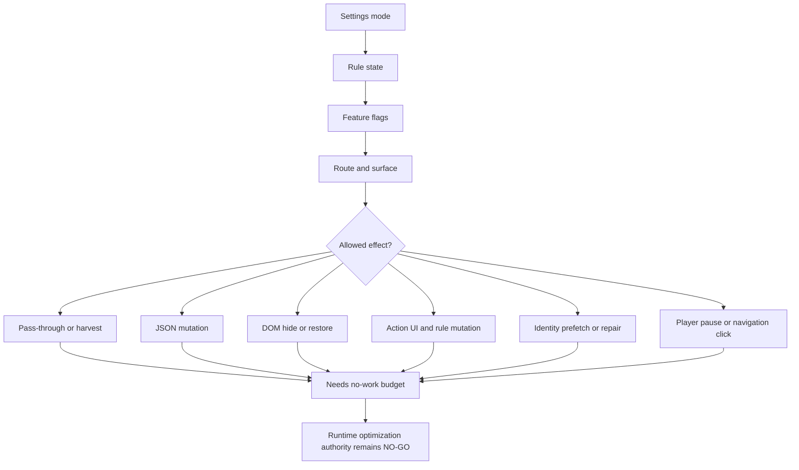

# FilterTube Mode/Surface Effect Matrix Current Behavior - 2026-05-20

Status: audit-only proof. Runtime behavior is unchanged.

This slice answers the question raised by the documented channel-identity
waterfall:

```text
XHR JSON interception -> ytInitial* snapshots -> DOM extraction -> network fetch
```

That order is useful, but it is only a source-priority model. It does not say
which effects are allowed after a source produces information. Current behavior
needs a second matrix:

```text
profile + viewing surface + list mode + route + rule state + source tier
        |
        v
allowed effects: parse, harvest, mutate JSON, hide DOM, restore DOM,
                 write learned maps, fetch identity, show quick UI,
                 count stats, pause/click navigation, do no work
```

Without that second matrix, a true statement such as "XHR JSON is preferred" can
be misread as "XHR JSON is complete everywhere" or "DOM/network work can be
deleted." The current source does not support either conclusion.

## Current Mode/Surface Matrix

| Dimension | Current behavior | Risk |
| --- | --- | --- |
| Profile choice | Background chooses `main` or `kids` from explicit request or sender URL. | The compile payload does not include one profile/viewing-space authority report. |
| Viewing-space flags | `allowMainViewing` and `allowKidsViewing` are edited in profile UI. | They are not runtime compile denial gates today. |
| Main blocklist empty state | Empty canonical rows should mean no blocklist rule work. | Stale `blocked*` aliases, content controls, lifecycle setup, endpoint harvest, and learned maps can still create work or active rules. |
| Main whitelist empty state | Empty whitelist is fail-closed for video/card surfaces. | It must not share the empty-blocklist no-work path. |
| Kids surface | Background compiles Kids lists when the sender/request is Kids. | Kids has separate public-web DOM/JSON behavior and cannot inherit all Main route assumptions. |
| YTM/mobile surface | YTM often uses video-id plus learned maps or main-world lookup. | It is not proof of complete direct JSON channel identity. |
| Watch/current video | Player JSON may provide strong `videoId -> UC` mapping, while DOM/watch resolver can still complete handle/custom URL. | Hiding, pausing, next-clicking, and watch shell changes need stricter authority than card hiding. |
| Shorts | Some Shorts JSON carries identity, but current runtime still has video-id-only paths. | Channel decisions can be late, fallback-driven, or fail-closed under whitelist. |
| Playlist/Mix | Playlist rows and Mix cards have different source semantics from normal video cards. | UC mapping may be enough for hide, but not enough for persisted channel-management identity. |
| Comments/posts | Comment and post JSON/DOM paths are not identical to video-card paths. | Whitelist video-card behavior cannot be assumed for comments/posts. |
| Quick block/menu UI | Normal 3-dot and quick-block actions are locally gated by settings and mode. | Lifecycle setup, observers, and post-action enrichment can still exist outside the visible action gate. |
| Native overlays/fullscreen | Some observers are quieted under native overlays. | There is no shared route/native overlay pause authority for all lifecycle work. |

## Why The Waterfall Is Not A Permission Model

The same source tier can currently produce different effects:

```text
YouTubei JSON:
  mutate response, harvest only, stash snapshot, write map, or do nothing

ytInitialPlayerResponse:
  learn current video owner, metadata, duration/date/category, or queue replay

DOM:
  extract visible target, hide/restore, stamp learned attributes, open menu UI,
  or provide low-confidence display-only text

Network fetch:
  resolve a clicked target, repair a watch/Shorts/Kids identity, or enrich rows
  after a successful user block
```

So the correct documentation language is:

```text
FilterTube prefers high-confidence JSON/page/player data when current runtime
knows the renderer path, uses learned maps as joins, uses DOM for visible target
and fallback confidence, and uses bounded network resolvers for unresolved
action or watch/Shorts/Kids targets.
```

It should not be documented as:

```text
XHR JSON always supplies all channel identity.
DOM and network are rare enough to delete.
No-rule or disabled mode means zero work.
```

## Current False-Hide And Lag Connections

1. **Empty install lag**: even without visible rules, endpoint hooks, harvest-only
   work, DOM lifecycle setup, stale cleanup, and learned-map writes can still run.
2. **Visible-empty false hide**: Main visible blocklist rows can be empty while
   runtime compiles stale `blockedKeywords` / `blockedChannels` aliases.
3. **Whitelist pending hides**: whitelist mode can hide newly inserted cards
   before identity is fully resolved, then later recheck.
4. **Surface mismatch**: Main, Kids, YTM, Shorts, watch, playlist, Mix, comments,
   posts, and native-app WebViews do not have the same identity availability or
   allowed side effects.
5. **Network side effects**: fetches are not a single passive fallback; some are
   action repair, some are Kids/watch/Shorts recovery, and some are post-block
   fanout.
6. **Engagement/player side effects**: watch/player enforcement can pause,
   navigate, or hide shell sections, which is a larger effect than hiding a feed
   card.

## Required Future Authority

Before changing fallback deletion, JSON-first filtering, no-work logic,
simultaneous allow/block mode, or mobile/native runtime sharing, runtime needs a
single effect decision shape:

```text
modeSurfaceEffectAuthority {
  profileId,
  profileType,
  requestedProfileType,
  senderUrl,
  viewingSpace,
  allowMainViewing,
  allowKidsViewing,
  routeSurface,
  rendererFamily,
  listMode,
  emptyPolicy,
  visibleRuleCounts,
  compiledRuleCounts,
  legacyAliasConflict,
  syncKidsToMainApplied,
  sourceTier,
  sourceConfidence,
  identityCompleteness,
  allowedEffects,
  deniedEffects,
  workBudget,
  networkPolicy,
  lifecyclePolicy,
  hidePolicy,
  restorePolicy,
  statsPolicy,
  decision
}
```

Minimum future fixtures:

1. Empty Main blocklist with no aliases performs no hide work and reports any
   remaining parse/harvest/lifecycle work.
2. Empty Main blocklist with stale aliases reports a conflict before any hide.
3. Empty whitelist remains fail-closed and route-scoped.
4. Main/Kids `allow*Viewing` denial is either enforced at runtime or documented
   as UI-only with no ambiguous policy copy.
5. YTM, Kids, Shorts, watch, playlist, Mix, comments, and posts each classify
   source confidence before hiding or fetching.
6. Quick block and 3-dot UI can mutate rules only through an action authority,
   and follow-on enrichment has a bounded fanout report.
7. Disabled/no-rule states have measured no-work budgets for seed, DOM fallback,
   quick block, menu, learned maps, and background fetches.
8. Native fullscreen/overlay/app shell state can pause route-irrelevant DOM work.

## Settings Mode Cross-Feature Continuation - 2026-05-28

This continuation records the release-optimization boundary after the lag and
visible-blocklist fixes. The important audit rule is that settings mode, rule
state, feature flag, and surface decide the allowed effect together. JSON-first
filtering cannot be promoted by treating every inactive-looking state as the
same no-work state.

```text
settings mode
        |
        v
rule state and feature flags
        |
        v
route and surface
        |
        v
allowed effect: pass through, harvest, mutate JSON, hide DOM, show action UI,
                prefetch identity, repair identity, restore, count, pause, click
        |
        v
optimization authority: NO-GO until each edge has fixtures and budgets
```



| Current state | Current cross-feature behavior | Optimization risk |
| --- | --- | --- |
| Empty blocklist | Card filtering should pass through when canonical rows are empty, but endpoint harvest, learned maps, stale cleanup, quick-block first-rule affordance, and menu lifecycle can be separate work owners. | Do not collapse empty blocklist into a global zero-work state. |
| Empty whitelist | Video/card surfaces fail closed; pending DOM hides, identity prefetch, and later recheck behavior are mode-specific effects. | Do not reuse blocklist no-work shortcuts for whitelist. |
| Disabled settings | Runtime filtering should pass through, but stale marker cleanup and startup/lifecycle ownership still need explicit zero-effect proof. | Do not delete cleanup or lifecycle paths without route/surface budgets. |
| Content-control flags | Duration, upload date, uppercase, category, comments, Shorts, home, watch, playlist, live chat, header, and shell flags can create work without keyword/channel rows. | No-rule optimization must include content-control validity and route ownership. |
| Quick block and normal menu | Visible action UI is settings-gated, but install/listener/menu-repair work and post-action identity enrichment are separate from passive filtering. | Keep action affordance, lifecycle, and post-action fanout as distinct budgets. |
| Native overlay/fullscreen/app shell | Some work is quieted locally, but there is no shared pause authority for every observer, timer, listener, or DOM fallback path. | Native quieting cannot be treated as a global lifecycle off switch. |

Runtime behavior changed by this continuation: no.

## Executable Proof

Current behavior is pinned by:

```bash
node --test tests/runtime/mode-surface-effect-matrix-current-behavior.test.mjs
```

## Method Semantic Proof Gap Boundary

`docs/audit/FILTERTUBE_METHOD_SEMANTIC_PROOF_GAP_INDEX_CURRENT_BEHAVIOR_2026-05-25.md`
is a required source input before this list/settings-mode surface can support
runtime optimization. Current proof pins:

```text
method semantic proof gap files covered: 69
method semantic proof gap lexical callables covered: 5836
files with complete per-callable semantic proof: 0
lexical callables requiring semantic proof before behavior changes: 5836
affected callable semantic proof: NO-GO
runtime behavior changed: no
```

These counts are audit-only blockers. They do not approve runtime
optimization, JSON-first behavior, whitelist behavior, settings-mode behavior,
metric collectors, artifact creation, native sync, release package changes, or
public claims.
