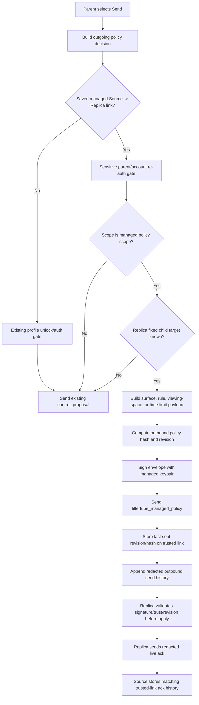

# Audit: Nanah Managed Live Signed Send

**Generated**: 2026-06-04
**Status**: Eligible live-session source send runtime slice with signed
active/full profile-policy bundle conversion, explicit Main/Kids granular
rule-source selection, connected-replica managed target selection, and redacted
outbound send/live ack history per target link/scope. Managed source sends now
require the dashboard's sensitive parent/account re-auth gate before signed
envelope construction or live send.
**Related**:
`docs/audit/FILTERTUBE_NANAH_MANAGED_SIGNING_KEYPAIR_2026-06-04.md`
**Multi-target boundary**:
`docs/audit/FILTERTUBE_NANAH_MANAGED_MULTI_TARGET_FANOUT_BOUNDARY_2026-06-04.md`
**Local-network source delivery**:
`docs/audit/FILTERTUBE_MANAGED_LOCAL_NETWORK_SOURCE_DELIVERY_2026-06-05.md`
**Mailbox source upload handoff**:
`docs/audit/FILTERTUBE_MANAGED_MAILBOX_SOURCE_UPLOAD_HANDOFF_2026-06-05.md`

## Scope

This slice converts the existing saved managed Source / Parent -> Replica send
path from an unsigned managed `control_proposal` into a signed
`filtertube_managed_policy` envelope when all of these are true:

- the local device role is `source`;
- the remote role is `replica`;
- a saved `managed_link` exists;
- the link allows the selected scope;
- the selected scope is `active`, `full`, `main`, `kids`, `keywords`,
  `channels`, `videos`, `rules_bundle`, `viewing_space`, or `time_limits`;
- the replica side has saved a fixed child target profile;
- the parent/account source session passes a sensitive-action re-auth check;
- the source has a complete local managed signing keypair.

All unsupported live sends continue through the existing proposal path.
`active` and `full` are now signed managed-policy bundle aliases only: they
expand into the existing concrete receive-side scopes `main`, `kids`,
`viewing_space`, and `time_limits` when a saved time-limit policy exists. If no
time-limit policy exists, that concrete envelope is skipped instead of failing
the whole profile-policy send. These aliases do not create a new receive-side
scope and do not send an account-wide backup tree.

## Source Boundary

`js/nanah_managed_live_policy.js` owns the fixed-target managed policy
construction, hash/revision calculation, and signed-envelope build. The
dashboard `js/tab-view.js` owns only the send-button orchestration, profile
session state dependency injection, and success/error UI.

## Runtime Flow



## Behavior Boundary

Eligible fixed-target Main/Kids, active/full profile bundles, and granular
managed live sends are now present for managed policy snapshots. Active/full
bundle sends expand into separate signed `main`, `kids`, `viewing_space`, and
optional `time_limits` envelopes, each with its own revision, hash, signature
binding, send call, and `outgoingManagedPolicies` row. Granular keyword,
channel, video, and Rule bundle payloads use an explicit Main/Kids rule-source
picker in the Nanah advanced panel. The picker defaults to the dashboard's
active Main/Kids surface when the user first selects a granular scope, so
existing active-view behavior stays intact until the parent chooses a different
source. When parent-managed child edit mode is active, the payload source is
the edited child profile while the envelope authority remains the parent source
profile.

Before any managed Source -> Replica live send builds signed envelopes, the
send handler calls `ensureNanahOutgoingAuth(policy.scope, { sensitiveAction:
true })`. That forces a fresh sensitive-action unlock for the active
parent/account source profile when it is locked or its sensitive re-auth window
has expired. Peer sends still use the ordinary outgoing profile unlock path.

`rules_bundle` is only a parent UI convenience. It does not create a new
receive-side scope and does not weaken the managed-policy envelope validator.
The helper expands it into separate signed `keywords`, `channels`, and `videos`
envelopes, each with its own revision, hash, signature binding, send call, and
`outgoingManagedPolicies` row. A saved managed link must explicitly allow all
three underlying scopes before the bundle send is accepted.

The helper can also build per-target signed envelope batches for an explicit
list of saved profile-scoped managed links. The dashboard now uses that helper
only for saved fixed-profile targets on the currently connected replica device.
The chooser appears after at least two targets are eligible for the selected
scope, defaults to the current target, and keeps hidden single-target sends on
the existing current-link path. This is live same-replica fanout only; it does
not reach offline devices or other saved devices.

After every successful low-level `nanahClient.send(...)`, `markSent(...)`
updates the trusted link's `outgoingManagedPolicies[scope]` state and appends a
bounded `filtertube_managed_outbound_policy_history` row under
`policy.outboundManagedPolicyHistory[]`. The row binds link id, target profile
id, source profile/device, scope, revision, and policy hash, but its summary is
redacted and does not store keyword values, channel names, video ids, time-budget
values, or other rule payload plaintext. This is parent-side send evidence only;
remote accepted/rejected apply history still comes from receive-side validation.
For live Nanah sessions, the replica now also sends a redacted
`filtertube_nanah_managed_live_ack` payload for accepted, idempotent, rejected,
conflict, or unavailable-apply outcomes. The source records matching ack rows
under `policy.inboundManagedAckHistory[]` only when link id, target profile,
source device, scope, revision, and policy hash match a prior
`outgoingManagedPolicies[scope]` send row. This is parent feedback/log evidence,
not policy authority.

The same trusted-link ack recorder now also accepts provider-fed mailbox and
local-network ack payloads through `recordRemoteDeliveryAckPayload(...)`.
Matching rows use `filtertube_managed_remote_delivery_ack_history` and the
`remote_policy.mailbox.ack` or `remote_policy.local_network.ack` action type.
They are accepted only when the ack matches a prior sent link/scope/revision/hash
row, and the stored summary keeps mailbox item ids or local-network candidate
ids as metadata without plaintext rule values.

The source helper can now also wrap signed envelopes as
`filtertube_managed_local_network_candidate` rows and publish them to an
optional local provider through a
`filtertube_managed_local_network_delivery_request`. Provider acceptance is
only delivery feedback: `markSent(...)` is called only for candidate ids the
provider accepted, and the protected replica still validates the signed
envelope before any policy write. This is a provider handoff, not built-in LAN
discovery or built-in LAN transport.

The source helper can also prepare ciphertext-only
`filtertube_managed_mailbox_item` rows and hand them to an optional mailbox
upload provider through a `filtertube_managed_mailbox_upload_request`. Provider
acceptance is only queued-delivery feedback: `markSent(...)` is called only for
mailbox item ids the provider accepted, and the protected replica still opens,
validates, and applies the mailbox item through the managed-policy validator.
This is a provider handoff, not a built-in mailbox server client.

This is not a mailbox runtime, built-in local-network discovery runtime,
key-rotation system, or complete offline later-delivery UI.

Still pending:

- richer bulk outbound controls for viewing-space/time-limit combinations,
  selectable Main+Kids dual-surface sends, and clearer per-target previews;
- installed-extension two-device smoke proof that live ack status renders
  clearly for every protected profile;
- installed-extension two-device smoke proof;
- key rotation/revocation UI;
- built-in server mailbox upload/pull client and dashboard offline-send UI;
- encrypted private-key-at-rest storage.

## Proof Commands

```bash
node --test tests/runtime/managed-nanah-live-signed-send-current-behavior.test.mjs \
  tests/runtime/managed-nanah-signing-keypair-current-behavior.test.mjs
npm run test:settings
```
