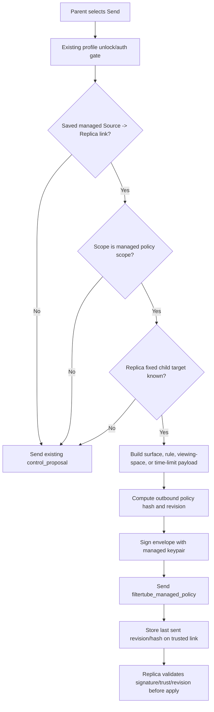

# Audit: Nanah Managed Live Signed Send

**Generated**: 2026-06-04
**Status**: Eligible live-session source send runtime slice with explicit
Main/Kids granular rule-source selection.
**Related**:
`docs/audit/FILTERTUBE_NANAH_MANAGED_SIGNING_KEYPAIR_2026-06-04.md`

## Scope

This slice converts the existing saved managed Source / Parent -> Replica send
path from an unsigned managed `control_proposal` into a signed
`filtertube_managed_policy` envelope when all of these are true:

- the local device role is `source`;
- the remote role is `replica`;
- a saved `managed_link` exists;
- the link allows the selected scope;
- the selected scope is `main`, `kids`, `keywords`, `channels`, `videos`,
  `rules_bundle`, `viewing_space`, or `time_limits`;
- the replica side has saved a fixed child target profile;
- the source has a complete local managed signing keypair.

All unsupported live sends continue through the existing proposal path. This avoids
silently widening older `active` or `full` trusted-link policy into multiple
signed child-policy writes, while allowing focused parent-control rule,
viewing-space, and time-limit updates to travel as signed managed policy.

## Source Boundary

`js/nanah_managed_live_policy.js` owns the fixed-target managed policy
construction, hash/revision calculation, and signed-envelope build. The
dashboard `js/tab-view.js` owns only the send-button orchestration, profile
session state dependency injection, and success/error UI.

## Runtime Flow



## Behavior Boundary

Eligible fixed-target Main/Kids and granular managed live sends are now present
for managed policy snapshots. Granular keyword, channel, video, and Rule bundle
payloads use an explicit Main/Kids rule-source picker in the Nanah advanced
panel. The picker defaults to the dashboard's active Main/Kids surface when the
user first selects a granular scope, so existing active-view behavior stays
intact until the parent chooses a different source. When parent-managed child
edit mode is active, the payload source is the edited child profile while the
envelope authority remains the parent source profile.

`rules_bundle` is only a parent UI convenience. It does not create a new
receive-side scope and does not weaken the managed-policy envelope validator.
The helper expands it into separate signed `keywords`, `channels`, and `videos`
envelopes, each with its own revision, hash, signature binding, send call, and
`outgoingManagedPolicies` row. A saved managed link must explicitly allow all
three underlying scopes before the bundle send is accepted.

This is not a mailbox runtime, local-network discovery runtime, key-rotation
system, or offline later-delivery mechanism.

Still pending:

- richer bulk outbound controls for viewing-space/time-limit combinations,
  per-child multi-target fanout, and selectable Main+Kids dual-surface sends;
- active/full proposal conversion policy;
- installed-extension two-device smoke proof;
- key rotation/revocation UI;
- encrypted private-key-at-rest storage.

## Proof Commands

```bash
node --test tests/runtime/managed-nanah-live-signed-send-current-behavior.test.mjs \
  tests/runtime/managed-nanah-signing-keypair-current-behavior.test.mjs
npm run test:settings
```
