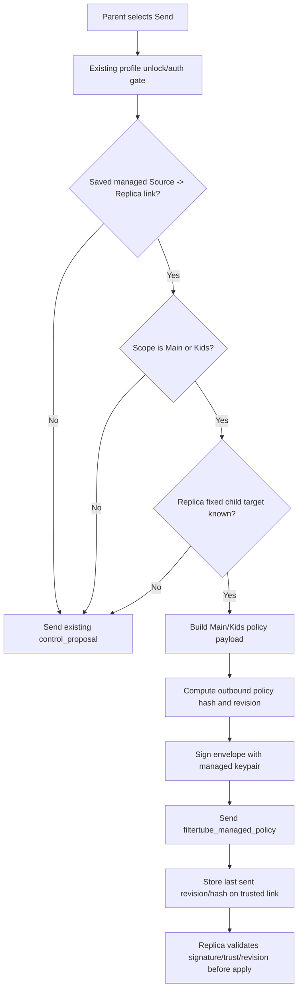

# Audit: Nanah Managed Live Signed Send

**Generated**: 2026-06-04
**Status**: Eligible live-session source send runtime slice.
**Related**:
`docs/audit/FILTERTUBE_NANAH_MANAGED_SIGNING_KEYPAIR_2026-06-04.md`

## Scope

This slice converts the existing saved managed Source / Parent -> Replica send
path from an unsigned managed `control_proposal` into a signed
`filtertube_managed_policy` envelope when all of these are true:

- the local device role is `source`;
- the remote role is `replica`;
- a saved `managed_link` exists;
- the link allows the selected scope;
- the selected scope is `main` or `kids`;
- the replica side has saved a fixed child target profile;
- the source has a complete local managed signing keypair.

All other live sends continue through the existing proposal path. This avoids
silently widening older `active` or `full` trusted-link policy into multiple
signed child-policy writes.

## Source Boundary

`js/nanah_managed_live_policy.js` owns the fixed-target managed policy
construction, hash/revision calculation, and signed-envelope build. The
dashboard `js/tab-view.js` owns only the send-button orchestration, profile
session state dependency injection, and success/error UI.

## Runtime Flow



## Behavior Boundary

Eligible fixed-target Main/Kids managed live sends are now present for managed
policy snapshots. This is not a mailbox runtime, local-network discovery
runtime, key-rotation system, or offline later-delivery mechanism.

Still pending:

- dedicated outbound controls for keyword-only, channel-only, video-only,
  viewing-space, and time-limit managed envelopes;
- active/full proposal conversion policy;
- installed-extension two-device smoke proof;
- key rotation/revocation UI;
- encrypted private-key-at-rest storage.

## Proof Commands

```bash
node --test tests/runtime/managed-nanah-live-signed-send-current-behavior.test.mjs \
  tests/runtime/managed-nanah-signing-keypair-current-behavior.test.mjs
npm run test:settings
```
