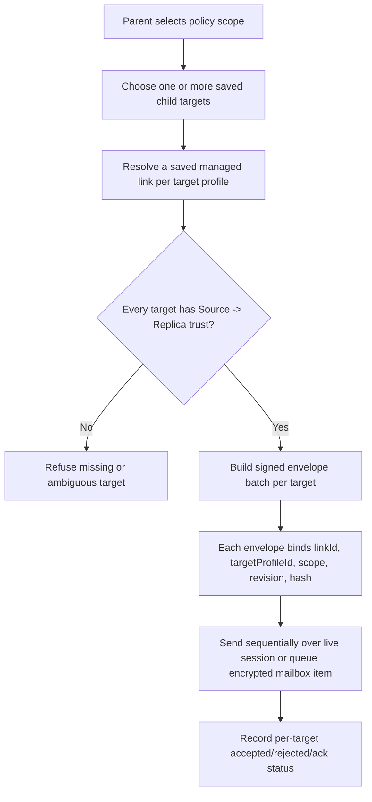

# Audit: Nanah Managed Multi-Target Fanout Boundary

**Generated**: 2026-06-04
**Status**: Boundary contract only. Runtime multi-target fanout remains
disabled because current trusted-link lookup is device-scoped, not
device-plus-target-profile scoped.
**Related live-send proof**:
`docs/audit/FILTERTUBE_NANAH_MANAGED_LIVE_SIGNED_SEND_2026-06-04.md`
**Related plan**:
`docs/audit/FILTERTUBE_LOCAL_NETWORK_MANAGED_PARENT_CONTROLS_PLAN_2026-06-03.md`

## Purpose

Parents and caregivers may need to update more than one protected profile:
for example three children on the same replica device, or three child devices
that should all receive the same keyword, channel, video, viewing-space, or
time-limit policy.

The current live Nanah runtime can safely send signed managed policy envelopes
to one connected replica target. It must not expose a bulk target UI until the
trusted-link model can distinguish which child profile a saved authority record
belongs to. Otherwise a device-level saved link could be reused for a sibling
profile that the parent did not explicitly pair and approve.

## Current Runtime Evidence

Current behavior in `js/tab-view.js`:

```text
findNanahTrustedLink(remoteDeviceId)
  -> returns first trusted row matching remoteDeviceId

getNanahCurrentTrustedLink()
  -> calls findNanahTrustedLink(remote device id)

saveNanahTrustedLink(entry)
  -> replaces an existing row by remoteDeviceId

trustConnectedNanahDevice()
  -> writes linkId as nanah-${remoteDeviceId}
```

Current behavior in `js/nanah_managed_live_policy.js`:

```text
resolveTargetProfile(trustedLink)
  -> first uses trustedLink.policy.targetProfileId when fixed
  -> otherwise uses replica hello target profile
  -> returns null when no fixed protected target is known
```

That is correct for one saved target per connected device. It is not enough for
bulk fanout.

## Required Identity Upgrade

Multi-target fanout requires link identity to include both the device and the
protected target profile:

```text
managed authority key =
  remoteDeviceId
  + localRole/remoteRole
  + sourceDeviceId/sourceProfileId/sourcePublicKeyId/keyVersion
  + targetProfileId
  + allowedScopes
```

The future link id can be deterministic, but it must be profile-scoped. A
device-level id such as `nanah-${remoteDeviceId}` cannot safely represent
several children on the same device.

## Safe Future Flow



ASCII boundary:

```text
requested fanout
  -> target A has profile-scoped trusted link? yes -> signed envelope A
  -> target B has profile-scoped trusted link? yes -> signed envelope B
  -> target C missing trusted link? stop or skip with protected rejection row
```

## UI/UX Boundary

The parent-facing UI should stay simple:

- Single-target remains the default.
- Bulk send appears only after at least two saved profile-scoped child targets
  are eligible for the selected scope.
- Targets should show child name, remote device label, last accepted revision,
  open-sync status, and whether the selected scope is allowed.
- The confirmation copy should say exactly how many profiles will receive the
  update and which profiles are skipped.
- The UI must never imply that a live Nanah session can reach offline devices;
  offline devices require encrypted mailbox or local-network provider delivery.

## Non-Negotiable Runtime Gates

- A device-level trusted link is not enough for multi-target authority.
- Each target must have its own target profile binding.
- Each envelope must carry its own `targetProfileId`, `linkId`, revision, hash,
  and signature.
- Mark-sent state must be stored per target link and scope.
- Ack/status history must be per target, not a single bulk success toast.
- Missing, ambiguous, revoked, stale, or wrong-scope links must reject before
  any low-level apply path.

## Current Pending Runtime Work

```text
runtime profile-scoped trusted link id: absent
runtime multi-target chooser: absent
runtime signed fanout envelope builder: absent
runtime per-target mark-sent state: absent
runtime per-target ack/history summary: absent
runtime mailbox/local-network fanout delivery: absent
```

Runtime behavior changed by this proof: no.

## Proof Commands

```bash
node --test tests/runtime/managed-nanah-live-signed-send-current-behavior.test.mjs
npm run test:settings
```
