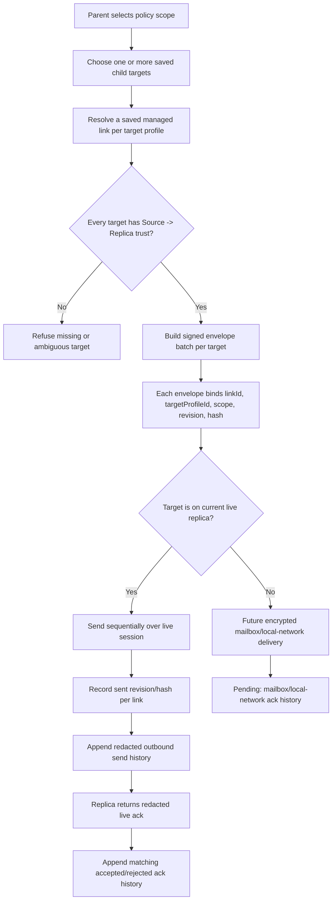

# Audit: Nanah Managed Multi-Target Fanout Boundary

**Generated**: 2026-06-04
**Status**: Profile-scoped identity foundation present; connected-device target
chooser, live same-replica fanout send loop, and redacted per-target outbound
send and live ack history present. Boundary contract still active for mailbox
delivery, local-network delivery, and offline later delivery.
**Related live-send proof**:
`docs/audit/FILTERTUBE_NANAH_MANAGED_LIVE_SIGNED_SEND_2026-06-04.md`
**Related plan**:
`docs/audit/FILTERTUBE_LOCAL_NETWORK_MANAGED_PARENT_CONTROLS_PLAN_2026-06-03.md`

## Purpose

Parents and caregivers may need to update more than one protected profile:
for example three children on the same replica device, or three child devices
that should all receive the same keyword, channel, video, viewing-space, or
time-limit policy.

The current live Nanah runtime can safely send signed managed policy envelopes
to one or more saved fixed child/profile targets on the currently connected
replica device. Trusted-link storage and lookup can distinguish fixed targets on
the same remote device, and the dashboard now exposes a bounded target chooser
only when at least two saved profile-scoped targets on that connected replica
are eligible for the selected scope.

The runtime still must not claim offline or cross-device fanout. A live Nanah
data channel reaches the current remote session only. Other saved devices need a
future encrypted mailbox or local-network provider. Source-side outbound send
history and live accepted/rejected ack history are present, but mailbox and
local-network ack history are still pending before a parent gets a complete
offline applied/rejected delivery ledger.

## Current Runtime Evidence

Current behavior in `js/tab-view.js`:

```text
buildNanahProfileScopedLinkId(remoteDeviceId, targetProfileId)
  -> builds nanah-${remoteDeviceId}-target-${targetProfileId}
     for fixed managed links

getNanahTrustedLinkIdentityKey(entry)
  -> includes remoteDeviceId + local/remote roles + link type
  -> adds targetProfileId for fixed managed links

saveNanahTrustedLink(entry)
  -> replaces an existing row by exact link id or trustedLinkIdentityKey
  -> no longer collapses all fixed child targets on one remoteDeviceId

findNanahTrustedLink(remoteDeviceId, options = {})
  -> can prefer exact linkId and targetProfileId before fallback

findNanahTrustedLinkForManagedEnvelope(envelope)
  -> exact link id first
  -> then sourceDeviceId + targetProfileId managed-link lookup

getNanahManagedDuplicateDeviceIds(sourceDeviceId, linkId, targetProfileId)
  -> treats same source device + different target profile as allowed
  -> still flags ambiguous or same-target duplicate source authority

getNanahEligibleManagedTargetLinks(scope)
  -> filters saved links to the currently connected remoteDeviceId
  -> requires Source -> Replica managed_link roles
  -> requires fixed targetProfileId
  -> requires the selected scope or Rule bundle child scopes to be allowed

syncNanahManagedTargetOptions(scope)
  -> shows the dashboard chooser only after at least two eligible targets
  -> defaults to the current target link or the first eligible target
  -> keeps single-target sends on the existing current-link path

getNanahSelectedManagedTargetLinks(scope)
  -> returns explicit checked target links while the chooser is visible
  -> returns no links when the chooser is hidden, preserving single-target send
```

Current behavior in `js/nanah_managed_live_policy.js`:

```text
resolveTargetProfile(trustedLink)
  -> first uses trustedLink.policy.targetProfileId when fixed
  -> otherwise uses replica hello target profile
  -> returns null when no fixed protected target is known

buildEnvelopeBatchForTrustedLinks(policy, trustedLinks)
  -> accepts explicit saved managed links
  -> expands selected scope or Rule bundle per target
  -> signs each envelope with its own linkId, targetProfileId, scope,
     revision, hash, and integrity binding
  -> is now used by the dashboard for selected targets on the connected replica

markSent(linkId, scope, revision, policyHash, options)
  -> records last sent revision/hash per link and scope
  -> appends one redacted outbound history row per sent envelope
  -> accepts matching redacted live ack payloads from the replica
  -> appends one redacted live ack history row per matching sent envelope
```

That is correct for single-target signed sends and for storing multiple fixed
targets from one trusted remote device. It now provides a bounded live fanout UI
for same-replica sessions, but it is still not enough for offline, mailbox, or
local-network fanout claims.

## Required Identity Upgrade

Multi-target fanout requires link identity to include both the device and the
protected target profile. The runtime now covers the minimum identity key:

```text
managed authority key =
  remoteDeviceId
  + localRole/remoteRole
  + targetProfileId
```

Each live same-replica fanout target still needs the full per-target send
authority:

```text
fanout target authority =
  trustedLinkIdentityKey
  + sourceDeviceId/sourceProfileId/sourcePublicKeyId/keyVersion
  + allowedScopes
  + selected scope
  + last accepted/sent revision
```

A device-level id such as `nanah-${remoteDeviceId}` cannot safely represent
several children on the same device. The normalizer now upgrades legacy default
managed ids to `nanah-${remoteDeviceId}-target-${targetProfileId}` when the
policy has a fixed target profile, while preserving explicit custom link ids.

## Safe Future Flow



ASCII boundary:

```text
requested fanout
  -> target A has profile-scoped trusted link? yes -> signed envelope A
  -> target B has profile-scoped trusted link? yes -> signed envelope B
  -> target C missing trusted link? do not show as selectable live target
```

## UI/UX Boundary

The parent-facing UI should stay simple:

- Single-target remains the default.
- Bulk send appears only after at least two saved profile-scoped child targets
  on the connected replica are eligible for the selected scope.
- Targets should show child name, remote device label, last accepted revision,
  open-sync status, and whether the selected scope is allowed.
- The success copy says how many selected target profiles received a live send.
  Live accepted/rejected ack rows can now update trusted-link history when the
  replica replies.
- The UI must never imply that a live Nanah session can reach offline devices;
  offline devices require encrypted mailbox or local-network provider delivery.

## Non-Negotiable Runtime Gates

- A device-level trusted link is still not enough for multi-target authority.
- Each target must have its own target profile binding.
- Each envelope must carry its own `targetProfileId`, `linkId`, revision, hash,
  and signature.
- Mark-sent state must be stored per target link and scope.
- Outbound send history must be per target, not a single bulk success toast.
- Accepted/rejected live ack history must also be per target before claiming
  applied delivery status for a connected same-session replica.
- Mailbox/local-network ack history must also be per target before claiming
  applied delivery status for offline or non-connected protected profiles.
- Missing, ambiguous, revoked, stale, or wrong-scope links must reject before
  any low-level apply path.

## Current Pending Runtime Work

```text
runtime profile-scoped trusted link id: present
runtime connected-device multi-target chooser: present
runtime signed fanout envelope builder: present
runtime signed fanout send loop: present for selected targets on the connected replica only
runtime per-target mark-sent state: present per envelope linkId/scope
runtime per-target outbound send history: present
runtime per-target accepted/rejected live ack history: present
runtime mailbox/local-network fanout delivery: absent
```

Runtime behavior changed by this proof: yes, the dashboard can now choose
multiple saved fixed-profile targets on the connected replica and send signed
managed envelopes for each selected link. Offline device fanout, local-network
fanout, and mailbox/local-network per-target ack history remain pending.

## Proof Commands

```bash
node --test tests/runtime/managed-nanah-live-signed-send-current-behavior.test.mjs
npm run test:settings
```
