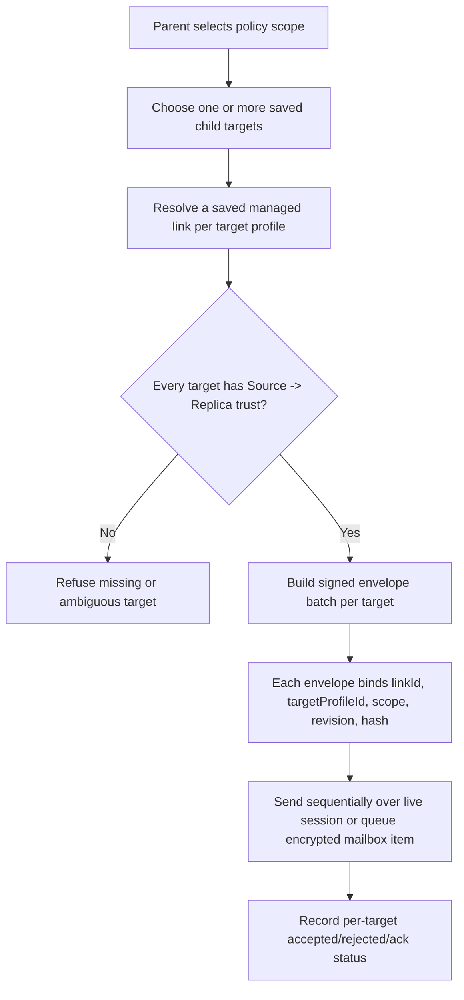

# Audit: Nanah Managed Multi-Target Fanout Boundary

**Generated**: 2026-06-04
**Status**: Profile-scoped identity foundation present; boundary contract still
active. Runtime multi-target fanout remains disabled because the dashboard does
not yet expose a target chooser, live-session fanout send loop, or per-target
ack/history summary.
**Related live-send proof**:
`docs/audit/FILTERTUBE_NANAH_MANAGED_LIVE_SIGNED_SEND_2026-06-04.md`
**Related plan**:
`docs/audit/FILTERTUBE_LOCAL_NETWORK_MANAGED_PARENT_CONTROLS_PLAN_2026-06-03.md`

## Purpose

Parents and caregivers may need to update more than one protected profile:
for example three children on the same replica device, or three child devices
that should all receive the same keyword, channel, video, viewing-space, or
time-limit policy.

The current live Nanah runtime can safely send signed managed policy envelopes
to one connected replica target. Trusted-link storage and lookup can now
distinguish fixed child/profile targets on the same remote device, but the
dashboard must not expose a bulk target UI until target selection, live-session
fanout send wiring, and per-target status/history are implemented. Otherwise a
bulk action could still overclaim delivery or hide a skipped/rejected child
target behind one success toast. The helper-level per-target envelope batcher is
now present as a non-UI primitive only.

## Current Runtime Evidence

Current behavior in `js/tab-view.js`:

```text
buildNanahProfileScopedLinkId(remoteDeviceId, targetProfileId)
  -> builds nanah-${remoteDeviceId}-target-${targetProfileId}
     for fixed managed links

getNanahTrustedLinkIdentityKey(entry)
  -> includes remoteDeviceId + local/remote roles + link type
  -> adds targetProfileId for fixed managed links

saveNanahTrustedLink(entry)
  -> replaces an existing row by exact link id or trustedLinkIdentityKey
  -> no longer collapses all fixed child targets on one remoteDeviceId

findNanahTrustedLink(remoteDeviceId, options = {})
  -> can prefer exact linkId and targetProfileId before fallback

findNanahTrustedLinkForManagedEnvelope(envelope)
  -> exact link id first
  -> then sourceDeviceId + targetProfileId managed-link lookup

getNanahManagedDuplicateDeviceIds(sourceDeviceId, linkId, targetProfileId)
  -> treats same source device + different target profile as allowed
  -> still flags ambiguous or same-target duplicate source authority
```

Current behavior in `js/nanah_managed_live_policy.js`:

```text
resolveTargetProfile(trustedLink)
  -> first uses trustedLink.policy.targetProfileId when fixed
  -> otherwise uses replica hello target profile
  -> returns null when no fixed protected target is known

buildEnvelopeBatchForTrustedLinks(policy, trustedLinks)
  -> accepts explicit saved managed links
  -> expands selected scope or Rule bundle per target
  -> signs each envelope with its own linkId, targetProfileId, scope,
     revision, hash, and integrity binding
  -> does not send, choose targets, or record per-target ack/history
```

That is correct for single-target signed sends and for storing multiple fixed
targets from one trusted remote device. It provides the envelope-building
primitive for future fanout, but it is still not enough for bulk fanout UI.

## Required Identity Upgrade

Multi-target fanout requires link identity to include both the device and the
protected target profile. The runtime now covers the minimum identity key:

```text
managed authority key =
  remoteDeviceId
  + localRole/remoteRole
  + targetProfileId
```

Future fanout still needs the full per-target send authority:

```text
fanout target authority =
  trustedLinkIdentityKey
  + sourceDeviceId/sourceProfileId/sourcePublicKeyId/keyVersion
  + allowedScopes
  + selected scope
  + last accepted/sent revision
```

A device-level id such as `nanah-${remoteDeviceId}` cannot safely represent
several children on the same device. The normalizer now upgrades legacy default
managed ids to `nanah-${remoteDeviceId}-target-${targetProfileId}` when the
policy has a fixed target profile, while preserving explicit custom link ids.

## Safe Future Flow



ASCII boundary:

```text
requested fanout
  -> target A has profile-scoped trusted link? yes -> signed envelope A
  -> target B has profile-scoped trusted link? yes -> signed envelope B
  -> target C missing trusted link? stop or skip with protected rejection row
```

## UI/UX Boundary

The parent-facing UI should stay simple:

- Single-target remains the default.
- Bulk send appears only after at least two saved profile-scoped child targets
  are eligible for the selected scope.
- Targets should show child name, remote device label, last accepted revision,
  open-sync status, and whether the selected scope is allowed.
- The confirmation copy should say exactly how many profiles will receive the
  update and which profiles are skipped.
- The UI must never imply that a live Nanah session can reach offline devices;
  offline devices require encrypted mailbox or local-network provider delivery.

## Non-Negotiable Runtime Gates

- A device-level trusted link is still not enough for multi-target authority.
- Each target must have its own target profile binding.
- Each envelope must carry its own `targetProfileId`, `linkId`, revision, hash,
  and signature.
- Mark-sent state must be stored per target link and scope.
- Ack/status history must be per target, not a single bulk success toast.
- Missing, ambiguous, revoked, stale, or wrong-scope links must reject before
  any low-level apply path.

## Current Pending Runtime Work

```text
runtime profile-scoped trusted link id: present
runtime multi-target chooser: absent
runtime signed fanout envelope builder: helper present, UI path absent
runtime per-target mark-sent state: absent
runtime per-target ack/history summary: absent
runtime mailbox/local-network fanout delivery: absent
```

Runtime behavior changed by this proof: yes, trusted-link storage and lookup now
distinguish fixed managed target profiles, and the helper can build per-target
signed envelope batches. Bulk fanout remains disabled.

## Proof Commands

```bash
node --test tests/runtime/managed-nanah-live-signed-send-current-behavior.test.mjs
npm run test:settings
```
