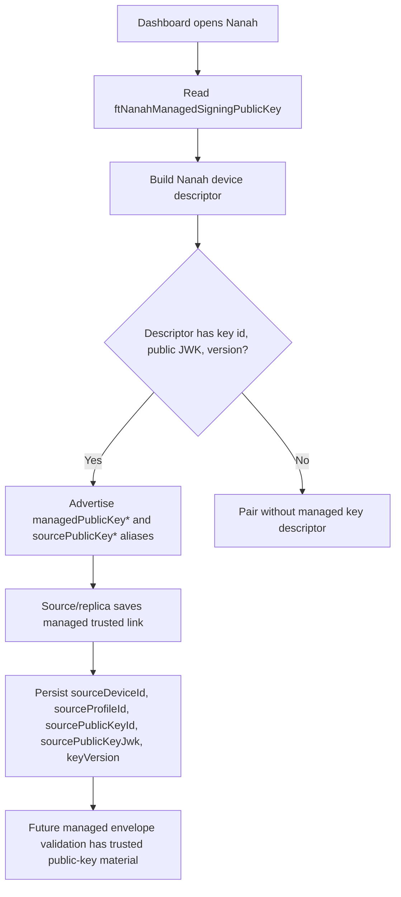

# Audit: Nanah Managed Pairing Key Descriptor

**Generated**: 2026-06-04
**Status**: Runtime descriptor persistence slice. A later same-day keypair
provisioning slice now exists, but this document remains the public descriptor
boundary and does not claim live outgoing managed-policy delivery.
**Related plan**:
`docs/audit/FILTERTUBE_LOCAL_NETWORK_MANAGED_PARENT_CONTROLS_PLAN_2026-06-03.md`
**Related inventory**:
`docs/audit/FILTERTUBE_RELEASE_PROFILE_NANAH_MANAGED_PARENT_AUTHORITY_INVENTORY_2026-06-03.md`
**Related signing-key proof**:
`docs/audit/FILTERTUBE_NANAH_MANAGED_SIGNING_KEYPAIR_2026-06-04.md`

## Purpose

Managed parent or caregiver policy envelopes already require trusted source
device, source profile, target profile, scope, revision, hash, and signature
evidence before apply. Before live P2P/local-network remote updates can become
automatic, the replica must have a stable way to remember the source public key
that belongs to a trusted managed link.

This slice adds the first public-key descriptor plumbing:

- Dashboard Nanah startup reads `ftNanahManagedSigningPublicKey`.
- Nanah device hello descriptors can advertise a managed public-key descriptor
  when one is already provisioned.
- Managed trusted links persist source device/profile/public-key metadata when
  the connected source provides it.
- Receive-side validation can continue using the existing trusted-link
  `sourcePublicKeyJwk` verifier path.

It intentionally does not add mailbox delivery, automatic remote admin
sessions, signed live sends, key rotation, or key revocation. Keypair
provisioning and an adapter signing helper are covered by the related
same-day signing-key proof.

## Runtime Shape



## Stored Descriptor

The local descriptor key is:

```text
ftNanahManagedSigningPublicKey
```

Accepted descriptor fields:

```json
{
  "managedPublicKeyId": "parent-key-3",
  "managedPublicKeyJwk": {
    "kty": "OKP",
    "crv": "Ed25519",
    "x": "base64url-public-key"
  },
  "managedKeyVersion": 3
}
```

The Nanah adapter emits both managed names and source aliases:

```json
{
  "managedPublicKeyId": "parent-key-3",
  "managedPublicKeyJwk": {},
  "managedKeyVersion": 3,
  "sourcePublicKeyId": "parent-key-3",
  "sourcePublicKeyJwk": {},
  "keyVersion": 3
}
```

The aliases let existing managed-envelope validation consume the same trusted
link key fields without adding a second authority model.

## Trusted-Link Binding

Managed trusted-link saves now keep the source binding when key material is
available:

```text
sourceDeviceId
sourceProfileId
sourcePublicKeyId
sourcePublicKeyJwk
keyVersion
```

The same fields are mirrored inside `policy` so normalization can recover them
from either the trusted-link root or policy object.

## Boundaries

This descriptor slice is not enough to enable automatic remote policy writes by
itself.
The following remain pending:

- protected or encrypted private-key storage
- dashboard live send conversion from `control_proposal` to signed
  `filtertube_managed_policy`
- canonical payload hash recomputation
- key rotation and revocation UI
- mailbox pull/ack runtime
- live signed-envelope smoke through installed extension sessions

If no public key descriptor exists, managed envelopes still fail closed through
the existing missing-key or missing-verifier gates.

## Proof Commands

```bash
node --test tests/runtime/managed-nanah-pairing-key-descriptor-current-behavior.test.mjs
npm run test:settings
```
