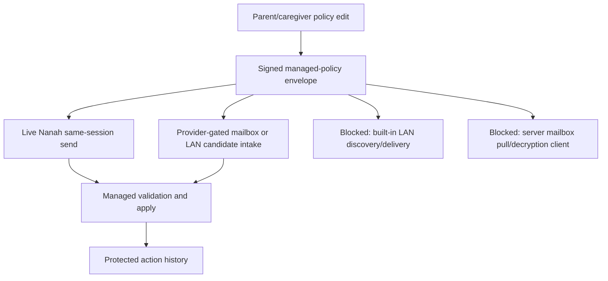

# Gate: Managed Remote Delivery Readiness

**Generated**: 2026-06-05
**Status**: Remote policy authority, validation, local apply, action history,
provider-gated mailbox intake, and provider-gated local-network candidate intake
are present. Complete remote delivery is still blocked on transport proof.
**Runtime behavior changed**: no.
**Goal slice**: Implementation order items 2, 10, 11, 14, and the transport
side of "Trusted parent/caregiver devices can update protected-device policy
through Nanah P2P or local-network management."
**Related proofs**:
`docs/audit/FILTERTUBE_LOCAL_NETWORK_MANAGED_PROVIDER_HOOK_2026-06-05.md`,
`docs/audit/FILTERTUBE_NANAH_MANAGED_PULL_ON_OPEN_2026-06-04.md`,
`docs/audit/FILTERTUBE_MANAGED_POLICY_ENCRYPTED_MAILBOX_PROTOCOL_2026-06-04.md`,
`docs/audit/FILTERTUBE_LOCAL_NETWORK_DISCOVERY_AUTHORITY_BOUNDARY_2026-06-03.md`,
and
`docs/audit/FILTERTUBE_RELEASE_PROFILE_NANAH_MANAGED_PARENT_AUTHORITY_INVENTORY_2026-06-03.md`.

## Purpose

The managed-control system now has strong policy authority gates. A signed
`filtertube_managed_policy` can be validated and applied only when the saved
managed link, target profile, source device, source profile, scope, key id,
revision, policy hash, and signature evidence all match.

That is not the same as complete remote delivery. This gate keeps the product
and release language honest until the transport layer has its own proof.

## Current Delivery State

```text
parent policy editor
  -> signed managed-policy envelope
  -> live Nanah same-session send when available
  -> provider-gated mailbox/local-network intake when a trusted provider exists
  -> validated managed apply
  -> protected action history
```

Mermaid:



## What Can Be Claimed Now

Allowed release wording:

- local parent-managed child/protected-profile edits are supported;
- managed policy validation and apply are signature/revision gated;
- live Nanah managed-policy sends are available only for eligible connected
  sessions;
- protected devices keep the last accepted policy when delivery is unavailable;
- provider-gated local-network candidate intake exists;
- provider-gated pull-on-open intake exists for already-decrypted mailbox
  items;
- local-network discovery is not authority.

Blocked release wording until this gate turns green:

- complete remote local-network management;
- always-on parent-to-child sync;
- server mailbox delivery;
- automatic LAN peer discovery;
- guaranteed later delivery after the parent device goes offline;
- remote management across desktop and apps without installed two-device smoke.

## Manifest And Permission Boundary

The extension manifests currently keep host access scoped to YouTube-owned
surfaces. They do not request `<all_urls>`, `http://*/*`, `https://*/*`,
`http://localhost/*`, `http://127.0.0.1/*`, `http://*.local/*`, or broad LAN
origin access.

That is intentional. Adding built-in LAN HTTP/WebSocket fetch from an extension
page would require a separate permission review and likely optional host
permission design. A native app or trusted local provider can own LAN discovery
without broadening the extension's YouTube hot path.

## Green Criteria

Complete remote delivery is not release-ready until all rows below are true:

| Gate | Required evidence |
| --- | --- |
| Transport capability | Chosen transport is explicit: live Nanah, native app LAN provider, optional browser host-permission flow, or encrypted mailbox. |
| Permission boundary | Manifest/optional-permission proof shows no accidental broad LAN or all-URL host grants. |
| Identity binding | Delivery carries link id, source device, source profile, target profile, key id/version, scope, revision, policy hash, and signature. |
| Authority reuse | Every delivered item still enters `validateManagedPolicyEnvelope(...)`, `validateManagedMailboxItem(...)`, or `validateManagedLocalNetworkCandidate(...)`. |
| Replay/revocation | Stale, equal-revision conflict, revoked link, revoked key, wrong source, wrong target, and wrong key fixtures pass. |
| Ack/history | Parent-facing accepted/rejected ack history exists for the transport without plaintext rule values. |
| No-work performance | Empty/no-provider/no-policy states do not add YouTube observers, timers, DOM scans, JSON work, or network fetches. |
| Installed smoke | Two-device installed smoke proves parent edit to child apply for keyword, channel, video, viewing-space, and time-limit policies. |
| App parity | Android and iOS native surfaces consume the shared policy contract and enforce route/time gates before managed web content opens. |

## Current Decision

```text
remote policy authority: GO
live same-session Nanah send: PARTIAL
provider-gated mailbox/local-network intake: PARTIAL
built-in LAN peer discovery: NO-GO
built-in LAN delivery: NO-GO
server mailbox pull client: NO-GO
mailbox decryption client: NO-GO
release claim for complete remote management: NO-GO
```

This gate intentionally favors a staged rollout. The extension can keep using
the validated provider hooks and live Nanah path while the product waits for
transport-specific proof before claiming complete remote management.

## Verification

Focused proof:

```bash
node --test tests/runtime/managed-policy-sync-remote-delivery-readiness-gate-current-behavior.test.mjs
```

Settings lane:

```bash
npm run test:settings
```
