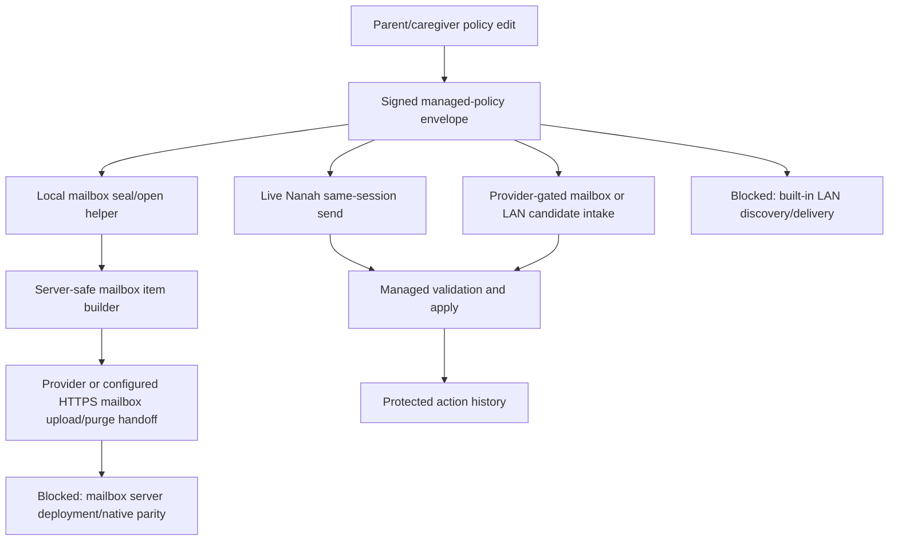

# Gate: Managed Remote Delivery Readiness

**Generated**: 2026-06-05
**Status**: Remote policy authority, validation, local apply, action history,
source-side mailbox seal/open encryption helpers, source-side server-safe
mailbox storage preparation, source-side mailbox upload/purge provider
handoffs, explicitly configured browser HTTPS mailbox upload/pull/purge client,
provider-gated mailbox intake, and provider-gated local-network candidate intake
are present. Configured mailbox/Home Bridge provider clients now have executable
request/response sanitization proof. A self-hosted in-memory reference provider
now exists to prove the explicit Internet Pickup/Home Bridge endpoint contract.
Complete remote delivery is still blocked on server deployment,
LAN transport proof, native parity, and installed two-device smoke. This includes
the unresolved hosted service deployment and automatic LAN discovery design work.
**Runtime behavior changed**: yes, source-side mailbox seal/open helpers,
storage item building, upload-provider handoff, purge-provider handoff, and
configured dashboard HTTPS mailbox client only; no YouTube hot-path runtime
changed.
**Goal slice**: Implementation order items 2, 10, 11, 14, and the transport
side of "Trusted parent/caregiver devices can update protected-device policy
through Nanah P2P or local-network management."
**Related proofs**:
`docs/audit/FILTERTUBE_LOCAL_NETWORK_MANAGED_PROVIDER_HOOK_2026-06-05.md`,
`docs/audit/FILTERTUBE_NANAH_MANAGED_PULL_ON_OPEN_2026-06-04.md`,
`docs/audit/FILTERTUBE_MANAGED_POLICY_ENCRYPTED_MAILBOX_PROTOCOL_2026-06-04.md`,
`docs/audit/FILTERTUBE_LOCAL_NETWORK_DISCOVERY_AUTHORITY_BOUNDARY_2026-06-03.md`,
`docs/audit/FILTERTUBE_MANAGED_TRANSPORT_APP_PARITY_GATE_2026-06-05.md`,
and
`docs/audit/FILTERTUBE_RELEASE_PROFILE_NANAH_MANAGED_PARENT_AUTHORITY_INVENTORY_2026-06-03.md`.

## Purpose

The managed-control system now has strong policy authority gates. A signed
`filtertube_managed_policy` can be validated and applied only when the saved
managed link, target profile, source device, source profile, scope, key id,
revision, policy hash, and signature evidence all match.

That is not the same as complete remote delivery. This gate keeps the product
and release language honest until the transport layer has its own proof.

## Current Delivery State

```text
parent policy editor
  -> signed managed-policy envelope
  -> optional local WebCrypto seal into server-safe mailbox storage item
  -> live Nanah same-session send when available
  -> optional provider or configured HTTPS mailbox upload/purge handoff for encrypted mailbox metadata
  -> provider-gated or configured HTTPS mailbox/local-network intake
  -> validated managed apply
  -> protected action history
```

Mermaid:



## What Can Be Claimed Now

Allowed release wording:

- local parent-managed child/protected-profile edits are supported;
- managed policy validation and apply are signature/revision gated;
- live Nanah managed-policy sends are available only for eligible connected
  sessions;
- protected devices keep the last accepted policy when delivery is unavailable;
- source-side mailbox storage items can be locally sealed/opened without
  plaintext policy fields entering mailbox storage;
- source-side encrypted-mailbox upload and purge are available only as
  provider-gated handoffs after parent/account re-auth;
- provider-gated local-network candidate intake exists for trusted links that
  explicitly allow protected-device saved-update collection;
- provider-gated pull-on-open intake exists for already-decrypted mailbox
  items;
- local-network discovery is not authority.

Blocked release wording until this gate turns green:

- complete remote local-network management;
- always-on parent-to-child sync;
- mailbox server delivery without explicit endpoint configuration and installed
  smoke proof;
- automatic LAN peer discovery;
- guaranteed later delivery after the parent device goes offline;
- remote management across desktop and apps without installed two-device smoke;
- managed list subscriptions/imports without parent approval, source metadata,
  revision/hash evidence, and installed delivery proof.

## Manifest And Permission Boundary

The extension manifests currently keep host access scoped to YouTube-owned
surfaces. They do not request `<all_urls>`, `http://*/*`, `https://*/*`,
`http://localhost/*`, `http://127.0.0.1/*`, `http://*.local/*`, or broad LAN
origin access.

That is intentional. Adding built-in LAN HTTP/WebSocket fetch from an extension
page would require a separate permission review and likely optional host
permission design. A native app or trusted local provider can own LAN discovery
without broadening the extension's YouTube hot path.

## Green Criteria

Complete remote delivery is not release-ready until all rows below are true:

| Gate | Required evidence |
| --- | --- |
| Transport capability | Chosen transport is explicit: live Nanah, native app LAN provider, optional browser host-permission flow, or encrypted mailbox. |
| Permission boundary | Manifest/optional-permission proof shows no accidental broad LAN or all-URL host grants. |
| Identity binding | Delivery carries link id, source device, source profile, target profile, key id/version, scope, revision, policy hash, and signature. |
| Authority reuse | Every delivered item still enters `validateManagedPolicyEnvelope(...)`, `validateManagedMailboxItem(...)`, or `validateManagedLocalNetworkCandidate(...)`. |
| Replay/revocation | Stale, equal-revision conflict, revoked link, revoked key, wrong source, wrong target, and wrong key fixtures pass. |
| Ack/history | Parent-facing accepted/rejected ack history exists for the transport without plaintext rule values. |
| No-work performance | Empty/no-provider/no-policy states do not add YouTube observers, timers, DOM scans, JSON work, or network fetches. |
| Installed smoke | Two-device installed smoke proves parent edit to child apply for keyword, channel, video, viewing-space, and time-limit policies. |
| App parity | Android and iOS native surfaces consume the shared policy contract and enforce route/time gates before managed web content opens. |

## Managed Remote Delivery Smoke Artifact

This gate now has an executable manual smoke artifact contract:

```text
docs/audit/artifacts/managed-remote-delivery-smoke/template.json
docs/audit/artifacts/managed-remote-delivery-smoke/verify-managed-smoke-artifact.mjs
```

The verifier accepts only executed artifacts with parent and child installed
extension parity, manual installed-extension evidence, passed automated lane
evidence, one explicit transport mode, and all managed remote-delivery rows
passed. Manual evidence records the already-tested parent dashboard surface,
child YouTube surface, and redacted managed action-history surface so a human
smoke pass becomes repeatable release proof instead of an informal memory. A
valid artifact proves one transport slice, not complete remote-management
release readiness across all transport modes.

Provider transports must also record a provider proof block. `live_nanah` must
record `providerKind: none`; `encrypted_mailbox` must record an explicitly
configured public HTTPS Internet Pickup endpoint plus CORS/preflight proof; and
`local_network_provider` must record an explicitly configured Home Bridge
endpoint using HTTPS or private/local HTTP. If the reference provider is used,
the artifact must name `scripts/managed-delivery-provider.mjs` and
`docs/audit/FILTERTUBE_MANAGED_DELIVERY_REFERENCE_PROVIDER_2026-06-20.md`.
Every provider proof must show `automaticDiscoveryObserved: false` and
`hostedServiceClaimed: false`, because the current extension still does not
own automatic LAN discovery or a hosted Internet Pickup deployment.

Required smoke rows:

```text
FT-MANAGED-REMOTE-00-trust-link-preflight
FT-MANAGED-REMOTE-01-keyword-policy-apply
FT-MANAGED-REMOTE-02-channel-policy-apply
FT-MANAGED-REMOTE-03-video-policy-apply
FT-MANAGED-REMOTE-04-viewing-space-gate
FT-MANAGED-REMOTE-05-time-limit-policy
FT-MANAGED-REMOTE-06-offline-last-policy
FT-MANAGED-REMOTE-07-revoked-replay-reject
FT-MANAGED-REMOTE-08-action-history-redaction
FT-MANAGED-REMOTE-09-command-center-conflict-review
FT-MANAGED-REMOTE-10-key-rotation-repair-status
FT-MANAGED-REMOTE-11-no-work-idle
FT-MANAGED-REMOTE-12-encrypted-history-summary-boundary
FT-MANAGED-REMOTE-13-command-center-delivery-path-detail
FT-MANAGED-REMOTE-14-managed-list-policy-apply
```

Row `FT-MANAGED-REMOTE-10-key-rotation-repair-status` covers the
source-side key-rotation slice added after this gate was created: a parent/admin
rotates the managed source signing key, active child-device managed links become
key-revoked, the command center keeps those profiles visible as needing
re-pairing, and protected history records `trust_link.key_revoke` without
plaintext rules, mailbox ciphertext, or private key material.

Row `FT-MANAGED-REMOTE-12-encrypted-history-summary-boundary` covers the
encrypted-history summary sanitizer slice: installed smoke evidence can prove
that ciphertext-shaped summary metadata survives as a privacy-marked token, but
the smoke artifact itself must not contain plaintext rules, raw policy JSON,
decrypted payloads, raw ciphertext, private keys, PINs, or passwords.

Row `FT-MANAGED-REMOTE-13-command-center-delivery-path-detail` covers the
parent command-center delivery-state slice: before release, manual evidence
must show that the Delivery detail separates live P2P, LAN provider,
mailbox-later, paired-but-provider-pending, revoked, stale, and no-device
states so parents know whether to wait, connect a provider, or re-pair a
device without exposing plaintext rules or private key material.

Row `FT-MANAGED-REMOTE-14-managed-list-policy-apply` covers Issue 62 style
managed channel filter lists. A parent/caregiver can import, check, or refresh
a list source, preview/apply only parent-approved list-derived channel rows,
and send the resulting signed channel policy to a verified protected device.
The list source itself is not authority: the smoke proof must show source
metadata, revision/hash evidence, protected history, manual-rule separation,
and the same verified-device delivery path used by hand-added channel rules.
An unchanged URL-backed source check should update last-checked/source metadata
and redacted history without replacing channel rows or prompting a remote send.

## Current Decision

```text
remote policy authority: GO
live same-session Nanah send: PARTIAL
provider-gated mailbox/local-network intake: PARTIAL
source-side mailbox upload-provider handoff: PARTIAL
source-side mailbox purge-provider handoff: PARTIAL
unconfigured Home Bridge network probing: NO-GO and guarded
built-in LAN peer discovery: NO-GO
built-in LAN delivery: NO-GO
mailbox encryption client: READY local helper and configured HTTPS upload
built-in browser HTTPS mailbox upload client: READY explicit config only
built-in browser HTTPS mailbox purge client: READY explicit config only
built-in browser HTTPS mailbox pull client: READY explicit config only
mailbox decryption client: READY local helper and configured HTTPS pull
release claim for complete remote management: NO-GO
```

This gate intentionally favors a staged rollout. The extension can keep using
the validated provider hooks and live Nanah path while the product waits for
transport-specific proof before claiming complete remote management.
Provider configuration alone is not readiness: source-side Home Bridge or
Internet Pickup fanout is limited to managed links whose saved policy has
`syncOnProfileOpen=true` and `lockedChildMode=allow_trusted_updates`; other
verified links remain live-session only and are recorded as not enabled for
saved updates.
The companion transport/app parity gate keeps downstream Android/iOS claims on
the same staged boundary.

## Verification

Focused proof:

```bash
node --test tests/runtime/managed-policy-sync-remote-delivery-readiness-gate-current-behavior.test.mjs
node --test tests/runtime/managed-policy-sync-remote-delivery-smoke-artifact-verifier-current-behavior.test.mjs
node --test tests/runtime/managed-parent-ui-surface-current-behavior.test.mjs
```

Settings lane:

```bash
npm run test:settings
```
