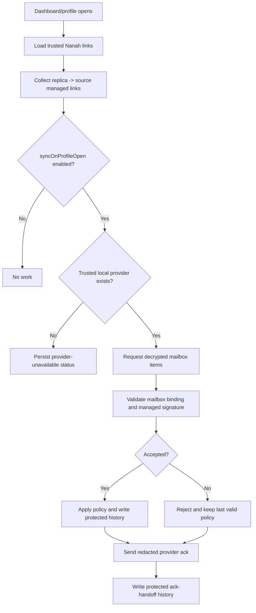

# Audit: Nanah Managed Pull-On-Open Hook

**Generated**: 2026-06-04
**Status**: Provider-gated dashboard/profile-open hook, provider ack handoff,
protected ack-handoff history writer, and explicitly configured browser HTTPS
mailbox pull/decrypt client are present. Local-network discovery and mailbox
server authority are still absent. Adapter-level local mailbox seal/open helpers
are covered separately. Protected-device managed-link setup now defaults to
parent-managed open checks and writes an eligible `allow_trusted_updates`
policy when profile-open checking is enabled, including independent protected
account profiles as well as child profiles.
**Related plan**:
`docs/audit/FILTERTUBE_LOCAL_NETWORK_MANAGED_PARENT_CONTROLS_PLAN_2026-06-03.md`
**Related inventory**:
`docs/audit/FILTERTUBE_RELEASE_PROFILE_NANAH_MANAGED_PARENT_AUTHORITY_INVENTORY_2026-06-03.md`
**Related mailbox protocol**:
`docs/audit/FILTERTUBE_MANAGED_POLICY_ENCRYPTED_MAILBOX_PROTOCOL_2026-06-04.md`

## Purpose

This slice adds the first safe runtime steps toward parent/caregiver
pull-on-open sync. When the FilterTube dashboard opens or the active profile is
switched, a protected replica profile can check eligible trusted managed links,
ask an optional local provider for already-decrypted mailbox items, and hand
redacted delivery acknowledgements back to the same provider. It also records a
protected redacted ack-handoff history row on the target profile so the parent
or caregiver can later see whether the protected device reported the mailbox
outcome back to the provider.

The hook is intentionally not mailbox server authority. It does not poll from
YouTube pages, does not add a service-worker scheduler, and does not make
network discovery authority. If no provider or configured HTTPS mailbox client
is installed, it records a local status of `pull_provider_unavailable` and
leaves the last valid policy active. If the provider reports `ok: false` or
throws, returned items are discarded, no mailbox item is applied, no ack is
sent, and the last valid policy remains active.

## Runtime Shape



## Runtime Hooks Added

```text
js/nanah_managed_open_sync.js
  FilterTubeNanahManagedOpenSync.create(...)
  collectManagedOpenSyncLinks(...)
  runOpenSync(...)

js/tab-view.js
  NANAH_MANAGED_OPEN_SYNC_STATE_KEY = ftNanahManagedOpenSyncState
  loadNanahManagedOpenSyncState()
  persistNanahManagedOpenSyncState(...)
  recordManagedOpenSyncAckHistory(...)
  formatNanahManagedOpenSyncStatus(...)
  runNanahManagedOpenSync(...)
```

The optional provider shape is:

```js
window.FilterTubeManagedPolicyOpenSync = {
  async pullDecryptedMailboxItems(request) {
    return { ok: true, items: [/* filtertube_managed_mailbox_item */] };
  },
  async ackDecryptedMailboxItems(ack) {
    return { ok: true, ackedItemCount: ack.records.length };
  }
};
```

The request and ack objects are redacted and contain only
link/profile/scope/revision/hash/result metadata. They do not contain plaintext
filters, PINs, channel names, video titles, viewing history, or action-history
summaries. Providers may also expose `ackMailboxItems(...)` for the same ack
payload shape.

## Eligibility Gates

A link is eligible only when all of these are true:

- `linkType` is `managed_link`.
- Local role is `replica`.
- Remote role is `source`.
- The link and key are not revoked or stale.
- `policy.syncOnProfileOpen === true`.
- `policy.lockedChildMode === "allow_trusted_updates"`.
- Target profile resolves to the active local profile.
- Source device id, source profile id, source public key id, target profile,
  and allowed scopes are present.

This keeps pull-on-open aligned with the existing parent-approved trusted link
policy and avoids silently applying updates to a sibling profile.

## UI Feedback

The managed link modal now includes:

```text
Check for parent updates when this profile opens
```

First-time protected-device setup now presents this as part of the normal
`Parent managed` behavior. The stricter `Ask on this device first` behavior is
still available, but it deliberately disables profile-open pulls until the
protected device is locally approved/unlocked.

The trusted-link card now shows a parent-facing `Internet Pickup` row for this
status. Earlier proof called the same visible row `Open sync`; that remains the
technical helper name, not the parent-facing label. The row can show one of
these states:

```text
Off
Ready
Checked
Checked (Xm ago)
No updates (Xm ago)
Provider unavailable (Xm ago)
Apply unavailable (Xm ago)
No eligible open-sync link (Xm ago)
Provider rejected pull (Xm ago)
N applied, M rejected (Xm ago)
N applied, M rejected, A ack failed (Xm ago)
```

This is feedback/status only. It does not grant authority. The recency/counts
are redacted operational feedback; they do not include rule text, policy JSON,
decrypted mailbox payloads, keys, tokens, PINs, video titles, channel names, or
mailbox ciphertext.

## Remaining Boundaries

```text
runtime pull-on-open candidate gate: present
runtime provider-gated decrypted item pull: present
runtime provider-gated mailbox ack handoff: present
runtime protected mailbox ack-handoff history writer: present
runtime provider failure fail-closed item apply guard: present
runtime mailbox item apply reuse: present
runtime pull status persistence: present
runtime browser HTTPS mailbox pull/decrypt client: present behind explicit config
runtime mailbox server authority: absent
runtime local-network discovery: absent
runtime background scheduler: absent
runtime YouTube page hot-path work from this slice: absent
```

## Release Safety Notes

- No YouTube content script, JSON interceptor, DOM fallback, menu observer,
  timer, or SPA listener is touched by this slice.
- No provider means no remote pull. The hook fails closed with a persisted
  status row.
- Provider failures and thrown provider errors do not apply or ack returned
  items. They surface as a provider rejection status and keep the last valid
  policy active.
- Returned items still go through `handleNanahIncomingManagedMailboxItem(...)`,
  `validateManagedMailboxItem(...)`, managed signature verification, accepted
  revision/hash checks, and protected action-history recording.
- Ack records are result metadata only. They never include decrypted payload
  contents and are sent only when the same local provider offers an ack method.
- Ack-handoff history rows store only redacted link/profile/scope/revision/hash
  and provider ack counts on the protected profile. They do not contain
  plaintext rule values, and they do not authorize future policy changes.
- This does not replace manual live Nanah sessions. It only creates the
  extension-side hook that downstream app/local-network/mailbox providers can
  use safely later.
