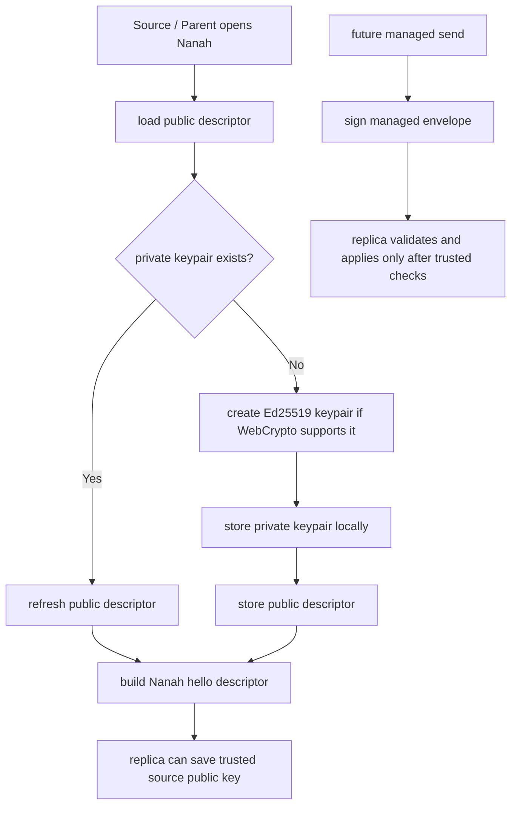

# Audit: Nanah Managed Signing Keypair

**Generated**: 2026-06-04
**Status**: Runtime keypair provisioning and adapter signing helper slice.
Live signed managed-policy send remains pending.
**Related plan**:
`docs/audit/FILTERTUBE_LOCAL_NETWORK_MANAGED_PARENT_CONTROLS_PLAN_2026-06-03.md`
**Related descriptor proof**:
`docs/audit/FILTERTUBE_NANAH_MANAGED_PAIRING_KEY_DESCRIPTOR_2026-06-04.md`

## Purpose

Managed parent/caregiver policy receive-side validation already requires
source public-key identity, key version, signed fields, signature verification,
trusted link binding, target profile, scope, revision, and policy hash.

The previous descriptor slice allowed Nanah pairing to advertise public key
material only when it had already been provisioned. This slice adds the next
runtime boundary:

- the Nanah adapter can create an Ed25519 managed signing keypair through
  WebCrypto;
- the dashboard stores the private keypair under an extension-local key;
- the dashboard stores the public descriptor separately for pairing;
- Source / Parent sessions try to provision the keypair before the Nanah hello;
- Source-side managed links require local signing keypair material before they
  can be saved as managed authority;
- the adapter can sign a `filtertube_managed_policy` envelope using the same
  canonical signed-field shape that receive-side validation verifies.

## Storage Boundary

```text
ftNanahManagedSigningKeyPair
  privateKeyJwk
  managedPublicKeyId
  managedPublicKeyJwk
  managedKeyVersion
  algorithm
  createdAt

ftNanahManagedSigningPublicKey
  managedPublicKeyId
  managedPublicKeyJwk
  managedKeyVersion
  sourcePublicKeyId
  sourcePublicKeyJwk
  keyVersion
  algorithm
  createdAt
```

The private JWK stays in extension local storage and is never placed in the
Nanah device descriptor, trusted link policy, or outbound public envelope. This
slice does not claim hardware-backed, non-extractable, encrypted-at-rest, or
password-wrapped private key storage.

## Signing Shape

The adapter signs the canonical JSON for:

```json
{
  "linkId": "link-parent-child-1",
  "scope": "keywords",
  "targetProfileId": "child-profile-1",
  "sourceDeviceId": "parent-device-1",
  "revision": 4,
  "policyHash": "sha256:...",
  "payloadScope": "keywords"
}
```

It then writes:

```json
{
  "integrity": {
    "algorithm": "ed25519",
    "signedFields": {},
    "signature": "base64url-signature"
  }
}
```

This matches the existing `validateManagedIntegrityBinding(...)` and
`verifyManagedNanahPolicyIntegritySignature(...)` receive-side contract.

## Runtime Flow



## Boundaries

This slice still does not enable automatic remote management by itself.

Still pending:

- converting the dashboard send button from managed `control_proposal` to
  signed `filtertube_managed_policy` for eligible managed scopes;
- canonical policy-hash generation for outbound policy payloads;
- local-network or mailbox delivery runtime;
- key rotation and revocation UI;
- encrypted-at-rest or non-extractable private-key storage;
- installed-extension two-device signed managed-policy smoke.

If WebCrypto key generation is unavailable, source-side managed links fail
closed when saving managed authority because no signing descriptor can be
created.

## Proof Commands

```bash
node --test tests/runtime/managed-nanah-signing-keypair-current-behavior.test.mjs
npm run test:settings
```
