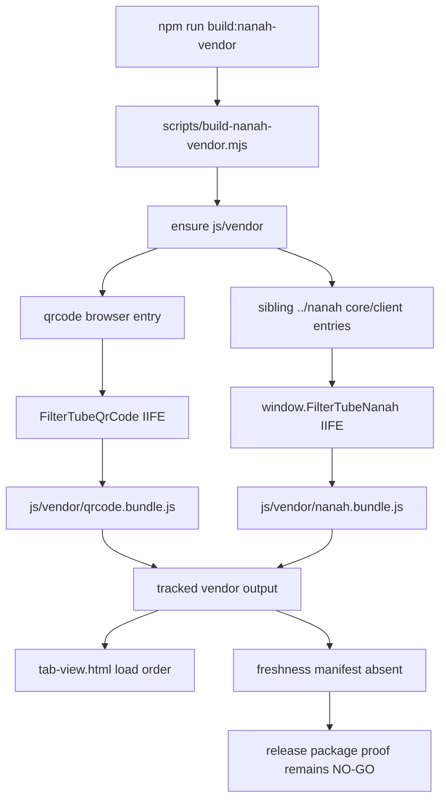

# FilterTube Nanah Vendor Build Method Semantic Register - Current Behavior - 2026-05-21

Status: audit-only current-behavior register. Runtime and build behavior are unchanged.

This register promotes the Nanah/QR vendor build path from static vendor-boundary
markers to a source-derived method, package, output, and load-order inventory.
It covers `scripts/build-nanah-vendor.mjs`, the tracked generated vendor outputs
in `js/vendor/`, the `qrcode` package authority in `package.json` and
`package-lock.json`, and the dashboard HTML/runtime surfaces that load and
consume those globals.

This is not completion proof for vendor source revision provenance, output hash
authority, package parity, deterministic rebuilds, Nanah sibling-repo freshness,
QR package freshness, or release safety. It is a current-behavior boundary
before changing the vendor build script, tracked vendor bundles, dashboard Nanah
load order, package copying, native sync surfaces, or public sync/privacy claims.

## Source-Derived Summary

```text
build script: scripts/build-nanah-vendor.mjs
vendor output files: js/vendor/nanah.bundle.js, js/vendor/qrcode.bundle.js
dashboard load surface: html/tab-view.html
dashboard consumers: js/tab-view.js, js/nanah_sync_adapter.js
build script line count: 65
vendor output line count: 2961
build script bytes: 1818
vendor output bytes: 94657
named method/helper declarations in build script: 4
plain function declarations: 0
async function declarations: 4
semantic method groups: 4
arrow token sites in build script: 1
path.resolve occurrences in build script: 8
esbuild.build occurrences in build script: 2
await expressions in build script: 6
fs.mkdir occurrences in build script: 1
window literal occurrences in build script: 1
document literal occurrences in build script: 0
addEventListener occurrences in build script: 0
setTimeout occurrences in build script: 0
MutationObserver occurrences in build script: 0
fetch occurrences in build script: 0
Nanah output sha256: 11c43c120c58ed4de81d2b1d341efd488d1bd6792d49ce5fdc9220aacf6e07ca
QR output sha256: 4b48f69259b91b2c9ff6bdc2be2f96ab9855aa4fb96bc684a81bcd76d8c3ca75
script sha256: dae8d3ef29c4cd44b0bf975090e9d53f3bb05b523355f5038930fc03b27e921c
runtime behavior changed: no
```

## Vendor Freshness Flow - 2026-05-27

This dated addendum pins the current vendor freshness boundary. It is audit-only:
it does not rebuild `js/vendor`, rewrite Nanah output, validate the sibling repo,
or approve release package changes.

```text
npm run build:nanah-vendor
        |
        v
node scripts/build-nanah-vendor.mjs
        |
        +--> node_modules/qrcode/lib/browser.js
        |       |
        |       v
        |   esbuild IIFE global FilterTubeQrCode
        |       |
        |       v
        |   js/vendor/qrcode.bundle.js
        |
        +--> ../nanah/packages/core/src/index.ts
        |   + ../nanah/packages/client/src/index.ts
        |       |
        |       v
        |   esbuild stdin module global window.FilterTubeNanah
        |       |
        |       v
        |   js/vendor/nanah.bundle.js
        |
        v
tracked vendor bundles remain in this repo
        |
        v
no vendor freshness manifest is written
```



Current artifact hashes:

| Artifact | Role | Current sha256 |
| --- | --- | --- |
| `scripts/build-nanah-vendor.mjs` | Vendor build entrypoint | `dae8d3ef29c4cd44b0bf975090e9d53f3bb05b523355f5038930fc03b27e921c` |
| `js/vendor/nanah.bundle.js` | Tracked generated Nanah bundle | `11c43c120c58ed4de81d2b1d341efd488d1bd6792d49ce5fdc9220aacf6e07ca` |
| `js/vendor/qrcode.bundle.js` | Tracked generated QR bundle | `4b48f69259b91b2c9ff6bdc2be2f96ab9855aa4fb96bc684a81bcd76d8c3ca75` |
| `package.json` | Package script/dependency source | `36053d322780ce787de403be574cc400936ef2a994b4c8eca62561154fe81aec` |
| `package-lock.json` | Dependency lock source | `f52d6482693be9cd4edacdc1f1491b4d2cda796522bfd0e4dcf86e0c879ad974` |
| `html/tab-view.html` | Dashboard load surface | `d11914a138ab29fb764a6aede4921c4d491bacaad83ecd44f8d7392758ece3e1` |
| `js/nanah_sync_adapter.js` | Nanah envelope adapter consumer | `8094261e6fb9fa72a86e6e79e8614bf18b93134f54dcca7327114b5410447824` |
| `js/tab-view.js` | Nanah UI/session consumer | `1b7f621d48d16247aecc4c7ee57cbc3db9efd3e597e6f0a4fc188228470648f7` |

Current QR dependency facts:

```text
package.json qrcode range: ^1.5.4
package-lock qrcode version: 1.5.4
package-lock qrcode resolved: https://registry.npmjs.org/qrcode/-/qrcode-1.5.4.tgz
package-lock qrcode integrity: sha512-1ca71Zgiu6ORjHqFBDpnSMTR2ReToX4l1Au1VFLyVeBTFavzQnv5JxMFr3ukHVKpSrSA2MCk0lNJSykjUfz7Zg==
```

Current sibling Nanah checkout facts observed from this workspace:

```text
nanah repo path: /Users/devanshvarshney/nanah
nanah branch: main
nanah HEAD: 9c234a93957db87b5b8e7fa835de7f87f926d4e3
nanah dirty status rows: 2
nanah dirty file: packages/core/src/codes.ts
nanah dirty file: packages/signaling-cloudflare/src/index.ts
nanah core entry hash: 060a40a6517214074b447f865eacd7d1228ead7d88750163f5ccefb14dbd23a8
nanah client entry hash: fa93d3ed4c34c9b25d537914ad9d9222829ad4e5b7f00bc4cc3809f23dc40dac
nanah dirty core codes hash: 52d27cd03dbb53302227b1f3df8fbbe21b32b0152396a1b4234a5be5bf7f965f
nanah dirty signaling worker hash: 9402cd94d27988cf236ff9f25a4792580fd1943526d4e3ae94d18f016510b9ec
```

The important current behavior is that none of those sibling Nanah facts are
embedded in `js/vendor/nanah.bundle.js` as a first-class release manifest. The
bundle may have been produced from a particular sibling checkout, but the
tracked output alone does not prove the sibling repo commit, dirty state,
entry-source hashes, API surface, or rebuild determinism.

Current vendor freshness status:

```text
vendor freshness manifest: absent
vendor source revision manifest: absent
vendor build failure rollback: absent
stale vendor bundle deletion on failure: absent
normal package build vendor rebuild: absent
sibling dirty-state release gate: absent
release package proof: NO-GO
runtime behavior changed: no
```

## Artifact Line Counts

```text
scripts/build-nanah-vendor.mjs: 65 lines, 1818 bytes
js/vendor/nanah.bundle.js: 876 lines, 27692 bytes
js/vendor/qrcode.bundle.js: 2085 lines, 66965 bytes
package.json: 61 lines, 2405 bytes
package-lock.json: 1461 lines, 49916 bytes
html/tab-view.html: 1577 lines, 133585 bytes
```

## Method Group Counts

```text
vendorDirectoryPreparation: 1
qrcodeVendorBundleBuild: 1
nanahVendorBundleBuild: 1
vendorBuildOrchestration: 1
```

## Semantic Group Summary

| Semantic group | Declarations | Current owner/effect shape | Missing proof before behavior changes |
| --- | ---: | --- | --- |
| `vendorDirectoryPreparation` | 1 | Creates `js/vendor` recursively before output writes. | Dry-run contract, stale-output policy, and package-copy parity proof. |
| `qrcodeVendorBundleBuild` | 1 | Bundles `node_modules/qrcode/lib/browser.js` through esbuild as browser IIFE global `FilterTubeQrCode`. | qrcode package version/hash manifest, dependency-lock proof, output hash authority, and QR API fixture. |
| `nanahVendorBundleBuild` | 1 | Bundles sibling `../nanah` core/client TypeScript entries through an inline esbuild stdin module and assigns `window.FilterTubeNanah`. | Nanah source repo path, commit/hash manifest, public API surface report, rebuild determinism, and release fixture provenance. |
| `vendorBuildOrchestration` | 1 | Runs directory preparation, QR build, then Nanah build; failure logs and sets `process.exitCode = 1`. | Failure fixture, stale bundle cleanup policy, package/release gate, and native/runtime freshness contract. |

## Current Method Inventory

| Source file | Source line | Kind | Method or function | Semantic group |
| --- | ---: | --- | --- | --- |
| `scripts/build-nanah-vendor.mjs` | 12 | `asyncFunction` | `ensureDir` | `vendorDirectoryPreparation` |
| `scripts/build-nanah-vendor.mjs` | 16 | `asyncFunction` | `buildQrcodeBundle` | `qrcodeVendorBundleBuild` |
| `scripts/build-nanah-vendor.mjs` | 29 | `asyncFunction` | `buildNanahBundle` | `nanahVendorBundleBuild` |
| `scripts/build-nanah-vendor.mjs` | 55 | `asyncFunction` | `main` | `vendorBuildOrchestration` |

## Current Entrypoints And Dependencies

```text
npm script entrypoint: npm run build:nanah-vendor -> node scripts/build-nanah-vendor.mjs
normal package build: build.js does not invoke scripts/build-nanah-vendor.mjs
build executor: esbuild build()
output directory: js/vendor
QR entrypoint: node_modules/qrcode/lib/browser.js
QR package range: qrcode ^1.5.4
QR lockfile version: qrcode 1.5.4
QR lockfile resolved tarball: https://registry.npmjs.org/qrcode/-/qrcode-1.5.4.tgz
QR global: FilterTubeQrCode
QR output: js/vendor/qrcode.bundle.js
Nanah sibling root: ../nanah
Nanah core entrypoint: ../nanah/packages/core/src/index.ts
Nanah client entrypoint: ../nanah/packages/client/src/index.ts
Nanah global: window.FilterTubeNanah
Nanah output: js/vendor/nanah.bundle.js
dashboard load order: qrcode.bundle.js -> nanah.bundle.js -> nanah_sync_adapter.js -> tab-view.js
dashboard QR consumer: window.FilterTubeQrCode?.toCanvas
dashboard Nanah consumer: window.FilterTubeNanah and window.FilterTubeNanahAdapter
Nanah client construction: new NanahApi.NanahClient(...)
Nanah transport construction: new NanahApi.WebRtcDataChannelTransport(...)
Nanah signaling URL constant: NanahApi.DEFAULT_NANAH_SIGNALING_URL
sourceMappingURL output: absent
vendor freshness manifest: absent
vendor source revision manifest: absent
runtime behavior changed: no
```

## Current Behavior Boundaries

```text
vendor outputs are tracked source, not regenerated on import or extension startup
normal npm run build packages the current tracked vendor files without rebuilding them
npm run build:nanah-vendor can update tracked js/vendor files without writing a freshness manifest
QR bundling is reproducible only to the extent package-lock.json and installed node_modules are trusted
Nanah bundling depends on a sibling ../nanah checkout that is outside this repo
the committed Nanah output does not record the sibling Nanah commit, branch, or source hash
the committed QR output does not record the qrcode package version or package tarball hash
dashboard Nanah availability is runtime-global based, using window.FilterTubeNanah and window.FilterTubeNanahAdapter
dashboard QR availability is runtime-global based, using window.FilterTubeQrCode?.toCanvas
build failure sets process.exitCode but does not delete stale vendor output files
there is no dry-run mode, output manifest, release manifest, or native freshness report for vendor bundles today
```

## Risk Notes

Reliability risk is concentrated in unproven freshness. The dashboard can load
valid-looking Nanah and QR globals while the tracked output no longer matches
the intended sibling Nanah checkout, installed `qrcode` package, or release
claim.

False-hide/leak risk is indirect but real for account sync. The vendor globals
feed Nanah pairing, proposal, trusted-link, import/export, and QR pairing
flows. A stale protocol bundle can make device sync fail, apply an unexpected
envelope shape, or make the UI claim availability that the runtime cannot honor.

Performance/code-burden risk comes from tracked generated vendor bundles that
look like product-owned code. The right cleanup boundary is API surface and
provenance proof, not line-editing or deleting bundled code because it is large.

## Future Proof Fields

Each Nanah vendor build row must eventually be backed by source line, build
command, package/source revision, output hash, package copy result, and runtime
fixture before vendor build, release package, Nanah sync, QR generation, native
sync, or cleanup behavior can claim semantic coverage:

```text
nanahVendorBuildMethodReference
sourceFile
sourceLine
semanticGroup
buildEntrypoint
sourceInputPath
generatedOutputPath
sourceHash
generatedOutputHash
esbuildVersion
qrcodePackageVersion
qrcodePackageIntegrity
nanahRepoPath
nanahRepoCommit
nanahSourceHash
htmlScriptPath
htmlLoadOrderProof
globalApiName
globalApiSurface
consumerRuntimePath
packageTarget
sourceOutputFreshness
missingGlobalBehavior
buildFailureBehavior
staleOutputPolicy
positiveFixture
negativeFixture
releasePackageProof
nativeSyncFreshnessProof
```

## Missing Runtime Authorities

These authority/report tokens do not exist in the vendor build script, vendor
outputs, dashboard HTML, Nanah adapter, or tab-view Nanah consumer source today:

```text
nanahVendorBuildMethodAuthority
nanahVendorSourceRevisionManifest
nanahVendorOutputHashManifest
nanahVendorPackageVersionManifest
nanahVendorSiblingRepoContract
nanahVendorQrCodePackageContract
nanahVendorGlobalApiContract
nanahVendorBuildFreshnessReport
nanahVendorPackageParityReport
nanahVendorSiblingDirtyStateReport
nanahVendorStaleOutputFailureReport
nanahVendorFixtureProvenance
```

## Method Semantic Proof Gap Boundary

`docs/audit/FILTERTUBE_METHOD_SEMANTIC_PROOF_GAP_INDEX_CURRENT_BEHAVIOR_2026-05-25.md`
is a required source input before this backup/import/Nanah/vendor surface can
support runtime optimization. Current proof pins:

```text
method semantic proof gap files covered: 69
method semantic proof gap lexical callables covered: 5720
files with complete per-callable semantic proof: 0
lexical callables requiring semantic proof before behavior changes: 5720
affected callable semantic proof: NO-GO
runtime behavior changed: no
```

These counts are audit-only blockers. They do not approve runtime
optimization, JSON-first behavior, backup/export behavior, import behavior,
Nanah sync behavior, vendor runtime behavior, whitelist behavior, metric
collectors, artifact creation, native sync, release package changes, or public
claims.
