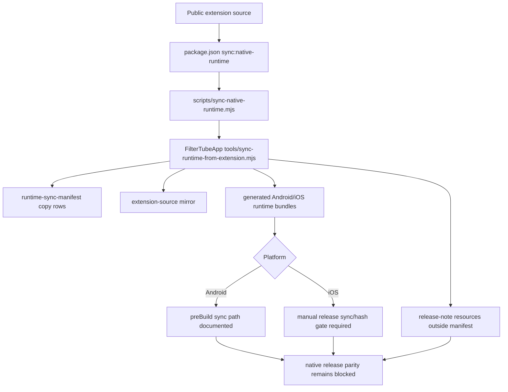

# FilterTube Native Runtime Sync Authority Audit - 2026-05-18

Status: current-behavior audit only. This file does not change extension
runtime behavior, Android assets, iOS resources, Kids WebView behavior, Nanah,
or app release output.

This slice covers the boundary between the public extension repo and the
private native app repo. It exists because extension-side filtering fixes only
help Android/iOS if the generated native runtime copies are fresh, traceable,
and not hand-edited outside the sync path.

## Current Sync Model

The public repo wrapper is:

```text
scripts/sync-native-runtime.mjs
```

It resolves the sibling app repo, or `FILTERTUBE_APP_REPO`, then runs:

```text
/Users/devanshvarshney/FilterTubeApp/tools/sync-runtime-from-extension.mjs
```

The app sync script reads:

```text
/Users/devanshvarshney/FilterTubeApp/tools/runtime-sync-manifest.json
```

Current manifest shape:

```text
entries: 28
sourceRepo: /Users/devanshvarshney/FilterTube
missing source files: 0
direct manifest copy hash diffs: 0
```

The manifest copies upstream runtime, UI parity, Nanah adapter, Nanah vendor,
and QR renderer sources from the public repo into app-owned package/resource
locations.

## Current Generated Runtime Outputs

Generated app runtime assets are not source authority:

| Asset | Current bytes | SHA-256 | Current behavior |
| --- | ---: | --- | --- |
| Android Main runtime | 1,562,220 | `b95585c35da6e0855bce8d70d5da0cc1af3be60308b499edebb35d9a1a466215` | Generated bundle consumed by Android WebView. |
| iOS Main runtime | 1,560,557 | `2282dee01331c6633cf13c8461847a9e8d1985734d99ec7e2fee92801ee82e20` | Generated from the Android runtime path, normalized for iOS resources. |
| Android Kids runtime | 13,153 | `05b47e2310222a68ba5356cbf6dca24b507aa225bfbe6e971c2a4819d647b711` | Android Kids runtime asset. |
| iOS Kids runtime | 20,835 | `3f279f275bf93cca6385df6c8d0422a51c533c26cbd29ddd5d9ea5655efc7340` | Android Kids runtime plus iOS-specific WebKit fit/performance patches. |

The iOS Kids runtime intentionally differs from Android. It adds iOS WebKit
fit helpers and performance gates, including `ensureKidsPhoneFit`, while
keeping watch-page DOM ownership with YouTube Kids.

## Mirror Snapshot Drift

The app sync also mirrors entire upstream `js/`, `html/`, and `css/` trees into:

```text
/Users/devanshvarshney/FilterTubeApp/packages/extension-source/upstream/
```

Current mirror check:

```text
mirror dirs: js, html, css
source files checked: 43
missing mirror files: 0
hash-different mirror files: 0
```

Current drift: none detected.

This does not prove runtime filtering is stale, because manifest-listed direct
copy entries are also byte-identical. It proves only the current mirror state;
the broad mirrored snapshot is still not a freshness authority by itself without
a committed source/app revision and hash manifest.

## App-Side Build Boundary

The app docs state the intended build boundary:

- Android `:app:preBuild` depends on `:app:syncFilterTubeRuntime`.
- iOS has no Gradle-style prebuild hook; it requires running
  `node tools/sync-runtime-from-extension.mjs` before iOS release builds or
  after upstream runtime changes.
- App code should not hand-edit generated `filtertube_runtime_full.js`.

That means Android has a stronger automatic freshness path than iOS. iOS needs
an explicit release gate until a native build-phase sync or hash proof exists.

## Native Release Handoff Snapshot - 2026-05-27

This current-source checkpoint ties the native runtime sync evidence to release
handoff risk. It is audit-only and does not change extension, app, generated
runtime, or release behavior.

```text
extension runtime source change
        |
        +--> npm run sync:native-runtime
        |       + scripts/sync-native-runtime.mjs
        |       + sibling/env FilterTubeApp sync script
        |
        +--> app sync script
        |       + direct manifest copy rows
        |       + broad js/html/css mirror
        |       + generated Android/iOS runtime assets
        |       + iOS Kids runtime patch path
        |
        +--> release handoff
                + Android prebuild sync documented
                + iOS manual sync gate still required
                + release notes outside direct runtime manifest
```



| Handoff path | Current source | Current behavior pinned | Release blocker |
| --- | --- | --- | --- |
| Public wrapper script | `scripts/sync-native-runtime.mjs:5-34` | Resolves `FILTERTUBE_APP_REPO` or sibling `FilterTubeApp`, then delegates to the app sync script with inherited stdio. | Wrapper does not emit a machine-readable sync report. |
| Package entrypoint | `package.json:6-15` | `sync:native-runtime` exists, while ordinary build scripts are separate. | Extension build alone is not a native freshness gate. |
| App sync script | `/Users/devanshvarshney/FilterTubeApp/tools/sync-runtime-from-extension.mjs:100-199`, `226` | Declares runtime bundle order, source mirror dirs, direct manifest copy, generated asset rebuild, and iOS Kids runtime patching. | Generated assets need declared source/destination/hash output before release claims. |
| Direct manifest copies | `/Users/devanshvarshney/FilterTubeApp/tools/runtime-sync-manifest.json` | 28 copy entries currently match source/destination hashes, with no `destinationKind` fields. | Manifest lacks destination-kind and generated-output participation metadata. |
| Generated app assets | `docs/audit/FILTERTUBE_NATIVE_RUNTIME_SYNC_MANIFEST_FRESHNESS_BOUNDARY_CURRENT_BEHAVIOR_2026-05-22.md:68-73` | Android/iOS Main/Kids/Nanah runtime hashes are pinned as generated outputs. | Generated outputs are not source authority and need post-sync hash reports. |
| Native release notes | `docs/audit/FILTERTUBE_NATIVE_RUNTIME_SYNC_MANIFEST_FRESHNESS_BOUNDARY_CURRENT_BEHAVIOR_2026-05-22.md:86-93` | Native Android/iOS release-note resources differ from public `data/release_notes.json` and are outside the direct manifest. | Release notes need parity proof or intentional divergence record before release claims. |
| Android/iOS build boundary | `/Users/devanshvarshney/FilterTubeApp/docs/app/TECHNICAL_RUNTIME.md` | Android prebuild sync is documented; iOS lacks a Gradle-style prebuild hook and needs manual sync before release. | iOS release remains blocked without an explicit sync/hash gate. |

Current approval state:

```text
native release handoff approval: NO-GO
native generated runtime source authority: NO-GO
iOS release sync gate approval: NO-GO
runtime behavior changed by this addendum: no
```

## Raw Capture Evidence Boundary

The root ignored HTML/JSON/TXT captures are not native runtime inputs. Examples
include:

```text
YT_MAIN.json
YT_MAIN_NEXT.json
YT_MAIN_WATCH.html
YT_KIDS.json
YTM.json
YTM-DOM.html
comments.json
playlist.json
collab.json
extracted_watch_paths.txt
```

They are valid evidence inputs for `docs/json_paths_encyclopedia.md`,
`docs/youtube_renderer_inventory.md`, and minimal extracted runtime fixtures.
They must not be copied into extension ZIPs, native app assets, or generated
runtime bundles.

## High-Confidence Findings

1. **The manifest copy path is currently fresh.**
   All 28 `runtime-sync-manifest.json` source/destination pairs exist and are
   byte-identical.

2. **Generated Main/Kids runtime assets are build outputs, not source.**
   Android and iOS ship generated assets under app resource folders. Real fixes
   should land in `/Users/devanshvarshney/FilterTube/js` first, then sync.

3. **iOS runtime output intentionally diverges.**
   iOS Kids runtime has WebKit-specific fit and quiet/performance patches.
   Treating Android and iOS runtime hashes as identical would be wrong.

4. **The broad extension-source mirror currently has no hash drift.**
   That is useful current evidence, but any native UI parity claim based on the
   mirror must still prove hashes or rely on the manifest-listed direct copies.

5. **Android and iOS freshness gates are asymmetric.**
   Android has a documented prebuild dependency. iOS release builds currently
   depend on a manual sync step and should have a recorded hash gate.

6. **Ignored root captures stay evidence-only.**
   They explain why the inventory docs are rich, but they are not source
   authority and must only enter tests as small curated fixtures.

## Missing Future Authority

Future token: `nativeRuntimeSyncAuthority`

Required record shape:

```text
nativeRuntimeSyncAuthority {
  sourceRevision,
  appRepoRevision,
  sourcePath,
  destinationPath,
  destinationKind,
  generatedFrom[],
  platform,
  hash,
  sizeBytes,
  syncCommand,
  syncRequiredBeforeBuild,
  freshnessStatus,
  intentionalDivergenceReason,
  rawCaptureInputAllowed
}
```

The goal is not to force every platform file to be identical. The goal is to
make every native app runtime copy either byte-identical to its source, generated
from declared sources, or intentionally platform-divergent with proof.

## P0 Fixture Gates

```text
native_runtime_sync_public_wrapper_delegates_to_app_sync_script
native_runtime_sync_manifest_sources_exist_and_are_public_repo_owned
native_runtime_sync_manifest_destinations_are_byte_identical_after_sync
native_runtime_sync_generated_main_assets_are_not_source_authority
native_runtime_sync_ios_kids_runtime_documents_intentional_divergence
native_runtime_sync_extension_source_mirror_drift_is_detected
native_runtime_sync_android_has_prebuild_freshness_but_ios_needs_release_gate
native_runtime_sync_raw_root_captures_never_become_app_runtime_inputs
native_runtime_sync_future_authority_token_is_absent_from_product_source
```

## First Optimization Metric Collector Parity Rollout Boundary Addendum

First optimization metric collector parity rollout boundary addendum:
`docs/audit/FILTERTUBE_FIRST_OPTIMIZATION_METRIC_COLLECTOR_PARITY_ROLLOUT_BOUNDARY_CURRENT_BEHAVIOR_2026-05-24.md`
and
`tests/runtime/first-optimization-metric-collector-parity-rollout-boundary-current-behavior.test.mjs`
maps this native runtime sync boundary into first-collector parity and rollout
requirements. The addendum pins 12 collector parity rollout rows, 12 collector
fixture provenance rows covered, 12 route/surface obligations covered, 2
evidence parity rollout rows covered, 8 parity and release boundary source docs
covered, 0 runtime collector parity rollout proofs approved, and 0
implementation-ready parity rollout rows. Extension-side measurement remains
separate from native generated output, iOS divergence, app sync freshness, and
release readiness.

## First Optimization Parity Rollout Contract Addendum

First optimization parity rollout contract addendum:
`docs/audit/FILTERTUBE_FIRST_OPTIMIZATION_PARITY_ROLLOUT_CONTRACT_CURRENT_BEHAVIOR_2026-05-24.md`
and
`tests/runtime/first-optimization-parity-rollout-contract-current-behavior.test.mjs`
maps native runtime sync freshness and divergence into the future
`parity-rollout.json` contract without creating rollout artifacts or approving
native sync changes. The addendum pins 12 parity rollout contract rows, 1
reserved parity rollout path covered, 0 committed parity rollout files, 0
runtime metric collector approvals, and 0 implementation-ready parity rollout
contract rows. Extension-side metric evidence remains separate from app sync,
generated assets, native parity, release packages, and public claims.

## First Optimization Rollback Unclaimed Surface Boundary Addendum

First optimization rollback unclaimed surface boundary addendum:
`docs/audit/FILTERTUBE_FIRST_OPTIMIZATION_ROLLBACK_UNCLAIMED_SURFACE_BOUNDARY_CURRENT_BEHAVIOR_2026-05-24.md`
and
`tests/runtime/first-optimization-rollback-unclaimed-surface-boundary-current-behavior.test.mjs`
isolates rollback, unclaimed-surface, native sync, release package,
raw-capture, diagnostic performance, and public-claim limits before any
metric-foundation artifact is committed or runtime behavior changes. The
addendum pins 12 rollback/unclaimed boundary rows, 8 release/native/public
source docs covered, 0 committed rollback/unclaimed artifacts, 0 runtime
rollback approvals, 0 runtime unclaimed-surface approvals, 0 runtime metric
collector approvals, 0 implementation-ready rollback/unclaimed rows, expected
runtime audit tests 4457, expected runtime audit pass: 4457, and expected
runtime audit fail 0. It keeps JSON-first, whitelist, collector, native,
release, and public claim work blocked until measured surfaces, unclaimed
surfaces, rollback command, artifact absence, authority absence, raw-capture
exclusion, and release/public claim limits are proved.

## Method Semantic Proof Gap Boundary

`docs/audit/FILTERTUBE_METHOD_SEMANTIC_PROOF_GAP_INDEX_CURRENT_BEHAVIOR_2026-05-25.md`
is a required source input before this native/runtime sync and overlay surface
can support runtime optimization. Current proof pins:

```text
method semantic proof gap files covered: 63
method semantic proof gap lexical callables covered: 5473
files with complete per-callable semantic proof: 0
lexical callables requiring semantic proof before behavior changes: 5473
affected callable semantic proof: NO-GO
runtime behavior changed: no
```

These counts are audit-only blockers. They do not approve runtime
optimization, JSON-first behavior, native runtime sync behavior, native overlay
quiet-mode behavior, whitelist behavior, metric collectors, artifact creation,
release package changes, or public claims.
