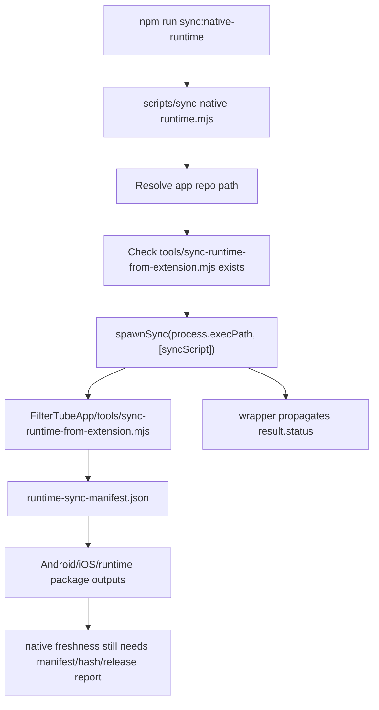

# FilterTube Native Runtime Sync Method Semantic Register - Current Behavior - 2026-05-21

Status: audit-only current-behavior register. Runtime, build, package, and
native app sync behavior are unchanged.

This register promotes `scripts/sync-native-runtime.mjs` from a release/native
marker to a source-derived method, package-script, delegation, manifest, and
app-boundary inventory. The public repository owns a small wrapper only: it
resolves the native app repo, checks that the sibling app sync script exists,
and delegates process execution to that app script.

This is not completion proof for native app freshness, JSON-first filtering
parity, app release readiness, or safe optimization. It is a current-behavior
boundary before changing shared runtime files, relying on app parity, pruning DOM
fallbacks after JSON filtering work, or publishing browser/app artifacts that
claim synchronized runtime behavior.

## Source-Derived Summary

```text
public wrapper source file: scripts/sync-native-runtime.mjs
public wrapper line count: 34
public wrapper bytes: 1070
public wrapper sha256: 4f46c13bf6099092193712790d231ff4809b00b1b0061d04af71ac3ba6bf21c6
package file: package.json
package line count: 61
package bytes: 2405
package sha256: 36053d322780ce787de403be574cc400936ef2a994b4c8eca62561154fe81aec
package script: sync:native-runtime -> node scripts/sync-native-runtime.mjs
normal build invokes public wrapper: no
default app repo: ../FilterTubeApp
env override: FILTERTUBE_APP_REPO
app sync script: /Users/devanshvarshney/FilterTubeApp/tools/sync-runtime-from-extension.mjs
app sync script exists: yes
app runtime manifest: /Users/devanshvarshney/FilterTubeApp/tools/runtime-sync-manifest.json
script-level semantic phases: 4
named method declarations in public wrapper: 0
plain function declarations in public wrapper: 0
async function declarations in public wrapper: 0
arrow token sites in public wrapper: 0
import declarations in public wrapper: 3
const declarations in public wrapper: 6
path.resolve occurrences in public wrapper: 2
path.join occurrences in public wrapper: 1
fs.existsSync occurrences in public wrapper: 1
spawnSync token occurrences in public wrapper: 2
spawnSync call sites in public wrapper: 1
process.exit calls in public wrapper: 3
process.exitCode occurrences in public wrapper: 0
console.error calls in public wrapper: 5
console.log calls in public wrapper: 1
process.env occurrences in public wrapper: 2
process.cwd occurrences in public wrapper: 1
process.execPath occurrences in public wrapper: 1
stdio inherit occurrences in public wrapper: 1
runtime-sync-manifest literal occurrences in public wrapper: 0
addEventListener calls in public wrapper: 0
removeEventListener calls in public wrapper: 0
setTimeout calls in public wrapper: 0
setInterval calls in public wrapper: 0
requestAnimationFrame calls in public wrapper: 0
MutationObserver references in public wrapper: 0
fetch calls in public wrapper: 0
write/copy/rm file mutation calls in public wrapper: 0
runtime behavior changed: no
```

## App Boundary Snapshot

```text
public repo HEAD: 7f0e66641aa576fb264085baf59949244ea32291
app repo HEAD: cfc651cd4294e528c2c371778d7698ce82e94a71
app sync script line count: 1758
app sync script bytes: 76587
app sync script sha256: d48bdc271f707f0f960ac8a6b0d2712a602fb6c84a8c2bf2e0a138d112f9ba8e
plain function declarations in app sync script: 14
async function declarations in app sync script: 3
total named function declarations in app sync script: 17
runtimeBundleOrder entries in app sync script: 15
runtime-sync-manifest literal occurrences in app sync script: 3
fs.copyFile occurrences in app sync script: 2
fs.cp occurrences in app sync script: 2
fs.rm occurrences in app sync script: 2
fs.writeFile occurrences in app sync script: 4
fs.readFile occurrences in app sync script: 5
fs.mkdir occurrences in app sync script: 3
FILTERTUBE_APP_RUNTIME_BUNDLE_START occurrences in app sync script: 1
js/layout.js literal occurrences in app sync script: 1
manifest line count: 198
manifest bytes: 8178
manifest sha256: e899e29d946270865750b8f6415c298a92da6b4e1917367b6a174afe2a0c6583
manifest entries: 28
manifest source repos: /Users/devanshvarshney/FilterTube
manifest destinationKind fields present: 0
manifest entries missing destinationKind: 28
manifest includes js/layout.js: yes
manifest includes js/vendor/nanah.bundle.js: yes
manifest includes js/vendor/qrcode.bundle.js: yes
manifest includes data/release_notes.json: no
```

## Native Sync Freshness Flow - 2026-05-27

This dated addendum pins the current public-wrapper to native-app delegation
boundary. It is audit-only: it does not run sync, modify the app repo, approve
native release freshness, or claim extension/app parity.

```text
npm run sync:native-runtime
        |
        v
node scripts/sync-native-runtime.mjs
        |
        v
resolve FILTERTUBE_APP_REPO or ../FilterTubeApp
        |
        v
require tools/sync-runtime-from-extension.mjs
        |
        v
spawn same Node executable inside app repo
        |
        v
app-side sync script reads runtime-sync-manifest.json
        |
        v
app-side script owns copy/write/remove/generated runtime work
        |
        v
public wrapper only propagates process status
```



Current repository state observed for this workspace:

```text
public repo path: /Users/devanshvarshney/FilterTube
public repo HEAD: 7f0e66641aa576fb264085baf59949244ea32291
public repo dirty status rows: 29
public repo has docs/audit untracked row: yes
public repo has tests untracked row: yes
app repo path: /Users/devanshvarshney/FilterTubeApp
app repo branch: native_owned_main_surface_p2
app repo HEAD: cfc651cd4294e528c2c371778d7698ce82e94a71
app repo dirty status rows observed in snapshot: 46
```

App dirty files observed in this snapshot after prior sync-related work:

```text
app dirty file: apps/android/app/src/debug/java/com/filtertube/app/DebugNativeOwnedKidsActivity.kt
app dirty file: apps/android/app/src/main/assets/filtertube_nanah/nanah_sync_adapter.js
app dirty file: apps/android/app/src/main/assets/filtertube_runtime_full.js
app dirty file: apps/android/app/src/main/java/com/filtertube/app/AppLaunchRouter.kt
app dirty file: apps/android/app/src/main/java/com/filtertube/app/LauncherActivity.kt
app dirty file: apps/android/app/src/main/java/com/filtertube/app/ManagedWebViewActivity.kt
app dirty file: apps/android/app/src/main/java/com/filtertube/app/NativeOwnedMainPlaybackBridgeFallback.kt
app dirty file: apps/android/app/src/main/java/com/filtertube/app/NativeOwnedPreviewEntryPoint.kt
app dirty file: apps/android/app/src/main/java/com/filtertube/app/ProfileViewingAccess.kt
app dirty file: apps/android/app/src/main/java/com/filtertube/app/ViewingLaunchCoordinator.kt
app dirty file: apps/android/app/src/main/java/com/filtertube/app/ViewingSpaceChooserPolicy.kt
app dirty file: apps/android/app/src/main/java/com/filtertube/app/ViewingTargetAccessUiState.kt
app dirty file: apps/android/app/src/main/java/com/filtertube/app/ViewingTargetLaunchPolicy.kt
app dirty file: apps/android/app/src/test/java/com/filtertube/app/AppLaunchRouterTest.kt
app dirty file: apps/android/app/src/test/java/com/filtertube/app/NativeOwnedMainPlaybackBridgeFallbackTest.kt
app dirty file: apps/android/app/src/test/java/com/filtertube/app/NativeOwnedPreviewEntryPointTest.kt
app dirty file: apps/android/app/src/test/java/com/filtertube/app/ProfileViewingAccessTest.kt
app dirty file: apps/android/app/src/test/java/com/filtertube/app/ViewingSpaceChooserPolicyTest.kt
app dirty file: apps/android/app/src/test/java/com/filtertube/app/ViewingTargetAccessUiStateTest.kt
app dirty file: apps/android/app/src/test/java/com/filtertube/app/ViewingTargetLaunchPolicyTest.kt
app dirty file: apps/ios/FilterTube/Resources/filtertube_nanah/nanah_sync_adapter.js
app dirty file: apps/ios/FilterTube/Resources/filtertube_runtime_full.js
app dirty file: packages/extension-source/upstream/css/serene-shell.css
app dirty file: packages/extension-source/upstream/html/tab-view.html
app dirty file: packages/extension-source/upstream/js/background.js
app dirty file: packages/extension-source/upstream/js/content/block_channel.js
app dirty file: packages/extension-source/upstream/js/content/bridge_settings.js
app dirty file: packages/extension-source/upstream/js/content/collab_dialog.js
app dirty file: packages/extension-source/upstream/js/content/dom_fallback.js
app dirty file: packages/extension-source/upstream/js/content_bridge.js
app dirty file: packages/extension-source/upstream/js/injector.js
app dirty file: packages/extension-source/upstream/js/io_manager.js
app dirty file: packages/extension-source/upstream/js/nanah_sync_adapter.js
app dirty file: packages/extension-source/upstream/js/seed.js
app dirty file: packages/extension-source/upstream/js/settings_shared.js
app dirty file: packages/extension-source/upstream/js/state_manager.js
app dirty file: packages/extension-ui/src/upstream/io_manager.js
app dirty file: packages/extension-ui/src/upstream/settings_shared.js
app dirty file: packages/extension-ui/src/upstream/state_manager.js
app dirty file: packages/runtime-adapters/src/upstream/block_channel.js
app dirty file: packages/runtime-adapters/src/upstream/collab_dialog.js
app dirty file: packages/runtime-adapters/src/upstream/dom_fallback.js
app dirty file: packages/runtime-bridge/src/upstream/bridge_settings.js
app dirty file: packages/runtime-bridge/src/upstream/content_bridge.js
app dirty file: packages/runtime-bridge/src/upstream/injector.js
app dirty file: packages/runtime-bridge/src/upstream/seed.js
```

Current runtime manifest shape:

```text
manifest keys: destination, notes, source, sourceRepo, syncMode
manifest source root js entries: 28
manifest destination root apps entries: 3
manifest destination root packages entries: 25
manifest destinationKind fields present: 0
manifest destinationKind release gate: absent
pre/post sync hash ledger: absent
native release freshness proof: NO-GO
runtime behavior changed: no
```

The current state is useful evidence, but it is not release authority. It shows
that the wrapper can find and delegate to the app sync script, and that the app
repo currently carries many modified generated/upstream files. It does not
prove which public source revision each app output came from, whether every
destination matches current source, or whether Android/iOS packaged assets are
ready to ship.

## Method Group Counts

```text
nativeSyncWrapperPathResolution: 1
nativeSyncWrapperExistenceGate: 1
nativeSyncWrapperProcessDelegation: 1
nativeSyncWrapperStatusPropagation: 1
```

## Semantic Group Summary

| Semantic group | Phases | Current owner/effect shape | Missing proof before behavior changes |
| --- | ---: | --- | --- |
| `nativeSyncWrapperPathResolution` | 1 | Uses `process.cwd()`, optional `FILTERTUBE_APP_REPO`, sibling `../FilterTubeApp`, and `path.resolve` / `path.join` to locate the app sync script. | Explicit app repo contract, app revision capture, dirty-worktree policy, and release gate that names which app repo was synchronized. |
| `nativeSyncWrapperExistenceGate` | 1 | Fails before spawning when `tools/sync-runtime-from-extension.mjs` is absent, prints the expected path and env override guidance, then exits `1`. | Machine-readable failure report and CI/release blocking contract rather than console-only guidance. |
| `nativeSyncWrapperProcessDelegation` | 1 | Runs the app script with `spawnSync(process.execPath, [syncScript])`, `cwd: appRepo`, inherited environment, and inherited stdio. | Manifest hash, app revision, source revision, and raw-capture exclusion report emitted before trusting the copy. |
| `nativeSyncWrapperStatusPropagation` | 1 | On `result.error`, logs the error and exits `1`; otherwise exits with `result.status ?? 1`. | Stable status contract distinguishing missing app repo, manifest drift, copy drift, generated output drift, and app release gate failures. |

## Current Phase Inventory

| Source file | Source line | Kind | Phase or entrypoint | Semantic group |
| --- | ---: | --- | --- | --- |
| `scripts/sync-native-runtime.mjs` | 5 | `scriptPhase` | `publicRepoRootAndAppPathResolution` | `nativeSyncWrapperPathResolution` |
| `scripts/sync-native-runtime.mjs` | 11 | `scriptPhase` | `syncScriptExistenceGate` | `nativeSyncWrapperExistenceGate` |
| `scripts/sync-native-runtime.mjs` | 21 | `scriptPhase` | `syncProcessDelegation` | `nativeSyncWrapperProcessDelegation` |
| `scripts/sync-native-runtime.mjs` | 29 | `scriptPhase` | `syncErrorAndStatusPropagation` | `nativeSyncWrapperStatusPropagation` |

## Current Delegation Boundary

```text
npm script sync:native-runtime runs node scripts/sync-native-runtime.mjs
npm run build, build:chrome, build:firefox, and build:opera do not invoke scripts/sync-native-runtime.mjs
public wrapper resolves FILTERTUBE_APP_REPO first, otherwise sibling ../FilterTubeApp
public wrapper requires tools/sync-runtime-from-extension.mjs under the selected app repo
missing app sync script exits 1 before process delegation
delegation uses the same Node executable through process.execPath
delegation runs with cwd set to the selected app repo
delegation inherits process.env and stdio
result.error exits 1
normal completion exits result.status ?? 1
public wrapper does not read runtime-sync-manifest.json directly
public wrapper does not copy, remove, write, parse JSON, fetch, observe DOM, or install listeners/timers
app sync script owns manifest reads, source/destination copies, generated Android runtime writes, iOS resource writes, and Nanah asset mirroring
```

## Current Manifest Boundary

The sibling app manifest currently contains 28 copy entries, all sourced from
`/Users/devanshvarshney/FilterTube`. It includes shared JSON filtering and DOM
fallback runtime files such as `js/seed.js`, `js/filter_logic.js`,
`js/content_bridge.js`, `js/content/dom_fallback.js`, `js/content/block_channel.js`,
`js/layout.js`, extension UI files, and Nanah vendor bundles. It does not include
`data/release_notes.json`, and no entry currently records a `destinationKind`
field.

This means the public wrapper can prove only that it delegates to the selected
app sync script. It cannot, by itself, prove that JSON-first filtering changes,
DOM fallback cleanup, generated app runtime assets, release notes, Nanah output,
or platform resources are fresh after a source edit.

## Risk Notes

Reliability risk is concentrated in release/app parity. The wrapper has no
recorded app revision, no manifest hash report, no pre/post sync source hash
ledger, and no release blocker tying app runtime assets to the public repo
revision that produced them.

False-hide/leak risk matters because the app manifest copies both JSON filtering
files and DOM fallback/layout files. A future optimization that promotes JSON
filtering and prunes DOM fallback behavior can be correct in the extension but
stale or mixed in native assets if sync provenance is not recorded.

Performance and code-burden risk come from the wrapper/app split. The public
wrapper is intentionally simple, but that also means stale generated app output,
manual iOS freshness, broad source mirrors, and legacy layout copies must be
handled by an app-side authority before cleanup or public release claims.

## Complete-Proof Closure Review - 2026-05-30

This slice reviewed whether the public wrapper could be counted as one complete
per-callable proof file in the repo-wide method gap. It cannot yet be counted as
complete under the current audit standard.

```text
closure candidate: scripts/sync-native-runtime.mjs
local wrapper phase proof status: present
local wrapper phases covered: 4
named callable declarations in public wrapper: 0
runtime listeners/timers/observers/fetch in public wrapper: 0
write/copy/remove mutations in public wrapper: 0
complete per-callable file proof accepted: no
complete per-callable file proof rejection: native app contract, app/source revision report, manifest hash report, pre/post sync hash ledger, missing-app negative fixture, drift negative fixture, status artifact, raw-capture exclusion report, and release freshness report are absent
runtime behavior changed: no
```

The wrapper remains useful proof for path resolution, existence gating, process
delegation, and status propagation. It is still not release/native parity
authority because the app-side script and manifest own the real copy/write
behavior. Counting the wrapper as complete now would blur that boundary and
could make future JSON-first or DOM-fallback cleanup look safer than the native
artifact evidence actually proves.

## Future Proof Fields

Each native sync row must eventually be backed by app/source revision, manifest,
hash, status, release, and fixture evidence before shared runtime optimization,
JSON filtering promotion, native packaging, or app release claims can be trusted:

```text
nativeSyncWrapperMethodReference
sourceFile
sourceLine
semanticGroup
packageScript
syncCommand
appRepoPath
appRepoRevision
appRepoDirtyState
sourceRepoRevision
sourceRepoDirtyState
appSyncScriptPath
appSyncScriptHash
runtimeSyncManifestPath
runtimeSyncManifestHash
manifestEntryCount
destinationKind
sourcePath
destinationPath
preSyncHash
postSyncHash
generatedRuntimeHash
rawCaptureAllowed
spawnStatus
spawnSignal
stdoutStderrArtifact
buildIntegration
releaseGate
positiveFixture
negativeMissingAppFixture
negativeDriftFixture
fixtureProvenance
```

## Missing Runtime Authorities

These authority/report tokens do not exist in the public wrapper, package file,
build script, app sync script, or current app runtime manifest today:

```text
nativeSyncWrapperMethodAuthority
nativeSyncWrapperAppRepoContract
nativeSyncWrapperAppRevisionReport
nativeSyncWrapperManifestHashReport
nativeSyncWrapperDestinationKindManifest
nativeSyncWrapperBuildIntegrationGate
nativeSyncWrapperReleaseFreshnessReport
nativeSyncWrapperStatusContract
nativeSyncWrapperFixtureProvenance
nativeSyncWrapperRawCaptureExclusionReport
nativeSyncWrapperDirtyStateReleaseGate
nativeSyncWrapperPrePostHashLedger
```

## Method Semantic Proof Gap Boundary

`docs/audit/FILTERTUBE_METHOD_SEMANTIC_PROOF_GAP_INDEX_CURRENT_BEHAVIOR_2026-05-25.md`
is a required source input before this native/runtime sync and overlay surface
can support runtime optimization. Current proof pins:

```text
method semantic proof gap files covered: 63
method semantic proof gap lexical callables covered: 5473
files with complete per-callable semantic proof: 0
lexical callables requiring semantic proof before behavior changes: 5473
affected callable semantic proof: NO-GO
runtime behavior changed: no
```

These counts are audit-only blockers. They do not approve runtime
optimization, JSON-first behavior, native runtime sync behavior, native overlay
quiet-mode behavior, whitelist behavior, metric collectors, artifact creation,
release package changes, or public claims.
