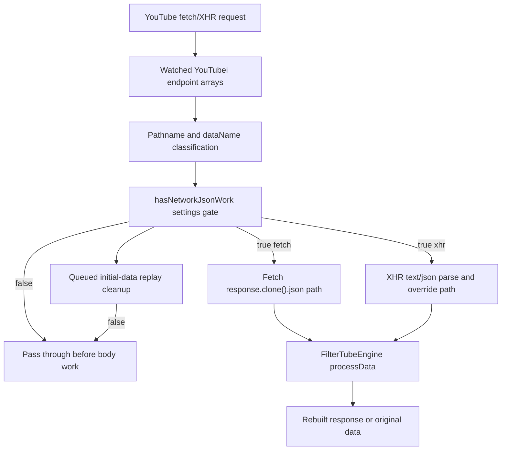

# FilterTube Network Fetch/XHR Callsite Register - Current Behavior - 2026-05-22

Status: audit-only current-behavior register. Runtime behavior is unchanged.

This slice promotes network request review from reason-family summaries into a
source-derived callsite register for current tracked product JavaScript. It
covers explicit `fetch(...)` request rows, seed XHR prototype patch rows, and
network response body consumption rows that currently turn responses into JSON,
HTML/text, or streams.

This is not completion proof for network authority, credentials policy,
YouTube-visible fetch budgets, XHR pass-through budgets, JSON-first body
decisions, response mutation safety, sender trust, route scoping, settings-mode
no-work behavior, or fixture provenance. It is a current-behavior boundary
before changing network fallbacks, endpoint interception, identity recovery,
subscription import, release-note loading, or first-class JSON filtering.

## Source Boundary

```text
tracked product JS/JSX/MJS files scanned: 69
tracked product files with network fetch/XHR rows: 6
network fetch/XHR rows: 29
request primitive rows: 16
response consumption rows: 13
fetch rows: 13
XMLHttpRequest prototype rows: 3
response.body.getReader rows: 3
response.json rows: 3
response.text rows: 7
runtime behavior changed: no
```

The scan excludes `tests/`, `docs/`, and `js/vendor/` because this register is
about product/runtime network behavior, not verifier or audit text. It also
uses `git ls-files`, so ignored root captures and local generated artifacts are
outside this current product-source boundary.

`js/nanah_managed_live_policy.js` is included in the scanned product file count
after the managed-policy live-send slice, but it contributes zero network
fetch/XHR rows; live transport still flows through the Nanah client owned by the
dashboard runtime.

Adjacent APIs intentionally excluded from the network row count:

```text
runtime.getURL(...) constructs extension resource URLs but is not a fetch.
URL.createObjectURL(...) creates local Blob download URLs and is not network.
file.text() reads an uploaded/imported local File and is not a network response.
```

## Source Fingerprints

| Source file | Lines | Bytes | SHA-256 |
| --- | ---: | ---: | --- |
| `js/background.js` | 6,711 | 301,840 | `b27206ec2b6927fc33f823c4832ff95ace7c97bd4284eb950fc5964baf666346` |
| `js/content/handle_resolver.js` | 282 | 9,785 | `67cc877a0a97e4c4c5aaf5a0d1c37c15000af5238f8f37d7c5dc6efee27e34ff` |
| `js/content_bridge.js` | 13,636 | 604,184 | `8d55d0c8995e5b68bb9142c41f95046a676f5af2b83f8545b00f91a6a5a3776d` |
| `js/injector.js` | 3,593 | 155,830 | `634041581ec84db2edd4f07d46f4bfb9d3a7d97036a0fb83db7739856bdc3e04` |
| `js/seed.js` | 1,136 | 50,026 | `a9d86cd973b998ffbd58faf316ca679267ce7267af36969683f32b760f49054d` |
| `js/tab-view.js` | 13,624 | 628,461 | `77f20044b7e6bddf0bf9b8a455f0d38f7018cffcde82c42ba9af1c4a3491b428` |

## File And Operation Counts

| File | Rows |
| --- | ---: |
| `js/background.js` | 13 |
| `js/content/handle_resolver.js` | 2 |
| `js/content_bridge.js` | 6 |
| `js/injector.js` | 2 |
| `js/seed.js` | 4 |
| `js/tab-view.js` | 2 |

| Operation | Rows |
| --- | ---: |
| `XMLHttpRequest` | 1 |
| `fetch` | 13 |
| `proto.open.assign` | 1 |
| `proto.send.assign` | 1 |
| `response.body.getReader` | 3 |
| `response.json` | 3 |
| `response.text` | 7 |

## Network Fetch/XHR Rows

```text
js/background.js:2078:fetch:releaseNotesExtensionResource
js/background.js:2080:response.json:releaseNotesJsonDecode
js/background.js:3279:fetch:shortsIdentityBackgroundHtmlFetch
js/background.js:3290:response.body.getReader:shortsIdentityStreamReader
js/background.js:3395:fetch:kidsWatchIdentityHtmlFetch
js/background.js:3406:response.body.getReader:kidsWatchIdentityStreamReader
js/background.js:3488:fetch:watchIdentityHtmlFetch
js/background.js:3499:response.body.getReader:watchIdentityStreamReader
js/background.js:5034:fetch:channelInfoPrimaryHtmlFetch
js/background.js:5048:fetch:channelInfoHandleFallbackHtmlFetch
js/background.js:5062:response.text:channelInfoPrimaryHtmlDecode
js/background.js:5201:fetch:channelInfoPublicFallbackHtmlFetch
js/background.js:5210:response.text:channelInfoPublicFallbackHtmlDecode
js/content/handle_resolver.js:239:fetch:directHandleHtmlFetch
js/content/handle_resolver.js:255:response.text:directHandleHtmlDecode
js/content_bridge.js:1943:fetch:watchMetaDirectHtmlFetch
js/content_bridge.js:1951:response.text:watchMetaDirectHtmlDecode
js/content_bridge.js:8771:fetch:shortsDirectHtmlFetch
js/content_bridge.js:8783:response.text:shortsDirectHtmlDecode
js/content_bridge.js:8920:fetch:watchIdentityDirectHtmlFetch
js/content_bridge.js:8932:response.text:watchIdentityDirectHtmlDecode
js/injector.js:1471:fetch:subscriptionImportYoutubeiPost
js/injector.js:1525:response.text:subscriptionImportBodyDecode
js/seed.js:701:response.json:passiveFetchCloneJsonDecode
js/seed.js:770:XMLHttpRequest:xhrPrototypeLookup
js/seed.js:924:proto.open.assign:xhrOpenPrototypePatch
js/seed.js:940:proto.send.assign:xhrSendPrototypePatch
js/tab-view.js:2664:fetch:dashboardReleaseNotesExtensionResource
js/tab-view.js:2669:response.json:dashboardReleaseNotesJsonDecode
```

## Current Behavior Boundaries

- Explicit `fetch(...)` rows cover extension release notes, background watch /
  Shorts / Kids identity HTML fetches, background channel-page resolution,
  direct content-script watch/Shorts/handle fallback fetches, main-world
  subscription import, and dashboard release notes.
- Background identity fallback rows use `response.body.getReader()` for three
  streamed HTML reads: Shorts, Kids watch, and normal watch.
- Seed fetch interception consumes matching YouTubei responses with
  `response.clone().json()`. That row is response-body work caused by page
  traffic, not an explicit product `fetch(...)` request row.
- Seed XHR interception patches `XMLHttpRequest.prototype.open` and
  `XMLHttpRequest.prototype.send`; endpoint marking and listener wrapping happen
  before later settings/no-work guards can reject processing.
- HTML/text response consumption is split across background channel resolution,
  direct handle repair, direct watch/Shorts identity recovery, and subscription
  import response parsing.
- `file.text()` in dashboard import code is excluded because it reads a local
  user-selected file, not a network response.

## Release Hot-Path Network No-Work Addendum - 2026-05-27

This addendum records the release-lag transport rows that prevent empty,
disabled, or otherwise inactive blocklist settings from paying YouTubei
clone/parse/replay work. It is audit-only. It does not approve endpoint
rewrites, credential changes, response mutation changes, JSON-first promotion,
or whitelist behavior changes.

| Network no-work row | Source pins | Current gate/effect | Release risk controlled |
| --- | --- | --- | --- |
| `release_network_seed_active_work_predicate` | `js/seed.js:234-237` | Seed network JSON work is false for missing/disabled settings, true for whitelist mode, and otherwise requires content filters or active JSON rules. | Keeps empty blocklist separate from empty whitelist before transport body work starts. |
| `release_network_seed_pre_parse_bypass` | `js/seed.js:253-260` | Fetch/XHR YouTubei responses pass through before JSON parse when settings are missing or no active JSON work exists. | Prevents no-rule SPA navigation from cloning/parsing large JSON payloads. |
| `release_network_seed_process_with_engine_no_work` | `js/seed.js:383-408` | `processWithEngine()` queues missing settings but returns original data when active JSON work is false. | Prevents replay/initial-data paths from invoking the JSON engine for no-work settings. |
| `release_network_seed_fetch_clone_guard` | `js/seed.js:694-701` | The fetch hook calls `shouldBypassYouTubeiNetworkResponse()` before `response.clone().json()`. | Ensures the passive fetch path does not clone/parse inactive YouTubei responses. |
| `release_network_seed_xhr_parse_guard` | `js/seed.js:826-851` | The XHR load hook marks inactive responses processed and returns before responseText trimming, `JSON.parse`, or engine processing. | Keeps XHR interception from becoming a text/JSON parse cost when settings have no active JSON work. |
| `release_network_seed_replay_queue_no_work_cleanup` | `js/seed.js:1002-1014` | Settings updates with no active JSON work clear pending queues and raw snapshots without replaying captured seed data. | Prevents repeated SPA/settings churn from replaying stale JSON snapshots after the no-work state is known. |
| `release_network_injector_active_work_predicate` | `js/injector.js:185-188` | Injector uses the same disabled, whitelist-active, and active-rule JSON work predicate as seed. | Keeps page-world processing policy aligned with isolated-world transport policy. |
| `release_network_injector_settings_queue_gate` | `js/injector.js:1940-1944` | Incoming settings clear queued page-world data and skip queue processing when active JSON work is false. | Prevents settings delivery from draining stale queued JSON through the engine after no-work settings arrive. |
| `release_network_injector_process_queue_gate` | `js/injector.js:3412-3436` | Injector processing and queued initial-data replay return/clear when `hasNetworkJsonWork(currentSettings)` is false. | Prevents page-world `ytInitialData` and player-response hooks from processing inactive JSON. |

Current release transport status:

```text
release network no-work semantic rows: 9
seed fetch/XHR product callsite count changed by addendum: no
network authority approval from this addendum: NO-GO
runtime behavior changed by this addendum: no
```

## Passive YouTubei Transport Patch Token Snapshot - 2026-05-27

This snapshot pins the current seed transport wrapper tokens that can affect
YouTube SPA smoothness even when FilterTube is not issuing an explicit product
`fetch(...)`. It is audit-only: it does not approve endpoint rewrites, XHR
patch changes, response override changes, or JSON-first promotion.

Endpoint arrays:

| Endpoint | Fetch endpoint array occurrences | XHR endpoint array occurrences |
| --- | ---: | ---: |
| `/youtubei/v1/search` | 1 | 1 |
| `/youtubei/v1/guide` | 1 | 1 |
| `/youtubei/v1/browse` | 1 | 1 |
| `/youtubei/v1/next` | 1 | 1 |
| `/youtubei/v1/player` | 1 | 1 |

Fetch wrapper token baseline in `setupFetchInterception()`:

| Token | Count |
| --- | ---: |
| `originalFetch.apply` | 3 |
| `shouldBypassYouTubeiNetworkResponse` | 1 |
| `response.clone().json` | 1 |
| `new Response` | 2 |
| `JSON.stringify` | 2 |
| `processWithEngine` | 1 |

XHR wrapper token baseline in `setupXhrInterception()`:

| Token | Count |
| --- | ---: |
| `__filtertube_shouldProcessXhr` | 6 |
| `__filtertube_responseProcessed` | 5 |
| `__filtertube_modifiedResponse` | 8 |
| `__filtertube_modifiedResponseText` | 4 |
| `__filtertube_responseInterceptorsInstalled` | 2 |
| `listenerWrapperMap` | 3 |
| `Object.defineProperty` | 2 |
| `JSON.parse` | 1 |
| `JSON.stringify` | 1 |
| `originalAddEventListener` | 7 |
| `originalRemoveEventListener` | 4 |

Current interpretation:

- Fetch and XHR both watch the same 5 YouTubei endpoint families.
- The fetch hook has one JSON clone/parse site and two response rebuild sites,
  gated by `shouldBypassYouTubeiNetworkResponse()` before body work.
- The XHR hook has a larger patch footprint: listener wrapping, processed
  flags, response override fields, and prototype response/responseText
  property interceptors. These are passive page-traffic hooks, not explicit
  product network requests.
- Any future optimization must preserve the no-work bypass before `response.clone().json`,
  before XHR `JSON.parse`, and before queued initial-data replay.

## YouTubei Endpoint Admission Owner Flow Addendum - 2026-05-27

This addendum turns the passive transport token snapshot into an owner-flow
ledger for endpoint admission. It is audit-only. It does not approve endpoint
rewrites, response mutation changes, XHR patch changes, JSON-first promotion,
or whitelist behavior changes.

```text
YouTube page fetch/XHR URL
        |
        v
watched endpoint family arrays
        |
        v
pathname/dataName classification
        |
        v
active JSON-work predicate
        |
        +--> no active JSON work: pass through before clone/parse/replay
        |
        v
fetch clone path or XHR parse/override path
        |
        v
FilterTubeEngine JSON decision
        |
        v
rebuilt response or unmodified pass-through
```



| YouTubei endpoint admission row | Source pins | Current owner/effect | Release risk controlled |
| --- | --- | --- | --- |
| `youtubei_fetch_endpoint_array_owner` | `js/seed.js:667-673` | The fetch hook admits only 5 YouTubei endpoint families before any FilterTube body work. | Prevents unrelated page fetches from entering passive JSON filtering. |
| `youtubei_xhr_endpoint_array_owner` | `js/seed.js:762-768` | The XHR hook uses the same 5 endpoint families for prototype request marking. | Keeps fetch and XHR admission families aligned before optimization. |
| `youtubei_fetch_url_classification_owner` | `js/seed.js:675-695` | Fetch URLs are normalized to pathname-backed `dataName` values and rejected by the no-work gate before cloning. | Keeps empty/disabled/no-useful blocklist SPA traffic from paying clone/parse cost. |
| `youtubei_xhr_marking_owner` | `js/seed.js:924-950` | XHR open/send stores the original URL, computes the same pathname-backed `dataName`, and marks processing only for admitted endpoints with active JSON work. | Prevents inactive XHR responses from installing parse/override work. |
| `youtubei_active_work_owner` | `js/seed.js:234-260`; `js/injector.js:185-188` | Disabled/missing settings are inactive, whitelist mode is active, and blocklist mode requires active content or JSON rules. | Preserves "block matching content / whitelist only allowed content" mode differences while keeping empty blocklist low-work. |
| `youtubei_fetch_response_owner` | `js/seed.js:698-745` | Admitted fetch responses clone/parse once, optionally synthesize an empty comments continuation, and otherwise rebuild with processed JSON. | Captures the response mutation path that must remain guarded and behavior-compatible. |
| `youtubei_xhr_response_owner` | `js/seed.js:813-851` | Admitted XHR responses reject until ready, reject inactive settings, bypass before trim/parse, then parse text/json before engine processing. | Keeps XHR text/JSON work out of no-work states and documents where response override begins. |
| `youtubei_replay_queue_owner` | `js/seed.js:1002-1014`; `js/injector.js:1940-1944`; `js/injector.js:3412-3436` | Settings and queue replay paths clear pending seed/injector data when active JSON work is false. | Prevents stale captured JSON from replaying after the runtime knows there is no active transport work. |

Current endpoint admission status:

```text
YouTubei endpoint admission owner rows: 8
ASCII YouTubei endpoint admission flow diagram: present
Mermaid YouTubei endpoint admission flow diagram: present
YouTubei endpoint admission source proof: PARTIAL
endpoint policy promotion approval from owner flow: NO-GO
runtime behavior changed by this addendum: no
```

## Risk Notes

Reliability risk is concentrated in split request ownership. A single visible
identity repair can involve background fetches, direct content-script fetches,
page-world import fetches, passive fetch interception, and XHR interception, but
there is no shared callsite manifest tying each row to owner, trigger, route,
profile, list mode, credentials, dedupe key, timeout, and side effects.

False-hide/leak risk follows from response interpretation. JSON and HTML bodies
can feed learned maps, renderer mutation, whitelist allow/block decisions,
fallback menu labels, and DOM reruns. Without per-row source-confidence and
negative-sibling fixtures, an optimization can either prune a needed fallback or
keep a weak fallback that allows or hides the wrong target.

Performance risk follows from body work and patch work. Missing settings and
disabled states can still pay seed clone/JSON parse work; XHR can still mark,
wrap, and hook matching requests before late no-work checks; direct identity
fallbacks can still make YouTube-visible fetches unless each row has an active
reason and budget.

Code-burden risk follows from parallel network surfaces. Background,
content-bridge, handle-resolver, injector, seed, and dashboard code each encode
their local network rules. Network cleanup or JSON-first promotion needs row
equivalence proof before rows can be merged, deleted, or changed.

## Future Proof Fields

Each network row must eventually be backed by source line, owner, reason, work
permission, and fixture evidence:

```text
networkFetchXhrReference
sourceFile
sourceLine
operation
requestOwner
requestReason
responseConsumptionMode
endpointOrUrlPattern
triggerClass
senderClass
targetRoute
targetSurface
targetProfile
targetListMode
activeRuleReason
credentialsPolicy
cachePolicy
timeoutPolicy
dedupeKey
maxPerNavigationBudget
bodyParseBudget
xhrPatchBudget
jsonFirstBodyDecision
storageKeysTouched
learnedIdentityEffect
domMutationEffect
hideAllowEffect
restoreEffect
statsEffect
teardownPolicy
positiveFixture
negativeNoRuleFixture
negativeDisabledFixture
negativeSiblingFixture
```

## Missing Runtime Authority Symbols

No product source currently defines:

```text
networkFetchXhrCallsiteAuthority
networkRequestPrimitiveRegister
networkResponseConsumptionDecision
networkFetchNoWorkBudget
networkXhrPatchBudget
networkCredentialPolicyReport
networkJsonFirstBodyDecision
networkFetchFixtureProvenance
youtubeiEndpointAdmissionAuthority
networkEndpointAdmissionDecision
networkEndpointOwnerReport
youtubeiEndpointNoWorkBudget
```

## Network Credential Policy Matrix Addendum

`docs/audit/FILTERTUBE_NETWORK_CREDENTIAL_POLICY_MATRIX_CURRENT_BEHAVIOR_2026-05-24.md`
and
`tests/runtime/network-credential-policy-matrix-current-behavior.test.mjs`
split the request primitive register into explicit credential-mode ownership.
The addendum pins 13 scoped product `fetch` callsites, 11 explicit credential
options, 2 extension-resource fetch rows without explicit credentials, 6
`include` rows, 4 `same-origin` rows, and 1 `omit` row. It keeps the authority
gap explicit: credential modes are still local callsite choices rather than a
first-class owner/reason/route/profile/list-mode policy report, and product
runtime source still lacks `networkCredentialPolicyMatrixContract`,
`networkCredentialPolicyReport`, `networkCredentialDecision`,
`ownerCredentialPolicy`, `networkCredentialNoWorkBudget`, and
`networkCredentialJsonFirstGate`.

## Method Semantic Proof Gap Boundary

`docs/audit/FILTERTUBE_METHOD_SEMANTIC_PROOF_GAP_INDEX_CURRENT_BEHAVIOR_2026-05-25.md`
is a required source input before this network fetch/XHR callsite register can
support runtime optimization or JSON-first promotion. Current proof pins:

```text
method semantic proof gap files covered: 69
method semantic proof gap lexical callables covered: 5836
files with complete per-callable semantic proof: 0
lexical callables requiring semantic proof before behavior changes: 5836
affected callable semantic proof: NO-GO
runtime behavior changed: no
```

These counts are audit-only blockers. They do not approve runtime
optimization, JSON-first behavior, endpoint rewrites, fetch/XHR no-work
changes, network authority changes, or whitelist behavior changes.
