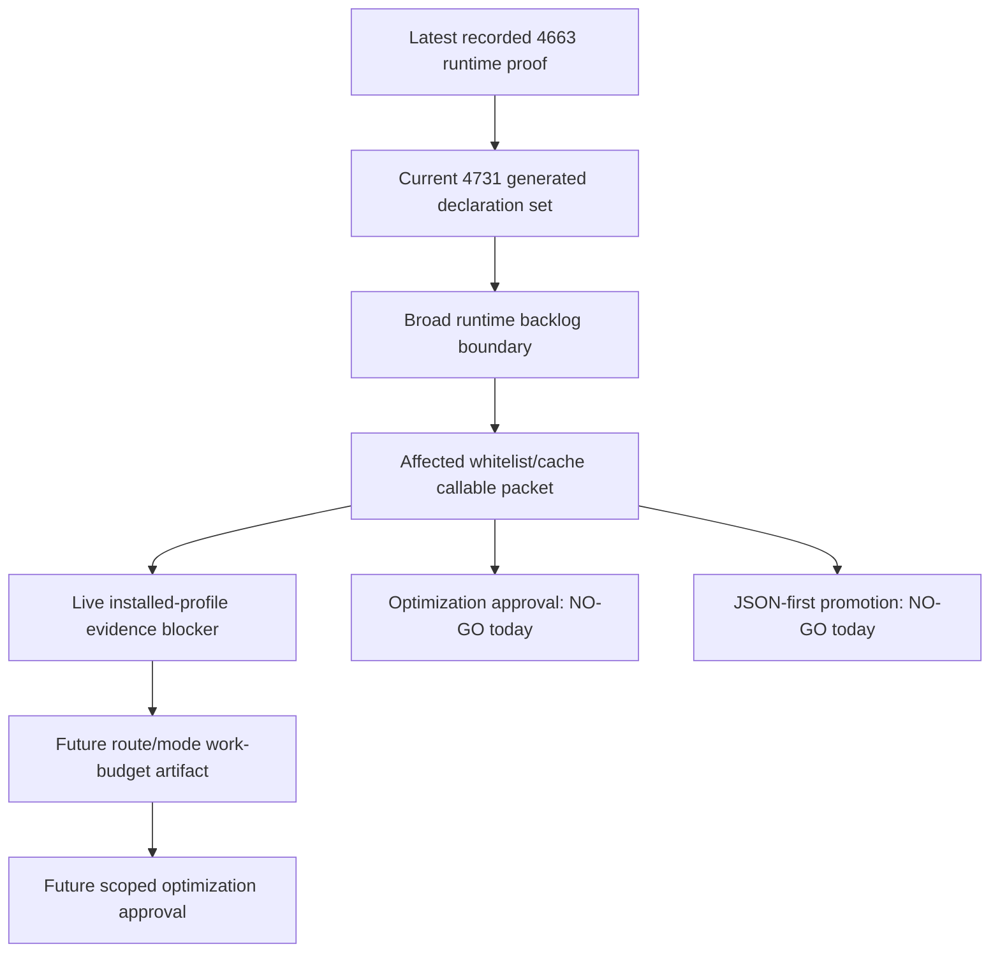

# FilterTube Optimization Candidate Priority Register - Current Behavior - 2026-05-24

Status: audit-only current-behavior priority register. Runtime behavior is unchanged.
This is not an implementation patch, optimization patch, JSON-first behavior
patch, whitelist patch, settings patch, logging patch, metric patch, or release
patch.

## Purpose

This register answers the optimization part of the active audit without opening
the implementation gate. The audit has found concrete places where JSON-first
filtering can become a first-class direction, but the same evidence also shows
that the first implementation work must be ordered around missing metric,
work-decision, list-mode, lifecycle, identity, and parity authorities.

The current boundary is:

```text
Optimization candidates are source-backed and ranked here.
None is approved for runtime changes until its required authority exists.
```

## Source Inputs

| Input | Current proof used |
| --- | --- |
| `docs/audit/FILTERTUBE_JSON_FIRST_NO_WORK_OPTIMIZATION_CROSSWALK_CURRENT_BEHAVIOR_2026-05-21.md` | Seed fetch pass-through, XHR pass-through, harvest split, DOM lifecycle, quick-block lifecycle, category metadata, and metric artifact candidates. |
| `docs/audit/FILTERTUBE_JSON_FIRST_ACTIVE_WORK_PREDICATE_REGISTER_CURRENT_BEHAVIOR_2026-05-22.md` | 11 predicate anchors, 5 endpoint entries per interceptor set, 36 DOM fallback active triggers, 1000 ms quick-block setup delay, and no quick-block periodic timer after the SPA drag optimization. |
| `docs/audit/FILTERTUBE_JSON_FIRST_LIST_MODE_MATRIX_BOUNDARY_CURRENT_BEHAVIOR_2026-05-22.md` | Disabled harvest-before-return behavior, empty blocklist preserve behavior, empty whitelist fail-close behavior, unknown list mode fallback, and blocklist/whitelist conflict behavior. |
| `docs/audit/FILTERTUBE_JSON_FIRST_METRIC_ARTIFACT_GATE_CURRENT_BEHAVIOR_2026-05-22.md` | Current performance proof is not a route/sample/device metric artifact and runtime source lacks first-class JSON metric authority. |
| `docs/audit/FILTERTUBE_RUNTIME_DIAGNOSTIC_LOGGING_POLICY_MATRIX_CURRENT_BEHAVIOR_2026-05-24.md` | 419 active console callsites, including 182 in `js/content_bridge.js` and 102 in `js/background.js`, without a privacy/redaction/metric policy. |
| `docs/audit/FILTERTUBE_CURRENT_DIRTY_WORKTREE_AUDIT_BOUNDARY_CURRENT_BEHAVIOR_2026-05-23.md` | The current tracked dirty runtime diff does not implement a whitelist optimization or JSON-first runtime optimization. |
| `docs/audit/FILTERTUBE_RELEASE_FIX_AUDIT_STATUS_2026-05-26.md` | Release-fix status milestones plus the 2026-05-27 post-release audit continuation keep the green runtime count separate from implementation approval. |
| `docs/audit/FILTERTUBE_RELEASE_REGRESSION_LAG_AND_BLOCKLIST_FIX_2026-05-26.md` | Current 2026-05-30 full runtime freshness proof: 4663/4663 pass, 0 fail, 83.213s, without approving JSON-first promotion or whitelist/cache optimization. |
| `docs/audit/FILTERTUBE_WHITELIST_CACHE_SPA_AFFECTED_CALLABLE_PROOF_BOUNDARY_CURRENT_BEHAVIOR_2026-05-30.md` | May 30 affected-callable packet, transport no-work evidence, route/mode callable budget contract, and live installed-profile evidence blocker map for the user-reported SPA lag path. |
| `docs/audit/FILTERTUBE_ACTIVE_GOAL_COMPLETION_AUDIT_2026-05-21.md` | Active-goal freshness ledger tying the 4663-test runtime proof, live evidence blocker, method/JSON-first freshness, and audit-directory placement back to the still-open broad audit. |

## Current Counts

```text
optimization priority candidates: 12
P0 prerequisite candidates: 6
P1 follow-on candidates: 5
P2 rollout candidates: 1
implementation-ready candidates: 0
source-backed candidates: 12
runtime behavior changed: no
not completion proof for optimization authority
```

## Priority Register

| Candidate id | Priority | Current evidence | Why it is ranked here | Missing authority before implementation |
| --- | --- | --- | --- | --- |
| `FT-OPT-00-metric-artifact-gate` | P0 | Current performance docs are claim boundaries, not committed route/sample/device metric artifacts. | Without a metric artifact, an optimization can only move cost between seed, DOM, network, storage, and logging. | `jsonFirstMetricArtifactReport`; route/surface/list-mode samples; parse/stringify/processData/harvest/listener/observer/timer/network/storage/hide/restore counters. |
| `FT-OPT-01-seed-fetch-pass-through` | P0 | `js/seed.js` fetch interception now checks `shouldBypassYouTubeiNetworkResponse()` before clone parsing when no active JSON work exists; active paths still parse, process, and rebuild responses. | This is the highest direct no-work candidate, but it can break zero-flash JSON mutation if changed without active-rule proof. | `jsonFirstSeedPassThroughBudget`; endpoint, route, rule-state, parse/stringify counters, and positive active-rule fixture. |
| `FT-OPT-02-seed-xhr-pass-through` | P0 | XHR interception now gates endpoint-like marking and response parsing through the no-work predicate; active XHR paths still wrap listeners, parse text/JSON responses, and can override response fields. | Fetch-only optimization would leave the XHR transport path doing similar work or leaking mutations. | `jsonFirstXhrPassThroughBudget`; open/send marks, wrapped-listener counts, parse/stringify counts, and shared endpoint policy. |
| `FT-OPT-03-active-work-decision` | P0 | Seed, filter engine, DOM fallback, fallback menu, quick-block, and category metadata paths use separate active-work predicates. | JSON-first cannot be first class while each owner decides work independently. | `jsonFirstWorkDecision`; one work report spanning endpoint, route, surface, profile, list mode, rule state, JSON fields, DOM selectors, and allowed work. |
| `FT-OPT-04-harvest-mutation-split` | P0 | `processData()` harvests channel data before its disabled-filtering skip, while seed skip branches can call `harvestOnly()`. | Removing harvest blindly can break learned identity and menu/block actions; keeping it blindly preserves disabled/no-rule cost. | `jsonFirstHarvestDecision`; disabled/no-rule harvest policy, map-write provenance, mutation-free pass-through proof, and identity side-effect budget. |
| `FT-OPT-05-list-mode-empty-policy` | P0 | Empty blocklist preserves normal video renderers, empty whitelist fail-closes non-comment renderers, and unknown `listMode` falls back to blocklist. | Recent whitelist work makes list-mode semantics the biggest false-hide/leak boundary before no-work changes. | `jsonFirstListModeDecisionReport`; empty blocklist policy, empty whitelist policy, unknown-mode fallback policy, comment list-mode policy, and simultaneous allow/block conflict report. |
| `FT-OPT-06-dom-lifecycle-budget` | P1 | DOM fallback startup installs observers, prefetch work, playlist/right-rail hooks, pending whitelist timers, and rerun paths after settings exist. | JSON-first promotion cannot delete or defer DOM fallback until sparse surfaces and pending identity paths have parity proof. | `jsonFirstDomLifecycleBudget`; selector owner, route/surface, list mode, active-rule state, listener/observer/timer counts, and DOM parity fixtures. |
| `FT-OPT-07-fallback-menu-lifecycle-budget` | P1 | Fallback menu setup installs style, observer, DOMContentLoaded, `yt-navigate-finish`, click, scroll, requestAnimationFrame, timeout, and interval work; item insertion checks come later. | Menu repair is an explicit-action affordance path and should not be conflated with passive JSON endpoint filtering. | `jsonFirstFallbackMenuLifecyclePredicate`; explicit-user-action budget, whitelist/show-menu gates, no-rule budget, and route/fullscreen/native pause proof. |
| `FT-OPT-08-quick-block-lifecycle-budget` | P1 | Quick-block starts after a 1000 ms timer, exits before setup when disabled, and no longer owns the old periodic full-document sweep; active setup still installs styles, listeners, observer, and route/mutation-scoped sweeps before per-card insertion checks. | Deferring it can improve no-work states, but a wrong gate can break the visible quick-block affordance. | `jsonFirstQuickBlockLifecycleBudget`; disabled, whitelist, enabled blocklist, mobile, desktop, and action fixtures. |
| `FT-OPT-09-category-metadata-fetch-gate` | P1 | Category filtering can schedule metadata fetches when category metadata is missing. | A JSON-first category feature can silently become network-first unless cache-miss fetches are explicitly budgeted. | `jsonFirstCategoryMetadataBudget`; selected-category state, route/profile, cache-hit/miss, fetch, DOM rerun, and storage counters. |
| `FT-OPT-10-diagnostic-logging-policy` | P1 | The current runtime has 419 active console callsites, with the hottest files in page runtime and background identity/storage code. | Console diagnostics can distort optimization measurements and can expose identity/import data without a privacy class. | `diagnosticLogPolicyReport`; debug gate, privacy class, redaction policy, console budget, and metric replacement report. |
| `FT-OPT-11-native-release-parity-rollout` | P2 | JSON-first, DOM, metric, and release/native sync proofs are separate current-behavior layers. | Broad rollout should follow extension proof, then package/native parity and artifact proof. | `jsonFirstNativeParityReport`; release artifact hash manifest, native runtime sync proof, and public-claim gate. |

## Implementation Boundary

The ranked order above means:

1. Measure and report current work before optimizing it.
2. Unify the work decision before deleting or deferring owner-specific work.
3. Treat whitelist/list-mode semantics as a first-class policy, not a side
   effect of renderer traversal.
4. Keep DOM, menu, quick-block, category fetch, diagnostic logging, and
   native/release rollout behind explicit parity and budget reports.

This register is deliberately stricter than a local performance todo list. A
future optimization patch must cite its candidate id, prove the missing
authority, and include positive, negative, route, mode, side-effect, restore,
and metric evidence.

## Release Stabilization Rebaseline Addendum - 2026-05-27

The May 26-27 release stabilization changed the hot-path behavior that exposed
YouTube lag, but it does not make any optimization candidate implementation
ready. This addendum rebaselines the priority register after the current
source gained no-work JSON gates, forced visible-card reprocess preservation,
canonical Main keyword compilation, lazy quick-block/menu behavior, native menu
state repair, and Topic byline ampersand handling.

The candidate order remains intentionally unchanged:

```text
release stabilization reduced known hot-path cost
        |
        v
candidate ids and priorities remain stable
        |
        v
next optimization still needs metric + work-decision authority
        |
        v
runtime optimization approval remains NO-GO
```

| Candidate | Release-stabilized current behavior | Why it remains in the register |
| --- | --- | --- |
| `FT-OPT-00-metric-artifact-gate` | The full runtime audit is green again, but that is assertion proof, not a route/sample/device metric artifact. | The next optimization must measure parse, stringify, processData, harvest, observer, listener, timer, storage, network, hide, restore, and diagnostic cost instead of relying on subjective smoothness. |
| `FT-OPT-01-seed-fetch-pass-through` | Fetch now checks `shouldBypassYouTubeiNetworkResponse()` before `response.clone().json()` for no active JSON work. | Active-rule fetch paths still parse, process, and rebuild responses; a first-class pass-through budget must prove endpoint, route, list-mode, and mutation effects. |
| `FT-OPT-02-seed-xhr-pass-through` | XHR open/send processing is gated by `shouldBypassYouTubeiNetworkResponse()` before response JSON parse/rewrite. | XHR still owns endpoint matching, request marking, listener wrapping, and response override behavior on active paths; fetch and XHR need one shared transport work decision. |
| `FT-OPT-03-active-work-decision` | Seed, injector, bridge settings, DOM fallback, quick-block, and menu paths now have narrower local gates. | The gates are still owner-local, so JSON-first cannot become first class until one decision report spans JSON, DOM, menu, quick-block, category metadata, profile, route, list mode, and rule state. |
| `FT-OPT-04-harvest-mutation-split` | No-work transport bypass reduces clone/parse/replay cost before the engine is called. | Engine calls can still harvest identity before disabled/mutation decisions, and learned identity/menu affordances still need map-write provenance. |
| `FT-OPT-05-list-mode-empty-policy` | Visible blocklist refresh and canonical Main keywords now behave correctly for rule changes such as `shakira`. | Whitelist fail-closed behavior, unresolved identity, conflict precedence, and empty allow-list semantics remain the main false-hide/leak authority gate. |
| `FT-OPT-06-dom-lifecycle-budget` | Whitelist pending-hide now rejects before broad selector traversal, and forced reprocess is preserved when rule-changing settings arrive. | DOM fallback still owns sparse-surface filtering, restore, pending identity, prefetch, right-rail, and selected-row behavior outside one lifecycle budget. |
| `FT-OPT-08-quick-block-lifecycle-budget` | The broad periodic full-document quick-block sweep is gone; quick-block setup is lazy and blocklist-only for action UI. | The visible quick-cross affordance still depends on observer/listener/timer state, route surfaces, and startup races, so pruning requires explicit action fixtures. |
| `FT-OPT-10-diagnostic-logging-policy` | The stabilization proof stack documents current behavior, but runtime diagnostics remain source-scattered. | Measurement work still needs a privacy, redaction, console-budget, and metric-replacement policy before optimization claims are trustworthy. |

Current release rebaseline status:

```text
release-stabilized optimization candidate rows: 9
candidate ids changed by release stabilization: 0
candidate priority order changed by release stabilization: no
implementation-ready candidates after release stabilization: 0
runtime behavior changed by this addendum: no
first-class JSON optimization approval after release stabilization: NO-GO
```

This addendum is the optimization counterpart to the dated release hot-path
proof stack. It records that the release fixes made YouTube smoother and
repaired visible blocklist/menu/Topic behavior, while keeping the next runtime
optimization behind measured work-decision proof.

## Current Freshness And Live-Profile Blocker Addendum - 2026-05-30

The May 30 audit continuation refreshes the priority register against the
current proof stack after the context handoff, the Kully/Gussy Topic
investigation, and the whitelist/cache SPA affected-callable packet. The
optimization order still does not change.

```text
latest historical 4663 full runtime proof: 4663/4663 pass, 0 fail, 83.213s
current generated runtime-test declaration count: 4731
current broad runtime proof for generated 4731 declaration set: NO-GO
current broad runtime audit snapshot: 4731 tests, 4580 pass, 151 fail
affected callable packet rows: 12
affected source files covered: 8
transport no-work source evidence rows: 8
live evidence execution blocker rows: 8
connected Chrome profile inventory acceptance: NO-GO
scratch/private Chrome profile acceptance: NO-GO
source-only affected-callable packet as live execution proof: NO-GO
implementation-ready candidates after May 30 freshness: 0
whitelist/cache optimization approval after May 30 freshness: NO-GO
JSON-first first-class promotion after May 30 freshness: NO-GO
runtime behavior changed by this addendum: no
```

The important practical decision is that current source-backed proof is enough
to keep auditing and enough to prevent blind optimization, but not enough to
claim release-grade performance evidence. Any live YouTube SPA result must come
from the normal installed Chrome profile and visible YouTube tab where the
extension is installed, with installed-byte parity and route/mode behavior
samples recorded beside the counters.

ASCII flow:

```text
current source/runtime proof
  -> latest recorded 4663/4663 runtime suite proof
  -> current 4731 generated declaration set
  -> broad runtime backlog boundary
  -> affected whitelist/cache callable packet
  -> live installed-profile evidence blocker
  -> future measured route/mode work-budget artifact
  -> future scoped optimization approval
```

Mermaid flow:



This addendum prevents three bad shortcuts:

1. Treating the green runtime suite as a performance metric artifact.
2. Treating source-only affected-callable anchors as live SPA evidence.
3. Treating a scratch/private Chrome profile or connected-tab inventory as
   proof of the installed user-visible extension bytes.

## First Optimization Implementation Readiness Gate Addendum

First optimization implementation readiness gate addendum:
`docs/audit/FILTERTUBE_FIRST_OPTIMIZATION_IMPLEMENTATION_READINESS_GATE_CURRENT_BEHAVIOR_2026-05-24.md`
and
`tests/runtime/first-optimization-implementation-readiness-gate-current-behavior.test.mjs`
fold this candidate register into the first-optimization implementation
decision. The addendum pins 14 implementation readiness rows, 0 runtime first
optimization approvals, and 0 implementation-ready first optimization rows. It
keeps this prerequisite audit-only until one scoped future patch proves the
full chain of candidate, obligation, authority, evidence packet, binding,
artifact, source owner, collector insertion, no-work, side-effect, fixture
provenance, parity, rollout, and rollback proof.

## First Optimization Candidate Selection Boundary Addendum

First optimization candidate selection boundary addendum:
`docs/audit/FILTERTUBE_FIRST_OPTIMIZATION_CANDIDATE_SELECTION_BOUNDARY_CURRENT_BEHAVIOR_2026-05-24.md`
and
`tests/runtime/first-optimization-candidate-selection-boundary-current-behavior.test.mjs`
select `FT-BIND-00-metric-artifact-foundation` as the next audit-only work
packet without changing this priority register. The addendum pins 10 candidate
selection rows, 1 selected audit work packet, 0 selected runtime behavior
patches, and 0 implementation-ready selected candidate rows. It keeps runtime
optimization blocked until a scoped metric artifact foundation packet proves
owner mapping, fixtures, no-work, side-effect, parity, diagnostic, and rollout
boundaries.

## Missing Runtime Authority Symbols

No product runtime source currently defines:

```text
filterTubeOptimizationPriorityAuthority
optimizationCandidateDecisionReport
jsonFirstOptimizationWorkOrder
jsonFirstMetricArtifactReport
jsonFirstSeedPassThroughBudget
jsonFirstXhrPassThroughBudget
jsonFirstWorkDecision
jsonFirstHarvestDecision
jsonFirstListModeDecisionReport
jsonFirstDomLifecycleBudget
jsonFirstFallbackMenuLifecyclePredicate
jsonFirstQuickBlockLifecycleBudget
jsonFirstCategoryMetadataBudget
diagnosticLogPolicyReport
jsonFirstNativeParityReport
```

## Verification

Current proof command:

```bash
node --test tests/runtime/optimization-candidate-priority-register-current-behavior.test.mjs --test-reporter=spec
```

This register is not a completion claim. It records a source-backed optimization
order while keeping JSON-first, whitelist, no-work, logging, native parity, and
runtime behavior changes blocked.

## P0 Metric Work Decision Authority Addendum

P0 optimization metric work decision authority addendum:
`docs/audit/FILTERTUBE_P0_OPTIMIZATION_METRIC_WORK_DECISION_AUTHORITY_CURRENT_BEHAVIOR_2026-05-24.md`
and
`tests/runtime/p0-optimization-metric-work-decision-authority-current-behavior.test.mjs`
convert the P0 priority rows into one current-behavior authority boundary. The
addendum pins six implementation-blocking rows: metric artifact authority, seed
transport work decision, harvest versus mutation decision, list-mode and
whitelist work decision, lifecycle owner work decision, and diagnostic
measurement policy. It does not approve optimization; it requires a measured
route/surface/list-mode work decision report before JSON-first or whitelist
runtime behavior can change.

## Stop Go Decision Record Addendum

Optimization stop go decision record addendum:
`docs/audit/FILTERTUBE_OPTIMIZATION_STOP_GO_DECISION_RECORD_CURRENT_BEHAVIOR_2026-05-24.md`
and
`tests/runtime/optimization-stop-go-decision-record-current-behavior.test.mjs`
convert the priority register into the current implementation decision. Stop
now and optimize whitelist behavior is NO-GO; stop now and promote JSON paths is
NO-GO; continue the proof-backed pre-implementation audit is GO. This does not
approve implementation work. It says the first future patch must cite one
candidate id, one obligation id, and a measured work-decision or metric-artifact
evidence packet.

## Candidate Obligation Binding Matrix Addendum

Candidate obligation binding matrix addendum:
`docs/audit/FILTERTUBE_CANDIDATE_OBLIGATION_BINDING_MATRIX_CURRENT_BEHAVIOR_2026-05-24.md`
and
`tests/runtime/candidate-obligation-binding-matrix-current-behavior.test.mjs`
map the 12 ranked candidates to route/surface metric obligations, whitelist
readiness gaps, source loci, and first-patch evidence rows. The addendum keeps
the priority register audit-only: all 12 candidates are referenced, but 0
candidate-obligation bindings are implementation-ready because no scoped metric
artifact, fixture packet, side-effect budget, parity proof, or rollout boundary
has been committed.

## Method Semantic Proof Gap Boundary

`docs/audit/FILTERTUBE_METHOD_SEMANTIC_PROOF_GAP_INDEX_CURRENT_BEHAVIOR_2026-05-25.md`
is a required source input before this optimization candidate register can
support runtime optimization or JSON-first promotion. Current proof pins:

```text
method semantic proof gap files covered: 69
method semantic proof gap lexical callables covered: 5701
files with complete per-callable semantic proof: 0
lexical callables requiring semantic proof before behavior changes: 5701
affected callable semantic proof: NO-GO
runtime behavior changed: no
```

These counts are audit-only blockers. They do not approve runtime
optimization, JSON-first behavior, method deletion, method merging, lifecycle
cleanup, no-work changes, or whitelist behavior changes.
