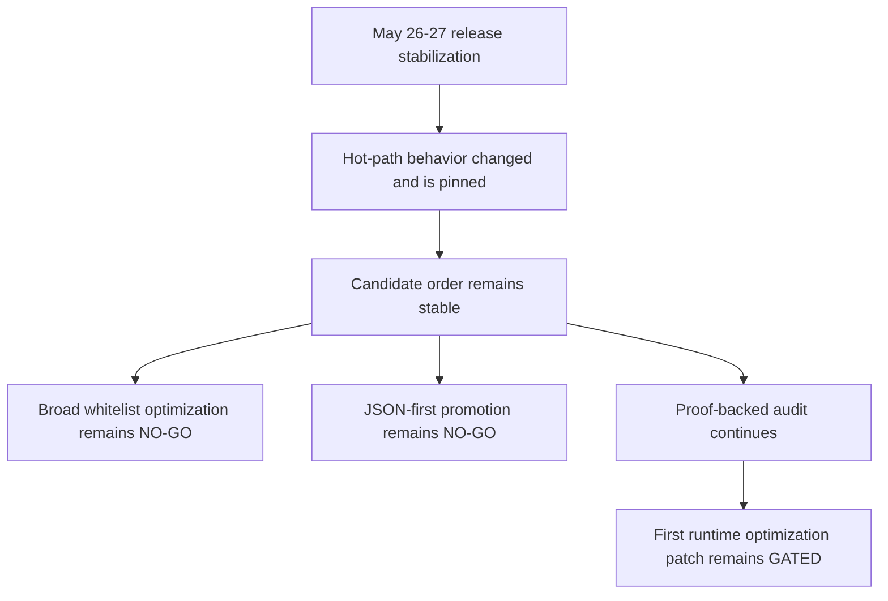
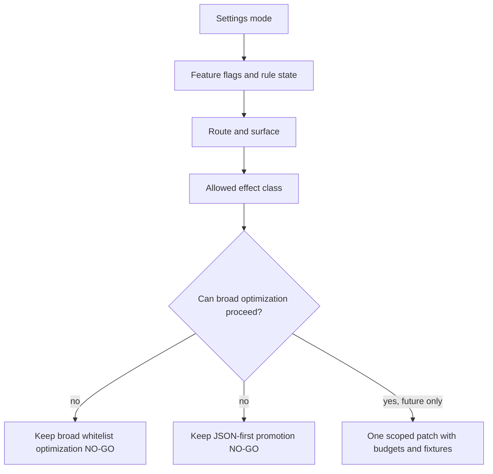

# FilterTube Optimization Stop/Go Decision Record - Current Behavior - 2026-05-24

Status: audit-only current-behavior stop/go decision record. Runtime behavior is
unchanged. This is not an implementation patch, optimization patch, JSON-first
behavior patch, whitelist patch, metric patch, lifecycle patch, logging patch,
settings patch, or release patch.

## Purpose

This record answers the immediate implementation question raised during the
audit: should FilterTube stop the broad inspection now and optimize recent
whitelist behavior, or continue until the optimization gates are proven?

The current decision is:

```text
Stop-now whitelist optimization decision: NO-GO
Stop-now JSON-first optimization decision: NO-GO
Continue proof-backed pre-implementation audit: GO
```

This is not a claim that optimization is blocked forever. It means the first
runtime optimization patch still needs metric artifacts, route/surface fixture
proof, list-mode decisions, lifecycle budgets, side-effect budgets, parity
fixtures, and one work-decision authority before behavior changes.

## Source Inputs

| Input | Current proof used |
| --- | --- |
| `docs/audit/FILTERTUBE_CURRENT_DIRTY_WORKTREE_AUDIT_BOUNDARY_CURRENT_BEHAVIOR_2026-05-23.md` | Current tracked runtime diff does not implement a whitelist optimization or JSON-first runtime optimization. |
| `docs/audit/FILTERTUBE_OPTIMIZATION_CANDIDATE_PRIORITY_REGISTER_CURRENT_BEHAVIOR_2026-05-24.md` | 12 optimization candidates are source-backed, 6 are P0 prerequisites, and 0 are implementation-ready. |
| `docs/audit/FILTERTUBE_AUDIT_COMPLETION_GAP_REGISTER_2026-05-20.md` | Release hot-path proof stack documents the May 26-27 stabilization slice without closing the broad audit. |
| `docs/audit/FILTERTUBE_RELEASE_REGRESSION_LAG_AND_BLOCKLIST_FIX_2026-05-26.md` | Release fix record pins the lag/blocklist/menu/Topic behavior changes and final green runtime audit. |
| `docs/audit/FILTERTUBE_RELEASE_FIX_AUDIT_STATUS_2026-05-26.md` | Release-fix status milestones plus the 2026-05-27 post-release audit continuation keep green runtime proof separate from stop/go approval. |
| `docs/audit/FILTERTUBE_JSON_FIRST_ACTIVE_WORK_PREDICATE_REGISTER_CURRENT_BEHAVIOR_2026-05-22.md` | Active-work predicate register documents current no-work JSON gates and quick-block lifecycle status. |
| `docs/audit/FILTERTUBE_P0_OPTIMIZATION_METRIC_WORK_DECISION_AUTHORITY_CURRENT_BEHAVIOR_2026-05-24.md` | Six P0 authority rows remain missing before optimization. |
| `docs/audit/FILTERTUBE_P0_OPTIMIZATION_ROUTE_SURFACE_METRIC_FIXTURE_MATRIX_CURRENT_BEHAVIOR_2026-05-24.md` | 12 route/surface metric fixture obligations are defined, and 0 route/surface optimization rows are implementation-ready. |
| `docs/audit/FILTERTUBE_JSON_FIRST_FILTER_READINESS_GATE_CURRENT_BEHAVIOR_2026-05-21.md` | JSON-first promotion rows remain blocked; documented JSON paths are not permission to mutate or prune fallback work. |
| `docs/audit/FILTERTUBE_SETTINGS_MODE_COVERAGE_MATRIX_2026-05-18.md` | Empty whitelist, empty blocklist, disabled mode, content empty values, menu/quick lifecycle, and route modes remain not-ready-for-behavior-change or partial. |
| `docs/audit/FILTERTUBE_MODE_SURFACE_EFFECT_MATRIX_CURRENT_BEHAVIOR_2026-05-20.md` | Settings mode, rule state, feature flags, route, surface, source tier, and allowed effects are separate decision inputs. |
| `docs/audit/FILTERTUBE_RUNTIME_DIAGNOSTIC_LOGGING_POLICY_MATRIX_CURRENT_BEHAVIOR_2026-05-24.md` | 419 active console callsites remain without a first-class diagnostic measurement policy. |

## Current Counts

```text
stop/go decision rows: 8
NO-GO runtime optimization rows: 6
GO audit-continuation rows: 1
GATED first-patch rows: 1
implementation-ready whitelist optimization rows: 0
implementation-ready JSON-first optimization rows: 0
required first-patch evidence classes: 12
runtime behavior changed: no
not completion proof for the broad audit
```

## Release Stabilization Stop/Go Revalidation Addendum - 2026-05-27

The May 26-27 release stabilization changed user-visible hot-path behavior,
but it does not change the broad optimization stop/go decision. This addendum
records the date, behavior change, and remaining gate so the release fix is
not mistaken for approval to start broad whitelist pruning or JSON-first
promotion.

ASCII decision flow:

```text
release stabilization proof pinned
        |
        v
YouTube hot-path lag, stale blocklist refresh, native menu state, and Topic
byline ampersand behavior have dated proof
        |
        v
stop-now broad whitelist optimization: NO-GO
stop-now broad JSON-first promotion: NO-GO
continue proof-backed audit: GO
first future optimization patch: GATED
```

Mermaid decision flow:



| Revalidated decision | Post-stabilization answer | Release-stabilized behavior now documented | Remaining gate |
| --- | --- | --- | --- |
| `FT-STOPGO-00-stop-now-whitelist-optimization` | NO-GO | Visible blocklist refresh and canonical Main keyword compilation now reprocess rendered cards when rules change, including cases like `shakira`. | Whitelist fail-closed behavior, unresolved identity, conflict precedence, empty allow-list semantics, and route/surface metrics still need authority. |
| `FT-STOPGO-01-stop-now-json-path-promotion` | NO-GO | Seed fetch/XHR no-work gates now bypass inactive YouTubei body clone/parse/rewrite work. | No first-class JSON work authority exists for renderer ownership, field effects, mutation effects, DOM parity, native parity, or list-mode policy. |
| `FT-STOPGO-02-start-metricless-performance-optimization` | NO-GO | Full runtime audit is green after the stabilization fix stack. | Runtime assertions and subjective smoothness are not route/sample/device metric artifacts. |
| `FT-STOPGO-03-start-transport-pass-through` | NO-GO | Fetch checks `shouldBypassYouTubeiNetworkResponse()` before `response.clone().json()`, and XHR active work is gated before response JSON parse/rewrite. | Active-rule transport still needs endpoint, route, list-mode, harvest, mutation, and response-rebuild proof across fetch and XHR together. |
| `FT-STOPGO-04-start-lifecycle-pruning` | NO-GO | Whitelist pending-hide rejects run before broad selector traversal, quick-block no longer has a periodic full-document sweep, and native dropdown close handling no longer poisons reused YouTube menu nodes. | DOM fallback, sparse surfaces, quick-cross affordances, menu repair, selected rows, observers, listeners, timers, hide, and restore still need lifecycle budgets. |
| `FT-STOPGO-06-continue-preimplementation-audit` | GO | Release proof now covers lifecycle, settings-mode, network JSON no-work, DOM selector, cross-feature, and method semantic slices in `docs/audit`. | The broad audit remains incomplete because every file/method/JSON path/selector/runtime/list-mode/cross-feature interaction is not yet fully closed. |
| `FT-STOPGO-07-first-future-patch-shape` | GATED | The first acceptable patch shape remains one scoped candidate plus one obligation, with metric/work-decision proof. | No broad whitelist, JSON path, DOM pruning, logging cleanup, or lifecycle cleanup patch is approved by the release stabilization. |

Release stabilization behavior ledger:

| Behavior area | Dated current behavior after stabilization | Stop/go effect |
| --- | --- | --- |
| Empty or disabled rule work | Inactive JSON transport can pass through before body clone/parse/rewrite. | Reduces lag, does not approve active-path transport pruning. |
| Visible blocklist refresh | Rule-changing settings preserve forced DOM reprocess and compile `main.keywords` before stale aliases. | Fixes visible leaks, does not approve whitelist policy changes. |
| Whitelist pending-hide | Cheap route/mode gates now run before selector traversal. | Reduces selector cost, does not approve broad whitelist optimization. |
| Native/comment menus | FilterTube close handling avoids permanently hiding reused YouTube dropdown nodes. | Fixes menu usability, does not approve menu lifecycle pruning. |
| Quick-block affordance | Periodic broad sweep is gone; quick-block remains lazy/action-scoped. | Reduces SPA drag, does not prove all quick-cross surfaces. |
| Topic bylines | Ampersand is not treated as a collaborator separator; `Kully B & Gussy G - Topic` is a Topic label unless stronger collaborator evidence exists. | Fixes a false collaborator classification, does not complete collaborator identity proof. |

Current release-stabilized stop/go status:

```text
release stabilization stop/go revalidation rows: 7
release-stabilized stop-now whitelist optimization decision: NO-GO
release-stabilized stop-now JSON-first promotion decision: NO-GO
release-stabilized metricless optimization decision: NO-GO
release-stabilized transport pass-through broad optimization decision: NO-GO
release-stabilized lifecycle pruning broad optimization decision: NO-GO
release-stabilized continue audit decision: GO
release-stabilized first future optimization patch decision: GATED
runtime behavior changed by this addendum: no
broad audit completion from this addendum: NO-GO
```

## Settings Mode Cross-Feature Stop/Go Continuation - 2026-05-28

The 2026-05-28 mode/surface effect continuation tightens this stop/go record:
performance optimization cannot treat empty blocklist, empty whitelist,
disabled settings, content-control flags, quick/menu actions, or native overlay
quieting as one interchangeable inactive state. Each state has a different
allowed-effect set.

ASCII decision flow:

```text
settings mode plus feature flags
        |
        v
route and surface
        |
        v
allowed effect class
        |
        v
same broad optimization question
        |
        v
empty-blocklist no-work shortcut: NO-GO without budgets
empty-whitelist shortcut reuse: NO-GO
content-control no-rule shortcut: NO-GO
quick/menu lifecycle pruning: NO-GO
native-overlay global pause: NO-GO
```

Mermaid decision flow:



| Cross-feature state | Stop/go effect | Required proof before optimization |
| --- | --- | --- |
| Empty blocklist | NO-GO for global zero-work shortcut. | Prove parse, harvest, learned-map, stale cleanup, quick-block affordance, menu lifecycle, and DOM budgets per route/surface. |
| Empty whitelist | NO-GO for reusing blocklist no-work logic. | Prove fail-closed behavior, identity prefetch, pending hide, and recheck effects for each video/card surface. |
| Disabled settings | NO-GO for deleting cleanup/lifecycle paths. | Prove stale marker cleanup, observer/listener/timer setup, restore, and no-effect behavior per route. |
| Content-control flags | NO-GO for keyword/channel-only no-rule optimization. | Prove duration, upload-date, uppercase, category, comments, Shorts, home, watch, playlist, and shell flags with value validity. |
| Quick block and normal menu | NO-GO for broad action/lifecycle pruning. | Prove visible action affordance, listener setup, menu repair, outside-close behavior, and post-action identity fanout separately. |
| Native overlay/fullscreen/app shell | NO-GO for global pause authority. | Prove which observers, timers, fallback paths, and restore paths are quieted for each shell state. |

Current settings-mode stop/go status:

```text
settings-mode stop/go continuation rows: 6
empty-blocklist broad no-work shortcut decision: NO-GO
empty-whitelist shortcut reuse decision: NO-GO
disabled cleanup deletion decision: NO-GO
content-control no-rule shortcut decision: NO-GO
quick/menu lifecycle pruning decision: NO-GO
native-overlay global pause decision: NO-GO
runtime behavior changed by this addendum: no
broad audit completion from this addendum: NO-GO
```

## Stop/Go Decision Matrix

| Decision id | Decision | Current evidence | Reason |
| --- | --- | --- | --- |
| `FT-STOPGO-00-stop-now-whitelist-optimization` | NO-GO | Empty whitelist fail-closes non-comment renderers, whitelist mode bypasses some no-rule skips, unresolved identity can false-hide, and no route/surface metric artifact exists. | Recent whitelist behavior is exactly the area with the highest false-hide/leak risk, so optimizing it before list-mode and fixture authority would bake in unstable behavior. |
| `FT-STOPGO-01-stop-now-json-path-promotion` | NO-GO | The JSON-first readiness gate keeps normalized path syntax, renderer ownership, field-effect authority, route/surface scope, list-mode semantics, identity confidence, mutation effect, no-work budget, fixture provenance, DOM parity, native parity, and optimization budget blocked. | A documented JSON path or `FILTER_RULES` path is evidence, not effect authority. |
| `FT-STOPGO-02-start-metricless-performance-optimization` | NO-GO | Current performance proof is source/count proof, debug timing, stats, and console diagnostics rather than route/sample/device artifacts. | Without committed metrics, an optimization can shift work from endpoint parsing to DOM, network, storage, logging, restore, or lifecycle work. |
| `FT-STOPGO-03-start-transport-pass-through` | NO-GO | Fetch and XHR both use five endpoint families, and fetch still parses/rebuilds before late no-settings or disabled decisions. | Transport pass-through needs active-rule, endpoint, route, list-mode, harvest, mutation, and response-rebuild proof across fetch and XHR together. |
| `FT-STOPGO-04-start-lifecycle-pruning` | NO-GO | DOM fallback, fallback menu, quick-block, category metadata, pending whitelist, and native overlay quiet paths still use separate lifecycle predicates. | Pruning observers, listeners, timers, or fallback work can create sparse-surface leaks or break explicit action affordances without lifecycle budgets. |
| `FT-STOPGO-05-start-diagnostic-log-removal` | NO-GO | Diagnostic logging is source-scattered and lacks privacy, redaction, no-work, metric-replacement, and route/profile/list-mode policy. | Removing logs without a policy can hide audit evidence while retaining measurement distortion or privacy risk elsewhere. |
| `FT-STOPGO-06-continue-preimplementation-audit` | GO | Current artifacts remain under `docs/audit`, runtime verifiers remain under `tests/runtime`, and the proof baseline is green. | Continue converting audit findings into precise gates before runtime changes. |
| `FT-STOPGO-07-first-future-patch-shape` | GATED | The first implementation patch must cite one candidate id and one obligation id, then prove the missing authority for that scope. | The first acceptable runtime patch shape is a measured work-decision or metric-artifact patch, not a broad whitelist, JSON path, DOM pruning, or logging cleanup patch. |

## Required First-Patch Evidence Classes

Before any runtime optimization changes behavior, the future patch should name
all of these for its exact scope:

```text
candidateId
obligationId
sourceLocus
route
surface
endpoint
profileType
listMode
ruleState
positiveFixture
negativeSiblingFixture
metricArtifact
```

The same patch should also prove side-effect and parity boundaries:

```text
workAllowed
workForbidden
parseBudget
stringifyBudget
processDataBudget
harvestBudget
listenerObserverTimerBudget
networkStorageBudget
hideRestoreBudget
diagnosticBudget
domParityFixture
nativeParityFixture
```

## Implementation Boundary

The audit has found concrete optimization locations and a viable JSON-first
direction. The stop/go decision is still NO-GO for runtime optimization because
the current evidence proves source locations and risks, not a complete
work-decision authority.

The next aligned work is to continue proof-backed audit slices until a future
patch can satisfy one candidate id, one route/surface obligation id, and the
required metric artifact without weakening whitelist safety or JSON/DOM parity.

## Whitelist Readiness Gap Matrix Addendum

Whitelist optimization readiness gap matrix addendum:
`docs/audit/FILTERTUBE_WHITELIST_OPTIMIZATION_READINESS_GAP_MATRIX_CURRENT_BEHAVIOR_2026-05-24.md`
and
`tests/runtime/whitelist-optimization-readiness-gap-matrix-current-behavior.test.mjs`
expand the stop-now whitelist NO-GO decision into 10 exact readiness gaps. This
keeps recent whitelist behavior in audit mode until empty whitelist, unresolved
identity, list-mode conflict, transition mutation, dormant import, pending-hide,
watch rail, selected-row parity, surface parity, and metric entry-gate proof
exists.

## First Optimization Patch Evidence Packet Contract Addendum

First optimization patch evidence packet contract addendum:
`docs/audit/FILTERTUBE_FIRST_OPTIMIZATION_PATCH_EVIDENCE_PACKET_CONTRACT_CURRENT_BEHAVIOR_2026-05-24.md`
and
`tests/runtime/first-optimization-patch-evidence-packet-contract-current-behavior.test.mjs`
turn the GATED first-patch row into a required evidence packet contract. The
contract does not approve implementation work; it requires a future patch to
bind one candidate id to one obligation id, one source locus, one scoped route
surface, one metric artifact, fixtures, side-effect budgets, parity proof, and
rollout claim boundaries.

## First Optimization Implementation Readiness Gate Addendum

First optimization implementation readiness gate addendum:
`docs/audit/FILTERTUBE_FIRST_OPTIMIZATION_IMPLEMENTATION_READINESS_GATE_CURRENT_BEHAVIOR_2026-05-24.md`
and
`tests/runtime/first-optimization-implementation-readiness-gate-current-behavior.test.mjs`
fold this stop/go record into the first-optimization implementation decision.
The addendum pins 14 implementation readiness rows, 0 runtime first
optimization approvals, and 0 implementation-ready first optimization rows. It
keeps this prerequisite audit-only until one scoped future patch proves the
full chain of candidate, obligation, authority, evidence packet, binding,
artifact, source owner, collector insertion, no-work, side-effect, fixture
provenance, parity, rollout, and rollback proof.

## First Optimization Candidate Selection Boundary Addendum

First optimization candidate selection boundary addendum:
`docs/audit/FILTERTUBE_FIRST_OPTIMIZATION_CANDIDATE_SELECTION_BOUNDARY_CURRENT_BEHAVIOR_2026-05-24.md`
and
`tests/runtime/first-optimization-candidate-selection-boundary-current-behavior.test.mjs`
select `FT-BIND-00-metric-artifact-foundation` as the next audit-only work
packet without changing this stop/go decision. The addendum pins 10 candidate
selection rows, 1 selected audit work packet, 0 selected runtime behavior
patches, and 0 implementation-ready selected candidate rows. It keeps runtime
optimization blocked until a scoped metric artifact foundation packet proves
owner mapping, fixtures, no-work, side-effect, parity, diagnostic, and rollout
boundaries.

## JSON-First Implementation Authority Boundary Addendum

JSON-first implementation authority boundary addendum:
`docs/audit/FILTERTUBE_JSON_FIRST_IMPLEMENTATION_AUTHORITY_BOUNDARY_CURRENT_BEHAVIOR_2026-05-24.md`
and
`tests/runtime/json-first-implementation-authority-boundary-current-behavior.test.mjs`
keeps the stop-now JSON-first optimization decision at NO-GO while documenting
that code inspection has found the exact future authority boundary. The
addendum pins 13 JSON-first implementation authority rows, 16 current
JSON-first source anchors, 0 runtime JSON-first implementation approvals, 0
runtime JSON-first promotion authority rows, 0 committed JSON-first metric
artifacts, 0 implementation-ready JSON-first rows, expected runtime audit tests: 4457, expected runtime audit pass: 4457, and expected runtime audit fail 0.

## JSON-First Route/Surface Implementation Authority Boundary Addendum

JSON-first route/surface implementation authority boundary addendum:
`docs/audit/FILTERTUBE_JSON_FIRST_ROUTE_SURFACE_IMPLEMENTATION_AUTHORITY_BOUNDARY_CURRENT_BEHAVIOR_2026-05-24.md`
and
`tests/runtime/json-first-route-surface-implementation-authority-boundary-current-behavior.test.mjs`
keeps stop-now JSON-first path promotion and whitelist optimization at NO-GO
for route/surface reasons. The addendum pins 12 JSON-first route/surface
implementation authority rows, 9 route/surface effect classes covered, 12
route/surface metric obligations covered, 0 runtime JSON-first route/surface
approvals, 0 runtime route/surface metric artifacts, and 0 implementation-ready
JSON-first route/surface rows.

## JSON-First Route/Surface Fixture Packet Contract Addendum

JSON-first route/surface fixture packet contract addendum:
`docs/audit/FILTERTUBE_JSON_FIRST_ROUTE_SURFACE_FIXTURE_PACKET_CONTRACT_CURRENT_BEHAVIOR_2026-05-24.md`
and
`tests/runtime/json-first-route-surface-fixture-packet-contract-current-behavior.test.mjs`
keeps stop-now JSON-first path promotion and whitelist optimization at NO-GO
because no route/surface fixture packet exists. The addendum pins 12 JSON-first
route/surface fixture packet rows, 8 fixture mode classes required, 14 fixture
evidence classes required, 0 committed route/surface fixture packet files, 0
runtime JSON-first fixture packet approvals, and 0 implementation-ready
JSON-first fixture packet rows.

## JSON-First Route/Surface Fixture Artifact Path Boundary Addendum

JSON-first route/surface fixture artifact path boundary addendum:
`docs/audit/FILTERTUBE_JSON_FIRST_ROUTE_SURFACE_FIXTURE_ARTIFACT_PATH_BOUNDARY_CURRENT_BEHAVIOR_2026-05-24.md`
and
`tests/runtime/json-first-route-surface-fixture-artifact-path-boundary-current-behavior.test.mjs`
keeps stop-now JSON-first path promotion and whitelist optimization at NO-GO
because the route/surface fixture packet artifact paths are only reserved. The
addendum pins 6 fixture artifact path rows, 5 reserved future artifact files, 0
committed route/surface fixture packet files, 0 runtime JSON-first fixture
packet approvals, and 0 implementation-ready route/surface fixture artifact
path rows.

## JSON-First Route/Surface Fixture Artifact Commit Readiness Gate Addendum

JSON-first route/surface fixture artifact commit readiness gate addendum:
`docs/audit/FILTERTUBE_JSON_FIRST_ROUTE_SURFACE_FIXTURE_ARTIFACT_COMMIT_READINESS_GATE_CURRENT_BEHAVIOR_2026-05-24.md`
and
`tests/runtime/json-first-route-surface-fixture-artifact-commit-readiness-gate-current-behavior.test.mjs`
keeps stop-now JSON-first path promotion and whitelist optimization at NO-GO
because reserved route/surface fixture artifacts are not commit-ready. The
addendum pins 10 fixture artifact commit readiness rows, 0 committed
route/surface fixture packet files, 0 runtime JSON-first fixture packet
approvals, 0 runtime route/surface metric artifact approvals, and 0
implementation-ready route/surface fixture artifact commit rows.

## JSON-First Route/Surface Fixture Artifact Contract Coverage Gate Addendum

JSON-first route/surface fixture artifact contract coverage gate addendum:
`docs/audit/FILTERTUBE_JSON_FIRST_ROUTE_SURFACE_FIXTURE_ARTIFACT_CONTRACT_COVERAGE_GATE_CURRENT_BEHAVIOR_2026-05-24.md`
and
`tests/runtime/json-first-route-surface-fixture-artifact-contract-coverage-gate-current-behavior.test.mjs`
keeps stop-now JSON-first path promotion and whitelist optimization at NO-GO
because contract coverage alone is not fixture artifact approval. The
addendum pins 10 fixture artifact contract coverage rows, 5 per-file fixture
artifact contract docs, 5 per-file fixture artifact contract tests, 0 committed
route/surface fixture packet files, 0 runtime JSON-first fixture packet
approvals, 0 runtime route/surface metric artifact approvals, and 0
implementation-ready route/surface fixture artifact contract coverage rows.

## JSON-First Route/Surface Fixture Manifest Contract Addendum

JSON-first route/surface fixture manifest contract addendum:
`docs/audit/FILTERTUBE_JSON_FIRST_ROUTE_SURFACE_FIXTURE_MANIFEST_CONTRACT_CURRENT_BEHAVIOR_2026-05-24.md`
and
`tests/runtime/json-first-route-surface-fixture-manifest-contract-current-behavior.test.mjs`
keeps stop-now JSON-first path promotion and whitelist optimization at NO-GO
because a manifest contract without the manifest artifact is not fixture
approval. The addendum pins 12 fixture manifest contract rows, 0 committed
route/surface fixture manifest files, 0 runtime JSON-first fixture manifest
approvals, 0 runtime route/surface metric artifact approvals, and 0
implementation-ready JSON-first fixture manifest contract rows.

## Missing Runtime Authority Symbols

No product runtime source currently defines:

```text
optimizationStopGoDecisionRecord
optimizationStopNowWhitelistNoGo
jsonFirstStopGoDecisionReport
whitelistOptimizationReadinessReport
firstOptimizationPatchEntryGate
firstOptimizationPatchEvidencePacket
jsonFirstStopGoMetricArtifact
optimizationGoNoGoAuthority
```

## Verification

Current proof command:

```bash
node --test tests/runtime/optimization-stop-go-decision-record-current-behavior.test.mjs --test-reporter=spec
```

This record is not a completion claim. It preserves the broad audit goal and
keeps whitelist, JSON-first, lifecycle, logging, and transport optimization
changes blocked until the missing authorities are proven.

## JSON-First Route/Surface Fixture Sample Contract Addendum

`docs/audit/FILTERTUBE_JSON_FIRST_ROUTE_SURFACE_FIXTURE_SAMPLE_CONTRACT_CURRENT_BEHAVIOR_2026-05-24.md`
and
`tests/runtime/json-first-route-surface-fixture-sample-contract-current-behavior.test.mjs`
add the second per-file route/surface fixture artifact contract to this
stop/go decision. The addendum pins 12 fixture sample contract rows, 1
reserved sample path, 0 committed route/surface fixture sample files, 0
runtime JSON-first fixture sample approvals, 0 runtime route/surface metric
artifact approvals, 0 runtime metric collector approvals, and 0
implementation-ready JSON-first fixture sample contract rows.

## JSON-First Route/Surface Fixture Provenance Artifact Contract Addendum

`docs/audit/FILTERTUBE_JSON_FIRST_ROUTE_SURFACE_FIXTURE_PROVENANCE_ARTIFACT_CONTRACT_CURRENT_BEHAVIOR_2026-05-24.md`
and
`tests/runtime/json-first-route-surface-fixture-provenance-artifact-contract-current-behavior.test.mjs`
add the third per-file route/surface fixture artifact contract to this
stop/go decision. The addendum pins 12 fixture provenance artifact contract
rows, 1 reserved provenance path, 0 committed route/surface fixture
provenance artifact files, 0 runtime JSON-first fixture provenance approvals,
0 runtime route/surface metric artifact approvals, 0 runtime metric collector
approvals, and 0 implementation-ready JSON-first fixture provenance artifact
contract rows.

## JSON-First Route/Surface Fixture Parity Report Contract Addendum

`docs/audit/FILTERTUBE_JSON_FIRST_ROUTE_SURFACE_FIXTURE_PARITY_REPORT_CONTRACT_CURRENT_BEHAVIOR_2026-05-24.md`
and
`tests/runtime/json-first-route-surface-fixture-parity-report-contract-current-behavior.test.mjs`
add the fourth per-file route/surface fixture artifact contract to this
stop/go decision. The addendum pins 12 fixture parity report contract rows, 1
reserved parity report path, 0 committed route/surface fixture parity report
files, 0 runtime JSON-first fixture parity report approvals, 0 runtime
route/surface metric artifact approvals, 0 runtime metric collector approvals,
and 0 implementation-ready JSON-first fixture parity report contract rows.

## JSON-First Route/Surface Fixture Verification Output Contract Addendum

`docs/audit/FILTERTUBE_JSON_FIRST_ROUTE_SURFACE_FIXTURE_VERIFICATION_OUTPUT_CONTRACT_CURRENT_BEHAVIOR_2026-05-24.md`
and
`tests/runtime/json-first-route-surface-fixture-verification-output-contract-current-behavior.test.mjs`
add the fifth per-file route/surface fixture artifact contract to this
stop/go decision. The addendum pins 12 fixture verification output contract
rows, 1 reserved verification output path, 0 committed route/surface fixture
verification output files, 0 runtime JSON-first fixture verification output
approvals, 0 runtime route/surface metric artifact approvals, 0 runtime
metric collector approvals, and 0 implementation-ready JSON-first fixture
verification output contract rows.

## JSON-First Route/Surface Fixture Approval Boundary Addendum

`docs/audit/FILTERTUBE_JSON_FIRST_ROUTE_SURFACE_FIXTURE_APPROVAL_BOUNDARY_CURRENT_BEHAVIOR_2026-05-24.md`
and
`tests/runtime/json-first-route-surface-fixture-approval-boundary-current-behavior.test.mjs`
add the missing approval-absence layer to this stop/go decision. The addendum
pins 12 JSON-first route/surface fixture approval boundary rows, 12 fixture
packet contract rows covered, 10 fixture artifact contract coverage rows
covered, 0 runtime JSON-first fixture packet approvals, 0 runtime JSON-first
fixture artifact approvals, 0 runtime route/surface metric artifact approvals,
0 committed route/surface fixture packet files, and 0 implementation-ready
JSON-first fixture approval rows. This keeps stop-now JSON-first promotion at
NO-GO while confirming that JSON-first remains the inspected first-class filter
direction.

## JSON-First Route/Surface Metric Artifact Approval Boundary Addendum

`docs/audit/FILTERTUBE_JSON_FIRST_ROUTE_SURFACE_METRIC_ARTIFACT_APPROVAL_BOUNDARY_CURRENT_BEHAVIOR_2026-05-24.md`
and
`tests/runtime/json-first-route-surface-metric-artifact-approval-boundary-current-behavior.test.mjs`
add the route/surface metric artifact approval absence layer to this stop/go
decision. The addendum pins 12 JSON-first route/surface metric artifact
approval boundary rows, 12 route/surface metric obligations covered, 12
JSON-first fixture approval rows covered, 12 metric artifact schema rows
covered, 12 source-owner rows covered, 12 collector insertion rows covered, 12
collector no-work rows covered, 12 collector side-effect rows covered, 12
collector fixture provenance rows covered, 0 runtime route/surface metric
artifact approvals, 0 runtime metric collector approvals, 0 runtime JSON-first
implementation approvals, 0 runtime whitelist optimization approvals, and 0
implementation-ready route/surface metric artifact approval rows. This keeps
stop-now JSON-first route/surface promotion and stop-now whitelist optimization
at NO-GO while preserving JSON-first as the inspected first-class filter
direction.

## JSON-First Route/Surface Metric Artifact Path Boundary Addendum

`docs/audit/FILTERTUBE_JSON_FIRST_ROUTE_SURFACE_METRIC_ARTIFACT_PATH_BOUNDARY_CURRENT_BEHAVIOR_2026-05-24.md`
and
`tests/runtime/json-first-route-surface-metric-artifact-path-boundary-current-behavior.test.mjs`
add the route/surface metric artifact path absence layer to this stop/go
decision. The addendum pins 6 JSON-first route/surface metric artifact path
rows, 1 reserved future metric artifact root, 5 reserved future metric
artifact files, 0 committed route/surface metric artifact files, 0 runtime
route/surface metric artifact approvals, 0 runtime metric collector approvals,
0 runtime JSON-first implementation approvals, 0 runtime whitelist optimization
approvals, and 0 implementation-ready route/surface metric artifact path rows.
This keeps stop-now JSON-first route/surface promotion and stop-now whitelist
optimization at NO-GO while proving path reservation is not artifact authority.

## JSON-First Route/Surface Metric Artifact Commit Readiness Gate Addendum

`docs/audit/FILTERTUBE_JSON_FIRST_ROUTE_SURFACE_METRIC_ARTIFACT_COMMIT_READINESS_GATE_CURRENT_BEHAVIOR_2026-05-24.md`
and
`tests/runtime/json-first-route-surface-metric-artifact-commit-readiness-gate-current-behavior.test.mjs`
add the route/surface metric artifact commit-readiness absence layer to this
stop/go decision. The addendum pins 10 JSON-first route/surface metric
artifact commit readiness rows, 6 metric artifact path boundary rows covered,
12 metric artifact approval boundary rows covered, 12 route/surface metric
obligations covered, 0 committed route/surface metric artifact files, 0
runtime route/surface metric artifact approvals, 0 runtime metric collector
approvals, 0 runtime JSON-first implementation approvals, 0 runtime whitelist
optimization approvals, and 0 implementation-ready route/surface metric
artifact commit rows. This keeps stop-now JSON-first route/surface promotion
and stop-now whitelist optimization at NO-GO while proving artifact path
reservation is not commit authority.

## JSON-First Route/Surface Metric Artifact Contract Coverage Gate Addendum

`docs/audit/FILTERTUBE_JSON_FIRST_ROUTE_SURFACE_METRIC_ARTIFACT_CONTRACT_COVERAGE_GATE_CURRENT_BEHAVIOR_2026-05-24.md`
and
`tests/runtime/json-first-route-surface-metric-artifact-contract-coverage-gate-current-behavior.test.mjs`
add the route/surface metric artifact contract-coverage gap layer to this
stop/go decision. The addendum pins 10 JSON-first route/surface metric
artifact contract coverage rows, 5 source metric foundation contract docs
referenced, 5 route/surface-specific per-file metric artifact contracts
covered, 0 committed route/surface metric artifact files, 0 runtime
route/surface metric artifact approvals, 0 runtime metric collector approvals,
0 runtime JSON-first implementation approvals, 0 runtime whitelist optimization
approvals, and 0 implementation-ready route/surface metric artifact contract
coverage rows. This keeps stop-now JSON-first route/surface promotion and
stop-now whitelist optimization at NO-GO while proving per-file contract
coverage is still not metric artifact approval.

## Method Semantic Proof Gap Boundary

`docs/audit/FILTERTUBE_METHOD_SEMANTIC_PROOF_GAP_INDEX_CURRENT_BEHAVIOR_2026-05-25.md`
is a required source input before this stop/go decision record can support
runtime optimization or JSON-first promotion. Current proof pins:

```text
method semantic proof gap files covered: 69
method semantic proof gap lexical callables covered: 5827
files with complete per-callable semantic proof: 0
lexical callables requiring semantic proof before behavior changes: 5827
affected callable semantic proof: NO-GO
runtime behavior changed: no
```

These counts are audit-only blockers. They do not approve runtime
optimization, JSON-first behavior, method deletion, method merging, lifecycle
cleanup, no-work changes, or whitelist behavior changes.
