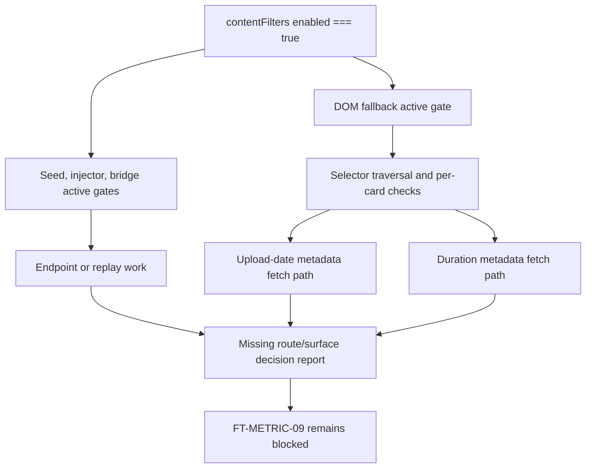

# FilterTube P0 Optimization Route Surface Metric Fixture Matrix - Current Behavior - 2026-05-24

Status: audit-only current-behavior fixture obligation matrix. Runtime behavior is unchanged.
This is not an implementation patch, optimization patch, metric patch, JSON-first
behavior patch, whitelist patch, endpoint patch, lifecycle patch, or settings
patch.

## Purpose

The P0 metric/work-decision authority gate says optimization needs measured
route/surface/list-mode evidence before runtime behavior changes. This matrix
turns that gate into concrete fixture obligations. It answers: which exact
scenarios must a future JSON-first or whitelist optimization measure and prove?

The current boundary is:

```text
Current audit evidence identifies route/surface/mode obligations.
Current runtime source does not emit metric artifacts for any of them.
No route/surface optimization row is implementation-ready.
```

## Source Inputs

| Input | Current proof used |
| --- | --- |
| `docs/audit/FILTERTUBE_P0_OPTIMIZATION_METRIC_WORK_DECISION_AUTHORITY_CURRENT_BEHAVIOR_2026-05-24.md` | Six P0 authority rows remain missing before optimization. |
| `docs/audit/FILTERTUBE_P0_NO_WORK_CURRENT_BEHAVIOR_2026-05-18.md` | Empty desktop home, empty mobile home, empty watch/player, and disabled extension no-work expectations are pinned as current gaps. |
| `docs/audit/FILTERTUBE_ENDPOINT_DECISION_MATRIX_2026-05-18.md` | Seed intercepts five YouTubei endpoint families and does not have one endpoint policy before fetch body work begins. |
| `docs/audit/FILTERTUBE_SETTINGS_MODE_COVERAGE_MATRIX_2026-05-18.md` | Disabled, empty blocklist, empty whitelist, non-empty blocklist, non-empty whitelist, Kids/Main/YTM, menu, quick-block, and content-filter modes remain partial/current gaps. |
| `docs/audit/FILTERTUBE_ROUTE_SURFACE_EFFECT_AUTHORITY_CURRENT_BEHAVIOR_2026-05-20.md` | Route/surface effect classes remain split across endpoints, Main home/search, Main watch, Shorts, Playlist/Mix, comments/posts, Kids, YTM, and native overlays. |
| `docs/audit/FILTERTUBE_JSON_FIRST_ACTIVE_WORK_PREDICATE_REGISTER_CURRENT_BEHAVIOR_2026-05-22.md` | Endpoint, engine, DOM fallback, fallback menu, quick-block, and category metadata predicates remain separate. |

## Current Counts

```text
P0 route/surface metric fixture obligations: 12
endpoint families requiring metric fixtures: 5
settings-mode dimensions represented: 5
surface families represented: 6
implementation-ready route/surface optimization rows: 0
runtime behavior changed: no
not completion proof for optimization fixture authority
```

## Fixture Obligation Matrix

| Obligation id | Route/surface/mode | Current proof gap | Required future metric evidence |
| --- | --- | --- | --- |
| `FT-METRIC-00-disabled-all-intercepts` | Disabled extension on `/search`, `/guide`, `/browse`, `/next`, and `/player` across Main/Kids/YTM where applicable. | Disabled currently returns unmodified data only after transport work in some paths. | Zero parse, stringify, processData, harvest, DOM scan, listener install, storage write, network fetch, hide, restore, and diagnostic spam. |
| `FT-METRIC-01-empty-blocklist-desktop-home` | Main desktop home `/youtubei/v1/browse`, empty blocklist. | Current no-work proof still has clone/parse, `harvestOnly`, and response rebuild. | Pass-through or explicitly budgeted harvest with map-write provenance and no DOM/menu/quick lifecycle overwork. |
| `FT-METRIC-02-empty-blocklist-mobile-home` | Main mobile home `/youtubei/v1/browse`, empty blocklist. | Mobile home does not share the desktop home skip behavior. | Same no-work budget as desktop home unless a mobile-specific active effect is proven. |
| `FT-METRIC-03-empty-blocklist-watch-player` | Main watch `/youtubei/v1/player` and watch metadata-only payloads, empty blocklist. | Player endpoint still enters generic processing and lacks metadata-only policy. | No recommendation mutation, no playback side effects, no unnecessary parse/rebuild, and metadata harvest only with explicit reason. |
| `FT-METRIC-04-empty-blocklist-watch-next` | Main watch `/youtubei/v1/next`, empty blocklist. | Watch recommendations, comments, playlist refresh, end screen, and scaffold payloads share a broad endpoint. | Separate metrics for recommendation rows, comment continuations, playlist/end-screen rows, scaffold preservation, and no-rule pass-through. |
| `FT-METRIC-05-empty-blocklist-guide` | Main `/youtubei/v1/guide`, empty blocklist. | Guide endpoint runs through generic processing without a guide-specific active-rule policy. | Sidebar/guide pass-through counters plus proof that no guide DOM or menu lifecycle work wakes without an active rule. |
| `FT-METRIC-06-empty-whitelist-main-json` | Main JSON renderers under explicit empty whitelist. | Empty whitelist fail-closes non-comment renderers and remains a false-hide risk. | Product-confirmed empty-whitelist fixture with removed/preserved row counts, sibling-visible proof, restore proof, and user-visible mode provenance. |
| `FT-METRIC-07-nonempty-blocklist-core-routes` | Non-empty blocklist on home, search, watch, Shorts, playlist, comments, and posts. | Supported and unsupported renderer families differ, and DOM fallback can still own effects. | Positive matched hide count, negative sibling-visible count, side-effect count, JSON/DOM parity, and route-local no-work for unrelated surfaces. |
| `FT-METRIC-08-nonempty-whitelist-unresolved-identity` | Non-empty whitelist on watch rails, Shorts, playlist/Mix, Kids, and YTM rows with incomplete identity. | Whitelist can fail-close when identity is display-only, joined by video id, pending, or unsupported. | Allow-match, unresolved-identity, pending-TTL, fallback-fetch, restore, and leak/false-hide metrics per surface. |
| `FT-METRIC-09-content-category-empty-values` | Duration, upload-date, uppercase, and category filters with enabled flags but blank/empty/zero selected values. | Raw enabled flags can wake endpoint and DOM work before final predicate validation. | Inactive compiled-state metrics proving zero endpoint mutation, zero metadata fetch, zero DOM scan, and zero false hide for blank values. |
| `FT-METRIC-10-lifecycle-affordance-off` | `showBlockMenuItem=false`, quick-block off, fallback-menu inactive, native overlay/fullscreen active. | Menu and quick-block lifecycle work can be broader than visible affordance gates. | Listener/observer/timer counts, pause/teardown proof, zero scan/injection when off, and action-positive proof when on. |
| `FT-METRIC-11-diagnostic-measurement-budget` | Diagnostic logging while measuring any optimization candidate. | Current console logging is source-scattered and not a metric artifact. | Log count, level, privacy class, redaction, debug gate, console budget, and metric-replacement output per route/surface fixture. |

## Required Metric Artifact Columns

Every future metric artifact for the rows above should include at least:

```text
obligationId
candidateId
route
surface
endpoint
profileType
listMode
extensionEnabled
ruleState
fixtureId
fixtureSource
positiveOrNegative
parseCount
stringifyCount
processDataCount
harvestCount
domScanCount
listenerCount
observerCount
timerCount
networkFetchCount
storageWriteCount
hideMutationCount
restoreMutationCount
diagnosticLogCount
elapsedMs
bytesRead
bytesWritten
siblingVisibleResult
restoreResult
artifactPath
```

## Current Implementation Boundary

This matrix is deliberately a fixture obligation layer, not a fix plan. It
requires the first optimization patch to choose one obligation id, generate a
metric artifact for it, and prove that related route/surface/list-mode rows do
not regress.

## Stop Go Decision Record Addendum

Optimization stop go decision record addendum:
`docs/audit/FILTERTUBE_OPTIMIZATION_STOP_GO_DECISION_RECORD_CURRENT_BEHAVIOR_2026-05-24.md`
and
`tests/runtime/optimization-stop-go-decision-record-current-behavior.test.mjs`
turn these obligations into the current implementation decision. Stop-now
whitelist optimization and stop-now JSON-first path promotion are both NO-GO
until one scoped obligation has metric artifacts, sibling-visible proof,
restore proof, JSON/DOM parity, side-effect budgets, and a work-decision
authority.

## First Optimization Patch Evidence Packet Contract Addendum

First optimization patch evidence packet contract addendum:
`docs/audit/FILTERTUBE_FIRST_OPTIMIZATION_PATCH_EVIDENCE_PACKET_CONTRACT_CURRENT_BEHAVIOR_2026-05-24.md`
and
`tests/runtime/first-optimization-patch-evidence-packet-contract-current-behavior.test.mjs`
bind this obligation matrix to the first future optimization patch shape. A
future patch must choose one obligation id and pair it with a candidate id,
source locus, route/surface/list-mode scope, metric artifact, fixtures,
side-effect budgets, and parity proof before runtime behavior changes.

## First Optimization Implementation Readiness Gate Addendum

First optimization implementation readiness gate addendum:
`docs/audit/FILTERTUBE_FIRST_OPTIMIZATION_IMPLEMENTATION_READINESS_GATE_CURRENT_BEHAVIOR_2026-05-24.md`
and
`tests/runtime/first-optimization-implementation-readiness-gate-current-behavior.test.mjs`
fold this route/surface metric fixture matrix into the first-optimization
implementation decision. The addendum pins 14 implementation readiness rows, 0
runtime first optimization approvals, and 0 implementation-ready first
optimization rows. It keeps this prerequisite audit-only until one scoped
future patch proves the full chain of candidate, obligation, authority,
evidence packet, binding, artifact, source owner, collector insertion, no-work,
side-effect, fixture provenance, parity, rollout, and rollback proof.

## First Optimization Candidate Selection Boundary Addendum

First optimization candidate selection boundary addendum:
`docs/audit/FILTERTUBE_FIRST_OPTIMIZATION_CANDIDATE_SELECTION_BOUNDARY_CURRENT_BEHAVIOR_2026-05-24.md`
and
`tests/runtime/first-optimization-candidate-selection-boundary-current-behavior.test.mjs`
select `FT-BIND-00-metric-artifact-foundation` as the next audit-only work
packet without changing this route/surface obligation matrix. The addendum pins
10 candidate selection rows, 1 selected audit work packet, 0 selected runtime
behavior patches, and 0 implementation-ready selected candidate rows. It keeps
runtime optimization blocked until a scoped metric artifact foundation packet
proves owner mapping, fixtures, no-work, side-effect, parity, diagnostic, and
rollout boundaries.

## First Optimization Metric Artifact Foundation Packet Addendum

First optimization metric artifact foundation packet addendum:
`docs/audit/FILTERTUBE_FIRST_OPTIMIZATION_METRIC_ARTIFACT_FOUNDATION_PACKET_CURRENT_BEHAVIOR_2026-05-24.md`
and
`tests/runtime/first-optimization-metric-artifact-foundation-packet-current-behavior.test.mjs`
define the audit-only packet for selected
`FT-BIND-00-metric-artifact-foundation`. The addendum pins 12 foundation packet
rows, 0 committed foundation metric artifacts, 0 runtime metric collectors
approved, and 0 implementation-ready foundation packet rows. It does not
approve instrumentation or runtime behavior changes.

## Missing Runtime Authority Symbols

No product runtime source currently defines:

```text
p0OptimizationRouteSurfaceMetricFixtureMatrix
p0OptimizationMetricFixtureObligation
p0OptimizationMetricArtifactSchema
routeSurfaceMetricFixtureReport
disabledInterceptMetricFixture
emptyBlocklistMetricFixture
emptyWhitelistMetricFixture
whitelistUnresolvedIdentityMetricFixture
lifecycleAffordanceMetricFixture
diagnosticMeasurementBudgetFixture
```

## Verification

Current proof command:

```bash
node --test tests/runtime/p0-optimization-route-surface-metric-fixture-matrix-current-behavior.test.mjs --test-reporter=spec
```

This matrix is not a completion claim. It keeps route/surface optimization
blocked until metric artifacts and work-decision reports exist for the required
disabled, empty, active, whitelist, lifecycle, and diagnostic scenarios.

## Candidate Obligation Binding Matrix Addendum

Candidate obligation binding matrix addendum:
`docs/audit/FILTERTUBE_CANDIDATE_OBLIGATION_BINDING_MATRIX_CURRENT_BEHAVIOR_2026-05-24.md`
and
`tests/runtime/candidate-obligation-binding-matrix-current-behavior.test.mjs`
bind the 12 route/surface metric obligations to ranked optimization candidates,
whitelist readiness rows, source loci, and first-patch evidence rows. The
addendum keeps all route/surface rows blocked: 10 binding rows reference all 12
obligations, but 0 bindings have metric artifacts or implementation-ready
status.

## First Optimization Metric Artifact Schema Addendum

First optimization metric artifact schema addendum:
`docs/audit/FILTERTUBE_FIRST_OPTIMIZATION_METRIC_ARTIFACT_SCHEMA_CURRENT_BEHAVIOR_2026-05-24.md`
and
`tests/runtime/first-optimization-metric-artifact-schema-current-behavior.test.mjs`
turn this route/surface metric obligation matrix into a concrete first-patch
artifact schema. The addendum pins 12 schema rows, 10 candidate bindings
requiring metric artifacts, 12 route/surface obligations requiring metric
artifacts, 1 evidence row requiring a metric artifact, 0 committed
first-optimization metric artifacts, 0 runtime metric collectors, and 0
implementation-ready metric artifacts.

## First Optimization Metric Source-Owner Matrix Addendum

First optimization metric source-owner matrix addendum:
`docs/audit/FILTERTUBE_FIRST_OPTIMIZATION_METRIC_SOURCE_OWNER_MATRIX_CURRENT_BEHAVIOR_2026-05-24.md`
and
`tests/runtime/first-optimization-metric-source-owner-matrix-current-behavior.test.mjs`
map the route/surface metric columns to the current source owners that would
have to produce them. The addendum pins 12 source-owner rows, 12 schema rows
covered, 14 runtime source files referenced, 10 owner families referenced, 0
source-owner rows with implemented collectors, and 0 implementation-ready
source-owner rows.

## First Optimization Metric Collector Insertion Gate Addendum

First optimization metric collector insertion gate addendum:
`docs/audit/FILTERTUBE_FIRST_OPTIMIZATION_METRIC_COLLECTOR_INSERTION_GATE_CURRENT_BEHAVIOR_2026-05-24.md`
and
`tests/runtime/first-optimization-metric-collector-insertion-gate-current-behavior.test.mjs`
map these route/surface metric obligations to collector insertion risks. The
addendum pins 12 collector insertion gate rows, 12 metric source-owner rows
covered, 12 metric schema rows covered, 12 route/surface obligations covered, 0
runtime collector insertion points approved, 0 collector rows with no-work
preservation proof, and 0 implementation-ready collector rows.

## First Optimization Metric Collector No-Work Preservation Matrix Addendum

First optimization metric collector no-work preservation matrix addendum:
`docs/audit/FILTERTUBE_FIRST_OPTIMIZATION_METRIC_COLLECTOR_NO_WORK_PRESERVATION_MATRIX_CURRENT_BEHAVIOR_2026-05-24.md`
and
`tests/runtime/first-optimization-metric-collector-no-work-preservation-matrix-current-behavior.test.mjs`
maps these route/surface metric obligations to no-work preservation rows. The
addendum pins 12 collector no-work preservation rows, 12 collector insertion
rows covered, 4 P0 no-work fixture names covered, 9 required no-work counter
groups covered, 12 route/surface obligations covered, 0 runtime collector
no-work proofs approved, and 0 implementation-ready collector no-work rows.

## First Optimization Metric Collector Side-Effect Budget Matrix Addendum

First optimization metric collector side-effect budget matrix addendum:
`docs/audit/FILTERTUBE_FIRST_OPTIMIZATION_METRIC_COLLECTOR_SIDE_EFFECT_BUDGET_MATRIX_CURRENT_BEHAVIOR_2026-05-24.md`
and
`tests/runtime/first-optimization-metric-collector-side-effect-budget-matrix-current-behavior.test.mjs`
maps these route/surface metric obligations to side-effect budget rows. The
addendum pins 12 collector side-effect budget rows, 12 collector no-work
preservation rows covered, 12 collector insertion rows covered, 7 evidence
side-effect rows covered, 12 required work-budget fields covered, 12
route/surface obligations covered, 0 runtime collector side-effect budgets
approved, and 0 implementation-ready side-effect rows.

## First Optimization Metric Collector Fixture Provenance Matrix Addendum

First optimization metric collector fixture provenance matrix addendum:
`docs/audit/FILTERTUBE_FIRST_OPTIMIZATION_METRIC_COLLECTOR_FIXTURE_PROVENANCE_MATRIX_CURRENT_BEHAVIOR_2026-05-24.md`
and
`tests/runtime/first-optimization-metric-collector-fixture-provenance-matrix-current-behavior.test.mjs`
maps these route/surface metric obligations to fixture provenance rows. The
addendum pins 12 collector fixture provenance rows, 12 route/surface obligations
covered, 10 candidate binding rows covered, 6 evidence fixture/parity rows
covered, 8 required fixture/parity fields covered, 11 P0 capture traceability
rows covered, 46 unique raw capture obligation paths covered, 0 runtime
collector fixture packets approved, and 0 implementation-ready fixture
provenance rows.

## JSON-First Route/Surface Implementation Authority Boundary Addendum

JSON-first route/surface implementation authority boundary addendum:
`docs/audit/FILTERTUBE_JSON_FIRST_ROUTE_SURFACE_IMPLEMENTATION_AUTHORITY_BOUNDARY_CURRENT_BEHAVIOR_2026-05-24.md`
and
`tests/runtime/json-first-route-surface-implementation-authority-boundary-current-behavior.test.mjs`
keeps these 12 route/surface metric obligations blocked as implementation
authority until route, surface, endpoint, list-mode, side-effect, fixture,
parity, diagnostic, rollback, and metric artifact proof exist. The addendum
pins 12 JSON-first route/surface implementation authority rows, 12
route/surface metric obligations covered, 5 endpoint families covered, 6
surface families covered, 0 runtime route/surface metric artifacts, and 0
implementation-ready JSON-first route/surface rows.

## JSON-First Route/Surface Fixture Packet Contract Addendum

JSON-first route/surface fixture packet contract addendum:
`docs/audit/FILTERTUBE_JSON_FIRST_ROUTE_SURFACE_FIXTURE_PACKET_CONTRACT_CURRENT_BEHAVIOR_2026-05-24.md`
and
`tests/runtime/json-first-route-surface-fixture-packet-contract-current-behavior.test.mjs`
bind these 12 metric obligations to the exact fixture packet required before
JSON-first route/surface implementation authority can exist. The addendum pins
12 route/surface fixture packet rows, 12 route/surface metric obligations
covered, 8 fixture mode classes required, 14 fixture evidence classes required,
0 committed route/surface fixture packet files, 0 runtime route/surface metric
artifacts, and 0 implementation-ready JSON-first fixture packet rows.

## JSON-First Route/Surface Fixture Artifact Path Boundary Addendum

JSON-first route/surface fixture artifact path boundary addendum:
`docs/audit/FILTERTUBE_JSON_FIRST_ROUTE_SURFACE_FIXTURE_ARTIFACT_PATH_BOUNDARY_CURRENT_BEHAVIOR_2026-05-24.md`
and
`tests/runtime/json-first-route-surface-fixture-artifact-path-boundary-current-behavior.test.mjs`
reserve the future JSON-first route/surface fixture artifact root for these
metric obligations without committing files. The addendum pins 6 artifact path
rows, 12 route/surface metric obligations covered, 5 reserved future artifact
files, 0 committed route/surface fixture packet files, 0 runtime route/surface
metric artifacts, and 0 implementation-ready route/surface fixture artifact
path rows.

## JSON-First Route/Surface Fixture Artifact Commit Readiness Gate Addendum

JSON-first route/surface fixture artifact commit readiness gate addendum:
`docs/audit/FILTERTUBE_JSON_FIRST_ROUTE_SURFACE_FIXTURE_ARTIFACT_COMMIT_READINESS_GATE_CURRENT_BEHAVIOR_2026-05-24.md`
and
`tests/runtime/json-first-route-surface-fixture-artifact-commit-readiness-gate-current-behavior.test.mjs`
keeps these route/surface metric obligations blocked from committed fixture
artifacts. The addendum pins 10 artifact commit readiness rows, 12
route/surface metric obligations covered, 5 reserved future artifact files, 0
committed route/surface fixture packet files, 0 runtime route/surface metric
artifact approvals, and 0 implementation-ready route/surface fixture artifact
commit rows.

## JSON-First Route/Surface Fixture Artifact Contract Coverage Gate Addendum

JSON-first route/surface fixture artifact contract coverage gate addendum:
`docs/audit/FILTERTUBE_JSON_FIRST_ROUTE_SURFACE_FIXTURE_ARTIFACT_CONTRACT_COVERAGE_GATE_CURRENT_BEHAVIOR_2026-05-24.md`
and
`tests/runtime/json-first-route-surface-fixture-artifact-contract-coverage-gate-current-behavior.test.mjs`
keep these route/surface metric obligations blocked from fixture artifact
authority until explicit artifact contracts are backed by approved artifacts. The addendum pins 10 contract
coverage rows, 12 route/surface metric obligations covered, 5 reserved future
artifact files, 5 per-file fixture artifact contract docs, 5 per-file fixture
artifact contract tests, 0 committed route/surface fixture packet files, 0
runtime route/surface metric artifact approvals, and 0 implementation-ready
route/surface fixture artifact contract coverage rows.

## JSON-First Route/Surface Fixture Manifest Contract Addendum

JSON-first route/surface fixture manifest contract addendum:
`docs/audit/FILTERTUBE_JSON_FIRST_ROUTE_SURFACE_FIXTURE_MANIFEST_CONTRACT_CURRENT_BEHAVIOR_2026-05-24.md`
and
`tests/runtime/json-first-route-surface-fixture-manifest-contract-current-behavior.test.mjs`
bind these route/surface metric obligations to the future route/surface
fixture `manifest.json` contract without committing the manifest. The addendum
pins 12 manifest contract rows, 12 route/surface metric obligations covered, 1
reserved manifest path, 0 committed route/surface fixture manifest files, 0
runtime route/surface metric artifact approvals, and 0 implementation-ready
JSON-first fixture manifest contract rows.

## JSON-First Route/Surface Fixture Sample Contract Addendum

`docs/audit/FILTERTUBE_JSON_FIRST_ROUTE_SURFACE_FIXTURE_SAMPLE_CONTRACT_CURRENT_BEHAVIOR_2026-05-24.md`
and
`tests/runtime/json-first-route-surface-fixture-sample-contract-current-behavior.test.mjs`
bind these route/surface metric obligations to the future route/surface
fixture `fixture-sample.json` contract without committing the sample. The
addendum pins 12 fixture sample contract rows, 12 route/surface metric
obligations covered, 1 reserved sample path, 0 committed route/surface fixture
sample files, 0 runtime route/surface metric artifact approvals, and 0
implementation-ready JSON-first fixture sample contract rows.

## JSON-First Route/Surface Fixture Provenance Artifact Contract Addendum

`docs/audit/FILTERTUBE_JSON_FIRST_ROUTE_SURFACE_FIXTURE_PROVENANCE_ARTIFACT_CONTRACT_CURRENT_BEHAVIOR_2026-05-24.md`
and
`tests/runtime/json-first-route-surface-fixture-provenance-artifact-contract-current-behavior.test.mjs`
bind these route/surface metric obligations to the future route/surface
fixture `provenance.json` contract without committing the artifact. The
addendum pins 12 fixture provenance artifact contract rows, 12 route/surface
metric obligations covered, 1 reserved provenance path, 0 committed
route/surface fixture provenance artifact files, 0 runtime route/surface
metric artifact approvals, and 0 implementation-ready JSON-first fixture
provenance artifact contract rows.

## JSON-First Route/Surface Fixture Parity Report Contract Addendum

`docs/audit/FILTERTUBE_JSON_FIRST_ROUTE_SURFACE_FIXTURE_PARITY_REPORT_CONTRACT_CURRENT_BEHAVIOR_2026-05-24.md`
and
`tests/runtime/json-first-route-surface-fixture-parity-report-contract-current-behavior.test.mjs`
bind these route/surface metric obligations to the future route/surface
fixture `parity-report.json` contract without committing the artifact. The
addendum pins 12 fixture parity report contract rows, 12 route/surface metric
obligations covered, 1 reserved parity report path, 0 committed
route/surface fixture parity report files, 0 runtime route/surface metric
artifact approvals, and 0 implementation-ready JSON-first fixture parity
report contract rows.

## JSON-First Route/Surface Fixture Verification Output Contract Addendum

`docs/audit/FILTERTUBE_JSON_FIRST_ROUTE_SURFACE_FIXTURE_VERIFICATION_OUTPUT_CONTRACT_CURRENT_BEHAVIOR_2026-05-24.md`
and
`tests/runtime/json-first-route-surface-fixture-verification-output-contract-current-behavior.test.mjs`
bind these route/surface metric obligations to the future route/surface
fixture `verification-output.tap` contract without committing the artifact.
The addendum pins 12 fixture verification output contract rows, 12
route/surface metric obligations covered, 1 reserved verification output
path, 0 committed route/surface fixture verification output files, 0 runtime
route/surface metric artifact approvals, and 0 implementation-ready
JSON-first fixture verification output contract rows.

## JSON-First Route/Surface Metric Artifact Approval Boundary Addendum

`docs/audit/FILTERTUBE_JSON_FIRST_ROUTE_SURFACE_METRIC_ARTIFACT_APPROVAL_BOUNDARY_CURRENT_BEHAVIOR_2026-05-24.md`
and
`tests/runtime/json-first-route-surface-metric-artifact-approval-boundary-current-behavior.test.mjs`
bind these route/surface metric obligations to the explicit approval absence
layer for metric artifacts. The addendum pins 12 JSON-first route/surface
metric artifact approval boundary rows, 12 route/surface metric obligations
covered, 12 JSON-first fixture approval rows covered, 12 metric artifact schema
rows covered, 12 source-owner rows covered, 12 collector insertion rows
covered, 12 collector no-work rows covered, 12 collector side-effect rows
covered, 12 collector fixture provenance rows covered, 0 runtime route/surface
metric artifact approvals, 0 runtime metric collector approvals, 0 runtime
JSON-first implementation approvals, 0 runtime whitelist optimization
approvals, 0 committed route/surface metric artifact files, and 0
implementation-ready route/surface metric artifact approval rows.

## JSON-First Route/Surface Metric Artifact Path Boundary Addendum

`docs/audit/FILTERTUBE_JSON_FIRST_ROUTE_SURFACE_METRIC_ARTIFACT_PATH_BOUNDARY_CURRENT_BEHAVIOR_2026-05-24.md`
and
`tests/runtime/json-first-route-surface-metric-artifact-path-boundary-current-behavior.test.mjs`
bind these route/surface metric obligations to the reserved metric artifact
path boundary without committing artifact files. The addendum pins 6
JSON-first route/surface metric artifact path rows, 12 route/surface metric
obligations covered, 1 reserved future metric artifact root, 5 reserved future
metric artifact files, 0 committed route/surface metric artifact files, 0
runtime route/surface metric artifact approvals, 0 runtime metric collector
approvals, and 0 implementation-ready route/surface metric artifact path rows.

## JSON-First Route/Surface Metric Artifact Commit Readiness Gate Addendum

`docs/audit/FILTERTUBE_JSON_FIRST_ROUTE_SURFACE_METRIC_ARTIFACT_COMMIT_READINESS_GATE_CURRENT_BEHAVIOR_2026-05-24.md`
and
`tests/runtime/json-first-route-surface-metric-artifact-commit-readiness-gate-current-behavior.test.mjs`
bind these route/surface metric obligations to the metric artifact commit
readiness gate without committing artifact files. The addendum pins 10
JSON-first route/surface metric artifact commit readiness rows, 12
route/surface metric obligations covered, 6 metric artifact path boundary rows
covered, 12 metric artifact approval boundary rows covered, 0 committed
route/surface metric artifact files, 0 runtime route/surface metric artifact
approvals, 0 runtime metric collector approvals, and 0 implementation-ready
route/surface metric artifact commit rows.

## Content Filter Route/Surface Validity Addendum - 2026-05-28

Status: audit-only current-behavior continuation. Runtime behavior is
unchanged. This addendum narrows `FT-METRIC-09-content-category-empty-values`
after the content-filter validity-gate proof. Strict `enabled === true` checks
now reduce some inactive work, but duration/upload-date/uppercase still do not
share one route/surface work decision report before endpoint, DOM, metadata
fetch, or pending-marker side effects.

```text
contentFilters duration/uploadDate/uppercase enabled
        |
        +--> seed / injector / bridge active gates
        |       endpoint and replay work can be admitted
        |       no route/surface content-filter report exists
        |
        +--> DOM fallback top-level active gate
        |       duration/uploadDate/uppercase can wake DOM work
        |       no route/surface selector budget exists
        |
        +--> DOM per-card metadata paths
                upload-date can schedule date metadata fetches
                duration can schedule Kids or Mix-like duration fetches
                no artifact binds fetch reason to route/surface budget
```



```text
content-filter route/surface validity rows: 7
content-filter route/surface decision report: absent
content-filter endpoint work budget report: absent
content-filter DOM selector budget report: absent
content-filter metadata fetch route report: absent
runtime behavior changed by this addendum: no
```

| Boundary | Current route/surface behavior | Missing proof before optimization |
| --- | --- | --- |
| Seed endpoint admission | Active content filters can admit YouTubei endpoint work after URL endpoint matching. | One report tying enabled content filters to endpoint, route, surface, list mode, parse/rebuild budget, and mutation budget. |
| Injector replay admission | Initial-data replay uses the same active content-filter shape without a route/surface content-filter decision. | Replay budget per route and surface, including disabled, empty, blocklist, whitelist, and metadata-only payloads. |
| Bridge MAIN-world admission | Bridge admission uses enabled content-filter flags before a route/surface artifact exists. | MAIN-world injection budget tied to route, surface, settings revision, and visible side effects. |
| DOM top-level fallback gate | `hasActiveDOMFallbackWork()` treats enabled duration, upload-date, or uppercase as active DOM work independent of current route. | Selector budget proving which surfaces may scan for which content-filter family. |
| DOM upload-date metadata path | Missing timestamps can schedule date metadata fetches before a route/surface fetch-budget artifact exists. | Fetch reason artifact proving valid cutoff, route, surface, profile, list mode, and no false-hide/false-fetch behavior. |
| DOM duration metadata path | Missing duration can schedule Kids explicit fetches or Mix-like default fetches based on host/card shape. | Duration fetch budget proving route/surface scope, valid thresholds, and default-option behavior. |
| Metric obligation `FT-METRIC-09` | The obligation exists, but there is no committed metric artifact or runtime collector for it. | Zero endpoint mutation, zero metadata fetch, zero DOM scan, zero false hide, and sibling-visible proof for blank/empty/zero values. |

## Additional Route/Surface Authority Symbols

The following symbols are intentionally absent from product runtime source and
remain future-work gates:

```text
jsonFirstContentFilterRouteSurfaceDecisionReport
jsonFirstContentFilterEndpointBudgetReport
jsonFirstContentFilterDomSelectorBudgetReport
jsonFirstContentFilterMetadataFetchRouteReport
jsonFirstContentFilterFtMetric09Artifact
jsonFirstContentFilterRouteSurfaceNoWorkProof
```

## Method Semantic Proof Gap Boundary

`docs/audit/FILTERTUBE_METHOD_SEMANTIC_PROOF_GAP_INDEX_CURRENT_BEHAVIOR_2026-05-25.md`
is a required source input before this P0 route/surface metric fixture matrix
can support runtime optimization or JSON-first promotion. Current proof pins:

```text
method semantic proof gap files covered: 69
method semantic proof gap lexical callables covered: 5827
files with complete per-callable semantic proof: 0
lexical callables requiring semantic proof before behavior changes: 5827
affected callable semantic proof: NO-GO
runtime behavior changed: no
```

These counts are audit-only blockers. They do not approve runtime
optimization, JSON-first behavior, route/surface effect changes, identity
source-tier changes, metric fixture approvals, no-work changes, or whitelist
behavior changes.
