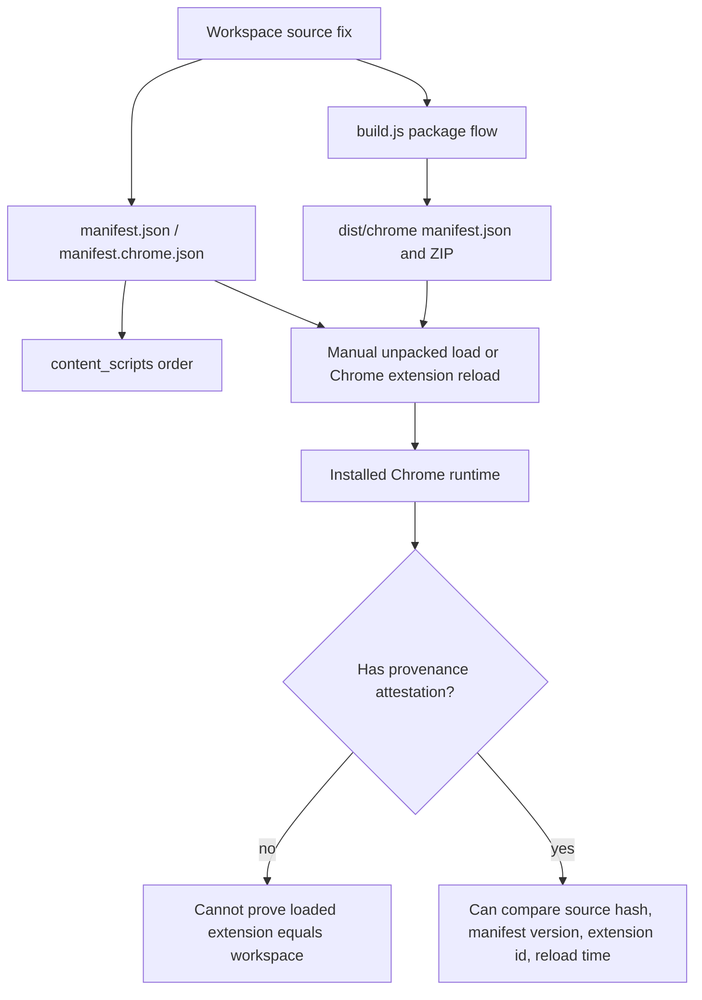
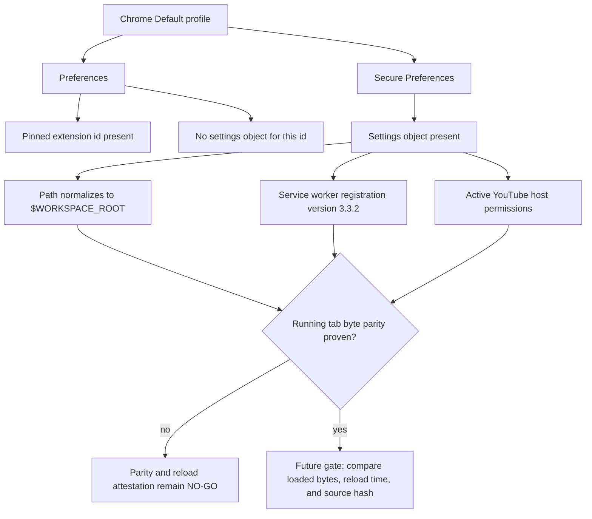
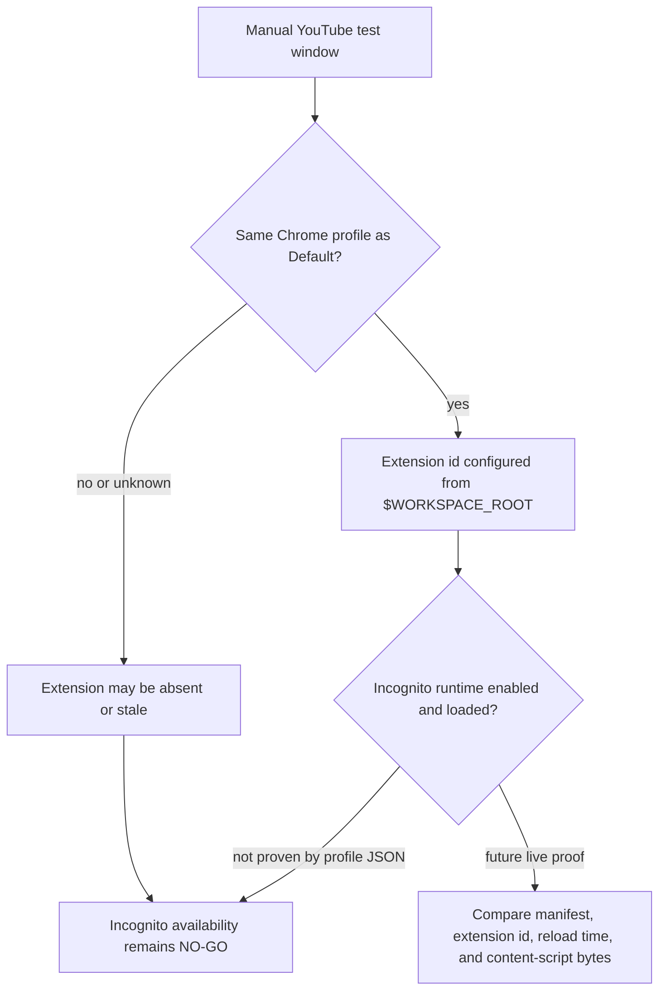
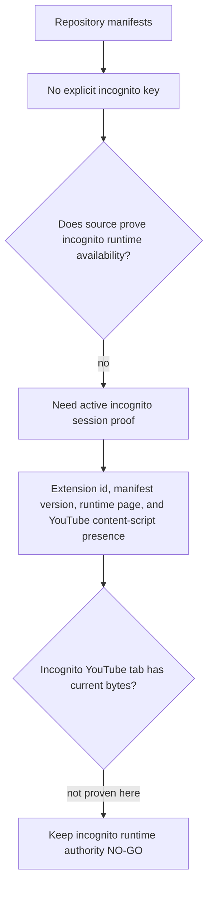
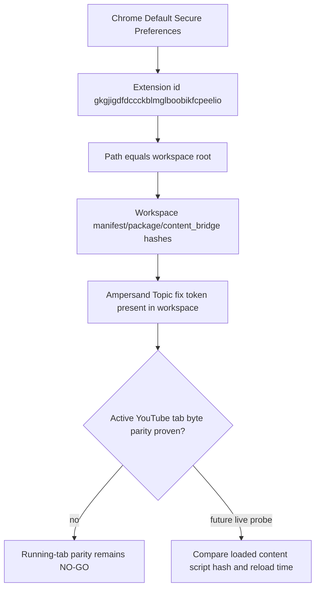
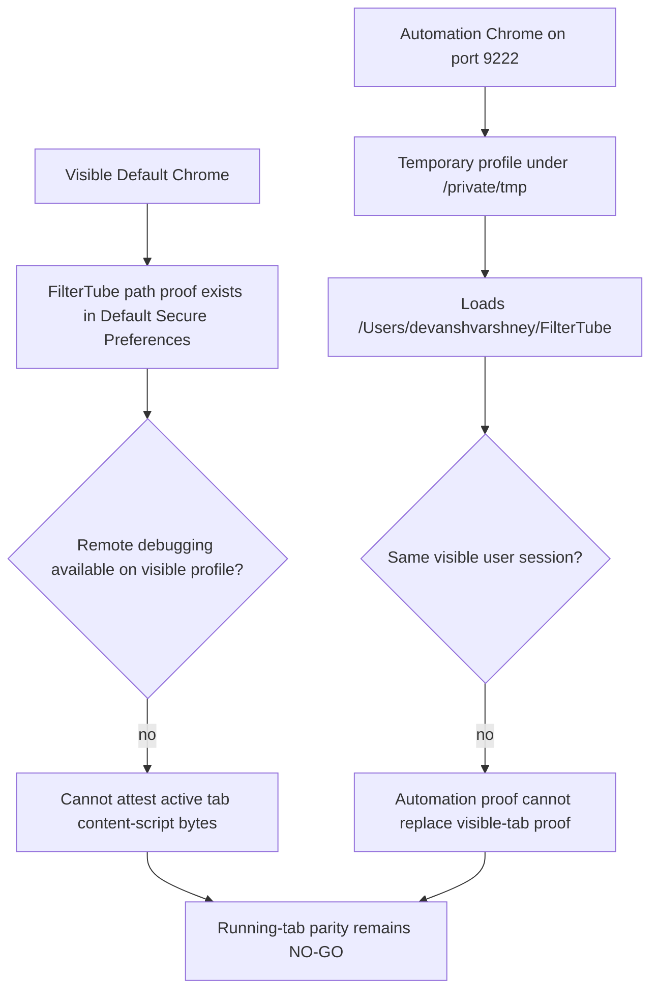
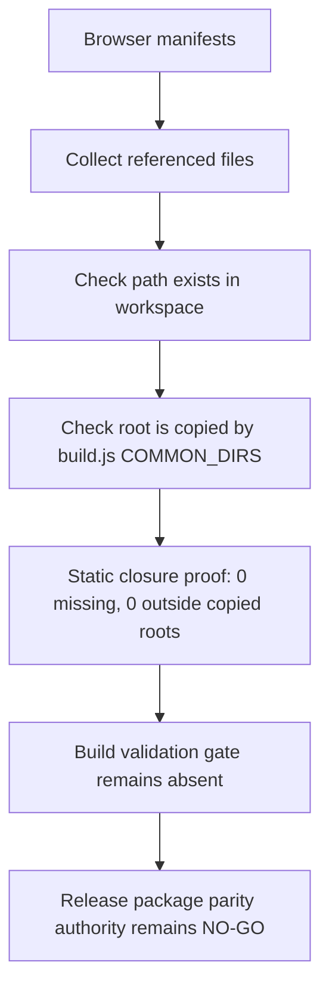
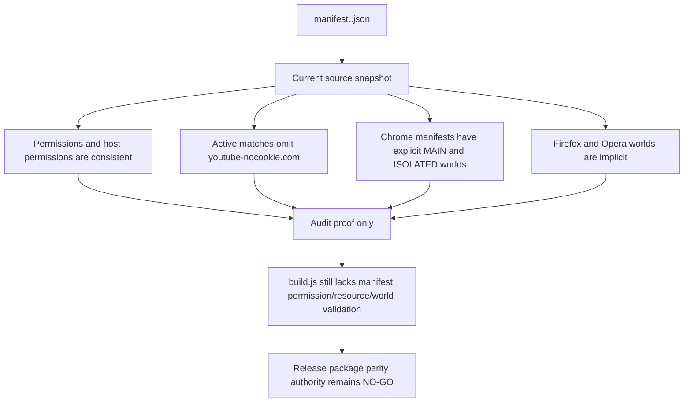
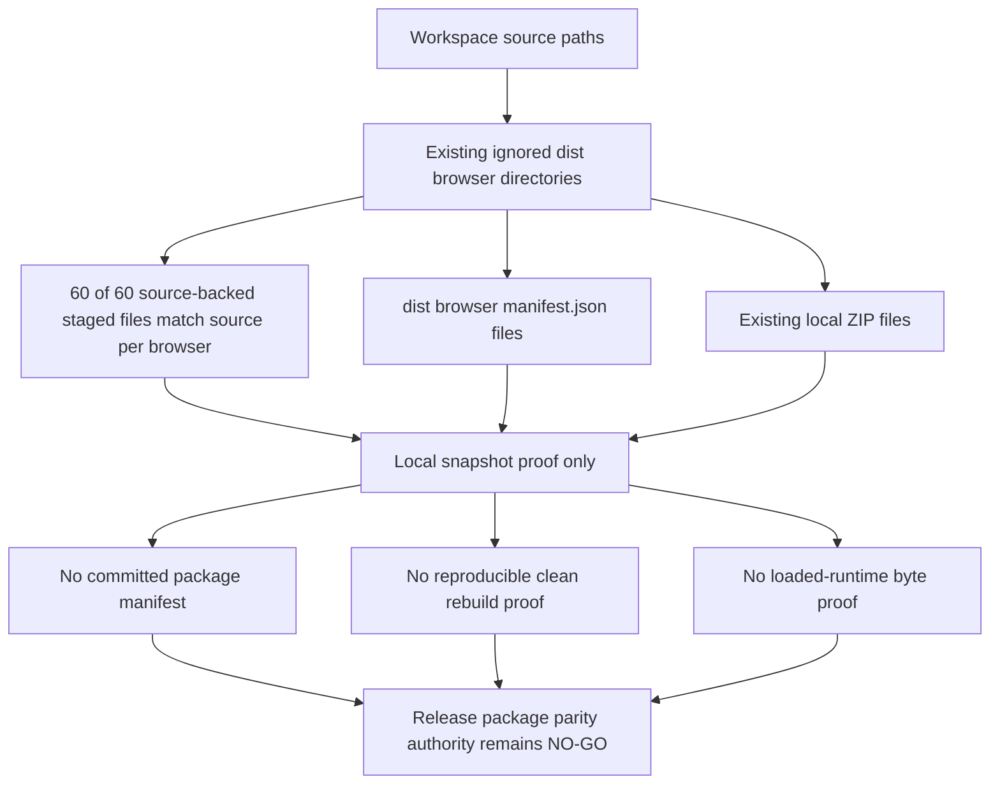

# FilterTube P0 Release Package Current Behavior - 2026-05-19

Status: current-behavior audit only. This file does not change build output,
release publishing, ZIP contents, manifests, website claims, mobile artifacts,
or runtime behavior.

This slice converts the named P0 release package parity family into runnable
proof. It exists because release packaging can ship code, CSS, generated output,
or public claims that are not the same as the manifest-loaded runtime surface.

## Blocked Verdict

P0 release package parity is not green:

- `build.js` copies whole common directories, not a committed package manifest.
- Quarantined YouTube CSS is packaged even though no manifest content script
  loads CSS today.
- The build regenerates UI shell output and mutates README badges before
  packaging.
- Generated shell source/output freshness has no committed hash manifest.
- Browser manifest handling only selects the target manifest and repairs
  collaborator script order; there is no full permission/resource/package gate.
- GitHub release creation uses `draft: false` before asset upload proof.
- Mobile APK/AAB staging writes checksums but does not tie those artifacts to a
  public claim manifest.
- Ignored raw captures remain outside package roots today, but that boundary is
  implicit in `COMMON_DIRS` / `COMMON_FILES` and `.gitignore`.

## Installed Runtime Provenance Snapshot - 2026-05-27

This addendum records the release/install edge exposed by recent browser
testing: a workspace source fix can be proven by tests while the currently
loaded Chrome extension can still be stale, loaded from a different directory,
or packaged before the fix. It is audit-only. It does not reload Chrome, change
build output, create a release artifact, alter manifests, or approve package
publication.

```text
workspace source tree
  -> package.json command/version surface
  -> manifest.json / manifest.chrome.json loaded-script order
  -> build.js copies broad package roots into dist/<browser>
  -> build.js writes selected manifest as dist/<browser>/manifest.json
  -> build.js zips dist/<browser> as filtertube-<browser>-v<version>.zip
  -> user/developer loads unpacked directory or packaged zip in Chrome
  -> installed extension runtime

missing today:
  installed extension id + loaded path + manifest version + source hash +
  reload timestamp + package zip checksum + runtime source attestation
```



| Boundary | Source pins | Current behavior | Missing proof gate |
| --- | --- | --- | --- |
| Package command/version surface | `package.json:3-18` | Package and browser manifests currently advertise version `3.3.2`; build/dev commands are script aliases, and `dev:chrome` mutates tracked `manifest.json` by copying `manifest.chrome.json`. | One command provenance record for local dev, release build, native sync, and installed-browser test runs. |
| Default Chrome manifest load order | `manifest.json:1-88`, `manifest.json:42-56` | Chrome loads `js/seed.js` in MAIN world and loads the isolated helper stack with `js/content/collab_dialog.js` before `js/content_bridge.js`. | Installed runtime proof that the loaded extension uses this manifest and has been reloaded after source edits. |
| Build package roots and manifest copy | `build.js:29-33`, `build.js:82-158` | Build copies broad `js`, `css`, `html`, `icons`, `data`, and `assets` roots plus README/CHANGELOG/LICENSE, then writes the browser-specific manifest as `dist/<browser>/manifest.json`. | Package manifest with per-file hashes, source family, manifest reference state, quarantine state, and active runtime classification. |
| Manifest order repair | `build.js:161-181` | Package build repairs only `js/content/collab_dialog.js` before `js/content_bridge.js` when writing the target manifest. | Full content-script order, world, host, permission, and resource validation report. |
| ZIP/release output | `build.js:183-192`, `build.js:644-700` | ZIP name is version-derived, and normal build mutates README badges before packaging. | Reproducible package checksum, dirty-worktree gate, and release artifact attestation. |
| Current Topic ampersand and bare-`and` source proof | `js/content_bridge.js:2759-2814`, `js/content_bridge.js:4784-4812`, `js/content_bridge.js:4902-4928`, `tests/runtime/content-bridge-collaborator-identity-promotion-handoff-current-behavior.test.mjs:510-544` | Workspace source no longer splits plain `&`, and the 2026-05-28 separator evidence gate keeps no-evidence single-channel `and` names such as `Law and Crime Network` out of collaborator warmup while preserving evidence-backed true collaborator rows. | Browser-loaded-runtime proof when a manual installed extension still shows older collaborator attrs. |

Current interpretation for the `Kully B & Gussy G - Topic` case:

```text
workspace source and tests: fixed for plain ampersand Topic bylines
installed extension runtime: not proven by repository tests alone
if the installed browser still shows collaborator attrs:
  likely causes include stale loaded extension, old package zip, different
  unpacked path, missing extension reload, or a separate extraction path
  that still needs source-pinned proof
```

```text
installed extension provenance authority: NO-GO
workspace-to-loaded-runtime parity authority: NO-GO
reload/package attestation gate: NO-GO
runtime behavior changed by this addendum: no
```

## Chrome Default Profile Secure Preferences Probe - 2026-05-27

This probe narrows the installed-runtime question with sanitized local Chrome
profile evidence. The raw Chrome profile files were not copied into the repo.
Only selected non-account extension fields were inspected from:

- `Chrome/Default/Preferences`
- `Chrome/Default/Secure Preferences`

Sanitized selected result:

```json
{
  "extension_id": "gkgjigdfdccckblmglboobikfcpeelio",
  "profile": "Default",
  "preferences_settings_object": "absent",
  "preferences_pinned_extension": "present",
  "secure_preferences_settings_object": "present",
  "secure_preferences_path": "$WORKSPACE_ROOT",
  "secure_preferences_location": 4,
  "from_webstore": false,
  "was_installed_by_default": false,
  "creation_flags": 38,
  "disable_reasons": [],
  "has_started_service_worker": true,
  "service_worker_registration_info": {
    "version": "3.3.2"
  },
  "newAllowFileAccess": true,
  "withholding_permissions": false,
  "active_permissions": {
    "api": ["activeTab", "downloads", "storage", "tabs", "scripting"],
    "explicit_host": [
      "*://*.youtube-nocookie.com/*",
      "*://*.youtube.com/*",
      "*://*.youtubekids.com/*"
    ],
    "scriptable_host": [
      "*://*.youtube.com/*",
      "*://*.youtubekids.com/*"
    ]
  }
}
```

Current interpretation:

```text
Default/Preferences
  -> proves the extension id is pinned in the visible Default profile
  -> does not expose the installed source path or manifest surface

Default/Secure Preferences
  -> proves the same extension id has a settings object
  -> proves Chrome is configured to load it from $WORKSPACE_ROOT
  -> proves the stored service worker registration version is 3.3.2
  -> proves active host/api permissions match the YouTube runtime surface

still missing
  -> running YouTube tab content-script byte hash
  -> extension reload timestamp after the source edits
  -> chrome.runtime.getManifest() from the loaded extension context
  -> incognito allow/deny proof from the active incognito profile/session
  -> package zip checksum if the release path is tested instead of unpacked
```



This is stronger than the earlier pinned-extension evidence: it says Chrome's
Default profile is configured to use the workspace root for
`gkgjigdfdccckblmglboobikfcpeelio`. It is still not enough to prove that a
specific already-open YouTube tab is running the latest content-script bytes,
because Chrome can keep old page scripts alive until the tab reloads and the
profile record does not expose a content-script hash or reload timestamp.

```text
installed extension path proof: PARTIAL
workspace-to-loaded-runtime parity authority: NO-GO
running-tab content-script byte authority: NO-GO
incognito runtime availability authority: NO-GO
runtime behavior changed by this probe: no
```

## Chrome Profile And Incognito Availability Boundary - 2026-05-27

This boundary records what the current local Chrome profile files do and do not
prove for manual release testing. It is audit-only. No Chrome setting was
changed, no extension reload was triggered, no browser tab was scripted, and no
runtime source file was edited.

Sanitized profile-scope evidence:

```text
Chrome root profile search for gkgjigdfdccckblmglboobikfcpeelio
  -> Default/Preferences
  -> Default/Secure Preferences
  -> Default/Local Extension Settings/<extension id>/LOG

not found by this filesystem probe
  -> a second Chrome profile settings object for this id
  -> a separate private user-data-dir settings object for this id
  -> a positive incognito-enabled flag under the extension settings object
```

Sanitized incognito-specific selected fields from the Default profile settings
object:

```json
{
  "incognito_content_settings": [],
  "incognito_preferences": {},
  "regular_only_preferences": {},
  "explicit_incognito_enabled_flag": "absent"
}
```

Current interpretation:

```text
Default profile installed path
  -> PARTIAL proof: extension id is configured from $WORKSPACE_ROOT

Default profile incognito state
  -> NOT proof: profile JSON selected fields do not expose a positive
     incognito-enabled runtime flag

new private Chrome instance or alternate user-data-dir
  -> NOT proof: extension id was not found in another profile by this probe

manual YouTube release test
  -> must use the same visible Chrome profile/window where the extension icon
     is present and the extension reports site access
  -> must reload YouTube tabs after source edits or extension reloads
  -> cannot claim content-script byte parity from repository tests alone
```



Required future proof before relying on incognito or alternate-profile manual
testing:

| Proof item | Why repository tests are insufficient |
| --- | --- |
| Active profile id and user-data-dir | A newly opened Chrome instance can use a different profile than the visible Default profile that has FilterTube installed. |
| `chrome.runtime.getManifest()` from the loaded extension context | Workspace manifests prove source state, not the manifest currently running in a browser process. |
| Content-script byte hash from the active YouTube tab | Chrome can keep old content scripts alive in already-open tabs until reload. |
| Extension reload timestamp | Filesystem path proof does not prove the browser reloaded after source edits. |
| Incognito availability proof from the active incognito session | Empty `incognito_preferences` / `incognito_content_settings` fields do not prove the extension is running in incognito. |

```text
Default profile path evidence: PARTIAL
alternate Chrome profile availability authority: NO-GO
incognito runtime availability authority: NO-GO
active-tab content-script parity authority: NO-GO
runtime behavior changed by this boundary: no
```

## Manifest Incognito Static Boundary - 2026-05-30

This continuation records the repository-side incognito signal separately from
the Chrome profile/runtime signal above. It is audit-only. No manifest,
profile, browser setting, or runtime source file was changed.

```text
manifest files scanned: 4
manifest files with explicit incognito key: 0
manifest files with YouTube host permissions: 4
manifest files with YouTube content-script matches: 4
manifest files with YouTube Kids content-script matches: 4
manifest files with youtube-nocookie host permission but no content-script match: 4
```

Scanned source manifests:

| Manifest | Explicit `incognito` key | Runtime content-script match scope | Host-only NoCookie gap |
| --- | --- | --- | --- |
| `manifest.json` | absent | YouTube, YouTube Kids | yes |
| `manifest.chrome.json` | absent | YouTube, YouTube Kids | yes |
| `manifest.firefox.json` | absent | YouTube, YouTube Kids | yes |
| `manifest.opera.json` | absent | YouTube, YouTube Kids | yes |

Current interpretation:

```text
source manifest incognito declaration
  -> absent across all browser manifests

repository tests
  -> can prove manifest contents and profile-file evidence
  -> cannot prove that a private/incognito browser session loaded FilterTube

manual incognito test
  -> must prove the active incognito window has extension runtime access
  -> must not rely on a separate automation profile or regular Default window
```



This explains why a regular Chrome profile proof and a repository manifest
proof are not enough for private-window manual testing. The extension may be
installed and configured in Default Chrome while still being absent from, stale
inside, or unverified in the active incognito session.

```text
manifest incognito declaration proof: absent
source manifest incognito runtime authority: NO-GO
active incognito session runtime authority: NO-GO
runtime behavior changed by this boundary: no
```

## Chrome Default Unpacked Workspace Byte Snapshot - 2026-05-27

This addendum strengthens the local installed-profile proof without claiming
that an already-open YouTube tab is running fresh content-script bytes. It
reads only selected Chrome Default profile extension fields and current
workspace file hashes. No Chrome setting was changed, no browser tab was
reloaded, and no runtime behavior changed.

```text
Chrome Default Secure Preferences extension id: gkgjigdfdccckblmglboobikfcpeelio
secure preferences extension path: /Users/devanshvarshney/FilterTube
secure preferences path matches workspace root: yes
Default/Preferences extension settings object present: no
Default/Secure Preferences extension settings object present: yes
stored extension/service-worker version: 3.3.2
Default Local Extension Settings directory exists: yes
Default packed Extensions directory for this id exists: no
workspace manifest.json sha256: 282bbf5f84819af6af4edcab1c7a21f16c1f6f50501492226c1065125c287734
workspace package.json sha256: 36053d322780ce787de403be574cc400936ef2a994b4c8eca62561154fe81aec
workspace js/content_bridge.js sha256: 8d55d0c8995e5b68bb9142c41f95046a676f5af2b83f8545b00f91a6a5a3776d
workspace content_bridge ampersand Topic fix token present: yes
```

ASCII boundary:

```text
Chrome Default/Secure Preferences
        |
        v
extension id -> path /Users/devanshvarshney/FilterTube
        |
        v
workspace files and hashes are inspectable
        |
        v
PARTIAL installed-profile path and byte snapshot
        |
        v
still missing active tab content-script hash and reload timestamp
```



This proves the Default profile is configured as an unpacked workspace-root
extension and that the current workspace `js/content_bridge.js` contains the
plain-ampersand Topic fix. It does not prove any already-open YouTube document
has reloaded those bytes.

```text
Default profile unpacked workspace path proof: yes
workspace byte hash snapshot: yes
running-tab content-script byte authority: NO-GO
extension reload timestamp authority: NO-GO
runtime behavior changed by this addendum: no
```

## Default Installed Permission Parity Crosscheck - 2026-05-30

This crosscheck strengthens the installed-profile side of the browser runtime
gate without claiming active-tab byte parity. It reads the same sanitized
Default `Secure Preferences` extension entry and compares Chrome's stored
active/granted permissions with the manifest policy already pinned above.

```text
installed active API permissions: activeTab, downloads, scripting, storage, tabs
installed granted API permissions: activeTab, downloads, scripting, storage, tabs
installed active explicit hosts: youtube-nocookie.com, youtube.com, youtubekids.com
installed granted explicit hosts: youtube-nocookie.com, youtube.com, youtubekids.com
installed active scriptable hosts: youtube.com, youtubekids.com
installed granted scriptable hosts: youtube.com, youtubekids.com
installed scriptable youtube-nocookie gap: yes
installed from_webstore: false
installed was_installed_by_default: false
installed disable_reasons: none
installed withholding_permissions: false
installed permission parity authority: PARTIAL
active-tab permission use proof: NO-GO
runtime behavior changed by this crosscheck: no
```

This proves the Default profile's installed permission surface is consistent
with the current manifest's intended YouTube and Kids surfaces, including the
known host-only `youtube-nocookie.com` gap. It still does not prove that an
already-open YouTube tab has current content-script bytes, that permissions are
usable in incognito, or that release/package output is ready to publish.

## Live Chrome Process Attestation Boundary - 2026-05-27

This addendum records local Chrome process topology observed during audit. It
exists because installed-profile path proof and automation-browser proof are
not the same as active visible-tab byte parity. No Chrome profile was changed,
no tab was reloaded, and no runtime behavior changed.

```text
Default Chrome process observed: /Applications/Google Chrome.app/Contents/MacOS/Google Chrome
Default Chrome explicit --user-data-dir flag observed: no
Default Chrome --remote-debugging-port flag observed: no
Default profile DevToolsActivePort file observed: absent
Default/DevToolsActivePort file observed: absent
automation Chrome process observed: /Applications/Google Chrome.app/Contents/MacOS/Google Chrome --user-data-dir=/private/tmp/filtertube-live-spa-chrome-profile --remote-debugging-port=9222 --load-extension=/Users/devanshvarshney/FilterTube --disable-extensions-except=/Users/devanshvarshney/FilterTube --no-first-run --no-default-browser-check https://www.youtube.com/
automation profile extension id: gkgjigdfdccckblmglboobikfcpeelio
automation profile extension path: /Users/devanshvarshney/FilterTube
automation profile extension location: 4
automation CDP /json/version Browser: Chrome/148.0.7778.179
automation CDP /json/version Protocol-Version: 1.3
automation CDP webSocketDebuggerUrl present: yes
automation CDP /json/list target count observed: 0
automation profile DevToolsActivePort file observed: absent
visible Default Chrome CDP target list authority: NO-GO
visible YouTube tab content-script byte parity authority: NO-GO
visible YouTube tab extension reload timestamp authority: NO-GO
runtime behavior changed by this boundary: no
```

ASCII boundary:

```text
Visible user Chrome
        |
        v
Default profile has FilterTube unpacked path evidence
        |
        v
No remote-debugging flag and no DevToolsActivePort file
        |
        v
Cannot inspect active YouTube document bytes from this audit path

Separate automation Chrome
        |
        v
/private/tmp/filtertube-live-spa-chrome-profile
        |
        v
Loads the same workspace extension path and exposes CDP on 9222
        |
        v
Not the visible Default profile session used for manual lag reports
```



This closes a confusion risk, not a runtime gate. The audit can now distinguish
three separate claims:

| Claim | Current evidence | Current authority |
| --- | --- | --- |
| Default profile is configured to load the workspace extension. | Secure Preferences path/hash snapshot above. | `PARTIAL` |
| A separate automation Chrome can load the workspace extension and expose CDP. | Process command line, temporary profile Secure Preferences, and `/json/version` snapshot. | `PARTIAL` |
| The visible user YouTube tab is running current workspace content-script bytes after reload. | No loaded-tab byte hash or reload timestamp. | `NO-GO` |

Future live-tab proof must use the visible Chrome profile/session where the
user reports lag, or it must clearly label itself as automation-profile proof.
It must record the active tab URL, extension id, extension path, manifest
version, content-script byte hash or equivalent injected-runtime marker, reload
timestamp, and whether the tab was refreshed after the last workspace edit.

## Browser Manifest Package Reference Closure Addendum - 2026-05-27

This addendum strengthens the package/resource side of
`release_package_parity_browser_manifest_validation_covers_permissions_and_resources`
without changing the product runtime or closing the build gate. It proves that
the browser manifests currently reference only files that exist in the
workspace and live under directories copied by `build.js`; it does not prove
that `build.js` validates those references before writing `dist/*/manifest.json`.

```text
package copied directory roots: js, css, html, icons, data, assets
browser manifests checked: 4
combined unique referenced paths across browser manifests: 24
unresolved manifest file references: 0
manifest referenced roots outside COMMON_DIRS: 0
manifest content-script CSS references: 0
build-time manifest reference validation: absent
runtime behavior changed by this addendum: no
```

| Manifest | File references | Unique referenced paths | Missing paths | Current package closure |
| --- | ---: | ---: | ---: | --- |
| `manifest.json` | 29 | 24 | 0 | All referenced files exist under copied package roots. |
| `manifest.chrome.json` | 29 | 24 | 0 | Same as default Chrome manifest. |
| `manifest.firefox.json` | 29 | 24 | 0 | Background script shape differs, but referenced files exist under copied package roots. |
| `manifest.opera.json` | 28 | 23 | 0 | Omits `icons/file.svg` from web-accessible resources, but all referenced files exist under copied package roots. |

Current referenced package roots:

```text
js/
html/
icons/
```

ASCII boundary:

```text
manifest.*.json
        |
        v
background/action/icons/content_scripts/web_accessible_resources
        |
        v
referenced file exists under copied package root
        |
        v
AUDIT PROOF ONLY
        |
        v
build.js still lacks validatePackagedReferences / releasePackageParity gate
```



This means the current manifests are not pointing at missing local files today.
It does not mean the package process is release-safe: there is still no
committed package manifest, no pre-zip manifest reference validator, no
installed-runtime byte parity report, and no reload/package attestation.

## Browser Manifest Permission And Resource Validation Snapshot - 2026-05-27

This addendum strengthens the permission/resource side of
`release_package_parity_browser_manifest_validation_covers_permissions_and_resources`
without changing the product runtime or closing the build gate. It pins the
current manifest policy that a future build-time validator would need to
enforce: permissions, host permissions, active matches, web-accessible
resources, content-script worlds, and the known host-only
`youtube-nocookie.com` gap.

```text
browser manifests checked: 4
exact permission list per manifest: storage, activeTab, scripting, tabs, downloads
exact host permission list per manifest: youtube.com, youtube-nocookie.com, youtubekids.com
content-script active match hosts per manifest: youtube.com, youtubekids.com
web-accessible-resource active match hosts per manifest: youtube.com, youtubekids.com
host-only youtube-nocookie gap manifests: 4
content-script CSS references: 0
build-time permission/resource/world validation: absent
runtime behavior changed by this addendum: no
```

| Manifest | Content script entries | Content script JS refs | Explicit worlds | WAR resource refs | Host-only `youtube-nocookie.com` gap |
| --- | ---: | ---: | --- | ---: | --- |
| `manifest.json` | 2 | 15 | `MAIN`, `ISOLATED` | 5 | yes |
| `manifest.chrome.json` | 2 | 15 | `MAIN`, `ISOLATED` | 5 | yes |
| `manifest.firefox.json` | 1 | 14 | none | 5 | yes |
| `manifest.opera.json` | 2 | 15 | none | 4 | yes |

Current policy snapshot:

```text
permissions:
  storage
  activeTab
  scripting
  tabs
  downloads

host permissions:
  *://*.youtube.com/*
  *://*.youtube-nocookie.com/*
  *://*.youtubekids.com/*

active content-script and web-accessible-resource matches:
  *://*.youtube.com/*
  *://*.youtubekids.com/*
```

Build validation boundary:

```text
build.js
  -> reads manifest.<browser>.json
  -> ensureCollabDialogScriptOrder(manifestJSON)
  -> writes dist/<browser>/manifest.json
  -> does not validate permissions, hosts, worlds, or web resources
```



This means the current browser manifests are internally consistent on
permissions and host declarations today. It does not mean the package process
is release-safe: `build.js` still lacks a build-time validator for permission
drift, host scope drift, content-script world drift, web-accessible resource
scope drift, or package/runtime parity.

## Current Local Dist Package Snapshot - 2026-06-04

This addendum records the current ignored `dist/` tree as a local package
artifact snapshot. It is audit-only: the local `dist/` tree was refreshed by
the current working-tree build, but no package file was promoted to release
authority and no committed package manifest or loaded-runtime attestation was
created.

```text
dist snapshot source: existing ignored local dist tree
browser staged directories: 3
browser staged files per directory: 61
dist zip artifacts: 3
total dist files including zips: 186
source-backed staged files per browser excluding manifest: 60
byte-identical source-backed staged files per browser excluding manifest: 60
committed package manifest: absent
zip checksum manifest: absent
reproducible build proof: absent
runtime behavior changed by this snapshot: no
```

Per-browser staged group counts are currently identical:

| Group | Files per browser |
| --- | ---: |
| top-level common files (`README.md`, `CHANGELOG.md`, `LICENSE`) | 3 |
| manifest | 1 |
| `assets` | 3 |
| `css` | 8 |
| `data` | 1 |
| `html` | 3 |
| `icons` | 7 |
| `js` | 35 |

Current local package artifact rows:

| Target | Staged files | Manifest bytes | Manifest sha256 | Version | Content script entries | Content script JS refs | WAR refs | ZIP bytes | ZIP sha256 |
| --- | ---: | ---: | --- | --- | ---: | ---: | ---: | ---: | --- |
| `chrome` | 61 | 2513 | `282bbf5f84819af6af4edcab1c7a21f16c1f6f50501492226c1065125c287734` | `3.3.2` | 2 | 15 | 5 | 8730943 | `ea63f1d46b9bd9cf914281c5759cd9b75fb7f48517f71983d41c6ff44585b93a` |
| `firefox` | 61 | 2603 | `a1773c9e0acc1c2029cb6aef4757a282aa0ec8d89759be65ea975ff237d00bb0` | `3.3.2` | 1 | 14 | 5 | 8731002 | `815e2de2eddb98bca5b87a01eecd27c75d5cc02437ef196c427cda2a0653bf83` |
| `opera` | 61 | 2518 | `0f0b77df312bf8b45a40e652bd7fc4ee4af270945b4e38e9353ebfdc1caf1e2b` | `3.3.2` | 2 | 15 | 4 | 8730945 | `e6552669ef06bd7329bc0fdcd84e827dc6d66a80d75d03c286139da05454e329` |

ASCII boundary:

```text
workspace source paths
  -> existing ignored dist/<browser>/ staged copy
  -> existing ignored dist/filtertube-<browser>-v3.3.2.zip
  -> local hash snapshot only
  -> no committed package manifest
  -> no clean rebuild attestation
  -> no loaded-browser runtime byte proof
```



This closes a local-artifact inventory gap, not the release gate. The staged
browser directories currently match workspace source bytes for 60 of 60 source-backed
non-manifest files, and the three local ZIPs have recorded hashes. The package
still lacks a committed per-file manifest, a clean rebuild record, ZIP content
attestation tied to source revision, upload proof, public-claim proof, and
loaded-browser byte proof.

```text
local dist snapshot proof: PARTIAL
source-backed staged byte parity: local complete, release authority partial
zip checksum snapshot: yes
committed release package manifest authority: NO-GO
reproducible package build authority: NO-GO
loaded-browser package/runtime parity authority: NO-GO
```

## Current Package Flow

```text
npm/build caller
  |
  +--> node scripts/build-extension-ui.mjs
  +--> update README badges
  +--> copy COMMON_DIRS into dist/browser
  +--> copy COMMON_FILES into dist/browser
  +--> write manifest.<browser>.json as dist/browser/manifest.json
  +--> archive dist/browser/**
  +--> optionally copy Android artifacts and .sha256 files
  +--> optionally create public GitHub release, then upload assets
```

## Current Behavior Fixtures

| Fixture | Current behavior pinned | Source proof | Future gate |
| --- | --- | --- | --- |
| `release_package_parity_build_common_dirs_are_explicit` | `COMMON_DIRS` is `js`, `css`, `html`, `icons`, `data`, `assets`; each directory exists and is copied wholesale. | `build.js`; P0 test | Replace or supplement with a committed package manifest that classifies every shipped path. |
| `release_package_parity_common_files_are_explicit` | `COMMON_FILES` is `README.md`, `CHANGELOG.md`, `LICENSE`; each exists and is copied wholesale. | `build.js`; P0 test | Top-level package docs need hash/source-family proof. |
| `release_package_parity_quarantined_css_is_packaged_but_not_manifest_loaded` | `css/filter.css`, `css/content.css`, and `css/layout.css` ship through the `css` directory while manifests load no content-script CSS. | `build.js`; manifests; P0 test | Either exclude quarantined CSS or classify it as packaged-but-unloaded. |
| `release_package_parity_build_has_no_committed_package_manifest` | No committed package content manifest exists today. | P0 test | Add `releasePackageParity` or package-manifest output before changing package scope or public claims. |
| `release_package_parity_generated_shells_have_source_output_freshness_manifest` | Source and output shell files exist, and build regenerates outputs, but no freshness manifest ties them together. | `scripts/build-extension-ui.mjs`; `src/extension-shell/*`; `js/ui-shell/*`; P0 test | Record source/output hashes before release packaging. |
| `release_package_parity_build_does_not_mutate_readme_during_package_dry_run` | Not satisfied. `build.js` calls `updateReadmeBadges()` and writes `README.md`. | `build.js`; P0 test | Split release packaging from tracked-file mutation or require an explicit dirty-worktree gate. |
| `release_package_parity_browser_manifest_validation_covers_permissions_and_resources` | Not satisfied. Build writes the selected manifest and repairs collaborator script order, but has no full manifest permission/resource validation gate. | `build.js`; manifests; P0 test | Validate permissions, hosts, content worlds, web-accessible resources, and packaged file references. |
| `release_package_parity_github_release_is_draft_until_all_assets_upload` | Not satisfied. The GitHub release payload has `draft: false`, and asset upload happens afterward. | `build.js`; P0 test | Create draft releases first, upload/check assets, then publish. |
| `release_package_parity_mobile_artifacts_have_checksum_and_claim_gate` | Partially represented. Mobile artifacts are selected by deterministic name and `.sha256` is written, but no public claim manifest links them to website/store claims. | `build.js`; P0 test | Add artifact checksum, signing, source, store state, and public-claim records. |
| `release_package_parity_raw_captures_never_enter_package_contents` | Locally true today. Raw root captures are ignored and not included by `COMMON_DIRS` or `COMMON_FILES`. | `.gitignore`; `build.js`; P0 test | Keep raw captures evidence-only; extract minimal fixtures instead of package inputs. |

## Future Contract Before Release Changes

Future token: `releasePackageParity`

```text
releasePackageParity.record({
  releaseVersion,
  browser,
  packagePath,
  sourcePath,
  sourceFamily,
  manifestReferenced,
  webAccessible,
  generatedFrom,
  hash,
  sizeBytes,
  quarantineStatus,
  releaseClaimIds,
  uploadStatus,
  checksumPath,
  rawCaptureExcluded
})
```

Minimum proof before changing package or public release behavior:

- Every shipped path is classified as active runtime, UI page, public asset,
  generated output, vendor, docs, quarantined, or release-only.
- Manifest references are validated against package contents.
- Generated shell outputs have source-output hash proof.
- README/changelog mutation is separated from package dry-run or guarded by a
  dirty-worktree check.
- GitHub releases stay draft until all required assets and checksums upload.
- Android artifacts have checksum/signing/public-claim proof.
- Raw capture files remain evidence-only and never become package inputs.

## Method Semantic Proof Gap Boundary

`docs/audit/FILTERTUBE_METHOD_SEMANTIC_PROOF_GAP_INDEX_CURRENT_BEHAVIOR_2026-05-25.md`
is a required source input before this release/package/public-claim surface can
support runtime optimization. Current proof pins:

```text
method semantic proof gap files covered: 71
method semantic proof gap lexical callables covered: 6072
files with complete per-callable semantic proof: 0
lexical callables requiring semantic proof before behavior changes: 6072
affected callable semantic proof: NO-GO
runtime behavior changed: no
```

Historical compatibility snapshot retained for older current-behavior lanes:

```text
historical pre-managed-policy callable snapshot: 2026-05-25 through 2026-05-30
method semantic proof gap lexical callables covered: 5836
repo-wide lexical callables: 5836
lexical callables requiring semantic proof before behavior changes: 5836
```

These counts are audit-only blockers. They do not approve runtime
optimization, JSON-first behavior, release package behavior, public release
claims, prompt release overlays, raw-capture packaging, whitelist behavior,
metric collectors, artifact creation, native sync, or release publication.
