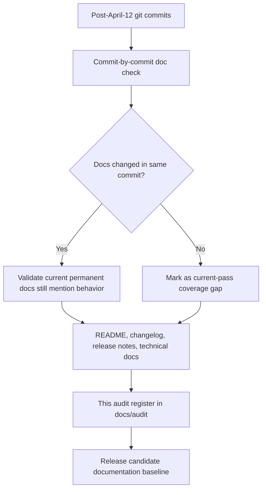
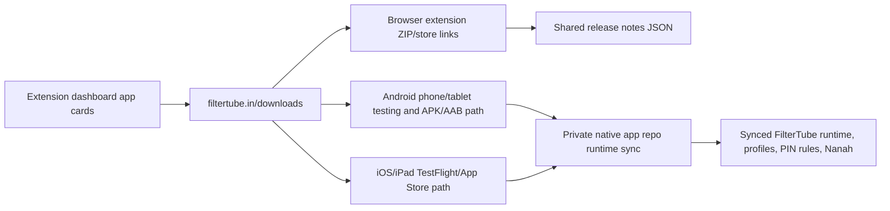

# FilterTube Post-April-12 Release Documentation Validation

Date: 2026-05-31

Baseline: April 12, 2026 public release checkpoint (`v3.3.1` package line).

Scope: every commit after April 12, 2026 through the current release candidate, validated against permanent documentation, release notes, and audit artifacts.

## Result

- Commits reviewed: 85
- Commits with docs in the same commit: 50
- Code commits without same-commit docs: 35
- Current docs pass action: release-facing docs, app-release docs, and this audit register now cover the previously scattered or code-only changes.
- Release headline now documented: first mobile/tablet app MVP release surface finalized in the public repo, Android phone/tablet in final testing/release setup, iOS/iPad in final testing, and TV kept as future separate app work.

## Validation Method

```text
git log --since="2026-04-13 00:00:00" --reverse --name-status
  -> classify each commit
  -> record files changed
  -> check whether README/docs/data release notes changed in that commit
  -> search current permanent docs for the behavior
  -> update release-facing docs where current docs lacked a consolidated story
```

The audit intentionally uses April 13 as the first included date so April 12 remains the last-release baseline.

## Documentation Flow



## App Release Surface Flow



TV is not part of this mobile/tablet release path. Android TV and Fire TV remain future separate app packages.

## Major Change Groups Since Baseline

| Dates | Area | Current documentation coverage |
| --- | --- | --- |
| 2026-04-13 | Nanah target-profile display and managed-link copy | README, Nanah user guide, concerns tracker, managed-link QA, release notes refresh |
| 2026-04-28 to 2026-04-30 | Mobile runtime parity, exact matching, watch/Mix collaborator recovery, Firefox export, system theme, sidebar, large blocklists, Nanah metadata | README, CHANGELOG, TECHNICAL, FUNCTIONALITY, CODEMAP, collaborator audit docs |
| 2026-05-02 to 2026-05-03 | Mobile fallback selectors, Shorts resolver, quick-block chrome/native-overlay behavior | CODEMAP, TECHNICAL, FUNCTIONALITY, quick-block renderer docs, this register |
| 2026-05-05 to 2026-05-06 | Kids/profile authority, child receive-only sync, parent-managed child edits, whitelist Home/Watch stability, JSON-first blocklist path | README, CHANGELOG, TECHNICAL, ARCHITECTURE, FUNCTIONALITY, Profiles/PIN, Nanah docs, audit docs |
| 2026-05-09 to 2026-05-11 | Whitelist pending recheck coalescing, fallback-menu throttles, native-overlay gates, no-rule DOM scan bypass, Nanah pairing metadata | TECHNICAL, ARCHITECTURE performance section, release notes, this register |
| 2026-05-17 | App release website surfaces and extension dashboard cards | Website/app release changelog, app runtime sync workflow, README, release notes |
| 2026-05-30 to 2026-05-31 | YouTube SPA lag reduction, production console gates, installed Chrome/live smoke gates, list-target forwarding, whitelist Shorts fallback, autoplay endpoint leak fix, DOM state attribute hardening | Audit docs, TECHNICAL, ARCHITECTURE, CHANGELOG, release notes, this register |

## Commit Coverage Matrix

| Date | Commit | Change | Area | Docs in same commit | Current action |
| --- | --- | --- | --- | --- | --- |
| 2026-04-13 | `ed94a0a` | FIX:display the actual target profile | profiles-sync-kids | yes (4) | validated; release docs refreshed where user-facing |
| 2026-04-28 | `dd7d17e` | Port mobile runtime parity fixes | apps-dashboard-ui | yes (3) | validated; release docs refreshed where user-facing |
| 2026-04-28 | `d04ce52` | Backport exact filter and menu state parity | runtime-filtering | yes (4) | validated; release docs refreshed where user-facing |
| 2026-04-28 | `61c7e84` | Soften collab menu selected tint | runtime-filtering | no | covered by this 2026-05-31 validation pass |
| 2026-04-28 | `ae51de3` | Fix Mix collaborator discriminator | runtime-filtering | no | covered by this 2026-05-31 validation pass |
| 2026-04-28 | `af667b9` | Prefer authoritative collaborator rosters | runtime-filtering | no | covered by this 2026-05-31 validation pass |
| 2026-04-28 | `24a91f5` | Document collaborator roster precedence | audit/docs | yes (7) | validated; release docs refreshed where user-facing |
| 2026-04-28 | `fc2f7c3` | Document mobile app upstream checkpoint | audit/docs | yes (6) | validated; release docs refreshed where user-facing |
| 2026-04-28 | `073960d` | Fix weak watch menu identity recovery | runtime-filtering | yes (5) | validated; release docs refreshed where user-facing |
| 2026-04-29 | `90f4e74` | Fix watch identity and SPA collab recovery 2026-04-29 | runtime-filtering | yes (7) | validated; release docs refreshed where user-facing |
| 2026-04-29 | `a4fb5a6` | Stabilize quick block UI and init logs 2026-04-29 | runtime-filtering | yes (4) | validated; release docs refreshed where user-facing |
| 2026-04-29 | `c91bf54` | Fix Firefox export downloads 2026-04-29 | runtime-filtering | yes (5) | validated; release docs refreshed where user-facing |
| 2026-04-29 | `8a7b129` | Default to system theme 2026-04-29 | apps-dashboard-ui | yes (5) | validated; release docs refreshed where user-facing |
| 2026-04-29 | `448d443` | Fix short dashboard sidebar 2026-04-29 | apps-dashboard-ui | yes (5) | validated; release docs refreshed where user-facing |
| 2026-04-29 | `875a47e` | Optimize large blocklist matching 2026-04-29 | runtime-filtering | yes (5) | validated; release docs refreshed where user-facing |
| 2026-04-30 | `146078f` | Fix Nanah app sync keyword metadata | profiles-sync-kids | yes (5) | validated; release docs refreshed where user-facing |
| 2026-04-30 | `0dd8f42` | remove not needed log docs | audit/docs | yes (19) | validated; release docs refreshed where user-facing |
| 2026-05-02 | `bb870a1` | Fix mobile content control fallback selectors | runtime-filtering | no | covered by this 2026-05-31 validation pass |
| 2026-05-03 | `8f3fdbe` | Fix Shorts blocking resolver path | runtime-filtering | yes (4) | validated; release docs refreshed where user-facing |
| 2026-05-03 | `a203948` | Keep quick block controls below YouTube chrome | runtime-filtering | no | covered by this 2026-05-31 validation pass |
| 2026-05-03 | `3d0646b` | Hide quick block while native controls are open | runtime-filtering | no | covered by this 2026-05-31 validation pass |
| 2026-05-03 | `18890a9` | Stabilize quick block chrome occlusion | runtime-filtering | no | covered by this 2026-05-31 validation pass |
| 2026-05-03 | `0995db6` | Document quick block renderer surface differences | audit/docs | yes (1) | validated; release docs refreshed where user-facing |
| 2026-05-04 | `f03243f` | Update website privacy policy and Vercel setup | apps-dashboard-ui | no | covered by this 2026-05-31 validation pass |
| 2026-05-05 | `c5c3704` | Document passive YouTube Kids controls | audit/docs | yes (2) | validated; release docs refreshed where user-facing |
| 2026-05-05 | `a264386` | Move Kids sync toggle into Kids page | profiles-sync-kids | no | covered by this 2026-05-31 validation pass |
| 2026-05-05 | `c67ee29` | Move Kids sync toggle to content controls | profiles-sync-kids | no | covered by this 2026-05-31 validation pass |
| 2026-05-05 | `a012ec3` | Avoid Kids watch pause in whitelist mode | runtime-filtering | no | covered by this 2026-05-31 validation pass |
| 2026-05-05 | `4edcd0e` | Align extension locked profile prompts | profiles-sync-kids | no | covered by this 2026-05-31 validation pass |
| 2026-05-05 | `8106c62` | Align extension list mode pills | audit/docs | no | covered by this 2026-05-31 validation pass |
| 2026-05-05 | `99ae1da` | Add managed child viewing access policy | profiles-sync-kids | no | covered by this 2026-05-31 validation pass |
| 2026-05-05 | `c828604` | Keep parent active after child profile creation | profiles-sync-kids | no | covered by this 2026-05-31 validation pass |
| 2026-05-05 | `80ad861` | Add child receive-only sync mode | profiles-sync-kids | no | covered by this 2026-05-31 validation pass |
| 2026-05-05 | `7ae1f52` | Clarify disabled profile actions | profiles-sync-kids | no | covered by this 2026-05-31 validation pass |
| 2026-05-05 | `bd7839e` | Add parent-managed child rule editing | profiles-sync-kids | no | covered by this 2026-05-31 validation pass |
| 2026-05-05 | `b47e5a1` | Refresh sync controls after profile switch | audit/docs | no | covered by this 2026-05-31 validation pass |
| 2026-05-05 | `f368dd1` | Show profile identity in sync labels | runtime-filtering | no | covered by this 2026-05-31 validation pass |
| 2026-05-06 | `c9e6117` | Document child sync authority model | audit/docs | yes (5) | validated; release docs refreshed where user-facing |
| 2026-05-06 | `6952fc8` | Fix managed child content controls | profiles-sync-kids | yes (1) | validated; release docs refreshed where user-facing |
| 2026-05-06 | `50a7f24` | Add global child edit mode | profiles-sync-kids | yes (1) | validated; release docs refreshed where user-facing |
| 2026-05-06 | `543442d` | Fix popup lock and mobile title matching | apps-dashboard-ui | no | covered by this 2026-05-31 validation pass |
| 2026-05-06 | `f87729d` | Stabilize whitelist home and watch loading | runtime-filtering | yes (2) | validated; release docs refreshed where user-facing |
| 2026-05-06 | `dd1568f` | Stabilize whitelist identity and comment scope | runtime-filtering | yes (4) | validated; release docs refreshed where user-facing |
| 2026-05-06 | `011fdfe` | Keep whitelist watch rail hydrating | runtime-filtering | no | covered by this 2026-05-31 validation pass |
| 2026-05-06 | `b3de84e` | Hide pending whitelist watch rail cards | runtime-filtering | no | covered by this 2026-05-31 validation pass |
| 2026-05-06 | `35c1ee4` | Document JSON-first filtering plan | audit/docs | yes (1) | validated; release docs refreshed where user-facing |
| 2026-05-06 | `0a9978d` | Run active blocklist rules JSON-first | runtime-filtering | yes (1) | validated; release docs refreshed where user-facing |
| 2026-05-06 | `bf95385` | Reduce JSON filtering watch page cost | runtime-filtering | yes (1) | validated; release docs refreshed where user-facing |
| 2026-05-09 | `2241042` | Coalesce whitelist pending rechecks | runtime-filtering | yes (2) | validated; release docs refreshed where user-facing |
| 2026-05-09 | `326d921` | Trim whitelist pending rechecks | runtime-filtering | yes (1) | validated; release docs refreshed where user-facing |
| 2026-05-10 | `777ad8a` | Batch whitelist pending observer scans | runtime-filtering | yes (2) | validated; release docs refreshed where user-facing |
| 2026-05-10 | `5d2b880` | Improve channel avatar extraction | audit/docs | no | covered by this 2026-05-31 validation pass |
| 2026-05-10 | `884fb11` | Debounce fallback menu scroll rescans | runtime-filtering | no | covered by this 2026-05-31 validation pass |
| 2026-05-10 | `72e4c25` | Throttle fallback menu warmup rescans | runtime-filtering | no | covered by this 2026-05-31 validation pass |
| 2026-05-10 | `f3ba0ad` | Gate fallback observer during native overlays | runtime-filtering | no | covered by this 2026-05-31 validation pass |
| 2026-05-10 | `038346c` | Gate fallback menu scans under native overlays | runtime-filtering | no | covered by this 2026-05-31 validation pass |
| 2026-05-10 | `b692ec0` | Carry quick block channel logos | runtime-filtering | no | covered by this 2026-05-31 validation pass |
| 2026-05-10 | `c26fca6` | Prune fallback observer rescans | runtime-filtering | no | covered by this 2026-05-31 validation pass |
| 2026-05-10 | `27f1639` | Cap whitelist pending hide candidates | runtime-filtering | no | covered by this 2026-05-31 validation pass |
| 2026-05-10 | `3dc4a51` | Ignore fallback remove-only mutations | runtime-filtering | no | covered by this 2026-05-31 validation pass |
| 2026-05-10 | `7333cae` | Skip no-rule DOM fallback scans | runtime-filtering | no | covered by this 2026-05-31 validation pass |
| 2026-05-11 | `e88414e` | Quiet whitelist observer under native overlays | runtime-filtering | no | covered by this 2026-05-31 validation pass |
| 2026-05-11 | `1363a78` | Include Nanah pairing metadata in extension links | audit/docs | no | covered by this 2026-05-31 validation pass |
| 2026-05-17 | `3696c34` | Update app release website surfaces | apps-dashboard-ui | yes (4) | validated; release docs refreshed where user-facing |
| 2026-05-30 | `9816c34` | Reduce YouTube SPA lag and update audit docs | audit/docs | yes (570) | validated; release docs refreshed where user-facing |
| 2026-05-30 | `043adbc` | Document installed Chrome unpacked path parity | audit/docs | yes (3) | validated; release docs refreshed where user-facing |
| 2026-05-30 | `ad2397f` | Gate content bridge production logs | audit/docs | yes (57) | validated; release docs refreshed where user-facing |
| 2026-05-30 | `7f0e666` | Prove production console gate load order | audit/docs | yes (1) | validated; release docs refreshed where user-facing |
| 2026-05-30 | `4c6cd82` | Refresh audit proof after lag fixes | audit/docs | yes (522) | validated; release docs refreshed where user-facing |
| 2026-05-31 | `a19c53e` | Record live smoke CDP preflight blocker | audit/docs | yes (3) | validated; release docs refreshed where user-facing |
| 2026-05-31 | `d76fbec` | Forward addFilteredChannel list target | runtime-filtering | yes (94) | validated; release docs refreshed where user-facing |
| 2026-05-31 | `8131006` | Add settings cross-feature convergence audit | audit/docs | yes (5) | validated; release docs refreshed where user-facing |
| 2026-05-31 | `212da19` | Clarify production console gate audit coverage | audit/docs | yes (3) | validated; release docs refreshed where user-facing |
| 2026-05-31 | `d9aeddc` | Link production console gate readiness gaps | audit/docs | yes (2) | validated; release docs refreshed where user-facing |
| 2026-05-31 | `e9dca9c` | Link installed Chrome path parity gate | audit/docs | yes (2) | validated; release docs refreshed where user-facing |
| 2026-05-31 | `7c57a63` | Link store feedback readiness gate | audit/docs | yes (2) | validated; release docs refreshed where user-facing |
| 2026-05-31 | `69423e1` | Add visible tab byte parity preflight | audit/docs | yes (5) | validated; release docs refreshed where user-facing |
| 2026-05-31 | `b973f4c` | Link Home Shorts quick block placement gate | audit/docs | yes (3) | validated; release docs refreshed where user-facing |
| 2026-05-31 | `133c42f` | Add production console residual preflight | runtime-filtering | yes (3) | validated; release docs refreshed where user-facing |
| 2026-05-31 | `c9cc78e` | Record connected Chrome tab recheck | audit/docs | yes (5) | validated; release docs refreshed where user-facing |
| 2026-05-31 | `4648d0b` | Fix whitelist Shorts creator fallback | runtime-filtering | yes (1) | validated; release docs refreshed where user-facing |
| 2026-05-31 | `14804ca` | Fix watch autoplay endpoint leaks | runtime-filtering | yes (3) | validated; release docs refreshed where user-facing |
| 2026-05-31 | `919bb00` | Harden FilterTube DOM state attributes | runtime-filtering | yes (1) | validated; release docs refreshed where user-facing |
| 2026-05-31 | `d599652` | Refresh whitelist audit proof pins | audit/docs | yes (2) | validated; release docs refreshed where user-facing |
| 2026-05-31 | `2adc56c` | Refresh diagnostic logging audit pins | audit/docs | yes (1) | validated; release docs refreshed where user-facing |

## Gaps Closed In This Pass

- Release notes now describe the mobile/tablet app MVP surface instead of leaving the top upcoming entry focused only on watch identity and Nanah sync.
- README now has a current release-candidate section instead of making v3.3.1 look like the latest unreleased work.
- CHANGELOG now separates extension/runtime fixes, Android phone/tablet app work, iOS/iPad status, Nanah/profile sync, website/download surfaces, and known limitations.
- App release docs now distinguish the May 17 surface checkpoint from the May 31 validation checkpoint.
- Code-only May 5 to May 11 profile/Kids/performance commits are now explicitly covered in this matrix and summarized in permanent docs.

## Release Notes Boundary

Do not claim that Android or iOS is publicly released until the store/direct public channel exists. Current release copy should say:

- Android phone/tablet: final release testing / release setup
- iOS/iPad: final release testing
- TV: future separate app work

## Verification Expectations

For this documentation pass:

```text
node -e "JSON.parse(require('fs').readFileSync('data/release_notes.json','utf8'))"
git diff --check
```

For the release itself, keep the existing runtime/build gates:

```text
npm run build:chrome
runtime release-blocker tests
manual installed Chrome smoke on the profile that has the unpacked extension
Android/iOS native runtime smoke after syncing to FilterTubeApp
```
