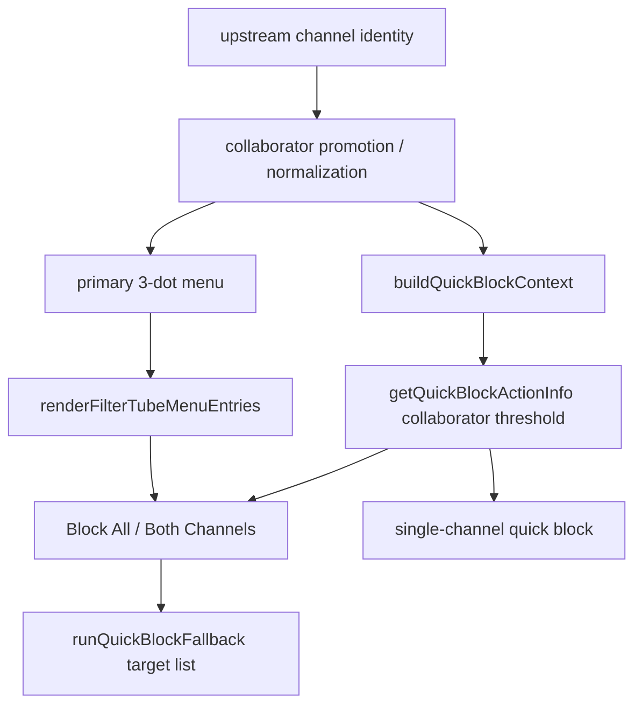
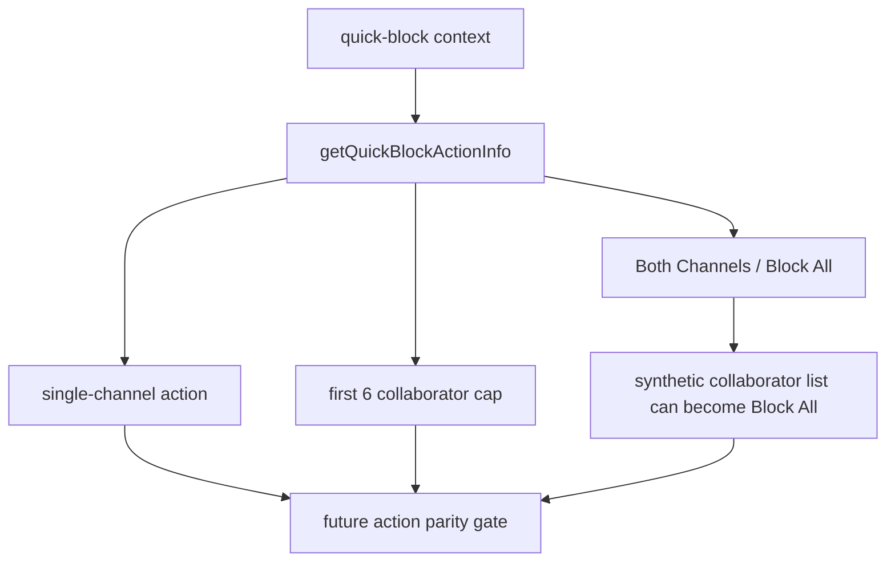
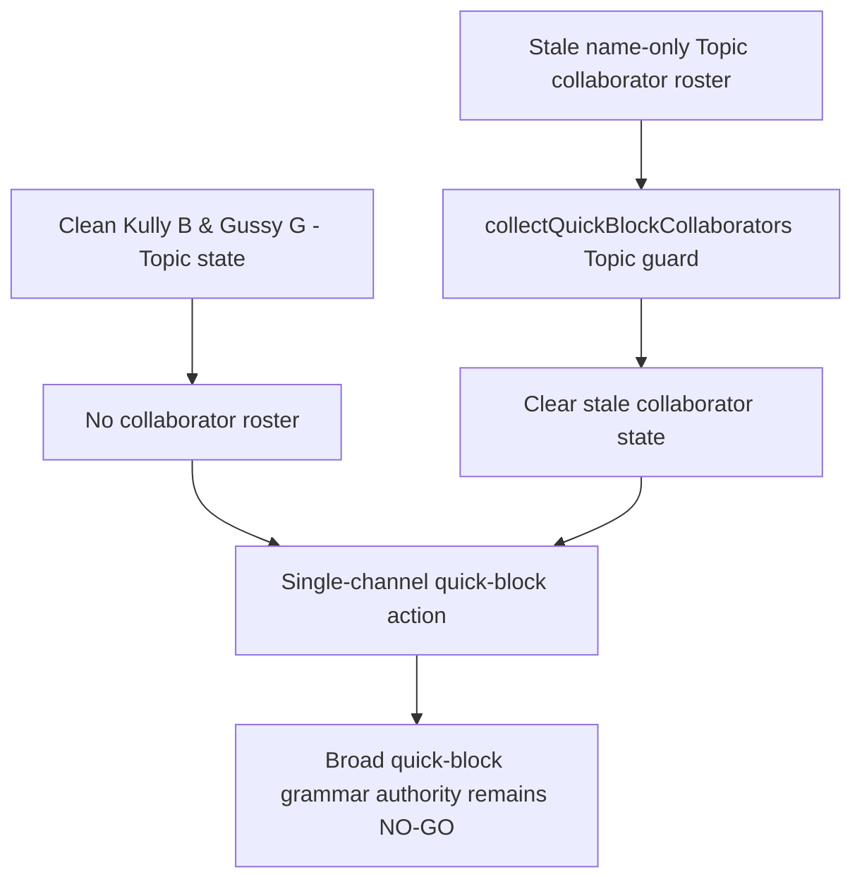

# FilterTube Quick Block Block Menu Affordance Boundary Current Behavior - 2026-05-22

Status: current-behavior proof slice with 2026-05-25 SPA drag optimization addendum.

Runtime behavior changed only for lifecycle scheduling: the quick-block
periodic full-document sweep was removed; desktop quick-block work is now
hover-lazy while still allowing first-rule creation on empty blocklists; and
fallback menu work is desktop-hover lazy while mobile/coarse-pointer surfaces
still run bounded visible scans.

2026-05-26 addendum: initial compiled-settings delivery now retries lazy
runtime observer availability, so quick-block does not depend on the 1-second
startup attempt winning the settings race. Quick-block target resolution also
uses native `closest()` before the bounded parent walk so deep Home/Shorts card
markup can still expose the first-rule quick-cross affordance. The 2026-05-26
release fix also promotes nested Shorts hover hits to the outer Shorts card
before the duplicate-card guard, restoring quick-cross controls on Shorts
shelves after the hover-lazy optimization.

2026-05-28 addendum: `content_bridge.js` source fingerprints were refreshed
after the collaborator separator evidence gate landed. Quick-block action
construction is unchanged, but the observed bare `and` upstream source path is
now gated before it can supply a collaborator-shaped context.

2026-05-29 addendum: the collaborator identity promotion handoff verifier now
executes the quick-block action layer for the known `Kully B & Gussy G - Topic`
case. Clean Topic state stays single-channel, and stale name-only
collaborator-shaped Topic input is stripped before quick-block can construct a
Block All action. This narrows the known Topic false-positive but does not
create broad quick-block grammar authority.

This slice promotes the quick-block and block-menu rows from broad lifecycle and
feature-dependency coverage into a dedicated affordance-control boundary. It
pins the current split where `showQuickBlockButton` and `showBlockMenuItem` are
first-class settings keys and content catalog controls, but quick-block
lifecycle setup and fallback menu insertion/action paths are not governed by one
shared affordance authority.

## Boundary Source Files

quick-block/block-menu affordance boundary source files: 7

quick-block/block-menu affordance source/effect blocks: 16

| File | Lines | Bytes | SHA-256 |
| --- | ---: | ---: | --- |
| `js/content_controls_catalog.js` | 222 | 7822 | `780b35c8aa33161ccd6e489b0843f01d805620409715a50aaca0a0bf6cff7e10` |
| `js/settings_shared.js` | 1181 | 57535 | `9710ebb445ba11cc45fc98aced765d298226a8cd4a003600e106f908abc2162c` |
| `js/background.js` | 6789 | 306239 | `618e41011a6031c7a4eb3d022c4612536942a7a58a3c41eb0fd7e31c29a60311` |
| `js/content/bridge_settings.js` | 1113 | 44087 | `f29e6fab216e80cfd3ae9735088f79b36240331429aadbe85db52467be921853` |
| `js/state_manager.js` | 2491 | 99780 | `509c559e35989c13cdded17c01eeaca8115addcd3848dbcda41514422e5bc7b6` |
| `js/content/block_channel.js` | 3189 | 127857 | `c040b57e0b107fd7b6fb0a18bc4ca014e5a22fbb82755f81e51a497eee387dba` |
| `js/content_bridge.js` | 13636 | 604184 | `8d55d0c8995e5b68bb9142c41f95046a676f5af2b83f8545b00f91a6a5a3776d` |

## Pinned Source Counts

catalog feed affordance controls block lines: 10

catalog feed affordance controls block bytes: 488

settings_shared settings keys block lines: 38

settings_shared settings keys block bytes: 1031

settings_shared affordance compile block lines: 2

settings_shared affordance compile block bytes: 126

background boolean pass-through block lines: 35

background boolean pass-through block bytes: 3596

background storage refresh keys block lines: 16

background storage refresh keys block bytes: 461

content bridge storage refresh keys block lines: 44

content bridge storage refresh keys block bytes: 1263

state manager valid setting keys block lines: 33

state manager valid setting keys block bytes: 1063

state manager external reload keys block lines: 41

state manager external reload keys block bytes: 1604

quick block card selectors block lines: 44

quick block card selectors block bytes: 1519

quick block enabled gate block lines: 89

quick block enabled gate block bytes: 2941

quick block setup lifecycle block lines: 320

quick block setup lifecycle block bytes: 13892

normal menu injection gate block lines: 14

normal menu injection gate block bytes: 411

fallback menu button creation block lines: 31

fallback menu button creation block bytes: 1533

fallback menu scan lifecycle block lines: 279

fallback menu scan lifecycle block bytes: 9837

fallback popover open block lines: 104

fallback popover open block bytes: 3500

fallback perform block action block lines: 212

fallback perform block action block bytes: 9930

content_controls_catalog total showQuickBlockButton tokens: 1

content_controls_catalog total showBlockMenuItem tokens: 1

settings_shared total showQuickBlockButton tokens: 23

settings_shared total showBlockMenuItem tokens: 23

background total showQuickBlockButton tokens: 7

background total showBlockMenuItem tokens: 4

bridge_settings total showQuickBlockButton token: 1

bridge_settings total showBlockMenuItem token: 1

state_manager total showQuickBlockButton tokens: 7

state_manager total showBlockMenuItem tokens: 7

block_channel total showQuickBlockButton token: 1

block_channel total showBlockMenuItem tokens: 0

content_bridge total showQuickBlockButton tokens: 0

content_bridge total showBlockMenuItem token: 1

quick block selector entries: 43

quick block setup addEventListener callsites: 12

quick block setup MutationObserver callsites: 1

quick block setup setTimeout callsites: 3

quick block setup setInterval callsites: 0

quick block setup requestAnimationFrame callsites: 1

fallback menu scan addEventListener callsites: 6

fallback menu scan MutationObserver callsites: 1

fallback menu scan setTimeout callsites: 4

fallback menu scan setInterval callsites: 1

fallback menu scan requestAnimationFrame callsites: 2

fallback menu scan selector literals: 25

runtime quick-block/block-menu affordance fixtures: 7

## Current Behavior Matrix

| Boundary | Current behavior | Missing proof before implementation |
| --- | --- | --- |
| Catalog controls | `js/content_controls_catalog.js` exposes `showQuickBlockButton` and `showBlockMenuItem` as Feed controls beside playlist, member, Mix, and sponsored filters. | A feature-control contract that separates visibility toggles, action affordances, lifecycle work, mode restrictions, and route/device scope. |
| Settings defaults | `js/settings_shared.js`, `js/background.js`, and `js/state_manager.js` treat both affordances as default-on unless explicitly set to `false`. | A schema owner that records profile, list-mode, child/Kids, migration, and revision semantics for default-on affordances. |
| Background cache invalidation | Background compile emits both fields, but the background storage-change invalidation list does not include either field today. | A cache invalidation report for affordance controls, or an explicit DOM-only classification with bounded refresh paths. |
| Content and UI refresh | `js/content/bridge_settings.js` and `js/state_manager.js` include both keys in their refresh/reload key lists. | A cross-owner refresh parity report across background, content bridge, StateManager, shared settings, UI save paths, and profile writes. |
| Quick-block action gate | `isQuickBlockEnabled()` rejects missing settings, disabled settings, `showQuickBlockButton !== true`, and whitelist mode. Empty blocklists remain enabled so the quick-cross can create the first channel rule; desktop work remains hover-lazy. | A quick-block action decision that reports route, profile, list mode, device surface, native overlay/fullscreen pause state, first-rule affordance state, and exact allowed effects. |
| Quick-block lifecycle | `setupQuickBlockObserver()` injects styles and installs pointer/route/mutation lifecycle owners, but callback work now calls `isQuickBlockEnabled()` and near-viewport tracking instead of a periodic full-document sweep. | A quick-block no-work/lifecycle budget proving disabled, whitelist, native-overlay, fullscreen, active-work, and navigation teardown behavior. |
| Primary 3-dot menu | `injectFilterTubeMenuItem()` exits in whitelist mode and when `currentSettings.showBlockMenuItem === false`. | A primary menu action gate report tied to sender trust, route context, list mode, profile lock state, and row identity confidence. |
| Fallback menu scan and button | The fallback scanner checks native overlay quiet mode but not `showBlockMenuItem`, `showQuickBlockButton`, or `listMode`; desktop fallback scanning is hover/focus/click lazy, while mobile/coarse-pointer surfaces use visible scans and bounded warmup. Fallback buttons can open a FilterTube popover from that path. | A fallback-menu parity report proving whether fallback scanning/buttons share the primary menu action gate or are intentionally separate with a bounded work budget. |
| Fallback popover action | `performBlock()` can optimistically hide the row, call direct block paths, refresh settings from background, and force DOM fallback reprocessing without a local `showBlockMenuItem` or list-mode gate in that action block. | A false-hide/restore report and mutation-effect contract for fallback action rows, collaborator rows, watch playlist handoff, retry paths, and failure rollback. |

## Runtime Proof

The runtime fixture proves:

1. `showQuickBlockButton` and `showBlockMenuItem` are cataloged as Feed
   controls, not JSON row filters.
2. Shared settings, background compile, and StateManager default both
   affordances to enabled unless storage/profile state is explicitly `false`.
3. Background compiles both fields while background storage invalidation omits
   both; content bridge and StateManager refresh/reload lists include both.
4. Quick-block action gating rejects disabled toggle state, whitelist mode, and
   disabled settings, while preserving empty-blocklist first-rule channel block
   affordances on desktop through hover-lazy work.
5. Quick-block lifecycle setup installs listener, observer, route-navigation,
   timer, and frame work before one shared affordance authority exists; the
   previous periodic full-document sweep is no longer present.
6. Primary 3-dot menu injection has `listMode` and `showBlockMenuItem` gates,
   while fallback scan, fallback button, popover-open, and perform-block blocks
   do not.
7. Fallback action behavior can optimistically hide a row, mutate block state,
   refresh settings, and force DOM fallback reprocessing from the fallback path.

## Collaborator Grammar Action Handoff Addendum - 2026-05-27

This continuation connects the collaborator byline grammar audit to the actual
quick-block and menu actions. The quick-block action constructor is unchanged;
the 2026-05-28 upstream separator evidence gate now prevents the known bare
`and` source path from reaching this layer as collaborator-shaped state.

```text
upstream channel identity
    |
    v
promote / normalize collaborator signals
    |
    v
quick-block context or primary menu render
    |-- collaborators >= 2 -> Block All / Both Channels action
    |-- collaborators < 2  -> single-channel action
    v
fallback action path
    |-- Block All list is reused only when isBlockAllOption is present
```



| Action row | Source pins | Current behavior | Remaining proof gap |
| --- | --- | --- | --- |
| `quick_block_context_promotion_handoff` | `js/content/block_channel.js:1543-1603` | Quick-block builds context after `promoteChannelInfoFromCollaboratorSignals()` and then collects collaborators from the promoted identity/card. | No action-level report records which upstream grammar rule produced the collaborator list. |
| `quick_block_block_all_threshold` | `js/content/block_channel.js:1607-1639` | Quick-block creates Block All/Both Channels only when `collaborators.length >= 2`; otherwise it falls back to the primary collaborator or base channel. | The known `Kully B & Gussy G - Topic` quick-block negative path is source-proved in the collaborator handoff verifier; no broad fixture proves every grammar-risk row stays single-channel. |
| `quick_block_fallback_target_list` | `js/content/block_channel.js:1671-1689` | Fallback quick-block uses `allCollaborators` only when `isBlockAllOption` is present; otherwise it acts on the single `channelInfo`. | No rollback/restore proof ties collaborator action count to false-hide behavior. |
| `primary_menu_collaboration_render` | `js/content_bridge.js:731-795`; `js/content_bridge.js:11139-11208` | Primary menu registers/renders collaboration menu entries only after `initialChannelInfo.isCollaboration` survives normalization or warmup. | No primary-menu installed-tab trace proves Topic and single-channel `and` rows share the intended action labels. |
| `primary_menu_collaboration_fetch_guard` | `js/content_bridge.js:11220-11248` | Collaboration cards skip the single-channel background fetch path, so wrong collaborator classification can suppress later single-channel repair. | No metric artifact quantifies this repair-suppression risk across watch/right-rail SPA navigation. |

Current collaborator action handoff status:

```text
quick-block collaborator action rows: 5
ASCII collaborator action diagram: present
Mermaid collaborator action diagram: present
watch-like "and" false-positive reaches action layer from current upstream bare byline path: NO
synthetic collaborator-shaped input can still reach action layer: YES
runtime behavior changed by upstream 2026-05-28 separator gate: yes
```

## Quick-Block Action Consequence Fixture Packet - 2026-05-27

This packet executes the current `getQuickBlockActionInfo()` implementation from
`js/content/block_channel.js:1607-1639` in isolation. It proves the action-layer
consequence if any upstream path still supplies a collaborator list, while the
known bare `and` source path is now gated earlier by `content_bridge.js`.

```text
quick-block context
    |
    v
getQuickBlockActionInfo
    |-- 0 collaborators + base -> single-channel action
    |-- 2 collaborators        -> Both Channels / Block All action
    |-- 7 collaborators        -> cap to first 6 targets
    v
action metadata handed to quick-block fallback / menu rendering
```



| Consequence row | Input shape | Current observed behavior | Release interpretation |
| --- | --- | --- | --- |
| `quick_action_and_name_risk_block_all` | Synthetic `Law and Crime Network` already split upstream into `Law` and `Crime Network` collaborators. | Returns `channelInfo.name = "Both Channels"`, `isBlockAllOption = true`, both collaborators, and block-all attrs. | `SYNTHETIC-CONSEQUENCE`; if another upstream path supplies this wrong shape, quick-block action becomes Block All. The current bare byline source path is gated earlier. |
| `quick_action_single_channel_control` | No collaborators, base channel `Single Channel`. | Returns single-channel `channelInfo` with empty attrs. | `CONTROL`; base identity remains single-channel when no collaborator list survives. |
| `quick_action_six_target_cap` | Seven collaborators. | Returns `All 6 Collaborators` with only the first six targets. | `CONTROL`; broad collaborator cards are capped before quick-block fallback. |
| `quick_action_null_context_control` | Null context. | Returns `null`. | `CONTROL`; missing action context does not synthesize a block target. |

Current quick-block action consequence status:

```text
quick-block action consequence fixture rows: 4
misclassified single-channel and-name action risk: GATED_UPSTREAM_FOR_KNOWN_BARE_BYLINE_PATH
synthetic collaborator-shaped action consequence risk: PRESENT
runtime behavior changed by upstream 2026-05-28 separator gate: yes
```

## Quick-Block Topic Negative Crosscheck - 2026-05-29

The executable quick-block crosscheck lives in
`tests/runtime/content-bridge-collaborator-identity-promotion-handoff-current-behavior.test.mjs`
because quick-block still trusts upstream collaborator identity. That fixture
runs the quick-block action constructor against the same Topic boundary used by
the menu and writer-side guards.

```text
clean Kully B & Gussy G - Topic state
    |
    v
quick-block context has no collaborator roster
    |
    v
single-channel quick-block action

stale name-only Topic collaborator roster
    |
    v
collectQuickBlockCollaborators guard clears stale state
    |
    v
single-channel quick-block action after Topic guard
```



Current Topic quick-block crosscheck status:

```text
topic quick-block clean-state fixture rows: 3
known ampersand Topic quick-block action: SINGLE_CHANNEL_AFTER_TOPIC_GUARD
quick-block full Topic parity authority: PARTIAL_GO
installed-tab byte parity trace: MISSING
runtime behavior changed by 2026-05-29 collaborator handoff continuation: yes
```

## Scoped Collaborator Warmup Addendum - 2026-06-03

Quick-block hover and action now ask the content bridge to prefetch
collaborators for the interacted card only:

- hover calls `window.FilterTube_prefetchCollaboratorsForCard?.(targetCard, { timeoutMs: 900, reason: 'quick-block-hover' })`
- action awaits `window.FilterTube_prefetchCollaboratorsForCard?.(videoCard, { timeoutMs: 1200, reason: 'quick-block-action' })` before `buildQuickBlockContext(videoCard)`

This restores a reliable collaborator lookup opportunity for users creating
the first collaborator block after the no-work performance fixes. It does not
re-enable periodic full-document quick-block sweeps and does not change the
ampersand Topic guard.

Current quick-block scoped-warmup status:

```text
quick-block hover collaborator warmup: PRESENT
quick-block action collaborator warmup before context build: PRESENT
periodic full-document quick-block sweep: ABSENT
ampersand Topic quick-block guard changed: no
runtime behavior changed by 2026-06-03 scoped warmup: yes
```

## Non-Completion Boundary

Quick-block and block-menu affordance behavior still needs affordance contracts,
quick-block/menu decision reports, lifecycle budgets, block-menu action-gate
reports, fallback-menu parity reports, settings cache invalidation reports,
quick-block selector inventory policies, fallback false-hide/restore reports,
route pause policies, fixture provenance, metric artifacts, and first-class
affordance authority gates.

No `contentAffordanceControlsContract`,
`quickBlockMenuAffordanceDecisionReport`, `quickBlockLifecycleBudget`,
`blockMenuActionGateReport`, `fallbackMenuActionGateParityReport`,
`affordanceSettingsCacheInvalidationReport`,
`quickBlockDomSelectorInventoryPolicy`, `fallbackMenuFalseHideRestoreReport`,
`affordanceRoutePausePolicy`, `affordanceFixtureProvenance`, or
`affordanceMetricArtifact` exists in product runtime source yet.

No `quickBlockCollaboratorGrammarHandoffReport`,
`quickBlockCollaboratorActionParityReport`,
`quickBlockTopicNegativeActionFixture`, or
`primaryMenuCollaboratorGrammarParityTrace` exists in product runtime source yet.

## Method Semantic Proof Gap Boundary

`docs/audit/FILTERTUBE_METHOD_SEMANTIC_PROOF_GAP_INDEX_CURRENT_BEHAVIOR_2026-05-25.md`
is a required source input before this menu/dialog/injector/quick-block
surface can support runtime optimization. Current proof pins:

```text
method semantic proof gap files covered: 69
method semantic proof gap lexical callables covered: 5836
files with complete per-callable semantic proof: 0
lexical callables requiring semantic proof before behavior changes: 5836
affected callable semantic proof: NO-GO
runtime behavior changed: no
```

These counts are audit-only blockers. They do not approve runtime
optimization, JSON-first behavior, menu action behavior, dialog lifecycle
behavior, injector behavior, quick-block behavior, whitelist behavior, metric
collectors, artifact creation, native sync, release package changes, or public
claims.
