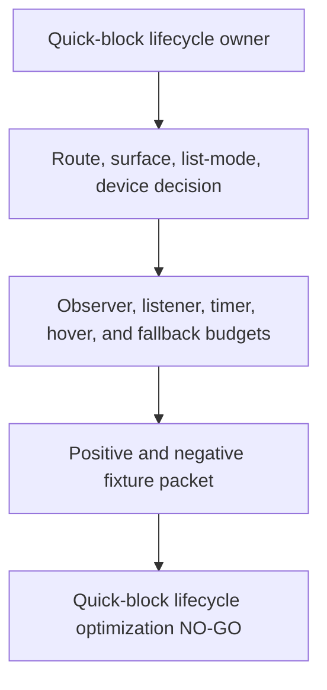
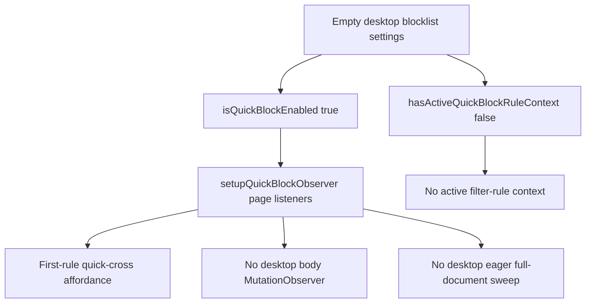
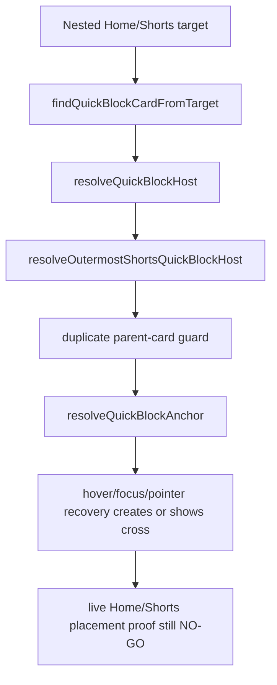

# FilterTube Quick Block Hover Lifecycle Timer Boundary - Current Behavior

Status: current-behavior proof slice with 2026-05-26 second-pass idle-detach addendum.

This is not an implementation patch. It is not approval to change runtime filtering, JSON mutation, DOM mutation, storage, message, lifecycle, network, prompt, or settings semantics. This codebase inspection is finding optimization locations and first-class JSON filter blockers before product changes.

## Boundary

This slice pins the quick-block hover lifecycle in `js/content/block_channel.js`: globals, surface predicates, viewport requestAnimationFrame refresh, cached search/overlay surface state, host hover/sticky timers, fallback action DOM rerun timer, wrap/host/anchor listeners, button injection, sweep scheduling, MutationObserver ownership, and route/mutation-scoped sweep behavior. The previous periodic full-document sweep was removed in the 2026-05-25 SPA drag optimization addendum. The 2026-05-26 addendum tracks near-viewport quick-block hosts with IntersectionObserver so scroll/resize refreshes and pointermove fallback checks avoid querying every stamped host after observation is established. A follow-up 2026-05-26 cache bounds repeated mobile-search and YouTube-overlay selector walks during pointermove/scroll/mutation bursts while click/focus/navigation force refresh the state. A second 2026-05-26 runtime fix makes desktop quick-block insertion lazy: mobile/coarse YouTube surfaces still run eager visible sweeps, but desktop watch/home/search cards are only ensured from hover/focus/pointer recovery instead of startup, SPA navigation, and mutation full sweeps. A third 2026-05-26 runtime fix removes the desktop body MutationObserver and target-gates pointermove recovery; a follow-up caches the last pointer target resolved host so repeated movement over the same element does not rerun broad `closest()` checks. The second-pass idle-detach addendum makes the desktop pointermove listener dynamic: it attaches only after quick-block arming and removes itself when the short recovery window is idle. The follow-up lag fix prunes stale tracked hosts, gates empty desktop SPA navigation from quick-block overlay scans, and delays desktop quick-block button creation behind a short hover-intent timer. The next lag fix caches expensive top/bottom viewport occlusion probes for 250 ms, caps each quick-block viewport refresh to 32 host updates, and routes dropdown visibility observer work through the already deferred injector. The latest release fix promotes nested Home/Shorts hover hits to the outer Shorts card before the duplicate-card guard, so the quick-cross can render on Shorts shelves after the hover-lazy optimization.

quick-block hover lifecycle timer source files: 1

quick-block hover lifecycle timer source/effect blocks: 12

## Source Fingerprint

| File | Lines | Bytes | SHA-256 |
| --- | ---: | ---: | --- |
| `js/content/block_channel.js` | 3189 | 127857 | `c040b57e0b107fd7b6fb0a18bc4ca014e5a22fbb82755f81e51a497eee387dba` |

## Pinned Blocks

| Block | Start Line | Lines | Bytes | SHA-256 |
| --- | ---: | ---: | ---: | --- |
| `quickBlockGlobals` | 80 | 22 | 1055 | `5c9dbc252a94d17b25e29e5c35233d551deeef0d8e1ee0e52c67c5065be9651d` |
| `quickBlockSurfacePredicates` | 121 | 31 | 974 | `b0319db9efb0cb16f6dac8b450949df41542075f1eb4cd11be20db4e786d8dcf` |
| `quickBlockOcclusionCache` | 237 | 73 | 2579 | `0a257411a4f81964972bfe4e340a65761e21e7548c325783ad8821072f74aa44` |
| `quickBlockViewportPruning` | 310 | 150 | 4982 | `aa4a222d8d8c3fb28e25045189abc6682dd40427f61d5813d4a773f8c96b2fdf` |
| `quickBlockViewportRefresh` | 932 | 97 | 3961 | `b136e450414bb439083d8dc505c6b92b70ceebbf600395d2523b22d5e59e67d2` |
| `quickBlockHoverState` | 1029 | 67 | 2162 | `58f5cc099c0e78d55405794747e669a110d6f3f54425d91853f9e92058069dcc` |
| `quickBlockCardTargetFastPath` | 1096 | 116 | 3885 | `1912076cdad42fd711131fadfe294de91970d226e08784b83f2c72fa42137500` |
| `quickBlockActionFallback` | 1747 | 41 | 1668 | `155082c97c19e455c37dfca135618a0f88eaf2165493f1a5fbee86a92d0c60fe` |
| `quickBlockWrapHoverEvents` | 1788 | 14 | 888 | `44533bcceeb20e45528a041e9a1770bd264c393f1872a458efc3ccea6fc8509c` |
| `quickBlockEnsureButton` | 1802 | 150 | 6556 | `fc46ee05e9bfb3e63f057563c7c4a50d73dc43792f6b8da4b67fe62e460af78c` |
| `quickBlockSweepSchedule` | 1952 | 41 | 1342 | `931331c0e6890d9a364b586463a46b255d17a7b7d5610de81dcf754bb96f2103` |
| `quickBlockObserverSetup` | 1993 | 322 | 13896 | `cf6b14c4d67b40cdc33a0126b920c224ef184a60c361481b22c025c9328dffc5` |


## Selected Token Counts

These counts are over the twelve pinned blocks, not the whole product.

| Token | Count |
| --- | ---: |
| `quickBlockStylesInjected` | 1 |
| `quickBlockObserverStarted` | 5 |
| `quickBlockSweepTimer` | 4 |
| `quickBlockPeriodicTimer` | 0 |
| `quickBlockViewportUpdateScheduled` | 4 |
| `quickBlockHostVisibilityObserver` | 7 |
| `quickBlockViewportHosts` | 16 |
| `quickBlockSurfaceStateCache` | 7 |
| `quickBlockOcclusionCache` | 10 |
| `QUICK_BLOCK_SURFACE_STATE_CACHE_MS` | 2 |
| `QUICK_BLOCK_OCCLUSION_CACHE_MS` | 2 |
| `QUICK_BLOCK_HOVER_STICKY_MS` | 11 |
| `QUICK_BLOCK_LEAVE_STICKY_MS` | 10 |
| `QUICK_BLOCK_POINTER_RECOVERY_ARM_MS` | 3 |
| `QUICK_BLOCK_VIEWPORT_HOST_LIMIT` | 3 |
| `QUICK_BLOCK_VIEWPORT_REFRESH_HOST_LIMIT` | 2 |
| `QUICK_BLOCK_DESKTOP_HOVER_INTENT_MS` | 2 |
| `quickBlockPointerRecoveryArmedUntil` | 5 |
| `quickBlockPointerRecoveryArmer` | 4 |
| `quickBlockHoverIntentTimer` | 7 |
| `quickBlockHoverIntentCard` | 6 |
| `cancelQuickBlockHoverIntent` | 4 |
| `scheduleQuickBlockHoverIntent` | 2 |
| `invalidateQuickBlockOcclusionCache` | 4 |
| `getQuickBlockViewportOcclusionBounds` | 1 |
| `pruneQuickBlockViewportHosts` | 3 |
| `untrackQuickBlockViewportHost` | 4 |
| `isMobileYouTubeSurface` | 5 |
| `isHoverCapableDesktopSurface` | 2 |
| `shouldEagerQuickBlockSweep` | 5 |
| `requestAnimationFrame` | 3 |
| `setTimeout` | 8 |
| `clearTimeout` | 4 |
| `window.setInterval` | 0 |
| `clearInterval` | 0 |
| `MutationObserver` | 1 |
| `IntersectionObserver` | 3 |
| `observer.observe` | 2 |
| `addEventListener` | 33 |
| `removeEventListener` | 1 |
| `DOMContentLoaded` | 1 |
| `focusin` | 4 |
| `focusout` | 4 |
| `pointerenter` | 4 |
| `pointerleave` | 3 |
| `pointermove` | 2 |
| `mouseenter` | 5 |
| `mouseleave` | 5 |
| `resize` | 1 |
| `orientationchange` | 1 |
| `scroll` | 1 |
| `click` | 2 |
| `data-filtertube-quick-hover` | 6 |
| `data-filtertube-quick-sticky` | 8 |
| `data-filtertube-quick-events` | 2 |
| `data-filtertube-quick-anchor-events` | 2 |
| `data-filtertube-quick-wrap-events` | 2 |
| `filtertube-quick-block-wrap` | 7 |
| `filtertube-quick-block-host` | 3 |
| `isQuickBlockEnabled` | 14 |
| `removeQuickBlockButtons` | 4 |
| `scheduleQuickBlockSweep` | 5 |
| `sweepQuickBlockButtons` | 3 |
| `ensureQuickBlockButton` | 5 |
| `syncQuickBlockSurfaceState` | 6 |
| `getQuickBlockSurfaceState` | 5 |
| `invalidateQuickBlockSurfaceStateCache` | 5 |
| `scheduleQuickBlockViewportRefresh` | 3 |
| `trackQuickBlockViewportHost` | 6 |
| `findQuickBlockCardFromTarget` | 3 |
| `QUICK_BLOCK_CARD_TAGS` | 2 |
| `QUICK_BLOCK_CARD_CLASS_NAMES` | 2 |
| `isYouTubeOverlaySurfaceOpen` | 3 |
| `isMobileSearchSurfaceOpen` | 3 |
| `applyDOMFallback(null, { preserveScroll: true })` | 1 |
| `handleBlockChannelClick` | 2 |
| `runQuickBlockFallback` | 1 |
| `applyQuickBlockImmediateHide` | 1 |
| `data-busy` | 3 |
| `pickHostFromTarget` | 2 |
| `getHostFromCachedTarget` | 3 |
| `pickHostFromPoint` | 2 |
| `elementsFromPoint` | 1 |
| `resolveOutermostShortsQuickBlockHost` | 1 |

## Runtime Fixtures

The paired verifier is `tests/runtime/quick-block-hover-lifecycle-timer-boundary-current-behavior.test.mjs`.

It pins current harness behavior:

- Active hover sets `data-filtertube-quick-hover` and `data-filtertube-quick-sticky`, schedules a sticky-clear timer, and clears the marker when the timer fires.
- Inactive hover removes only `data-filtertube-quick-hover`, keeps the sticky marker for the leave window, and clears a prior hover timer.
- Mobile search, native overlay, YouTube overlay, or viewport-hidden state removes quick hover/sticky markers and syncs surface state without scheduling a sticky timer.
- Viewport refresh coalesces repeated calls behind one requestAnimationFrame and then syncs near-viewport quick-block hosts tracked by IntersectionObserver, falling back to all `.filtertube-quick-block-host` nodes when no observer/tracked set is available. Each refresh updates at most 32 host overlays.
- Pointermove hover recovery first checks a cached event target resolution, then only falls back to `elementsFromPoint()` / near-viewport hosts after the pointer is already over a candidate or active host, so ordinary mouse movement no longer walks the page or repeats broad `closest()` checks for the same target.
- Nested Home/Shorts hover hits are promoted from a descendant `/shorts/` anchor or `.shortsLockupViewModelHost` inner render node to the outer `ytd-rich-item-renderer` before `ensureQuickBlockButton()` applies the parent-card duplicate guard.
- Search/overlay surface detection is cached for a short window during pointermove/scroll/mutation bursts; focus, input, click, resize/orientation, and `yt-navigate-finish` force or invalidate a refresh. Top/bottom viewport occlusion probing is also cached for 250 ms and invalidated on resize, orientation, and SPA navigation.
- Desktop quick-block button creation is lazy: empty desktop blocklists still install page-level quick-block listeners so the first-rule quick-cross can appear, but desktop startup, mutation, and `yt-navigate-finish` do not run eager full-document sweeps or attach the body MutationObserver. Cards are ensured from pointerenter/focus and target-gated pointermove recovery.
- Quick-block sweep coalesces repeated scheduling behind one 80 ms timer and then ensures buttons on matched cards.
- `setupQuickBlockObserver()` returns before installing page-level focus, input, click, scroll, resize, orientation, pointer, hover, and `yt-navigate-finish` scheduling when quick-block is disabled or desktop has no active blocklist work; once active, it installs those page-level hooks with a paired pointermove `removeEventListener` only for the dynamic recovery listener. The body MutationObserver is now mobile/coarse-only, and the previous 1800 ms periodic sweep is no longer present.
- Quick-block fallback success can call `applyQuickBlockImmediateHide()` and then schedule `applyDOMFallback(null, { preserveScroll: true })` after 120 ms.

## Quick-Block Lifecycle Report Contract Continuation - 2026-05-29

This continuation converts the hover-lazy quick-cross lifecycle into the
minimum report a future quick-block optimization must provide. It is audit-only.
It does not approve changing button placement, hover intent, mobile/coarse
eager sweeps, pointer recovery, observer startup, fallback action behavior,
optimistic hides, whitelist mode behavior, first-rule affordances, or DOM
fallback reruns.

```text
quick-block lifecycle owner
        |
        v
route/surface/list-mode/device decision
        |
        v
button availability, observer, timer, hover, fallback action, and no-work proof
        |
        v
positive quick-cross fixture + negative no-work fixture + metric artifact
        |
        v
quick-block lifecycle optimization remains NO-GO
```



| Report contract row | Source owner rows | Required future proof before behavior changes |
| --- | --- | --- |
| `FT-QBLR-00-scope` | `quickBlockSurfacePredicates`; `quickBlockObserverSetup` | Route, surface, profile, list mode, desktop/mobile/coarse state, settings enabled state, first-rule state, and native-overlay/fullscreen policy. |
| `FT-QBLR-01-enablement` | `quickBlockEnsureButton`; `quickBlockObserverSetup` | `showQuickBlockButton`, disabled settings, whitelist mode, empty blocklist first-rule affordance, and negative disabled/whitelist fixture proof. |
| `FT-QBLR-02-surface-cache` | `quickBlockSurfacePredicates`; `quickBlockOcclusionCache` | Search/overlay cache lifetime, force-refresh callers, occlusion cache lifetime, invalidation triggers, and no stale overlay/viewport proof. |
| `FT-QBLR-03-viewport-budget` | `quickBlockViewportPruning`; `quickBlockViewportRefresh` | IntersectionObserver target set, near-viewport limit, 32-host refresh cap, RAF coalescing, fallback query count, and hidden-host cleanup proof. |
| `FT-QBLR-04-hover-intent` | `quickBlockHoverState`; `quickBlockEnsureButton`; `quickBlockWrapHoverEvents` | Hover/sticky attributes, hover-intent delay, leave timer, cancellation path, mobile/overlay rejection, and no stuck quick-cross proof. |
| `FT-QBLR-05-target-resolution` | `quickBlockCardTargetFastPath`; `quickBlockEnsureButton` | Native `closest()` fast path, bounded parent walk, Shorts outer-host promotion, duplicate-card guard, and Home/Shorts placement parity proof. |
| `FT-QBLR-06-pointer-recovery` | `quickBlockObserverSetup`; `quickBlockCardTargetFastPath` | Dynamic pointermove listener arm/idle removal, cached target resolution, fallback `elementsFromPoint()` budget, and ordinary-mousemove no-work proof. |
| `FT-QBLR-07-sweep-observer` | `quickBlockSweepSchedule`; `quickBlockObserverSetup` | 80 ms sweep coalescing, eager-sweep admission, mobile/coarse MutationObserver admission, no periodic full-document sweep proof, and navigation behavior. |
| `FT-QBLR-08-button-dom` | `quickBlockEnsureButton`; `quickBlockWrapHoverEvents` | Wrap/button/anchor listener insertion, duplicate listener guard, ARIA/title state, host/anchor marker cleanup, and sibling-visible negative proof. |
| `FT-QBLR-09-action-fallback` | `quickBlockActionFallback` | Busy state, direct block call, fallback path, optimistic hide, 120 ms DOM fallback rerun, failure rollback, and stats/restore side-effect proof. |
| `FT-QBLR-10-cross-feature` | quick-block, native menu, fallback menu, DOM fallback, settings refresh rows | Menu parity, fallback menu parity, whitelist no-work, settings refresh fanout, collaborator/Topic identity state, and JSON/DOM/native parity. |
| `FT-QBLR-11-artifact-gate` | this report plus fixture rows | Metric artifact path, positive fixture, negative no-work fixture, Home/Shorts fixture, watch/right-rail fixture, mobile/coarse fixture, rollback report, and release claim boundary. |

Required report fields before any quick-block lifecycle behavior change:

```text
route
surface
profile
listMode
deviceClass
activeRuleState
firstRuleAffordance
nativeOverlayState
surfaceCacheState
viewportHostCount
hoverIntentState
pointerRecoveryState
sweepAdmission
observerAdmission
buttonDomState
actionFallbackState
optimisticHideEffect
domFallbackRerunEffect
negativeNoWorkProof
metricArtifact
```

Current quick-block lifecycle report contract status:

```text
quick-block lifecycle report contract rows: 12
required quick-block lifecycle report fields: 20
implementation-ready quick-block lifecycle report rows: 0
runtime quick-block lifecycle report approvals: 0
quick-block lifecycle optimization approval from report contract: NO-GO
runtime behavior changed by this continuation: no
```

## Risk Boundary

The current quick-block lifecycle is page-lifetime work. It has a singleton start flag, local hover timers on host cards, one coalesced sweep timer, one viewport RAF coalescer, one short-lived search/overlay state cache, one short-lived viewport occlusion cache, one host visibility IntersectionObserver, and one route-navigation listener. The body MutationObserver is now only attached on mobile/coarse surfaces. The previous periodic sweep interval is gone, viewport refreshes plus pointermove fallback checks are now bounded to near-viewport hosts after observation is established, and desktop startup/mutation/navigation full sweeps are suppressed by `shouldEagerQuickBlockSweep()`. The observer/listener owner still has no full local teardown path; only dynamic pointermove recovery has a paired removal path. This is relevant to reliability, false-hide/leak, performance, native overlay/fullscreen quiet mode, whitelist mode quietness, DOM fallback reruns, and code-burden rows.

The current quick-block action state is gated by `showQuickBlockButton === true`, `listMode !== 'whitelist'`, and the global enabled flag. Empty desktop blocklists remain enabled for first-rule channel blocking, so setup can install page-level lifecycle hooks before any keyword/channel rule exists. The current idle win is narrower: desktop avoids the old periodic sweep, startup/body MutationObserver, mutation full-document sweep, and SPA-navigation eager sweep. That means whitelist and empty-install optimization cannot be considered complete from the recent whitelist changes alone.

## Empty Desktop First-Rule Lifecycle Correction - 2026-05-30

This correction is audit-only. It fixes stale wording in this slice without
changing runtime behavior.

```text
empty desktop blocklist
  showQuickBlockButton === true
  listMode !== whitelist
  no filterKeywords/filterChannels/filterKeywordsComments
        |
        v
isQuickBlockEnabled() === true
        |
        v
setupQuickBlockObserver() installs page listeners
        |
        +--> first-rule quick-cross remains possible
        +--> desktop body MutationObserver remains off
        +--> eager startup/mutation/navigation sweeps remain off
```



| Correction row | Source pins | Current behavior | Optimization risk |
| --- | --- | --- | --- |
| `quick_block_empty_desktop_first_rule_enabled` | `js/content/block_channel.js:1205-1222` | `isQuickBlockEnabled()` does not require an active rule list; it keeps empty blocklists enabled when the quick-block setting is true. | Treating empty blocklist as zero quick-block lifecycle work would remove first-rule UI. |
| `quick_block_empty_rule_context_separate` | `js/content/block_channel.js:1224-1289` | `hasActiveQuickBlockRuleContext()` is false for empty keyword/channel/comment lists and inactive booleans, but it is not the startup gate. | Active-rule proofs cannot be reused as quick-block affordance lifecycle proofs. |
| `quick_block_setup_gate_current` | `js/content/block_channel.js:1979-1983` | Setup returns for disabled/whitelist/hidden quick-block settings, then sets `quickBlockObserverStarted` and installs styles/listeners. | Empty desktop installs still own page-level listener budget. |
| `quick_block_desktop_no_body_observer` | `js/content/block_channel.js:2217-2275` | The body `MutationObserver` is inside `shouldEagerQuickBlockSweep()`, which is mobile/coarse-only. | Desktop no-work claims should cite body-observer/eager-sweep absence, not zero listeners. |
| `quick_block_empty_desktop_existing_fixture` | `tests/runtime/empty-install-idle-observer-budget-current-behavior.test.mjs:291-294` | The executable empty-desktop fixture expects `pointerenter` and `yt-navigate-finish` listeners, no startup `pointermove`, and no body observation. | Future quick-block optimization needs separate first-rule and no-body-sweep fixtures. |

```text
quick-block empty desktop correction rows: 5
empty desktop first-rule page listeners: PRESENT
empty desktop active rule context: ABSENT
empty desktop body observer: ABSENT
empty desktop eager sweep approval: NO-GO
runtime behavior changed by this correction: no
```

## Home/Shorts Quick-Cross Placement Preflight - 2026-05-31

This preflight is audit-only. It narrows the user-visible "quick cross missing
on Home/Shorts" concern to the current source gates without approving selector,
placement, hover, observer, or sweep changes.

Current source does not make desktop quick-cross controls always visible on
startup. Desktop Home/Search/Shorts placement is hover/focus/pointer-recovery
driven after the SPA drag optimization removed broad eager sweeps. Mobile/coarse
YouTube surfaces still use the eager visible-sweep path and set
`data-filtertube-quick-force="true"` after a host is ensured.

```text
Home or Shorts card
  -> target detection can start from nested /shorts anchor or inner host
  -> host promotion tries the outer rich item or lockup host
  -> duplicate parent-card guard rejects nested duplicate controls
  -> visual anchor must be renderable, not display: contents
  -> desktop cross appears through hover/focus/pointer recovery
  -> live Home/Shorts placement proof remains missing
```



| Preflight row | Source pins | Current behavior | Missing proof before behavior changes |
| --- | --- | --- | --- |
| `home_shorts_target_detection` | `js/content/block_channel.js:500-546`; `js/content/block_channel.js:1089-1204` | Shorts cards can be detected from `shorts-lockup-view-model`, reel tags, `.shortsLockupViewModelHost`, `.reel-item-endpoint`, or `a[href*="/shorts/"]`. | Live Home and Shorts samples proving the first visible card target resolves to the intended host. |
| `home_shorts_outer_host_promotion` | `js/content/block_channel.js:550-567`; `js/content/block_channel.js:1788-1802` | Nested Shorts hosts can be promoted outward before the duplicate parent-card guard runs. | Installed-tab proof that current Home/Shorts markup still promotes to the visible card and not an inner invisible node. |
| `home_shorts_visual_anchor` | `js/content/block_channel.js:600-701`; `js/content/block_channel.js:1828-1836` | The wrapper is attached to a renderable anchor; `display: contents` candidates are rejected. | Screenshot/pixel or DOM-rect proof that the wrapper is visible and not clipped or hidden by page overlays. |
| `desktop_hover_lazy_placement` | `js/content/block_channel.js:1979-2275` | Desktop startup/navigation/mutation do not run eager full-document sweeps; placement is driven by pointerenter, focus, hover intent, and target-gated pointermove recovery. | Positive first-hover fixture for Home and Shorts plus negative no-work fixture for ordinary mousemove. |
| `mobile_force_visible_placement` | `js/content/block_channel.js:1814-1822`; `js/content/block_channel.js:1979-2275` | Mobile/coarse surfaces can force the ensured control visible and still use bounded eager scans. | Mobile/YTM/Shorts placement fixture proving forced visibility without broad desktop work. |
| `release_gate` | this audit slice; `docs/audit/FILTERTUBE_VISIBLE_INSTALLED_TAB_BYTE_PARITY_PREFLIGHT_CURRENT_BEHAVIOR_2026-05-31.md` | Current source has placement guards, but no installed visible-tab byte parity or live Home/Shorts placement packet. | Live installed-tab byte proof, Home/Shorts placement trace, route/list-mode profile matrix, and rollback/no-work metrics. |

```text
Home/Shorts quick-cross placement preflight rows: 6
Home/Shorts source target promotion status: PRESENT_SOURCE
desktop Home/Shorts always-visible startup status: NOT_CURRENT_BEHAVIOR
mobile/coarse force-visible status: PRESENT_SOURCE
live installed Home/Shorts placement proof: NO-GO
quick-block placement behavior-change approval: NO-GO
runtime behavior changed by this preflight: no
```

## Missing Future Proof

No product runtime symbol exists yet for:

- `quickBlockHoverLifecycleContract`
- `quickBlockHoverLifecycleReport`
- `quickBlockTimerBudget`
- `quickBlockObserverOwnerReport`
- `quickBlockPeriodicSweepBudget`
- `quickBlockViewportRafBudget`
- `quickBlockHoverStickyPolicy`
- `quickBlockTeardownRegistry`
- `quickBlockActionFallbackRerunBudget`
- `quickBlockLifecycleMetricArtifact`
- `quickBlockLifecycleReportContract`
- `quickBlockLifecycleReportApproval`
- `quickBlockLifecycleNoWorkBudgetReport`
- `quickBlockLifecycleNegativeFixturePacket`
- `quickBlockLifecyclePlacementParityProof`
- `quickBlockHomeShortsPlacementParityReport`
- `quickBlockHomeShortsLivePlacementTrace`
- `quickBlockLifecycleRollbackReport`

This slice does not close the audit rows for quick-block lifecycle ownership, teardown, timer budgets, observer budgets, hover policy, viewport RAF budget, post-action DOM fallback rerun budget, native overlay pause policy, whitelist-mode no-work policy, fixture provenance, or first-class quick-block lifecycle authority gates.

## Method Semantic Proof Gap Boundary

`docs/audit/FILTERTUBE_METHOD_SEMANTIC_PROOF_GAP_INDEX_CURRENT_BEHAVIOR_2026-05-25.md`
is a required source input before this menu/dialog/injector/quick-block
surface can support runtime optimization. Current proof pins:

```text
method semantic proof gap files covered: 69
method semantic proof gap lexical callables covered: 5836
files with complete per-callable semantic proof: 0
lexical callables requiring semantic proof before behavior changes: 5836
affected callable semantic proof: NO-GO
runtime behavior changed: no
```

These counts are audit-only blockers. They do not approve runtime
optimization, JSON-first behavior, menu action behavior, dialog lifecycle
behavior, injector behavior, quick-block behavior, whitelist behavior, metric
collectors, artifact creation, native sync, release package changes, or public
claims.
