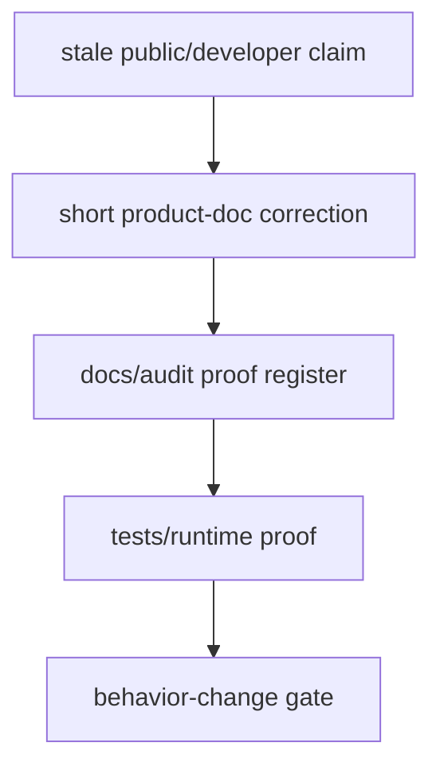

# FilterTube Reference Doc Claim Drift - Current Behavior - 2026-05-19

Status: audit-only proof slice. This is not an implementation patch.
Runtime behavior remains unchanged.

This slice records older reference-document claims that are too absolute for
current implementation work. These docs are useful history, but they must not
be treated as source-of-truth behavior until each claim is tied to source,
fixtures, and a current authority contract.

## Method Semantic Proof Gap Boundary

`docs/audit/FILTERTUBE_METHOD_SEMANTIC_PROOF_GAP_INDEX_CURRENT_BEHAVIOR_2026-05-25.md`
is a required source input before this audit slice can support runtime
optimization or JSON-first promotion. Current proof pins:

```text
method semantic proof gap files covered: 69
method semantic proof gap lexical callables covered: 5789
files with complete per-callable semantic proof: 0
lexical callables requiring semantic proof before behavior changes: 5789
affected callable semantic proof: NO-GO
runtime behavior changed: no
```

These counts are audit-only blockers. They do not approve runtime optimization,
JSON-first behavior, method deletion, method merging, lifecycle cleanup, no-work
changes, or whitelist behavior changes.

## Why This Matters

The active audit is not only checking code. It must also prevent stale docs from
steering fixes. A phrase like "zero-network Kids" or "DOM extraction always
succeeds" can lead to deleting a fallback that still protects Shorts, watch,
playlist, Kids, or weak-menu cases.

Current safer framing:

```text
JSON-first, not JSON-complete.

YouTubei / ytInitial payloads are the preferred identity sources.
Harvested channelMap/videoChannelMap/videoMetaMap entries are a first-class
memory layer.
DOM extraction is visible-card fallback/enrichment.
Background watch/Shorts/Kids fetches can be fallback resolvers after
cache/map/source checks. Background channel fetch work can also be invoked
directly by message and enrichment paths. None of those paths prove a global
zero-network contract.
```

## Drift Register

| Reference doc | Drifted claim | Current source evidence | Audit verdict |
| --- | --- | --- | --- |
| `README.md` | Older public-facing wording claimed "Instant Blocking", "100% Private", "No External Requests", "XHR interception and instant stamping", and data interception before render as a blanket behavior. | Current source and audit docs show JSON-first filtering, learned maps, DOM fallback, bounded YouTube resolver paths, optional Nanah/website/store surfaces, and route-specific weak identity cases. | Live README corrected to scoped claims: early filtering only when JSON exposes needed fields, fast menu blocking only when identity is proven, local-first extension storage, no FilterTube account/extension analytics, and bounded fallback resolvers for weak targets. |
| `docs/CHANNEL_BLOCKING_SYSTEM.md` | The source waterfall can be read as if XHR/JSON is the source of truth and therefore enough to permit every hide/fetch/write/no-work decision. | The mode/surface proof shows source tier and effect permission are separate. Empty blocklist/whitelist, Main/Kids/YTM/watch/Shorts/playlist/Mix/comment/post/native surfaces, quick/menu actions, and Kids route behavior need separate allowed-effect proof. | Live doc corrected to source tier rather than source-of-truth wording and points to the missing `modeSurfaceEffectAuthority` boundary before optimization or fallback deletion. |
| `docs/NETWORK_REQUEST_PIPELINE.md` | Older wording claimed instant blocking across all surfaces, XHR-only/Kids zero-network identity, rare fallback requests, reliable identity across all YouTube surfaces, and used the broad "proactive, XHR-first" shorthand. | `js/background.js:2978-3009` has `performKidsWatchIdentityFetch()` and fetches `https://www.youtubekids.com/watch?v=...`; `js/background.js:2718`, `5459`, `5587`, and `5622` can fall back from Kids watch identity to normal watch resolution; `js/background.js:4437-4445` exposes `fetchChannelDetails`; source has explicit failed/not-found responses. | Live doc corrected during this audit to "JSON-aware identity pipeline" and "JSON-first, not JSON-only": XHR reduces resolver latency when identity is present, while learned maps, DOM enrichment, and scoped background resolvers remain part of current behavior. |
| `docs/YOUTUBE_KIDS_INTEGRATION.md` | Older wording claimed Kids was zero-network, relied entirely on proactive XHR interception, and ensured reliable Kids blocking. | `performKidsWatchIdentityFetch(videoId)` has stored/session/pending checks and then a scoped `https://www.youtubekids.com/watch?v=...` fetch; route-specific Kids surfaces can expose only video ids. | Live doc corrected to JSON-first and fallback-aware Kids identity. Kids browse/search can often use JSON/DOM, while watch/player may need player payloads, learned maps, or the scoped resolver. |
| `docs/THREE_DOT_MENU_IMPROVEMENTS.md` | Older wording claimed "DOM Extraction (always succeeds)", "Zero-delay blocking thanks to proactive XHR interception", "Try network fetch for complete details", and "Network fetch time: < 2000ms (95th percentile)". | `js/content_bridge.js:8561-10082` returns `null` in many extraction paths and can return `needsFetch: true`; `js/background.js:2693`, `2726`, `2729`, `4261`, `4266`, and `4443` return explicit failure states. | Live doc now marks DOM extraction as visible-card best effort and menu UX as fast only when identity is already proven; the remaining fetch-time wording stays a historical estimate, not an authority contract. |
| `docs/TECHNICAL.md` | Older wording claimed "Kids zero-network mode works entirely from intercepted JSON", "Reliable Kids operation - works even when Kids blocks external requests", "Zero-delay blocking - 3-dot menus show correct names instantly", and "shared data across all surfaces". | Kids and watch fallbacks are active in `js/background.js`; source still has route-specific Shorts/watch/Kids resolver branches and failure states. | Live summary corrected to scoped Kids resolver boundaries, fast blocking on proven identity, and route-specific gaps that still require proof. |
| `docs/WATCH_PLAYLIST_BREAKDOWN.md` | "nothing escapes during race conditions"; "hide any stray playlist rows instantaneously"; "nothing selectable remains" | Current audits already pin gaps for direct watch-card renderers, compact autoplay, end-screen DOM, selected-row side effects, stale playlist restoration, and broad DOM false-hide boundaries. | Historical comparison. Use only with current watch/player, direct-watch-card, and end-screen proof slices. |
| `docs/FUNCTIONALITY.md` | Older wording claimed proactive XHR interception provides instant channel names in 3-dot menus, eliminating all fetching delays. | `js/content_bridge.js:10737` can still request `fetchChannelDetails`; `js/content_bridge.js:12383-12500` can route weak menu targets through background watch/Shorts resolution. | Live doc corrected to "reduces Fetching delays when identity was already harvested, mapped, or stamped." |
| `docs/CONTENT_HIDING_PLAYBOOK.md` | Older wording said there was no proactive enrichment loop, which could be read as no post-action enrichment/fetch work at all. | `js/background.js:1108-1167` defines `schedulePostBlockEnrichment()` and later calls `handleAddFilteredChannel(..., { source: 'postBlockEnrichment' }, ...)`; `js/background.js:6049-6156` schedules enrichment after channel persistence when metadata is incomplete. | Live doc corrected: popup/tab does not run a passive page-wide enrichment loop, but current successful-block flow can still run rate-limited post-block enrichment. This remains an implementation-authority gap until `identityResolverAuthority`, `postActionIdentityFanoutBudget`, and `networkFetchReasonAuthority` exist. |
| `docs/youtube_renderer_inventory.md`; `docs/DEVELOPER_GUIDE.md`; `docs/ARCHITECTURE.md` | Inventory/testing notes reused zero-network, proactive, instant, zero-flash, or performance shorthand that could be read as a guarantee. | These files are evidence/developer guidance rather than runtime authority, but they can still steer future patches. | Live wording corrected to reduced resolver calls when snapshots expose identity, JSON-first plus bounded fallback resolver testing, architecture-level source-confidence language, and scoped optimistic hide wording instead of global instant/zero-flash labels. |
| `docs/CONTENT_HIDING_PLAYBOOK.md` | Performance headings described optimizations as eliminating lag and named zero-flash whitelist filtering as a strength. | `docs/audit/FILTERTUBE_PERFORMANCE_CLAIM_EVIDENCE_BOUNDARY_2026-05-20.md` pins that no shared performance measurement authority exists yet; DOM fallback still has route/device/rule-state budgets to prove. | Live wording now says optimizations reduce lag, historical estimates are not current proof, and whitelist pre-render filtering is best-effort only when intercepted JSON carries the needed fields. |

## Source Truths To Preserve

```text
performKidsWatchIdentityFetch(videoId)
  -> checks stored/pending/session identity
  -> may fetch youtubekids.com/watch?v=VIDEO_ID
  -> may be combined with performWatchIdentityFetch fallback from caller paths

extractChannelFromCard(card)
  -> may return strong id/handle/customUrl/name
  -> may return { videoId, needsFetch: true }
  -> may return null

handleBlockChannelClick(...)
  -> may search ytInitial data
  -> may use channelMap/videoChannelMap
  -> may call fetchChannelDetails
  -> may route weak targets to watch:/shorts: resolvers

schedulePostBlockEnrichment(...)
  -> rate-limited metadata completion path
  -> not a loop when source is postBlockEnrichment
  -> still a background mutation/fetch authority participant
```

## Audit Directory Containment Addendum - 2026-05-29

This continuation records the documentation boundary requested during the
release audit: audit ledgers, proof registers, fixture matrices, TAP summaries,
and behavior-change blockers belong under `docs/audit`. Product-facing docs may
keep short scoped claim corrections only when they prevent stale public or
developer wording from steering runtime changes.

Current containment status:

```text
audit artifact directory: docs/audit
runtime proof directory: tests/runtime
core product docs currently carrying scoped claim corrections: 14
new top-level audit files outside docs/audit: 0
product-doc role: concise claim correction and links to audit authority
audit-doc role: source pins, gaps, ledgers, matrices, diagrams, and proof text
runtime behavior changed by this addendum: no
```

```text
stale public/developer claim
        |
        v
short product-doc correction
        |
        v
docs/audit proof register owns details
        |
        v
runtime/test authority required before behavior changes
```



| Containment row | Current evidence | Boundary |
| --- | --- | --- |
| `audit_docs_home` | `docs/audit` contains the proof registers and current-behavior ledgers. | New audit slices should stay under `docs/audit`. |
| `runtime_proof_home` | `tests/runtime` contains the proof-backed Node test files. | Runtime proof files stay in the test tree, not product docs. |
| `core_doc_claim_corrections` | `README.md`, `docs/ARCHITECTURE.md`, `docs/CHANNEL_BLOCKING_SYSTEM.md`, `docs/CODEMAP.md`, `docs/CONTENT_HIDING_PLAYBOOK.md`, `docs/DEVELOPER_GUIDE.md`, `docs/FUNCTIONALITY.md`, `docs/NETWORK_REQUEST_PIPELINE.md`, `docs/PROACTIVE_CHANNEL_IDENTITY.md`, `docs/TECHNICAL.md`, `docs/THREE_DOT_MENU_IMPROVEMENTS.md`, `docs/WATCH_PLAYLIST_BREAKDOWN.md`, `docs/YOUTUBE_KIDS_INTEGRATION.md`, and `docs/youtube_renderer_inventory.md` carry scoped wording corrections or audit links. | These are not standalone audit artifacts and should not grow ledgers or fixture matrices. |
| `claim_authority_boundary` | Product docs point to dated `docs/audit/FILTERTUBE_*` authority records when wording needs source-backed context. | The dated audit file owns proof detail, not the product doc. |
| `release_readability_boundary` | README and feature docs keep user-facing language short. | Avoid copying audit tables, TAP logs, or method ledgers into product docs. |

## Implementation Boundary

Before changing any behavior based on these older reference docs, require:

1. A current source citation or fixture for the specific route/surface.
2. A route-aware identity decision record showing source kind and confidence.
3. A network/engagement authority record for any fallback fetch.
4. A menu/quick-block authority record for any user-visible "instant" claim.
5. A release-doc rewrite that replaces absolute claims with current scoped
   behavior.

Missing future authority symbols today:

- `referenceDocClaimAuthority`
- `identityFetchAuthority`
- `menuResolutionAuthority`
- `kidsNetworkPolicyAuthority`

## Current Behavior Fixtures Added By This Slice

- `reference_doc_claim_drift_register_documents_current_scope`
- `reference_doc_claim_drift_scopes_public_readme_identity_and_privacy_claims`
- `reference_doc_claim_drift_pins_stale_network_and_kids_claims`
- `reference_doc_claim_drift_pins_menu_and_dom_overclaims`
- `reference_doc_claim_drift_pins_post_block_enrichment_doc_drift`
- `reference_doc_claim_drift_links_to_source_truth_and_future_authorities`
