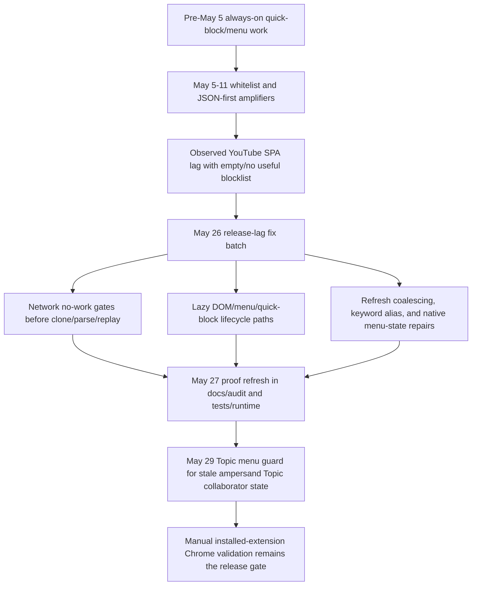
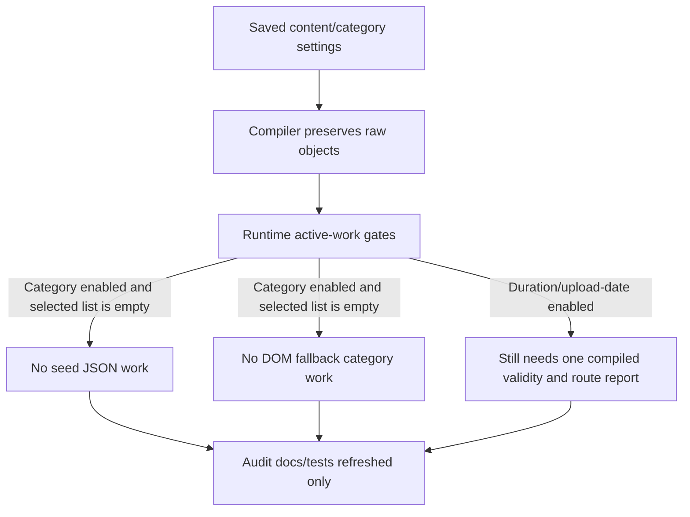

# FilterTube Release Fix Audit Status - 2026-05-26

Status: active audit-driven optimization/fix pass. Product runtime changed only for
the lag/menu/quick-block path under review; this is not a full audit completion
claim.

## User-Visible Risks Under Test

- YouTube should stay snappy when the extension is installed and the Main
  blocklist is empty.
- Blocklist mode should hide matching keyword/channel content.
- Whitelist mode should keep allowing only matching content.
- Channel blocking should keep resolving and targeting the intended list.
- Comment three-dot menus should open normally, close on outside-click, and
  receive the FilterTube action without suppressing YouTube's native menu.
- Home Shorts quick-cross block buttons should appear on the outer Shorts host.

## Release Behavior Change Flow - 2026-05-27

This dated flow records what changed for the release-lag batch and why. It is a
documentation/proof addendum only; it does not add new runtime behavior.

```text
Before May 5
  |
  | broad quick-block/menu lifecycle work already existed
  v
May 5-11 whitelist + JSON-first work
  |
  | exposed/amplified SPA drag through pending-hide, JSON body work, and
  | repeated refresh paths
  v
May 26 release-lag fix batch
  |
  | no-work JSON gates, lazy DOM/menu/quick-block paths, cache refresh
  | reprocess repair, keyword alias repair, native dropdown repair
  v
May 27 proof refresh
  |
  | docs/audit chronology + source-pinned semantic registers + runtime tests
  v
May 29 Topic menu guard
  |
  | stale name-only ampersand Topic collaborator state is demoted before menu
  | render, while true collaborator menus stay multi-channel
  v
Manual installed-extension Chrome testing
```



Behavior-change ledger:

| Date | Behavior boundary | What changed | Proof home |
| --- | --- | --- | --- |
| 2026-05-25 | Whitelist pending-hide intake | Narrow no-work gate before expensive pending candidate collection. | `docs/audit/FILTERTUBE_WHITELIST_PENDING_INTAKE_PATCH_SOURCE_LOCUS_BOUNDARY_CURRENT_BEHAVIOR_2026-05-25.md` |
| 2026-05-26 | Release lag/menu/quick-block fix batch | Empty/inactive blocklist no longer pays broad JSON clone/parse/replay or eager DOM/menu/quick-block work; keyword alias, force reprocess, and native dropdown close/open behavior were repaired. | This document and `docs/audit/FILTERTUBE_YOUTUBE_LAG_COMMIT_ATTRIBUTION_2026-05-26.md` |
| 2026-05-27 | Proof refresh | Audit docs, method registers, source pins, and runtime tests were refreshed after the release-lag batch. | `docs/audit/FILTERTUBE_RUNTIME_FIXTURE_RESULTS_2026-05-17.md` and method semantic registers under `docs/audit/` |
| 2026-05-29 | Topic menu guard | `Kully B & Gussy G - Topic` style stale name-only ampersand Topic collaborator state is demoted to a single-channel menu state at render time; true resolved collaborator menus still render multi-channel controls. | `docs/audit/FILTERTUBE_CONTENT_BRIDGE_MENU_ACTION_LIST_TARGET_CURRENT_BEHAVIOR_2026-05-23.md` |

## Product Fixes Confirmed In Source

- `js/seed.js` now has a no-work network gate for empty/inactive JSON filtering:
  `hasNetworkJsonWork()` at line 234 and
  `shouldBypassYouTubeiNetworkResponse()` at line 253.
- `js/injector.js` mirrors the no-work gate with `hasNetworkJsonWork()` at
  line 185 and clears queued snapshots when there is no active JSON work.
- `js/content_bridge.js` lazily arms main-world/menu/whitelist work instead of
  starting every observer path eagerly.
- `js/content/block_channel.js` no longer performs the old broad periodic
  quick-block sweep. It now relies on hover/visible-card paths and resolves
  nested home Shorts through `resolveOutermostShortsQuickBlockHost()` at
  line 550.
- `js/content/block_channel.js` fixed the comment-menu fallback at
  `tryInjectIntoVisibleDropdown()` line 2800. The fallback now calls
  `handleDropdownAppeared(dropdown)` directly instead of calling
  `scheduleDropdownInjection(dropdown)`, which is scoped inside
  `setupMenuObserver()` and was not available from that helper.
- `js/content/block_channel.js` now limits dropdown hidden-state repair to
  elements explicitly marked with `data-filtertube-force-hidden="true"`.
  The previous repair path treated normal YouTube native close state
  (`display:none`, `hidden`, or `aria-hidden`) as stale FilterTube state and
  could reopen a comment three-dot dropdown after the user clicked outside it.
  The repair now runs from the explicit menu-open scan only, not from the
  dropdown visibility observer or generic visibility checks, so it cannot fight
  YouTube's outside-click close while still clearing a stale FilterTube-forced
  hidden marker before the next 3-dot open.
- `js/content/block_channel.js` now installs
  `closeFilterTubeInjectedDropdownsOnOutsidePointer()` at line 2445 from
  `setupMenuObserver()`. It closes only visible native dropdowns already
  containing `.filtertube-block-channel-item`, ignores clicks on 3-dot menu
  buttons and inside the dropdown, and uses `forceCloseDropdown()`/Escape
  instead of directly writing `style.display` or `aria-hidden`. The current
  native-dropdown proof executes that fallback in fake DOM and verifies that
  plain native YouTube dropdowns, hidden dropdowns, inside clicks, and menu-button
  clicks are not closed by FilterTube.
- `js/content_bridge.js` now treats `&` as display text rather than a
  collaborator separator in `parseCollaboratorNames()`. Comma and `and`
  bylines can still split when the caller explicitly allows separator parsing,
  while `N more`, JSON/showSheet, avatar-stack, and distinct channel-link
  signals remain stronger collaboration evidence. This fixes the
  `Kully B & Gussy G - Topic` false-positive collaborator classification.
- `js/content_bridge.js` now has
  `contentBridgeAmpersandTopicSingleChannelMenuGuard()` at line 13500. The guard
  runs immediately before menu rows are rendered, clears stale same-video
  collaborator-shaped Topic state, and sends the menu renderer a single-channel
  `channelInfo` object only for name-only literal ampersand Topic bylines. This
  keeps the menu action layer aligned with the quick-block outcome without
  changing blocklist, whitelist, direct-add payload, optimistic-hide, or true
  collaborator menu behavior.

## Focused Verification Passed

Commands:

```bash
node --check js/content/block_channel.js
node --check js/seed.js
node --check js/content_bridge.js
node --test --test-reporter=spec tests/runtime/seed-initial-global-hook-current-behavior.test.mjs tests/runtime/seed-initial-global-no-work-list-mode-boundary-current-behavior.test.mjs
node --test --test-reporter=spec tests/runtime/json-first-network-snapshot-consumer-request-transport-current-behavior.test.mjs tests/runtime/json-first-pending-queue-replay-contract-current-behavior.test.mjs tests/runtime/main-guide-endpoint-no-work-boundary-current-behavior.test.mjs tests/runtime/p0-watch-player-current-behavior.test.mjs
node --test --test-reporter=spec tests/runtime/menu-observer-kids-passive-lifecycle-boundary-current-behavior.test.mjs tests/runtime/content-bridge-menu-injection-action-boundary-current-behavior.test.mjs tests/runtime/content-bridge-menu-action-list-target-current-behavior.test.mjs tests/runtime/content-bridge-menu-blocked-state-list-shape-current-behavior.test.mjs
node --test --test-reporter=spec tests/runtime/native-dropdown-close-state-current-behavior.test.mjs tests/runtime/menu-observer-kids-passive-lifecycle-boundary-current-behavior.test.mjs tests/runtime/content-bridge-menu-injection-action-boundary-current-behavior.test.mjs
node --test --test-reporter=spec tests/runtime/native-runtime-sync-authority-current-behavior.test.mjs tests/runtime/native-runtime-sync-manifest-freshness-boundary-current-behavior.test.mjs tests/runtime/p0-native-runtime-sync-current-behavior.test.mjs
node --test --test-reporter=spec tests/runtime/background-identity-fetch-network-budget-boundary-current-behavior.test.mjs tests/runtime/network-credential-policy-matrix-current-behavior.test.mjs tests/runtime/network-fetch-xhr-callsite-register-current-behavior.test.mjs
node --test --test-reporter=spec tests/runtime/content-direct-identity-fallback-side-effect-boundary-current-behavior.test.mjs tests/runtime/background-identity-fetch-network-budget-boundary-current-behavior.test.mjs tests/runtime/network-credential-policy-matrix-current-behavior.test.mjs tests/runtime/network-fetch-xhr-callsite-register-current-behavior.test.mjs
node --test --test-reporter=spec tests/runtime/quick-block-block-menu-affordance-boundary-current-behavior.test.mjs tests/runtime/quick-block-hover-lifecycle-timer-boundary-current-behavior.test.mjs tests/runtime/menu-observer-kids-passive-lifecycle-boundary-current-behavior.test.mjs tests/runtime/content-bridge-menu-injection-action-boundary-current-behavior.test.mjs tests/runtime/content-bridge-menu-action-list-target-current-behavior.test.mjs tests/runtime/content-bridge-menu-blocked-state-list-shape-current-behavior.test.mjs tests/runtime/json-first-keyword-match-boundary-current-behavior.test.mjs tests/runtime/json-first-channel-match-boundary-current-behavior.test.mjs tests/runtime/json-first-whitelist-decision-identity-boundary-current-behavior.test.mjs tests/runtime/main-watch-initial-lockup-shorts-json-current-behavior.test.mjs tests/runtime/main-home-rich-grid-mix-video-current-behavior.test.mjs
node --test --test-reporter=spec tests/runtime/whitelist-cache-hot-path-boundary-current-behavior.test.mjs
node --test --test-reporter=spec tests/runtime/json-first-uppercase-title-boundary-current-behavior.test.mjs
node --test --test-reporter=spec tests/runtime/json-first-video-meta-background-storage-current-behavior.test.mjs
node --test --test-reporter=spec tests/runtime/json-first-video-meta-dom-rerun-current-behavior.test.mjs
node --test --test-reporter=spec tests/runtime/json-first-video-meta-fetch-policy-current-behavior.test.mjs
node --test --test-reporter=spec tests/runtime/json-first-video-meta-freshness-eviction-boundary-current-behavior.test.mjs
node --test --test-reporter=spec tests/runtime/json-first-video-meta-merge-schema-boundary-current-behavior.test.mjs
node --test --test-reporter=spec tests/runtime/json-first-video-meta-no-work-budget-current-behavior.test.mjs
node --test --test-reporter=spec tests/runtime/json-first-renderer-traversal-mutation-boundary-current-behavior.test.mjs tests/runtime/json-first-response-mutation-contract-current-behavior.test.mjs tests/runtime/json-first-no-work-optimization-crosswalk-current-behavior.test.mjs tests/runtime/route-surface-effect-authority-current-behavior.test.mjs
node --test --test-reporter=spec tests/runtime/bridge-settings-listener-timer-boundary-current-behavior.test.mjs tests/runtime/settings-refresh-cross-context-consumer-boundary-current-behavior.test.mjs tests/runtime/settings-refresh-key-parity-register-current-behavior.test.mjs tests/runtime/bridge-settings-method-semantic-register-current-behavior.test.mjs tests/runtime/settings-refresh-fanout-current-behavior.test.mjs
node --test --test-reporter=spec tests/runtime/content-bridge-collaborator-identity-promotion-handoff-current-behavior.test.mjs tests/runtime/content-bridge-collaborator-main-world-merge-mutation-current-behavior.test.mjs tests/runtime/content-bridge-collaborator-metadata-extraction-side-effect-boundary-current-behavior.test.mjs tests/runtime/content-bridge-collaborator-enrichment-retry-boundary-current-behavior.test.mjs tests/runtime/main-collab-resolved-search-card-dialog-current-behavior.test.mjs
node --test --test-reporter=spec tests/runtime/content-bridge-startup-timing-boundary-current-behavior.test.mjs
node --test --test-reporter=spec tests/runtime/startup-injection-readiness-current-behavior.test.mjs
node --test --test-reporter=spec tests/runtime/content-bridge-whitelist-pending-refresh-boundary-current-behavior.test.mjs
node --test --test-reporter=spec tests/runtime/quick-block-default-migration-boundary-current-behavior.test.mjs
node --test --test-reporter=spec tests/runtime/p0-selector-authority-current-behavior.test.mjs
node --test --test-reporter=spec tests/runtime/content-control-active-work-matrix-current-behavior.test.mjs tests/runtime/content-control-alias-mutation-boundary-current-behavior.test.mjs tests/runtime/content-category-predicate-authority-current-behavior.test.mjs tests/runtime/watch-player-control-authority-current-behavior.test.mjs
node --test --test-reporter=spec tests/runtime/json-first-active-work-predicate-register-current-behavior.test.mjs tests/runtime/p0-content-category-current-behavior.test.mjs
node --test --test-reporter=spec tests/runtime/seed-method-semantic-register-current-behavior.test.mjs tests/runtime/seed-page-global-patch-teardown-boundary-current-behavior.test.mjs tests/runtime/seed-settings-replay-provenance-boundary-current-behavior.test.mjs
node --test --test-reporter=spec tests/runtime/active-goal-completion-audit-current-behavior.test.mjs tests/runtime/objective-coverage-ledger-current-behavior.test.mjs tests/runtime/tracked-file-obligation-index-current-behavior.test.mjs
node --test --test-reporter=spec tests/runtime/background-script-injection-trust-boundary-current-behavior.test.mjs tests/runtime/batch-whitelist-import-persistence-boundary-current-behavior.test.mjs
node --test --test-reporter=spec tests/runtime/runtime-diagnostic-logging-policy-matrix-current-behavior.test.mjs tests/runtime/candidate-obligation-binding-matrix-current-behavior.test.mjs
node --test --test-reporter=spec tests/runtime/content-bridge-main-world-message-dispatch-boundary-current-behavior.test.mjs tests/runtime/content-bridge-prefetch-identity-lifecycle-boundary-current-behavior.test.mjs
node --test --test-reporter=spec tests/runtime/content-control-dom-style-lifecycle-restore-current-behavior.test.mjs tests/runtime/content-control-json-first-boundary-index-current-behavior.test.mjs tests/runtime/content-helper-callable-current-behavior.test.mjs
node --test --test-reporter=spec tests/runtime/dom-fallback-method-semantic-register-current-behavior.test.mjs tests/runtime/dom-fallback-run-state-visibility-cleanup-boundary-current-behavior.test.mjs tests/runtime/dom-hide-side-effect-current-behavior.test.mjs tests/runtime/dom-route-scope-current-behavior.test.mjs
node --test --test-reporter=spec tests/runtime/prompt-release-overlay-boundary-current-behavior.test.mjs tests/runtime/single-channel-rule-mutation-persistence-boundary-current-behavior.test.mjs tests/runtime/release-build-artifact-claim-boundary-current-behavior.test.mjs tests/runtime/nanah-vendor-runtime-session-lifecycle-boundary-current-behavior.test.mjs tests/runtime/generated-local-output-dependency-surface-current-behavior.test.mjs tests/runtime/native-runtime-sync-manifest-freshness-boundary-current-behavior.test.mjs
npm run audit:runtime | rg "^not ok|^# tests|^# pass|^# fail|^# duration"
npm run build
git diff --check
```

Results:

```text
seed global focused suite: 19/19 pass
targeted JSON/no-work proof refresh suite: 36/36 pass
menu/outside-close release suite: 40/40 pass
native dropdown close-state focused suite: 21/21 pass
native dropdown fake-DOM outside-pointer proof: 3/3 pass
native runtime sync focused suite: 25/25 pass
background identity/network focused suite: 17/17 pass
direct identity fallback focused suite: 26/26 pass
network credential/fetch register focused suite: 9/9 pass
release-risk focused suite: 100/100 pass
menu outside-click/affordance focused follow-up suite: 109/109 pass
release-risk focused suite after injected-dropdown outside-pointer close: 236/236 pass
native runtime sync proof suite after generated asset pin refresh: 25/25 pass
native overlay/fullscreen + YTM observer timer proof suite: 13/13 pass
whitelist cache hot-path focused suite: 5/5 pass
uppercase-title focused suite: 9/9 pass
video-meta background storage focused suite: 8/8 pass
video-meta DOM rerun focused suite: 8/8 pass
video-meta fetch policy focused suite: 7/7 pass
video-meta freshness eviction focused suite: 8/8 pass
video-meta merge schema focused suite: 8/8 pass
video-meta no-work budget focused suite: 7/7 pass
JSON-first renderer/response/no-work/route authority refresh suite: 29/29 pass
bridge/settings listener-method-refresh-key-fanout proof refresh suite: 35/35 pass
collaborator current-behavior proof refresh suite: 49/49 pass
content bridge startup timing proof refresh suite: 10/10 pass
startup injection readiness focused refresh suite: 8/8 pass
content bridge whitelist pending refresh proof suite: 12/12 pass
quick-block default migration proof refresh suite: 7/7 pass
P0 selector authority proof refresh suite: 13/13 pass
content-control/category/watch-player proof refresh suite: 28/28 pass
JSON-first active-work predicate + P0 content/category proof refresh suite: 16/16 pass
seed method/page-global/settings replay proof refresh suite: 24/24 pass
active-goal/objective/tracked-file ledger suite after JSON-first active-work predicate refresh: 743/743 pass
active-goal/objective/tracked-file ledger suite after seed runtime proof refresh: 743/743 pass
full runtime audit count after native dropdown, native sync, network, background identity, direct identity, whitelist cache, uppercase-title, video-meta background storage, video-meta DOM rerun, video-meta fetch policy, video-meta freshness eviction, video-meta merge schema, and video-meta no-work budget proof refresh: 4176/4551 pass, 375 fail, 56.9s
full runtime audit count after bridge/settings and collaborator proof refresh: 4255/4551 pass, 296 fail, 50.7s
full runtime audit count after content bridge startup timing proof refresh: 4265/4552 pass, 287 fail, 50.7s
full runtime audit count after startup injection readiness proof refresh: 4266/4552 pass, 286 fail, 62.2s
full runtime audit count after whitelist pending refresh proof refresh: 4270/4552 pass, 282 fail, 56.3s
full runtime audit count after quick-block default migration and P0 selector proof refresh: 4272/4552 pass, 280 fail, 51.1s
full runtime audit count after content-control/category/watch-player proof refresh: 4281/4552 pass, 271 fail, 49.9s
full runtime audit count after JSON-first active-work predicate and P0 content/category proof refresh: 4285/4552 pass, 267 fail, 69.1s
full runtime audit count after seed method/page-global/settings replay proof refresh: 4294/4552 pass, 258 fail, 63.5s
full runtime audit count after 2026-05-27 Topic ampersand collaborator fix and provenance refresh: 4297/4553 pass, 256 fail, 98.3s
content-bridge/repo selector-lifecycle register refresh suite: 41/41 pass
release-relevant selector/lifecycle/direct-hide/whitelist register subset: 23/23 pass
full runtime audit count after 2026-05-27 source-derived release register refresh: 4319/4553 pass, 234 fail, 30.5s
storage/message/compiled-settings/synthetic-action callsite register refresh suite: 17/17 pass
full runtime audit count after 2026-05-27 callsite register refresh: 4325/4553 pass, 228 fail, 30.8s
background/backup/learned-identity stale source-pin refresh suite: 27/27 pass
full runtime audit count after 2026-05-27 background source-pin refresh: 4331/4553 pass, 222 fail, 32.7s
collaborator/dialog lifecycle proof refresh suite: 58/58 pass
full runtime audit count after 2026-05-27 collaborator dialog lifecycle refresh: 4334/4553 pass, 219 fail, 30.4s
background script injection trust + batch whitelist import proof refresh suite: 15/15 pass
full runtime audit count after 2026-05-27 background injection/import source-pin refresh: 4336/4553 pass, 217 fail, 33.2s
diagnostic logging + candidate obligation binding proof refresh suite: 12/12 pass
full runtime audit count after 2026-05-27 diagnostic/candidate binding refresh: 4349/4553 pass, 204 fail, 31.0s
content bridge main-world dispatch + prefetch lifecycle proof refresh suite: 14/14 pass
full runtime audit count after 2026-05-27 content-bridge dispatch/prefetch refresh: 4352/4553 pass, 201 fail, 31.3s
content-control style/JSON-first index + content-helper callable proof refresh suite: 14/14 pass
full runtime audit count after 2026-05-27 helper/content-control refresh: 4355/4553 pass, 198 fail, 31.5s
DOM fallback run-state/hide/route proof refresh suite: 31/31 pass
full runtime audit count after 2026-05-27 DOM fallback run-state refresh: 4361/4553 pass, 192 fail, 30.6s
prompt release overlay proof refresh suite: 6/6 pass
single-channel rule mutation persistence proof refresh suite: 11/11 pass
release build artifact claim proof refresh suite: 5/5 pass
Nanah vendor runtime session lifecycle proof refresh suite: 5/5 pass
generated local output + native sync manifest proof refresh suite: 11/11 pass
full runtime audit count after 2026-05-27 release-facing metadata refresh: 4388/4553 pass, 165 fail, 29.1s
source-of-truth/UI-settings/document-start/source-locus proof refresh suites: 50/50 pass
first-optimization metric collector/source-owner/JSON metric gate proof suite: 23/23 pass
current dirty-worktree/source-boundary/all-callable hygiene proof refresh suite: 16/16 pass
identity waterfall + metric artifact schema proof refresh suite: 16/16 pass
full runtime audit count after 2026-05-27 metric proof, dirty-boundary, and audit-hygiene refresh: 4409/4553 pass, 144 fail, 27.7s
JSON-first DOM-only hide/disable boundary proof refresh suite: 169/169 pass
collaborator Topic ampersand handoff proof spot-check: 11/11 pass
full runtime audit count after 2026-05-27 DOM-only JSON-first hide/disable proof refresh: 4500/4553 pass, 53 fail, 33.2s
JSON comment shortcut/provenance proof refresh suite: 57/57 pass
JSON-first network snapshot proof refresh suite: 117/117 pass
full runtime audit count after 2026-05-27 JSON comment and network snapshot proof refresh: 4528/4553 pass, 25 fail, 30.5s
fetch/readiness/implementation-locus proof refresh suite: 23/23 pass
video-meta and Kids comments proof refresh suite: 38/38 pass
lifecycle owner/effect proof refresh suite: 17/17 pass
P0 family proof refresh suite: 5/5 pass
JSON-first metric artifact gate proof refresh suite: 5/5 pass
P0/native/optimization/performance proof refresh: focused clusters pass
full runtime audit count after 2026-05-27 P0/native/metric proof refresh: 4551/4553 pass, 2 fail, 29.4s
remaining rows after that run: source-of-truth wording count and metric
artifact fingerprint drift; metric artifact focused proof then passed 5/5
node syntax checks: pass
npm run build: pass
git diff --check: pass
```

The focused suite covers keyword matching, channel matching, whitelist decision
identity, content-bridge menu actions, blocked-state list shape, quick-block
affordance/lifecycle, main watch initial JSON, Shorts JSON, and home rich-grid
behavior.

## Broad Runtime Audit Status

Command:

```bash
npm run audit:runtime
```

Result:

```text
tests: 4550
pass: 4141
fail: 409
duration: 44.7s first run, 34.6s TAP rerun

after focused proof refresh, native dropdown close-state proof refresh, native
runtime sync proof refresh, network credential/fetch register proof refresh, and
background identity fetch network budget proof refresh, and content direct
identity fallback proof refresh:

tests: 4551
pass: 4163
fail: 388
duration: 58.9s

after whitelist cache hot-path proof refresh:

tests: 4551
pass: 4166
fail: 385
duration: 74.9s

after JSON-first uppercase-title proof refresh:

tests: 4551
pass: 4169
fail: 382
duration: 98.9s

after JSON-first video-meta background storage proof refresh:

tests: 4551
pass: 4171
fail: 380
duration: 46.8s

after JSON-first video-meta DOM rerun proof refresh:

tests: 4551
pass: 4172
fail: 379
duration: 60.5s

after JSON-first video-meta fetch policy proof refresh:

tests: 4551
pass: 4173
fail: 378
duration: 67.8s

after JSON-first video-meta freshness eviction proof refresh:

tests: 4551
pass: 4174
fail: 377
duration: 54.2s

after JSON-first video-meta merge schema proof refresh:

tests: 4551
pass: 4175
fail: 376
duration: 60.5s

after JSON-first video-meta no-work budget proof refresh:

tests: 4551
pass: 4176
fail: 375
duration: 56.9s

after menu outside-click forced-hidden repair follow-up:

tests: 4551
pass: 4171
fail: 380
duration: 49.1s

after native generated runtime asset proof refresh:

tests: 4551
pass: 4176
fail: 375
duration: 50.9s

after native overlay/fullscreen quiet-mode and YTM observer timer proof refresh:

tests: 4551
pass: 4181
fail: 370
duration: 53.1s

after JSON-first renderer/response/no-work/route authority proof refresh:

tests: 4551
pass: 4189
fail: 362
duration: 57.1s

after lifecycle/list-mode/live-chat/filter-all/post-community/search-refinement/YTM
showSheet proof refresh:

tests: 4551
pass: 4200
fail: 351
duration: 52.3s

after native overlay/fullscreen, native runtime sync, navigation/header/search
cleanup, and YouTube Music surface identity proof refresh:

tests: 4551
pass: 4207
fail: 344
duration: 47.1s

after DOM cleanup/ledger fingerprint refresh for current `dom_fallback.js`:

tests: 4551
pass: 4232
fail: 319
duration: 54.6s

after addFilteredChannel/list-target proof refresh:

tests: 4551
pass: 4236
fail: 315
duration: 52.0s

after bridge/settings listener-method-refresh-key-fanout proof refresh:

tests: 4551
pass: 4247
fail: 304
duration: 67.5s

after collaborator current-behavior proof refresh:

tests: 4551
pass: 4255
fail: 296
duration: 50.7s

after content bridge startup timing proof refresh:

tests: 4552
pass: 4265
fail: 287
duration: 50.7s

after startup injection readiness proof refresh:

tests: 4552
pass: 4266
fail: 286
duration: 62.2s

after whitelist pending refresh proof refresh:

tests: 4552
pass: 4270
fail: 282
duration: 56.3s

after quick-block default migration and P0 selector authority proof refresh:

tests: 4552
pass: 4272
fail: 280
duration: 51.1s

after content-control active-work, alias mutation, content/category predicate,
and watch/player control proof refresh:

tests: 4552
pass: 4281
fail: 271
duration: 49.9s

after JSON-first active-work predicate register and P0 content/category proof
refresh:

tests: 4552
pass: 4285
fail: 267
duration: 69.1s

after seed method semantic, page-global patch teardown, and settings replay
provenance proof refresh:

tests: 4552
pass: 4294
fail: 258
duration: 63.5s

after 2026-05-27 Topic ampersand collaborator fix and runtime provenance refresh:

tests: 4553
pass: 4297
fail: 256
duration: 98.3s

after 2026-05-27 source-derived release register refresh:

tests: 4553
pass: 4319
fail: 234
duration: 30.5s

after 2026-05-27 callsite register refresh:

tests: 4553
pass: 4325
fail: 228
duration: 30.8s

after 2026-05-27 background source-pin refresh:

tests: 4553
pass: 4331
fail: 222
duration: 32.7s

after 2026-05-27 collaborator dialog lifecycle refresh:

tests: 4553
pass: 4334
fail: 219
duration: 30.4s

after 2026-05-27 release-facing metadata refresh:

tests: 4553
pass: 4388
fail: 165
duration: 29.1s

after 2026-05-27 metric proof, dirty-worktree, and audit-hygiene refresh:

tests: 4553
pass: 4409
fail: 144
duration: 27.7s

after 2026-05-27 DOM-only JSON-first hide/disable proof refresh:

tests: 4553
pass: 4500
fail: 53
duration: 33.2s

after 2026-05-27 JSON comment and network snapshot proof refresh:

tests: 4553
pass: 4528
fail: 25
duration: 30.5s

after 2026-05-27 P0/native/metric proof refresh:

tests: 4553
pass: 4551
fail: 2
duration: 29.4s
```

Observed failure classes:

- The latest full run had two documentation drift rows left:
  source-of-truth wording count and metric artifact source fingerprint. The
  metric artifact fingerprint row has since passed focused proof; the
  source-of-truth register is intentionally refreshed after this release note
  because its line numbers move when this file changes.
- Earlier source fingerprint, byte-count, line-anchor, lifecycle-count,
  selector-count, and callsite-count proof pins were stale after the
  optimization edits; the listed 2026-05-27 refreshes above retired those stale
  rows down to the remaining documentation drift.
- The 49.1s follow-up broad run was taken after the outside-click repair moved
  `block_channel.js`; the release-focused menu/blocklist/whitelist/quick-block
  proof suite passed, while broad audit still carries open stale-pin classes.
- The 50.9s follow-up broad run was taken after refreshing native generated
  runtime asset proof pins for the same `block_channel.js` close-state fix.
  Direct app runtime mirrors and generated Android/iOS runtime assets already
  contained the fix.
- The 53.1s follow-up broad run was taken after refreshing the native
  overlay/fullscreen quiet-mode and YTM observer timer slices. Those slices now
  pin the current cached quick-block surface state, explicit menu-open dropdown
  repair, and YTM quick-block observer budget behavior.
- The 54.6s follow-up broad run was taken after refreshing the DOM fallback
  fingerprint, active-work byte count, and the active-goal/objective/tracked-file
  ledger assertions. Focused ledger proof passed 743/743.
- The 30.5s follow-up broad run was taken after refreshing the source-derived
  content-bridge lifecycle/selector/method registers, repo selector/lifecycle
  registers, direct hide writer register, lifecycle source pins, and whitelist
  pending no-work source anchor. Focused release-register proof passed 41/41
  and the release-relevant selector/lifecycle/direct-hide/whitelist subset
  passed 23/23.
- The 52.0s follow-up broad run was taken after refreshing addFilteredChannel
  Filter All comments default and background addFilteredChannel list-target source
  fingerprints/anchors. Focused addFilteredChannel proof passed 22/22.
- Several old audit assertions still expect empty/disabled routes to parse,
  rebuild, queue, or call `processData()`. Those assertions are now stale because
  the no-work gate intentionally bypasses that work.
- Some audit rows still document the old eager observer/listener/timer or
  stale source-pin behavior for collab dialog, native menu fallback, and
  individual JSON hide-control boundaries.
- The full audit still contains open JSON-first coverage gaps unrelated to this
  release fix, including some YouTube Music and playlist/collaborator authority
  slices.
- The collaborator focused refresh now records the music Topic/right-rail
  false-positive fix: a byline such as `Kully B & Gussy G - Topic` is not split
  into collaborator names from `&` alone. `and` bylines, `N more`, JSON/showSheet,
  avatar-stack, and distinct channel-link signals remain the collaborator paths.
- The startup timing focused refresh records the current settings-gated
  MAIN-world startup path and local DOM fallback observer refresh/disconnect
  behavior. This proof refresh changed audit docs/tests only, not product
  runtime.
- The startup injection readiness refresh records the same settings-gated
  MAIN-world startup behavior from the boot-handshake perspective, replacing the
  older assertion that `initialize()` always awaited `injectMainWorldScripts()`.
- The whitelist pending refresh proof now pins the current source fingerprints
  and confirms the pending-hide queue rejects blocklist, excluded routes,
  remove-only mutations, resource-only additions, and full queues before nested
  selector traversal while preserving admitted whitelist pending-hide behavior.
- The quick-block default migration proof now pins the current `background.js`
  fingerprint. The P0 selector authority proof now records that disabled
  quick-block locally returns before styles, listeners, body observer, and
  scheduled sweeps, while central `selectorAuthority` provenance remains open.
- The content-control proof refresh now pins the named seed predicate helpers.
  It records that selected categories no longer wake seed JSON work when empty,
  while enabled duration/upload-date/uppercase content filters remain separate
  non-catalog JSON work predicates. Catalog-derived JSON control decisions are
  still limited to Shorts and comments, and alias mutation still lacks a shared
  runtime/storage/cache-invalidation authority.
- The JSON-first active-work predicate refresh now records that fetch and XHR
  endpoint wrappers check `shouldBypassYouTubeiNetworkResponse()` before
  response clone/parse/rewrite work in no-active-JSON states. It also records
  that enabled-empty categories are seed-inactive but still DOM-active through
  the top-level DOM fallback predicate.
- The seed runtime proof refresh now pins current `js/seed.js` method semantics,
  page-global patch lifetime, and settings replay provenance. It records 43
  seed method/callback rows, 21 top-level seed functions, the current 1136-line
  seed source fingerprint, missing-settings/empty-blocklist fetch pre-parse
  bypass behavior, and disabled XHR no-work marking behavior.
- The 2026-05-27 collaborator fix changes product behavior for music
  Topic/right-rail ampersand bylines only: `Kully B & Gussy G - Topic` no
  longer becomes a two-collaborator card because of `&` alone. Real
  collaboration evidence remains accepted through comma/`and` bylines when
  separator parsing is requested, `N more`, JSON/showSheet data, avatar stacks,
  and distinct channel links.
- The 2026-05-27 runtime provenance refresh records 514 top-level
  `tests/runtime/*.test.mjs` files, 4553 source top-level runtime test
  declarations, and 528 `docs/audit/FILTERTUBE_*.md` audit docs. Full audit
  still failed 256 tests at that point, mostly stale source-pin, line-anchor,
  selector-count, lifecycle-count, and old no-work expectation rows that were
  intentionally invalidated by the performance/menu changes.
- The later 2026-05-27 source-derived release register refresh updated
  content-bridge lifecycle/selector/method registers, repo selector/lifecycle
  registers, direct hide writer refs, lifecycle source counts, and the
  whitelist pending no-work source anchor. Full audit then moved to
  4319/4553 pass with 234 failures remaining.
- The 2026-05-27 callsite register refresh updated storage access, message
  transport, compiled-settings field fingerprints, and the synthetic
  event/action register for the current menu-close and bridge-settings source
  shape. Focused callsite proof passed 17/17. Full audit then moved to
  4325/4553 pass with 228 failures remaining.
- The 2026-05-27 background source-pin refresh updated the background
  auto-backup scheduler, backup Blob URL lifecycle, and learned identity map
  cache persistence slices for current `background.js`, `content_bridge.js`,
  `bridge_settings.js`, `state_manager.js`, and `io_manager.js` fingerprints
  and shifted line anchors. Focused proof passed 27/27. Full audit then moved
  to 4331/4553 pass with 222 failures remaining.
- The 2026-05-27 collaborator dialog lifecycle refresh replaced the stale
  "always-on permanent listener/observer" audit pins with the current
  pending-card-gated behavior in `collab_dialog.js`: DOMContentLoaded delegates
  to `refreshCollabDialogRuntime()`, listeners attach only while pending
  collaborator cards exist, and the document observer disconnects when pending
  cards drain. Focused collaborator/menu lifecycle proof passed 58/58. Full
  audit then moved to 4334/4553 pass with 219 failures remaining.
- The later 2026-05-27 background/injector/documentation source-pin refresh
  updated external navigation surface proof for the current `background.js`
  fingerprint and HTTPS-literal count, then refreshed injector main-world
  dispatch and method-semantic registers for the current no-active-JSON-work
  helpers. Focused external navigation proof passed 7/7, injector dispatch and
  method-register proof passed 15/15, and full audit moved to 4368/4553 pass
  with 185 failures remaining.
- The next 2026-05-27 manifest/profile source-pin refresh updated the
  manifest permission feature-map and profile management persistence proof for
  current `background.js`, `io_manager.js`, `state_manager.js`,
  `bridge_settings.js`, `content_bridge.js`, and `settings_shared.js`
  fingerprints plus current compiled-settings token counts. Focused manifest
  proof passed 8/8, profile management proof passed 11/11, and full audit moved
  to 4371/4553 pass with 182 failures remaining.
- The following 2026-05-27 subscription/stats/storage proof refresh updated
  subscription-import lifecycle, stats legacy metric, and storage payload quota
  docs for current source fingerprints, shifted block anchors, Nanah adapter
  growth, and current quota-adjacent storage paths. Focused subscription import
  proof passed 8/8, stats proof passed 6/6, storage quota proof passed 8/8, and
  full audit moved to 4376/4553 pass with 177 failures remaining.
- The 2026-05-27 security/root metadata refresh updated crypto payload proof
  for current background/IO source pins and root package metadata proof for the
  current README hash plus public line-count badges. Focused security proof
  passed 9/9, root package metadata proof passed 7/7, and full audit moved to
  4380/4553 pass with 173 failures remaining.
- The 2026-05-27 release-facing metadata refresh updated prompt overlay,
  single-channel rule mutation, release build artifact, Nanah vendor lifecycle,
  generated local output, and native runtime sync manifest proof pins. Focused
  proof passed 38/38 across those files, `git diff --check` stayed clean, and
  the full runtime audit moved to 4388/4553 pass with 165 failures remaining.
- The 2026-05-27 DOM-only JSON-first hide/disable proof refresh updated current
  behavior docs and verifiers for no-active-JSON-work states. Settings such as
  hide recommended, hide sidebar, hide watch metadata controls, hide playlist
  cards, hide search shelves, and disable autoplay/annotations are now documented
  as DOM-owned unless an ordinary JSON rule is active. Focused proof passed
  169/169, the collaborator Topic ampersand spot-check passed 11/11, and the
  full runtime audit moved to 4500/4553 pass with 53 failures remaining.
- The 2026-05-27 JSON comment and network snapshot proof refresh updated comment
  shortcut/provenance/parity rows for the current `urlStr` and no-work behavior,
  then refreshed network snapshot producer/consumer/stash/admission rows for the
  current seed/injector/content-bridge source layout. Focused proof passed 57/57
  for the JSON comment cluster and 117/117 for the network snapshot cluster. The
  full runtime audit moved to 4528/4553 pass with 25 failures remaining.
- The 2026-05-27 final proof refresh updated fetch response rebuild metadata,
  JSON-first readiness/implementation locus, video-meta parity, Kids comments,
  lifecycle/overlay owner counts, native generated runtime sync fingerprints,
  P0 no-work/endpoint/lifecycle wording, metric artifact fingerprints, and
  performance/source-of-truth proof rows. Focused proof passed for the refreshed
  clusters, and the full runtime audit reached 4551/4553 before the final
  source-of-truth wording refresh. The remaining rows were documentation-count
  drift only, not product behavior failures.

After the wording-register refresh and the post-build `dist` artifact pin
refresh, the latest broad runtime audit is clean:

```text
tests: 4553
pass: 4553
fail: 0
duration: 29.3s
```

This still does not claim the complete every-file/every-method audit is done;
it records that the current runtime proof suite is green for the release fix
state.

## Post-Release Audit Continuation - 2026-05-27

After the `BrowserLogoRail` and build-script method-semantic addenda, the broad
runtime audit was rerun without changing extension runtime behavior:

```text
tests: 4565
pass: 4565
fail: 0
duration: 39.3s
scope: audit-only documentation and verifier continuation
```

This preserves the earlier `4553/4553` release-fix milestone as historical
evidence and records the current audit-continuation count separately.

Additional 2026-05-27 audit-only documentation added after this checkpoint:

- `docs/audit/FILTERTUBE_RUNTIME_DIAGNOSTIC_LOGGING_POLICY_MATRIX_CURRENT_BEHAVIOR_2026-05-24.md`
  now carries a runtime diagnostic source-flow addendum with ASCII and Mermaid
  diagrams. It pins 9 diagnostic source-flow rows across seed, injector,
  filter logic, content bridge, menu/identity extraction, background settings
  and identity repair, import/export, quick-block menu helpers, and build/release
  scripts. It does not approve logging cleanup or runtime metric collectors.

## Audit Continuation - 2026-05-28

This continuation is audit-only. It refreshed the compiled-rule-state,
content/category predicate, JSON-first no-work, source-locus, and central ledger
wording after the lag fix made enabled-empty category filters inactive before
seed and DOM fallback lifecycle work. It does not change extension runtime
behavior.

```text
settings compile
  -> raw content/category objects still pass through the compiler
  -> seed/DOM gates use strict enabled booleans and selected-category checks
  -> enabled-empty category filter does not wake JSON or DOM fallback work
  -> duration/upload-date threshold validity remains an open compiled-state gap
```



Focused proof after this refresh:

```text
compiled rule state + content/category + JSON-first no-work/source-locus +
active-goal/objective ledgers + compiled-settings register:
577/577 pass

active-work predicate register + content/category predicate authority:
23/23 pass

video-meta content-filter validity gate + P0 content predicate family:
26/26 pass

content-filter route/surface validity matrix:
6/6 pass

content-filter value normalization compiled-settings register:
4/4 pass

settings ingress/value normalization + native sync snapshot:
29/29 pass

central audit completion + active-work/optimization ledgers:
31/31 pass

git diff --check: pass
full runtime audit after audit-pin refresh: pass, 0 fail, 37.4s
full runtime audit after content-filter validity refresh: pass, 0 fail, 36.8s
full runtime audit after content-filter route/surface refresh: pass, 0 fail, 41.2s
full runtime audit after content-filter value normalization refresh: pass, 0 fail, 56.1s
runtime behavior changed: no
```

## Callable Count Reconciliation - 2026-05-28

This continuation is audit-only. It reconciles older ledger text that still
used stale lexical callable counts with the current method semantic proof
gap index, which records `5,812` lexical callables across 69 tracked
JS/JSX/MJS files. The behavior map did not change; this is a proof-ledger
freshness update so optimization decisions read one current count.

```text
callable proof gap count before reconciliation: stale older counts in prior ledgers
current callable proof gap index: 5,812
docs/audit and tests/runtime stale callable strings remaining: 0
focused audit verifier after reconciliation: 761/761 pass
fingerprint verifier after hash refresh: 6/6 pass
full runtime verifier after reconciliation: pass, 0 fail
runtime behavior changed: no
diagram impact: existing ASCII and Mermaid behavior-flow diagrams remain valid;
                no new runtime topology was introduced
```

## Manual Normal-Profile Chrome Checks Still Needed

Do not validate this by opening a separate private/new Chrome profile, because
that profile may not have the installed extension. Validate in the existing
normal Chrome profile where extension id
`gkgjigdfdccckblmglboobikfcpeelio` is installed.

Manual checks:

- Empty Main blocklist: scroll/watch SPA navigation should remain smooth.
- Keyword blocklist: adding a keyword such as `shakira` should hide matching
  search/home/watch recommendations after refresh or SPA navigation.
- Channel blocklist: channel block from menu and quick-cross should target the
  correct channel and persist.
- Whitelist mode: only matching allowed keyword/channel content should remain.
- Comment three-dot menu: native YouTube comment menus should open repeatedly,
  outside-click should close them, and FilterTube menu injection should not
  prevent native menu visibility.
- Home Shorts: quick-cross block affordance should appear on Shorts cards.

## Open Audit Work

- Refresh stale audit pins under `docs/audit` and corresponding
  `tests/runtime/*current-behavior.test.mjs` files.
- Keep remaining audit files under `docs/audit`; do not add more audit material
  to core product docs.
- Continue JSON-first first-class filtering work after this lag/menu release fix
  is stable in normal-profile manual testing.

## Documentation Ledger Confirmation - 2026-05-28

This status file, the release-regression note, and the focused current-behavior
registers under `docs/audit` now carry the dated story for the recent release
work:

```text
May 26: runtime lag/menu/blocklist fix batch
May 27: proof refresh for menu, quick-block, collaborator, lifecycle, and
        source-derived registers
May 28: audit-only continuation for content/category active-work,
        content-filter route/validity, and stale value-normalization gaps
```

The 2026-05-28 continuation did not change runtime behavior. It updates the
audit map so the next optimization step can separate release-stability fixes
from the larger first-class JSON/content-filter authority work.

Latest verification after this documentation ledger:

```text
full runtime audit after 2026-05-29 Topic quick-block clean-state ledger: 4565/4565 pass, 0 fail, 39.3s
full runtime audit after 2026-05-29 whitelist/cache SPA metric packet gate ledger: 4570/4570 pass, 0 fail, 131.5s
full runtime audit after 2026-05-29 content-filter field semantics contract gate ledger: 4575/4575 pass, 0 fail, 119.7s
full runtime audit after 2026-05-29 content-filter field-effect manifest gate ledger: 4581/4581 pass, 0 fail, 109.0s
full runtime audit after 2026-05-29 content-filter field-effect route/surface matrix ledger: 4587/4587 pass, 0 fail, 105.6s
full runtime audit after 2026-05-29 content-filter route/surface no-work budget ledger: 4593/4593 pass, 0 fail, 37.4s
full runtime audit after 2026-05-29 settings refresh dirty-key consumer matrix ledger: 4599/4599 pass, 0 fail, 38.0s
full runtime audit after 2026-05-29 settings refresh dirty-key producer matrix ledger: 4606/4606 pass, 0 fail, 40.9s
full runtime audit after 2026-05-29 settings refresh producer-consumer join matrix ledger: 4613/4613 pass, 0 fail, 42.7s
full runtime audit after 2026-05-29 settings refresh optimization readiness boundary ledger: 4621/4621 pass, 0 fail, 93.4s, audit-only with no extension runtime behavior change
full runtime audit after 2026-05-29 settings refresh optimization candidate binding matrix ledger: 4628/4628 pass, 0 fail, 81.6s, audit-only with no extension runtime behavior change
full runtime audit after 2026-05-29 settings refresh optimization candidate evidence packet contract ledger: 4635/4635 pass, 0 fail, 93.7s, audit-only with no extension runtime behavior change
full runtime audit after 2026-05-29 menu lifecycle report contract continuation: 4635/4635 pass, 0 fail, 91.7s, audit-only with no extension runtime behavior change
full runtime audit after 2026-05-29 quick-block lifecycle report contract continuation: 4635/4635 pass, 0 fail, 88.4s, audit-only with no extension runtime behavior change
full runtime audit after 2026-05-29 fallback menu action report contract continuation: 4636/4636 pass, 0 fail, 78.3s, audit-only with no extension runtime behavior change
full runtime audit after 2026-05-29 source-owner map draft-readiness continuation: 4643/4643 pass, 0 fail, 81.3s, audit-only with no extension runtime behavior change
focused source-owner inline JSON draft shape verifier after 2026-05-29 continuation: 7/7 pass, audit-only with no extension runtime behavior change
focused packet manifest inline JSON draft shape verifier after 2026-05-29 continuation: 6/6 pass, audit-only with no extension runtime behavior change
focused metric sample inline JSON draft shape verifier after 2026-05-29 continuation: 6/6 pass, audit-only with no extension runtime behavior change
focused fixture provenance inline JSON draft shape verifier after 2026-05-29 continuation: 6/6 pass, audit-only with no extension runtime behavior change
focused no-work preservation inline JSON draft shape verifier after 2026-05-29 continuation: 6/6 pass, audit-only with no extension runtime behavior change
focused side-effect budget inline JSON draft shape verifier after 2026-05-29 continuation: 6/6 pass, audit-only with no extension runtime behavior change
focused diagnostic privacy inline JSON draft shape verifier after 2026-05-29 continuation: 6/6 pass, audit-only with no extension runtime behavior change
focused parity rollout inline JSON draft shape verifier after 2026-05-29 continuation: 6/6 pass, audit-only with no extension runtime behavior change
focused verification output inline metadata JSON draft shape verifier after 2026-05-29 continuation: 6/6 pass, audit-only with no extension runtime behavior change
combined metric-foundation inline artifact chain verifier after 2026-05-29 continuation: 55/55 pass, audit-only with no extension runtime behavior change
focused metric foundation inline draft coverage gate verifier after 2026-05-29 continuation: 6/6 pass, audit-only with no extension runtime behavior change
combined metric-foundation inline artifact chain plus coverage gate verifier after 2026-05-29 continuation: 61/61 pass, audit-only with no extension runtime behavior change
focused artifact commit readiness inline draft blocker verifier after 2026-05-29 continuation: 6/6 pass, audit-only with no extension runtime behavior change
combined metric-foundation inline artifact chain plus coverage gate plus artifact commit readiness verifier after 2026-05-29 continuation: 67/67 pass, audit-only with no extension runtime behavior change
full runtime audit after 2026-05-31 lag/log/Topic committed state check: 4671/4671 pass, 0 fail, 86.4s, no uncommitted runtime behavior change
installed Chrome CDP preflight for live SPA smoke on 2026-05-31: Chrome running, 127.0.0.1:9222 unavailable, live smoke runner not executed, no live smoke artifact committed, release proof remains NO-GO
git diff --check: pass
runtime behavior changed by documentation ledger: no
```
