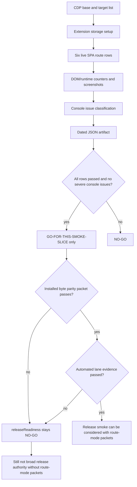

# FilterTube Release Live YouTube SPA Smoke Boundary - Current Behavior - 2026-05-25

Status: audit-only release boundary. Runtime behavior is unchanged.

This boundary separates the automated whitelist/cache proof that now exists
from the live YouTube SPA confidence that is still missing before a release
claim. It exists because the reported regression was experiential: recent
whitelist/cache work made YouTube navigation feel slower during SPA route
changes. Source-derived tests can prove timer coalescing and duplicate cache
dedupe, but they cannot prove real page responsiveness, YouTube hydration
timing, extension load order, or user-visible false-hide/leak behavior in a
live browser session.

## Current Decision

```text
runtime right-rail timer coalescing proof: automated
runtime learned-map duplicate DOM-work proof: automated
full runtime audit suite status: pass in local node runtime
live YouTube SPA smoke status: missing
live smoke evidence template: docs/audit/artifacts/release-live-youtube-spa-smoke/template.json
live smoke runner contract rows: 12
managed control smoke manual rows: 6
live smoke artifact verifier status: defined
runner/template source anchors covered: 60
executed live smoke result artifacts committed: 0
release readiness from this slice: NO-GO until live smoke is recorded
release readiness from runner contract: NO-GO
runner installed-byte-parity release gate: NO-GO
runner automated-lane-evidence release gate: NO-GO
runtime behavior changed: no
```

## Evidence Already Covered

| Evidence | Current proof | Release meaning |
| --- | --- | --- |
| Right-rail timer fanout | `tests/runtime/right-rail-whitelist-observer-current-behavior.test.mjs` includes an executable timer harness proving mutation bursts schedule at most one immediate and one follow-up forced refresh while pending. | Good synthetic proof for the regression locus; not a live YouTube route transition. |
| Stale delayed pass guard | The same harness proves delayed timers no-op after the simulated route moves to `/watch`. | Good source-level SPA guard proof; not proof that YouTube's real navigation/hydration order is covered. |
| Learned-map duplicate rows | `tests/runtime/whitelist-cache-hot-path-boundary-current-behavior.test.mjs` proves unchanged `videoChannelMap` and `videoMetaMap` rows do not trigger duplicate background handoff or DOM rerun work. | Good duplicate-cache proof; not proof that live cache volume is acceptable. |
| Full runtime audit suite | `node --test --test-reporter=dot tests/runtime/*.test.mjs` passed after the narrow fixes. | Good local regression coverage; not release smoke. |

## Required Live Smoke Matrix

Before calling the whitelist/cache regression release-ready, record a live
browser pass with the extension loaded from the current worktree:

| Row | Required route/action | Required observation |
| --- | --- | --- |
| `FT-LIVE-SPA-00-home-to-search` | Start on YouTube Home in whitelist mode, navigate to a search results page without full reload. | No long visible stall, no repeated forced refresh loop, expected non-allowed cards hidden only after intended identity decision. |
| `FT-LIVE-SPA-01-search-to-channel` | From search, open a channel page through normal YouTube SPA navigation. | Channel content remains usable; whitelist behavior does not hide channel scaffolding while identity hydrates. |
| `FT-LIVE-SPA-02-channel-to-watch` | Open a video from the channel page. | Player, title, owner row, metadata, and watch controls remain visible as expected; right-rail does not leak or false-hide due to stale timers. |
| `FT-LIVE-SPA-03-watch-to-home` | Navigate away from watch to Home using YouTube navigation. | No stale delayed watch-route timer forces a broad reprocess after the route changes. |
| `FT-LIVE-SPA-04-watch-rail-scroll` | Scroll the watch page right rail and observe recommendation hydration. | No runaway mutation/timer fanout; allowed/non-allowed recommendations match whitelist expectations. |
| `FT-LIVE-SPA-05-cache-repeat-navigation` | Repeat Home/Search/Watch navigation after learned-map rows have been populated. | Duplicate learned rows do not visibly slow later navigation or trigger repeated DOM flicker. |

Managed parent/caregiver changes require these additional manual rows in the
same dated artifact:

| Row | Required route/action | Required observation |
| --- | --- | --- |
| `FT-MANAGED-LIVE-00-protected-profile-preflight` | Open the extension dashboard as a parent/account profile and confirm the protected target profile, managed link, and installed extension identity before touching YouTube. | Parent/account authority is active, the protected profile is not the admin authority, and the artifact records parent/protected profile ids without PINs or plaintext rule values. |
| `FT-MANAGED-LIVE-01-main-kids-route-gate` | Apply a Main/Kids viewing-space policy for the protected profile and open the denied YouTube surface. | The denied surface is blocked by the managed route gate before usable YouTube content remains available, while the allowed surface still opens. |
| `FT-MANAGED-LIVE-02-time-budget-active-tab` | Set a small protected-profile daily YouTube budget and keep an active YouTube tab open long enough to consume budget. | The background-owned active-tab budget decreases across SPA navigation/reload and does not count when no managed time policy is active. |
| `FT-MANAGED-LIVE-03-zero-budget-timeout-overlay` | Set a zero or already-exhausted protected-profile budget and reload/open YouTube. | The protected timeout overlay appears, is not dismissible by child authority, and normal FilterTube blocklist/whitelist behavior is not used as the time-limit authority. |
| `FT-MANAGED-LIVE-04-parent-history-redaction` | Open protected action history after a managed policy accept/reject or time-limit change. | Parent-visible history shows accepted/rejected outcomes, policy scope, revision, and redacted labels without plaintext rules, PINs, private keys, ciphertext, or raw policy JSON. |
| `FT-MANAGED-LIVE-05-no-policy-no-work` | Switch to a profile with no managed policy/time limit and repeat one Home/Search/Watch navigation. | No managed provider pull loop, time-limit heartbeat, timeout overlay, or extra YouTube observer/timer work runs when no managed policy is applicable. |

## Required Recording Fields

```text
browser name/version
extension build/source path
profile/list-mode settings
whitelist entries used
route sequence
observed stall or no-stall
observed false-hide/leak result
console error summary
manual timestamp
tester initials
```

## Evidence Template

The required live smoke pass has a structured template:

```text
docs/audit/artifacts/release-live-youtube-spa-smoke/template.json
```

The template is intentionally `template-not-executed` and keeps
`smokeSliceReadiness` and `releaseReadiness` at `NO-GO`. Schema version 4
also carries an `installedByteParity` block for
`FT-WLCACHE-SPA-PACKET-01-installed-profile-bytes`; the template block is
`NO-GO` because it has no visible profile, active tab, content-script marker,
or reload timestamp evidence. The template may be copied into a dated evidence
artifact after a real browser run, but the template itself must not be treated
as proof that live YouTube SPA smoke or installed byte parity is complete.
Schema version 4 adds `managedControlSmoke`; it is `applicable:false` for
ordinary whitelist/performance live SPA runs, but managed parent/caregiver,
protected-profile sync, viewing-space, time-limit, Nanah, mailbox, or
local-network changes must mark it applicable and pass every managed row.

## Executable Runner Contract

The runner at
`docs/audit/artifacts/release-live-youtube-spa-smoke/run-live-smoke.mjs`
defines how a future dated smoke artifact must be generated. This is contract
evidence only; the runner has not been executed for this audit slice.

```text
live smoke runner contract rows: 12
managed control smoke manual rows: 6
runner/template source anchors covered: 60
executed live smoke result artifacts committed: 0
runner smoke-slice readiness can pass without release readiness: yes
runner release readiness without installed byte parity: NO-GO
runner release readiness without automated lane evidence: NO-GO
runner output accepted as release proof now: NO-GO
template accepted as release proof now: NO-GO
installed Chrome CDP preflight status: unavailable on 2026-05-31
runtime behavior changed: no
```

The verifier at
`docs/audit/artifacts/release-live-youtube-spa-smoke/verify-live-smoke-artifact.mjs`
defines the acceptance gate for future dated artifacts:

```bash
node docs/audit/artifacts/release-live-youtube-spa-smoke/verify-live-smoke-artifact.mjs docs/audit/artifacts/release-live-youtube-spa-smoke/<artifact>.json
```

A dated artifact is not release-ready until this verifier returns zero errors.
The verifier rejects the template, failed/missing route rows, console issues,
blank recording fields, stale row order, missing automated lane evidence,
automated lane evidence that does not cover every required lane, and missing
installed byte parity.
For managed-control logical changes, the verifier also rejects the artifact
unless `managedControlSmoke.applicable=true` and every managed-control row
passes with parent/protected profile evidence.
The runner uses the same known `test:*` lane vocabulary for its own
`releaseReadiness` decision, so an artifact cannot self-report release smoke
readiness from matching but invalid lane names.

The runner reads the automated lane proof for `changeContext` from these
environment variables before `npm run smoke:youtube`:

```text
FILTERTUBE_LOGICAL_CHANGE_TYPE
FILTERTUBE_REQUIRED_LANES
FILTERTUBE_AUTOMATED_PROOF_COMMAND
FILTERTUBE_AUTOMATED_PROOF_STATUS=passed
FILTERTUBE_AUTOMATED_PROOF_SUMMARY
FILTERTUBE_AUTOMATED_PROOF_LANES
```

| Row | Source anchors | Contract meaning | Current release status |
| --- | --- | --- | --- |
| `FT-LIVE-RUNNER-00-cdp-binding` | `run-live-smoke.mjs:9`, `run-live-smoke.mjs:26`, `run-live-smoke.mjs:49`, `run-live-smoke.mjs:367`, `run-live-smoke.mjs:368`, `run-live-smoke.mjs:369` | The run binds to `FILTERTUBE_CDP_BASE` or `http://127.0.0.1:9222`, fetches CDP version/target lists, and opens a WebSocket client. | Contract defined; no visible-tab proof recorded. |
| `FT-LIVE-RUNNER-01-extension-source-binding` | `run-live-smoke.mjs:8`, `run-live-smoke.mjs:10`, `run-live-smoke.mjs:584` | The artifact must record the extension source path, defaulting to the current repo root unless `FILTERTUBE_EXTENSION_PATH` overrides it. | Contract defined; no installed byte parity artifact recorded. |
| `FT-LIVE-RUNNER-02-storage-whitelist-setup` | `run-live-smoke.mjs:11`, `run-live-smoke.mjs:137`, `run-live-smoke.mjs:188`, `run-live-smoke.mjs:194`, `run-live-smoke.mjs:215`, `run-live-smoke.mjs:396` | The run seeds a known whitelist profile using Google Developers in `ftProfilesV4.default.main.mode=whitelist`. | Contract defined; no executed storage setup result committed. |
| `FT-LIVE-RUNNER-03-extension-context-selection` | `run-live-smoke.mjs:225`, `run-live-smoke.mjs:237`, `run-live-smoke.mjs:238`, `run-live-smoke.mjs:257`, `run-live-smoke.mjs:266`, `run-live-smoke.mjs:270` | Storage setup may use the extension service worker/page target or an isolated page context with `chrome.storage.local`. | Contract defined; automation-profile proof is not visible-tab proof. |
| `FT-LIVE-RUNNER-04-page-snapshot-counters` | `run-live-smoke.mjs:277`, `run-live-smoke.mjs:291`, `run-live-smoke.mjs:292`, `run-live-smoke.mjs:296`, `run-live-smoke.mjs:297`, `run-live-smoke.mjs:298`, `run-live-smoke.mjs:299`, `run-live-smoke.mjs:300`, `run-live-smoke.mjs:301`, `run-live-smoke.mjs:302` | Each row records live DOM/runtime counters for FilterTube readiness, hidden elements, whitelist-pending markers, stamped ids, and core watch UI. | Contract defined; no live counters committed. |
| `FT-LIVE-RUNNER-05-route-row-execution` | `run-live-smoke.mjs:315`, `run-live-smoke.mjs:404`, `run-live-smoke.mjs:430`, `run-live-smoke.mjs:456`, `run-live-smoke.mjs:492`, `run-live-smoke.mjs:512`, `run-live-smoke.mjs:534` | The runner executes the six required SPA rows: Home/Search, Search/Channel, Channel/Watch, Watch/Rail Scroll, Watch/Home, and Cache Repeat Navigation. | Contract defined; all template rows remain missing. |
| `FT-LIVE-RUNNER-06-console-issue-classification` | `run-live-smoke.mjs:350`, `run-live-smoke.mjs:569`, `run-live-smoke.mjs:591`, `template.json:21`, `template.json:66` | Severe runtime exceptions, warnings, and errors must be classified in the artifact before release readiness can be claimed. | Contract defined; no console evidence committed. |
| `FT-LIVE-RUNNER-07-screenshot-artifacts` | `run-live-smoke.mjs:309`, `run-live-smoke.mjs:340`, `run-live-smoke.mjs:382`, `run-live-smoke.mjs:383`, `run-live-smoke.mjs:608` | Each row can capture a screenshot under a dated artifact directory, and the summary must report that directory. | Contract defined; no dated screenshots committed. |
| `FT-LIVE-RUNNER-08-output-artifact-schema` | `run-live-smoke.mjs:653`, `run-live-smoke.mjs:655`, `run-live-smoke.mjs:657`, `run-live-smoke.mjs:658`, `run-live-smoke.mjs:669`, `run-live-smoke.mjs:670`, `run-live-smoke.mjs:671`, `run-live-smoke.mjs:689`, `run-live-smoke.mjs:693`, `run-live-smoke.mjs:694`, `run-live-smoke.mjs:695` | The runner writes a dated JSON artifact with row statuses, route sequence, stall timing text, false-hide/leak summary, smoke-slice readiness, release readiness, installed-byte-parity verdict, and console summary. | Contract defined; no dated JSON result committed. |
| `FT-LIVE-RUNNER-09-installed-byte-parity-gate` | `run-live-smoke.mjs:2`, `run-live-smoke.mjs:224`, `run-live-smoke.mjs:232`, `run-live-smoke.mjs:256`, `run-live-smoke.mjs:262`, `run-live-smoke.mjs:266`, `run-live-smoke.mjs:273`, `run-live-smoke.mjs:274`, `run-live-smoke.mjs:275`, `run-live-smoke.mjs:287`, `run-live-smoke.mjs:288`, `run-live-smoke.mjs:652`, `run-live-smoke.mjs:658`, `run-live-smoke.mjs:673`, `run-live-smoke.mjs:681`, `run-live-smoke.mjs:682`, `template.json:26`, `template.json:59`, `template.json:104`, `template.json:106` | The runner now records source hashes and the installed-byte-parity packet fields separately from route smoke. It may report `GO-FOR-THIS-SMOKE-SLICE`, but `releaseReadiness` remains `NO-GO` unless installed byte parity passes. | Contract hardened; installed byte parity remains missing. |
| `FT-LIVE-RUNNER-10-template-non-evidence-guard` | `template.json:2`, `template.json:3`, `template.json:4`, `template.json:5`, `template.json:6`, `template.json:26`, `template.json:62`, `template.json:100`, `template.json:104`, `template.json:105`, `template.json:106`, `template.json:107`, `template.json:108` | The template is explicitly `template-not-executed`; all required rows are `missing`, installed byte parity is `NO-GO`, and every template/missing/failure/byte-parity-missing path keeps readiness at `NO-GO`. | Contract defined; template is not release evidence. |
| `FT-LIVE-RUNNER-11-automated-lane-evidence-gate` | `run-live-smoke.mjs:224`, `run-live-smoke.mjs:238`, `run-live-smoke.mjs:674`, `run-live-smoke.mjs:675`, `run-live-smoke.mjs:681`, `run-live-smoke.mjs:697`, `template.json:7`, `template.json:111`, `verify-live-smoke-artifact.mjs:22`, `verify-live-smoke-artifact.mjs:69`, `verify-live-smoke-artifact.mjs:95` | A dated artifact must carry `changeContext.logicalChangeType`, known required lanes, and passed automated lane evidence whose `lanes` cover every required lane before manual live smoke can support release readiness. | Contract hardened; automated lane evidence remains missing in the template. |

## Installed Chrome CDP Preflight - 2026-05-31

The runner still requires a CDP endpoint for the same installed Chrome session
that carries the user-visible FilterTube extension. A read-only preflight in the
current desktop session found Chrome running, but
`http://127.0.0.1:9222/json/version` and `/json/list` were unavailable. The
runner was therefore not executed, no storage was seeded, and no live smoke
artifact was written.

```text
installed Chrome CDP preflight rows: 4
Chrome running process observed: yes
CDP endpoint checked: http://127.0.0.1:9222/json/version
CDP endpoint status: unavailable
live smoke runner executed: no
executed live smoke result artifacts committed: 0
installed Chrome CDP preflight accepted as live smoke proof: NO-GO
release readiness from CDP preflight: NO-GO
runtime behavior changed: no
```

ASCII flow:

```text
CDP base + target list
  -> extension storage setup through extension or isolated context
  -> six live YouTube SPA rows
  -> per-row DOM/runtime snapshot + optional screenshot
  -> console issue classification
  -> dated JSON artifact
  -> smoke-slice readiness may pass when every row passes and issues are classified
  -> release readiness remains NO-GO unless installed byte parity and automated lane evidence also pass
```



Still not broad release authority without installed-byte parity, automated lane evidence, and route-mode packets.

## Connected Chrome Tab Inventory Recheck - 2026-05-31

After the CDP preflight, a separate read-only connected-Chrome inventory was
available. It proved browser communication, but did not expose a relevant
YouTube, YouTube Kids, FilterTube dashboard, or installed extension tab to use
as the live smoke target. No tab was claimed or mutated, and raw unrelated tab
titles/URLs were not committed.

```text
connected Chrome inventory endpoint reachable: yes
connected open top-level tabs observed: 45
connected relevant YouTube/FilterTube tabs observed: 0
tab claimed or mutated by connector recheck: no
raw tab titles or URLs committed: no
live smoke runner executed after connector recheck: no
installed-byte parity artifact written: no
production console runtime sample collected: no
release readiness from connector recheck: NO-GO
runtime behavior changed by connector recheck: no
```

| Row | Connector observation | Smoke consequence |
| --- | --- | --- |
| `FT-LIVE-CONNECTOR-00-communication` | The connected Chrome endpoint returned an open-tab inventory. | Communication exists, but no route row ran. |
| `FT-LIVE-CONNECTOR-01-target-absence` | The relevant target count was zero. | The six live SPA rows could not be sampled. |
| `FT-LIVE-CONNECTOR-02-no-mutation` | No claim, navigation, reload, storage seed, or script probe was performed. | The recheck is privacy-preserving orientation only. |
| `FT-LIVE-CONNECTOR-03-byte-parity-gap` | No active tab marker, content-script hash, service-worker hash, or reload timestamp was collected. | Installed-byte parity remains missing. |
| `FT-LIVE-CONNECTOR-04-console-gap` | No active tab was available for console sampling. | Production console runtime sampling remains missing. |

## Explicit Non-Claim

The current automated suite is allowed to support the narrow runtime fixes, but
it must not be used as proof of any of these claims:

```text
live YouTube SPA smoke complete: NO
release package ready because runtime tests pass: NO
public performance claim ready: NO
watch/right-rail whitelist authority complete: NO
broader whitelist optimization complete: NO
JSON-first filtering release-ready: NO
```

## Related Proof

- `docs/audit/FILTERTUBE_RIGHT_RAIL_WHITELIST_OBSERVER_CURRENT_BEHAVIOR_2026-05-19.md`
- `docs/audit/FILTERTUBE_WHITELIST_CACHE_HOT_PATH_BOUNDARY_CURRENT_BEHAVIOR_2026-05-25.md`
- `docs/audit/FILTERTUBE_WHITELIST_PENDING_INTAKE_IMPLEMENTATION_READINESS_GATE_CURRENT_BEHAVIOR_2026-05-25.md`
- `docs/audit/FILTERTUBE_FIRST_OPTIMIZATION_IMPLEMENTATION_READINESS_GATE_CURRENT_BEHAVIOR_2026-05-24.md`
- `docs/audit/FILTERTUBE_RELEASE_PACKAGE_PARITY_AUDIT_2026-05-18.md`

## Method Semantic Proof Gap Boundary

`docs/audit/FILTERTUBE_METHOD_SEMANTIC_PROOF_GAP_INDEX_CURRENT_BEHAVIOR_2026-05-25.md`
is a required source input before this release smoke boundary can support a
broad runtime optimization or JSON-first promotion. Current proof pins:

```text
method semantic proof gap files covered: 69
method semantic proof gap lexical callables covered: 5836
files with complete per-callable semantic proof: 0
lexical callables requiring semantic proof before behavior changes: 5836
affected callable semantic proof: NO-GO
runtime behavior changed: no
```

This boundary does not close the audit goal. It only prevents a narrower green
automated proof from being treated as live YouTube SPA release proof.
