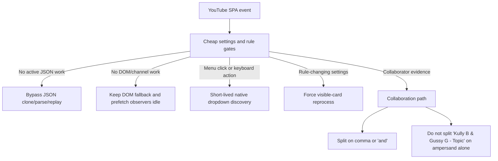
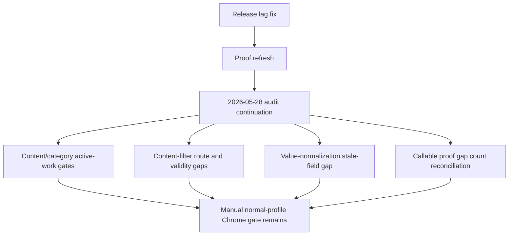
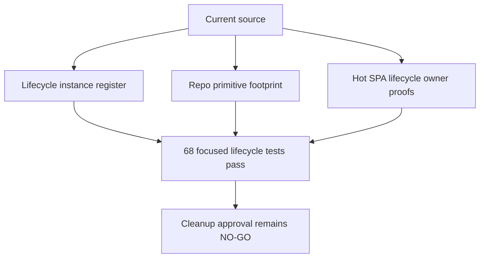

# FilterTube Release Regression: Lag, Native Menus, Blocklist Refresh

Date: 2026-05-26

## Scope

This note captures the release-blocking regression path found during the codebase audit:

- YouTube lag with an empty or light blocklist after recent whitelist/profile work.
- Comment 3-dot native menus opening once and then becoming invisible.
- Main blocklist keywords visible in the popup but not applied to existing YouTube cards.
- Home/Shorts quick-cross affordances missing after startup/settings races.

## Findings

1. **No-rule runtime work was too eager.**
   The content bridge could initialize MAIN-world JSON filtering and quick-block/menu observers before knowing whether active rules existed. Empty blocklist installs still paid route, observer, listener, and parsing costs on SPA navigation.

2. **Reusable YouTube dropdown state was being poisoned.**
   `forceCloseDropdown()` previously wrote hidden inline state onto native desktop dropdown/popup nodes. YouTube reuses those nodes for comment menu buttons, so later clicks could pause scroll/focus without painting the menu.
   The follow-up close audit also found that the stale forced-hidden repair must not run from dropdown visibility mutations: outside-click close changes the same attributes. The current repair runs only during an explicit menu-open scan.
   A later manual check found the inverse edge: after preventing hidden-state poisoning, some FilterTube-enriched native comment dropdowns did not close on outside selection. `setupMenuObserver()` now installs a capture-phase pointer fallback that closes only visible dropdowns containing `.filtertube-block-channel-item`, leaves plain native YouTube dropdowns alone, and routes closure through `forceCloseDropdown()`/Escape instead of writing reusable hidden state directly.

3. **Storage refresh coalescing could drop forced reprocess.**
   A map-only `videoChannelMap`/`videoMetaMap` refresh can schedule a non-forcing timer. If a keyword/profile change arrives before that timer fires, the old scheduler returned early and lost `forceReprocess:true`. The page then held the new settings but skipped already-processed visible cards.

4. **Main blocklist keyword aliases disagreed.**
   The popup/StateManager write the main blocklist under `ftProfilesV4.profiles[active].main.keywords`, but the background compiler preferred `main.blockedKeywords` whenever that array existed. A stale or empty alias could mask visible keywords such as `shakira`.

5. **Quick-cross setup could miss first settings delivery.**
   Quick-block affordance setup was correctly lazy, but a settings-load race could leave it unstarted after the content bridge received settings. Deep Home/Shorts markup also exceeded the older bounded parent walk from the pointer target.

6. **Topic bylines could be mistaken for collaborations.**
   The watch/right-rail collaboration warmup path split byline text on `&`.
   A normal music Topic display label such as `Kully B & Gussy G - Topic`
   could therefore look like two collaborators before stronger collaboration
   evidence was proven.

## Dated Behavior Change Log

```text
2026-05-25
  Empty-install YouTube SPA lag traced to old always-on quick-block and
  fallback-menu lifecycle work, with recent whitelist paths exposing the cost.

2026-05-26
  No-work gates, lazy menu/quick-block setup, refresh force-reprocess upgrade,
  main keyword alias priority, and native dropdown close repair were added.

2026-05-27
  Music Topic ampersand bylines stopped entering collaborator mode from `&`
  alone. Runtime provenance docs were refreshed to 514 runtime test files,
  4553 top-level runtime test declarations, and 528 audit docs under
  `docs/audit`.
  Source-derived release-risk registers were refreshed for content-bridge
  lifecycle callbacks, selector sites, top-level methods, repo selector
  authority, lifecycle source counts, direct hide writers, and whitelist
  pending no-work anchors.
  Background script injection trust and batch whitelist import persistence
  source pins were refreshed after the lag/menu/runtime edits changed source
  file fingerprints and two source anchors without changing those behaviors.
  Diagnostic logging source counts and candidate obligation binding anchors were
  refreshed so optimization planning reflects the current no-work fetch/XHR
  names and current console side-effect surface.
  Content-bridge main-world dispatch and prefetch lifecycle docs were refreshed
  to the current lazy/no-op-rerun source boundaries.
  Content-control style/JSON-first index and content-helper callable docs were
  refreshed to current source fingerprints and the pending-card-gated
  collaborator dialog helper surface.
  DOM fallback run-state/hide/route docs were refreshed to current source pins,
  including the no-work category rule: enabled-empty category filters do not
  wake DOM fallback, while enabled non-empty category filters still do.
  Prompt overlay, single-channel rule mutation, release artifact, Nanah vendor,
  generated local output, and native runtime sync manifest proof were refreshed
  after the release-facing audit docs caught up with the current build outputs.
  Source-of-truth, UI/settings callable counts, document-start no-work wording,
  first-optimization source-locus anchors/fingerprints/no-work/side-effect/
  teardown/diagnostic privacy, metric artifact gate counts, dirty-worktree
  runtime-change inventory, all-callable meta boundary, source-boundary audit
  artifact allowlist, metric artifact schema, and identity waterfall seed
  dispatcher anchors were refreshed after the no-work and alias fixes.
  DOM-only JSON-first hide/disable behavior docs and verifiers were refreshed:
  hide controls and disable autoplay/annotations now record that they bypass JSON
  engine work when no ordinary JSON rule is active, while active keyword/channel
  rules still enter JSON filtering. Focused proof passed 169/169 and the full
  runtime audit moved to 4500/4553 pass with 53 failures remaining.
  JSON comment shortcut/provenance/parity and network snapshot
  producer/consumer/stash/admission proofs were refreshed to the current no-work
  source layout. Focused proof passed 57/57 for JSON comments and 117/117 for
  network snapshots. The full runtime audit moved to 4528/4553 pass with 25
  failures remaining.
  Fetch/readiness/implementation-locus, video-meta/Kids comments,
  lifecycle/effect owner, P0/native/performance, and JSON metric artifact
  focused proofs were refreshed next. Focused proof passed for those clusters,
  including 23/23 fetch/readiness/implementation-locus, 38/38 video-meta and
  Kids comments, 17/17 lifecycle owner/effect, 5/5 P0 family, and 5/5 metric
  artifact gate. The full runtime audit then moved to 4551/4553 pass with 2
  documentation drift failures remaining; the metric artifact fingerprint row
  passed focused proof afterward, leaving the source-of-truth wording register
  as the final count/line-number refresh before the next full run.
```

## Runtime Flow Diagrams

Before the release fix, too much work could start before the extension proved
there was active rule work:

```text
YouTube SPA mutation / navigation
        |
        v
content bridge startup
        |
        +--> JSON clone/parse/replay
        +--> DOM fallback mutation scan
        +--> quick-block sweeps / body observation
        +--> fallback menu body scan
        +--> whitelist pending selector traversal
        |
        v
even empty blocklist pages paid repeated work
```

After the release fix, cheap gates run first and the expensive paths stay lazy:

```text
YouTube SPA mutation / navigation
        |
        v
settings + active-rule gate
        |
        +-- no active JSON work --> pass through response without clone/parse
        +-- no DOM/channel work --> keep fallback/prefetch observers disconnected
        +-- no menu interaction --> keep native dropdown discovery unarmed
        +-- quick-block needed --> hover/visible-card path only
        |
        v
visible cards reprocess only when rule-changing settings require it
```



## Fix Proof

- `tests/runtime/storage-refresh-force-reprocess-coalescing-current-behavior.test.mjs`
  proves a pending map-only refresh is upgraded when `ftProfilesV4` changes before the timer fires.
- `tests/runtime/main-profile-blocklist-keyword-alias-current-behavior.test.mjs`
  proves background compilation now prefers `main.keywords` before the migration alias and save/mode-switch paths keep the alias synchronized.
- `tests/runtime/native-dropdown-close-state-current-behavior.test.mjs`
  proves desktop native dropdowns are not permanently hidden by FilterTube close handling and, with executable fake-DOM coverage, that outside pointer selection closes only visible FilterTube-injected dropdowns while leaving plain native YouTube dropdowns, hidden dropdowns, inside clicks, and 3-dot button clicks under YouTube's control.
- `tests/runtime/empty-install-idle-observer-budget-current-behavior.test.mjs`
  proves empty desktop installs do not attach the old eager quick-block body observation, fallback menu body observer, or warmup interval.
- `tests/runtime/quick-block-block-menu-affordance-boundary-current-behavior.test.mjs`
  proves quick-block and menu affordance gates remain explicit while the action UI stays available outside whitelist mode.
- `tests/runtime/p0-no-work-current-behavior.test.mjs`,
  `tests/runtime/seed-fetch-no-work-list-mode-boundary-current-behavior.test.mjs`, and
  `tests/runtime/seed-xhr-no-work-list-mode-boundary-current-behavior.test.mjs`
  prove disabled, missing-settings, and empty-rule YouTubei fetch/XHR paths pass through before clone/parse/stringify/body override work.
- `tests/runtime/content-bridge-collaborator-identity-promotion-handoff-current-behavior.test.mjs`
  proves ampersand-only Topic/right-rail bylines such as
  `Kully B & Gussy G - Topic` do not enter collaborator mode without stronger
  evidence such as `N more`, JSON/showSheet, avatar-stack, or distinct channel
  links.

Focused release regression command:

```bash
node --test --test-reporter=spec tests/runtime/quick-block-block-menu-affordance-boundary-current-behavior.test.mjs tests/runtime/empty-install-idle-observer-budget-current-behavior.test.mjs tests/runtime/block-channel-method-semantic-register-current-behavior.test.mjs tests/runtime/dom-target-source-current-behavior.test.mjs tests/runtime/p0-compiled-rule-state-current-behavior.test.mjs tests/runtime/active-rule-authority-current-behavior.test.mjs tests/runtime/main-profile-blocklist-keyword-alias-current-behavior.test.mjs tests/runtime/storage-refresh-force-reprocess-coalescing-current-behavior.test.mjs tests/runtime/native-dropdown-close-state-current-behavior.test.mjs tests/runtime/background-compiled-cache-invalidation-lifecycle-boundary-current-behavior.test.mjs tests/runtime/compiled-settings-profile-list-mode-assembly-boundary-current-behavior.test.mjs tests/runtime/compiled-cache-authority-current-behavior.test.mjs tests/runtime/right-rail-whitelist-observer-current-behavior.test.mjs tests/runtime/json-first-network-snapshot-clone-isolation-current-behavior.test.mjs tests/runtime/enabled-master-switch-disabled-runtime-boundary-current-behavior.test.mjs tests/runtime/filter-all-toggle-list-target-current-behavior.test.mjs tests/runtime/content-bridge-menu-action-list-target-current-behavior.test.mjs tests/runtime/background-method-semantic-register-current-behavior.test.mjs tests/runtime/p0-no-work-current-behavior.test.mjs tests/runtime/p0-endpoint-policy-current-behavior.test.mjs tests/runtime/p0-network-authority-current-behavior.test.mjs tests/runtime/seed-network-current-behavior.test.mjs tests/runtime/seed-fetch-no-work-list-mode-boundary-current-behavior.test.mjs tests/runtime/seed-xhr-no-work-list-mode-boundary-current-behavior.test.mjs tests/runtime/empty-install-performance-current-behavior.test.mjs tests/runtime/p0-lifecycle-current-behavior.test.mjs tests/runtime/page-runtime-lifecycle-authority-current-behavior.test.mjs
```

Latest 2026-05-26 focused result: 236 tests, 236 pass, 0 fail.

Latest 2026-05-27 focused release/collaborator proof:

```text
collaborator suite: 49/49 pass
release-risk menu/quick-block/blocklist/whitelist suite: 100/100 pass
new empty-install/refresh/native regression fixtures: 17/17 pass
source-derived register refresh suite: 41/41 pass
release-relevant selector/lifecycle/direct-hide/whitelist subset: 23/23 pass
storage/message/compiled-settings/synthetic-action callsite register suite: 17/17 pass
background/backup/learned-identity source-pin refresh suite: 27/27 pass
collaborator/dialog lifecycle proof refresh suite: 58/58 pass
background script injection trust + batch whitelist import proof refresh suite: 15/15 pass
diagnostic logging + candidate obligation binding proof refresh suite: 12/12 pass
content bridge main-world dispatch + prefetch lifecycle proof refresh suite: 14/14 pass
content-control style/JSON-first index + content-helper callable proof refresh suite: 14/14 pass
DOM fallback run-state/hide/route proof refresh suite: 31/31 pass
ledger/provenance suite: 743/743 pass
external navigation surface proof refresh suite: 7/7 pass
injector main-world dispatch + method-semantic register refresh suite: 15/15 pass
manifest permission feature-map proof refresh suite: 8/8 pass
profile management persistence proof refresh suite: 11/11 pass
subscription import lifecycle proof refresh suite: 8/8 pass
stats legacy metric proof refresh suite: 6/6 pass
storage payload quota proof refresh suite: 8/8 pass
security crypto payload proof refresh suite: 9/9 pass
root package metadata proof refresh suite: 7/7 pass
full runtime audit after security/root metadata refresh: 4380/4553 pass, 173 fail
prompt release overlay proof refresh suite: 6/6 pass
single-channel rule mutation persistence proof refresh suite: 11/11 pass
release build artifact claim proof refresh suite: 5/5 pass
Nanah vendor runtime session lifecycle proof refresh suite: 5/5 pass
generated local output + native sync manifest proof refresh suite: 11/11 pass
full runtime audit after 2026-05-27 release-facing metadata refresh: 4388/4553 pass, 165 fail
source-of-truth/UI-settings/document-start/source-locus proof refresh suites: 50/50 pass
first-optimization metric collector/source-owner/JSON metric gate proof suite: 23/23 pass
current dirty-worktree/source-boundary/all-callable hygiene proof refresh suite: 16/16 pass
identity waterfall + metric artifact schema proof refresh suite: 16/16 pass
full runtime audit after 2026-05-27 metric proof, dirty-boundary, and audit-hygiene refresh: 4409/4553 pass, 144 fail
JSON-first DOM-only hide/disable boundary proof refresh suite: 169/169 pass
collaborator Topic ampersand handoff proof spot-check: 11/11 pass
full runtime audit after 2026-05-27 DOM-only JSON-first hide/disable proof refresh: 4500/4553 pass, 53 fail
JSON comment shortcut/provenance proof refresh suite: 57/57 pass
JSON-first network snapshot proof refresh suite: 117/117 pass
full runtime audit after 2026-05-27 JSON comment and network snapshot proof refresh: 4528/4553 pass, 25 fail
fetch/readiness/implementation-locus proof refresh suite: 23/23 pass
video-meta and Kids comments proof refresh suite: 38/38 pass
lifecycle effect/owner proof refresh suite: 17/17 pass
P0, native sync, optimization, performance, and metric proof refresh suites: focused clusters pass
full runtime audit after 2026-05-27 P0/native/metric proof refresh: 4551/4553 pass, 2 fail
remaining rows after that run: metric artifact source fingerprint and source-of-truth wording count; metric artifact fingerprint focused proof then passed
source-of-truth wording register refresh: pending after this release note update, because these audit-note line numbers are part of that proof
wording register focused proof after release-note update: 5/5 pass
post-build generated-output artifact proof: 6/6 pass
final post-build full runtime audit: 4553/4553 pass, 0 fail, 29.3s
post-release audit continuation after BrowserLogoRail method-semantic addendum:
4554/4554 pass, 0 fail, 32.2s, audit-only with no extension runtime behavior
change
post-release audit continuation after Topic quick-block clean-state fixture:
4565/4565 pass, 0 fail, 39.3s, audit-only with no extension runtime behavior
change
post-release audit continuation after whitelist/cache SPA metric packet gate:
4570/4570 pass, 0 fail, 131.5s, audit-only with no extension runtime behavior
change
post-release audit continuation after content-filter field semantics contract
gate: 4575/4575 pass, 0 fail, 119.7s, audit-only with no extension runtime
behavior change
post-release audit continuation after content-filter field-effect manifest gate:
4581/4581 pass, 0 fail, 109.0s, audit-only with no extension runtime
behavior change
post-release audit continuation after content-filter field-effect route/surface matrix:
4587/4587 pass, 0 fail, 105.6s, audit-only with no extension runtime
behavior change
post-release audit continuation after content-filter route/surface no-work budget:
4593/4593 pass, 0 fail, 37.4s, audit-only with no extension runtime
behavior change
post-release audit continuation after settings refresh dirty-key consumer matrix:
4599/4599 pass, 0 fail, 38.0s, audit-only with no extension runtime
behavior change
post-release audit continuation after settings refresh dirty-key producer matrix:
4606/4606 pass, 0 fail, 40.9s, audit-only with no extension runtime

post-release audit continuation after settings refresh producer-consumer join matrix:
4613/4613 pass, 0 fail, 42.7s, audit-only with no extension runtime

post-release audit continuation after settings refresh optimization readiness boundary:
4621/4621 pass, 0 fail, 93.4s, audit-only with no extension runtime behavior change

post-release audit continuation after settings refresh optimization candidate binding matrix:
4628/4628 pass, 0 fail, 81.6s, audit-only with no extension runtime behavior change

post-release audit continuation after settings refresh optimization candidate evidence packet contract:
4635/4635 pass, 0 fail, 93.7s, audit-only with no extension runtime behavior change

post-release audit continuation after browser manifest package reference closure:
same full audit pass stayed green, audit-only with no product behavior delta;
four browser manifests reference existing files under copied package roots, with
24 combined unique referenced paths, 0 unresolved file references, 0 referenced
roots outside COMMON_DIRS, and 0 manifest content-script CSS refs
post-release audit continuation after browser manifest permission/resource snapshot:
same full audit pass stayed green, audit-only with no product behavior delta;
four browser manifests now have pinned permission, host, active-match,
web-accessible-resource, content-script world, and youtube-nocookie host-only
gap evidence, while build-time permission/resource/world validation remains
absent
post-release audit continuation after Chrome Default unpacked workspace byte snapshot:
audit-only installed-profile proof now pins Default Secure Preferences path to
the workspace root, stored version 3.3.2, absence of a packed Default
Extensions directory for the id, workspace manifest/package/content_bridge
hashes, and the content_bridge ampersand Topic fix token; active-tab byte
parity and reload timestamp remain NO-GO
git diff --check: pass
```

Latest package build result: `npm run build` passed and produced Chrome,
Firefox, and Opera `v3.3.1` archives.

## Release Invariants

- Blocklist mode: content matching active blocklist keywords/channels must hide.
- Whitelist mode: only matching allow-list content should remain visible, with unresolved non-whitelisted cards failing closed where required.
- Empty/no-rule mode: YouTube should not pay JSON engine or DOM scan work. Quick-block and menu affordances may keep minimal page-level entrypoints for first-rule/user-menu actions, but must not run periodic full-page sweeps, desktop body observers, or eager menu body observation.

## 2026-05-27 Audit Continuation Note

Installed Chrome extension provenance was narrowed without changing runtime
code. Sanitized `Chrome/Default/Secure Preferences` evidence shows extension id
`gkgjigdfdccckblmglboobikfcpeelio` is configured from the workspace root, has a
stored service worker registration version of `3.3.2`, and has active YouTube
host permissions. This does not yet prove an already-open YouTube tab is running
the latest content-script bytes, does not provide a reload timestamp, and does
not prove incognito runtime availability.

```text
Chrome Default profile
  -> Preferences: pinned id present, settings object absent
  -> Secure Preferences: settings object present, path is $WORKSPACE_ROOT
  -> stronger installed-path proof
  -> running-tab byte parity remains NO-GO
```

Follow-up incognito/profile boundary: the same sanitized profile probe found
the extension id only under the Default profile files and local extension
storage log. It did not find a second profile settings object, a separate
private user-data-dir settings object, or a positive incognito-enabled runtime
flag. Manual release tests therefore still need the visible profile with the
extension icon/site access and a reloaded YouTube tab before they can be treated
as testing the current workspace runtime.

## 2026-05-27 Direct Hide Audit Continuation

Shared hide/restore helper proof was extended without changing product runtime
code. The direct hide writer register now pins the source-order behavior for
four missing-provider scenarios in `toggleVisibility()`: one path throws before
visual mutation, and three paths mutate visual state before throwing. This keeps
the release rule intact: future optimization must prove provider load order,
stats policy, media policy, and restore semantics before touching hide writers.

```text
direct-hide missing-provider scenarios: 4
mutate-before-throw scenarios: 3
throw-before-visual-mutation scenarios: 1
provider guard checks in toggleVisibility: 0
provider try/catch wrappers in toggleVisibility: 0
runtime behavior changed: no
full runtime audit after this continuation: same green full-suite count as the
latest release evidence above
```

## 2026-05-27 Native Dropdown Audit Continuation

Native comment/dropdown close proof was strengthened without changing product
runtime code. The release bug fix was already in source; this continuation makes
the proof behavioral instead of source-text only by executing the
`setupMenuObserver()` outside-pointer fallback against fake dropdown nodes.

```text
visible native dropdown with FilterTube item -> forceCloseDropdown()
plain native YouTube dropdown              -> left alone
hidden FilterTube-injected dropdown        -> left alone
pointer inside dropdown                    -> left alone
pointer on 3-dot button                    -> left for YouTube
focused proof: 3/3 pass
runtime behavior changed: no
```

## 2026-05-27 Lifecycle Teardown Audit Continuation

Current teardown ownership proof was extended without changing product runtime
code. The dedicated teardown decision register now carries a dated owner-flow
map with ASCII and Mermaid diagrams for seed XHR page-global patches, injector
readiness cleanup, bridge prefetch observers, right-rail whitelist observation,
whitelist pending timers, DOM fallback observer reconnects, fallback menu
scanning, playlist popover cleanup, quick-block page lifecycle work, and DOM
fallback playlist/player guards.

```text
current teardown owner-flow rows: 11
focused teardown/gap proof: 13/13 pass
adjacent lifecycle proof: 78/78 pass
full runtime audit after this continuation: same green full-suite pass as the
latest release evidence above, 31.3s
runtime behavior changed: no
```

## 2026-05-29 Menu Lifecycle Report Contract Continuation

The menu observer/Kids passive lifecycle audit now carries the future report
contract required before changing native dropdown/menu lifecycle behavior. This
records 12 report rows and 20 required fields for explicit user action,
forced-hidden repair, visibility observers, deferred injection locks, bounded
discovery, outside-pointer close, identity injection, pending-fetch/stale-state
cleanup, Kids dedupe, startup fanout, cross-feature boundaries, and artifact
gates.

```text
menu lifecycle report contract rows: 12
required menu lifecycle report fields: 20
implementation-ready menu lifecycle report rows: 0
runtime menu lifecycle report approvals: 0
menu lifecycle optimization approval from report contract: NO-GO
full runtime audit after this continuation: 4635/4635 pass, 0 fail, 91.7s
runtime behavior changed: no
```

## 2026-05-29 Quick-Block Lifecycle Report Contract Continuation

The quick-block hover lifecycle audit now carries the future report contract
required before changing quick-cross lifecycle behavior. This records 12 report
rows and 20 required fields for route/surface/list-mode/device decisions,
first-rule affordance, native-overlay state, surface cache, viewport host
budget, hover intent, pointer recovery, sweep/observer admission, button DOM,
fallback action, optimistic hide, DOM fallback rerun, negative no-work proof,
and metric artifacts.

```text
quick-block lifecycle report contract rows: 12
required quick-block lifecycle report fields: 20
implementation-ready quick-block lifecycle report rows: 0
runtime quick-block lifecycle report approvals: 0
quick-block lifecycle optimization approval from report contract: NO-GO
full runtime audit after this continuation: 4635/4635 pass, 0 fail, 88.4s
runtime behavior changed: no
```

## 2026-05-29 Fallback Menu Action Report Contract Continuation

The fallback menu action-gate audit now carries the future report contract
required before changing fallback menu action behavior. This records 12 report
rows and 20 required fields for primary-gate parity, scanner admission,
popover ownership, target identity, filter-all state, mutation destination,
optimistic hide, forced refilter, rollback, cross-feature boundaries, and
artifact gates.

```text
fallback menu action report contract rows: 12
required fallback menu action report fields: 20
implementation-ready fallback menu action rows: 0
runtime fallback menu action approvals: 0
fallback menu behavior-change approval from report contract: NO-GO
full runtime audit after this continuation: 4636/4636 pass, 0 fail, 78.3s
runtime behavior changed: no
```

## 2026-05-28 Documentation Ledger Confirmation

The 2026-05-28 continuation stayed under `docs/audit` and did not add new
product-doc audit material. It records the content/category active-work audit,
content-filter validity gates, route/surface validity matrix, and value
normalization gaps that remain before JSON-first content filtering can be
promoted as a first-class authority.

```text
2026-05-26 release lag fix
  -> no-work gates, lazy menu/quick-block, keyword alias, dropdown repair
2026-05-27 proof refresh
  -> menu, quick-block, Topic byline, lifecycle, and register pins refreshed
2026-05-28 audit continuation
  -> content-filter validity, route/surface, and value-normalization gaps pinned
  -> callable proof gap ledgers reconciled to 5,883 lexical callables
  -> runtime behavior changed: no
```



## 2026-05-29 Source-Owner Map Draft-Readiness Count Rerun

The source-owner map draft-readiness continuation added one audit proof file
and reran the full runtime suite. This updates the count-reconciliation
evidence only; it does not approve first-optimization artifacts, JSON-first
promotion, whitelist behavior changes, or broad audit completion.

```text
full runtime audit after source-owner map draft-readiness continuation: 4643/4643 pass, 0 fail, 81.3s
runtime behavior changed: no
first-optimization artifact promotion from this rerun: NO-GO
full codebase audit completion from this rerun: NO-GO
```

## 2026-05-30 Hot SPA Lifecycle Current-Source Rerun

The hot YouTube SPA lifecycle slice was rerun against current source after the
release lag and collaborator/topic investigations. This did not add a duplicate
audit file and did not change runtime behavior. The rerun confirms the existing
source-derived lifecycle registers are fresh: 63 tracked JS/JSX/MJS source
files, 510 observer/listener/timer/frame lifecycle instances, 856 broader
lifecycle/side-effect primitives, and the 42 content-runtime
`document`/`window` listener rows still match current source.

```text
focused lifecycle proof command:
node --test --test-reporter=spec \
  tests/runtime/lifecycle-instance-register-current-behavior.test.mjs \
  tests/runtime/repo-lifecycle-primitive-coverage-current-behavior.test.mjs \
  tests/runtime/lifecycle-effect-budget-current-behavior.test.mjs \
  tests/runtime/page-runtime-lifecycle-authority-current-behavior.test.mjs \
  tests/runtime/lifecycle-teardown-decision-register-current-behavior.test.mjs \
  tests/runtime/menu-observer-kids-passive-lifecycle-boundary-current-behavior.test.mjs \
  tests/runtime/quick-block-hover-lifecycle-timer-boundary-current-behavior.test.mjs \
  tests/runtime/empty-install-idle-observer-budget-current-behavior.test.mjs

focused lifecycle proof result: 70/70 pass, 0 fail, 10.7s
runtime behavior changed: no
new standalone audit file created: no
lifecycle cleanup or pruning approval from this rerun: NO-GO
full codebase audit completion from this rerun: NO-GO
```

```text
current-source lifecycle rerun
  -> lifecycle instance register stayed source-fresh
  -> repo primitive footprint stayed source-fresh
  -> hot SPA owners stayed partial, not implementation-ready
  -> no runtime cleanup approval
```



## 2026-05-30 Full Runtime Freshness Rerun

After the context handoff restarted the lost long-running process handle, the
full runtime suite was rerun against current source. This updates only the
freshness of the executable current-behavior proof; it does not change extension
runtime behavior, approve JSON-first promotion, approve whitelist/cache
optimization, or close the broad codebase audit.

```text
full runtime proof command:
node --test --test-reporter=tap tests/runtime/*.test.mjs

stored TAP output: /private/tmp/filtertube-runtime-full-after-lifecycle-convergence.tap
full runtime proof result: 4663/4663 pass, 0 fail, 83.213s
runtime behavior changed: no
JSON-first promotion from this rerun: NO-GO
whitelist/cache optimization approval from this rerun: NO-GO
full codebase audit completion from this rerun: NO-GO
```
