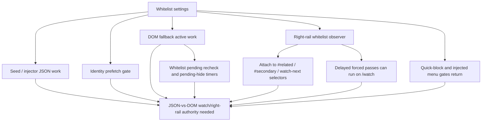

# FilterTube Right-Rail Whitelist Observer Current Behavior - 2026-05-19

Status: current-behavior audit proof with a narrow runtime hot-path fix. The
runtime now coalesces duplicate right-rail whitelist refresh timers and rechecks
mode before each delayed pass. This is not a broad whitelist policy patch,
watch-rail authority patch, JSON-first patch, or release package claim.

## Why This Slice Exists

Watch recommendations and right-rail cards are one of the user-visible areas
where whitelist mode can leak content or hide too much content while late
identity data is still hydrating. The current runtime has a dedicated function
named `installRightRailWhitelistObserver()`, and the current callback no longer
skips watch routes.

This is a split-authority issue:

```text
initializeDOMFallback()
  -> refreshFilterTubeRuntimeObservers()
    -> installRightRailWhitelistObserver()
    -> observes #related / #secondary / watch-next rail selectors
      -> scheduleWhitelistRefresh()
        -> requires listMode === whitelist
        -> coalesces one immediate and one follow-up forced applyDOMFallback() pass
        -> each delayed pass rechecks list mode before running
```

## Current Evidence

| Area | Current source evidence | Current behavior |
| --- | --- | --- |
| Observer install | `js/content_bridge.js:6282` calls `refreshFilterTubeRuntimeObservers()` after DOM fallback setup; that refresh calls `installRightRailWhitelistObserver()` only in whitelist mode. | The observer family starts through the runtime observer refresh path, but still lacks one central active-rule report. |
| Watch rail target | `js/content_bridge.js:1243-1249` attaches to `#related`, `#secondary`, `ytd-watch-next-secondary-results-renderer`, and `ytd-watch-flexy #secondary`. | The selector authority is watch/right-rail shaped. |
| Whitelist gate | `js/content_bridge.js:1211`, `js/content_bridge.js:1220`, `js/content_bridge.js:1228`, and `js/content_bridge.js:1284-1285` require `currentSettings?.listMode === 'whitelist'`. | It is mode-specific, but still not represented by `compiledRuleState` or `watchSurfaceControlAuthority`. |
| Watch route admission | `js/content_bridge.js:1218-1237` has no `/watch` route return in the runner or scheduler. | The right-rail observer can force reprocess on the watch route, but still lacks a first-class watch/right-rail authority and metric budget. |
| Forced reprocess | `js/content_bridge.js:1218-1237` stores immediate/follow-up timer IDs and routes both through `runWhitelistRefreshPass()`. | Mutation bursts can no longer stack duplicate timer pairs while a pass is pending. |
| Delayed-pass guard | `js/content_bridge.js:1218-1224` rechecks whitelist mode before `applyDOMFallback`; `js/content_bridge.js:1226-1237` checks mode and fallback availability before scheduling. | A pass scheduled before an SPA route swap can still force reprocess if whitelist mode remains active. |
| Navigation listener | `js/content_bridge.js:1256-1269` adds `yt-navigate-finish` listeners and calls the same scheduler. | Watch navigations are admitted by the same scheduler rather than a watch-specific rail authority. |

## Risk

This does not prove a new runtime bug by itself, but it makes the watch-rail
authority ambiguous:

- The function name and selectors imply watch/right-rail whitelist repair.
- The scheduler does not explicitly avoid `/watch`.
- Watch recommendations then depend on broader DOM fallback, JSON `/next`
  filtering, playlist/watch guards, and identity prefetch paths.
- A future performance optimization could remove a broader observer and
  accidentally change watch rail behavior because this dedicated observer is not
  represented by a first-class watch rail budget.
- Keeping `/watch` admitted still needs a watch-specific budget; the current fix
  only prevents duplicate stale forced passes from stacking.

## Current Verdict

The observer should remain classified as `current-gap`, not as proof that watch
right-rail whitelist hydration is solved. The performance-only improvement is:

```text
right-rail duplicate forced refresh fanout: reduced
watch-route delayed stale pass: admitted when whitelist mode remains active
watch/right-rail authority: still missing
runtime behavior changed: yes, timer coalescing only
```

Implementation remains blocked until a watch/right-rail authority records:

- surface and route,
- player/fullscreen state,
- list mode,
- active-rule state,
- identity-pending state,
- JSON `/next` versus DOM rail owner,
- forced reprocess budget,
- negative proof that metadata/player scaffolding stays visible,
- positive proof that matching/non-allowed rail cards are hidden only after the
  intended authority decides.

## Whitelist Observer Budget Matrix Addendum - 2026-05-27

This addendum records the whitelist-mode observer and transport budget as a
mode-specific release gap. It is audit-only. It does not change whitelist,
right-rail, DOM fallback, pending-hide, quick/menu, seed, injector, or watch
runtime behavior.

```text
whitelist mode
        |
        +--> seed/injector JSON work wakes for whitelist decisions
        +--> identity prefetch wakes for whitelist channel confidence
        +--> DOM fallback wakes because whitelist is fail-closed
        +--> whitelist pending timers can hide queued non-excluded cards
        +--> right-rail observer attaches to watch-shaped rail selectors
        |       |
        |       +--> delayed forced passes can run on /watch
        +--> quick-block and injected menu actions stay quiet in whitelist
        |
        v
watch/right-rail authority still missing
```



| Whitelist budget owner | Source pins | Current behavior | Remaining proof |
| --- | --- | --- | --- |
| JSON transport admission | `js/seed.js:234-238`, `js/injector.js:185-188` | Whitelist mode is active JSON work even when blocklist rules are empty. | Needs endpoint-by-endpoint parse/mutation budget and live timing proof. |
| Identity prefetch admission | `js/content_bridge.js:1006-1015`, `js/content_bridge.js:1311-1316` | Whitelist mode admits identity prefetch work for card channel confidence. | Needs route/surface cap, stale-map policy, and no-leak proof. |
| Right-rail observer install | `js/content_bridge.js:1210-1237`, `js/content_bridge.js:1256-1269` | Installs only in whitelist mode, attaches to watch-shaped rail selectors, and rechecks mode before delayed passes. | Admits `/watch`, but still lacks a first-class watch/right-rail work budget. |
| Whitelist pending timers | `js/content_bridge.js:6200-6268` | Owns one recheck timer, one pending-hide timer, a 160-candidate queue, native-overlay quiet gate, and root/search/channel/watch route exclusions before selector traversal. | Needs route policy, mutation budget, placeholder policy, and DOM fallback parity proof. |
| DOM fallback active predicate | `js/content/dom_fallback.js:2117-2184`, `js/content/dom_fallback.js:2220-2327`, `js/content/dom_fallback.js:4739-4891` | Whitelist mode keeps DOM fallback active and non-comment identity-less cards can fail closed when no whitelist rules are present. | Needs sibling-visible, metadata-visible, comment-safe, and watch/YTM/Kids fixtures. |
| Quick/menu quiet gates | `js/content/block_channel.js:1212-1296`, `js/content/block_channel.js:1993-2042`, `js/content_bridge.js:10725-10737` | Quick-block and injected menu entrypoints return in whitelist mode. | Needs proof that no alternate menu/fallback path creates block actions in whitelist mode. |

Current whitelist observer budget status:

```text
whitelist observer budget proof slices: 6
watch/right-rail whitelist authority: NO-GO
JSON-vs-DOM whitelist owner authority: NO-GO
active whitelist live trace authority: NO-GO
runtime behavior changed by this addendum: no
```

## Method Semantic Proof Gap Boundary

`docs/audit/FILTERTUBE_METHOD_SEMANTIC_PROOF_GAP_INDEX_CURRENT_BEHAVIOR_2026-05-25.md`
is a required source input before this whitelist surface can support runtime
optimization. Current proof pins:

```text
method semantic proof gap files covered: 69
method semantic proof gap lexical callables covered: 5720
files with complete per-callable semantic proof: 0
lexical callables requiring semantic proof before behavior changes: 5720
affected callable semantic proof: NO-GO
runtime behavior changed: no
```

These counts are audit-only blockers. They do not approve runtime
optimization, JSON-first behavior, whitelist behavior, metric collectors,
artifact creation, native sync, release package changes, or public claims.

## Runnable Proof

The current behavior is pinned by:

- `tests/runtime/right-rail-whitelist-observer-current-behavior.test.mjs`
- `docs/audit/FILTERTUBE_RELEASE_LIVE_YOUTUBE_SPA_SMOKE_BOUNDARY_CURRENT_BEHAVIOR_2026-05-25.md`

The test includes an executable timer harness for
`installRightRailWhitelistObserver()`: mutation bursts schedule at most one
immediate timer and one follow-up timer while they are pending; delayed timers
that fire after an SPA route switch to `/watch` can call
`applyDOMFallback(...)` when whitelist mode remains active; blocklist mode does not install this observer or
schedule forced refresh timers.

The release smoke boundary keeps the live YouTube SPA smoke status separate
from this automated proof. Passing this test is not enough to claim release
readiness until the live route matrix is recorded.

Runtime behavior changed only for duplicate timer fanout. The test remains
current-behavior proof. A future watch-rail correctness fix should update this
slice only after the new authority contract and fixtures exist.
