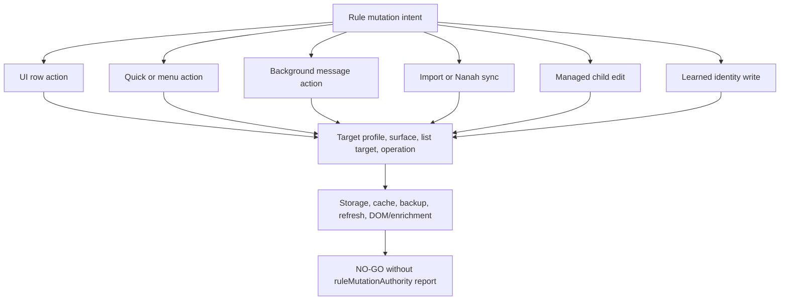

# FilterTube Rule Mutation Entrypoint Authority Audit - 2026-05-18

Status: current-behavior audit. This is not an implementation patch.

This slice answers a narrower question inside the full audit: every place that
can add, remove, transfer, import, sync, or toggle a rule should be visible as
an explicit mutation entrypoint. The current source does not have one central
rule-mutation authority. Instead, rule state can be written through UI rows,
StateManager, background actions, content-script quick/menu actions, profile
management, import/export, Nanah sync, and learned identity/cache messages.

## Source Boundary

Product source authority is `git ls-files`, not a filesystem-wide search.
Root-level JSON/HTML/TXT captures listed in `.gitignore` are evidence material
only. They are useful for discovering renderer and endpoint shapes behind
`docs/json_paths_encyclopedia.md` and `docs/youtube_renderer_inventory.md`, but
they are not packaged code and should not be committed wholesale. High-risk
claims from those captures must become minimal fixtures before behavior changes.

## Entrypoint Map

```text
Visible UI
  |
  +--> popup/tab add keyword/channel
  |      |
  |      +--> StateManager mutator
  |              |
  |              +--> saveSettings / persistMainProfiles
  |              +--> background addChannelPersistent / addWhitelistChannelPersistent
  |
  +--> RenderEngine row actions
  |      |
  |      +--> direct StateManager remove/toggle OR caller-provided child-profile handler
  |
  +--> list-mode controls
  |      |
  |      +--> background FilterTube_SetListMode / FilterTube_TransferWhitelistToBlocklist
  |      +--> saveManagedChildSurface for managed child profiles
  |
  +--> import / subscription import
         |
         +--> IO importV3 / importV3Encrypted
         +--> background FilterTube_BatchImportWhitelistChannels

Page/runtime actions
  |
  +--> quick block / fallback menu / Kids block
  |      |
  |      +--> background addFilteredChannel / FilterTube_KidsBlockChannel
  |
  +--> page-world learned metadata
         |
         +--> channelMap / videoChannelMap / videoMetaMap writes and DOM reruns

Sync actions
  |
  +--> Nanah scoped payload
         |
         +--> FilterTubeIO.saveProfilesV4 directly
```

## UI And StateManager Writers

| Path | Current authority | Proof | Risk |
| --- | --- | --- | --- |
| Main keyword add/remove/exact/comment | `StateManager.addKeyword()`, `removeKeyword()`, `toggleKeywordExact()`, and `toggleKeywordComments()` mutate either blocklist or whitelist arrays according to `state.mode`. | `js/state_manager.js:1338`, `1466`, `1511`; `js/tab-view.js:11034-11043`; `js/popup.js:1720` | Row action target is inferred from current mode, not stored on the row. Simultaneous allow/block needs explicit row action metadata. |
| Main channel add | `StateManager.addChannel()` chooses `addWhitelistChannelPersistent` or `addChannelPersistent` from `state.mode`. | `js/state_manager.js:1582-1617`; `js/tab-view.js:11131-11144`; `js/popup.js:1749` | The visible UI is not the only channel-add writer; background and content-script actions can also add rows. |
| Main channel remove / filter-all | `StateManager.removeChannel()` branches by mode; `toggleChannelFilterAll()` and channel-derived comment toggles return false in whitelist mode. | `js/state_manager.js:1826-1880`, `1903-1913`; `js/render_engine.js:1032-1046`, `1121-1156` | Current UI hides or rejects Filter All in whitelist mode; per-entry allow/block cannot reuse this mode-inferred behavior safely. |
| Kids keyword/channel UI | Kids mutators are exposed by `StateManager` and used by RenderEngine row handlers. | `js/state_manager.js:2435-2448`; `js/render_engine.js:490-508`, `937-941`, `1151-1155` | Main and Kids have parallel mutation paths with different background trust checks for whitelist/blocklist actions. |
| Managed child profile edits | `saveManagedChildSurface()` loads profiles, checks parent relationship, applies caller mutator, then writes `saveProfilesV4()` directly. | `js/tab-view.js:4252-4278`, `10315-10418`, `10574-10599` | This bypasses StateManager/background mutation reporting and needs the same future mutation report as normal profile edits. |
| `syncKidsToMain` | `StateManager.updateSetting('syncKidsToMain')` writes V4 and V3 profile state directly after the caller has passed UI lock gates. | `js/state_manager.js:1998-2085` | Cross-surface policy can be changed by any future caller of the primitive unless the mutation primitive itself has a lock/authority contract. |

## Background Writers

| Path | Current authority | Proof | Risk |
| --- | --- | --- | --- |
| `FilterTube_SetListMode` | Trusted extension-page sender only; writes active profile V4, clears legacy mirrors, invalidates compiled caches, schedules backup, and broadcasts refresh. | `js/background.js:3290-3492` | Reads `copyBlocklist` but currently merges and clears blocklist when switching to whitelist regardless of that flag. |
| `addWhitelistChannelPersistent` | Trusted extension-page sender; delegates to `handleAddFilteredChannel(..., 'main', '', 'whitelist')`. | `js/background.js:3498-3536` | Shares helper with content-script adds but has different sender/lock expectations. |
| `FilterTube_BatchImportWhitelistChannels` | Trusted extension-page sender; also checks active target profile and session authorization. | `js/background.js:3537-3570`, `3606-3631` | This is the strongest current profile-scoped rule writer. Other rule writers should reach the same authority level. |
| `FilterTube_KidsWhitelistChannel` | Trusted extension-page sender; writes Kids whitelist. | `js/background.js:3706-3758` | Kids whitelist and Kids block use different sender boundaries today. |
| `FilterTube_TransferWhitelistToBlocklist` | Trusted extension-page sender; merges allow lists back into block lists and clears whitelists. | `js/background.js:3759-3915` | Large profile mutation without shared mutation report or session-lock assertion. |
| `FilterTube_KidsBlockChannel` | No trusted UI sender guard; calls `handleAddFilteredChannel()` for Kids blocklist. | `js/background.js:3967-4008`; `js/content/block_channel.js:2037-2048` | Similar side effect to Kids whitelist, different trust class. |
| `addChannelPersistent` | No trusted UI sender guard; calls `handleAddFilteredChannel()` for Main blocklist. | `js/background.js:4095-4375`; `js/state_manager.js:1613-1617` | UI add and content-derived add can converge here, but the trusted sender class is implicit. |
| Secondary `addFilteredChannel` listener | No trusted UI sender guard; now forwards normalized `message.listType`, so helper can target whitelist when the sender explicitly asks for it. | `js/background.js:5244-5281`; `js/content_bridge.js:12805-12822`; `js/content/block_channel.js:1198-1208` | Native/fallback menu path still needs sender/list authority proof before it can be treated as a general whitelist add surface. |
| Secondary `toggleChannelFilterAll` listener | No trusted UI sender guard; writes `filterAll` through `handleToggleChannelFilterAll()`. | `js/background.js:5249-5258`, `6175-6258`; `js/content_bridge.js:12896-12900` | Another rule-row writer outside the primary action switch. |

## Import, Export, And Nanah Writers

| Path | Current authority | Proof | Risk |
| --- | --- | --- | --- |
| `FilterTubeIO.importV3()` | Can call `SettingsAPI.saveSettings()`, `saveProfilesV3()`, `saveProfilesV4()`, `writeStorage(channelMap)`, theme writes, and Nanah trusted-state writes. | `js/io_manager.js:1223-1704` | One import can rewrite multiple rule families and profile metadata without a pre-write mutation report. |
| `FilterTubeIO.importV3Encrypted()` | Decrypts then forwards to `importV3()` without forwarding `targetProfileId`. | `js/io_manager.js:1737-1748` | Encrypted and unencrypted import target authority can diverge. |
| `FilterTubeNanahAdapter.applyScopedPortablePayload()` | Merges or replaces Main/Kids profile sections and writes `saveProfilesV4()` directly. | `js/nanah_sync_adapter.js:168-249` | P2P sync can change rule arrays through a separate sanitizer and refresh path. |
| `FilterTubeNanahAdapter.applyIncomingEnvelope()` | Routes scoped payloads to direct scoped V4 writes and full/active payloads to `io.importV3()`. | `js/nanah_sync_adapter.js:351-375` | Sync behavior depends on scope and strategy, but no shared rule mutation report is produced. |

## Learned Identity And Cache Writers

These paths do not usually add visible blocklist rows, but they change the
identity maps that filtering depends on. A bad or spoofed identity write can
make a later legitimate rule match the wrong content.

| Path | Current authority | Proof | Risk |
| --- | --- | --- | --- |
| Page-world `FilterTube_UpdateVideoChannelMap` | Same-window page message is accepted, then content bridge persists `videoId -> channelId` before DOM ownership proof. | `js/content_bridge.js:5468-5490`; `js/background.js:4400`; `js/background.js:1933-1671` | Learned map poisoning can cause false channel matches. |
| Page-world `FilterTube_UpdateVideoMetaMap` | Same-window page message persists meta, touches DOM processed flags, and schedules rerun. | `js/content_bridge.js:5531-5555`; `js/background.js:4407`; `js/background.js:1958-1693` | Spoofed metadata can force reprocessing and alter duration/category/title decisions. |
| Page-world `FilterTube_UpdateCustomUrlMap` | Content bridge writes `channelMap` directly through storage APIs. | `js/content_bridge.js:5557-5568` | Bypasses background cache-aware map path and background invalidation assumptions. |
| `FilterTube_ApplySettings` | Caller payload becomes `compiledSettingsCache[targetProfile]` and is broadcast to matching tabs. | `js/background.js:4381-4394` | Runtime behavior can change without storage-derived settings truth. |

## Findings

1. **Rule mutation is not centralized.** The product has many legitimate
   writers, but no single mutation report that states actor, profile, surface,
   list target, before/after counts, storage keys, cache invalidation, backup
   trigger, and broadcast scope.

2. **Mode-inferred row semantics are the blocker for simultaneous allow/block.**
   Current entries do not carry `action: block|allow`. The target list is
   inferred from active mode in StateManager, RenderEngine, popup, tab-view,
   and background mode handlers.

3. **Trusted UI, content-script user action, page-world learned metadata, and
   background-internal writers are currently mixed by convention.** Some paths
   are sender-gated, some are not, and content-script writes have no explicit
   route/action capability class.

4. **Identity maps are rule inputs and must be audited like rules.** Even when
   a path does not add a blocked channel, it can make a channel rule match
   later through `channelMap`, `videoChannelMap`, `videoMetaMap`, collaborator
   metadata, or DOM stamps.

5. **Ignored captures are useful to prove renderer shape, not writer authority.**
   The raw files named in `.gitignore` should remain local evidence. The
   durable boundary is a minimal runtime fixture with source-family metadata.

## Required Future Contract

Before behavior changes in this area, add a `ruleMutationAuthority` contract
that records at least:

```text
actorClass:
  trustedUi | allowedYoutubeContentScript | ownedPageWorldRequest | backgroundInternal

target:
  profileId, profileType, surface, ruleFamily, listTarget

operation:
  add | remove | toggle | transfer | import | sync | learnedIdentityWrite

inputs:
  normalized user input, provenance, source confidence, route, tab/frame ids

effects:
  storage keys, V3/V4 changes, learned-map changes, cache invalidation,
  backup trigger, runtime broadcast targets

guards:
  profile lock, parent/child authority, sender class, route/surface allowlist,
  active rule state, schema sanitizer
```

## Minimum Fixtures Before Fixes

```text
rule_mutation_report_exists_for_state_manager_add_keyword
rule_mutation_report_exists_for_state_manager_add_channel
rule_mutation_report_exists_for_background_add_filtered_channel
rule_mutation_report_exists_for_kids_block_and_whitelist
rule_mutation_report_exists_for_list_mode_transfer
rule_mutation_report_exists_for_managed_child_edit
rule_mutation_report_exists_for_import_v3
rule_mutation_report_exists_for_nanah_scoped_apply
rule_mutation_report_exists_for_learned_identity_writes
content_script_channel_add_requires_allowed_youtube_action
page_world_identity_update_requires_owned_request
encrypted_import_preserves_target_profile_id
copy_blocklist_false_does_not_merge_or_clear_blocklist
```

These fixtures should be added before changing whitelist/blocklist semantics,
deleting fallback writers, or optimizing page/runtime work. Otherwise a fix can
close one entrypoint while leaving another writer with the same side effect.

## Rule Mutation Convergence Boundary - 2026-05-30

This addendum joins the split rule-mutation slices into one convergence
boundary. It is audit-only. It does not change runtime behavior, approve
blocklist/whitelist optimization, approve quick/menu rewrites, or approve
JSON-first promotion.

Source inputs:

| Source | Current proof used |
| --- | --- |
| `docs/audit/FILTERTUBE_P0_RULE_MUTATION_CURRENT_BEHAVIOR_2026-05-19.md` | P0 fixture names and the current `ruleMutationAuthority` blocker. |
| `docs/audit/FILTERTUBE_SINGLE_CHANNEL_RULE_MUTATION_PERSISTENCE_BOUNDARY_CURRENT_BEHAVIOR_2026-05-22.md` | Single-channel add paths, helper fanout, backup duplication, and menu/quick ingress rows. |
| `docs/audit/FILTERTUBE_BACKGROUND_ADD_FILTERED_CHANNEL_LIST_TARGET_CURRENT_BEHAVIOR_2026-05-23.md` | Secondary `addFilteredChannel` receiver list-target drop and helper target behavior. |
| `docs/audit/FILTERTUBE_CONTENT_BRIDGE_MENU_ACTION_LIST_TARGET_CURRENT_BEHAVIOR_2026-05-23.md` | Menu/fallback/direct action payload shape and missing list-target report. |
| `docs/audit/FILTERTUBE_FILTER_ALL_TOGGLE_LIST_TARGET_CURRENT_BEHAVIOR_2026-05-23.md` | Filter All toggle sender, profile/list-mode, comment-scope, cache, and backup gaps. |
| `docs/audit/FILTERTUBE_LIST_MODE_TRANSITION_PERSISTENCE_BOUNDARY_CURRENT_BEHAVIOR_2026-05-22.md` | List-mode transition, whitelist transfer, destructive migration, cache, refresh, and backup behavior. |
| `docs/audit/FILTERTUBE_BATCH_WHITELIST_IMPORT_PERSISTENCE_BOUNDARY_CURRENT_BEHAVIOR_2026-05-22.md` | Batch whitelist import persistence, dormant-mode behavior, profile/session checks, cache, backup, and refresh. |

Current convergence rows:

| Boundary row | Current source-backed finding | Implementation decision |
| --- | --- | --- |
| `rule_mutation_state_manager_mode_inferred_rows` | Main keyword/channel rows infer blocklist versus whitelist from `state.mode`; rows do not carry first-class allow/block action metadata. | `NO-GO` until row actions carry explicit profile, surface, list target, operation, and revision proof. |
| `rule_mutation_background_sender_split` | Background writers mix trusted UI paths with content-script-shaped and Kids block paths that lack the same sender gate. | `NO-GO` until every writer has actor class, sender proof, lock proof, and negative spoof fixture. |
| `rule_mutation_content_quick_menu_payload` | Quick-block/menu/fallback direct adds send `addFilteredChannel` payloads without a first-class list target, and optimistic UI effects can follow success. | `NO-GO` until menu actions have one decision artifact for actor, surface, profile, list target, filter-all state, optimistic hide, and refresh. |
| `rule_mutation_filter_all_comment_scope` | Filter All toggles are mode-sensitive in UI and accepted through a secondary background receiver without profile/list target or lock/session proof. | `NO-GO` until Filter All has explicit list-mode, comment-scope, storage/cache, and backup side-effect authority. |
| `rule_mutation_list_mode_transfer_copy_policy` | `FilterTube_SetListMode` and `FilterTube_TransferWhitelistToBlocklist` can merge, move, clear, invalidate caches, refresh tabs, and schedule backup. | `NO-GO` until destructive transitions have before/after reports, rollback proof, and copy-policy parity. |
| `rule_mutation_batch_whitelist_import_mode` | Batch whitelist import writes whitelist state, `channelMap`, cache invalidation, backup, and refresh while behaving differently when the active mode is not whitelist. | `NO-GO` until dormant-mode, session, profile, rollback, and refresh budget proof exists. |
| `rule_mutation_managed_child_direct_write` | Managed child edits use tab-view direct V4 writes and parent checks outside normal StateManager/background mutation reports. | `NO-GO` until child edits share mutation reports and lock/parent authority with normal row actions. |
| `rule_mutation_import_nanah_apply` | Plain import, encrypted import, Nanah scoped apply, and Nanah incoming envelopes write rule/profile state through IO paths with separate target-profile semantics. | `NO-GO` until import/sync actor, target profile, encryption, merge strategy, revision, and rollback proof are shared. |
| `rule_mutation_storage_cache_backup_refresh_fanout` | A single rule mutation can write V3/V4/root storage, invalidate compiled caches, schedule backup, refresh tabs, rerun DOM fallback, and trigger enrichment. | `NO-GO` until side-effect budgets and compiled-settings revision ownership exist per writer. |
| `rule_mutation_learned_identity_rule_input` | Learned identity maps and collaborator metadata are not visible rule rows but can change future rule matching and whitelist decisions. | `NO-GO` until learned identity writes are covered by provenance, TTL/cap, rollback, and rule-input authority. |

ASCII rule mutation convergence diagram: present

```text
rule mutation intent
  |
  +--> UI row action
  +--> quick/menu action
  +--> background message action
  +--> import / Nanah sync
  +--> managed child edit
  +--> learned identity write
        |
        v
  target profile + surface + list target + operation
        |
        v
  storage writes + cache invalidation + backup + refresh + DOM/enrichment

Implementation gate:
  no rule-mutation optimization until every writer has actor, lock, profile,
  list-target, storage/cache, backup/refresh, rollback, and spoof-negative proof.
```

Mermaid rule mutation convergence diagram: present



Current implementation boundary after this addendum:

```text
rule mutation convergence rows: 10
implementation-ready rule mutation convergence rows: 0
ruleMutationAuthority product source symbol: absent
mutationReport product source symbol: absent
runtime behavior changed by this addendum: no
rule mutation implementation approval: NO-GO
blocklist/whitelist mutation optimization approval: NO-GO
quick/menu mutation rewrite approval: NO-GO
Filter All mutation optimization approval: NO-GO
import/Nanah mutation optimization approval: NO-GO
storage/cache optimization approval from rule mutation: NO-GO
JSON-first promotion approval: NO-GO
release/public-claim use: NO-GO
```

## Method Semantic Proof Gap Boundary

`docs/audit/FILTERTUBE_METHOD_SEMANTIC_PROOF_GAP_INDEX_CURRENT_BEHAVIOR_2026-05-25.md`
is a required source input before this rule mutation entrypoint authority audit
can support runtime optimization or JSON-first promotion. Current proof pins:

```text
method semantic proof gap files covered: 69
method semantic proof gap lexical callables covered: 5836
files with complete per-callable semantic proof: 0
lexical callables requiring semantic proof before behavior changes: 5836
affected callable semantic proof: NO-GO
runtime behavior changed: no
```

These counts are audit-only blockers. They do not approve runtime
optimization, JSON-first behavior, method deletion, method merging, lifecycle
cleanup, no-work changes, or whitelist behavior changes.
